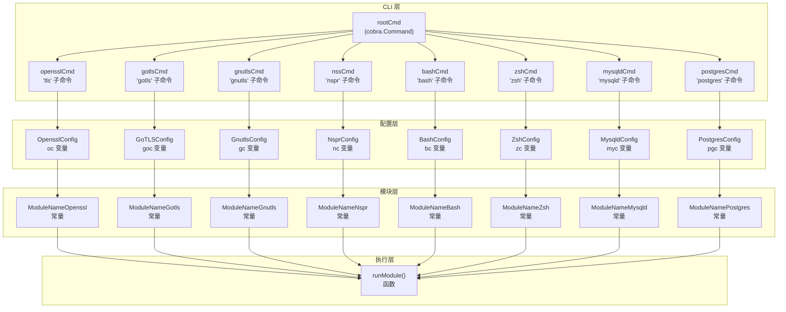
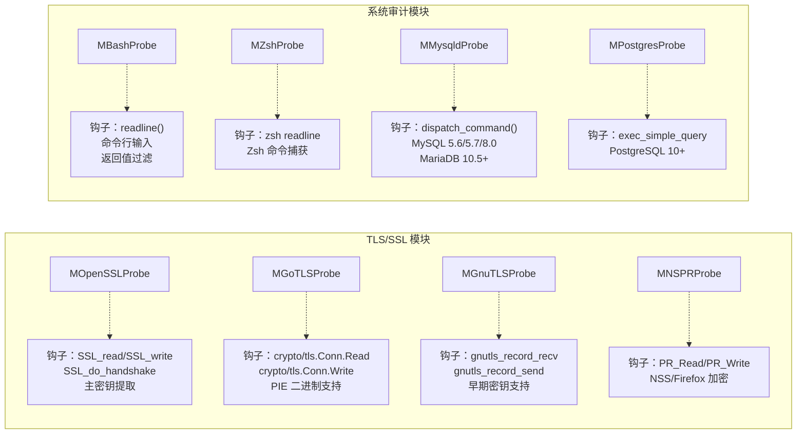
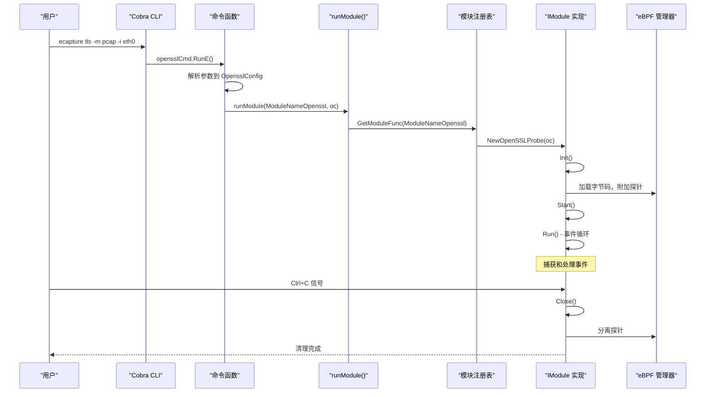

# 捕获模块

## 目的与范围

本页面提供 eCapture 捕获模块系统的概述，该系统为不同的协议、库和应用程序实现了专门的数据捕获能力。每个模块针对特定的技术（OpenSSL、GnuTLS、Go TLS、Bash、MySQL 等），并实现通用接口以集成到 eCapture 的事件处理流程中。

有关特定模块类型的详细信息，请参阅：
- TLS/SSL 捕获实现：[TLS/SSL 模块](3.1-tlsssl-modules.md)
- Shell 和数据库审计：[系统审计模块](3.2-system-audit-modules.md)
- 网络数据包捕获机制：[TC 网络数据包捕获](3.3-network-packet-capture-with-tc.md)
- 模块接口和生命周期管理：[模块系统与生命周期](../2-architecture/2.4-module-system-and-lifecycle.md)

## 模块系统概述

eCapture 的模块化架构允许通过统一的接口从不同来源捕获数据。每个模块负责：

1. **目标检测**：定位要检测的适当二进制文件或共享库
2. **eBPF 程序管理**：加载和附加特定版本的 eBPF 字节码
3. **事件处理**：解码和格式化捕获的数据
4. **输出生成**：以 text、pcap 或 keylog 格式生成数据

该系统目前实现了 **8 个捕获模块**，每个模块都通过 CLI 子命令注册，并可通过模块注册表访问。

来源：[README.md:152-161](https://github.com/gojue/ecapture/blob/0766a93b/README.md#L152-L161), [cli/cmd/tls.go:29-48](https://github.com/gojue/ecapture/blob/0766a93b/cli/cmd/tls.go#L29-L48), [cli/cmd/gotls.go:29-40](https://github.com/gojue/ecapture/blob/0766a93b/cli/cmd/gotls.go#L29-L40)

## 模块注册表与架构



**模块注册架构**：每个模块都注册为一个 Cobra CLI 子命令，带有自己的配置对象。当被调用时，命令函数使用模块名称常量和配置调用 `runModule()`，通过模块注册表实例化相应的模块实现。

来源：[cli/cmd/tls.go:26-67](https://github.com/gojue/ecapture/blob/0766a93b/cli/cmd/tls.go#L26-L67), [cli/cmd/gotls.go:26-58](https://github.com/gojue/ecapture/blob/0766a93b/cli/cmd/gotls.go#L26-L58), [cli/cmd/bash.go:24-55](https://github.com/gojue/ecapture/blob/0766a93b/cli/cmd/bash.go#L24-L55), [cli/cmd/mysqld.go:27-49](https://github.com/gojue/ecapture/blob/0766a93b/cli/cmd/mysqld.go#L27-L49), [cli/cmd/postgres.go:27-45](https://github.com/gojue/ecapture/blob/0766a93b/cli/cmd/postgres.go#L27-L45), [cli/cmd/nspr.go:27-51](https://github.com/gojue/ecapture/blob/0766a93b/cli/cmd/nspr.go#L27-L51), [cli/cmd/gnutls.go:29-64](https://github.com/gojue/ecapture/blob/0766a93b/cli/cmd/gnutls.go#L29-L64), [cli/cmd/zsh.go:27-57](https://github.com/gojue/ecapture/blob/0766a93b/cli/cmd/zsh.go#L27-L57)

## 模块分类

eCapture 的 8 个模块根据捕获目标和技术分为三个功能类别：

### TLS/SSL 加密库

这些模块拦截加密函数，在加密前或解密后捕获明文数据：

| 模块 | CLI 命令 | 目标库 | 支持版本 | 主要用途 |
|--------|-------------|----------------|-------------------|------------------|
| **OpenSSL** | `tls`, `openssl` | libssl.so | 1.0.x, 1.1.x, 3.0.x+ | 通用 TLS/HTTPS 捕获 |
| **BoringSSL** | `tls` | libssl.so | Android 12-16 | Android HTTPS 捕获 |
| **Go TLS** | `gotls`, `tlsgo` | 内置 crypto/tls | 所有 Go 版本 | Go 应用程序捕获 |
| **GnuTLS** | `gnutls`, `gnu` | libgnutls.so | 3.x | 替代 TLS 库 |
| **NSPR/NSS** | `nspr`, `nss` | libnspr4.so | 所有版本 | Firefox/Thunderbird |

来源：[README.md:152-161](https://github.com/gojue/ecapture/blob/0766a93b/README.md#L152-L161), [README_CN.md:128-138](https://github.com/gojue/ecapture/blob/0766a93b/README_CN.md#L128-L138), [cli/cmd/tls.go:29-33](https://github.com/gojue/ecapture/blob/0766a93b/cli/cmd/tls.go#L29-L33), [cli/cmd/gotls.go:29-33](https://github.com/gojue/ecapture/blob/0766a93b/cli/cmd/gotls.go#L29-L33), [cli/cmd/gnutls.go:32-36](https://github.com/gojue/ecapture/blob/0766a93b/cli/cmd/gnutls.go#L32-L36), [cli/cmd/nspr.go:30-34](https://github.com/gojue/ecapture/blob/0766a93b/cli/cmd/nspr.go#L30-L34)

### 系统审计与命令捕获

这些模块挂钩到命令解释器和数据库服务器进行安全审计：

| 模块 | CLI 命令 | 目标二进制 | 钩子点 | 审计能力 |
|--------|-------------|---------------|-------------|------------------|
| **Bash** | `bash` | /bin/bash | readline 库 | 命令输入/输出 |
| **Zsh** | `zsh` | /bin/zsh | readline 函数 | 命令执行 |
| **MySQL** | `mysqld` | /usr/sbin/mysqld | dispatch_command | SQL 查询日志 |
| **PostgreSQL** | `postgres` | /usr/bin/postgres | 查询执行 | SQL 审计 |

来源：[README.md:152-161](https://github.com/gojue/ecapture/blob/0766a93b/README.md#L152-L161), [cli/cmd/bash.go:27-32](https://github.com/gojue/ecapture/blob/0766a93b/cli/cmd/bash.go#L27-L32), [cli/cmd/zsh.go:30-35](https://github.com/gojue/ecapture/blob/0766a93b/cli/cmd/zsh.go#L30-L35), [cli/cmd/mysqld.go:30-36](https://github.com/gojue/ecapture/blob/0766a93b/cli/cmd/mysqld.go#L30-L36), [cli/cmd/postgres.go:30-33](https://github.com/gojue/ecapture/blob/0766a93b/cli/cmd/postgres.go#L30-L33)

### 网络数据包捕获

网络级捕获通过流量控制（TC）eBPF 分类器集成到 TLS/SSL 模块中。详见 [TC 网络数据包捕获](3.3-network-packet-capture-with-tc.md)。

## 详细模块描述



**模块实现细节**：每个模块实现为一个单独的结构体，嵌入通用功能并实现模块特定的钩子点和事件处理逻辑。

### OpenSSL/BoringSSL 模块

`tls` 命令针对 OpenSSL 和 BoringSSL 库，提供最全面的 TLS 捕获能力。它支持：

- **版本检测**：自动检测 OpenSSL 1.0.2 到 3.5.x 以及 Android BoringSSL A12-A16
- **三种捕获模式**：
  - `text`：直接明文捕获，支持 HTTP/HTTP2 解析
  - `pcap`/`pcapng`：网络数据包捕获，嵌入解密密钥
  - `keylog`/`key`：TLS 主密钥提取，用于外部解密
- **钩子点**：`SSL_read`、`SSL_write`、`SSL_do_handshake`、`SSL_get_wbio`、`SSL_in_before`
- **连接跟踪**：通过 TC 和 kprobe 钩子进行 4 元组网络跟踪

来源：[cli/cmd/tls.go:29-48](https://github.com/gojue/ecapture/blob/0766a93b/cli/cmd/tls.go#L29-L48), [README.md:163-253](https://github.com/gojue/ecapture/blob/0766a93b/README.md#L163-L253), [CHANGELOG.md:14-24](https://github.com/gojue/ecapture/blob/0766a93b/CHANGELOG.md#L14-L24)

### Go TLS 模块

`gotls` 命令从使用标准 `crypto/tls` 包的 Go 应用程序捕获明文：

- **二进制分析**：解析 Go 二进制元数据以定位 TLS 函数
- **PIE 支持**：处理位置无关可执行文件，动态计算偏移量
- **ABI 兼容性**：支持基于寄存器和基于栈的调用约定
- **捕获模式**：与 OpenSSL 相同的三种模式（text、pcap、keylog）

来源：[cli/cmd/gotls.go:29-40](https://github.com/gojue/ecapture/blob/0766a93b/cli/cmd/gotls.go#L29-L40), [README.md:254-276](https://github.com/gojue/ecapture/blob/0766a93b/README.md#L254-L276), [CHANGELOG.md:21-29](https://github.com/gojue/ecapture/blob/0766a93b/CHANGELOG.md#L21-L29)

### GnuTLS 模块

`gnutls` 命令针对 wget 和其他应用程序使用的 GnuTLS 库：

- **钩子点**：`gnutls_record_recv`、`gnutls_record_send`
- **版本支持**：GnuTLS 3.x，支持自动版本检测
- **早期密钥支持**：捕获 TLS 1.3 早期密钥，用于 0-RTT 解密
- **捕获模式**：text、pcap、keylog

来源：[cli/cmd/gnutls.go:32-45](https://github.com/gojue/ecapture/blob/0766a93b/cli/cmd/gnutls.go#L32-L45), [CHANGELOG.md:126-127](https://github.com/gojue/ecapture/blob/0766a93b/CHANGELOG.md#L126-L127)

### NSPR/NSS 模块

`nspr` 命令捕获来自 Firefox、Thunderbird 和其他 Mozilla 应用程序的流量：

- **目标**：NSS 使用的 NSPR（Netscape Portable Runtime）库
- **钩子点**：`PR_Read`、`PR_Write` 函数
- **应用程序支持**：Firefox 浏览器、Thunderbird 电子邮件客户端

来源：[cli/cmd/nspr.go:30-40](https://github.com/gojue/ecapture/blob/0766a93b/cli/cmd/nspr.go#L30-L40), [README.md:158](https://github.com/gojue/ecapture/blob/0766a93b/README.md#L158)

### Bash 模块

`bash` 命令为 Bash shell 提供命令行审计：

- **钩子点**：libreadline 中的 `readline()` 函数
- **捕获数据**：执行前的命令输入，执行后的返回值
- **过滤**：可选的 errno 过滤，仅捕获失败的命令
- **自动检测**：从 `$SHELL` 环境变量自动定位 bash 二进制文件

命令用法：
```
ecapture bash [--bash=/bin/bash] [--errnumber=N]
```

来源：[cli/cmd/bash.go:27-55](https://github.com/gojue/ecapture/blob/0766a93b/cli/cmd/bash.go#L27-L55), [README.md:153](https://github.com/gojue/ecapture/blob/0766a93b/README.md#L153)

### Zsh 模块

`zsh` 命令为 Zsh shell 提供类似的审计功能：

- **钩子点**：Zsh 特定的 readline 实现
- **功能**：命令捕获、返回值跟踪、errno 过滤
- **平台支持**：仅限 Linux（通过构建标签从 Android 构建中排除）

来源：[cli/cmd/zsh.go:30-57](https://github.com/gojue/ecapture/blob/0766a93b/cli/cmd/zsh.go#L30-L57), [README.md:154](https://github.com/gojue/ecapture/blob/0766a93b/README.md#L154), [CHANGELOG.md:369](https://github.com/gojue/ecapture/blob/0766a93b/CHANGELOG.md#L369)

### MySQL 模块

`mysqld` 命令从 MySQL 和 MariaDB 服务器捕获 SQL 查询：

- **版本支持**：MySQL 5.6、5.7、8.0 以及 MariaDB 10.5+
- **钩子点**：特定版本偏移量处的 `dispatch_command()` 函数
- **捕获数据**：完整的 SQL 查询文本，带时间戳和连接信息
- **偏移量支持**：为自定义构建手动指定偏移量

命令用法：
```
ecapture mysqld [--mysqld=/usr/sbin/mysqld] [--funcname=dispatch_command]
```

来源：[cli/cmd/mysqld.go:30-49](https://github.com/gojue/ecapture/blob/0766a93b/cli/cmd/mysqld.go#L30-L49), [README.md:157](https://github.com/gojue/ecapture/blob/0766a93b/README.md#L157)

### PostgreSQL 模块

`postgres` 命令为 PostgreSQL 数据库提供查询审计：

- **版本支持**：PostgreSQL 10 及更新版本
- **钩子点**：查询执行函数
- **函数自定义**：允许为不同构建指定自定义函数名称

来源：[cli/cmd/postgres.go:30-45](https://github.com/gojue/ecapture/blob/0766a93b/cli/cmd/postgres.go#L30-L45), [README.md:159](https://github.com/gojue/ecapture/blob/0766a93b/README.md#L159)

## 通用模块功能

所有捕获模块通过 eCapture 框架共享一组通用能力：

### 配置接口

每个模块实现一个 `IConfig` 接口，带有通用参数：

| 参数 | 标志 | 描述 | 默认值 |
|-----------|------|-------------|---------|
| PID 过滤 | `--pid` | 针对特定进程 ID | 所有进程 |
| UID 过滤 | `--uid` | 针对特定用户 ID | 所有用户 |
| 输出文件 | `-l`, `--logaddr` | 将事件保存到文件 | stdout |
| 十六进制模式 | `--hex` | 以十六进制显示数据 | false |
| BTF 模式 | `--btf` | 指定 BTF 字节码模式 | 自动检测 |
| 映射大小 | `--mapsize` | eBPF 映射大小（KB） | 5120 |

来源：[cli/cmd/tls.go:50-58](https://github.com/gojue/ecapture/blob/0766a93b/cli/cmd/tls.go#L50-L58), [cli/cmd/gotls.go:42-48](https://github.com/gojue/ecapture/blob/0766a93b/cli/cmd/gotls.go#L42-L48)

### 输出模式

TLS/SSL 模块支持三种由 `-m`/`--model` 标志控制的输出模式：

1. **文本模式**（`-m text`）：直接明文输出，支持 HTTP/HTTP2 解析
2. **PCAP 模式**（`-m pcap`）：网络数据包捕获，嵌入解密密钥
3. **Keylog 模式**（`-m keylog`）：仅提取 TLS 主密钥

详细信息请参阅 [输出格式](../4-output-formats/index.md)。

来源：[cli/cmd/tls.go:53](https://github.com/gojue/ecapture/blob/0766a93b/cli/cmd/tls.go#L53), [cli/cmd/gotls.go:45](https://github.com/gojue/ecapture/blob/0766a93b/cli/cmd/gotls.go#L45), [README.md:171-253](https://github.com/gojue/ecapture/blob/0766a93b/README.md#L171-L253)

### 网络集成

TLS/SSL 模块可以附加 TC（流量控制）eBPF 分类器以进行网络数据包捕获：

- **接口选择**：`-i`/`--ifname` 指定网络接口
- **PCAP 过滤器**：可选的 BPF 过滤器表达式（例如 `tcp port 443`）
- **连接映射**：通过 kprobe 钩子将网络流映射到进程

来源：[cli/cmd/tls.go:56](https://github.com/gojue/ecapture/blob/0766a93b/cli/cmd/tls.go#L56), [README.md:180-229](https://github.com/gojue/ecapture/blob/0766a93b/README.md#L180-L229)

## 模块选择与调用



**模块调用流程**：CLI 框架将子命令路由到各自的处理函数，这些函数创建模块特定的配置并调用 `runModule()` 来实例化和执行相应的模块实现。

模块选择过程：

1. **CLI 解析**：用户调用子命令（例如 `ecapture tls`）
2. **配置创建**：命令处理程序创建模块特定的配置对象
3. **模块实例化**：`runModule()` 通过名称常量查找模块
4. **生命周期执行**：模块经历 Init → Start → Run → Close 阶段
5. **事件处理**：模块处理事件直到被中断

来源：[cli/cmd/tls.go:62-67](https://github.com/gojue/ecapture/blob/0766a93b/cli/cmd/tls.go#L62-L67), [cli/cmd/gotls.go:52-58](https://github.com/gojue/ecapture/blob/0766a93b/cli/cmd/gotls.go#L52-L58), [main.go:1-11](https://github.com/gojue/ecapture/blob/0766a93b/main.go#L1-L11)

## 模块构建配置

模块可以根据平台和功能要求有条件地编译：

- **构建标签**：`//go:build !androidgki` 从 Android 内核构建中排除模块
- **平台特定**：某些模块（bash、gnutls、nspr、mysqld、postgres、zsh）仅限 Linux
- **通用模块**：OpenSSL 和 GoTLS 模块支持 Linux 和 Android

Android 排除的模块：
- GnuTLS: [cli/cmd/gnutls.go:1-2](https://github.com/gojue/ecapture/blob/0766a93b/cli/cmd/gnutls.go#L1-L2)
- NSPR/NSS: [cli/cmd/nspr.go:1-2](https://github.com/gojue/ecapture/blob/0766a93b/cli/cmd/nspr.go#L1-L2)
- MySQL: [cli/cmd/mysqld.go:1-2](https://github.com/gojue/ecapture/blob/0766a93b/cli/cmd/mysqld.go#L1-L2)
- PostgreSQL: [cli/cmd/postgres.go:1-2](https://github.com/gojue/ecapture/blob/0766a93b/cli/cmd/postgres.go#L1-L2)
- Zsh: [cli/cmd/zsh.go:1-2](https://github.com/gojue/ecapture/blob/0766a93b/cli/cmd/zsh.go#L1-L2)

来源：[cli/cmd/gnutls.go:1-2](https://github.com/gojue/ecapture/blob/0766a93b/cli/cmd/gnutls.go#L1-L2), [cli/cmd/nspr.go:1-2](https://github.com/gojue/ecapture/blob/0766a93b/cli/cmd/nspr.go#L1-L2), [cli/cmd/mysqld.go:1-2](https://github.com/gojue/ecapture/blob/0766a93b/cli/cmd/mysqld.go#L1-L2), [cli/cmd/postgres.go:1-2](https://github.com/gojue/ecapture/blob/0766a93b/cli/cmd/postgres.go#L1-L2), [cli/cmd/zsh.go:1-2](https://github.com/gojue/ecapture/blob/0766a93b/cli/cmd/zsh.go#L1-L2)

## 版本历史与演进

变更日志中记录的最近模块增强：

- **v1.5.0**：OpenSSL 3.5.4 支持、Android 16 BoringSSL、HTTP/2 解析器改进
- **v1.4.0**：WebSocket 事件转发、OpenSSL 版本降级逻辑
- **v1.3.0**：GnuTLS 早期密钥支持、keylog 改进
- **v1.2.0**：事件工作器双重生命周期管理
- **v1.0.0**：稳定版本，支持多协议
- **v0.9.0**：Zsh 命令捕获、连接清理改进
- **v0.7.0**：模块拆分（OpenSSL/GnuTLS/NSPR 分离）、引入 keylog 模式

来源：[CHANGELOG.md:11-757](https://github.com/gojue/ecapture/blob/0766a93b/CHANGELOG.md#L11-L757)