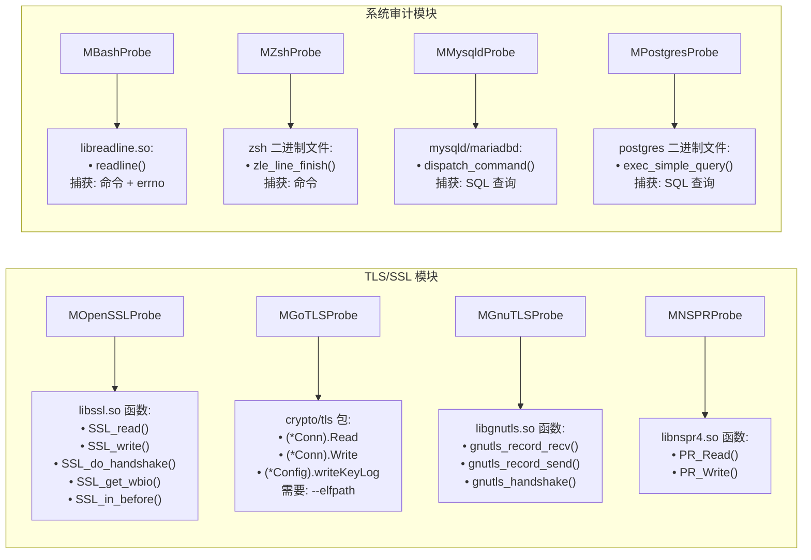
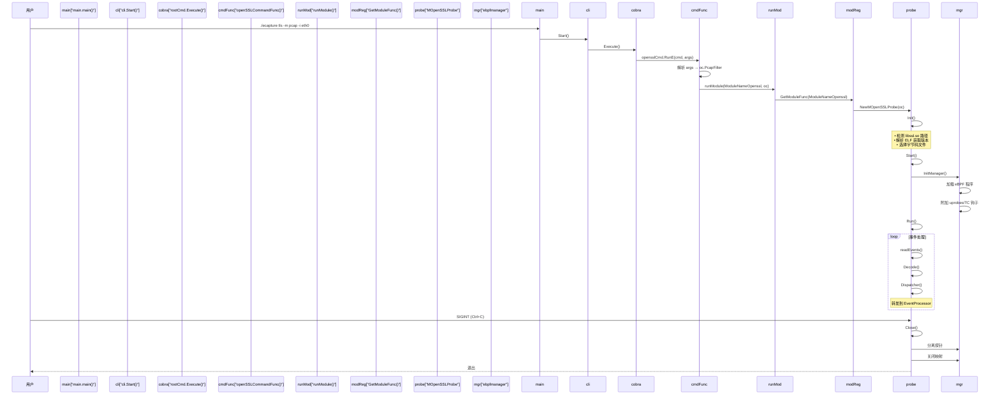

# 捕获模块

## 概述

eCapture 实现了八个捕获模块，为不同的协议、库和应用程序提供专门的数据拦截能力。每个模块使用 eBPF uprobe 来钩住特定函数，在加密前或解密后捕获明文数据。这些模块通过 Cobra 注册为 CLI 子命令，并通过模块注册表模式实例化。

**模块分类：**

| 类别 | 模块 | 用途 |
|----------|---------|---------|
| **TLS/SSL 加密库** | OpenSSL/BoringSSL、Go TLS、GnuTLS、NSPR/NSS | 拦截加密库函数以捕获 TLS/SSL 明文和主密钥 |
| **系统审计** | Bash、Zsh、MySQL、PostgreSQL | 钩住命令解释器和数据库服务器以捕获命令和查询 |
| **网络数据包捕获** | TC 分类器（与 TLS 模块集成） | 在内核级别捕获网络数据包并丰富进程上下文 |

**可用命令：**
```
ecapture tls      # OpenSSL/BoringSSL TLS/SSL 捕获
ecapture gotls    # Go TLS 捕获
ecapture gnutls   # GnuTLS 捕获
ecapture nspr     # NSPR/NSS 捕获
ecapture bash     # Bash 命令审计
ecapture zsh      # Zsh 命令审计
ecapture mysqld   # MySQL 查询审计
ecapture postgres # PostgreSQL 查询审计
```

所有模块都实现了 `IModule` 接口，并通过 `Module` 基础结构体共享通用功能。详细实现信息请参见：

- **TLS/SSL 模块**：参见 [3.1 - TLS/SSL 捕获模块]
- **系统审计模块**：参见 [3.2 - 系统审计模块]
- **网络数据包捕获**：参见 [3.3 - 基于 TC 的网络数据包捕获]
- **模块架构**：参见 [2.5 - 模块系统与生命周期]
- **事件处理**：参见 [2.2 - 事件处理流程]

来源：[README.md:152-161](https://github.com/gojue/ecapture/blob/ca085d05/README.md#L152-L161), [cli/cmd/tls.go:29-48](https://github.com/gojue/ecapture/blob/ca085d05/cli/cmd/tls.go#L29-L48), [cli/cmd/gotls.go:29-40](https://github.com/gojue/ecapture/blob/ca085d05/cli/cmd/gotls.go#L29-L40), [cli/cmd/bash.go:27-33](https://github.com/gojue/ecapture/blob/ca085d05/cli/cmd/bash.go#L27-L33), [cli/cmd/mysqld.go:30-36](https://github.com/gojue/ecapture/blob/ca085d05/cli/cmd/mysqld.go#L30-L36)

## 模块注册架构

**CLI 命令注册流程**


```mermaid
graph TB
    subgraph CLI["cli/cmd/*.go 文件"]
        rootCmd["rootCmd<br/>(cobra.Command)"]
        
        opensslCmd["opensslCmd = &cobra.Command<br/>Use: 'tls'<br/>Aliases: ['openssl']"]
        gotlsCmd["gotlsCmd = &cobra.Command<br/>Use: 'gotls'<br/>Aliases: ['tlsgo']"]
        gnutlsCmd["gnutlsCmd = &cobra.Command<br/>Use: 'gnutls'<br/>Aliases: ['gnu']"]
        nssCmd["nssCmd = &cobra.Command<br/>Use: 'nspr'<br/>Aliases: ['nss']"]
        bashCmd["bashCmd = &cobra.Command<br/>Use: 'bash'"]
        zshCmd["zshCmd = &cobra.Command<br/>Use: 'zsh'"]
        mysqldCmd["mysqldCmd = &cobra.Command<br/>Use: 'mysqld'"]
        postgresCmd["postgresCmd = &cobra.Command<br/>Use: 'postgres'"]
    end
    
    subgraph Config["config.New*Config()"]
        oc["oc = config.NewOpensslConfig()"]
        goc["goc = config.NewGoTLSConfig()"]
        gc["gc = config.NewGnutlsConfig()"]
        nc["nc = config.NewNsprConfig()"]
        bc["bc = config.NewBashConfig()"]
        zc["zc = config.NewZshConfig()"]
        myc["myc = config.NewMysqldConfig()"]
        pgc["pgc = config.NewPostgresConfig()"]
    end
    
    subgraph RunE["命令 RunE 函数"]
        openSSLCommandFunc["openSSLCommandFunc()"]
        goTLSCommandFunc["goTLSCommandFunc()"]
        gnuTlsCommandFunc["gnuTlsCommandFunc()"]
        nssCommandFunc["nssCommandFunc()"]
        bashCommandFunc["bashCommandFunc()"]
        zshCommandFunc["zshCommandFunc()"]
        mysqldCommandFunc["mysqldCommandFunc()"]
        postgresCommandFunc["postgresCommandFunc()"]
    end
    
    subgraph ModuleNames["module.ModuleName* 常量"]
        ModuleNameOpenssl["module.ModuleNameOpenssl"]
        ModuleNameGotls["module.ModuleNameGotls"]
        ModuleNameGnutls["module.ModuleNameGnutls"]
        ModuleNameNspr["module.ModuleNameNspr"]
        ModuleNameBash["module.ModuleNameBash"]
        ModuleNameZsh["module.ModuleNameZsh"]
        ModuleNameMysqld["module.ModuleNameMysqld"]
        ModuleNamePostgres["module.ModuleNamePostgres"]
    end
    
    runModule["runModule(moduleName, config)"]
    
    rootCmd --> opensslCmd
    rootCmd --> gotlsCmd
    rootCmd --> gnutlsCmd
    rootCmd --> nssCmd
    rootCmd --> bashCmd
    rootCmd --> zshCmd
    rootCmd --> mysqldCmd
    rootCmd --> postgresCmd
    
    opensslCmd --> openSSLCommandFunc
    gotlsCmd --> goTLSCommandFunc
    gnutlsCmd --> gnuTlsCommandFunc
    nssCmd --> nssCommandFunc
    bashCmd --> bashCommandFunc
    zshCmd --> zshCommandFunc
    mysqldCmd --> mysqldCommandFunc
    postgresCmd --> postgresCommandFunc
    
    oc -.->|传递给| openSSLCommandFunc
    goc -.->|传递给| goTLSCommandFunc
    gc -.->|传递给| gnuTlsCommandFunc
    nc -.->|传递给| nssCommandFunc
    bc -.->|传递给| bashCommandFunc
    zc -.->|传递给| zshCommandFunc
    myc -.->|传递给| mysqldCommandFunc
    pgc -.->|传递给| postgresCommandFunc
    
    openSSLCommandFunc --> ModuleNameOpenssl
    goTLSCommandFunc --> ModuleNameGotls
    gnuTlsCommandFunc --> ModuleNameGnutls
    nssCommandFunc --> ModuleNameNspr
    bashCommandFunc --> ModuleNameBash
    zshCommandFunc --> ModuleNameZsh
    mysqldCommandFunc --> ModuleNameMysqld
    postgresCommandFunc --> ModuleNamePostgres
    
    ModuleNameOpenssl --> runModule
    ModuleNameGotls --> runModule
    ModuleNameGnutls --> runModule
    ModuleNameNspr --> runModule
    ModuleNameBash --> runModule
    ModuleNameZsh --> runModule
    ModuleNameMysqld --> runModule
    ModuleNamePostgres --> runModule
```

每个模块遵循一致的注册模式：

1. **命令定义**：每个 `cli/cmd/*.go` 文件定义一个 `cobra.Command` 结构体，包含 `Use`、`Aliases`、`Short`、`Long` 和 `RunE` 字段
2. **配置对象**：通过 `config.New*Config()` 构造函数创建包级别变量（例如 `oc`、`goc`）
3. **命令函数**：`RunE` 处理函数（例如 `openSSLCommandFunc`）处理 CLI 标志并调用 `runModule()`
4. **模块常量**：字符串常量（如 `module.ModuleNameOpenssl`）标识模块实现
5. **注册**：`init()` 函数将命令添加到 `rootCmd` 并将标志绑定到配置对象

来源：[cli/cmd/tls.go:26-67](https://github.com/gojue/ecapture/blob/ca085d05/cli/cmd/tls.go#L26-L67), [cli/cmd/gotls.go:26-58](https://github.com/gojue/ecapture/blob/ca085d05/cli/cmd/gotls.go#L26-L58), [cli/cmd/bash.go:24-55](https://github.com/gojue/ecapture/blob/ca085d05/cli/cmd/bash.go#L24-L55), [cli/cmd/mysqld.go:27-49](https://github.com/gojue/ecapture/blob/ca085d05/cli/cmd/mysqld.go#L27-L49), [cli/cmd/postgres.go:27-45](https://github.com/gojue/ecapture/blob/ca085d05/cli/cmd/postgres.go#L27-L45), [cli/cmd/nspr.go:27-51](https://github.com/gojue/ecapture/blob/ca085d05/cli/cmd/nspr.go#L27-L51), [cli/cmd/gnutls.go:29-64](https://github.com/gojue/ecapture/blob/ca085d05/cli/cmd/gnutls.go#L29-L64), [cli/cmd/zsh.go:27-57](https://github.com/gojue/ecapture/blob/ca085d05/cli/cmd/zsh.go#L27-L57)

## 模块类别与能力

eCapture 的八个模块被组织为三个功能类别：

### TLS/SSL 加密库

五个模块拦截加密库函数以在加密前或解密后捕获明文：

| 模块 | CLI 命令 | 目标库 | 钩子函数 | 支持的版本 |
|--------|-------------|----------------|----------------|-------------------|
| **OpenSSL/BoringSSL** | `tls`、`openssl` | libssl.so、libcrypto.so | `SSL_read`、`SSL_write`、`SSL_do_handshake`、`SSL_get_wbio` | OpenSSL 1.0.2-3.5.x、BoringSSL Android 12-16 |
| **Go TLS** | `gotls`、`tlsgo` | crypto/tls（内置） | `crypto/tls.(*Conn).Read`、`crypto/tls.(*Conn).Write` | 所有 Go 版本（1.x-1.24+） |
| **GnuTLS** | `gnutls`、`gnu` | libgnutls.so | `gnutls_record_recv`、`gnutls_record_send` | GnuTLS 3.x |
| **NSPR/NSS** | `nspr`、`nss` | libnspr4.so、libnss3.so | `PR_Read`、`PR_Write` | 所有 NSS 版本 |

**捕获模式**：TLS/SSL 模块通过 `-m` 标志支持三种模式：
- `text`：直接明文输出，支持 HTTP/1.x/HTTP2 解析
- `pcap`/`pcapng`：网络数据包，在 PCAPNG DSB 中嵌入 TLS 密钥
- `keylog`/`key`：以 SSLKEYLOGFILE 格式提取主密钥

来源：[cli/cmd/tls.go:32-33](https://github.com/gojue/ecapture/blob/ca085d05/cli/cmd/tls.go#L32-L33), [cli/cmd/gotls.go:32-33](https://github.com/gojue/ecapture/blob/ca085d05/cli/cmd/gotls.go#L32-L33), [cli/cmd/gnutls.go:35-36](https://github.com/gojue/ecapture/blob/ca085d05/cli/cmd/gnutls.go#L35-L36), [cli/cmd/nspr.go:32-33](https://github.com/gojue/ecapture/blob/ca085d05/cli/cmd/nspr.go#L32-L33), [README.md:163-176](https://github.com/gojue/ecapture/blob/ca085d05/README.md#L163-L176)

### 系统审计模块

四个模块钩住命令解释器和数据库服务器：

| 模块 | CLI 命令 | 目标二进制文件 | 钩子函数 | 捕获的数据 |
|--------|-------------|---------------|----------------|---------------|
| **Bash** | `bash` | /bin/bash | libreadline.so 中的 `readline()` | 命令输入、返回值、errno |
| **Zsh** | `zsh` | /bin/zsh | `zle_line_finish()` | 命令输入、执行结果 |
| **MySQL** | `mysqld` | /usr/sbin/mysqld、/usr/sbin/mariadbd | `dispatch_command()` | SQL 查询文本、连接 ID |
| **PostgreSQL** | `postgres` | /usr/bin/postgres | `exec_simple_query()` | SQL 语句 |

**过滤**：Bash 和 Zsh 支持 `-e`/`--errnumber` 标志以按命令退出状态过滤。

来源：[cli/cmd/bash.go:28-32](https://github.com/gojue/ecapture/blob/ca085d05/cli/cmd/bash.go#L28-L32), [cli/cmd/zsh.go:31-35](https://github.com/gojue/ecapture/blob/ca085d05/cli/cmd/zsh.go#L31-L35), [cli/cmd/mysqld.go:31-36](https://github.com/gojue/ecapture/blob/ca085d05/cli/cmd/mysqld.go#L31-L36), [cli/cmd/postgres.go:31-33](https://github.com/gojue/ecapture/blob/ca085d05/cli/cmd/postgres.go#L31-L33)

### 网络数据包捕获

TLS/SSL 模块在使用 pcap 模式时与 Traffic Control (TC) eBPF 分类器集成：

- **TC 探针**：通过 `-i`/`--ifname` 标志附加到网络接口
- **BPF 过滤**：支持 pcap 过滤表达式（例如 `tcp port 443`）
- **连接跟踪**：使用 kprobe 在 `tcp_sendmsg`/`udp_sendmsg` 上进行 PID/UID 映射
- **协议支持**：IPv4/IPv6、TCP/UDP、ICMP

详情请参见 [3.3 - 基于 TC 的网络数据包捕获]。

来源：[cli/cmd/tls.go:56](https://github.com/gojue/ecapture/blob/ca085d05/cli/cmd/tls.go#L56), [cli/cmd/gotls.go:47](https://github.com/gojue/ecapture/blob/ca085d05/cli/cmd/gotls.go#L47), [CHANGELOG.md:153](https://github.com/gojue/ecapture/blob/ca085d05/CHANGELOG.md#L153)

## 模块钩子点与目标

**模块目标函数与捕获的数据**


```mermaid
graph LR
    subgraph TLS_Modules["TLS/SSL 模块"]
        direction TB
        
        MOpenSSL["MOpenSSLProbe"]
        MOpenSSL_targets["libssl.so 函数:<br/>• SSL_read()<br/>• SSL_write()<br/>• SSL_do_handshake()<br/>• SSL_get_wbio()<br/>• SSL_in_before()"]
        
        MGoTLS["MGoTLSProbe"]
        MGoTLS_targets["crypto/tls 包:<br/>• (*Conn).Read<br/>• (*Conn).Write<br/>• (*Config).writeKeyLog<br/>需要: --elfpath"]
        
        MGnuTLS["MGnuTLSProbe"]
        MGnuTLS_targets["libgnutls.so 函数:<br/>• gnutls_record_recv()<br/>• gnutls_record_send()<br/>• gnutls_handshake()"]
        
        MNSPR["MNSPRProbe"]
        MNSPR_targets["libnspr4.so 函数:<br/>• PR_Read()<br/>• PR_Write()"]
    end
    
    subgraph Audit_Modules["系统审计模块"]
        direction TB
        
        MBash["MBashProbe"]
        MBash_targets["libreadline.so:<br/>• readline()<br/>捕获: 命令 + errno"]
        
        MZsh["MZshProbe"]
        MZsh_targets["zsh 二进制文件:<br/>• zle_line_finish()<br/>捕获: 命令"]
        
        MMySQL["MMysqldProbe"]
        MMySQL_targets["mysqld/mariadbd:<br/>• dispatch_command()<br/>捕获: SQL 查询"]
        
        MPostgres["MPostgresProbe"]
        MPostgres_targets["postgres 二进制文件:<br/>• exec_simple_query()<br/>捕获: SQL 查询"]
    end
    
    MOpenSSL --> MOpenSSL_targets
    MGoTLS --> MGoTLS_targets
    MGnuTLS --> MGnuTLS_targets
    MNSPR --> MNSPR_targets
    
    MBash --> MBash_targets
    MZsh --> MZsh_targets
    MMySQL --> MMySQL_targets
    MPostgres --> MPostgres_targets
```

**IModule 接口方法**

`user/module/` 中的所有模块实现必须实现以下方法：

| 方法 | 用途 |
|--------|---------|
| `Init()` | 检测目标二进制文件/库路径，解析版本，选择 eBPF 字节码 |
| `Start()` | 加载 eBPF 程序，将 uprobe/TC 钩子附加到目标函数 |
| `Run()` | 启动事件读取循环，处理捕获的数据直到关闭 |
| `Close()` | 分离探针，关闭映射，清理资源 |
| `Decode()` | 将原始 eBPF 事件字节解析为类型化的事件结构体 |
| `Dispatcher()` | 将解码的事件路由到 EventProcessor 进行输出 |

`Module` 基础结构体提供 eBPF 映射管理、事件读取和配置处理的共享功能。详细实现请参见 [2.5 - 模块系统与生命周期]。

来源：[cli/cmd/tls.go:29-48](https://github.com/gojue/ecapture/blob/ca085d05/cli/cmd/tls.go#L29-L48), [cli/cmd/gotls.go:29-40](https://github.com/gojue/ecapture/blob/ca085d05/cli/cmd/gotls.go#L29-L40), [cli/cmd/bash.go:27-33](https://github.com/gojue/ecapture/blob/ca085d05/cli/cmd/bash.go#L27-L33), [cli/cmd/mysqld.go:30-36](https://github.com/gojue/ecapture/blob/ca085d05/cli/cmd/mysqld.go#L30-L36)

## 模块概述

### TLS/SSL 捕获模块

eCapture 提供五个模块用于捕获来自不同加密库的加密 TLS/SSL 流量。所有 TLS/SSL 模块支持三种捕获模式（`-m text|pcap|keylog`），并可以提取主密钥用于离线解密。详细信息请参见 [3.1 - TLS/SSL 捕获模块]。

**OpenSSL/BoringSSL 模块（`tls`、`openssl`）**

捕获使用 OpenSSL（1.0.2-3.5.x）或 BoringSSL（Android 12-16）的应用程序的 TLS/SSL 流量。自动检测库版本并选择适当的 eBPF 字节码。钩住 `SSL_read()`、`SSL_write()`、`SSL_do_handshake()` 和主密钥提取函数。参见 [3.1.1 - OpenSSL 模块]。

```bash
ecapture tls -m pcap -i eth0 -w capture.pcapng tcp port 443
```

**Go TLS 模块（`gotls`、`tlsgo`）**

捕获使用 `crypto/tls` 标准库的 Go 程序的 TLS 流量。需要 `--elfpath` 标志指向 Go 二进制文件。解析 ELF `.gopclntab` 段以定位函数偏移，支持基于寄存器（Go ≥1.17）和基于栈（Go <1.17）的 ABI。参见 [3.1.3 - Go TLS 模块]。

```bash
ecapture gotls --elfpath=/usr/bin/myapp -m keylog -k keys.log
```

**GnuTLS 模块（`gnutls`、`gnu`）**

捕获使用 libgnutls.so 的应用程序（例如 wget、curl）的流量。支持 TLS 1.3 早期密钥提取用于 0-RTT 数据。钩住 `gnutls_record_recv()`、`gnutls_record_send()` 和 `gnutls_handshake()`。参见 [3.1.4 - GnuTLS 与 NSS 模块]。

```bash
ecapture gnutls -m keylog -k gnutls_keys.log --gnutls=/lib/x86_64-linux-gnu/libgnutls.so
```

**NSPR/NSS 模块（`nspr`、`nss`）**

捕获使用 libnspr4.so/libnss3.so 的 Mozilla 应用程序（Firefox、Thunderbird）的流量。钩住 NSPR I/O 层的 `PR_Read()` 和 `PR_Write()`。当前仅支持文本模式。参见 [3.1.4 - GnuTLS 与 NSS 模块]。

```bash
ecapture nspr --nspr=/lib/x86_64-linux-gnu/libnspr4.so
```

来源：[cli/cmd/tls.go:29-67](https://github.com/gojue/ecapture/blob/ca085d05/cli/cmd/tls.go#L29-L67), [cli/cmd/gotls.go:29-58](https://github.com/gojue/ecapture/blob/ca085d05/cli/cmd/gotls.go#L29-L58), [cli/cmd/gnutls.go:32-64](https://github.com/gojue/ecapture/blob/ca085d05/cli/cmd/gnutls.go#L32-L64), [cli/cmd/nspr.go:30-51](https://github.com/gojue/ecapture/blob/ca085d05/cli/cmd/nspr.go#L30-L51)

### 系统审计模块

eCapture 提供四个模块用于审计系统命令和数据库查询。这些模块捕获命令行输入和 SQL 查询以用于安全审计目的。详细信息请参见 [3.2 - 系统审计模块]。

**Bash 模块（`bash`）**

通过钩住 libreadline.so 的 `readline()` 审计 Bash shell 中输入的命令。捕获命令文本、退出状态和 errno。支持使用 `-e` 标志按退出代码过滤。参见 [3.2.1 - Shell 命令审计]。

```bash
ecapture bash --errnumber=0  # 仅显示成功的命令
```

**Zsh 模块（`zsh`）**

通过钩住 Zsh 行编辑器的 `zle_line_finish()` 审计 Zsh 命令。类似于 Bash 模块，但针对 Zsh 特定函数。仅限 Linux。参见 [3.2.1 - Shell 命令审计]。

```bash
ecapture zsh --zsh=/bin/zsh
```

**MySQL 模块（`mysqld`）**

通过钩住 `dispatch_command()` 函数审计 MySQL/MariaDB 查询。支持 MySQL 5.6/5.7/8.0 和 MariaDB 10.5+。捕获 SQL 查询文本和连接元数据。参见 [3.2.2 - 数据库查询审计]。

```bash
ecapture mysqld --mysqld=/usr/sbin/mysqld --funcname=dispatch_command
```

**PostgreSQL 模块（`postgres`）**

通过钩住 `exec_simple_query()` 审计 PostgreSQL 查询。支持 PostgreSQL 10 及更新版本。捕获 SQL 语句和连接信息。参见 [3.2.2 - 数据库查询审计]。

```bash
ecapture postgres --postgres=/usr/bin/postgres
```

来源：[cli/cmd/bash.go:27-55](https://github.com/gojue/ecapture/blob/ca085d05/cli/cmd/bash.go#L27-L55), [cli/cmd/zsh.go:30-57](https://github.com/gojue/ecapture/blob/ca085d05/cli/cmd/zsh.go#L30-L57), [cli/cmd/mysqld.go:30-49](https://github.com/gojue/ecapture/blob/ca085d05/cli/cmd/mysqld.go#L30-L49), [cli/cmd/postgres.go:30-45](https://github.com/gojue/ecapture/blob/ca085d05/cli/cmd/postgres.go#L30-L45)

## 通用配置参数

所有模块都接受在 `BaseConfig` 中定义的这些共享标志：

| 标志 | 类型 | 描述 | 默认值 |
|------|------|-------------|---------|
| `--pid` | uint64 | 目标特定进程 ID | 0（所有进程） |
| `--uid` | uint64 | 目标特定用户 ID | 0（所有用户） |
| `-l`、`--logaddr` | string | 输出文件路径 | ""（stdout） |
| `--hex` | bool | 以十六进制显示有效负载 | false |
| `--btf` | string | 非 CO-RE 模式的 BTF 文件路径 | ""（自动） |
| `--mapsize` | uint64 | eBPF 映射大小（KB） | 5120 |

**TLS/SSL 模块特定标志**：

| 标志 | 模块 | 描述 | 默认值 |
|------|---------|-------------|---------|
| `-m`、`--model` | tls、gotls、gnutls | 捕获模式：text/pcap/keylog | "text" |
| `-w`、`--pcapfile` | tls、gotls、gnutls | PCAPNG 输出文件 | "save.pcapng" |
| `-k`、`--keylogfile` | tls、gotls、gnutls | 密钥日志文件（SSLKEYLOGFILE 格式） | "ecapture_*_key.log" |
| `-i`、`--ifname` | tls、gotls、gnutls | TC 探针的网络接口 | ""（pcap 模式必需） |
| `--libssl` | tls | libssl.so 的路径 | 自动检测 |
| `--ssl_version` | tls、gnutls | 强制指定版本 | 自动检测 |
| `--elfpath` | gotls | Go 二进制文件路径 | 必需 |

**系统审计模块特定标志**：

| 标志 | 模块 | 描述 | 默认值 |
|------|---------|-------------|---------|
| `--bash` | bash | bash 二进制文件路径 | $SHELL |
| `--zsh` | zsh | zsh 二进制文件路径 | $SHELL |
| `-e`、`--errnumber` | bash、zsh | 按退出代码过滤 | 0（全部） |
| `--mysqld` | mysqld | mysqld 二进制文件路径 | /usr/sbin/mariadbd |
| `--postgres` | postgres | postgres 二进制文件路径 | /usr/bin/postgres |
| `-f`、`--funcname` | mysqld、postgres | 目标函数名称 | dispatch_command/exec_simple_query |
| `--offset` | mysqld | 手动函数偏移 | 0 |

来源：[cli/cmd/tls.go:50-58](https://github.com/gojue/ecapture/blob/ca085d05/cli/cmd/tls.go#L50-L58), [cli/cmd/gotls.go:42-48](https://github.com/gojue/ecapture/blob/ca085d05/cli/cmd/gotls.go#L42-L48), [cli/cmd/bash.go:36-38](https://github.com/gojue/ecapture/blob/ca085d05/cli/cmd/bash.go#L36-L38), [cli/cmd/mysqld.go:40-42](https://github.com/gojue/ecapture/blob/ca085d05/cli/cmd/mysqld.go#L40-L42)

## TLS/SSL 模块输出模式

TLS/SSL 模块（tls、gotls、gnutls）通过 `-m`/`--model` 标志支持三种输出模式：

### 文本模式（`-m text`）

**默认模式**。直接将明文数据捕获并显示到控制台或文件。

**特性**：
- HTTP/1.x 请求/响应解析（带标头）
- HTTP/2 帧解析（带 HPACK 标头解压缩）
- 自动 gzip 解压缩（`Content-Encoding: gzip`）
- 彩色输出（请求为绿色，响应为蓝色）
- 基于 UUID 的连接跟踪

**输出目标**：stdout 或由 `-l` 标志指定的文件。

### PCAP 模式（`-m pcap`）

捕获网络数据包并以 PCAPNG 格式保存，其中嵌入 TLS 密钥。

**特性**：
- 需要 `-i`/`--ifname` 指定网络接口
- 在解密密钥块（DSB）中嵌入 TLS 主密钥
- 支持可选的 BPF 过滤表达式（例如 `tcp port 443`）
- 兼容 Wireshark 直接解密
- IPv4/IPv6 支持

**输出**：由 `-w`/`--pcapfile` 标志指定的文件。

**示例**：
```
ecapture tls -m pcap -i eth0 -w capture.pcapng host 192.168.1.100 and tcp port 443
```

### Keylog 模式（`-m keylog`）

仅提取 TLS 主密钥，不捕获数据有效负载。

**特性**：
- 以与 Wireshark/tshark 兼容的 SSLKEYLOGFILE 格式保存密钥
- TLS 1.2：带主密钥的 `CLIENT_RANDOM`
- TLS 1.3：多个密钥（早期、握手、流量）
- 可与 tcpdump 结合用于离线解密

**输出**：由 `-k`/`--keylogfile` 标志指定的文件。

**示例**：
```
# 终端 1：捕获密钥
ecapture tls -m keylog -k keys.log

# 终端 2：使用 tshark 解密
tshark -o tls.keylog_file:keys.log -Y http -T fields -e http.file_data -i eth0
```

来源：[cli/cmd/tls.go:53-56](https://github.com/gojue/ecapture/blob/ca085d05/cli/cmd/tls.go#L53-L56), [README.md:171-247](https://github.com/gojue/ecapture/blob/ca085d05/README.md#L171-L247), [CHANGELOG.md:687-743](https://github.com/gojue/ecapture/blob/ca085d05/CHANGELOG.md#L687-L743)

## 模块生命周期与执行流程

**模块调用序列图**


```mermaid
sequenceDiagram
    participant User as 用户
    participant main["main.main()"]
    participant cli["cli.Start()"]
    participant cobra["rootCmd.Execute()"]
    participant cmdFunc["openSSLCommandFunc()"]
    participant runMod["runModule()"]
    participant modReg["GetModuleFunc()"]
    participant probe["MOpenSSLProbe"]
    participant mgr["ebpfmanager"]
    
    User->>main: ./ecapture tls -m pcap -i eth0
    main->>cli: Start()
    cli->>cobra: Execute()
    cobra->>cmdFunc: opensslCmd.RunE(cmd, args)
    
    cmdFunc->>cmdFunc: 解析 args → oc.PcapFilter
    cmdFunc->>runMod: runModule(ModuleNameOpenssl, oc)
    
    runMod->>modReg: GetModuleFunc(ModuleNameOpenssl)
    modReg->>probe: NewMOpenSSLProbe(oc)
    
    probe->>probe: Init()
    Note over probe: • 检测 libssl.so 路径<br/>• 解析 ELF 获取版本<br/>• 选择字节码文件
    
    probe->>probe: Start()
    probe->>mgr: InitManager()
    mgr->>mgr: 加载 eBPF 程序
    mgr->>mgr: 附加 uprobes/TC 钩子
    
    probe->>probe: Run()
    loop 事件处理
        probe->>probe: readEvents()
        probe->>probe: Decode()
        probe->>probe: Dispatcher()
        Note over probe: 转发到 EventProcessor
    end
    
    User->>probe: SIGINT (Ctrl+C)
    probe->>probe: Close()
    probe->>mgr: 分离探针
    probe->>mgr: 关闭映射
    probe-->>User: 退出
```

**执行步骤**：

1. **入口点**：`main.main()` 调用 `cli.Start()` → [main.go:9-11](https://github.com/gojue/ecapture/blob/ca085d05/main.go#L9-L11)
2. **命令路由**：Cobra 框架执行匹配子命令的 `RunE` 函数
3. **配置准备**：命令函数解析标志，创建配置对象（例如 `OpensslConfig`）
4. **模块查找**：`runModule()` 从注册表中检索模块工厂函数
5. **模块构造**：工厂创建模块实例（例如 `MOpenSSLProbe`）
6. **初始化**：`Init()` 方法检测目标二进制文件，选择 eBPF 字节码
7. **探针附加**：`Start()` 加载 eBPF 程序并附加到钩子点
8. **事件循环**：`Run()` 处理事件直到收到信号
9. **清理**：`Close()` 分离探针并释放资源

来源：[main.go:1-11](https://github.com/gojue/ecapture/blob/ca085d05/main.go#L1-L11), [cli/cmd/tls.go:62-67](https://github.com/gojue/ecapture/blob/ca085d05/cli/cmd/tls.go#L62-L67), [cli/cmd/gotls.go:52-58](https://github.com/gojue/ecapture/blob/ca085d05/cli/cmd/gotls.go#L52-L58)

## 平台特定模块可用性

模块使用 Go 构建标签控制平台编译：

**构建标签：`//go:build !androidgki`**

五个模块从 Android GKI（通用内核映像）构建中排除：

| 模块 | 文件 | 排除原因 |
|--------|------|---------------------|
| GnuTLS | [cli/cmd/gnutls.go:1-2](https://github.com/gojue/ecapture/blob/ca085d05/cli/cmd/gnutls.go#L1-L2) | Android 上不可用该库 |
| NSPR/NSS | [cli/cmd/nspr.go:1-2](https://github.com/gojue/ecapture/blob/ca085d05/cli/cmd/nspr.go#L1-L2) | Android 上没有 Mozilla 库 |
| MySQL | [cli/cmd/mysqld.go:1-2](https://github.com/gojue/ecapture/blob/ca085d05/cli/cmd/mysqld.go#L1-L2) | Android 上没有服务器软件 |
| PostgreSQL | [cli/cmd/postgres.go:1-2](https://github.com/gojue/ecapture/blob/ca085d05/cli/cmd/postgres.go#L1-L2) | Android 上没有服务器软件 |
| Zsh | [cli/cmd/zsh.go:1-2](https://github.com/gojue/ecapture/blob/ca085d05/cli/cmd/zsh.go#L1-L2) | Android 上没有该 shell |

**通用模块**（Linux + Android）：

- OpenSSL/BoringSSL（`tls`）：在 Linux 上支持 OpenSSL，在 Android 上支持 BoringSSL
- Go TLS（`gotls`）：Go 二进制文件在两个平台上运行
- Bash（`bash`）：在 Linux 和 Android（通过 Termux）上均可用

**平台检测**：构建系统根据编译期间指定的目标平台自动选择适当的模块。

来源：[cli/cmd/gnutls.go:1-2](https://github.com/gojue/ecapture/blob/ca085d05/cli/cmd/gnutls.go#L1-L2), [cli/cmd/nspr.go:1-2](https://github.com/gojue/ecapture/blob/ca085d05/cli/cmd/nspr.go#L1-L2), [cli/cmd/mysqld.go:1-2](https://github.com/gojue/ecapture/blob/ca085d05/cli/cmd/mysqld.go#L1-L2), [cli/cmd/postgres.go:1-2](https://github.com/gojue/ecapture/blob/ca085d05/cli/cmd/postgres.go#L1-L2), [cli/cmd/zsh.go:1-2](https://github.com/gojue/ecapture/blob/ca085d05/cli/cmd/zsh.go#L1-L2)

## 何时使用各模块

**模块选择指南**

| 使用场景 | 推荐模块 | 原因 |
|----------|-------------------|---------|
| 捕获 curl、nginx、Apache 的 HTTPS 流量 | `tls`（OpenSSL） | 大多数 Linux 应用程序动态使用 OpenSSL |
| 捕获 Go HTTP 客户端/服务器的流量 | `gotls` | Go 使用内置 `crypto/tls`，而非 OpenSSL |
| 在 Android 设备上捕获流量 | `tls` 带 `--ssl_version="boringssl 1.1.1"` | Android 系统库中使用 BoringSSL |
| 捕获 Firefox/Thunderbird 流量 | `nspr` | Mozilla 应用使用 NSS/NSPR，而非 OpenSSL |
| 在某些系统上捕获 wget 流量 | `gnutls` | 某些发行版使用 GnuTLS 编译 wget |
| 审计 shell 命令以保障安全 | `bash` 或 `zsh` | 在执行前捕获所有命令 |
| 审计数据库查询 | `mysqld` 或 `postgres` | 在协议调度层捕获 SQL |
| 用提取的密钥解密现有 pcap | `tls -m keylog` + tshark | Keylog 模式用于离线分析 |

**输出模式选择（TLS 模块）**

| 输出模式 | 使用场景 | 输出格式 |
|-------------|----------|---------------|
| `-m text` | 实时监控、调试 | 解析的 HTTP/HTTP2（带标头）（stdout/文件） |
| `-m pcap` | Wireshark 分析、数据包检查 | 带 TLS 密钥 DSB 的 PCAPNG |
| `-m keylog` | 离线解密、最小开销 | SSLKEYLOGFILE 格式（仅主密钥） |

来源：[README.md:152-161](https://github.com/gojue/ecapture/blob/ca085d05/README.md#L152-L161), [README.md:163-247](https://github.com/gojue/ecapture/blob/ca085d05/README.md#L163-L247), [cli/cmd/tls.go:32-46](https://github.com/gojue/ecapture/blob/ca085d05/cli/cmd/tls.go#L32-L46)

## 模块版本支持

**TLS/SSL 库版本**

| 模块 | 支持的版本 | 备注 |
|--------|-------------------|-------|
| OpenSSL | 1.0.2a-u、1.1.0a-l、1.1.1a-w、3.0.0-3.5.x | 通过 ELF 解析自动检测版本 |
| BoringSSL | Android 12、13、14、15、16 | 使用 `--ssl_version="boringssl 1.1.1"` |
| Go TLS | 所有 Go 版本（1.x 到 1.24+） | 支持栈和寄存器 ABI |
| GnuTLS | 3.x 系列 | 使用 `--ssl_version` 指定确切版本 |
| NSS/NSPR | 所有版本 | 仅限文本模式捕获 |

**数据库版本**

| 模块 | 支持的版本 |
|--------|-------------------|
| MySQL | 5.6、5.7、8.0 |
| MariaDB | 10.5+ |
| PostgreSQL | 10、11、12、13、14、15+ |

大多数模块的版本检测和字节码选择是自动的。实现详情请参见 [2.6 - 版本检测与字节码选择]。

来源：[CHANGELOG.md:14-108](https://github.com/gojue/ecapture/blob/ca085d05/CHANGELOG.md#L14-L108), [cli/cmd/tls.go:39-40](https://github.com/gojue/ecapture/blob/ca085d05/cli/cmd/tls.go#L39-L40), [cli/cmd/mysqld.go:33-35](https://github.com/gojue/ecapture/blob/ca085d05/cli/cmd/mysqld.go#L33-L35)