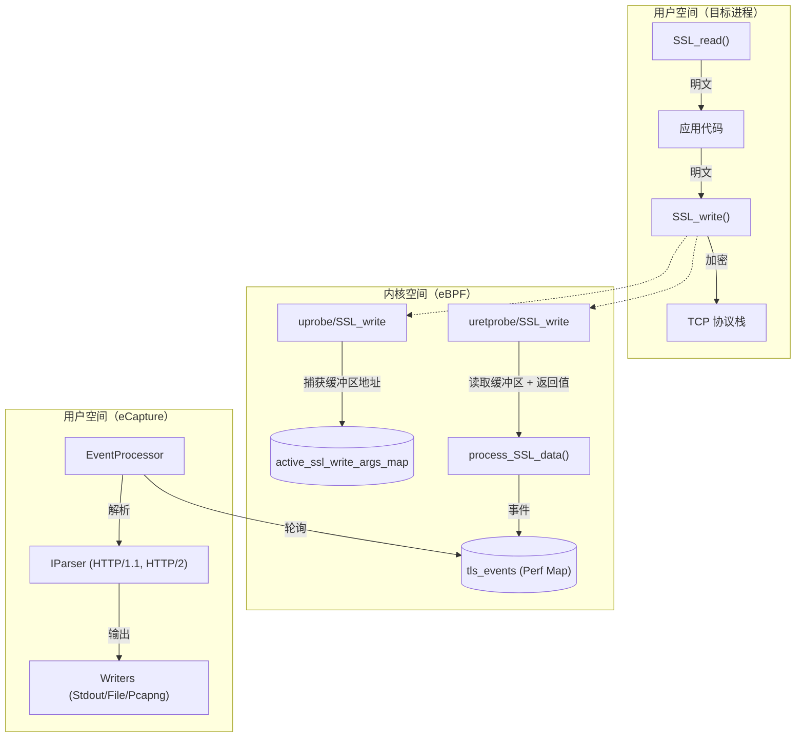
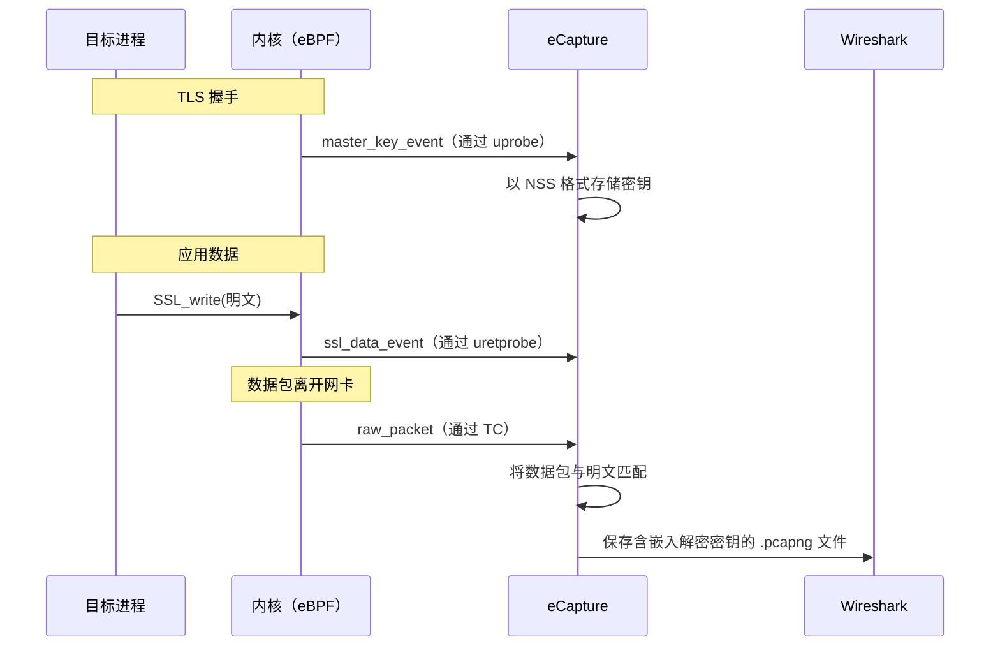

# TLS/SSL 明文捕获 (OpenSSL / BoringSSL)

<details>
<summary>相关源文件</summary>

以下文件被用作生成此维基页面的上下文：

- [.github/agents/pr-agent.md](https://github.com/gojue/ecapture/blob/943a19fe/.github/agents/pr-agent.md)
- [cli/cmd/gnutls.go](https://github.com/gojue/ecapture/blob/943a19fe/cli/cmd/gnutls.go)
- [cli/cmd/gotls.go](https://github.com/gojue/ecapture/blob/943a19fe/cli/cmd/gotls.go)
- [cli/cmd/nss.go](https://github.com/gojue/ecapture/blob/943a19fe/cli/cmd/nss.go)
- [cli/cmd/tls.go](https://github.com/gojue/ecapture/blob/943a19fe/cli/cmd/tls.go)
- [internal/probe/bash/bash_probe.go](https://github.com/gojue/ecapture/blob/943a19fe/internal/probe/bash/bash_probe.go)
- [internal/probe/gotls/config_iface.go](https://github.com/gojue/ecapture/blob/943a19fe/internal/probe/gotls/config_iface.go)
- [internal/probe/gotls/config_iface_test.go](https://github.com/gojue/ecapture/blob/943a19fe/internal/probe/gotls/config_iface_test.go)
- [internal/probe/mysql/mysql_probe.go](https://github.com/gojue/ecapture/blob/943a19fe/internal/probe/mysql/mysql_probe.go)
- [internal/probe/openssl/config_ecandroid.go](https://github.com/gojue/ecapture/blob/943a19fe/internal/probe/openssl/config_ecandroid.go)
- [internal/probe/openssl/config_iface.go](https://github.com/gojue/ecapture/blob/943a19fe/internal/probe/openssl/config_iface.go)
- [internal/probe/openssl/config_iface_test.go](https://github.com/gojue/ecapture/blob/943a19fe/internal/probe/openssl/config_iface_test.go)
- [internal/probe/openssl/config_linux.go](https://github.com/gojue/ecapture/blob/943a19fe/internal/probe/openssl/config_linux.go)
- [internal/probe/openssl/openssl_probe.go](https://github.com/gojue/ecapture/blob/943a19fe/internal/probe/openssl/openssl_probe.go)
- [internal/probe/postgres/postgres_probe.go](https://github.com/gojue/ecapture/blob/943a19fe/internal/probe/postgres/postgres_probe.go)
- [internal/probe/zsh/zsh_probe.go](https://github.com/gojue/ecapture/blob/943a19fe/internal/probe/zsh/zsh_probe.go)
- [kern/boringssl_const.h](https://github.com/gojue/ecapture/blob/943a19fe/kern/boringssl_const.h)
- [kern/boringssl_masterkey.h](https://github.com/gojue/ecapture/blob/943a19fe/kern/boringssl_masterkey.h)
- [kern/gnutls.h](https://github.com/gojue/ecapture/blob/943a19fe/kern/gnutls.h)
- [kern/gnutls_masterkey.h](https://github.com/gojue/ecapture/blob/943a19fe/kern/gnutls_masterkey.h)
- [kern/go_argument.h](https://github.com/gojue/ecapture/blob/943a19fe/kern/go_argument.h)
- [kern/include/openssl_masterkey_common.h](https://github.com/gojue/ecapture/blob/943a19fe/kern/include/openssl_masterkey_common.h)
- [kern/include/tls_constants.h](https://github.com/gojue/ecapture/blob/943a19fe/kern/include/tls_constants.h)
- [kern/openssl.h](https://github.com/gojue/ecapture/blob/943a19fe/kern/openssl.h)
- [kern/openssl_1_0_2a_kern.c](https://github.com/gojue/ecapture/blob/943a19fe/kern/openssl_1_0_2a_kern.c)
- [kern/openssl_1_1_0a_kern.c](https://github.com/gojue/ecapture/blob/943a19fe/kern/openssl_1_1_0a_kern.c)
- [kern/openssl_1_1_1b_kern.c](https://github.com/gojue/ecapture/blob/943a19fe/kern/openssl_1_1_1b_kern.c)
- [kern/openssl_1_1_1d_kern.c](https://github.com/gojue/ecapture/blob/943a19fe/kern/openssl_1_1_1d_kern.c)
- [kern/openssl_1_1_1j_kern.c](https://github.com/gojue/ecapture/blob/943a19fe/kern/openssl_1_1_1j_kern.c)
- [kern/openssl_3_0_0_kern.c](https://github.com/gojue/ecapture/blob/943a19fe/kern/openssl_3_0_0_kern.c)
- [kern/openssl_masterkey.h](https://github.com/gojue/ecapture/blob/943a19fe/kern/openssl_masterkey.h)
- [kern/openssl_masterkey_3.0.h](https://github.com/gojue/ecapture/blob/943a19fe/kern/openssl_masterkey_3.0.h)
- [kern/openssl_masterkey_3.2.h](https://github.com/gojue/ecapture/blob/943a19fe/kern/openssl_masterkey_3.2.h)
- [kern/zsh_kern.c](https://github.com/gojue/ecapture/blob/943a19fe/kern/zsh_kern.c)
- [test/e2e/android/android_tls_e2e_test.sh](https://github.com/gojue/ecapture/blob/943a19fe/test/e2e/android/android_tls_e2e_test.sh)
- [utils/openssl_offset_1.0.2.sh](https://github.com/gojue/ecapture/blob/943a19fe/utils/openssl_offset_1.0.2.sh)
- [utils/openssl_offset_1.1.0.sh](https://github.com/gojue/ecapture/blob/943a19fe/utils/openssl_offset_1.1.0.sh)
- [utils/openssl_offset_1.1.1.sh](https://github.com/gojue/ecapture/blob/943a19fe/utils/openssl_offset_1.1.1.sh)
- [utils/openssl_offset_3.0.sh](https://github.com/gojue/ecapture/blob/943a19fe/utils/openssl_offset_3.0.sh)
- [utils/openssl_offset_3.1.sh](https://github.com/gojue/ecapture/blob/943a19fe/utils/openssl_offset_3.1.sh)
- [utils/openssl_offset_3.2.sh](https://github.com/gojue/ecapture/blob/943a19fe/utils/openssl_offset_3.2.sh)
- [utils/openssl_offset_3.3.sh](https://github.com/gojue/ecapture/blob/943a19fe/utils/openssl_offset_3.3.sh)
- [utils/openssl_offset_3.4.sh](https://github.com/gojue/ecapture/blob/943a19fe/utils/openssl_offset_3.4.sh)

</details>


`tls` 探针是 eCapture 用于拦截使用 **OpenSSL** 或 **BoringSSL** 库的应用程序明文通信的主要模块。通过利用 eBPF `uprobes`，eCapture 挂钩到库的读写函数，在解密后（用于入站流量）或加密前（用于出站流量）捕获数据，无需安装 CA 证书或配置代理。

## 实现概述

该探针通过将 eBPF 程序附加到目标共享库（例如 `libssl.so`）的符号表来运行。它挂钩了主要的数据处理函数 `SSL_read` 和 `SSL_write`。

### 挂钩机制
1.  **入口钩子（Entry Hooks）**：附加到 `SSL_read` 和 `SSL_write` 的起始处。这些钩子捕获函数参数（缓冲区指针和文件描述符），并将其存储在以线程 ID（TID）为索引的 BPF map 中 [kern/openssl.h:97-110](https://github.com/gojue/ecapture/blob/943a19fe/kern/openssl.h#L97-L110)。
2.  **返回钩子（uretprobes）**：附加到这些函数的返回处。这些钩子检索之前存储的缓冲区指针，从用户空间读取已填充的明文数据，并通过 Perf Event Array 将其发送到用户态控制平面 [kern/openssl.h:163-190](https://github.com/gojue/ecapture/blob/943a19fe/kern/openssl.h#L163-L190)。

### 数据流架构

下图展示了 TLS 数据捕获事件的生命周期：

**TLS 捕获数据路径**

Sources: [kern/openssl.h:163-190](https://github.com/gojue/ecapture/blob/943a19fe/kern/openssl.h#L163-L190), [internal/probe/openssl/openssl_probe.go:1-50](https://github.com/gojue/ecapture/blob/943a19fe/internal/probe/openssl/openssl_probe.go#L1-L50), [cli/cmd/tls.go:29-48](https://github.com/gojue/ecapture/blob/943a19fe/cli/cmd/tls.go#L29-L48)

## 支持的版本与自动发现

eCapture 通过维护内部结构体偏移量（如 `SSL_ST_VERSION`、`SSL_ST_S3` 和 `SSL_SESSION_ST_MASTER_KEY`）的映射，支持多种 OpenSSL 和 BoringSSL 版本。

### 支持范围
*   **OpenSSL**：1.0.2、1.1.0、1.1.1 以及 3.0.x 至 3.x [cli/cmd/tls.go:32-32](https://github.com/gojue/ecapture/blob/943a19fe/cli/cmd/tls.go#L32-L32)。
*   **BoringSSL**：常见于 Android 和基于 Chromium 的应用程序。

### 自动发现
探针会尝试使用系统默认值（例如通过 `ldconfig` 或 `curl` 使用的常见路径）自动定位 `libssl.so` 路径 [cli/cmd/tls.go:51-51](https://github.com/gojue/ecapture/blob/943a19fe/cli/cmd/tls.go#L51-L51)。用户也可以通过 `--libssl` 标志手动指定路径。

## Android BoringSSL 处理

Android 使用 BoringSSL，在生产版本中通常缺少标准符号表，或在不同 Android 版本（GKI）之间使用非标准偏移量。eCapture 包含针对以下方面的专门处理：
*   **版本分支**：针对 Android 13（`a_13`）至 Android 16（`a_16`）以及 `na` 分支的专项支持 [kern/boringssl_masterkey.h:84-84](https://github.com/gojue/ecapture/blob/943a19fe/kern/boringssl_masterkey.h#L84-L84)。
*   **主密钥捕获**：对于 TLS 1.3，eCapture 挂钩 BoringSSL 内部握手状态以提取 `client_random` 和流量密钥 [kern/boringssl_masterkey.h:33-52](https://github.com/gojue/ecapture/blob/943a19fe/kern/boringssl_masterkey.h#L33-L52)。

## 输出模式

`tls` 探针支持三种不同的输出模式，通过 `-m` 或 `--model` 标志进行配置 [cli/cmd/tls.go:53-53](https://github.com/gojue/ecapture/blob/943a19fe/cli/cmd/tls.go#L53-L53)。

| 模式 | CLI 标志 | 描述 | 使用场景 |
| :--- | :--- | :--- | :--- |
| **文本（Text）** | `-m text` | 直接将明文输出到控制台或日志文件。 | 快速调试、使用 grep 查找特定字符串。 |
| **密钥日志（Keylog）** | `-m keylog` | 将 TLS 主密钥保存为 NSS Key Log 格式文件。 | 在 Wireshark 中解密由其他工具（如 tcpdump）捕获的流量。 |
| **Pcapng** | `-m pcap` | 通过 TC 捕获原始网络数据包，并将解密后的明文作为元数据注入。 | 在 Wireshark 中进行完整的协议分析。 |

### CLI 示例
```bash
# 捕获明文并按 PID 过滤
ecapture tls -m text --pid 1234

# 保存密钥以供 Wireshark 使用
ecapture tls -m keylog -k my_keys.log

# 在 wlan0 接口上捕获 pcapng
ecapture tls -m pcap -i wlan0 -w capture.pcapng
```
Sources: [cli/cmd/tls.go:35-40](https://github.com/gojue/ecapture/blob/943a19fe/cli/cmd/tls.go#L35-L40)

## Wireshark 集成流程

`pcapng` 模式提供了与 Wireshark 最无缝的集成。eCapture 使用 eBPF TC（流量控制）分类器捕获数据包，并将其与通过 uprobes 捕获的解密数据关联起来。

**Wireshark 集成逻辑**


### 集成步骤
1.  **捕获**：运行 `ecapture tls -m pcap -i eth0 -w out.pcapng`。
2.  **打开**：在 Wireshark 中打开 `out.pcapng`。
3.  **配置**：在 Wireshark 中，进入 `首选项` -> `协议` -> `TLS` -> `（Pre）-Master-Secret 日志文件名`，指向 eCapture 生成的密钥日志文件（如果使用 `-m keylog`），或在 pcapng 模式下依赖嵌入的密钥。

Sources: [kern/openssl.h:15-16](https://github.com/gojue/ecapture/blob/943a19fe/kern/openssl.h#L15-L16), [cli/cmd/tls.go:33-40](https://github.com/gojue/ecapture/blob/943a19fe/cli/cmd/tls.go#L33-L40), [kern/openssl_masterkey.h:24-32](https://github.com/gojue/ecapture/blob/943a19fe/kern/openssl_masterkey.h#L24-L32)