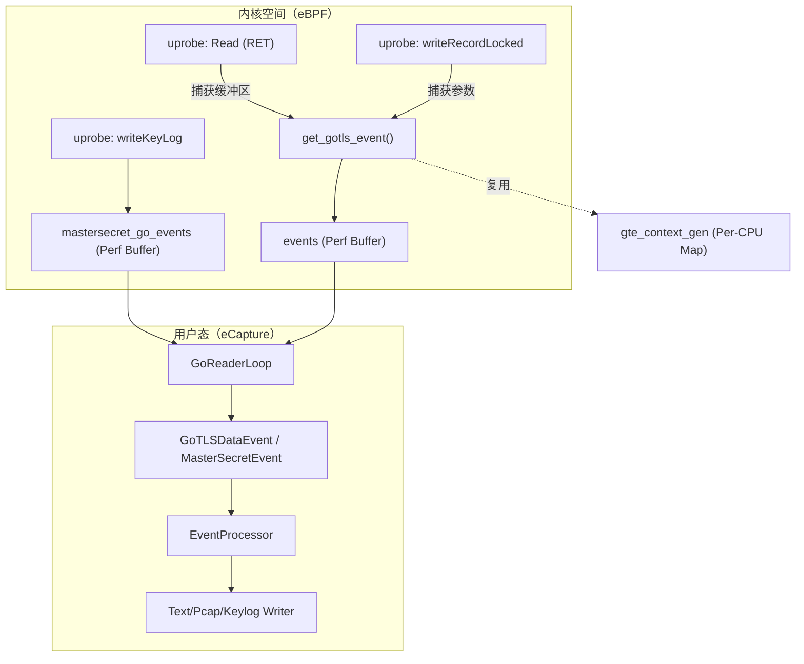
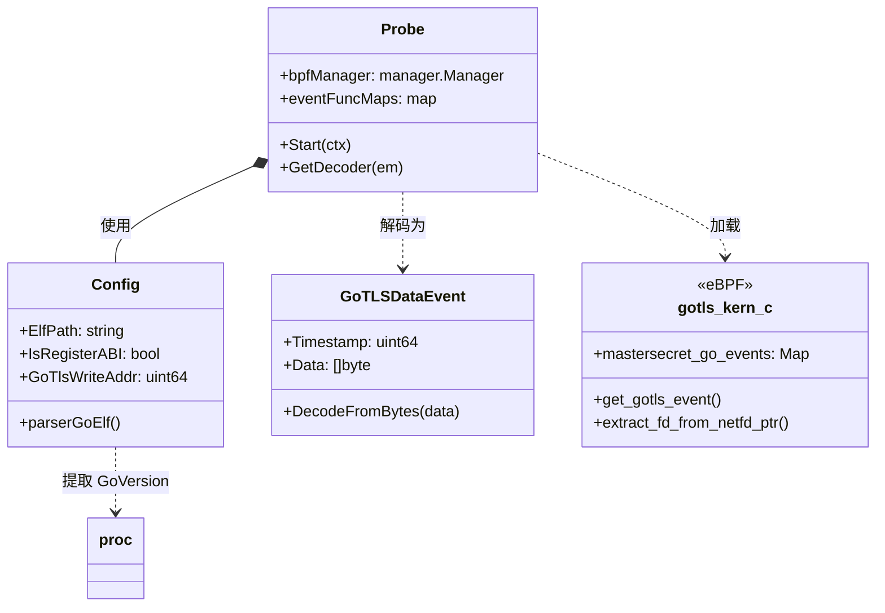

# GoTLS 捕获

<details>
<summary>相关源文件</summary>

以下文件被用作生成此维基页面的上下文：

- [cli/cmd/gnutls.go](https://github.com/gojue/ecapture/blob/943a19fe/cli/cmd/gnutls.go)
- [cli/cmd/gotls.go](https://github.com/gojue/ecapture/blob/943a19fe/cli/cmd/gotls.go)
- [cli/cmd/nss.go](https://github.com/gojue/ecapture/blob/943a19fe/cli/cmd/nss.go)
- [cli/cmd/tls.go](https://github.com/gojue/ecapture/blob/943a19fe/cli/cmd/tls.go)
- [internal/config/base_config.go](https://github.com/gojue/ecapture/blob/943a19fe/internal/config/base_config.go)
- [internal/domain/configuration.go](https://github.com/gojue/ecapture/blob/943a19fe/internal/domain/configuration.go)
- [internal/probe/base/base_probe.go](https://github.com/gojue/ecapture/blob/943a19fe/internal/probe/base/base_probe.go)
- [internal/probe/gotls/config.go](https://github.com/gojue/ecapture/blob/943a19fe/internal/probe/gotls/config.go)
- [internal/probe/gotls/event.go](https://github.com/gojue/ecapture/blob/943a19fe/internal/probe/gotls/event.go)
- [internal/probe/gotls/event_test.go](https://github.com/gojue/ecapture/blob/943a19fe/internal/probe/gotls/event_test.go)
- [internal/probe/gotls/gotls_probe.go](https://github.com/gojue/ecapture/blob/943a19fe/internal/probe/gotls/gotls_probe.go)
- [internal/probe/openssl/config.go](https://github.com/gojue/ecapture/blob/943a19fe/internal/probe/openssl/config.go)
- [internal/probe/openssl/config_test.go](https://github.com/gojue/ecapture/blob/943a19fe/internal/probe/openssl/config_test.go)
- [kern/gotls_kern.c](https://github.com/gojue/ecapture/blob/943a19fe/kern/gotls_kern.c)
- [pkg/proc/go_elf/eprint.go](https://github.com/gojue/ecapture/blob/943a19fe/pkg/proc/go_elf/eprint.go)
- [pkg/proc/go_elf/gccgo.go](https://github.com/gojue/ecapture/blob/943a19fe/pkg/proc/go_elf/gccgo.go)
- [pkg/proc/proc.go](https://github.com/gojue/ecapture/blob/943a19fe/pkg/proc/proc.go)
- [pkg/proc/proc_test.go](https://github.com/gojue/ecapture/blob/943a19fe/pkg/proc/proc_test.go)

</details>


`gotls` 探针是 eCapture 专为拦截使用 Go 语言原生 `crypto/tls` 包构建的应用程序明文通信而设计的专用模块。与针对 OpenSSL 等共享库的 `tls` 探针不同，`gotls` 探针必须处理 Go 的独特运行时特性，包括其自定义调用约定和静态链接的二进制文件。

## 实现细节

GoTLS 探针通过将 eBPF `uprobes` 附加到 Go 二进制文件 `crypto/tls` 包中的特定函数来运行。由于 Go 二进制文件通常是静态链接的，eCapture 必须在运行时从目标 ELF 文件的符号表中定位这些函数。

### 关键挂钩点

探针针对 Go 标准库中的三个主要函数：

| 函数名 | 用途 | eBPF 钩子类型 |
| :--- | :--- | :--- |
| `crypto/tls.(*Conn).Read` | 捕获入站明文数据。 | `uprobe`（在 RET 指令上） |
| `crypto/tls.(*Conn).writeRecordLocked` | 捕获出站明文数据。 | `uprobe`（在入口处） |
| `crypto/tls.(*Config).writeKeyLog` | 捕获 TLS 主密钥供 Wireshark 使用。 | `uprobe`（在入口处） |

Sources: [internal/probe/gotls/gotls_probe.go:45-49](https://github.com/gojue/ecapture/blob/943a19fe/internal/probe/gotls/gotls_probe.go#L45-L49), [internal/probe/gotls/config.go:201-240](https://github.com/gojue/ecapture/blob/943a19fe/internal/probe/gotls/config.go#L201-L240)

### 调用约定（ABI）

Go 在 1.17 版本中更改了其调用约定。eCapture 会自动检测目标二进制文件的 Go 版本，以确定如何提取函数参数：

1.  **基于栈（1.17 之前）**：参数通过栈传递。eBPF 程序必须计算相对于栈指针（`sp`）的偏移量。
2.  **基于寄存器（1.17 之后）**：参数通过寄存器传递（例如，x86_64 上的 `RAX`、`RBX`）。这被称为 `Register ABI`。

`Config` 对象在 `Initialize` 阶段通过调用 `proc.ExtraceGoVersion` 来确定使用哪种约定。

Sources: [internal/probe/gotls/config.go:146-154](https://github.com/gojue/ecapture/blob/943a19fe/internal/probe/gotls/config.go#L146-L154), [pkg/proc/proc.go:34-45](https://github.com/gojue/ecapture/blob/943a19fe/pkg/proc/proc.go#L34-L45)

### 数据流架构

下图展示了 GoTLS 事件从内核钩子到用户态输出的生命周期。

**GoTLS 事件处理流程**



Sources: [kern/gotls_kern.c:61-81](https://github.com/gojue/ecapture/blob/943a19fe/kern/gotls_kern.c#L61-L81), [internal/probe/gotls/gotls_probe.go:142-152](https://github.com/gojue/ecapture/blob/943a19fe/internal/probe/gotls/gotls_probe.go#L142-L152), [internal/probe/gotls/event.go:54-74](https://github.com/gojue/ecapture/blob/943a19fe/internal/probe/gotls/event.go#L54-L74)

## 支持的版本与要求

*   **Go 版本**：支持 Go 1.13 至最新稳定版。
*   **符号表**：目标 Go 二进制文件**不能被完全剥离**符号表。eCapture 需要符号来定位 `Read`、`Write` 和 `writeKeyLog` 的偏移量。
*   **PIE 支持**：支持位置无关可执行文件（PIE）。eCapture 会相应地计算基址和偏移量。

Sources: [internal/probe/gotls/config.go:185-200](https://github.com/gojue/ecapture/blob/943a19fe/internal/probe/gotls/config.go#L185-L200), [internal/probe/gotls/config.go:36-44](https://github.com/gojue/ecapture/blob/943a19fe/internal/probe/gotls/config.go#L36-L44)

## 技术映射：代码到逻辑

下图将逻辑捕获需求映射到 `gotls` 包中的具体代码实体。

**GoTLS 逻辑映射**



Sources: [internal/probe/gotls/gotls_probe.go:52-67](https://github.com/gojue/ecapture/blob/943a19fe/internal/probe/gotls/gotls_probe.go#L52-L67), [internal/probe/gotls/config.go:47-92](https://github.com/gojue/ecapture/blob/943a19fe/internal/probe/gotls/config.go#L47-L92), [internal/probe/gotls/event.go:54-74](https://github.com/gojue/ecapture/blob/943a19fe/internal/probe/gotls/event.go#L54-L74), [kern/gotls_kern.c:132-144](https://github.com/gojue/ecapture/blob/943a19fe/kern/gotls_kern.c#L132-L144)

## 使用示例

### 文本模式（标准输出）
从指定 Go 二进制文件捕获明文：
```bash
ecapture gotls --elfpath=/path/to/go_binary --pid=1234
```

### 密钥日志模式（Wireshark 解密）
将 TLS 密钥保存为 NSS 格式的密钥日志文件：
```bash
ecapture gotls -m keylog -k /tmp/gotls.keylog --elfpath=/path/to/go_binary
```

### PCAP 模式
捕获原始数据包，并通过 pcapng 文件将其与明文关联：
```bash
ecapture gotls -m pcap -i eth0 -w output.pcapng --elfpath=/path/to/go_binary
```

Sources: [cli/cmd/gotls.go:29-43](https://github.com/gojue/ecapture/blob/943a19fe/cli/cmd/gotls.go#L29-L43)

## 已知限制

1.  **已剥离二进制文件**：如果使用 `ldflags="-s -w"` 剥离了二进制文件，探针将无法找到函数偏移量。
2.  **自定义 TLS 库**：此探针仅支持标准 `crypto/tls` 库。使用 CGO 调用 OpenSSL 的应用程序应改用 `tls`（OpenSSL）探针。
3.  **内联优化**：如果 Go 编译器内联了目标函数（对于标准库中这些特定方法来说较为罕见），`uprobe` 可能无法正确触发。

Sources: [internal/probe/gotls/config.go:36-44](https://github.com/gojue/ecapture/blob/943a19fe/internal/probe/gotls/config.go#L36-L44), [internal/probe/gotls/gotls_probe.go:45-49](https://github.com/gojue/ecapture/blob/943a19fe/internal/probe/gotls/gotls_probe.go#L45-L49)