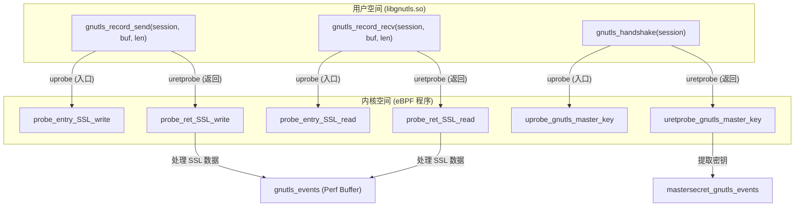
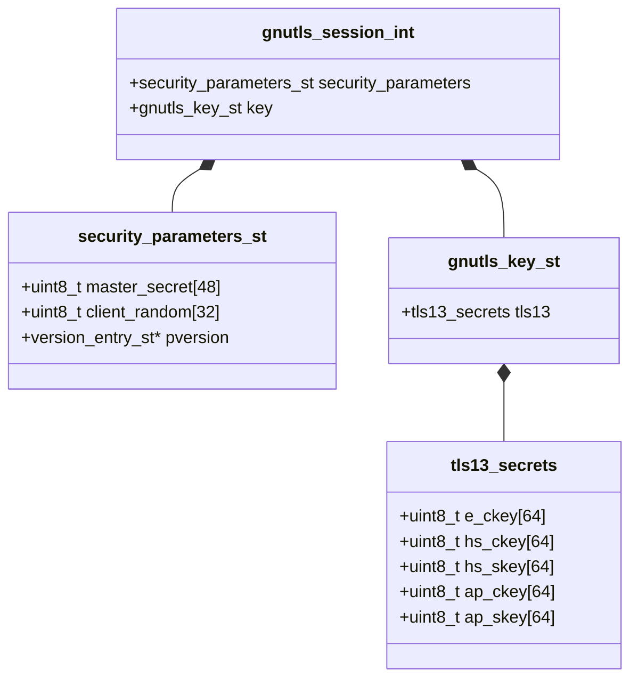

# GnuTLS 捕获

<details>
<summary>相关源文件</summary>

以下文件被用作生成此维基页面的上下文：

- [cli/cmd/gnutls.go](https://github.com/gojue/ecapture/blob/943a19fe/cli/cmd/gnutls.go)
- [cli/cmd/gotls.go](https://github.com/gojue/ecapture/blob/943a19fe/cli/cmd/gotls.go)
- [cli/cmd/nss.go](https://github.com/gojue/ecapture/blob/943a19fe/cli/cmd/nss.go)
- [cli/cmd/tls.go](https://github.com/gojue/ecapture/blob/943a19fe/cli/cmd/tls.go)
- [kern/gnutls.h](https://github.com/gojue/ecapture/blob/943a19fe/kern/gnutls.h)
- [kern/gnutls_3_6_12_kern.c](https://github.com/gojue/ecapture/blob/943a19fe/kern/gnutls_3_6_12_kern.c)
- [kern/gnutls_3_7_0_kern.c](https://github.com/gojue/ecapture/blob/943a19fe/kern/gnutls_3_7_0_kern.c)
- [kern/gnutls_3_7_3_kern.c](https://github.com/gojue/ecapture/blob/943a19fe/kern/gnutls_3_7_3_kern.c)
- [kern/gnutls_3_7_7_kern.c](https://github.com/gojue/ecapture/blob/943a19fe/kern/gnutls_3_7_7_kern.c)
- [kern/gnutls_3_8_4_kern.c](https://github.com/gojue/ecapture/blob/943a19fe/kern/gnutls_3_8_4_kern.c)
- [kern/gnutls_3_8_7_kern.c](https://github.com/gojue/ecapture/blob/943a19fe/kern/gnutls_3_8_7_kern.c)
- [kern/gnutls_masterkey.h](https://github.com/gojue/ecapture/blob/943a19fe/kern/gnutls_masterkey.h)
- [kern/openssl_masterkey_3.2.h](https://github.com/gojue/ecapture/blob/943a19fe/kern/openssl_masterkey_3.2.h)
- [kern/zsh_kern.c](https://github.com/gojue/ecapture/blob/943a19fe/kern/zsh_kern.c)
- [utils/gnutls_offset.c](https://github.com/gojue/ecapture/blob/943a19fe/utils/gnutls_offset.c)

</details>

`gnutls` 探针旨在捕获使用 GnuTLS 库的应用程序的明文通信，例如 `wget`、`curl`（编译时启用了 GnuTLS 支持）以及各种微服务。与 OpenSSL 探针类似，它使用 eBPF uprobes 在库级别拦截加密前或解密后的数据，从而无需 CA 证书或中间人代理。

## 适用二进制文件与范围

GnuTLS 探针针对链接到 `libgnutls.so` 的二进制文件。常见的例子包括：
*   **Wget**：在现代 Linux 发行版上几乎总是使用 GnuTLS。
*   **Curl**：某些发行版（如 Debian/Ubuntu 变体）提供 `curl-gnutls` 软件包。
*   **微服务**：出于授权或架构原因偏好 GnuTLS 而非 OpenSSL 的 C/C++ 应用程序。
*   **Android (Termux)**：可用于捕获通过 Termux 软件包管理器安装的 GnuTLS 流量 [cli/cmd/gnutls.go:45-47](https://github.com/gojue/ecapture/blob/943a19fe/cli/cmd/gnutls.go#L45-L47)。

### 支持的版本
eCapture 支持广泛的 GnuTLS 版本，具体覆盖从 **3.6.12 到 3.8.7** 的分支 [cli/cmd/gnutls.go:32-32](https://github.com/gojue/ecapture/blob/943a19fe/cli/cmd/gnutls.go#L32-L32)。由于 GnuTLS 内部结构（如 `gnutls_session_int`）在不同版本之间变化频繁，eCapture 使用特定的头文件来定义不同版本范围的偏移量：
*   **3.6.12**: [kern/gnutls_3_6_12_kern.c:1-49](https://github.com/gojue/ecapture/blob/943a19fe/kern/gnutls_3_6_12_kern.c#L1-L49)
*   **3.7.3 ~ 3.7.6**: [kern/gnutls_3_7_3_kern.c:1-49](https://github.com/gojue/ecapture/blob/943a19fe/kern/gnutls_3_7_3_kern.c#L1-L49)
*   **3.8.7 ~ 3.8.9**: [kern/gnutls_3_8_7_kern.c:1-49](https://github.com/gojue/ecapture/blob/943a19fe/kern/gnutls_3_8_7_kern.c#L1-L49)

## 实现细节

### 数据流与挂载点
探针挂载了两个主要函数用于数据捕获：`gnutls_record_send` 和 `gnutls_record_recv`。

1.  **gnutls_record_send**：在应用程序发送明文数据被加密前进行拦截。
2.  **gnutls_record_recv**：在应用程序接收明文数据被解密后进行拦截。

对于主密钥（master key）提取（用于 `keylog` 和 `pcap` 模式），探针挂载了 `gnutls_handshake` [kern/gnutls_masterkey.h:161-161](https://github.com/gojue/ecapture/blob/943a19fe/kern/gnutls_masterkey.h#L161-L161)。

### GnuTLS 代码到内核的映射
下图展示了用户空间的 GnuTLS 函数调用如何映射到内核中的 eBPF 程序。

**图表：GnuTLS 探针挂载映射**

Sources: [kern/gnutls.h:117-187](https://github.com/gojue/ecapture/blob/943a19fe/kern/gnutls.h#L117-L187), [kern/gnutls_masterkey.h:161-210](https://github.com/gojue/ecapture/blob/943a19fe/kern/gnutls_masterkey.h#L161-L210)

### 内部结构
eCapture 复制了 GnuTLS 的内部结构，以便访问 session 对象并提取密钥。用于事件上报的主要结构体是 `ssl_data_event_t` [kern/gnutls.h:20-28](https://github.com/gojue/ecapture/blob/943a19fe/kern/gnutls.h#L20-L28)。对于 TLS 1.3 主密钥，它通过访问 `gnutls_session_int` 来获取 `gnutls_key_st` 联合体 [kern/gnutls_masterkey.h:56-82](https://github.com/gojue/ecapture/blob/943a19fe/kern/gnutls_masterkey.h#L56-L82)。

**图表：TLS 1.3 密钥的 GnuTLS Session 访问路径**

Sources: [kern/gnutls_masterkey.h:19-82](https://github.com/gojue/ecapture/blob/943a19fe/kern/gnutls_masterkey.h#L19-L82), [utils/gnutls_offset.c:10-21](https://github.com/gojue/ecapture/blob/943a19fe/utils/gnutls_offset.c#L10-L21)

## CLI 用法与配置

`gnutls` 命令提供了多个参数来自定义捕获行为。

| 参数 | 描述 | 默认值 |
| :--- | :--- | :--- |
| `--gnutls` | `libgnutls.so` 的路径。如果为空，eCapture 将尝试自动查找。 | `""` |
| `-m, --model` | 捕获模式：`text`、`pcap` 或 `keylog`。 | `text` |
| `-k, --keylogfile` | 保存 TLS 主密钥的文件（NSS Key Log 格式）。 | `ecapture_gnutls_key.log` |
| `--ssl_version` | 强制指定特定的 GnuTLS 版本（例如 "3.7.9"）。 | `""` |
| `-i, --ifname` | 用于基于 TC 的数据包捕获的网络接口（pcap 模式）。 | `""` |

### 示例

**基础文本捕获：**
```bash
ecapture gnutls --pid=1234
```

**捕获为带 Keylog 的 PCAPNG：**
```bash
ecapture gnutls -m pcap -i eth0 -w output.pcapng -k keys.log
```
Sources: [cli/cmd/gnutls.go:38-59](https://github.com/gojue/ecapture/blob/943a19fe/cli/cmd/gnutls.go#L38-L59)

## 库文件自动查找
如果未提供 `--gnutls` 参数，探针将尝试自动查找 GnuTLS 库路径。它通常会查找标准系统路径（如 `/lib/x86_64-linux-gnu/libgnutls.so`）或通过常见的二进制依赖项（如 `curl`）进行搜索 [cli/cmd/gnutls.go:52-52](https://github.com/gojue/ecapture/blob/943a19fe/cli/cmd/gnutls.go#L52-L52)。

## GnuTLS 与 OpenSSL 探针对比
用户经常询问该使用哪个探针。虽然许多工具同时支持这两个库，但选择取决于目标二进制文件的链接情况：

*   **使用 [TLS/SSL 明文捕获 (OpenSSL / BoringSSL)](3.1-tlsssl-plaintext-capture-openssl--boringssl.md)**：适用于 `nginx`、`openssl` 命令行工具、Node.js、Python 以及大多数现代服务端软件。
*   **使用 [GnuTLS 捕获](3.3-gnutls-capture.md)**：适用于 `wget`、`apt` 以及针对 GnuTLS 编译的特定 Linux 工具。
*   **查找技巧**：使用 `ldd $(which <binary>) | grep -E 'ssl|gnutls'` 来识别应用程序正在使用哪个库。

Sources: [cli/cmd/tls.go:32-32](https://github.com/gojue/ecapture/blob/943a19fe/cli/cmd/tls.go#L32-L32), [cli/cmd/gnutls.go:36-36](https://github.com/gojue/ecapture/blob/943a19fe/cli/cmd/gnutls.go#L36-L36)