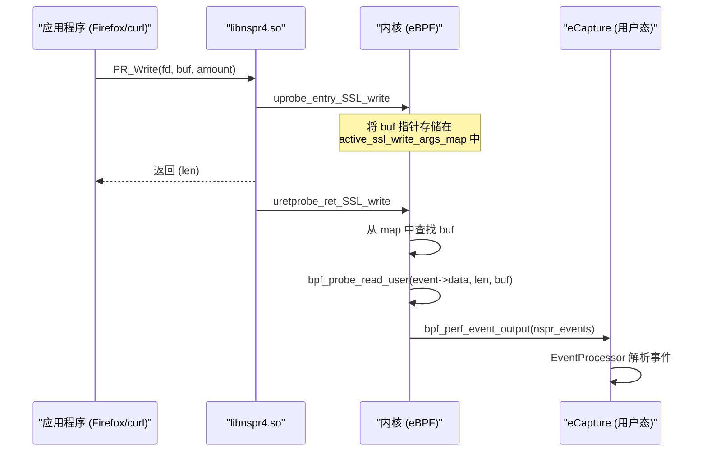
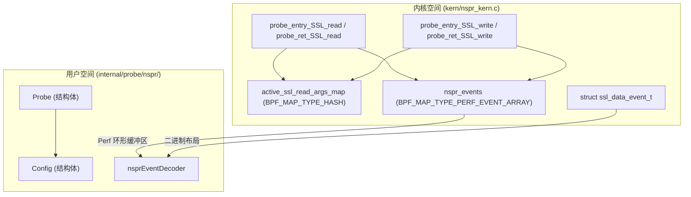

# NSS / NSPR 捕获

相关源文件

以下文件被用作生成此维基页面的上下文：

- [cli/cmd/gnutls.go](https://github.com/gojue/ecapture/blob/943a19fe/cli/cmd/gnutls.go)
- [cli/cmd/gotls.go](https://github.com/gojue/ecapture/blob/943a19fe/cli/cmd/gotls.go)
- [cli/cmd/nss.go](https://github.com/gojue/ecapture/blob/943a19fe/cli/cmd/nss.go)
- [cli/cmd/tls.go](https://github.com/gojue/ecapture/blob/943a19fe/cli/cmd/tls.go)
- [internal/probe/bash/bash_probe.go](https://github.com/gojue/ecapture/blob/943a19fe/internal/probe/bash/bash_probe.go)
- [internal/probe/mysql/mysql_probe.go](https://github.com/gojue/ecapture/blob/943a19fe/internal/probe/mysql/mysql_probe.go)
- [internal/probe/openssl/openssl_probe.go](https://github.com/gojue/ecapture/blob/943a19fe/internal/probe/openssl/openssl_probe.go)
- [internal/probe/postgres/postgres_probe.go](https://github.com/gojue/ecapture/blob/943a19fe/internal/probe/postgres/postgres_probe.go)
- [internal/probe/zsh/zsh_probe.go](https://github.com/gojue/ecapture/blob/943a19fe/internal/probe/zsh/zsh_probe.go)
- [kern/bash_kern.c](https://github.com/gojue/ecapture/blob/943a19fe/kern/bash_kern.c)
- [kern/mysqld_kern.c](https://github.com/gojue/ecapture/blob/943a19fe/kern/mysqld_kern.c)
- [kern/nspr_kern.c](https://github.com/gojue/ecapture/blob/943a19fe/kern/nspr_kern.c)

eCapture 中的 `nspr` 探针旨在拦截使用 **Netscape Portable Runtime (NSPR)** 和 **Network Security Services (NSS)** 库的应用程序的明文通信。这是 **Mozilla Firefox**、**Thunderbird** 以及编译时支持 NSS 的 `curl` 版本所使用的主要密码学栈 [cli/cmd/nss.go:30-33](https://github.com/gojue/ecapture/blob/943a19fe/cli/cmd/nss.go#L30-L33)。

## 工作原理

与挂载（hook）`SSL_read` 和 `SSL_write` 的 OpenSSL 探针不同，NSS 探针的目标是底层的 NSPR (Netscape Portable Runtime) I/O 层。具体来说，它挂载了 `libnspr4.so` 中的 `PR_Read` 和 `PR_Write` 函数 [kern/nspr_kern.c:113-152](https://github.com/gojue/ecapture/blob/943a19fe/kern/nspr_kern.c#L113-L152)。

### 挂载策略

该探针利用 eBPF 的 `uprobe` 和 `uretprobe` 来捕获数据：
1.  **uprobe**：附加到 `PR_Read` 和 `PR_Write` 的入口，以捕获应用程序传递的缓冲区指针 (`buf`) [kern/nspr_kern.c:113-126](https://github.com/gojue/ecapture/blob/943a19fe/kern/nspr_kern.c#L113-L126), [kern/nspr_kern.c:152-165](https://github.com/gojue/ecapture/blob/943a19fe/kern/nspr_kern.c#L152-L165)。
2.  **uretprobe**：附加到这些函数的返回处。此时，返回值 (`PT_REGS_RC`) 表示实际读取或写入的字节数。随后 eCapture 从之前捕获的缓冲区指针中读取相应数量的数据 [kern/nspr_kern.c:128-145](https://github.com/gojue/ecapture/blob/943a19fe/kern/nspr_kern.c#L128-L145), [kern/nspr_kern.c:167-184](https://github.com/gojue/ecapture/blob/943a19fe/kern/nspr_kern.c#L167-L184)。

### 数据流图：NSPR 挂载

此图展示了 eBPF 程序如何与 NSPR 库函数交互以提取明文。

"NSPR 捕获流程"

**Sources:** [kern/nspr_kern.c:113-184](https://github.com/gojue/ecapture/blob/943a19fe/kern/nspr_kern.c#L113-L184), [internal/probe/nspr/nspr_probe.go:114-118](https://github.com/gojue/ecapture/blob/943a19fe/internal/probe/nspr/nspr_probe.go#L114-L118) (推导自典型的管理器设置)

## 代码实体映射

下图将逻辑捕获组件映射到内核和用户态中的具体代码实体。

"NSS/NSPR 代码实体映射图"

**Sources:** [kern/nspr_kern.c:19-53](https://github.com/gojue/ecapture/blob/943a19fe/kern/nspr_kern.c#L19-L53), [cli/cmd/nss.go:24-27](https://github.com/gojue/ecapture/blob/943a19fe/cli/cmd/nss.go#L24-L27)。

## 配置与使用

`nspr` 命令允许用户在 NSPR 库不在标准位置时指定其路径。

### CLI 示例
*   **基础捕获**：`ecapture nspr`
*   **按 PID 过滤**：`ecapture nspr --pid=3423` [cli/cmd/nss.go:36](https://github.com/gojue/ecapture/blob/943a19fe/cli/cmd/nss.go#L36)
*   **自定义库路径**：`ecapture nspr --nspr=/usr/lib/libnspr4.so` [cli/cmd/nss.go:38](https://github.com/gojue/ecapture/blob/943a19fe/cli/cmd/nss.go#L38)

### 核心参数
| 标志 | 描述 | 默认值 |
| :--- | :--- | :--- |
| `--nspr` | `libnspr4.so` 的路径。如果为空，eCapture 将尝试自动查找。 | `""` |
| `--hex` | 以十六进制格式打印捕获的数据。 | `false` |
| `--pid` | 按进程 ID 过滤捕获。 | `0` (全部) |

**Sources:** [cli/cmd/nss.go:44-47](https://github.com/gojue/ecapture/blob/943a19fe/cli/cmd/nss.go#L44-L47)

## 实现细节

### 内核数据结构
内核程序定义了一个 `ssl_data_event_t` 结构体来将数据传递给用户态：
*   `type`：指示是读取还是写入事件 [kern/nspr_kern.c:20](https://github.com/gojue/ecapture/blob/943a19fe/kern/nspr_kern.c#L20)。
*   `timestamp_ns`：内核单调时间 [kern/nspr_kern.c:21](https://github.com/gojue/ecapture/blob/943a19fe/kern/nspr_kern.c#L21)。
*   `pid`/`tid`：进程和线程 ID [kern/nspr_kern.c:22-23](https://github.com/gojue/ecapture/blob/943a19fe/kern/nspr_kern.c#L22-L23)。
*   `data`：实际的明文负载（最大为 `MAX_DATA_SIZE_OPENSSL`） [kern/nspr_kern.c:24](https://github.com/gojue/ecapture/blob/943a19fe/kern/nspr_kern.c#L24)。

### 用户态探针初始化
`nssCommandFunc` 使用工厂模式初始化探针：
1.  将全局配置（PID、Debug 等）设置到 `nsprConfig` 中 [cli/cmd/nss.go:50-53](https://github.com/gojue/ecapture/blob/943a19fe/cli/cmd/nss.go#L50-L53)。
2.  使用 `factory.ProbeTypeNSPR` 调用 `runProbe` [cli/cmd/nss.go:55](https://github.com/gojue/ecapture/blob/943a19fe/cli/cmd/nss.go#L55)。

## 探针选择建议

针对特定应用程序时，请参考以下逻辑判断 `nspr` 探针是否适用：

| 目标应用程序 | 推荐探针 | 原因 |
| :--- | :--- | :--- |
| **Firefox / Thunderbird** | `nspr` | 这些程序专门使用 NSS/NSPR 处理 TLS。 |
| **curl (标准版)** | [OpenSSL / BoringSSL 捕获](3.1-tlsssl-plaintext-capture-openssl--boringssl.md) | 大多数发行版的 `curl` 链接到 OpenSSL。 |
| **curl (libcurl-nss)** | `nspr` | 一些旧版本的 RHEL/CentOS 系统使用 NSS 变体。 |
| **wget** | [GnuTLS 捕获](3.3-gnutls-capture.md) | `wget` 通常使用 GnuTLS。 |
| **Nginx / Apache** | [OpenSSL / BoringSSL 捕获](3.1-tlsssl-plaintext-capture-openssl--boringssl.md) | 标准 Web 服务器使用 OpenSSL。 |

**Sources:** [cli/cmd/nss.go:30-33](https://github.com/gojue/ecapture/blob/943a19fe/cli/cmd/nss.go#L30-L33), [cli/cmd/gnutls.go:33-36](https://github.com/gojue/ecapture/blob/943a19fe/cli/cmd/gnutls.go#L33-L36), [cli/cmd/tls.go:32](https://github.com/gojue/ecapture/blob/943a19fe/cli/cmd/tls.go#L32)。