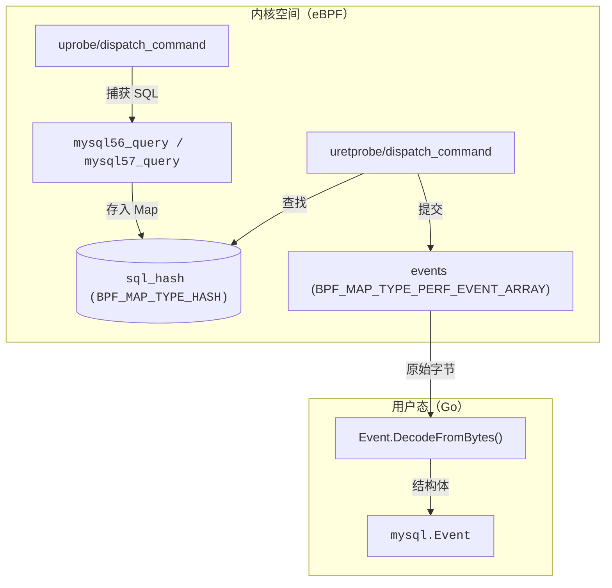
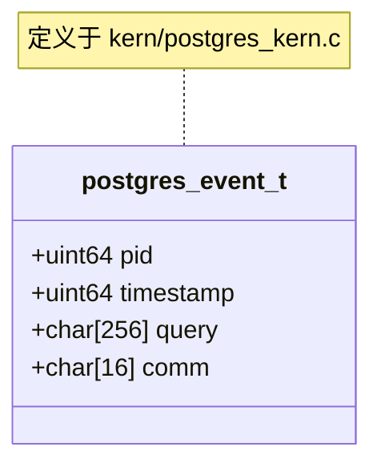

# 数据库流量捕获 (MySQL / PostgreSQL)

<details>
<summary>相关源文件</summary>

以下文件被用作生成此维基页面的上下文：

- [cli/cmd/bash.go](https://github.com/gojue/ecapture/blob/943a19fe/cli/cmd/bash.go)
- [cli/cmd/mysqld.go](https://github.com/gojue/ecapture/blob/943a19fe/cli/cmd/mysqld.go)
- [cli/cmd/postgres.go](https://github.com/gojue/ecapture/blob/943a19fe/cli/cmd/postgres.go)
- [internal/probe/mysql/event.go](https://github.com/gojue/ecapture/blob/943a19fe/internal/probe/mysql/event.go)
- [internal/probe/postgres/event.go](https://github.com/gojue/ecapture/blob/943a19fe/internal/probe/postgres/event.go)
- [kern/bash_kern.c](https://github.com/gojue/ecapture/blob/943a19fe/kern/bash_kern.c)
- [kern/mysqld_kern.c](https://github.com/gojue/ecapture/blob/943a19fe/kern/mysqld_kern.c)
- [kern/nspr_kern.c](https://github.com/gojue/ecapture/blob/943a19fe/kern/nspr_kern.c)
- [kern/postgres_kern.c](https://github.com/gojue/ecapture/blob/943a19fe/kern/postgres_kern.c)

</details>


eCapture 提供了专用探针，通过在数据库服务器进程内部直接拦截明文 SQL 语句来审计数据库流量。通过使用 eBPF `uprobes`，eCapture 在查询被处理之前（或在分发时）捕获查询，从而在无需数据库级日志记录或网络层解密的情况下实现高性能监控。

## 支持的数据库与版本

数据库探针专为针对服务器二进制文件中的特定符号而设计。

| 数据库 | 支持版本 | 挂钩点 |
| :--- | :--- | :--- |
| **MySQL** | 5.6, 5.7, 8.0 | `dispatch_command` |
| **MariaDB** | 10.5+ | `dispatch_command` |
| **PostgreSQL** | 10 及更高版本 | `exec_simple_query` |

Sources: [cli/cmd/mysqld.go:30-35](https://github.com/gojue/ecapture/blob/943a19fe/cli/cmd/mysqld.go#L30-L35), [cli/cmd/postgres.go:29-33](https://github.com/gojue/ecapture/blob/943a19fe/cli/cmd/postgres.go#L29-L33), [kern/postgres_kern.c:31-35](https://github.com/gojue/ecapture/blob/943a19fe/kern/postgres_kern.c#L31-L35)

## 实现原理

数据库探针通过将 `uprobes` 和 `uretprobes` 附加到负责命令分发的内部函数来运行。

### MySQL / MariaDB 捕获流程
MySQL 使用 `dispatch_command` 函数。该函数的签名和数据结构在 5.6、5.7 和 8.0 版本之间有所演变，需要在内核侧 eBPF 程序中进行差异化处理。

1.  **入口钩子（`uprobe`）**：eCapture 读取命令类型。它专门过滤 `COM_QUERY`（0x03），以避免捕获心跳或管理流量 [kern/mysqld_kern.c:60-62](https://github.com/gojue/ecapture/blob/943a19fe/kern/mysqld_kern.c#L60-L62)。
2.  **数据提取**：
    *   在 **MySQL 5.6** 中，查询字符串和长度作为参数直接传递 [kern/mysqld_kern.c:71-85](https://github.com/gojue/ecapture/blob/943a19fe/kern/mysqld_kern.c#L71-L85)。
    *   在 **MySQL 5.7/8.0** 中，查询被封装在 `COM_DATA` union/struct 中，需要使用多阶段 `bpf_probe_read_user` 来解引用字符串指针 [kern/mysqld_kern.c:190-193](https://github.com/gojue/ecapture/blob/943a19fe/kern/mysqld_kern.c#L190-L193)。
3.  **状态管理**：查询数据存储在以线程组 ID（TGID/PID）为键的 BPF Hash Map（`sql_hash`）中 [kern/mysqld_kern.c:29-34](https://github.com/gojue/ecapture/blob/943a19fe/kern/mysqld_kern.c#L29-L34)。
4.  **退出钩子（`uretprobe`）**：当 `dispatch_command` 返回时，探针捕获返回值（状态）并将完整事件发送到用户态 [kern/mysqld_kern.c:93-125](https://github.com/gojue/ecapture/blob/943a19fe/kern/mysqld_kern.c#L93-L125)。

### PostgreSQL 捕获流程
PostgreSQL 的处理更为简单，挂钩 `exec_simple_query(const char *query_string)`。由于查询字符串是第一个参数，eCapture 使用 `PT_REGS_PARM1` 来提取它 [kern/postgres_kern.c:35-53](https://github.com/gojue/ecapture/blob/943a19fe/kern/postgres_kern.c#L35-L53)。

### 代码实体映射：MySQL 探针
下图将逻辑捕获流程映射到代码库中具体的 C 和 Go 实体。

**MySQL 捕获数据流**

Sources: [kern/mysqld_kern.c:19-41](https://github.com/gojue/ecapture/blob/943a19fe/kern/mysqld_kern.c#L19-L41), [internal/probe/mysql/event.go:62-70](https://github.com/gojue/ecapture/blob/943a19fe/internal/probe/mysql/event.go#L62-L70)

## 配置与使用

### MySQL / MariaDB
用户必须指定 `mysqld` 或 `mariadbd` 二进制文件的路径。如果符号被剥离或函数名不同，可以使用 `--offset` 或 `--funcname` 标志。

```bash
# 从默认 MariaDB 路径捕获
ecapture mysqld --mysqld /usr/sbin/mariadbd

# 从指定 MySQL 8.0 实例捕获，使用手动偏移量
ecapture mysqld --mysqld /usr/local/mysql/bin/mysqld --offset 0x710410
```

### PostgreSQL
与 MySQL 类似，需要提供 `postgres` 服务器二进制文件的路径。

```bash
ecapture postgres --postgres /usr/lib/postgresql/14/bin/postgres
```

### 关键 CLI 标志
*   `-m, --mysqld / --postgres`：数据库服务器二进制文件的路径 [cli/cmd/mysqld.go:40](https://github.com/gojue/ecapture/blob/943a19fe/cli/cmd/mysqld.go#L40), [cli/cmd/postgres.go:37](https://github.com/gojue/ecapture/blob/943a19fe/cli/cmd/postgres.go#L37)。
*   `-f, --funcname`：手动指定要挂钩的函数名（例如，使用自定义构建时）[cli/cmd/mysqld.go:42](https://github.com/gojue/ecapture/blob/943a19fe/cli/cmd/mysqld.go#L42)。
*   `--offset`：函数入口点的十六进制偏移量 [cli/cmd/mysqld.go:41](https://github.com/gojue/ecapture/blob/943a19fe/cli/cmd/mysqld.go#L41)。
*   `--perf-reorder`：启用基于 BPF ktime 的用户态事件重排序，以确保按时间顺序输出 [cli/cmd/mysqld.go:43](https://github.com/gojue/ecapture/blob/943a19fe/cli/cmd/mysqld.go#L43)。

## 数据结构

### MySQL 事件（`data_t`）
事件捕获查询内容、原始长度（用于检测截断）以及执行返回状态。

| 字段 | 类型 | 描述 |
| :--- | :--- | :--- |
| `pid` | `u64` | 数据库工作线程的进程 ID |
| `query` | `char[]` | SQL 语句（截断至 `MAX_DATA_SIZE_MYSQL`） |
| `alllen` | `u64` | SQL 语句的原始长度 |
| `retval` | `s8` | 返回状态（例如 `SUCCESS`、`WOULDBLOCK`） |

Sources: [kern/mysqld_kern.c:19-27](https://github.com/gojue/ecapture/blob/943a19fe/kern/mysqld_kern.c#L19-L27), [internal/probe/mysql/event.go:62-70](https://github.com/gojue/ecapture/blob/943a19fe/internal/probe/mysql/event.go#L62-L70)

### PostgreSQL 事件（`data_t`）
PostgreSQL 事件为查询字符串捕获而精简设计。

**PostgreSQL 事件结构**

Sources: [kern/postgres_kern.c:17-22](https://github.com/gojue/ecapture/blob/943a19fe/kern/postgres_kern.c#L17-L22), [internal/probe/postgres/event.go:42-47](https://github.com/gojue/ecapture/blob/943a19fe/internal/probe/postgres/event.go#L42-L47)

## 生产注意事项

### 性能影响
*   **Uprobe 开销**：每条 SQL 查询都会触发一次上下文切换进入 eBPF 程序。在高 TPS（每秒事务数）环境中，这可能为每条查询增加几微秒的延迟。
*   **数据截断**：默认情况下，SQL 查询会被截断（通常为 256 字节）以适应 eBPF 栈和 map 的限制 [internal/probe/mysql/event.go:29](https://github.com/gojue/ecapture/blob/943a19fe/internal/probe/mysql/event.go#L29)。可通过 `--truncate-size` 进行调整 [cli/cmd/mysqld.go:57](https://github.com/gojue/ecapture/blob/943a19fe/cli/cmd/mysqld.go#L57)。

### 权限要求
*   **Root/CAP_SYS_ADMIN**：eCapture 需要高权限才能加载 eBPF 程序并将 uprobes 附加到系统进程。
*   **二进制访问**：eCapture 进程必须具有对数据库服务器二进制文件的读取权限，以便解析符号或应用偏移量。

### 稳定性
*   **符号依赖**：这些探针依赖于特定符号（`dispatch_command`、`exec_simple_query`）的存在。如果数据库使用 `--strip-all` 编译且没有符号表，则探针将无法附加，除非提供了手动 `--offset`。

Sources: [cli/cmd/mysqld.go:41-45](https://github.com/gojue/ecapture/blob/943a19fe/cli/cmd/mysqld.go#L41-L45), [internal/probe/mysql/event.go:145-157](https://github.com/gojue/ecapture/blob/943a19fe/internal/probe/mysql/event.go#L145-L157)