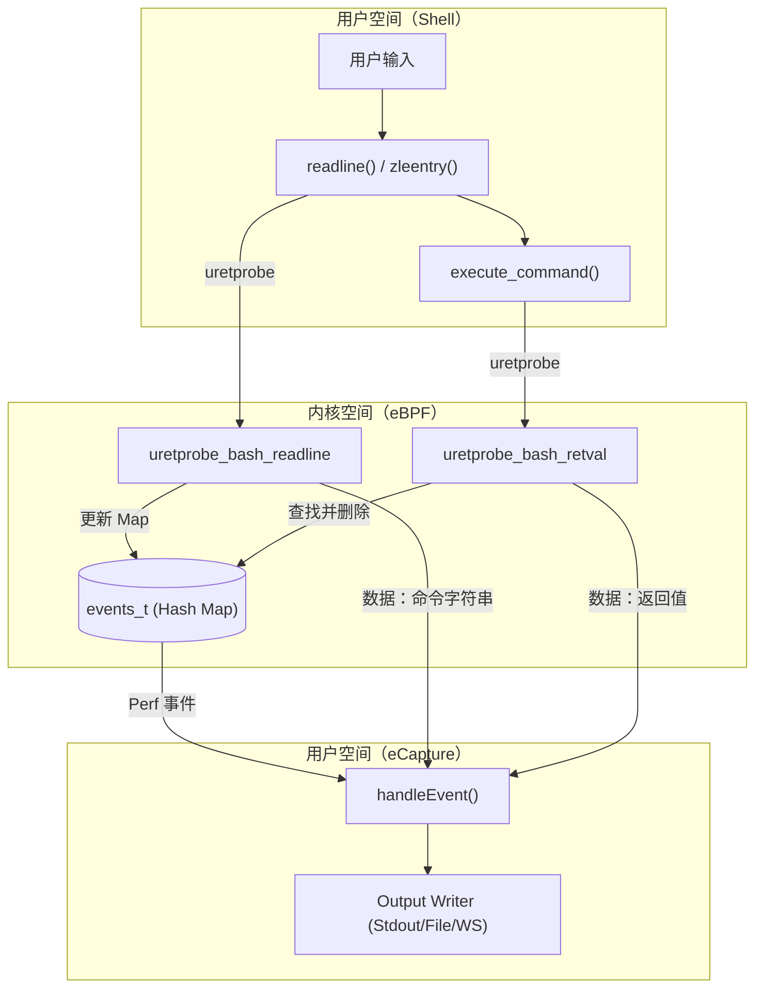
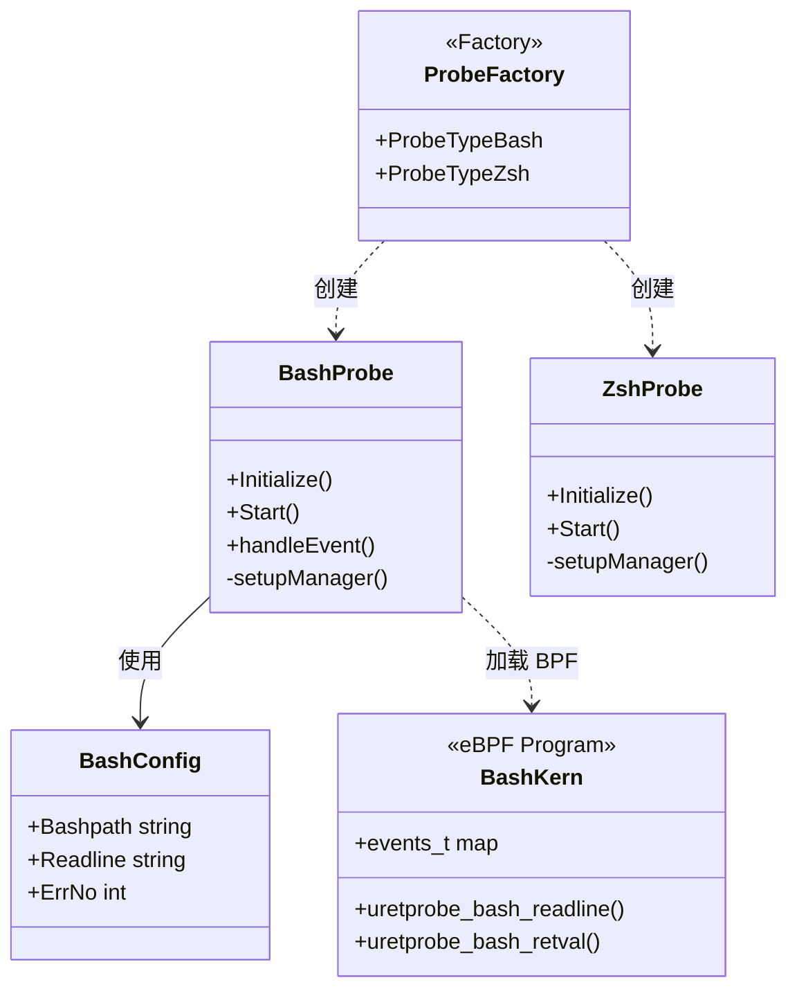

# Shell 命令审计 (Bash / Zsh)

<details>
<summary>相关源文件</summary>

以下文件被用作生成此维基页面的上下文：

- [cli/cmd/bash.go](https://github.com/gojue/ecapture/blob/943a19fe/cli/cmd/bash.go)
- [cli/cmd/mysqld.go](https://github.com/gojue/ecapture/blob/943a19fe/cli/cmd/mysqld.go)
- [cli/cmd/postgres.go](https://github.com/gojue/ecapture/blob/943a19fe/cli/cmd/postgres.go)
- [cli/cmd/zsh.go](https://github.com/gojue/ecapture/blob/943a19fe/cli/cmd/zsh.go)
- [internal/probe/bash/bash_probe.go](https://github.com/gojue/ecapture/blob/943a19fe/internal/probe/bash/bash_probe.go)
- [internal/probe/mysql/mysql_probe.go](https://github.com/gojue/ecapture/blob/943a19fe/internal/probe/mysql/mysql_probe.go)
- [internal/probe/openssl/openssl_probe.go](https://github.com/gojue/ecapture/blob/943a19fe/internal/probe/openssl/openssl_probe.go)
- [internal/probe/postgres/postgres_probe.go](https://github.com/gojue/ecapture/blob/943a19fe/internal/probe/postgres/postgres_probe.go)
- [internal/probe/zsh/zsh_probe.go](https://github.com/gojue/ecapture/blob/943a19fe/internal/probe/zsh/zsh_probe.go)
- [kern/bash_kern.c](https://github.com/gojue/ecapture/blob/943a19fe/kern/bash_kern.c)
- [kern/mysqld_kern.c](https://github.com/gojue/ecapture/blob/943a19fe/kern/mysqld_kern.c)
- [kern/nspr_kern.c](https://github.com/gojue/ecapture/blob/943a19fe/kern/nspr_kern.c)
- [pkg/util/ws/client.go](https://github.com/gojue/ecapture/blob/943a19fe/pkg/util/ws/client.go)
- [pkg/util/ws/client_test.go](https://github.com/gojue/ecapture/blob/943a19fe/pkg/util/ws/client_test.go)

</details>


eCapture 中的 Shell 审计探针提供了对 `bash` 和 `zsh` 会话进行实时命令行审计的机制。通过 eBPF `uprobes` 和 `uretprobes` 挂入 Shell 的行编辑和命令执行函数，eCapture 捕获用户输入的每条命令，包括用户名、进程 ID（PID）以及命令的返回值（退出状态）。这对于安全审计、合规监控以及检测系统内未授权的横向移动尤为有用。

## 实现概述

eCapture 通过两个独立的探针实现 Shell 审计：`bash` 和 `zsh`。两者均使用相似的 eBPF 技术，但根据 Shell 的架构针对不同的内部函数。

### Bash 审计原理
Bash 使用 `readline` 库进行命令输入。eCapture 挂钩 `readline` 函数（或 `rl_line_buffer`）来捕获命令字符串。为了将命令与其结果关联，它还挂钩 `execute_command` 来捕获返回值。

*   **挂钩点**：
    *   `uretprobe/bash_readline`：附加到 `libreadline.so` 或 `bash` 二进制文件中的 `readline` [internal/probe/bash/bash_probe.go:237-241](https://github.com/gojue/ecapture/blob/943a19fe/internal/probe/bash/bash_probe.go#L237-L241)。
    *   `uretprobe/bash_retval`：附加到 `bash` 二进制文件中的 `execute_command` [internal/probe/bash/bash_probe.go:243-247](https://github.com/gojue/ecapture/blob/943a19fe/internal/probe/bash/bash_probe.go#L243-L247)。
    *   `uprobe/exec_builtin` 和 `uprobe/exit_builtin`：用于跟踪 Shell 生命周期事件 [kern/bash_kern.c:117-121](https://github.com/gojue/ecapture/blob/943a19fe/kern/bash_kern.c#L117-L121)。

### Zsh 审计原理
Zsh 审计针对 Zsh 行编辑器（ZLE）。
*   **挂钩点**：
    *   `uretprobe/zsh_zleentry`：附加到 `zsh` 二进制文件中配置的 readline 函数（通常为 `zleentry`）[internal/probe/zsh/zsh_probe.go:205-210](https://github.com/gojue/ecapture/blob/943a19fe/internal/probe/zsh/zsh_probe.go#L205-L210)。

### 数据流图
下图展示了在 Shell 中输入的命令如何从用户空间进入 eBPF 内核程序，再返回到 eCapture 输出的过程。

**Shell 命令捕获流水线**

Sources: [kern/bash_kern.c:42-64](https://github.com/gojue/ecapture/blob/943a19fe/kern/bash_kern.c#L42-L64), [kern/bash_kern.c:65-100](https://github.com/gojue/ecapture/blob/943a19fe/kern/bash_kern.c#L65-L100), [internal/probe/bash/bash_probe.go:171-209](https://github.com/gojue/ecapture/blob/943a19fe/internal/probe/bash/bash_probe.go#L171-L209)

## 技术细节：Bash 探针

Bash 探针管理命令的状态，因为命令字符串和返回值在不同的执行点被捕获。

### 内核逻辑
在 `bash_kern.c` 中，`event` 结构体存储命令的上下文：
[kern/bash_kern.c:17-24](https://github.com/gojue/ecapture/blob/943a19fe/kern/bash_kern.c#L17-L24)
```c
struct event {
    u32 type;
    u32 pid;
    u32 uid;
    u8 line[MAX_DATA_SIZE_BASH];
    u32 retval;
    char comm[TASK_COMM_LEN];
};
```

1.  **Readline 钩子**：当 `readline` 返回时，内核程序从返回寄存器（`PT_REGS_RC`）读取命令字符串，并以 PID 为键将其存储在 `events_t` hash map 中 [kern/bash_kern.c:58-60](https://github.com/gojue/ecapture/blob/943a19fe/kern/bash_kern.c#L58-L60)。
2.  **Retval 钩子**：当 `execute_command` 返回时，程序使用 PID 查找 `events_t` 中的现有事件，附加返回值，并通过 perf buffer 将完整事件发送到用户态 [kern/bash_kern.c:77-97](https://github.com/gojue/ecapture/blob/943a19fe/kern/bash_kern.c#L77-L97)。

### 用户态处理
`bash_probe.go` 中的 `handleEvent` 函数管理多行命令的累积，并根据用户提供的错误号（`--errnumber`）过滤输出 [internal/probe/bash/bash_probe.go:171-209](https://github.com/gojue/ecapture/blob/943a19fe/internal/probe/bash/bash_probe.go#L171-L209)。

Sources: [kern/bash_kern.c:17-100](https://github.com/gojue/ecapture/blob/943a19fe/kern/bash_kern.c#L17-L100), [internal/probe/bash/bash_probe.go:171-209](https://github.com/gojue/ecapture/blob/943a19fe/internal/probe/bash/bash_probe.go#L171-L209)

## CLI 使用与配置

Shell 探针通过 `bash` 和 `zsh` 子命令调用。

### 命令选项
| 标志 | 描述 | 默认值 |
| :--- | :--- | :--- |
| `--bash` | bash 二进制文件的路径。 | 自动检测 |
| `--zsh` | zsh 二进制文件的路径。 | 自动检测 |
| `--readlineso` | 若 bash 动态链接，指定 `libreadline.so` 的路径。 | 自动检测 |
| `-e, --errnumber` | 仅显示具有此退出码的命令。 | 128（显示全部） |

### 示例命令
捕获所有 bash 命令：
```bash
ecapture bash
```

仅捕获失败的 bash 命令（退出码非零，例如 1）：
```bash
ecapture bash -e 1
```

Sources: [cli/cmd/bash.go:27-41](https://github.com/gojue/ecapture/blob/943a19fe/cli/cmd/bash.go#L27-L41), [cli/cmd/zsh.go:30-41](https://github.com/gojue/ecapture/blob/943a19fe/cli/cmd/zsh.go#L30-L41)

## 代码实体映射

下图将逻辑审计组件映射到其具体的实现类和文件。

**组件到代码实体映射**

Sources: [internal/probe/bash/bash_probe.go:39-49](https://github.com/gojue/ecapture/blob/943a19fe/internal/probe/bash/bash_probe.go#L39-L49), [internal/probe/zsh/zsh_probe.go:37-44](https://github.com/gojue/ecapture/blob/943a19fe/internal/probe/zsh/zsh_probe.go#L37-L44), [cli/cmd/bash.go:24-33](https://github.com/gojue/ecapture/blob/943a19fe/cli/cmd/bash.go#L24-L33), [kern/bash_kern.c:42-65](https://github.com/gojue/ecapture/blob/943a19fe/kern/bash_kern.c#L42-L65)

## 输出格式
输出提供了 Shell 活动的结构化视图：
*   **PID**：Shell 的进程 ID。
*   **UID**：执行命令的用户 ID。
*   **Comm**：进程名称（通常为 `bash` 或 `zsh`）。
*   **Retval**：命令的退出状态。
*   **Line**：实际执行的命令字符串。

这些数据经过 `EventProcessor` 处理后，可以输出到标准输出、文件，或使用 eCaptureQ 通过 WebSocket 进行流式传输 [internal/probe/bash/bash_probe.go:171-209](https://github.com/gojue/ecapture/blob/943a19fe/internal/probe/bash/bash_probe.go#L171-L209)。

Sources: [kern/bash_kern.c:17-24](https://github.com/gojue/ecapture/blob/943a19fe/kern/bash_kern.c#L17-L24), [internal/probe/bash/bash_probe.go:171-209](https://github.com/gojue/ecapture/blob/943a19fe/internal/probe/bash/bash_probe.go#L171-L209)