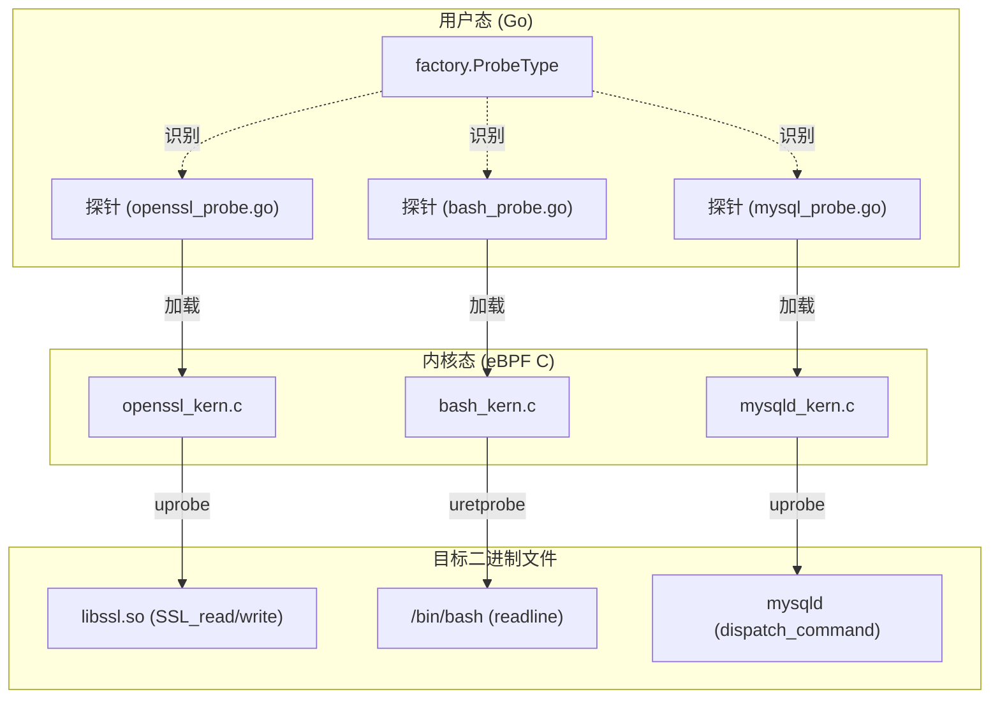
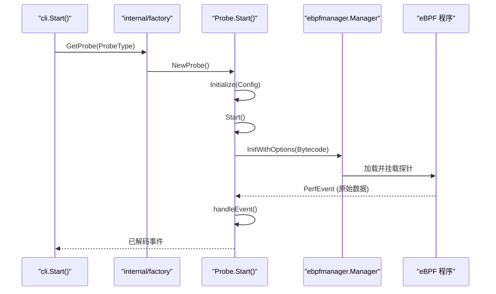

# 探针参考手册

相关源文件

以下文件被用作生成此维基页面的上下文：

- [CHANGELOG.md](https://github.com/gojue/ecapture/blob/943a19fe/CHANGELOG.md)
- [README.md](https://github.com/gojue/ecapture/blob/943a19fe/README.md)
- [internal/probe/bash/bash_probe.go](https://github.com/gojue/ecapture/blob/943a19fe/internal/probe/bash/bash_probe.go)
- [internal/probe/mysql/mysql_probe.go](https://github.com/gojue/ecapture/blob/943a19fe/internal/probe/mysql/mysql_probe.go)
- [internal/probe/openssl/openssl_probe.go](https://github.com/gojue/ecapture/blob/943a19fe/internal/probe/openssl/openssl_probe.go)
- [internal/probe/postgres/postgres_probe.go](https://github.com/gojue/ecapture/blob/943a19fe/internal/probe/postgres/postgres_probe.go)
- [internal/probe/zsh/zsh_probe.go](https://github.com/gojue/ecapture/blob/943a19fe/internal/probe/zsh/zsh_probe.go)
- [main.go](https://github.com/gojue/ecapture/blob/943a19fe/main.go)

eCapture 利用 eBPF `uprobes` 在用户态库和应用程序的边界处拦截明文数据。本参考手册提供了 eCapture 中可用专用探针模块的索引，并按其目标协议和应用程序进行了分类。

每个探针都遵循由 `internal/probe` 框架管理的标准化生命周期，通过实现 `Probe` 接口来处理初始化、eBPF 管理器（manager）设置和事件分发 [internal/probe/openssl/openssl_probe.go:45-58](https://github.com/gojue/ecapture/blob/943a19fe/internal/probe/openssl/openssl_probe.go#L45-L58), [internal/probe/bash/bash_probe.go:39-49](https://github.com/gojue/ecapture/blob/943a19fe/internal/probe/bash/bash_probe.go#L39-L49)。

### 探针分类与模块

下表总结了可用的探针及其主要目标：

| 分类 | 模块名称 | 目标库 / 应用程序 |
| :--- | :--- | :--- |
| **TLS/SSL** | `tls` | OpenSSL, BoringSSL, LibreSSL |
| **TLS/SSL** | `gotls` | Go 原生 `crypto/tls` |
| **TLS/SSL** | `gnutls` | GnuTLS |
| **TLS/SSL** | `nss` | NSS (Network Security Services) / NSPR |
| **数据库** | `mysqld` | MySQL (5.6, 5.7, 8.0), MariaDB |
| **数据库** | `postgres` | PostgreSQL (10+) |
| **Shell** | `bash` | Bash Shell |
| **Shell** | `zsh` | Zsh Shell |

### 技术架构映射

下图展示了 Go 语言中的用户态探针定义如何映射到其对应的 eBPF 内核实现以及它们挂钩（hook）的函数。

**系统到代码实体的映射**

Sources: [internal/probe/openssl/openssl_probe.go:45-68](https://github.com/gojue/ecapture/blob/943a19fe/internal/probe/openssl/openssl_probe.go#L45-L68), [internal/probe/bash/bash_probe.go:39-59](https://github.com/gojue/ecapture/blob/943a19fe/internal/probe/bash/bash_probe.go#L39-L59), [internal/probe/mysql/mysql_probe.go:37-50](https://github.com/gojue/ecapture/blob/943a19fe/internal/probe/mysql/mysql_probe.go#L37-L50)

---

### 模块详情

#### TLS/SSL 明文捕获
这些探针针对各种加密库，在加密前或解密后提取明文。
* **[TLS/SSL 明文捕获 (OpenSSL / BoringSSL)](3.1-tlsssl-plaintext-capture-openssl--boringssl.md)**：大多数 Linux 和 Android 应用程序的主要探针。它挂钩 `SSL_read` 和 `SSL_write` [internal/probe/openssl/openssl_probe.go:115-140](https://github.com/gojue/ecapture/blob/943a19fe/internal/probe/openssl/openssl_probe.go#L115-L140)。
* **[GoTLS 捕获](3.2-gotls-capture.md)**：专门为 Go 二进制文件设计，处理独特的调用约定和内部 `crypto/tls` 结构。
* **[GnuTLS 捕获](3.3-gnutls-capture.md)**：针对使用 GnuTLS 编译的 `wget` 或 `curl` 等应用程序。
* **[NSS / NSPR 捕获](3.4-nss--nspr-capture.md)**：针对 Firefox、Thunderbird 以及其他使用 Network Security Services 库的应用程序。

#### 数据库流量捕获
这些探针通过挂钩数据库服务器进程中的命令分发逻辑来审计数据库查询。
* **[数据库流量捕获 (MySQL / PostgreSQL)](3.5-database-traffic-capture-mysql--postgresql.md)**：通过挂钩 MySQL 中的 `dispatch_command` [internal/probe/mysql/mysql_probe.go:204-240](https://github.com/gojue/ecapture/blob/943a19fe/internal/probe/mysql/mysql_probe.go#L204-L240) 和 PostgreSQL 中的 `exec_simple_query` [internal/probe/postgres/postgres_probe.go:141-150](https://github.com/gojue/ecapture/blob/943a19fe/internal/probe/postgres/postgres_probe.go#L141-L150) 来捕获明文 SQL 语句。

#### Shell 审计
用于安全合规和主机审计，通过在 Shell 层级捕获用户输入。
* **[Shell 命令审计 (Bash / Zsh)](3.6-shell-auditing-bash--zsh.md)**：挂钩 `readline` 函数以捕获交互式命令。Bash 探针专门处理使用由 UUID 索引的 `lineMap` 进行的多行命令累积 [internal/probe/bash/bash_probe.go:171-209](https://github.com/gojue/ecapture/blob/943a19fe/internal/probe/bash/bash_probe.go#L171-L209)。

### 探针执行流程

下图展示了通过 CLI 初始化的任何探针模块的通用执行路径。

**探针生命周期与数据路径**

Sources: [main.go:9-11](https://github.com/gojue/ecapture/blob/943a19fe/main.go#L9-L11), [internal/probe/openssl/openssl_probe.go:101-159](https://github.com/gojue/ecapture/blob/943a19fe/internal/probe/openssl/openssl_probe.go#L101-L159), [internal/probe/mysql/mysql_probe.go:88-136](https://github.com/gojue/ecapture/blob/943a19fe/internal/probe/mysql/mysql_probe.go#L88-L136)

### 常见注意事项
* **内核版本**：大多数探针要求 Linux 内核版本 >= 4.18 (x86_64) 或 >= 5.5 (aarch64) [README.md:12-13](https://github.com/gojue/ecapture/blob/943a19fe/README.md#L12-L13)。
* **BTF 支持**：如果 BTF 可用，eCapture 会尝试使用 CO-RE（一次编译，到处运行），否则将回退到非 CO-RE 字节码 [internal/probe/postgres/postgres_probe.go:171-188](https://github.com/gojue/ecapture/blob/943a19fe/internal/probe/postgres/postgres_probe.go#L171-L188)。
* **符号表**：为了使 `uprobes` 正常工作，目标二进制文件必须拥有符号表，或者用户必须通过配置手动提供偏移量 [internal/probe/mysql/mysql_probe.go:75-82](https://github.com/gojue/ecapture/blob/943a19fe/internal/probe/mysql/mysql_probe.go#L75-L82)。

Sources: [README.md:12-13](https://github.com/gojue/ecapture/blob/943a19fe/README.md#L12-L13), [internal/probe/openssl/openssl_probe.go:43-159](https://github.com/gojue/ecapture/blob/943a19fe/internal/probe/openssl/openssl_probe.go#L43-L159), [internal/probe/bash/bash_probe.go:39-127](https://github.com/gojue/ecapture/blob/943a19fe/internal/probe/bash/bash_probe.go#L39-L127), [internal/probe/mysql/mysql_probe.go:37-136](https://github.com/gojue/ecapture/blob/943a19fe/internal/probe/mysql/mysql_probe.go#L37-L136), [internal/probe/postgres/postgres_probe.go:37-111](https://github.com/gojue/ecapture/blob/943a19fe/internal/probe/postgres/postgres_probe.go#L37-L111), [internal/probe/zsh/zsh_probe.go:37-121](https://github.com/gojue/ecapture/blob/943a19fe/internal/probe/zsh/zsh_probe.go#L37-L121)