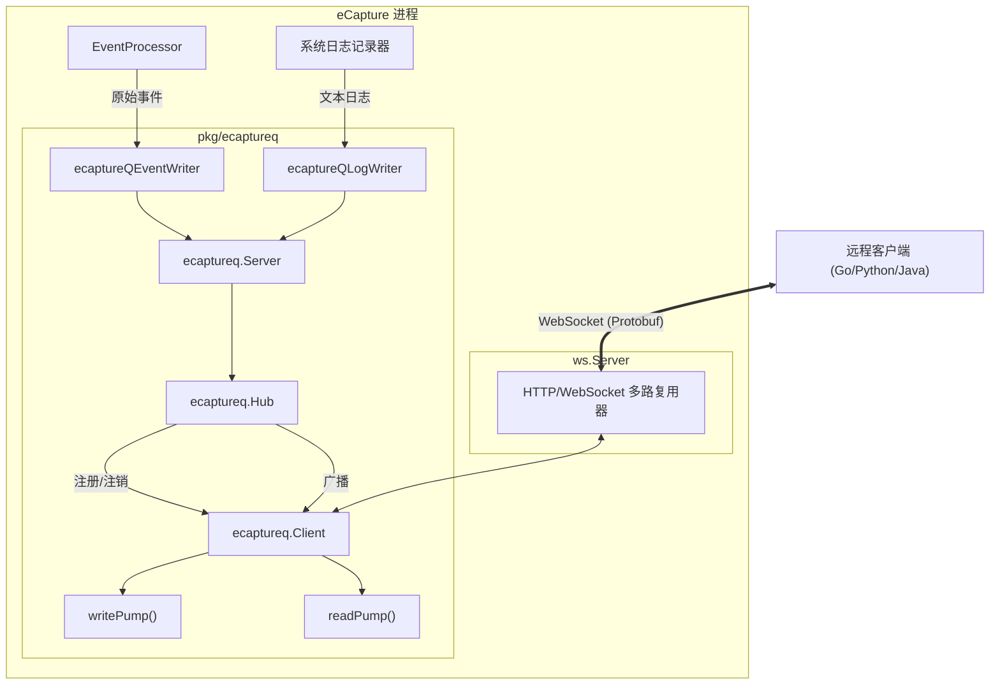
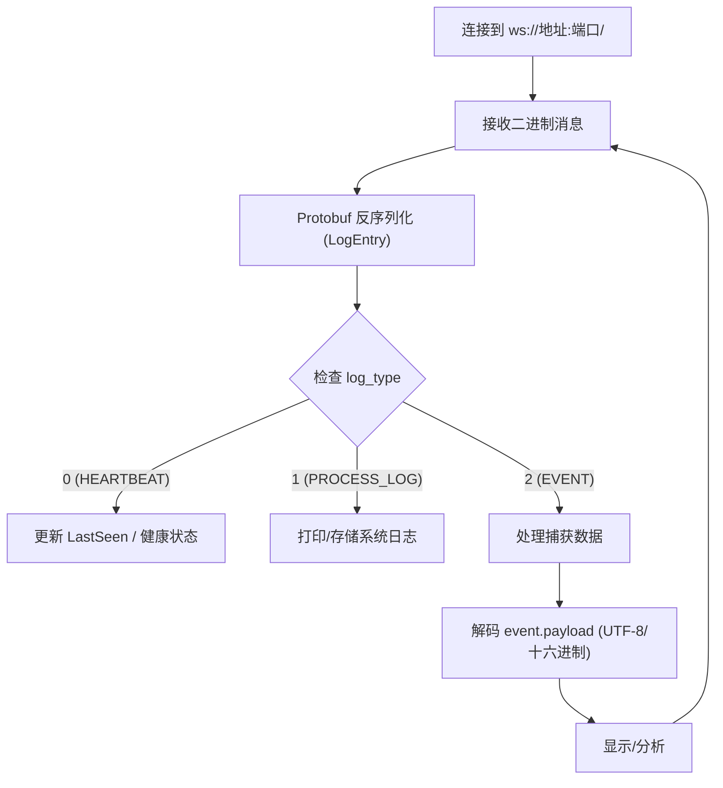

# 远程事件流 (eCaptureQ WebSocket)

相关源文件

以下文件被用作生成此维基页面的上下文：

- [cli/cmd/ecaptureq.go](https://github.com/gojue/ecapture/blob/943a19fe/cli/cmd/ecaptureq.go)
- [examples/ecaptureq_client/README.md](https://github.com/gojue/ecapture/blob/943a19fe/examples/ecaptureq_client/README.md)
- [examples/ecaptureq_client/TESTING.md](https://github.com/gojue/ecapture/blob/943a19fe/examples/ecaptureq_client/TESTING.md)
- [examples/ecaptureq_client/go.mod](https://github.com/gojue/ecapture/blob/943a19fe/examples/ecaptureq_client/go.mod)
- [examples/ecaptureq_client/go.sum](https://github.com/gojue/ecapture/blob/943a19fe/examples/ecaptureq_client/go.sum)
- [examples/ecaptureq_client/main.go](https://github.com/gojue/ecapture/blob/943a19fe/examples/ecaptureq_client/main.go)
- [internal/output/writers/iowriter_adapter.go](https://github.com/gojue/ecapture/blob/943a19fe/internal/output/writers/iowriter_adapter.go)
- [pkg/ecaptureq/README.md](https://github.com/gojue/ecapture/blob/943a19fe/pkg/ecaptureq/README.md)
- [pkg/ecaptureq/client.go](https://github.com/gojue/ecapture/blob/943a19fe/pkg/ecaptureq/client.go)
- [pkg/ecaptureq/hub.go](https://github.com/gojue/ecapture/blob/943a19fe/pkg/ecaptureq/hub.go)
- [pkg/ecaptureq/server.go](https://github.com/gojue/ecapture/blob/943a19fe/pkg/ecaptureq/server.go)
- [pkg/util/ws/server.go](https://github.com/gojue/ecapture/blob/943a19fe/pkg/util/ws/server.go)
- [pkg/util/ws/server_test.go](https://github.com/gojue/ecapture/blob/943a19fe/pkg/util/ws/server_test.go)
- [protobuf/PROTOCOLS.md](https://github.com/gojue/ecapture/blob/943a19fe/protobuf/PROTOCOLS.md)
- [protobuf/README.md](https://github.com/gojue/ecapture/blob/943a19fe/protobuf/README.md)
- [protobuf/gen/v1/ecaptureq.pb.go](https://github.com/gojue/ecapture/blob/943a19fe/protobuf/gen/v1/ecaptureq.pb.go)
- [protobuf/proto/v1/ecaptureq.proto](protobuf/proto/v1/ecaptureq.proto)
- [utils/protobuf_visualizer/README.md](https://github.com/gojue/ecapture/blob/943a19fe/utils/protobuf_visualizer/README.md)
- [utils/protobuf_visualizer/README_CN.md](https://github.com/gojue/ecapture/blob/943a19fe/utils/protobuf_visualizer/README_CN.md)

eCaptureQ 实时事件推送机制提供了一种从 eCapture 到外部消费者的实时结构化数据流。通过利用 WebSocket 和 Protocol Buffers (Protobuf)，它能够将捕获的明文事件和系统日志低延迟地交付给远程分析平台、安全仪表盘或自定义收集器。

## 架构概览

eCaptureQ 系统采用星型模型（hub-and-spoke），其中 eCapture 进程充当 WebSocket 服务器。它管理多个客户端连接，并广播由用户态流水线处理后的事件。

### 系统组件与数据流

下图展示了 eCapture 内部组件与 eCaptureQ 流服务之间的关系。

**图表：eCaptureQ 流架构**

Sources: [pkg/ecaptureq/server.go:31-57](https://github.com/gojue/ecapture/blob/943a19fe/pkg/ecaptureq/server.go#L31-L57), [pkg/ecaptureq/client.go:34-48](https://github.com/gojue/ecapture/blob/943a19fe/pkg/ecaptureq/client.go#L34-L48), [cli/cmd/ecaptureq.go:21-36](https://github.com/gojue/ecapture/blob/943a19fe/cli/cmd/ecaptureq.go#L21-L36)

## 启动服务器

通过 `--ecaptureq` 标志后跟 WebSocket URL 来启用 WebSocket 服务器。

*   **命令示例**：`sudo ecapture tls --ecaptureq ws://127.0.0.1:28257/`
*   **要求**：URL 必须以斜杠 `/` 结尾 [pkg/ecaptureq/README.md:12-12](https://github.com/gojue/ecapture/blob/943a19fe/pkg/ecaptureq/README.md#L12-L12)。
*   **默认端口**：虽然用户可以指定任何端口，但示例中惯用 `28257` [examples/ecaptureq_client/main.go:40-40](https://github.com/gojue/ecapture/blob/943a19fe/examples/ecaptureq_client/main.go#L40-L40)。

## 消息格式 (Protobuf)

eCaptureQ 使用 Protocol Buffers 进行高效序列化。顶级消息是 `LogEntry`，它使用 `oneof` 字段来封装不同的数据类型。

### LogEntry 结构
`LogEntry` 结构使用 `LogType` 枚举来标识消息类型 [protobuf/PROTOCOLS.md:53-62](https://github.com/gojue/ecapture/blob/943a19fe/protobuf/PROTOCOLS.md#L53-L62)。

| 字段 | 类型 | 描述 |
| :--- | :--- | :--- |
| `log_type` | `LogType` | `0`: 心跳, `1`: 进程日志, `2`: 事件 [pkg/ecaptureq/README.md:34-39](https://github.com/gojue/ecapture/blob/943a19fe/pkg/ecaptureq/README.md#L34-L39) |
| `payload` | `oneof` | 包含 `event_payload`、`heartbeat_payload` 或 `run_log` [protobuf/PROTOCOLS.md:53-62](https://github.com/gojue/ecapture/blob/943a19fe/protobuf/PROTOCOLS.md#L53-L62) |

### 数据类型

#### 1. 事件 (`LOG_TYPE_EVENT`)
代表捕获的流量片段（例如，解密的 TLS 数据包）。
*   **关键字段**：`timestamp`、`uuid`、`src_ip`、`src_port`、`dst_ip`、`dst_port`、`pid`、`pname`、`type`（协议 ID）以及原始 `payload` 字节 [protobuf/PROTOCOLS.md:24-41](https://github.com/gojue/ecapture/blob/943a19fe/protobuf/PROTOCOLS.md#L24-L41)。

#### 2. 进程日志 (`LOG_TYPE_PROCESS_LOG`)
包含标准的 eCapture 运行日志（例如，版本信息、探针加载状态）。
*   **格式**：通过 `run_log` 字段交付的纯字符串 [pkg/ecaptureq/server.go:94-94](https://github.com/gojue/ecapture/blob/943a19fe/pkg/ecaptureq/server.go#L94-L94)。

#### 3. 心跳 (`LOG_TYPE_HEARTBEAT`)
用于连接保活和健康监测。
*   **间隔**：服务器每 15 秒发送一次心跳 [pkg/ecaptureq/client.go:83-83](https://github.com/gojue/ecapture/blob/943a19fe/pkg/ecaptureq/client.go#L83-L83)。
*   **字段**：`timestamp`、`count`（序列号）和状态 `message` [protobuf/PROTOCOLS.md:45-51](https://github.com/gojue/ecapture/blob/943a19fe/protobuf/PROTOCOLS.md#L45-L51)。

## 实现细节

### 启动缓冲区 (历史回放)
为了确保客户端不会错过在连接建立之前发生的关键初始化日志（如版本信息或探针状态），`Server` 维护了一个 `logbuff`。
*   **容量**：固定为 128 条消息 [pkg/ecaptureq/server.go:29-29](https://github.com/gojue/ecapture/blob/943a19fe/pkg/ecaptureq/server.go#L29-L29)。
*   **行为**：当新客户端连接时，服务器会立即向该客户端回放 `logbuff` 中的所有消息，然后再开始推送实时事件 [pkg/ecaptureq/server.go:75-75](https://github.com/gojue/ecapture/blob/943a19fe/pkg/ecaptureq/server.go#L75-L75)。

### 连接管理
*   **Hub**：`Hub` 管理活跃客户端集合并处理消息广播，以确保线程安全 [pkg/ecaptureq/server.go:47-47](https://github.com/gojue/ecapture/blob/943a19fe/pkg/ecaptureq/server.go#L47-L47)。
*   **Pump 模式**：每个客户端连接都会启动两个 goroutine：
    *   `writePump()`：从 `send` 通道消费消息并将其推送到 WebSocket [pkg/ecaptureq/client.go:82-117](https://github.com/gojue/ecapture/blob/943a19fe/pkg/ecaptureq/client.go#L82-L117)。
    *   `readPump()`：监控连接关闭或接收控制消息 [pkg/ecaptureq/client.go:55-75](https://github.com/gojue/ecapture/blob/943a19fe/pkg/ecaptureq/client.go#L55-L75)。

## 客户端集成

### 参考 Go 客户端
`examples/ecaptureq_client/main.go` 中提供了一个参考实现。它演示了：
1.  使用 `websocket.Dial` 连接到服务器 [examples/ecaptureq_client/main.go:50-50](https://github.com/gojue/ecapture/blob/943a19fe/examples/ecaptureq_client/main.go#L50-L50)。
2.  接收原始字节并将其反序列化为 `pb.LogEntry` [examples/ecaptureq_client/main.go:87-88](https://github.com/gojue/ecapture/blob/943a19fe/examples/ecaptureq_client/main.go#L87-L88)。
3.  根据 `LogType` 执行切换逻辑以处理事件或心跳 [examples/ecaptureq_client/main.go:100-110](https://github.com/gojue/ecapture/blob/943a19fe/examples/ecaptureq_client/main.go#L100-L110)。

### 多语言集成模式
对于非 Go 语言（Python、Rust 等），集成遵循以下模式：

**图表：集成逻辑**

Sources: [pkg/ecaptureq/README.md:166-169](https://github.com/gojue/ecapture/blob/943a19fe/pkg/ecaptureq/README.md#L166-L169), [examples/ecaptureq_client/main.go:99-110](https://github.com/gojue/ecapture/blob/943a19fe/examples/ecaptureq_client/main.go#L99-L110)

### 调试工具
该项目包含一个 `protobuf_visualizer` 工具（位于 `utils/protobuf_visualizer/`），它可以连接到 eCaptureQ 流，并以紧凑或十六进制格式显示消息，以便进行调试 [utils/protobuf_visualizer/README.md:1-31](https://github.com/gojue/ecapture/blob/943a19fe/utils/protobuf_visualizer/README.md#L1-L31)。

Sources:
- [cli/cmd/ecaptureq.go:21-36](https://github.com/gojue/ecapture/blob/943a19fe/cli/cmd/ecaptureq.go#L21-L36)
- [pkg/ecaptureq/server.go:29-124](https://github.com/gojue/ecapture/blob/943a19fe/pkg/ecaptureq/server.go#L29-L124)
- [pkg/ecaptureq/client.go:34-135](https://github.com/gojue/ecapture/blob/943a19fe/pkg/ecaptureq/client.go#L34-L135)
- [pkg/ecaptureq/README.md:1-169](https://github.com/gojue/ecapture/blob/943a19fe/pkg/ecaptureq/README.md#L1-L169)
- [protobuf/PROTOCOLS.md:1-62](https://github.com/gojue/ecapture/blob/943a19fe/protobuf/PROTOCOLS.md#L1-L62)
- [examples/ecaptureq_client/main.go:40-198](https://github.com/gojue/ecapture/blob/943a19fe/examples/ecaptureq_client/main.go#L40-L198)
- [pkg/util/ws/server.go:25-46](https://github.com/gojue/ecapture/blob/943a19fe/pkg/util/ws/server.go#L25-L46)