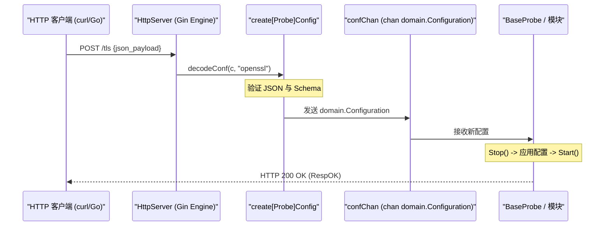
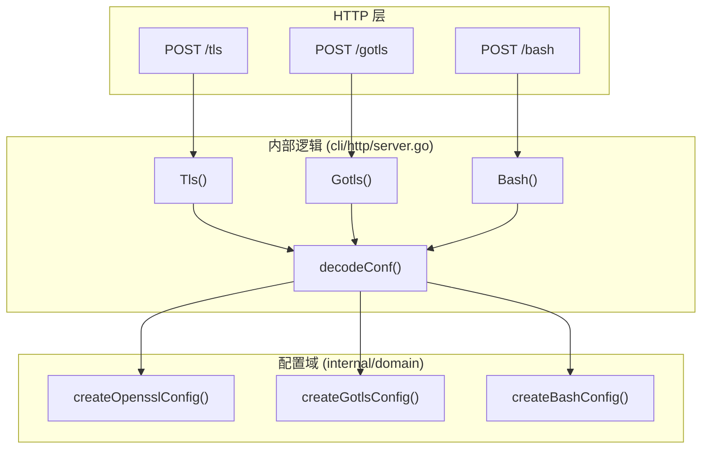

# 远程动态配置 API

<details>
<summary>相关源文件</summary>

以下文件被用作生成此维基页面的上下文：

- [cli/cmd/root.go](https://github.com/gojue/ecapture/blob/943a19fe/cli/cmd/root.go)
- [cli/http/logger.go](https://github.com/gojue/ecapture/blob/943a19fe/cli/http/logger.go)
- [cli/http/resp.go](https://github.com/gojue/ecapture/blob/943a19fe/cli/http/resp.go)
- [cli/http/server.go](https://github.com/gojue/ecapture/blob/943a19fe/cli/http/server.go)
- [docs/event-forward-api.md](https://github.com/gojue/ecapture/blob/943a19fe/docs/event-forward-api.md)
- [docs/remote-config-update-api-zh_Hans.md](https://github.com/gojue/ecapture/blob/943a19fe/docs/remote-config-update-api-zh_Hans.md)
- [docs/remote-config-update-api.md](https://github.com/gojue/ecapture/blob/943a19fe/docs/remote-config-update-api.md)
- [pkg/event_processor/http_request.go](https://github.com/gojue/ecapture/blob/943a19fe/pkg/event_processor/http_request.go)
- [pkg/event_processor/http_response.go](https://github.com/gojue/ecapture/blob/943a19fe/pkg/event_processor/http_response.go)
- [pkg/event_processor/iparser.go](https://github.com/gojue/ecapture/blob/943a19fe/pkg/event_processor/iparser.go)
- [pkg/event_processor/iworker.go](https://github.com/gojue/ecapture/blob/943a19fe/pkg/event_processor/iworker.go)
- [pkg/event_processor/processor.go](https://github.com/gojue/ecapture/blob/943a19fe/pkg/event_processor/processor.go)

</details>


远程动态配置 API 允许用户在不重启进程的情况下对 eCapture 的运行时配置进行热更新。通过启用内置 HTTP 服务器，eCapture 为每个探针模块暴露端点，支持对 PID、UID、进程名过滤器及其他捕获参数进行实时调整。

## 1. 启用 API 服务器

HTTP 服务器默认禁用。通过 `--listen` 全局标志激活。

*   **标志**：`--listen [address:port]` [cli/cmd/root.go:171-171]()
*   **默认地址**：`127.0.0.1:28256`（如果指定为 `--listen 127.0.0.1:28256`）
*   **实现**：服务器基于 Gin Gonic 框架构建 [cli/http/server.go:20-20](https://github.com/gojue/ecapture/blob/943a19fe/cli/http/server.go#L20-L20)。

### 使用场景
*   **实时重定向**：在运行实例上更改目标 `--pid` 或 `--uid`。
*   **过滤器调整**：动态更新 `target_process` 或 `ignore_process` 列表。
*   **调试切换**：无需丢失现有捕获状态即可启用或禁用 `--debug` 或 `--hex` 模式。
*   **外部控制**：与安全编排工具或自定义管理仪表盘集成。

## 2. API 架构与数据流

当通过 HTTP API 收到配置更新时，`HttpServer` 将 JSON 载荷解码为 `domain.Configuration` 对象，并通过专用配置通道（`confChan`）发送。底层探针监听此通道并执行热重载。

### 配置更新时序
下图展示了从外部 `curl` 请求到内部探针重载的流程。

**图表：配置更新数据路径**

Sources: [cli/http/server.go:108-178](https://github.com/gojue/ecapture/blob/943a19fe/cli/http/server.go#L108-L178), [cli/http/server.go:46-51](https://github.com/gojue/ecapture/blob/943a19fe/cli/http/server.go#L46-L51)

## 3. 支持的端点与平台差异

可用路径与具体的捕获模块对应。部分模块仅限 Linux，不在 Android GKI 上暴露。

### 3.1 Linux 与 Android 路径支持

| 路径 | 别名 | 模块 | Linux | Android |
| :--- | :--- | :--- | :---: | :---: |
| `/tls` | `/openssl`, `/boringssl` | OpenSSL/BoringSSL | 是 | 是 |
| `/gotls` | - | Go crypto/tls | 是 | 是 |
| `/gnutls` | - | GnuTLS | 是 | 是 |
| `/nss` | `/nspr` | NSS/NSPR | 是 | 是 |
| `/bash` | - | Bash Shell | 是 | 否 |
| `/mysqld` | - | MySQL | 是 | 否 |
| `/postgress`| `/postgres` | PostgreSQL | 是 | 否 |

Sources: [cli/http/server.go:57-74](https://github.com/gojue/ecapture/blob/943a19fe/cli/http/server.go#L57-L74), [docs/remote-config-update-api.md:37-75](https://github.com/gojue/ecapture/blob/943a19fe/docs/remote-config-update-api.md#L37-L75)

## 4. 请求与响应格式

### 4.1 响应结构
每个 API 请求返回由 `cli/http/resp.go` 中 `Resp` 结构体定义的统一 JSON 响应。

```json
{
  "code": 0,
  "module_type": "openssl",
  "msg": "RespOK",
  "data": null
}
```

**状态码（`Status` 类型）：**
*   `0`（`RespOK`）：成功。[cli/http/resp.go:21-21](https://github.com/gojue/ecapture/blob/943a19fe/cli/http/resp.go#L21-L21)
*   `4`（`RespConfigDecodeFailed`）：JSON 载荷与预期结构不匹配。[cli/http/resp.go:25-25](https://github.com/gojue/ecapture/blob/943a19fe/cli/http/resp.go#L25-L25)
*   `5`（`RespConfigCheckFailed`）：校验失败（例如 PID 无效）。[cli/http/resp.go:26-26](https://github.com/gojue/ecapture/blob/943a19fe/cli/http/resp.go#L26-L26)
*   `6`（`RespSendToChanFailed`）：内部缓冲区已满；eCapture 正忙。[cli/http/resp.go:27-27](https://github.com/gojue/ecapture/blob/943a19fe/cli/http/resp.go#L27-L27)

### 4.2 代码实体映射
API 将 HTTP 路由映射到填充特定域结构的配置创建器。

**图表：路由到代码实体映射**

Sources: [cli/http/server.go:80-106](https://github.com/gojue/ecapture/blob/943a19fe/cli/http/server.go#L80-L106), [cli/http/server.go:113-136](https://github.com/gojue/ecapture/blob/943a19fe/cli/http/server.go#L113-L136)

## 5. 使用示例

### 5.1 通过 `curl` 更新 TLS 过滤器
将运行中的 eCapture 实例更新为仅捕获来自 `nginx` 和 `curl` 进程的流量：

```bash
curl -X POST http://127.0.0.1:28256/tls \
  -H "Content-Type: application/json" \
  -d '{
    "pid": 0,
    "uid": 0,
    "debug": false,
    "hex": false,
    "btf": 0,
    "per_cpu_map_size": 1024,
    "truncate_size": 0,
    "filters": {
      "target_process": ["nginx", "curl"],
      "ignore_process": ["ecapture"]
    }
  }'
```
Sources: [docs/remote-config-update-api.md:147-167](https://github.com/gojue/ecapture/blob/943a19fe/docs/remote-config-update-api.md#L147-L167)

### 5.2 Go 客户端实现
客户端实现必须与内部配置结构体的 JSON 标签匹配。

```go
type TlsConfig struct {
    Pid           uint64 `json:"pid"`
    Uid           uint64 `json:"uid"`
    Debug         bool   `json:"debug"`
    Hex           bool   `json:"hex"`
    Btf           uint8  `json:"btf"`
    PerCpuMapSize int    `json:"per_cpu_map_size"`
    TruncateSize  uint64 `json:"truncate_size"`
}

// ... 通过 http.Post 发送到 /tls
```
Sources: [docs/remote-config-update-api.md:183-201](https://github.com/gojue/ecapture/blob/943a19fe/docs/remote-config-update-api.md#L183-L201)

## 6. 实现细节

*   **并发**：`HttpServer` 使用 `confChan chan domain.Configuration` 安全地将更新传递给探针 goroutine [cli/http/server.go:47-47](https://github.com/gojue/ecapture/blob/943a19fe/cli/http/server.go#L47-L47)。
*   **校验**：在接受更新之前，会调用 `domain.Configuration` 接口的 `Validate()` 方法 [cli/http/server.go:150-150](https://github.com/gojue/ecapture/blob/943a19fe/cli/http/server.go#L150-L150)。
*   **日志**：API 交互（成功和错误）通过 `ErrLogger` 和 `InfoLogger` 包装器传入主 eCapture 日志记录器 [cli/http/logger.go:23-39](https://github.com/gojue/ecapture/blob/943a19fe/cli/http/logger.go#L23-L39)。

Sources: [cli/http/server.go:148-158](https://github.com/gojue/ecapture/blob/943a19fe/cli/http/server.go#L148-L158), [cli/http/server.go:162-177](https://github.com/gojue/ecapture/blob/943a19fe/cli/http/server.go#L162-L177)