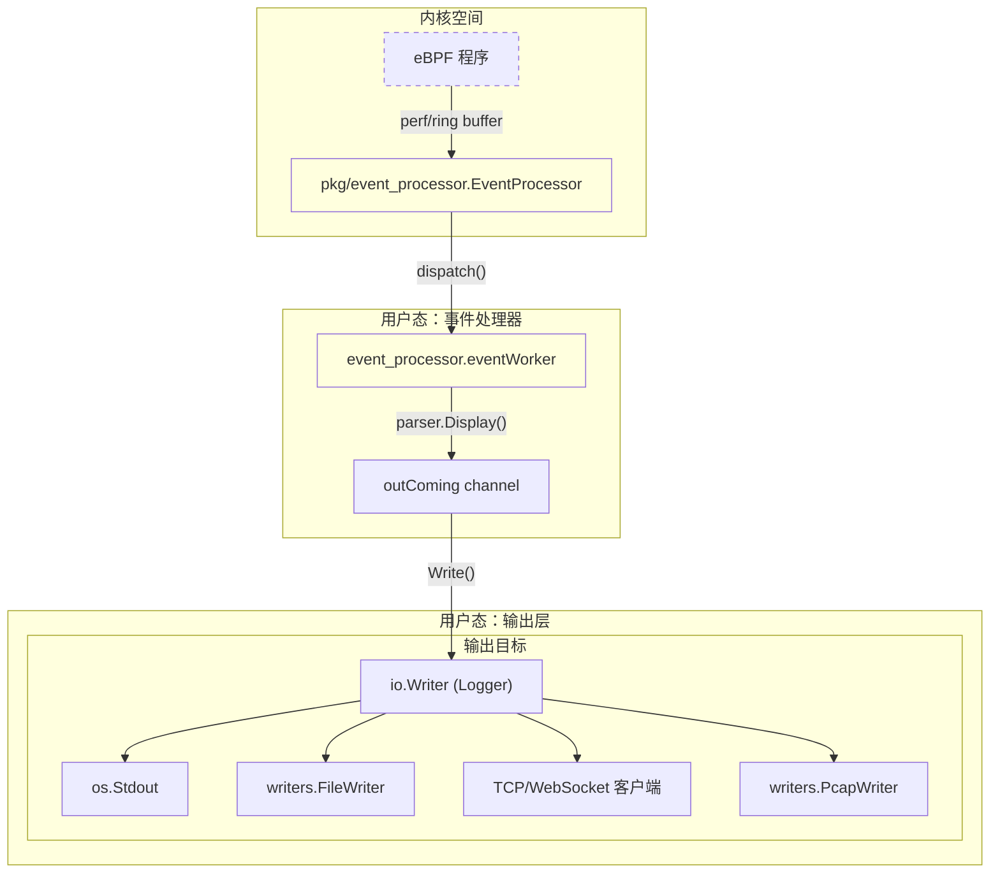
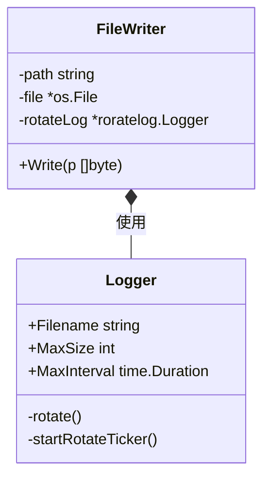
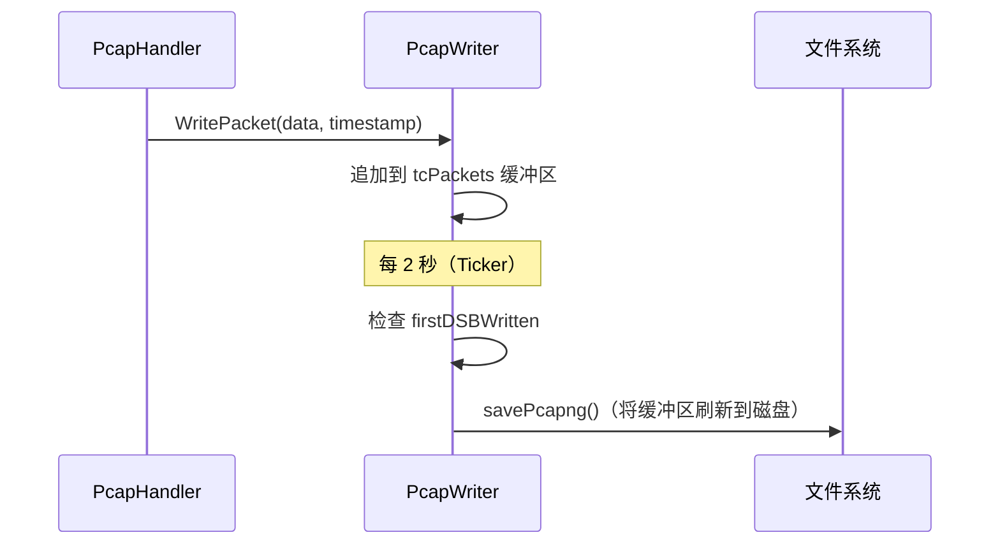

# 日志与输出配置

相关源文件

以下文件被用作生成此维基页面的上下文：

- [cli/cmd/root.go](https://github.com/gojue/ecapture/blob/943a19fe/cli/cmd/root.go)
- [internal/output/writers/file_writer.go](https://github.com/gojue/ecapture/blob/943a19fe/internal/output/writers/file_writer.go)
- [internal/output/writers/pcap_writer.go](https://github.com/gojue/ecapture/blob/943a19fe/internal/output/writers/pcap_writer.go)
- [internal/probe/base/handlers/pcap_handler.go](https://github.com/gojue/ecapture/blob/943a19fe/internal/probe/base/handlers/pcap_handler.go)
- [pkg/event_processor/http_request.go](https://github.com/gojue/ecapture/blob/943a19fe/pkg/event_processor/http_request.go)
- [pkg/event_processor/http_response.go](https://github.com/gojue/ecapture/blob/943a19fe/pkg/event_processor/http_response.go)
- [pkg/event_processor/iparser.go](https://github.com/gojue/ecapture/blob/943a19fe/pkg/event_processor/iparser.go)
- [pkg/event_processor/iworker.go](https://github.com/gojue/ecapture/blob/943a19fe/pkg/event_processor/iworker.go)
- [pkg/event_processor/processor.go](https://github.com/gojue/ecapture/blob/943a19fe/pkg/event_processor/processor.go)
- [pkg/util/roratelog/rorate.go](https://github.com/gojue/ecapture/blob/943a19fe/pkg/util/roratelog/rorate.go)

eCapture 提供了一套灵活的输出系统，兼顾交互式调试和大规模生产集成。支持多种输出目标（stdout、文件、TCP、WebSocket）、结构化数据格式（明文、JSON、Protobuf），以及日志轮转和嵌入 TLS 密钥的 PCAPNG 生成等高级功能。

## 输出架构与数据流

输出系统遵循三阶段流水线：**事件生成**（内核）、**事件处理**（用户态）以及**写入/编码**（输出层）。

### 数据流图
此图追踪了 eBPF 事件根据配置的标志到达最终目的地的整个流程。

**Sources:** [pkg/event_processor/processor.go:64-87](https://github.com/gojue/ecapture/blob/943a19fe/pkg/event_processor/processor.go#L64-L87), [pkg/event_processor/iworker.go:174-227](https://github.com/gojue/ecapture/blob/943a19fe/pkg/event_processor/iworker.go#L174-L227), [cli/cmd/root.go:179-183](https://github.com/gojue/ecapture/blob/943a19fe/cli/cmd/root.go#L179-L183)

---

## 配置标志

输出行为通过根命令中定义的持久标志进行控制。

| 标志 | 描述 | 代码引用 |
| :--- | :--- | :--- |
| `--logaddr`, `-l` | 主日志/事件目的地。支持 `stdout`、文件路径、`tcp://` 或 `ws://`。 | [cli/cmd/root.go:168-168](https://github.com/gojue/ecapture/blob/943a19fe/cli/cmd/root.go#L168-L168) |
| `--eventaddr` | 专用事件转发地址。未设置时默认使用 `--logaddr`。 | [cli/cmd/root.go:169-169](https://github.com/gojue/ecapture/blob/943a19fe/cli/cmd/root.go#L169-L169) |
| `--ecaptureq` | 启用 WebSocket 服务器模式用于事件推送。 | [cli/cmd/root.go:170-170](https://github.com/gojue/ecapture/blob/943a19fe/cli/cmd/root.go#L170-L170) |
| `--hex` | 将字节字符串以十六进制编码字符串形式打印。 | [cli/cmd/root.go:164-164](https://github.com/gojue/ecapture/blob/943a19fe/cli/cmd/root.go#L164-L164) |
| `--tsize`, `-t` | 将事件载荷截断至 N 字节。 | [cli/cmd/root.go:172-172](https://github.com/gojue/ecapture/blob/943a19fe/cli/cmd/root.go#L172-L172) |
| `--eventroratesize` | 日志轮转的最大大小（MB，仅限文件输出）。 | [cli/cmd/root.go:173-173](https://github.com/gojue/ecapture/blob/943a19fe/cli/cmd/root.go#L173-L173) |
| `--eventroratetime` | 日志轮转的时间间隔（秒）。 | [cli/cmd/root.go:174-174](https://github.com/gojue/ecapture/blob/943a19fe/cli/cmd/root.go#L174-L174) |

---

## 日志轮转（roratelog）

当输出到文件时，eCapture 使用 `roratelog` 包来防止磁盘耗尽。在高流量 TLS 捕获场景中，这一点尤为关键。

### 实现细节
`FileWriter` 检查是否启用了轮转，并将文件句柄封装在 `roratelog.Logger` 中。
*   **基于大小**：当 `l.size + writeLen >= MaxSize` 时触发。[pkg/util/roratelog/rorate.go:131-135](https://github.com/gojue/ecapture/blob/943a19fe/pkg/util/roratelog/rorate.go#L131-L135)
*   **基于时间**：后台 goroutine `startRotateTicker` 定期检查文件的存在时长。[pkg/util/roratelog/rorate.go:143-154](https://github.com/gojue/ecapture/blob/943a19fe/pkg/util/roratelog/rorate.go#L143-L154)

**Sources:** [internal/output/writers/file_writer.go:27-43](https://github.com/gojue/ecapture/blob/943a19fe/internal/output/writers/file_writer.go#L27-L43), [pkg/util/roratelog/rorate.go:67-93](https://github.com/gojue/ecapture/blob/943a19fe/pkg/util/roratelog/rorate.go#L67-L93)

---

## 远程转发模式

### TCP/WebSocket 转发
通过使用 `--logaddr tcp://host:port`，eCapture 初始化一个基于网络的写入器。`eventWorker` 在传输前将事件序列化为 Protobuf 消息（如果使用 `ecaptureq`）或纯文本。

### 与 ELK / Kafka 集成
在生产流水线中，eCapture 通常以以下两种方式之一进行部署：
1.  **Filebeat 模式**：eCapture 使用 `--eventroratesize` 写入本地文件。Filebeat 等边车程序将日志传输到 Logstash/Elasticsearch。
2.  **直接流式传输**：eCapture 通过 TCP 流式传输到一个充当 Kafka 生产者的侦听器。

---

## PCAPNG 与 TLS 解密密钥

在捕获网络流量（TC 探针）时，eCapture 使用专用的 `PcapWriter` 生成 PCAPNG 文件。

### 解密密钥块（DSB）
为了使 Wireshark 在没有 CA 证书的情况下解密捕获的 TLS 流量，eCapture 将"解密密钥块"写入 PCAPNG 文件。
*   **序列化**：`PcapWriter` 中的 `Serve()` 循环确保 DSB 写入在其对应的加密数据包*之前*进行。[internal/output/writers/pcap_writer.go:161-226](https://github.com/gojue/ecapture/blob/943a19fe/internal/output/writers/pcap_writer.go#L161-L226)
*   **宽限期**：存在 3 秒的宽限期，在此期间数据包被缓冲，直到第一个密钥到来，以确保密钥出现在捕获文件的开头。[internal/output/writers/pcap_writer.go:171-184](https://github.com/gojue/ecapture/blob/943a19fe/internal/output/writers/pcap_writer.go#L171-L184)

### PCAP 写入器逻辑

**Sources:** [internal/output/writers/pcap_writer.go:138-157](https://github.com/gojue/ecapture/blob/943a19fe/internal/output/writers/pcap_writer.go#L138-L157), [internal/probe/base/handlers/pcap_handler.go:126-159](https://github.com/gojue/ecapture/blob/943a19fe/internal/probe/base/handlers/pcap_handler.go#L126-L159)

---

## 优先级与解析规则

最终输出目的地在 `cli/cmd/root.go` 中解析。
1.  如果设置了 `--ecaptureq`，系统会初始化一个 WebSocket 服务器。
2.  如果提供了 `--eventaddr`，它优先用于捕获的事件。
3.  如果仅提供了 `--logaddr`，则系统日志和捕获的事件都发送到该地址。
4.  默认为带有 `zerolog.ConsoleWriter` 的 `os.Stdout`。[cli/cmd/root.go:182-184](https://github.com/gojue/ecapture/blob/943a19fe/cli/cmd/root.go#L182-L184)

**Sources:** [cli/cmd/root.go:79-103](https://github.com/gojue/ecapture/blob/943a19fe/cli/cmd/root.go#L79-L103), [pkg/event_processor/processor.go:204-213](https://github.com/gojue/ecapture/blob/943a19fe/pkg/event_processor/processor.go#L204-L213)