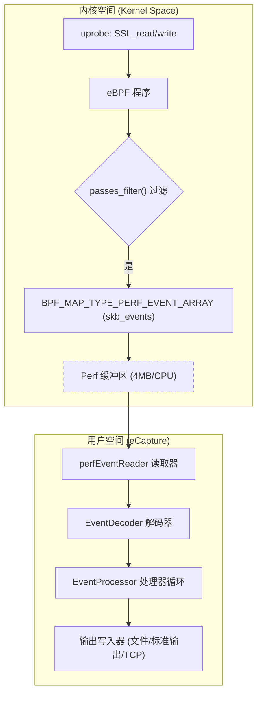
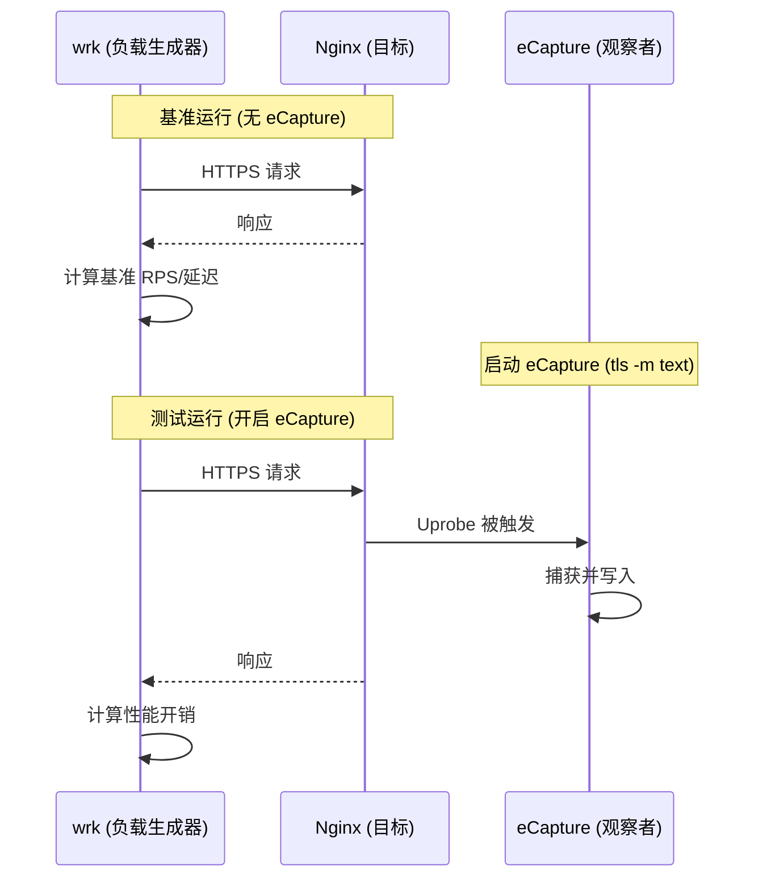

# 性能开销与基准测试

相关源文件

以下文件被用作生成此维基页面的上下文：

- [README-zh_Hans.md](https://github.com/gojue/ecapture/blob/943a19fe/README-zh_Hans.md)
- [SECURITY.md](https://github.com/gojue/ecapture/blob/943a19fe/SECURITY.md)
- [docs/README.md](https://github.com/gojue/ecapture/blob/943a19fe/docs/README.md)
- [docs/defense-detection.md](https://github.com/gojue/ecapture/blob/943a19fe/docs/defense-detection.md)
- [docs/example-outputs.md](https://github.com/gojue/ecapture/blob/943a19fe/docs/example-outputs.md)
- [docs/minimum-privileges.md](https://github.com/gojue/ecapture/blob/943a19fe/docs/minimum-privileges.md)
- [docs/performance-benchmarks.md](https://github.com/gojue/ecapture/blob/943a19fe/docs/performance-benchmarks.md)
- [docs/refactoring-guide.md](https://github.com/gojue/ecapture/blob/943a19fe/docs/refactoring-guide.md)
- [docs/release-verification.md](https://github.com/gojue/ecapture/blob/943a19fe/docs/release-verification.md)
- [internal/domain/perf_event.go](https://github.com/gojue/ecapture/blob/943a19fe/internal/domain/perf_event.go)
- [internal/probe/base/perf_reorder.go](https://github.com/gojue/ecapture/blob/943a19fe/internal/probe/base/perf_reorder.go)
- [internal/probe/base/perf_reorder_test.go](https://github.com/gojue/ecapture/blob/943a19fe/internal/probe/base/perf_reorder_test.go)
- [kern/common.h](https://github.com/gojue/ecapture/blob/943a19fe/kern/common.h)
- [kern/ecapture.h](https://github.com/gojue/ecapture/blob/943a19fe/kern/ecapture.h)
- [kern/tc.h](https://github.com/gojue/ecapture/blob/943a19fe/kern/tc.h)

eCapture 利用 eBPF uprobes 和流量控制（TC）过滤器来拦截来自用户态库和内核网络缓冲区的明文数据。本页详细介绍了生产部署中的性能模型、基准测试方法和调优策略。

## 性能模型

eCapture 的总开销是内核态拦截成本与用户态处理成本之和。

### 1. 拦截开销（内核态）
当探针附加到某个函数（例如 OpenSSL 中的 `SSL_read`）时，会发生以下序列：
*   **Uprobe 入口/出口（Entry/Exit）**：CPU 执行陷阱指令，上下文切换到内核，并执行 eBPF 程序。每个事件的成本通常为 **1-2μs** [docs/performance-benchmarks.md:9](https://github.com/gojue/ecapture/blob/943a19fe/docs/performance-benchmarks.md#L9)。
*   **eBPF 程序执行**：C 程序中的逻辑（例如 PID 过滤、数据复制）。这经过了高度优化，每个事件的成本约为 **0.1-0.5μs** [docs/performance-benchmarks.md:10](https://github.com/gojue/ecapture/blob/943a19fe/docs/performance-benchmarks.md#L10)。
*   **数据复制**：eBPF 程序使用 `bpf_probe_read` 或 `bpf_core_read` 将数据从用户态内存复制到 BPF map 或缓冲区中 [kern/tc.h:22-28](https://github.com/gojue/ecapture/blob/943a19fe/kern/tc.h#L22-L28)。

### 2. 数据传输与用户态成本
*   **Perf Buffer 传输**：数据被推送到 `BPF_MAP_TYPE_PERF_EVENT_ARRAY`。默认大小为 **每个 CPU 核心 4 MB** [docs/performance-benchmarks.md:151](https://github.com/gojue/ecapture/blob/943a19fe/docs/performance-benchmarks.md#L151)。
*   **用户态解码**：基于 Go 的用户态层从 perf buffer 中读取数据，识别协议（HTTP/1.1、HTTP/2 等），并对输出进行编码 [docs/performance-benchmarks.md:12](https://github.com/gojue/ecapture/blob/943a19fe/docs/performance-benchmarks.md#L12)。

### 数据流与实体映射
下图说明了内核态 BPF 实体与用户态处理组件之间的关系。

**图表：性能数据路径**

Sources: [kern/tc.h:58-63](https://github.com/gojue/ecapture/blob/943a19fe/kern/tc.h#L58-L63), [kern/ecapture.h:127-146](https://github.com/gojue/ecapture/blob/943a19fe/kern/ecapture.h#L127-L146), [docs/performance-benchmarks.md:151](https://github.com/gojue/ecapture/blob/943a19fe/docs/performance-benchmarks.md#L151), [docs/example-outputs.md:39](https://github.com/gojue/ecapture/blob/943a19fe/docs/example-outputs.md#L39)

---

## 基准测试方法

为了评估对生产系统的影响，eCapture 建议使用 `wrk` 针对目标 HTTPS 服务器进行测试。

### 评估指标
| 指标 | 描述 | 工具 |
| :--- | :--- | :--- |
| **吞吐量影响** | 每秒查询数 (RPS) 的下降程度 | `wrk` |
| **延迟损耗** | p99/p50 响应时间的增加 | `wrk --latency` |
| **CPU 开销** | 目标进程与 eCapture 的 CPU 消耗对比 | `pidstat -p <pid> 1` |
| **事件丢失率** | eCapture 日志中 "lost X events" 出现的频率 | `ecapture` 标准输出 |

Sources: [docs/performance-benchmarks.md:77-85](https://github.com/gojue/ecapture/blob/943a19fe/docs/performance-benchmarks.md#L77-L85)

### 基准测试执行流程

Sources: [docs/performance-benchmarks.md:46-73](https://github.com/gojue/ecapture/blob/943a19fe/docs/performance-benchmarks.md#L46-L73)

---

## 调优与优化

### 1. 过滤（缩小范围）
降低开销最有效的方法是尽量减少内核处理的事件数量。
*   **PID/UID 过滤**：使用 `--pid` 或 `--uid` 确保 `passes_filter()` 对无关进程返回 `false`，从而避免将数据复制到 perf buffer [kern/ecapture.h:127-146](https://github.com/gojue/ecapture/blob/943a19fe/kern/ecapture.h#L127-L146)。
*   **Cgroup 过滤**：在内核版本 >= 4.18 上可通过 `target_cgroup_id` 使用 [kern/common.h:73](https://github.com/gojue/ecapture/blob/943a19fe/kern/common.h#L73)。

### 2. Perf Buffer 调优
如果用户态读取器的速度跟不上内核生成的速度，事件将会被丢弃。
*   **缓冲区大小**：默认每个 CPU 4MB。高吞吐量场景可能需要增加此值（如果版本支持） [docs/performance-benchmarks.md:151](https://github.com/gojue/ecapture/blob/943a19fe/docs/performance-benchmarks.md#L151)。
*   **模式选择**：
    *   `keylog` 模式：低开销。仅捕获密钥，允许后续使用 Wireshark 解密 [docs/performance-benchmarks.md:155](https://github.com/gojue/ecapture/blob/943a19fe/docs/performance-benchmarks.md#L155)。
    *   `text` 模式：高开销。捕获高达 16KB 的完整明文片段 [kern/common.h:39](https://github.com/gojue/ecapture/blob/943a19fe/kern/common.h#L39)。

### 3. 事件重排序
在高负载下，来自不同 CPU 的事件在到达用户态时可能会失序。eCapture 实现了 `perfLagReorder` 机制，在处理前根据单调时间戳对事件进行缓冲和排序 [internal/probe/base/perf_reorder_test.go:59-77](https://github.com/gojue/ecapture/blob/943a19fe/internal/probe/base/perf_reorder_test.go#L59-L77)。
*   **配置**：通过 `PerfReorder` 和 `PerfReorderLagMs` 控制（默认 10ms-20ms） [internal/probe/base/perf_reorder_test.go:130-137](https://github.com/gojue/ecapture/blob/943a19fe/internal/probe/base/perf_reorder_test.go#L130-L137)。

---

## 生产性能检查清单

在流量巨大的生产环境中部署 eCapture 之前，请核实以下内容：

1.  **内核支持**：确保内核版本 >= 5.8，以便使用 `CAP_BPF` 和 `CAP_PERFMON` 进行更精细的资源控制 [docs/minimum-privileges.md:7-16](https://github.com/gojue/ecapture/blob/943a19fe/docs/minimum-privileges.md#L7-L16)。
2.  **范围控制**：始终使用 `--pid` 标志，将捕获范围隔离到正在调查的特定应用程序 [docs/performance-benchmarks.md:154](https://github.com/gojue/ecapture/blob/943a19fe/docs/performance-benchmarks.md#L154)。
3.  **输出模式**：长期监控建议优先选择 `keylog` 模式；仅在短期调试时使用 `text` 或 `pcapng` [docs/performance-benchmarks.md:155](https://github.com/gojue/ecapture/blob/943a19fe/docs/performance-benchmarks.md#L155)。
4.  **监控**：监控 eCapture 自身的 CPU 使用情况，并观察日志输出中是否有 "lost events"（丢失事件）的消息 [docs/performance-benchmarks.md:80-84](https://github.com/gojue/ecapture/blob/943a19fe/docs/performance-benchmarks.md#L80-L84)。

Sources: [docs/performance-benchmarks.md:141-158](https://github.com/gojue/ecapture/blob/943a19fe/docs/performance-benchmarks.md#L141-L158), [docs/minimum-privileges.md:29-34](https://github.com/gojue/ecapture/blob/943a19fe/docs/minimum-privileges.md#L29-L34)