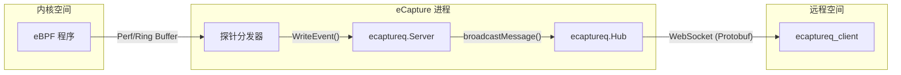
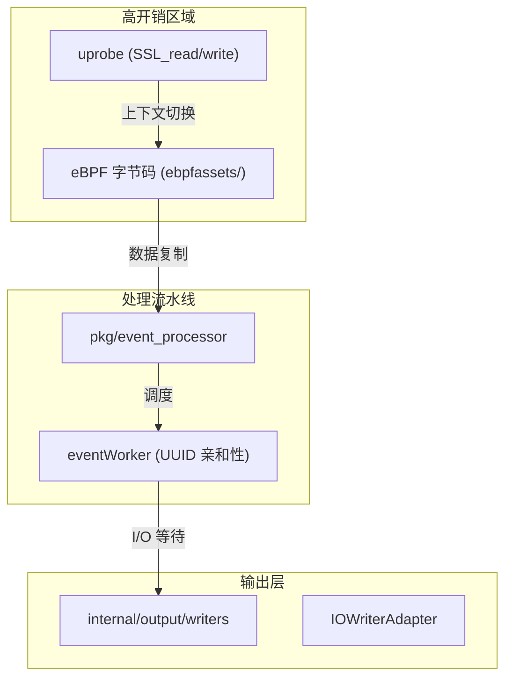

# 集成与部署

相关源文件

以下文件被用作生成此维基页面的上下文：

- [CHANGELOG.md](https://github.com/gojue/ecapture/blob/943a19fe/CHANGELOG.md)
- [README.md](https://github.com/gojue/ecapture/blob/943a19fe/README.md)
- [cli/cmd/ecaptureq.go](https://github.com/gojue/ecapture/blob/943a19fe/cli/cmd/ecaptureq.go)
- [examples/ecaptureq_client/main.go](https://github.com/gojue/ecapture/blob/943a19fe/examples/ecaptureq_client/main.go)
- [internal/output/writers/iowriter_adapter.go](https://github.com/gojue/ecapture/blob/943a19fe/internal/output/writers/iowriter_adapter.go)
- [main.go](https://github.com/gojue/ecapture/blob/943a19fe/main.go)
- [pkg/ecaptureq/server.go](https://github.com/gojue/ecapture/blob/943a19fe/pkg/ecaptureq/server.go)

本页面提供了如何将 eCapture 集成到生产环境并管理其生命周期的高层概述。涵盖远程事件流、动态配置更新、输出管理以及性能注意事项等机制。

## 远程事件流（eCaptureQ）

对于大规模部署，eCapture 提供了一个基于 WebSocket 的流式传输服务，称为 **eCaptureQ**。这使用户能够将多个节点的流量捕获集中到单一的处理后端。

该系统使用在 `protobuf/gen/v1` 中定义的基于 Protobuf 的消息协议 [pkg/ecaptureq/server.go:23](https://github.com/gojue/ecapture/blob/943a19fe/pkg/ecaptureq/server.go#L23)。服务器维护一个 128 条消息的历史缓冲区（`LogBuffLen`）[pkg/ecaptureq/server.go:29](https://github.com/gojue/ecapture/blob/943a19fe/pkg/ecaptureq/server.go#L29)，以确保新接入的客户端在连接时能收到近期上下文。

详情请参见 [远程事件流 (eCaptureQ WebSocket)](4.1-remote-event-streaming-ecaptureq-websocket.md)。

### eCaptureQ 数据流
下图展示了事件如何从 eBPF 内核空间通过 eCaptureQ 服务器流向远程客户端。

**图表：eCaptureQ 流架构**

**Sources:** [pkg/ecaptureq/server.go:31-57](https://github.com/gojue/ecapture/blob/943a19fe/pkg/ecaptureq/server.go#L31-L57), [cli/cmd/ecaptureq.go:30-36](https://github.com/gojue/ecapture/blob/943a19fe/cli/cmd/ecaptureq.go#L30-L36), [examples/ecaptureq_client/main.go:44-58](https://github.com/gojue/ecapture/blob/943a19fe/examples/ecaptureq_client/main.go#L44-L58)

## 远程动态配置 API

eCapture 支持在不重启进程的情况下热重载某些配置。这通过一个内置 HTTP 服务器实现（自 v2.3.0 起默认禁用 [CHANGELOG.md:6](https://github.com/gojue/ecapture/blob/943a19fe/CHANGELOG.md#L6)）。通过 `--listen` 标志启用后，它会为各个探针（例如 `/tls`、`/gotls`、`/bash`）暴露端点。

此 API 允许 SRE 工程师：
* 更改捕获过滤器（PID、UID）。
* 更新目标库路径（`--libssl` 或 `--elfpath`）。
* 切换输出模式（text 与 pcapng）。

详情请参见 [远程动态配置 API](4.2-remote-dynamic-configuration-api.md)。

## 日志与输出配置

eCapture 通过其 `internal/output` 模块提供灵活的输出路由。它可以使用 `IOWriterAdapter` 等适配器同时写入多个目的地 [internal/output/writers/iowriter_adapter.go:22](https://github.com/gojue/ecapture/blob/943a19fe/internal/output/writers/iowriter_adapter.go#L22)。

主要功能包括：
* **日志转发**：通过 `--logaddr` 将运行日志发送到远程 TCP 地址。
* **事件转发**：通过 `--eventaddr` 将捕获数据流式传输到远程地址。
* **日志轮转**：内置日志轮转，防止生产环境中磁盘耗尽。
* **格式选择**：在人类可读的文本、结构化 JSON 或二进制 PCAPNG/Keylog 格式之间选择。

详情请参见 [日志与输出配置](4.3-logging-and-output-configuration.md)。

## 性能开销与基准测试

运行 eBPF uprobes 会为每次函数调用入口/出口引入小量延迟（通常为 1-2 微秒）。在高吞吐量环境中（例如繁忙的 Nginx 负载均衡器），这种开销会累积。

eCapture 提供调优参数来降低影响：
* **缓冲区选择**：根据内核支持和吞吐量需求，在 `perf_buffer` 和 `ring_buffer` 之间选择。
* **采样**：通过 PID 或 CGroup 过滤来限制捕获范围 [CHANGELOG.md:20](https://github.com/gojue/ecapture/blob/943a19fe/CHANGELOG.md#L20)。
* **批处理**：使用缓冲写入器，例如 `pcapng` 数据包写入器 [CHANGELOG.md:117](https://github.com/gojue/ecapture/blob/943a19fe/CHANGELOG.md#L117)。

详情请参见 [性能开销与基准测试](4.4-performance-overhead-and-benchmarks.md)。

### 性能与逻辑实体
下图将性能敏感组件映射到其代码实现。

**图表：性能影响映射**

**Sources:** [README.md:114-118](https://github.com/gojue/ecapture/blob/943a19fe/README.md#L114-L118), [internal/output/writers/iowriter_adapter.go:22-38](https://github.com/gojue/ecapture/blob/943a19fe/internal/output/writers/iowriter_adapter.go#L22-L38), [CHANGELOG.md:100-107](https://github.com/gojue/ecapture/blob/943a19fe/CHANGELOG.md#L100-L107)

## 集成功能汇总表

| 功能 | 主要标志 | 实现组件 | 典型使用场景 |
| :--- | :--- | :--- | :--- |
| **事件流** | `--ecaptureq` | `pkg/ecaptureq` | 集中式安全运营中心（SOC） |
| **热配置** | `--listen` | `internal/probe`（HTTP） | CI/CD 中的动态目标调整 |
| **PCAP 导出** | `-m pcap` | `pcapwriter` | 在 Wireshark 中进行深度包分析 |
| **远程日志** | `--logaddr` | `IOWriterAdapter` | ELK/Splunk 日志聚合 |

**Sources:** [README.md:114-123](https://github.com/gojue/ecapture/blob/943a19fe/README.md#L114-L123), [cli/cmd/ecaptureq.go:21-36](https://github.com/gojue/ecapture/blob/943a19fe/cli/cmd/ecaptureq.go#L21-L36), [internal/output/writers/iowriter_adapter.go:22-33](https://github.com/gojue/ecapture/blob/943a19fe/internal/output/writers/iowriter_adapter.go#L22-L33)