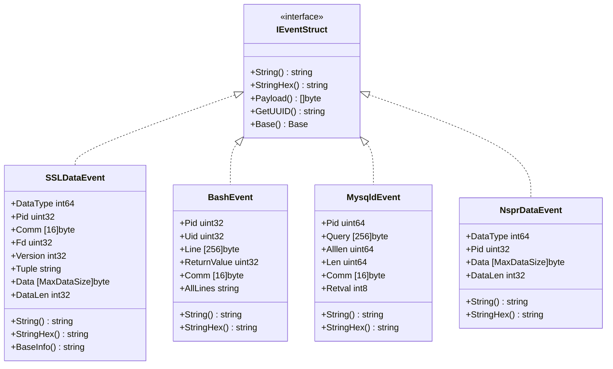
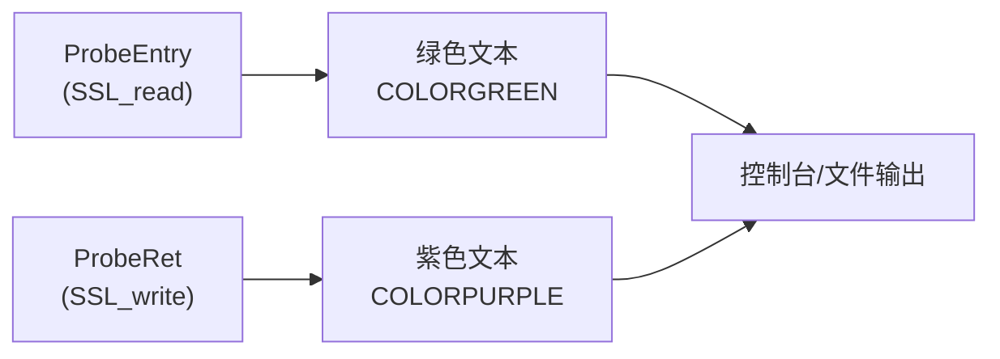
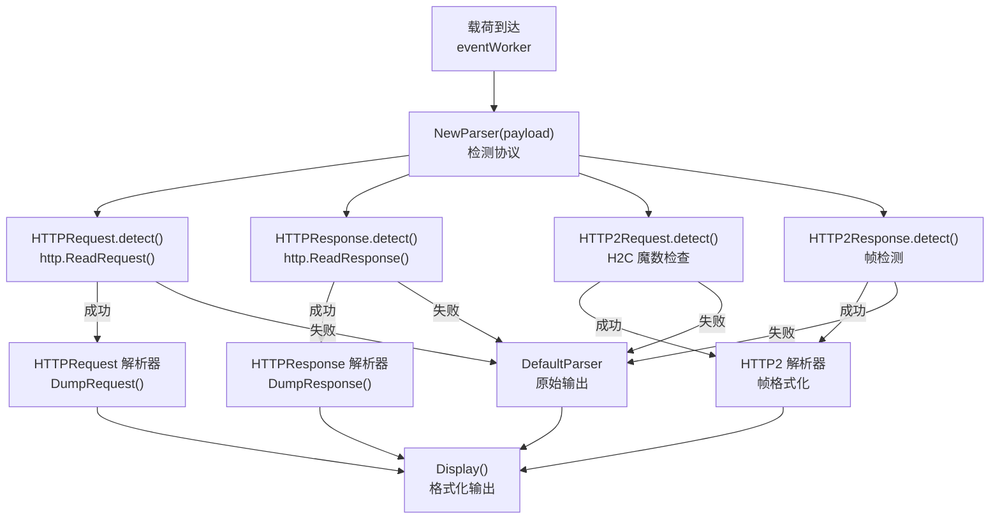
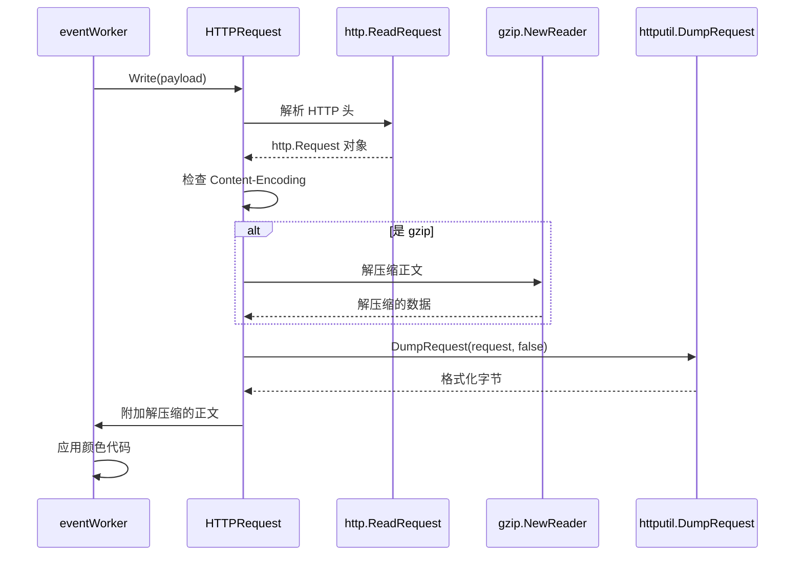
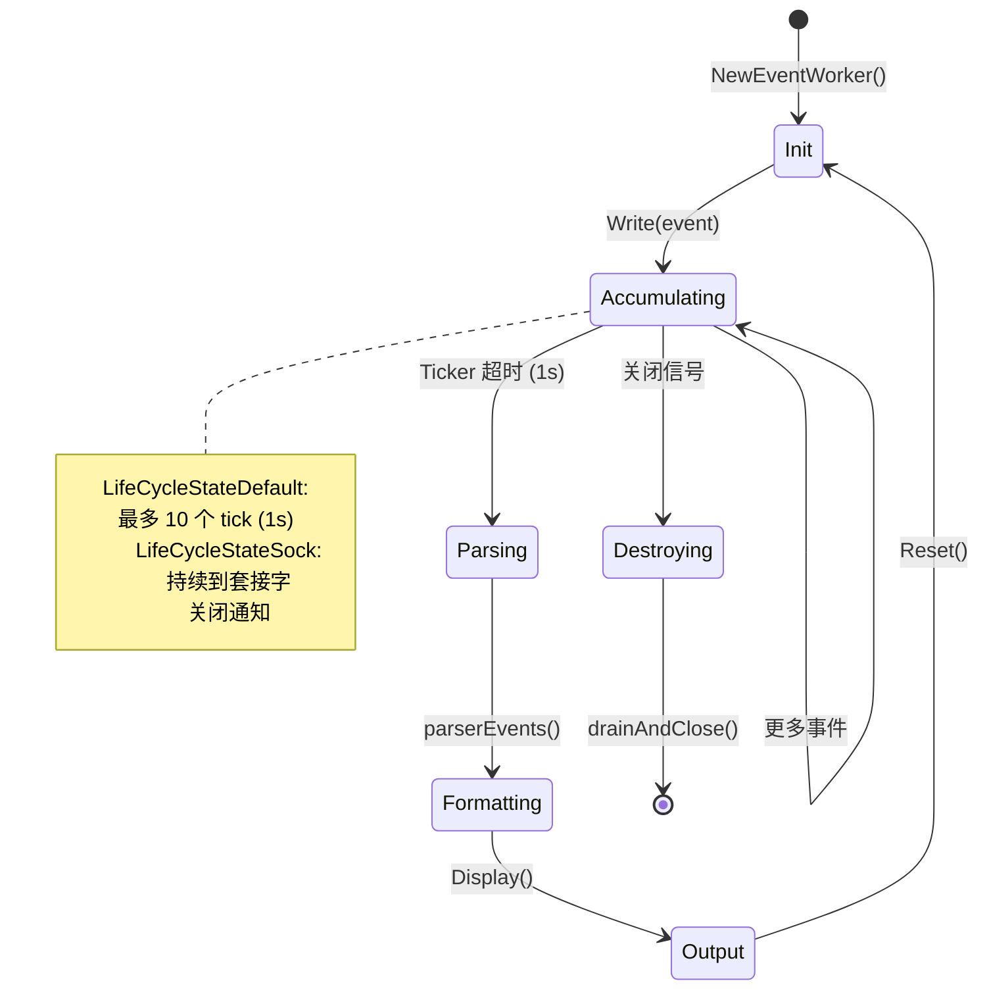
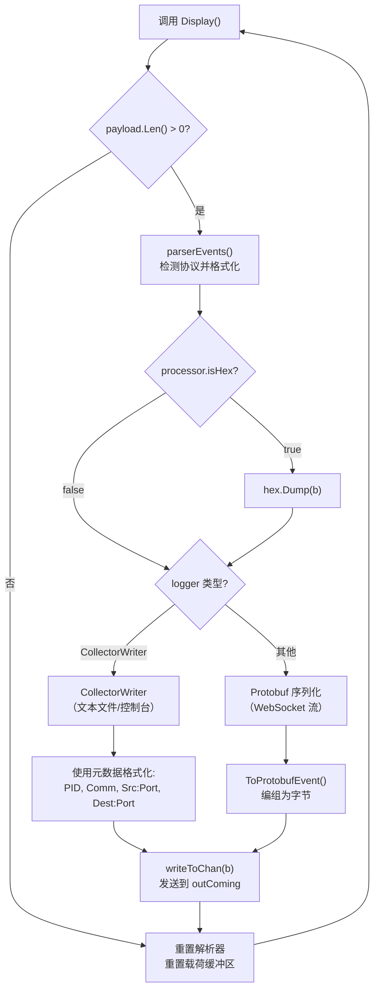
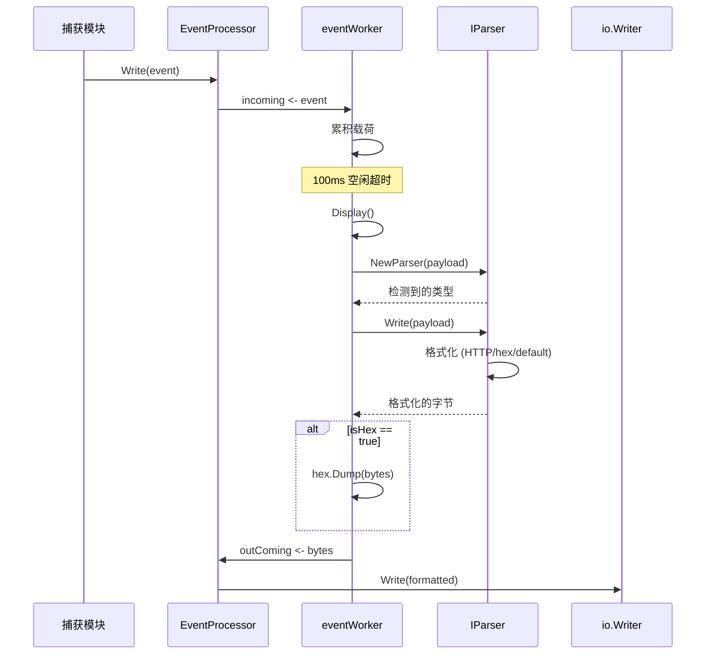

# 文本输出模式

## 目的与范围

文本输出模式为捕获的网络流量和系统事件提供人类可读的控制台和文件输出。此模式将捕获的 SSL/TLS 明文、数据库查询和 shell 命令格式化为结构化文本，支持协议解析、颜色编码和连接元数据。与生成二进制数据包捕获的 PCAP 模式（参见 [PCAP 集成](4.2-pcap-integration.md)）或导出解密密钥的密钥日志模式（参见 [TLS 密钥日志](4.3-tls-key-logging.md)）不同，文本输出模式专为即时查看和日志文件分析而设计。

本页涵盖：
- 事件字符串格式化机制（`String()` 和 `StringHex()` 方法）
- 协议感知解析（HTTP/1.x、HTTP/2、gzip 解压缩）
- 流量方向的颜色编码输出
- 从捕获到控制台的事件处理流程
- 十六进制转储和截断的配置选项

---

## 事件格式化架构

文本输出模式依赖于多态格式化系统，其中每种事件类型实现 `IEventStruct` 接口，提供两种输出方法：



**来源：** [user/event/ievent.go:41-52](https://github.com/gojue/ecapture/blob/0766a93b/user/event/ievent.go#L41-L52), [user/event/event_openssl.go:77-92](https://github.com/gojue/ecapture/blob/0766a93b/user/event/event_openssl.go#L77-L92), [user/event/event_bash.go:37-47](https://github.com/gojue/ecapture/blob/0766a93b/user/event/event_bash.go#L37-L47), [user/event/event_mysqld.go:68-78](https://github.com/gojue/ecapture/blob/0766a93b/user/event/event_mysqld.go#L68-L78), [user/event/event_nspr.go:26-36](https://github.com/gojue/ecapture/blob/0766a93b/user/event/event_nspr.go#L26-L36)

### String 与 StringHex 方法

每种事件类型提供两种格式化变体：

| 方法 | 目的 | 输出格式 |
|--------|---------|---------------|
| `String()` | 默认文本输出 | 带元数据头的纯文本载荷 |
| `StringHex()` | 十六进制转储 | 带 ASCII 侧边栏的多行十六进制转储 |

`EventProcessor` 根据 `isHex` 标志在这两者之间进行选择：

[pkg/event_processor/processor.go:48](https://github.com/gojue/ecapture/blob/0766a93b/pkg/event_processor/processor.go#L48)
```
isHex        bool
```

当调用 `eventWorker.Display()` 时，它会检查此标志并在启用时应用十六进制编码：

[pkg/event_processor/iworker.go:192-194](https://github.com/gojue/ecapture/blob/0766a93b/pkg/event_processor/iworker.go#L192-L194)
```
if ew.processor.isHex {
    b = []byte(hex.Dump(b))
}
```

**来源：** [pkg/event_processor/processor.go:48](https://github.com/gojue/ecapture/blob/0766a93b/pkg/event_processor/processor.go#L48), [pkg/event_processor/iworker.go:192-194](https://github.com/gojue/ecapture/blob/0766a93b/pkg/event_processor/iworker.go#L192-L194)

---

## 连接元数据显示

文本输出包含从 eBPF 事件中提取的丰富连接元数据。对于 SSL/TLS 连接，`SSLDataEvent.BaseInfo()` 方法格式化此信息：

**输出格式示例：**
```
PID:1234, Comm:curl, TID:1234, Version:TLS1_3_VERSION, Received 512 bytes from 93.184.216.34:443
```

**格式化字段：**

| 字段 | 来源 | 描述 |
|-------|--------|-------------|
| PID | `SSLDataEvent.Pid` | 进程标识符 |
| Comm | `SSLDataEvent.Comm` | 进程命令名称（最大 16 字节） |
| TID | `SSLDataEvent.Tid` | 线程标识符 |
| Version | `SSLDataEvent.Version` | TLS 版本（通过 `TlsVersion.String()` 转换） |
| Direction | `SSLDataEvent.DataType` | ProbeEntry（接收）或 ProbeRet（发送） |
| Tuple | `SSLDataEvent.Tuple` | IP:Port-IP:Port 连接元组 |

[user/event/event_openssl.go:181-198](https://github.com/gojue/ecapture/blob/0766a93b/user/event/event_openssl.go#L181-L198)

`Tuple` 字段由来自 TC（流量控制）钩子事件的 `ConnDataEvent` 填充，提供用于连接归属的网络四元组。

**来源：** [user/event/event_openssl.go:181-198](https://github.com/gojue/ecapture/blob/0766a93b/user/event/event_openssl.go#L181-L198), [user/event/event_openssl.go:55-75](https://github.com/gojue/ecapture/blob/0766a93b/user/event/event_openssl.go#L55-L75)

---

## 颜色编码输出系统

文本输出模式使用 ANSI 颜色代码来直观地区分流量方向和事件类型：



**颜色代码定义：**

[user/event/event.go:8-13](https://github.com/gojue/ecapture/blob/0766a93b/user/event/event.go#L8-L13)
```
COLORPURPLE = "\033[35m"  // 发送（出站流量）
COLORGREEN  = "\033[32m"  // 接收（入站流量）
COLORYELLOW = "\033[33m"  // 地址/元组高亮
COLORRED    = "\033[31m"  // 错误/未知类型
COLORRESET  = "\033[0m"   // 重置为默认
COLORBLUE   = "\033[34m"  // 过滤指示器
```

### 在 SSLDataEvent 中的应用

[user/event/event_openssl.go:168-179](https://github.com/gojue/ecapture/blob/0766a93b/user/event/event_openssl.go#L168-L179)

`String()` 方法根据 `AttachType` 应用颜色：
```
switch AttachType(se.DataType) {
case ProbeEntry:
    prefix = COLORGREEN
case ProbeRet:
    prefix = COLORPURPLE
}
```

对于接收的数据（绿色）：
```
Received 256 bytes from 93.184.216.34:443
<绿色文本>GET / HTTP/1.1
Host: example.com
...</绿色文本>
```

对于发送的数据（紫色）：
```
Send 512 bytes to 93.184.216.34:443
<紫色文本>HTTP/1.1 200 OK
Content-Type: text/html
...</紫色文本>
```

**来源：** [user/event/event.go:8-13](https://github.com/gojue/ecapture/blob/0766a93b/user/event/event.go#L8-L13), [user/event/event_openssl.go:168-179](https://github.com/gojue/ecapture/blob/0766a93b/user/event/event_openssl.go#L168-L179), [user/event/event_openssl.go:151-166](https://github.com/gojue/ecapture/blob/0766a93b/user/event/event_openssl.go#L151-L166)

---

## 协议感知解析

文本输出模式包括 HTTP 流量的自动协议检测和解析，提供结构化格式而不是原始字节转储。

### 解析器检测流程



**来源：** [pkg/event_processor/iparser.go:85-115](https://github.com/gojue/ecapture/blob/0766a93b/pkg/event_processor/iparser.go#L85-L115)

### HTTP/1.x 请求解析

[pkg/event_processor/http_request.go:28-35](https://github.com/gojue/ecapture/blob/0766a93b/pkg/event_processor/http_request.go#L28-L35)

`HTTPRequest` 解析器使用 Go 的 `net/http` 包来解析请求：



[pkg/event_processor/http_request.go:105-157](https://github.com/gojue/ecapture/blob/0766a93b/pkg/event_processor/http_request.go#L105-L157)

**关键特性：**
- 当存在 `Content-Encoding: gzip` 头时自动进行 gzip 解压缩
- 使用 `httputil.DumpRequest()` 进行一致的格式化
- HTTP/2.0 检测（对于 HTTP/2 返回原始字节）
- 使用 `io.ErrUnexpectedEOF` 处理截断的正文

**来源：** [pkg/event_processor/http_request.go:54-81](https://github.com/gojue/ecapture/blob/0766a93b/pkg/event_processor/http_request.go#L54-L81), [pkg/event_processor/http_request.go:105-157](https://github.com/gojue/ecapture/blob/0766a93b/pkg/event_processor/http_request.go#L105-L157)

### HTTP/1.x 响应解析

[pkg/event_processor/http_response.go:28-37](https://github.com/gojue/ecapture/blob/0766a93b/pkg/event_processor/http_response.go#L28-L37)

响应解析遵循类似模式，但有额外考虑：

[pkg/event_processor/http_response.go:115-175](https://github.com/gojue/ecapture/blob/0766a93b/pkg/event_processor/http_response.go#L115-L175)

**分块传输处理：**
- 检测 `ContentLength < 0` 表示分块编码
- 当 `ContentLength > rawLength` 时记录截断警告
- 支持 HEAD 方法响应（带有 Content-Length 头的零长度正文）

**Gzip 支持：**
```
switch hr.response.Header.Get("Content-Encoding") {
case "gzip":
    reader, err = gzip.NewReader(bytes.NewReader(rawData))
    rawData, err = io.ReadAll(reader)
    hr.packerType = PacketTypeGzip
```

**来源：** [pkg/event_processor/http_response.go:115-175](https://github.com/gojue/ecapture/blob/0766a93b/pkg/event_processor/http_response.go#L115-L175)

### 默认解析器（非 HTTP）

[pkg/event_processor/iparser.go:117-166](https://github.com/gojue/ecapture/blob/0766a93b/pkg/event_processor/iparser.go#L117-L166)

当未检测到协议时，`DefaultParser` 提供备用格式化：

**行为：**
1. 检查第一个字节：如果 `< 32` 或 `> 126`（非 ASCII），输出十六进制转储
2. 否则，输出为修剪后的字符串

```
if b[0] < 32 || b[0] > 126 {
    return []byte(hex.Dump(b))
}
return []byte(CToGoString(dp.reader.Bytes()))
```

**来源：** [pkg/event_processor/iparser.go:152-160](https://github.com/gojue/ecapture/blob/0766a93b/pkg/event_processor/iparser.go#L152-L160)

---

## 事件处理流程

文本输出系统通过多阶段流程处理事件：

```mermaid
flowchart TB
    subgraph "模块层"
        Module["捕获模块<br/>(TLS/Bash/MySQL)"]
    end
    
    subgraph "EventProcessor"
        Incoming["incoming chan<br/>IEventStruct"]
        Dispatch["dispatch()<br/>按 UUID 路由"]
        WorkerQueue["workerQueue<br/>map[string]IWorker"]
    end
    
    subgraph "eventWorker（每个连接）"
        IncomingChan["incoming chan<br/>IEventStruct"]
        WriteEvent["writeEvent()<br/>累积载荷"]
        PayloadBuf["payload *bytes.Buffer"]
        Ticker["ticker (100ms)<br/>空闲检测"]
        ParserEvents["parserEvents()<br/>协议检测"]
        ParserInst["parser IParser<br/>(HTTP/HTTP2/Default)"]
        Display["Display()<br/>格式化输出"]
    end
    
    subgraph "输出"
        OutComing["outComing chan []byte"]
        Logger["logger io.Writer"]
    end
    
    Module -->|Write()| Incoming
    Incoming --> Dispatch
    Dispatch -->|获取/创建| WorkerQueue
    WorkerQueue -->|路由到| IncomingChan
    
    IncomingChan --> WriteEvent
    WriteEvent --> PayloadBuf
    
    Ticker -->|超时| ParserEvents
    PayloadBuf --> ParserEvents
    ParserEvents --> ParserInst
    ParserInst --> Display
    
    Display -->|isHex 检查| OutComing
    OutComing --> Logger
```

**来源：** [pkg/event_processor/processor.go:66-89](https://github.com/gojue/ecapture/blob/0766a93b/pkg/event_processor/processor.go#L66-L89), [pkg/event_processor/iworker.go:262-306](https://github.com/gojue/ecapture/blob/0766a93b/pkg/event_processor/iworker.go#L262-L306), [pkg/event_processor/iworker.go:174-228](https://github.com/gojue/ecapture/blob/0766a93b/pkg/event_processor/iworker.go#L174-L228)

### EventProcessor：中央调度器

[pkg/event_processor/processor.go:30-50](https://github.com/gojue/ecapture/blob/0766a93b/pkg/event_processor/processor.go#L30-L50)

`EventProcessor` 维护一个按连接 UUID 索引的工作队列：

**关键字段：**
- `incoming chan event.IEventStruct` - 从模块接收事件
- `outComing chan []byte` - 将格式化输出发送到日志记录器
- `workerQueue map[string]IWorker` - 每个连接的活动工作器
- `isHex bool` - 全局十六进制转储标志
- `truncateSize uint64` - 载荷截断限制

**调度逻辑：**

[pkg/event_processor/processor.go:91-109](https://github.com/gojue/ecapture/blob/0766a93b/pkg/event_processor/processor.go#L91-L109)

```
uuid := e.GetUUID()  // 格式："PID_TID_Comm_FD_DataType"
found, eWorker := ep.getWorkerByUUID(uuid)
if !found {
    eWorker = NewEventWorker(uuid, ep)
    ep.addWorkerByUUID(eWorker)
}
err := eWorker.Write(e)
```

**来源：** [pkg/event_processor/processor.go:30-50](https://github.com/gojue/ecapture/blob/0766a93b/pkg/event_processor/processor.go#L30-L50), [pkg/event_processor/processor.go:91-109](https://github.com/gojue/ecapture/blob/0766a93b/pkg/event_processor/processor.go#L91-L109)

### eventWorker：每个连接的状态机

[pkg/event_processor/iworker.go:70-89](https://github.com/gojue/ecapture/blob/0766a93b/pkg/event_processor/iworker.go#L70-L89)

每个 `eventWorker` 管理单个连接的事件流：

**生命周期状态：**



**两种生命周期模式：**

[pkg/event_processor/iworker.go:57-63](https://github.com/gojue/ecapture/blob/0766a93b/pkg/event_processor/iworker.go#L57-L63)

| 状态 | 触发器 | 行为 |
|-------|---------|----------|
| `LifeCycleStateDefault` | 标准 UUID | 空闲 1 秒后自毁 |
| `LifeCycleStateSock` | UUID 以 "sock:" 开头 | 持续到套接字关闭 |

**来源：** [pkg/event_processor/iworker.go:57-89](https://github.com/gojue/ecapture/blob/0766a93b/pkg/event_processor/iworker.go#L57-L89), [pkg/event_processor/iworker.go:262-306](https://github.com/gojue/ecapture/blob/0766a93b/pkg/event_processor/iworker.go#L262-L306)

### Display 方法：输出格式化

[pkg/event_processor/iworker.go:174-228](https://github.com/gojue/ecapture/blob/0766a93b/pkg/event_processor/iworker.go#L174-L228)

`Display()` 方法协调最终输出格式化：



**输出格式选择：**

[pkg/event_processor/iworker.go:198-227](https://github.com/gojue/ecapture/blob/0766a93b/pkg/event_processor/iworker.go#L198-L227)

1. **CollectorWriter（文本模式）：**
   ```
   PID:1234, Comm:curl, Src:192.168.1.100:54321, Dest:93.184.216.34:443,
   <格式化的载荷>
   ```

2. **Protobuf 模式：**
   - 序列化的 `pb.LogEntry` 带有 `pb.Event` 载荷
   - 用于 WebSocket 流式传输到 eCaptureQ GUI
   - 详见 [Protobuf 与外部集成](4.4-protobuf-and-external-integration.md)

**来源：** [pkg/event_processor/iworker.go:174-228](https://github.com/gojue/ecapture/blob/0766a93b/pkg/event_processor/iworker.go#L174-L228)

---

## 载荷截断

为防止大载荷导致的内存耗尽，文本输出模式支持可配置的截断：

[pkg/event_processor/iworker.go:230-245](https://github.com/gojue/ecapture/blob/0766a93b/pkg/event_processor/iworker.go#L230-L245)

```
tsize := int(ew.processor.truncateSize)
if tsize > 0 && ew.payload.Len() >= tsize {
    ew.payload.Truncate(tsize)
    ew.Log(fmt.Sprintf("Events truncated, size: %d bytes\n", tsize))
    return
}
```

**配置：**

[pkg/event_processor/processor.go:206-215](https://github.com/gojue/ecapture/blob/0766a93b/pkg/event_processor/processor.go#L206-L215)

```
func NewEventProcessor(logger io.Writer, isHex bool, truncateSize uint64) *EventProcessor
```

**截断行为：**
- 当累积载荷达到 `truncateSize` 字节时应用
- 停止接受该工作器的新事件
- 记录截断消息
- 工作器继续处理截断后的载荷

**来源：** [pkg/event_processor/iworker.go:230-245](https://github.com/gojue/ecapture/blob/0766a93b/pkg/event_processor/iworker.go#L230-L245), [pkg/event_processor/processor.go:206-215](https://github.com/gojue/ecapture/blob/0766a93b/pkg/event_processor/processor.go#L206-L215)

---

## 十六进制转储格式

当启用 `isHex` 模式时，系统使用结构化的十六进制转储格式：

[pkg/event_processor/base_event.go:211-252](https://github.com/gojue/ecapture/blob/0766a93b/pkg/event_processor/base_event.go#L211-L252)

**格式布局：**
```
0000    47 45 54 20 2F 20 48 54    54 50 2F 31 2E 31 0D 0A    GET / HTTP/1.1..
0016    48 6F 73 74 3A 20 65 78    61 6D 70 6C 65 2E 63 6F    Host: example.co
0032    6D 0D 0A 0D 0A                                       m....
```

**列结构：**
| 列 | 宽度 | 内容 |
|--------|-------|---------|
| 偏移量 | 4 字符 | 字节位置（十六进制） |
| 十六进制组 1 | 24 字符 | 8 字节十六进制（第 4 字节后 2 空格） |
| 十六进制组 2 | 24 字符 | 8 字节十六进制（第 4 字节后 2 空格） |
| ASCII | 16 字符 | ASCII 表示（不可打印 → '.'） |

**实现细节：**

```
ChunkSize = 16       // 每行字节数
ChunkSizeHalf = 8    // 间距分割点

for i := 0; i < n; i++ {
    if i%ChunkSize == 0 {
        fmt.Fprintf(bb, "%04d", i)  // 偏移量
    }
    if i%ChunkSizeHalf == 0 {
        bb.WriteString("    ")      // 组分隔符
    }
    fmt.Fprintf(bb, " %02X", b[i])  // 十六进制字节
    
    // 将非 ASCII 转换为 '.'
    if b[i] < 32 || b[i] > 126 {
        a[i%ChunkSize] = '.'
    } else {
        a[i%ChunkSize] = b[i]
    }
}
```

**来源：** [pkg/event_processor/base_event.go:35-36](https://github.com/gojue/ecapture/blob/0766a93b/pkg/event_processor/base_event.go#L35-L36), [pkg/event_processor/base_event.go:211-252](https://github.com/gojue/ecapture/blob/0766a93b/pkg/event_processor/base_event.go#L211-L252)

---

## 模块特定输出示例

### SSL/TLS 数据输出

**标准格式：**
```
PID:12345, Comm:curl, TID:12345, Version:TLS1_3_VERSION, Received 1024 bytes from 93.184.216.34:443
GET /api/v1/users HTTP/1.1
Host: api.example.com
User-Agent: curl/7.68.0
Accept: */*
```

**十六进制格式：**
```
PID:12345, Comm:curl, TID:12345, Received 1024 bytes, Payload:
0000    47 45 54 20 2F 61 70 69    2F 76 31 2F 75 73 65 72    GET /api/v1/user
0016    73 20 48 54 54 50 2F 31    2E 31 0D 0A 48 6F 73 74    s HTTP/1.1..Host
...
```

**来源：** [user/event/event_openssl.go:168-179](https://github.com/gojue/ecapture/blob/0766a93b/user/event/event_openssl.go#L168-L179), [user/event/event_openssl.go:151-166](https://github.com/gojue/ecapture/blob/0766a93b/user/event/event_openssl.go#L151-L166)

### Bash 命令输出

[user/event/event_bash.go:72-74](https://github.com/gojue/ecapture/blob/0766a93b/user/event/event_bash.go#L72-L74)

```
PID:5678, UID:1000, 	Comm:bash, 	Retvalue:0, 	Line:
ls -la /etc/passwd && cat /etc/hosts
```

**来源：** [user/event/event_bash.go:72-80](https://github.com/gojue/ecapture/blob/0766a93b/user/event/event_bash.go#L72-L80)

### MySQL 查询输出

[user/event/event_mysqld.go:112-114](https://github.com/gojue/ecapture/blob/0766a93b/user/event/event_mysqld.go#L112-L114)

```
PID:3306, Comm:mysqld, Time:1634567890000000000,  length:(45/45),  return:DISPATCH_COMMAND_SUCCESS, Line:SELECT * FROM users WHERE id = 1234
```

**返回状态值：**

| 代码 | 常量 | 含义 |
|------|----------|---------|
| 0 | `DISPATCH_COMMAND_SUCCESS` | 查询执行成功 |
| 1 | `DISPATCH_COMMAND_CLOSE_CONNECTION` | 连接关闭 |
| 2 | `DISPATCH_COMMAND_WOULDBLOCK` | 非阻塞操作挂起 |
| -1 | `DISPATCH_COMMAND_NOT_CAPTURED` | 捕获查询失败 |
| -2 | `DISPATCH_COMMAND_V57_FAILED` | MySQL 5.7 特定失败 |

**来源：** [user/event/event_mysqld.go:40-66](https://github.com/gojue/ecapture/blob/0766a93b/user/event/event_mysqld.go#L40-L66), [user/event/event_mysqld.go:112-114](https://github.com/gojue/ecapture/blob/0766a93b/user/event/event_mysqld.go#L112-L114)

### PostgreSQL 查询输出

[user/event/event_postgres.go:68-69](https://github.com/gojue/ecapture/blob/0766a93b/user/event/event_postgres.go#L68-L69)

```
PID: 5432, Comm: postgres, Time: 1634567890000000000, Query: SELECT id, name FROM accounts WHERE created_at > '2023-01-01'
```

**来源：** [user/event/event_postgres.go:68-69](https://github.com/gojue/ecapture/blob/0766a93b/user/event/event_postgres.go#L68-L69)

### NSPR/NSS (Firefox) 输出

[user/event/event_nspr.go:98-120](https://github.com/gojue/ecapture/blob/0766a93b/user/event/event_nspr.go#L98-L120)

```
PID:9876, Comm:Socket Thread, TID:9877, TYPE:Received, DataLen:512 bytes, Payload:
HTTP/1.1 200 OK
Content-Type: application/json
...
```

**线程过滤：**
- Firefox SSL 通信发生在专用的 "Socket Thread" 上
- 基于线程名称的可选过滤（当前默认禁用）

**来源：** [user/event/event_nspr.go:98-120](https://github.com/gojue/ecapture/blob/0766a93b/user/event/event_nspr.go#L98-L120)

---

## 配置与使用

### 初始化

[pkg/event_processor/processor.go:206-215](https://github.com/gojue/ecapture/blob/0766a93b/pkg/event_processor/processor.go#L206-L215)

```
processor := NewEventProcessor(logger, isHex, truncateSize)
```

**参数：**
- `logger io.Writer` - 输出目标（控制台、文件或自定义写入器）
- `isHex bool` - 启用十六进制转储模式
- `truncateSize uint64` - 最大载荷大小（0 = 无限制）

### 日志记录器类型

**1. CollectorWriter（文本模式）：**

[user/event/ievent.go:54-70](https://github.com/gojue/ecapture/blob/0766a93b/user/event/ievent.go#L54-L70)

```
logger := zerolog.New(os.Stdout).With().Timestamp().Logger()
collectorWriter := event.NewCollectorWriter(&logger)
processor := NewEventProcessor(collectorWriter, false, 0)
```

**2. 标准 io.Writer：**
```
file, _ := os.OpenFile("capture.log", os.O_CREATE|os.O_WRONLY, 0644)
processor := NewEventProcessor(file, false, 0)
```

**来源：** [user/event/ievent.go:54-70](https://github.com/gojue/ecapture/blob/0766a93b/user/event/ievent.go#L54-L70), [pkg/event_processor/processor.go:206-215](https://github.com/gojue/ecapture/blob/0766a93b/pkg/event_processor/processor.go#L206-L215)

### 运行时操作



**来源：** [pkg/event_processor/processor.go:66-89](https://github.com/gojue/ecapture/blob/0766a93b/pkg/event_processor/processor.go#L66-L89), [pkg/event_processor/iworker.go:262-306](https://github.com/gojue/ecapture/blob/0766a93b/pkg/event_processor/iworker.go#L262-L306)

---

## 性能考虑

### 缓冲与通道

[pkg/event_processor/processor.go:25-28](https://github.com/gojue/ecapture/blob/0766a93b/pkg/event_processor/processor.go#L25-L28)

```
MaxIncomingChanLen = 1024
MaxParserQueueLen  = 1024
MaxChanLen         = 1024  // 每个 eventWorker
```

**通道深度：**
- `EventProcessor.incoming` - 1024 个事件
- `EventProcessor.outComing` - 1024 个格式化输出
- `eventWorker.incoming` - 每个连接 1024 个事件

**背压处理：**
- 如果通道已满，事件将被静默丢弃
- 无阻塞以防止 eBPF 环形缓冲区溢出

**来源：** [pkg/event_processor/processor.go:25-28](https://github.com/gojue/ecapture/blob/0766a93b/pkg/event_processor/processor.go#L25-L28), [pkg/event_processor/iworker.go:51-55](https://github.com/gojue/ecapture/blob/0766a93b/pkg/event_processor/iworker.go#L51-L55)

### 工作器生命周期管理

**空闲超时：**

[pkg/event_processor/iworker.go:51-52](https://github.com/gojue/ecapture/blob/0766a93b/pkg/event_processor/iworker.go#L51-L52)

```
MaxTickerCount = 10   // 10 个 tick × 100ms = 1 秒
```

**默认生命周期：**
- 工作器在 1 秒不活动后自毁
- 减少短期连接的内存使用

**套接字生命周期：**
- 带有 "sock:" UUID 前缀的工作器持续到套接字关闭
- 启用面向连接的聚合
- 详见 [网络连接跟踪](../2-architecture/2.6-network-connection-tracking.md)

**来源：** [pkg/event_processor/iworker.go:51-63](https://github.com/gojue/ecapture/blob/0766a93b/pkg/event_processor/iworker.go#L51-L63), [pkg/event_processor/iworker.go:262-306](https://github.com/gojue/ecapture/blob/0766a93b/pkg/event_processor/iworker.go#L262-L306)

### 内存优化

**截断：**
- 防止无限制的载荷增长
- 在解析之前应用于每个工作器
- 通过 `truncateSize` 参数可配置

**解析器重置：**

[pkg/event_processor/iworker.go:183-187](https://github.com/gojue/ecapture/blob/0766a93b/pkg/event_processor/iworker.go#L183-L187)

```
defer func() {
    ew.parser.Reset()
    ew.payload.Reset()
    ew.status = ProcessStateInit
}()
```

每个显示周期重置缓冲区以回收内存。

**来源：** [pkg/event_processor/iworker.go:230-245](https://github.com/gojue/ecapture/blob/0766a93b/pkg/event_processor/iworker.go#L230-L245), [pkg/event_processor/iworker.go:183-187](https://github.com/gojue/ecapture/blob/0766a93b/pkg/event_processor/iworker.go#L183-L187)