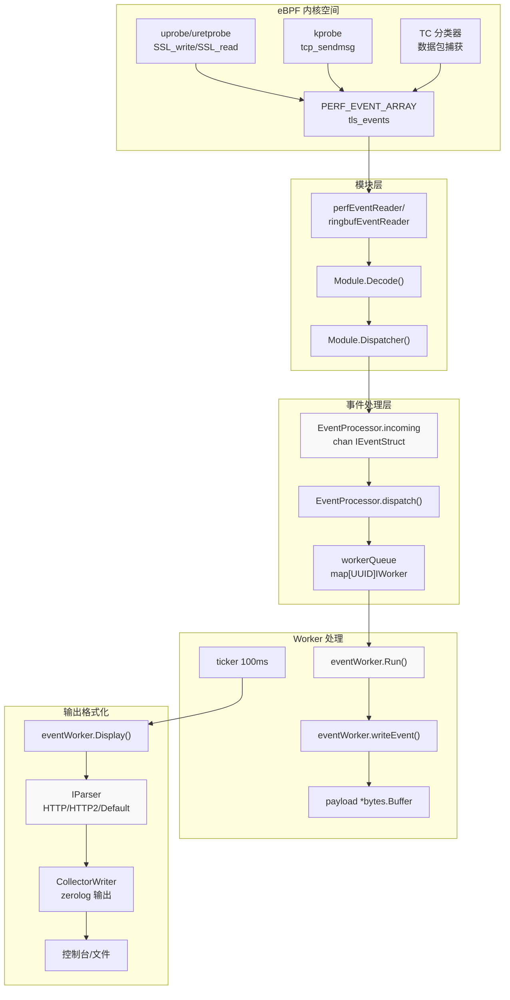
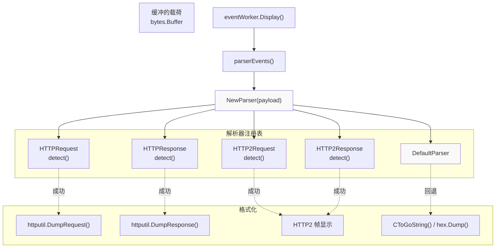
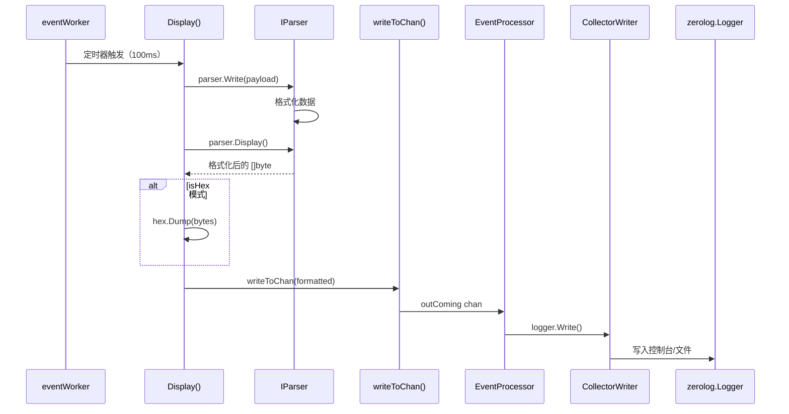
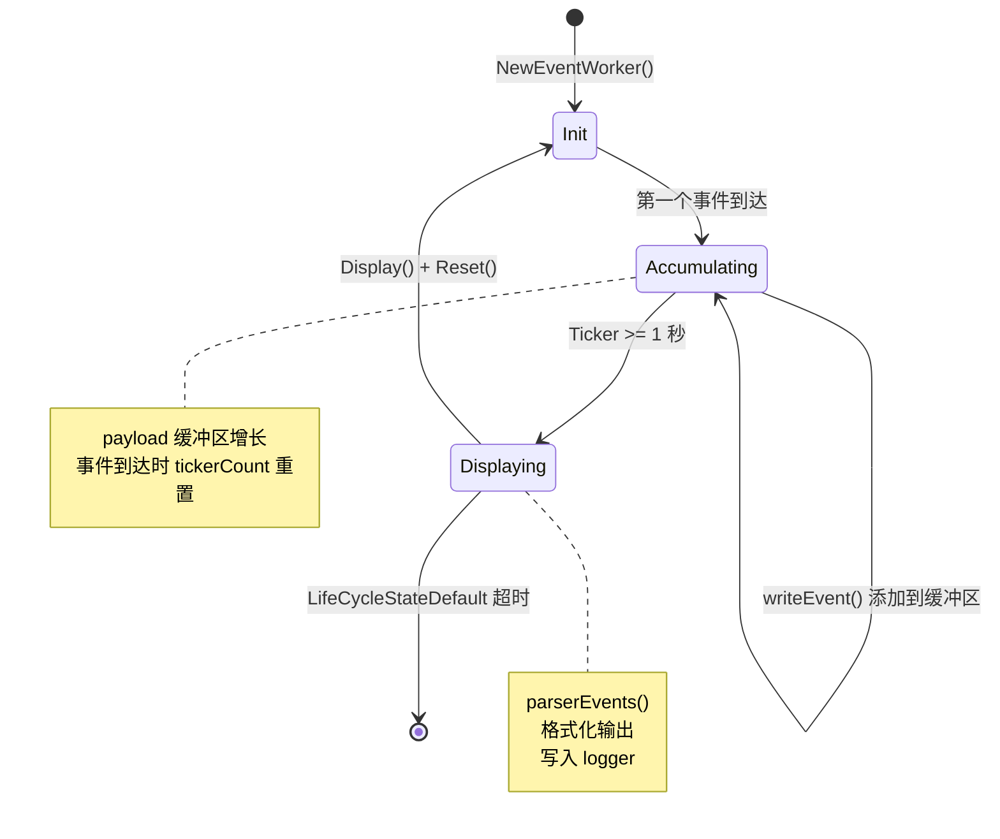

# 文本输出模式

文本输出模式是 eCapture 的默认捕获模式，它将捕获的明文数据以人类可读的格式直接显示到控制台或日志文件中。与将数据包保存供 Wireshark 使用的 pcap 模式([4.2](4.2-pcap-integration.md))或仅捕获 TLS 密钥的 keylog 模式([4.3](4.3-tls-key-logging.md))不同，文本模式以最少的配置提供对解密通信内容的实时可见性。

关于使用 protobuf 格式的远程/GUI 集成，请参阅 [Protobuf 与外部集成](4.4-protobuf-and-external-integration.md)。关于通用事件处理架构，请参阅[事件处理流程](../2-architecture/2.2-event-processing-pipeline.md)。

---

## 概述

文本模式作为流式输出机制运行，具有以下特点：
- **默认行为**：当未指定 `-m` 标志或显式设置为 `-m text` 时激活
- **实时显示**：事件在发生时立即被处理和显示
- **协议感知格式化**：自动检测并格式化 HTTP/1.x、HTTP/2 和其他协议
- **灵活输出**：支持控制台输出和文件日志记录
- **元数据增强**：每个事件包含进程上下文（PID、命令名、网络元组）

从 v0.7.0 版本开始，文本模式不再捕获 TLS 主密钥；请使用 keylog 模式([4.3](4.3-tls-key-logging.md))进行密钥提取。

**来源：** [README.md:249-253](https://github.com/gojue/ecapture/blob/ca085d05/README.md#L249-L253), [CHANGELOG.md:697-723](https://github.com/gojue/ecapture/blob/ca085d05/CHANGELOG.md#L697-L723)

---

## 配置

### 命令行标志

文本模式通过传递给捕获模块（tls、gotls、gnutls 等）的多个标志进行控制：

| 标志 | 类型 | 默认值 | 描述 |
|------|------|---------|-------------|
| `-m text` | string | (默认) | 显式设置文本输出模式 |
| `--hex` | boolean | false | 以十六进制转储格式输出载荷 |
| `--logaddr` | string | "" | 日志转发的网络地址 |
| `-w` / `--output` | string | "" | 将输出写入指定文件而非标准输出 |
| `--truncate` | uint64 | 0 | 将事件载荷截断到指定大小（字节） |

### Logger 配置

文本输出系统使用两种写入器实现：

1. **CollectorWriter**：使用 `zerolog` 进行结构化控制台/文件日志记录（文本模式的默认选项）
2. **ProtobufWriter**：将事件编组为 protobuf 格式以供 WebSocket 传输

**来源：** [pkg/event_processor/processor.go:42-49](https://github.com/gojue/ecapture/blob/ca085d05/pkg/event_processor/processor.go#L42-L49), [user/event/ievent.go:54-70](https://github.com/gojue/ecapture/blob/ca085d05/user/event/ievent.go#L54-L70)

---

## 输出格式

### 标准文本格式

每个捕获的事件都以元数据和载荷格式化：

```
UUID:<PID>_<TID>_<Comm>_<FD>_<DataType>_<Tuple>, Name:<ParserType>, Type:<TypeID>, Length:<Bytes>
PID:<PID>, Comm:<CommandName>, Src:<SrcIP>:<SrcPort>, Dest:<DstIP>:<DstPort>,
<Formatted Payload>
```

**OpenSSL 捕获的输出示例：**

```
2024-09-15T11:50:31Z ??? UUID:233479_233479_curl_5_1_39.156.66.10:443, Name:HTTPRequest, Type:1, Length:73
GET / HTTP/1.1
Host: baidu.com
Accept: */*
User-Agent: curl/7.81.0
```

### 十六进制模式

当启用 `--hex` 标志时，载荷以十六进制转储格式显示，而非格式化文本：

```go
// 十六进制转储格式（示例）
00000000  47 45 54 20 2f 20 48 54  54 50 2f 31 2e 31 0d 0a  |GET / HTTP/1.1..|
00000010  48 6f 73 74 3a 20 62 61  69 64 75 2e 63 6f 6d 0d  |Host: baidu.com.|
```

**来源：** [pkg/event_processor/iworker.go:192-194](https://github.com/gojue/ecapture/blob/ca085d05/pkg/event_processor/iworker.go#L192-L194), [README_CN.md:103-126](https://github.com/gojue/ecapture/blob/ca085d05/README_CN.md#L103-L126)

---

## 事件流架构

### 数据管道


```mermaid
graph TB
    subgraph "eBPF 内核空间"
        UPROBE["uprobe/uretprobe<br/>SSL_write/SSL_read"]
        KPROBE["kprobe<br/>tcp_sendmsg"]
        TC["TC 分类器<br/>数据包捕获"]
        PERFMAP["PERF_EVENT_ARRAY<br/>tls_events"]
    end
    
    subgraph "模块层"
        READER["perfEventReader/<br/>ringbufEventReader"]
        DECODE["Module.Decode()"]
        DISPATCHER["Module.Dispatcher()"]
    end
    
    subgraph "事件处理层"
        EVTPROC["EventProcessor.incoming<br/>chan IEventStruct"]
        DISPATCH2["EventProcessor.dispatch()"]
        WORKERQ["workerQueue<br/>map[UUID]IWorker"]
    end
    
    subgraph "Worker 处理"
        WORKER["eventWorker.Run()"]
        WRITEEVENT["eventWorker.writeEvent()"]
        PAYLOAD["payload *bytes.Buffer"]
        TICKER["ticker 100ms"]
    end
    
    subgraph "输出格式化"
        DISPLAY["eventWorker.Display()"]
        PARSER["IParser<br/>HTTP/HTTP2/Default"]
        LOGGER["CollectorWriter<br/>zerolog 输出"]
        STDOUT["控制台/文件"]
    end
    
    UPROBE --> PERFMAP
    KPROBE --> PERFMAP
    TC --> PERFMAP
    
    PERFMAP --> READER
    READER --> DECODE
    DECODE --> DISPATCHER
    
    DISPATCHER --> EVTPROC
    EVTPROC --> DISPATCH2
    DISPATCH2 --> WORKERQ
    WORKERQ --> WORKER
    
    WORKER --> WRITEEVENT
    WRITEEVENT --> PAYLOAD
    TICKER --> DISPLAY
    
    DISPLAY --> PARSER
    PARSER --> LOGGER
    LOGGER --> STDOUT
    
    style EVTPROC fill:#f9f9f9
    style WORKER fill:#f9f9f9
    style PARSER fill:#f9f9f9
```

**流程描述：**

1. **eBPF 事件**：通过 uprobe/kprobe 捕获并通过 `PERF_EVENT_ARRAY` 映射发送
2. **模块解码**：模块特定的解码器（例如 OpenSSL、GoTLS）将原始 eBPF 事件解析为 `IEventStruct`
3. **事件分发**：`EventProcessor` 接收事件并将其路由到特定于 UUID 的 worker
4. **Worker 累积**：每个 `eventWorker` 在 `payload` 中缓冲事件，直到触发显示
5. **显示触发**：当没有新数据到达时，100ms 定时器触发
6. **解析器选择**：系统检测协议（HTTP/HTTP2/Default）并应用适当的格式化器
7. **输出**：格式化数据通过 `CollectorWriter` 写入控制台或文件

**来源：** [pkg/event_processor/processor.go:65-89](https://github.com/gojue/ecapture/blob/ca085d05/pkg/event_processor/processor.go#L65-L89), [pkg/event_processor/iworker.go:262-306](https://github.com/gojue/ecapture/blob/ca085d05/pkg/event_processor/iworker.go#L262-L306)

---

## 解析器选择与格式化

### 解析器检测流程


```mermaid
graph TB
    PAYLOAD["缓冲的载荷<br/>bytes.Buffer"]
    DISPLAY["eventWorker.Display()"]
    PARSEREVENTS["parserEvents()"]
    NEWPARSER["NewParser(payload)"]
    
    subgraph "解析器注册表"
        HTTP_REQ["HTTPRequest<br/>detect()"]
        HTTP_RESP["HTTPResponse<br/>detect()"]
        HTTP2_REQ["HTTP2Request<br/>detect()"]
        HTTP2_RESP["HTTP2Response<br/>detect()"]
        DEFAULT["DefaultParser"]
    end
    
    subgraph "格式化"
        HTTP_REQ_FMT["httputil.DumpRequest()"]
        HTTP_RESP_FMT["httputil.DumpResponse()"]
        HTTP2_FMT["HTTP2 帧显示"]
        DEFAULT_FMT["CToGoString() / hex.Dump()"]
    end
    
    DISPLAY --> PARSEREVENTS
    PARSEREVENTS --> NEWPARSER
    
    NEWPARSER --> HTTP_REQ
    NEWPARSER --> HTTP_RESP
    NEWPARSER --> HTTP2_REQ
    NEWPARSER --> HTTP2_RESP
    NEWPARSER --> DEFAULT
    
    HTTP_REQ -.成功.-> HTTP_REQ_FMT
    HTTP_RESP -.成功.-> HTTP_RESP_FMT
    HTTP2_REQ -.成功.-> HTTP2_FMT
    HTTP2_RESP -.成功.-> HTTP2_FMT
    DEFAULT -.回退.-> DEFAULT_FMT
    
    style NEWPARSER fill:#f9f9f9
    style DEFAULT fill:#f9f9f9
```

### 解析器类型

| 解析器 | 检测方法 | 输出格式 | ParserType ID |
|--------|-----------------|---------------|---------------|
| `HTTPRequest` | `http.ReadRequest()` 成功 | HTTP 请求头 + 正文 | 1 |
| `HTTPResponse` | `http.ReadResponse()` 成功 | HTTP 响应头 + 正文 | 3 |
| `HTTP2Request` | HTTP/2 帧前言检测 | 逐帧显示 HTTP/2 帧 | 2 |
| `HTTP2Response` | HTTP/2 帧检测 | 逐帧显示 HTTP/2 帧 | 4 |
| `DefaultParser` | 所有检测都失败时回退 | 原始文本或十六进制转储 | 0 |

**来源：** [pkg/event_processor/iparser.go:85-115](https://github.com/gojue/ecapture/blob/ca085d05/pkg/event_processor/iparser.go#L85-L115), [pkg/event_processor/http_request.go:83-92](https://github.com/gojue/ecapture/blob/ca085d05/pkg/event_processor/http_request.go#L83-L92), [pkg/event_processor/http_response.go:94-102](https://github.com/gojue/ecapture/blob/ca085d05/pkg/event_processor/http_response.go#L94-L102)

---

## CollectorWriter 实现

### 文本输出路径


```mermaid
sequenceDiagram
    participant Worker as eventWorker
    participant Display as Display()
    participant Parser as IParser
    participant Writer as writeToChan()
    participant Processor as EventProcessor
    participant Logger as CollectorWriter
    participant Zerolog as zerolog.Logger
    
    Worker->>Display: 定时器触发（100ms）
    Display->>Parser: parser.Write(payload)
    Parser->>Parser: 格式化数据
    Display->>Parser: parser.Display()
    Parser-->>Display: 格式化后的 []byte
    
    alt isHex 模式
        Display->>Display: hex.Dump(bytes)
    end
    
    Display->>Writer: writeToChan(formatted)
    Writer->>Processor: outComing chan
    Processor->>Logger: logger.Write()
    Logger->>Zerolog: 写入控制台/文件
```

`CollectorWriter` 封装了 `zerolog.Logger` 实例并实现了标准的 `io.Writer` 接口，实现与事件处理管道的无缝集成：

```go
// CollectorWriter 结构体（概念性）
type CollectorWriter struct {
    logger *zerolog.Logger
}

func (e CollectorWriter) Write(p []byte) (n int, err error) {
    return e.logger.Write(p)
}
```

**输出格式包括：**
- 时间戳（RFC3339 格式）
- 日志级别（INFO/WARN/ERROR）
- 事件 UUID
- 解析器名称
- 格式化载荷

**来源：** [user/event/ievent.go:54-70](https://github.com/gojue/ecapture/blob/ca085d05/user/event/ievent.go#L54-L70), [pkg/event_processor/iworker.go:198-212](https://github.com/gojue/ecapture/blob/ca085d05/pkg/event_processor/iworker.go#L198-L212)

---

## Worker 生命周期与显示触发器

### 事件 Worker 状态机


```mermaid
stateDiagram-v2
    [*] --> Init: NewEventWorker()
    Init --> Accumulating: 第一个事件到达
    Accumulating --> Accumulating: writeEvent() 添加到缓冲区
    Accumulating --> Displaying: Ticker >= 1 秒
    Displaying --> Init: Display() + Reset()
    Displaying --> [*]: LifeCycleStateDefault 超时
    
    note right of Accumulating
        payload 缓冲区增长
        事件到达时 tickerCount 重置
    end note
    
    note right of Displaying
        parserEvents()
        格式化输出
        写入 logger
    end note
```

### 显示触发逻辑

`eventWorker` 使用 100ms 定时器检测空闲期：

| 条件 | 动作 |
|-----------|--------|
| `tickerCount > 10`（1 秒） | 触发 `Display()` |
| `Display()` 之后 | 重置载荷缓冲区和解析器 |
| `LifeCycleStateDefault` 模式 | 删除 worker 并退出 |
| `LifeCycleStateSock` 模式 | 继续运行，启动新定时器 |

**截断行为：**

如果配置了 `truncateSize` 且 `payload.Len() >= truncateSize`，worker 将：
1. 将载荷截断到指定大小：`payload.Truncate(tsize)`
2. 记录截断消息
3. 停止为该 UUID 接受新事件

**来源：** [pkg/event_processor/iworker.go:262-306](https://github.com/gojue/ecapture/blob/ca085d05/pkg/event_processor/iworker.go#L262-L306), [pkg/event_processor/iworker.go:236-245](https://github.com/gojue/ecapture/blob/ca085d05/pkg/event_processor/iworker.go#L236-L245)

---

## 配置示例

### 基本文本模式（控制台输出）

```bash
# OpenSSL 模块，文本模式，控制台输出
sudo ecapture tls

# GoTLS 模块，文本模式带十六进制转储
sudo ecapture gotls --elfpath=/path/to/go_binary --hex

# 针对特定 PID
sudo ecapture tls --pid=1234
```

### 文件输出

```bash
# 写入文件而非控制台
sudo ecapture tls -w output.log

# 带截断以限制内存使用
sudo ecapture tls -w output.log --truncate=4096
```

### 过滤输出

```bash
# 仅捕获特定进程
sudo ecapture tls --pid=5678 -w tls_capture.log

# 捕获特定用户的流量
sudo ecapture tls --uid=1000
```

**来源：** [README.md:72-149](https://github.com/gojue/ecapture/blob/ca085d05/README.md#L72-L149), [README_CN.md:74-126](https://github.com/gojue/ecapture/blob/ca085d05/README_CN.md#L74-L126)

---

## HTTP/HTTP2 格式化示例

### HTTP/1.x 请求显示

```
2024-09-15T11:50:31Z ??? UUID:233479_233479_curl_5_1_39.156.66.10:443, Name:HTTPRequest, Type:1, Length:73
GET / HTTP/1.1
Host: baidu.com
Accept: */*
User-Agent: curl/7.81.0
```

### HTTP/1.x 响应显示

```
2024-09-15T11:50:32Z ??? UUID:233479_233479_curl_5_0_39.156.66.10:443, Name:HTTPResponse, Type:3, Length:357
HTTP/1.1 302 Moved Temporarily
Content-Length: 161
Connection: keep-alive
Content-Type: text/html
Date: Sun, 15 Sep 2024 11:50:30 GMT
Location: http://www.baidu.com/
Server: bfe/1.0.8.18

<html>
<head><title>302 Found</title></head>
<body bgcolor="white">
<center><h1>302 Found</h1></center>
</body></html>
```

### HTTP/2 请求显示

```
2024-09-15T11:51:53Z ??? UUID:233851_233851_curl_5_1_172.16.71.1:51837, Name:HTTP2Request, Type:2, Length:304

Frame Type	=>	SETTINGS

Frame Type	=>	WINDOW_UPDATE

Frame Type	=>	HEADERS
header field ":method" = "GET"
header field ":path" = "/"
header field ":scheme" = "https"
header field ":authority" = "google.com"
header field "user-agent" = "curl/7.81.0"
header field "accept" = "*/*"
```

**来源：** [README.md:102-148](https://github.com/gojue/ecapture/blob/ca085d05/README.md#L102-L148), [README_CN.md:103-126](https://github.com/gojue/ecapture/blob/ca085d05/README_CN.md#L103-L126)

---

## 协议特定格式化

### HTTP 请求格式化器

`HTTPRequest` 解析器处理 HTTP/1.x 请求：

1. **检测**：在第一个数据块上调用 `http.ReadRequest()`
2. **累积**：缓冲后续数据块直到完成
3. **解压缩**：自动处理 `Content-Encoding: gzip`
4. **输出**：使用 `httputil.DumpRequest()` 进行格式化显示

**关键函数：**
- `HTTPRequest.detect()`：验证 HTTP 请求语法 [pkg/event_processor/http_request.go:83-92](https://github.com/gojue/ecapture/blob/ca085d05/pkg/event_processor/http_request.go#L83-L92)
- `HTTPRequest.Display()`：格式化并解压缩正文 [pkg/event_processor/http_request.go:105-157](https://github.com/gojue/ecapture/blob/ca085d05/pkg/event_processor/http_request.go#L105-L157)

### HTTP 响应格式化器

`HTTPResponse` 解析器处理服务器响应：

1. **检测**：在载荷上调用 `http.ReadResponse()`
2. **正文处理**：使用 `io.ReadAll()` 读取完整响应正文
3. **压缩**：检测并解压缩 gzip 编码的正文
4. **特殊情况**：处理分块传输编码和截断的正文

**关键函数：**
- `HTTPResponse.detect()`：验证响应结构 [pkg/event_processor/http_response.go:94-102](https://github.com/gojue/ecapture/blob/ca085d05/pkg/event_processor/http_response.go#L94-L102)
- `HTTPResponse.Display()`：格式化头和正文 [pkg/event_processor/http_response.go:115-175](https://github.com/gojue/ecapture/blob/ca085d05/pkg/event_processor/http_response.go#L115-L175)

### 默认解析器

当没有专门的解析器匹配时，`DefaultParser` 提供：
- 二进制数据的原始字节输出
- 文本的 C 字符串到 Go 字符串转换
- 不可打印字符的十六进制转储

**检测逻辑** [pkg/event_processor/iparser.go:157-160](https://github.com/gojue/ecapture/blob/ca085d05/pkg/event_processor/iparser.go#L157-L160)：
```go
// 基于第一个字节的显示决策
if b[0] < 32 || b[0] > 126 {
    return []byte(hex.Dump(b))  // 不可打印：十六进制转储
}
return []byte(CToGoString(b))  // 可打印：文本
```

**来源：** [pkg/event_processor/http_request.go:105-157](https://github.com/gojue/ecapture/blob/ca085d05/pkg/event_processor/http_request.go#L105-L157), [pkg/event_processor/http_response.go:115-175](https://github.com/gojue/ecapture/blob/ca085d05/pkg/event_processor/http_response.go#L115-L175), [pkg/event_processor/iparser.go:117-166](https://github.com/gojue/ecapture/blob/ca085d05/pkg/event_processor/iparser.go#L117-L166)

---

## 内存管理与截断

### 截断机制

为防止大载荷导致内存耗尽，文本模式支持截断：

```go
// 写入事件前的截断检查
tsize := int(processor.truncateSize)
if tsize > 0 && payload.Len() >= tsize {
    payload.Truncate(tsize)
    Log(fmt.Sprintf("Events truncated, size: %d bytes\n", tsize))
    return  // 停止接受更多事件
}
```

**配置：**
- 通过 `--truncate=<bytes>` 标志设置
- 默认值：0（不截断）
- 触发时：Worker 停止累积并显示截断的内容

### 内存效率改进

版本 1.1.0 引入了内存优化：
- **重新设计的截断逻辑**，降低文本模式下的内存成本
- **每个 worker 缓冲**而非全局累积
- **早期截断**防止分配过大的载荷

**来源：** [pkg/event_processor/iworker.go:236-245](https://github.com/gojue/ecapture/blob/ca085d05/pkg/event_processor/iworker.go#L236-L245), [CHANGELOG.md:163-164](https://github.com/gojue/ecapture/blob/ca085d05/CHANGELOG.md#L163-L164)

---

## 元数据与上下文增强

### UUID 格式

每个事件包含一个编码连接上下文的 UUID：

**标准格式：**
```
<PID>_<TID>_<Comm>_<FD>_<DataType>_<SrcIP:SrcPort-DstIP:DstPort>
```

**套接字生命周期格式**（用于连接绑定的 worker）：
```
sock:<PID>_<TID>_<Comm>_<FD>_<DataType>_<SrcIP:SrcPort-DstIP:DstPort>_<SocketPtr>
```

UUID 解析器提取：
- `uuidOutput`：显示格式（不含套接字指针）
- `DestroyUUID`：用于生命周期管理的套接字指针
- `ewLifeCycleState`：Worker 生命周期模式

**来源：** [pkg/event_processor/iworker.go:100-123](https://github.com/gojue/ecapture/blob/ca085d05/pkg/event_processor/iworker.go#L100-L123), [user/event/ievent.go:39](https://github.com/gojue/ecapture/blob/ca085d05/user/event/ievent.go#L39)

### 事件基础结构

每个事件包含通用元数据字段：

| 字段 | 类型 | 描述 |
|-------|------|-------------|
| `PID` | uint32 | 进程 ID |
| `PName` | string | 命令名 |
| `SrcIP` | string | 源 IP 地址 |
| `SrcPort` | uint16 | 源端口 |
| `DstIP` | string | 目标 IP 地址 |
| `DstPort` | uint16 | 目标端口 |
| `Timestamp` | uint64 | 内核时间戳（纳秒） |

此元数据显示在格式化输出的头部。

**来源：** [pkg/event_processor/iworker.go:200-212](https://github.com/gojue/ecapture/blob/ca085d05/pkg/event_processor/iworker.go#L200-L212)

---

## 与其他模块的集成

### 模块特定的文本输出

每个捕获模块（OpenSSL、GoTLS、GnuTLS 等）生成通过文本输出管道流动的事件：

| 模块 | 事件类型 | 文本模式支持 |
|--------|-------------|-------------------|
| **OpenSSL** ([3.1.1](../3-capture-modules/3.1.1-openssl-module.md)) | SSLDataEvent | 完整的 HTTP/HTTP2 解析 |
| **GoTLS** ([3.1.3](../3-capture-modules/3.1.3-go-tls-module.md)) | SSLDataEvent | 完整的 HTTP/HTTP2 解析 |
| **GnuTLS** ([3.1.4](../3-capture-modules/3.1.4-gnutls-and-nss-modules.md)) | SSLDataEvent | 完整的 HTTP/HTTP2 解析 |
| **Bash** ([3.2.1](../3-capture-modules/3.2.1-shell-command-auditing.md)) | BashEvent | 命令行文本显示 |
| **MySQL** ([3.2.2](../3-capture-modules/3.2.2-database-query-auditing.md)) | MySQLEvent | SQL 查询文本显示 |
| **Postgres** ([3.2.2](../3-capture-modules/3.2.2-database-query-auditing.md)) | PostgresEvent | SQL 查询文本显示 |

所有模块共享相同的 `EventProcessor` 和输出格式化管道。

**来源：** [README.md:152-161](https://github.com/gojue/ecapture/blob/ca085d05/README.md#L152-L161)

---

## 与其他输出模式的比较

| 特性 | 文本模式 | Pcap 模式 ([4.2](4.2-pcap-integration.md)) | Keylog 模式 ([4.3](4.3-tls-key-logging.md)) |
|---------|-----------|-------------------------|---------------------------|
| **实时显示** | ✓ 控制台/日志输出 | × 缓冲到文件 | × 仅文件 |
| **协议解析** | ✓ HTTP/HTTP2 格式化 | × 原始数据包 | × 仅密钥 |
| **主密钥捕获** | × (自 v0.7.0 起) | ✓ pcapng 中的 DSB 块 | ✓ SSLKEYLOGFILE 格式 |
| **Wireshark 兼容** | × | ✓ 原生支持 | ✓ 通过 keylog 文件 |
| **内存使用** | 低（流式） | 较高（数据包缓冲） | 最小（仅密钥） |
| **使用场景** | 实时监控 | 取证分析 | 离线解密 |

**来源：** [CHANGELOG.md:697-723](https://github.com/gojue/ecapture/blob/ca085d05/CHANGELOG.md#L697-L723)

---

## 错误处理与日志记录

### 事件处理错误

当解析器在格式化期间遇到错误时：

1. **HTTP/HTTP2 解析错误**：记录日志但不停止处理
2. **截断错误**：记录截断大小
3. **写入错误**：记录日志但事件继续流动
4. **EOF 错误**：忽略（不完整流的正常情况）

**错误消息示例：**
```
eventWorker: write events failed, unknow eventWorker status: 2
ew.parser uuid: sock:1234_1234_curl_5_1... type 1 write payload 2048 bytes, error:unexpected EOF
```

### Worker 错误处理

`eventWorker.Run()` 循环优雅地处理错误：
- **输入通道已满**：丢弃事件，记录错误
- **输出通道已满**：记录错误，继续处理
- **解析器错误**：记录日志但不致命，回退到十六进制转储

**来源：** [pkg/event_processor/iworker.go:154-172](https://github.com/gojue/ecapture/blob/ca085d05/pkg/event_processor/iworker.go#L154-L172), [pkg/event_processor/iworker.go:254-257](https://github.com/gojue/ecapture/blob/ca085d05/pkg/event_processor/iworker.go#L254-L257)

---

## 性能考虑

### 吞吐量与延迟

文本模式特性：

- **延迟**：100ms 基线（定时器间隔）+ 解析时间
- **吞吐量**：受控制台/文件 I/O 限制，非 CPU 限制
- **CPU 使用**：HTTP/HTTP2 检测和格式化的解析器开销
- **内存**：可通过 `--truncate` 标志配置

### 优化策略

1. **使用截断**进行高容量捕获以防止内存增长
2. **写入文件**而非控制台以获得更好的吞吐量
3. **按 PID/UID 过滤**以减少事件量
4. **使用十六进制模式**跳过协议解析开销

**来源：** [CHANGELOG.md:163-164](https://github.com/gojue/ecapture/blob/ca085d05/CHANGELOG.md#L163-L164), [pkg/event_processor/iworker.go:236-245](https://github.com/gojue/ecapture/blob/ca085d05/pkg/event_processor/iworker.go#L236-L245)