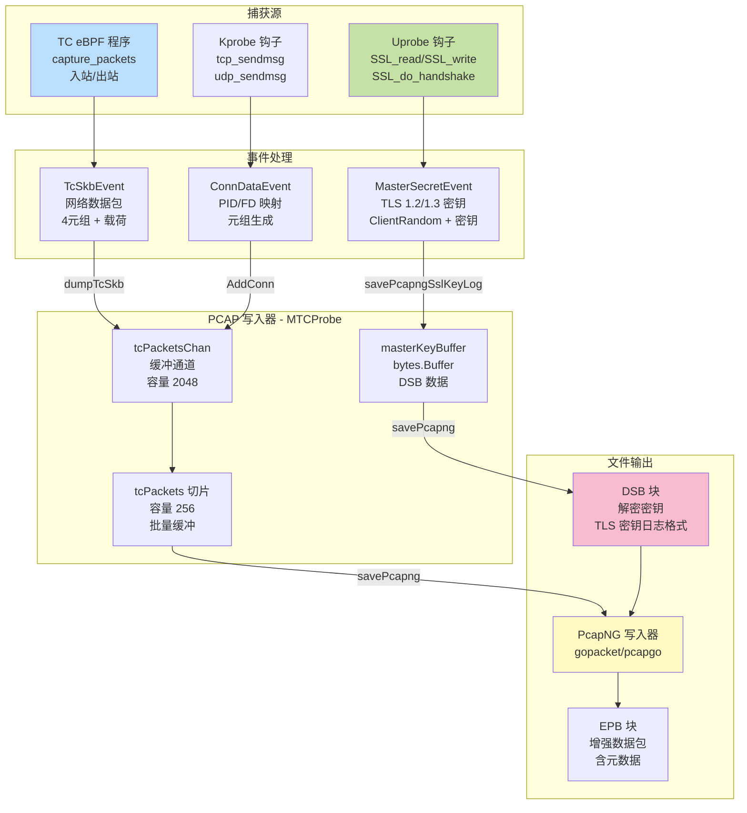
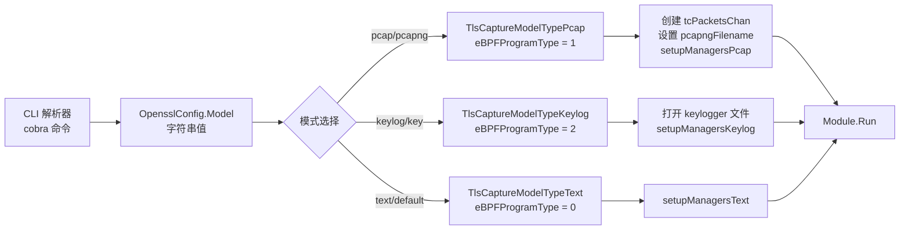
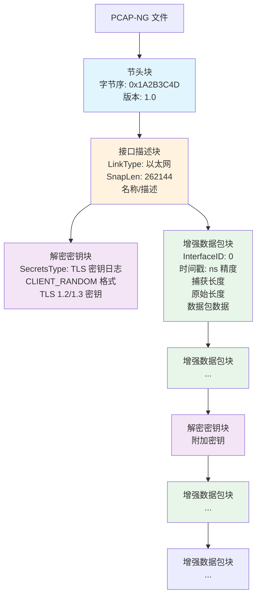
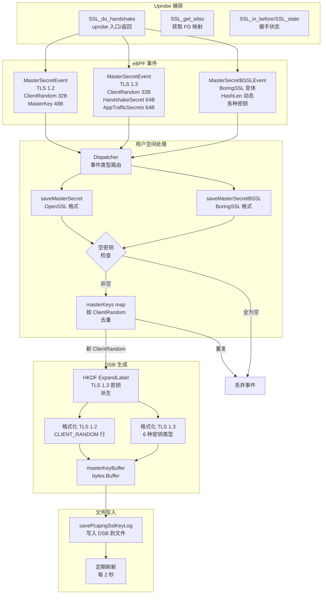
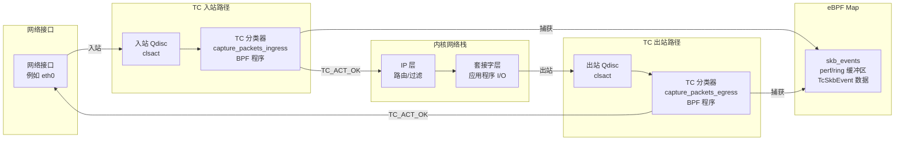
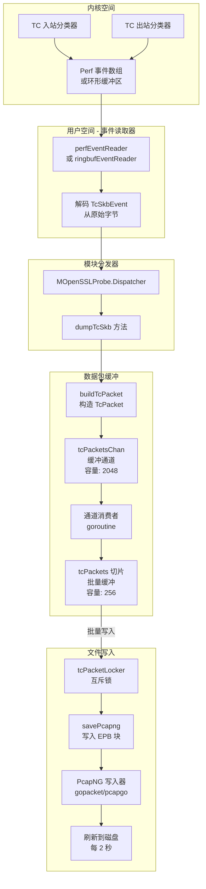
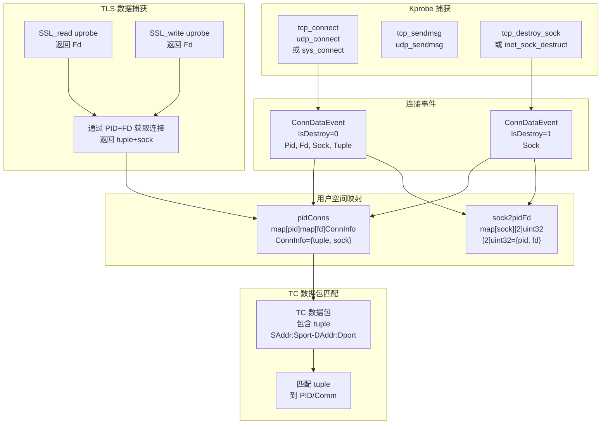
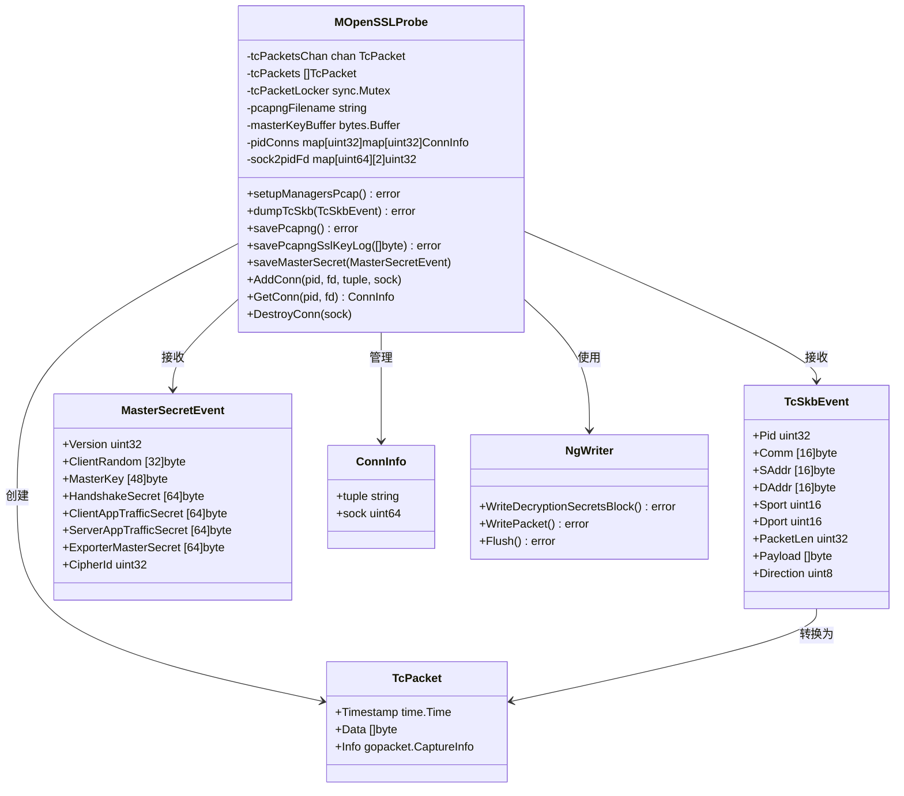

# PCAP 集成

## 目的与范围

本文档描述了 eCapture 的 PCAP-NG 文件生成功能，它能够以与 Wireshark 及其他网络分析工具兼容的格式捕获和存储网络数据包。PCAP 集成可捕获加密的网络流量以及解密它所需的 TLS/SSL 密钥，并将它们一起存储在一个包含解密密钥块（DSB）的 PCAP-NG 文件中。

有关其他输出格式的信息，请参阅 [文本输出模式](4.1-text-output-mode.md) 和 [TLS 密钥日志](4.3-tls-key-logging.md)。有关底层数据包捕获机制的详细信息，请参阅 [网络连接跟踪](../2-architecture/2.6-network-connection-tracking.md)。

---

## 概述

eCapture 的 PCAP 集成在 `pcap` 或 `pcapng` 模式下运行，与文本模式的根本区别在于它捕获完整的网络数据包而不仅仅是明文内容。该模式将三个数据源整合到统一的 PCAP-NG 文件中：

1. **网络数据包**：通过 TC（流量控制）eBPF 分类器在入站/出站方向捕获
2. **TLS 主密钥**：通过 uprobe 钩子在 SSL/TLS 函数上提取
3. **连接元数据**：包括进程信息（PID、UID、命令名）

生成的 PCAP-NG 文件可以在 Wireshark 中打开，并使用嵌入的主密钥自动解密 TLS 流量。

**PCAP 集成架构**



来源：[user/module/probe_openssl.go:137-148](https://github.com/gojue/ecapture/blob/0766a93b/user/module/probe_openssl.go#L137-L148), [user/module/probe_openssl.go:287-296](https://github.com/gojue/ecapture/blob/0766a93b/user/module/probe_openssl.go#L287-L296), [README.md:173-187](https://github.com/gojue/ecapture/blob/0766a93b/README.md#L173-L187)

---

## 激活与配置

### 命令行使用

使用 `-m pcap` 或 `-m pcapng` 参数激活 PCAP 模式，配合 `tls` 或 `gotls` 模块。必需的参数包括：

| 参数 | 描述 | 默认值 |
|------|------|--------|
| `-m pcap` 或 `-m pcapng` | 激活 PCAP 模式 | 无（必需） |
| `--pcapfile` | 输出文件路径 | `ecapture_openssl.pcapng` |
| `-i` | 要捕获的网络接口 | 无（必需） |
| PCAP 过滤表达式 | 可选的 BPF 过滤器 | 无 |

命令示例：
```bash
sudo ecapture tls -m pcap -i eth0 --pcapfile=capture.pcapng tcp port 443
```

**模式选择实现**



来源：[user/module/probe_openssl.go:127-154](https://github.com/gojue/ecapture/blob/0766a93b/user/module/probe_openssl.go#L127-L154), [user/config/iconfig.go:73-79](https://github.com/gojue/ecapture/blob/0766a93b/user/config/iconfig.go#L73-L79), [cli/cmd/root.go:249-296](https://github.com/gojue/ecapture/blob/0766a93b/cli/cmd/root.go#L249-L296)

### 配置结构

PCAP 模式通过 `OpensslConfig` 进行配置：

```
OpensslConfig.Model = "pcap" 或 "pcapng"
OpensslConfig.PcapFile = 输出文件路径
OpensslConfig.Ifname = 网络接口名称
OpensslConfig.PcapFilter = 可选的 BPF 过滤表达式
```

此配置会触发以下组件的初始化：
- `tcPacketsChan`：缓冲通道（容量 2048）用于数据包排队
- `tcPackets`：切片缓冲区（容量 256）用于批量写入
- `pcapngFilename`：输出文件的绝对路径

来源：[user/module/probe_openssl.go:137-148](https://github.com/gojue/ecapture/blob/0766a93b/user/module/probe_openssl.go#L137-L148)

---

## PCAP-NG 文件格式

### 文件结构

eCapture 生成 PCAP-NG（下一代）文件，它在经典 PCAP 格式基础上扩展了更丰富的元数据。文件结构由以下部分组成：

1. **节头块（SHB）**：文件标识和字节序
2. **接口描述块（IDB）**：网络接口元数据
3. **解密密钥块（DSB）**：TLS 主密钥用于解密
4. **增强数据包块（EPB）**：带时间戳的单个数据包数据

**PCAP-NG 块结构**



来源：[user/module/probe_openssl.go:558-565](https://github.com/gojue/ecapture/blob/0766a93b/user/module/probe_openssl.go#L558-L565), [user/module/probe_openssl.go:625-632](https://github.com/gojue/ecapture/blob/0766a93b/user/module/probe_openssl.go#L625-L632)

### 增强数据包块（EPB）内容

每个捕获的数据包存储为一个 EPB，包含：

- **接口 ID**：链接到 IDB（通常为 0）
- **时间戳**：纳秒精度（启动时间 + 单调时钟）
- **捕获的数据包长度**：实际捕获的字节数
- **原始数据包长度**：线路长度（如果截断可能超过捕获长度）
- **数据包数据**：原始以太网帧，包括：
  - 以太网头（14 字节）
  - IP 头（IPv4 或 IPv6）
  - 传输层头（TCP/UDP）
  - 应用层载荷（加密或解密）

数据包数据来自 TC eBPF 程序，它们在入站/出站点捕获完整的网络帧。

来源：[user/module/probe_openssl.go:747-750](https://github.com/gojue/ecapture/blob/0766a93b/user/module/probe_openssl.go#L747-L750)

---

## 解密密钥块（DSB）

### 目的与格式

DSB 是 PCAP-NG 块类型，用于存储 TLS 解密密钥，使 Wireshark 能够自动解密捕获的 TLS 流量。eCapture 嵌入包含主密钥的 DSB 块，采用浏览器和其他 TLS 工具使用的 SSLKEYLOGFILE 格式。

### DSB 数据格式

DSB 块包含标准密钥日志格式的 TLS 密钥：

```
CLIENT_RANDOM <client_random_hex> <master_secret_hex>
CLIENT_HANDSHAKE_TRAFFIC_SECRET <client_random_hex> <secret_hex>
SERVER_HANDSHAKE_TRAFFIC_SECRET <client_random_hex> <secret_hex>
CLIENT_TRAFFIC_SECRET_0 <client_random_hex> <secret_hex>
SERVER_TRAFFIC_SECRET_0 <client_random_hex> <secret_hex>
EXPORTER_SECRET <client_random_hex> <secret_hex>
```

对于 TLS 1.2，仅写入 `CLIENT_RANDOM`。对于 TLS 1.3，会派生并写入多个流量密钥。

**主密钥提取与 DSB 写入**



来源：[user/module/probe_openssl.go:482-575](https://github.com/gojue/ecapture/blob/0766a93b/user/module/probe_openssl.go#L482-L575), [user/module/probe_openssl.go:577-642](https://github.com/gojue/ecapture/blob/0766a93b/user/module/probe_openssl.go#L577-L642)

### 实现细节

#### TLS 1.2 主密钥

对于 TLS 1.2，主密钥直接从 SSL 结构中捕获：

1. 在 `SSL_do_handshake` 上使用 uprobe 捕获 SSL 上下文
2. 导航到 `s3->tmp.new_cipher` 以获取密码套件
3. 读取 `session->master_key`（48 字节）
4. 读取 `session->client_random`（32 字节）
5. 格式：`CLIENT_RANDOM <32 十六进制字节> <48 十六进制字节>`

#### TLS 1.3 流量密钥

对于 TLS 1.3，提取并派生多个密钥：

1. 从 SSL 结构捕获 `handshake_secret`、`handshake_traffic_hash`
2. 使用 HKDF 派生：
   - `client_handshake_traffic_secret` = HKDF-Expand-Label(handshake_secret, "c hs traffic", handshake_traffic_hash, hash_len)
   - `server_handshake_traffic_secret` = HKDF-Expand-Label(handshake_secret, "s hs traffic", handshake_traffic_hash, hash_len)
3. 直接捕获 `client_app_traffic_secret`、`server_app_traffic_secret`、`exporter_master_secret`
4. 将所有六种密钥类型写入 DSB

HKDF 扩展在用户空间执行，使用捕获的哈希算法（根据密码套件使用 SHA256 或 SHA384）。

来源：[user/module/probe_openssl.go:502-551](https://github.com/gojue/ecapture/blob/0766a93b/user/module/probe_openssl.go#L502-L551), [pkg/util/hkdf/hkdf.go](https://github.com/gojue/ecapture/blob/0766a93b/pkg/util/hkdf/hkdf.go)

#### 空密钥检测

eCapture 在写入 DSB 之前会验证捕获的密钥不是空值（全为零）。这可以防止密钥日志损坏：

- 对于 TLS 1.2：检查 `master_key` 的全部 48 字节是否为零
- 对于 TLS 1.3：检查所有流量密钥是否为零（5 个不同的密钥）
- 如果所有密钥都为空，则丢弃该事件

来源：[user/module/probe_openssl.go:644-731](https://github.com/gojue/ecapture/blob/0766a93b/user/module/probe_openssl.go#L644-L731)

#### 去重

主密钥使用 `map[string]bool` 去重，键为十六进制编码的 `ClientRandom`：

```
ClientRandom（32 字节）-> 十六进制字符串（64 字符）-> map 键
```

如果 `ClientRandom` 已存在于 map 中，则不写入重复的密钥。这可以防止同一 TLS 会话写入多个相同的 DSB 块。

来源：[user/module/probe_openssl.go:483-489](https://github.com/gojue/ecapture/blob/0766a93b/user/module/probe_openssl.go#L483-L489), [user/module/probe_openssl.go:578-584](https://github.com/gojue/ecapture/blob/0766a93b/user/module/probe_openssl.go#L578-L584)

---

## TC 数据包捕获集成

### 流量控制（TC）eBPF 程序

PCAP 模式依赖于附加到网络接口的 TC eBPF 分类器来捕获数据包。与在应用层捕获明文的 uprobe 不同，TC 程序捕获包括加密载荷在内的完整网络数据包。

**TC 分类器附加点**



来源：[user/module/probe_openssl.go:303-307](https://github.com/gojue/ecapture/blob/0766a93b/user/module/probe_openssl.go#L303-L307)

### TcSkbEvent 结构

每个捕获的数据包生成一个 `TcSkbEvent`，包含：

| 字段 | 类型 | 描述 |
|------|------|------|
| `Pid` | uint32 | 发送/接收数据包的进程 ID |
| `Tid` | uint32 | 线程 ID |
| `Uid` | uint32 | 用户 ID |
| `Gid` | uint32 | 组 ID |
| `Comm` | [16]byte | 命令名（进程） |
| `SAddr` | [16]byte | 源 IP 地址（IPv4/IPv6） |
| `DAddr` | [16]byte | 目标 IP 地址 |
| `Sport` | uint16 | 源端口 |
| `Dport` | uint16 | 目标端口 |
| `PacketLen` | uint32 | 总数据包长度 |
| `Payload` | []byte | 数据包数据（以太网帧） |
| `Direction` | uint8 | 0=出站，1=入站 |

捕获完整的以太网帧，包括头部和加密载荷。

来源：[user/event/event_tc.go](https://github.com/gojue/ecapture/blob/0766a93b/user/event/event_tc.go)

### BPF 过滤器集成

当提供 PCAP 过滤表达式（例如 `tcp port 443`）时，它会在加载时被编译为 eBPF 指令并修补到 TC 分类器程序中：

1. 使用 libpcap 语法解析过滤表达式
2. 编译为经典 BPF 指令
3. 转换为 eBPF 指令
4. 使用 `InstructionPatchers` 修补到 TC 程序中

这种过滤在内核空间发生，减少了发送到用户空间的事件量。

来源：[user/module/probe_openssl.go:303-307](https://github.com/gojue/ecapture/blob/0766a93b/user/module/probe_openssl.go#L303-L307)

---

## 数据包处理流程

### 从 TC 到文件的事件流

**数据包捕获流程**



来源：[user/module/probe_openssl.go:747-750](https://github.com/gojue/ecapture/blob/0766a93b/user/module/probe_openssl.go#L747-L750), [user/module/probe_tc.go](https://github.com/gojue/ecapture/blob/0766a93b/user/module/probe_tc.go)

### TcPacket 构造

`dumpTcSkb` 方法将 `TcSkbEvent` 转换为 `TcPacket` 结构：

1. **时间戳转换**：将内核单调时间转换为墙上时钟时间
   - `timestamp_ns = boot_time + skb_event.timestamp_ns`
2. **数据包数据提取**：从事件载荷复制以太网帧
3. **元数据附加**：包含 PID、命令、元组信息
4. **入队**：发送到 `tcPacketsChan` 进行缓冲处理

`TcPacket` 结构包含：
- 时间戳（纳秒精度）
- 数据包数据（以太网帧字节）
- 连接信息（用于与 uprobe 关联）

来源：[user/module/probe_tc.go](https://github.com/gojue/ecapture/blob/0766a93b/user/module/probe_tc.go)

### 批量写入

数据包以批量方式写入 PCAP-NG 文件以提高性能：

1. 消费者 goroutine 从 `tcPacketsChan` 读取
2. 在 `tcPackets` 切片中累积数据包（最多 256 个）
3. 当切片满或超时时，调用 `savePcapng`
4. `savePcapng` 获取锁并将所有数据包写入为 EPB 块
5. 每 2 秒将写入器刷新到磁盘

这种批量处理减少了系统调用开销并提高了吞吐量。

来源：[user/module/probe_tc.go](https://github.com/gojue/ecapture/blob/0766a93b/user/module/probe_tc.go)

---

## 文件写入器实现

### PcapNG 写入器初始化

eCapture 使用 `gopacket/pcapgo` 库生成 PCAP-NG 文件：

```
Writer: *pcapgo.NgWriter
File: *os.File 使用 O_CREATE | O_WRONLY | O_TRUNC 打开
Interface: pcapgo.NgInterface 包含 LinkType、SnapLen、Name、Description
```

初始化序列：
1. 创建/截断输出文件
2. 使用文件句柄创建 `NgWriter`
3. 写入节头块（SHB）
4. 写入接口描述块（IDB）
5. 设置定期刷新定时器（2 秒）

来源：[user/module/probe_tc.go](https://github.com/gojue/ecapture/blob/0766a93b/user/module/probe_tc.go)

### DSB 写入

通过 `savePcapngSslKeyLog` 写入解密密钥：

1. 在 `masterKeyBuffer` 中将主密钥格式化为 TLS 密钥日志行
2. 调用 `NgWriter.WriteDecryptionSecretsBlock`：
   - SecretsType: `pcapgo.DSB_SECRETS_TYPE_TLS`（0x544c534b）
   - SecretsData: 密钥日志格式化字节
3. 清空 `masterKeyBuffer` 用于下一批

DSB 块可以出现在文件的任何位置，与 EPB 块交错。Wireshark 处理所有 DSB 块来构建其解密密钥表。

来源：[user/module/probe_openssl.go:558-565](https://github.com/gojue/ecapture/blob/0766a93b/user/module/probe_openssl.go#L558-L565)

### EPB 写入

每个数据包写入为增强数据包块：

```
CaptureInfo: gopacket.CaptureInfo {
    Timestamp: time.Unix(0, timestamp_ns)
    CaptureLength: len(packet_data)
    Length: len(packet_data)
    InterfaceIndex: 0
}
```

`NgWriter.WritePacket` 方法处理 EPB 块格式化，包括：
- 块类型和长度字段
- 接口 ID
- 时间戳（高/低 32 位拆分）
- 捕获长度和原始长度
- 数据包数据
- 填充到 32 位边界
- 块总长度尾部

来源：[user/module/probe_tc.go](https://github.com/gojue/ecapture/blob/0766a93b/user/module/probe_tc.go)

### 定期刷新

为了确保即使在数据包不频繁时数据也能写入磁盘：

1. 启动定时器 goroutine，间隔 2 秒
2. 每次触发时，获取锁并刷新写入器
3. 记录数据包计数统计
4. 继续直到上下文取消

这可以防止程序终止时数据丢失。

来源：[user/module/probe_tc.go](https://github.com/gojue/ecapture/blob/0766a93b/user/module/probe_tc.go)

---

## 进程与连接关联

### PID/FD 到套接字映射

为了将网络数据包（在 TC 层捕获）与 TLS 明文（在 SSL 层捕获）关联，eCapture 维护双向映射：

**连接跟踪架构**



来源：[user/module/probe_openssl.go:398-480](https://github.com/gojue/ecapture/blob/0766a93b/user/module/probe_openssl.go#L398-L480)

### 连接生命周期

1. **创建**：当连接建立时（通过 kprobe 在 `tcp_connect` 或 `sys_connect` 上检测）：
   - 生成 4 元组：`SrcIP:SrcPort-DstIP:DstPort`
   - 映射 PID+FD -> {tuple, sock}
   - 映射 sock -> {PID, FD}

2. **使用**：当捕获 SSL 数据时（通过 uprobe 在 `SSL_read`/`SSL_write` 上）：
   - 通过 PID+FD 查找 tuple 和 sock
   - 将 tuple 附加到 `SSLDataEvent`
   - 事件处理器使用 tuple 与 TC 数据包关联

3. **销毁**：当套接字关闭时（通过 kprobe 在 `tcp_destroy_sock` 上检测）：
   - 移除 PID+FD -> ConnInfo 映射
   - 移除 sock -> PID+FD 映射
   - 延迟删除（3 秒）以允许飞行中的事件完成

这种关联使 Wireshark 能够显示：
- 哪个进程生成了每个数据包
- 进程所属的用户
- 进程的命令名

来源：[user/module/probe_openssl.go:398-462](https://github.com/gojue/ecapture/blob/0766a93b/user/module/probe_openssl.go#L398-L462)

---

## Wireshark 集成

### 打开 PCAP-NG 文件

在 Wireshark 中查看捕获的流量：

1. **直接打开**：`wireshark ecapture.pcapng`
   - TLS 流量使用嵌入的 DSB 块自动解密
   - 无需额外配置

2. **手动密钥日志**：如果未嵌入 DSB，使用 `编辑 -> 首选项 -> 协议 -> TLS -> (Pre)-Master-Secret 日志文件名`

3. **实时捕获**：当 eCapture 运行时，Wireshark 可以打开文件进行实时查看（文件每 2 秒刷新一次）

### 显示过滤器

用于 eCapture PCAP-NG 文件的有用 Wireshark 过滤器：

| 过滤器 | 目的 |
|--------|------|
| `http` | HTTP/1.x 解密的请求/响应 |
| `http2` | HTTP/2 解密的帧 |
| `http3` | HTTP/3 QUIC 解密的流 |
| `tls.handshake.type == 1` | TLS ClientHello 消息 |
| `frame.comment` | 带注释的数据包（PID/Comm） |

来源：[README.md:189-230](https://github.com/gojue/ecapture/blob/0766a93b/README.md#L189-L230)

### 协议层次结构

PCAP-NG 文件包含完整的协议栈：

```
以太网 II
  └─ IPv4 或 IPv6
      └─ TCP 或 UDP
          └─ TLS 1.2/1.3
              └─ HTTP/1.1、HTTP/2 或 HTTP/3（QUIC）
```

当存在 DSB 块时，Wireshark 会自动解析所有层并显示解密的应用数据。

---

## 性能考虑

### 缓冲区大小

| 缓冲区 | 大小 | 目的 |
|--------|------|------|
| `tcPacketsChan` | 2048 个数据包 | 异步生产者/消费者缓冲 |
| `tcPackets` 切片 | 256 个数据包 | 批量写入以减少系统调用 |
| 每 CPU map | 可配置（默认 1024 * PAGE_SIZE） | eBPF 事件缓冲区大小 |

更大的缓冲区在高流量下减少数据包丢失，但会增加内存使用。

来源：[user/module/probe_openssl.go:137-148](https://github.com/gojue/ecapture/blob/0766a93b/user/module/probe_openssl.go#L137-L148), [cli/cmd/root.go:143](https://github.com/gojue/ecapture/blob/0766a93b/cli/cmd/root.go#L143)

### 数据包丢失场景

1. **eBPF map 溢出**：如果每 CPU map 填满，事件在内核中被丢弃
2. **通道溢出**：如果 `tcPacketsChan` 填满（2048 个数据包），可能发生阻塞
3. **处理延迟**：如果用户空间无法跟上内核事件速率

系统会记录数据包丢失的警告，包括来自 perf 缓冲区的丢失样本计数。

来源：[user/module/imodule.go:336-338](https://github.com/gojue/ecapture/blob/0766a93b/user/module/imodule.go#L336-L338)

### 优化策略

1. **增加 map 大小**：使用 `--mapsize` 标志为 eBPF map 分配更多内存
2. **积极过滤**：使用 PCAP 过滤表达式减少捕获的数据包量
3. **针对特定进程**：使用 `-p` 标志仅捕获特定 PID
4. **SSD 存储**：将 PCAP-NG 文件写入快速存储（SSD）以减少 I/O 瓶颈

---

## 实现类图

**关键类及其关系**



来源：[user/module/probe_openssl.go:83-106](https://github.com/gojue/ecapture/blob/0766a93b/user/module/probe_openssl.go#L83-L106), [user/event/event_tc.go](https://github.com/gojue/ecapture/blob/0766a93b/user/event/event_tc.go), [user/event/event_ssl.go](https://github.com/gojue/ecapture/blob/0766a93b/user/event/event_ssl.go)

---

## 错误处理

### 常见问题

| 问题 | 原因 | 解决方案 |
|------|------|----------|
| PCAP 文件为空 | 没有数据包匹配过滤器 | 检查接口和过滤表达式 |
| 缺少 DSB 块 | 未捕获 TLS 握手 | 确保在连接前开始捕获 |
| Wireshark 无法解密 | 密码套件/版本错误 | 检查 TLS 版本兼容性 |
| 文件未刷新 | 程序被强制终止 | 等待优雅关闭或使用更长的捕获时间 |

### 日志记录

PCAP 模式日志包括：

- 数据包保存计数（每 2 秒）：`INF packets saved into pcapng file. count=123`
- 主密钥保存：`INF CLIENT_RANDOM save success CLientRandom=... TlsVersion=...`
- DSB 写入失败：`WRN save sslKeylog failed`
- 初始化时的文件路径：`INF packets saved into pcapng file. pcapng path=...`

来源：[README.md:189-230](https://github.com/gojue/ecapture/blob/0766a93b/README.md#L189-L230)

---

## 与其他模式的比较

| 功能 | PCAP 模式 | 文本模式 | Keylog 模式 |
|------|-----------|----------|-------------|
| 输出格式 | PCAP-NG 文件 | 文本日志 | SSLKEYLOGFILE |
| 网络数据包 | 完整捕获 | 不捕获 | 不捕获 |
| 明文内容 | 通过 DSB 解密 | 直接输出 | 不包含 |
| Wireshark 兼容 | 是（原生） | 否 | 是（手动导入） |
| 性能影响 | 最高（完整数据包） | 最低 | 低 |
| 使用场景 | 网络分析 | 快速检查 | tcpdump 集成 |

有关其他模式的详细信息，请参阅 [文本输出模式](4.1-text-output-mode.md) 和 [TLS 密钥日志](4.3-tls-key-logging.md)。

---

## 相关组件

此 PCAP 集成依赖于几个其他 eCapture 子系统：

- **TC 程序**：有关 TC eBPF 分类器的详细信息，请参阅 [网络连接跟踪](../2-architecture/2.6-network-connection-tracking.md)
- **主密钥提取**：有关 TLS 密钥捕获的详细信息，请参阅 [主密钥提取](../3-capture-modules/3.1.4-master-secret-extraction.md)
- **事件处理**：有关事件路由的详细信息，请参阅 [事件处理流程](../2-architecture/2.2-event-processing-pipeline.md)
- **模块系统**：有关 `IModule` 接口的详细信息，请参阅 [模块系统与生命周期](../2-architecture/2.4-module-system-and-lifecycle.md)

PCAP 模式是 TLS 模块支持的三种输出格式之一，每种格式针对不同的使用场景和工作流程进行了优化。