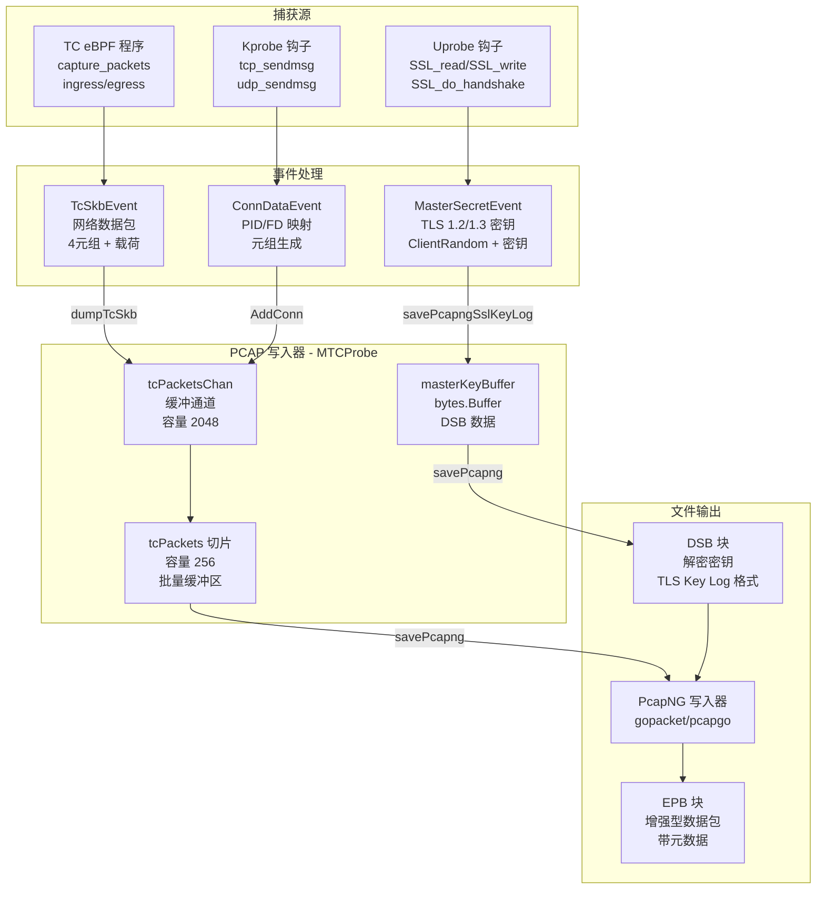
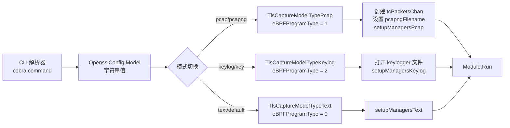
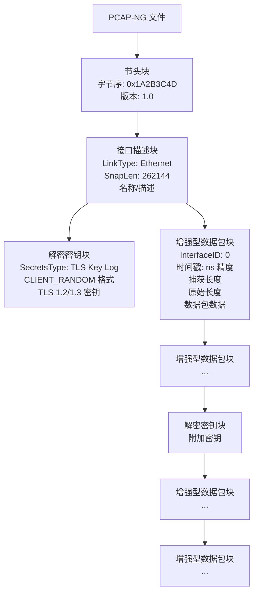
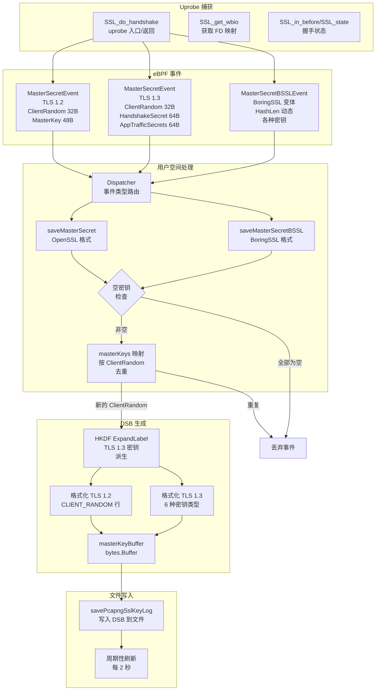
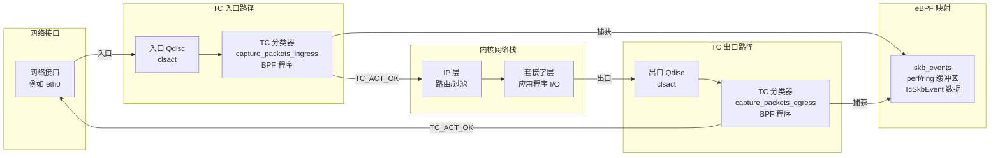
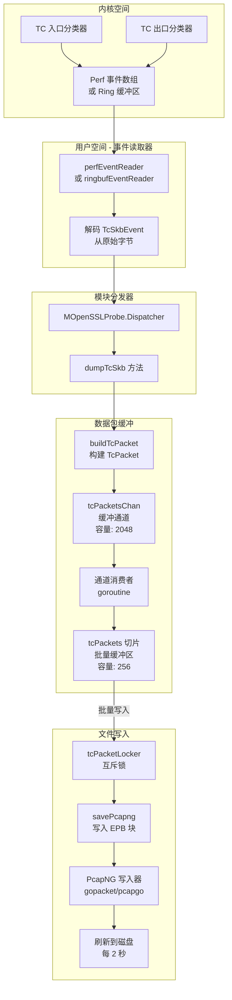
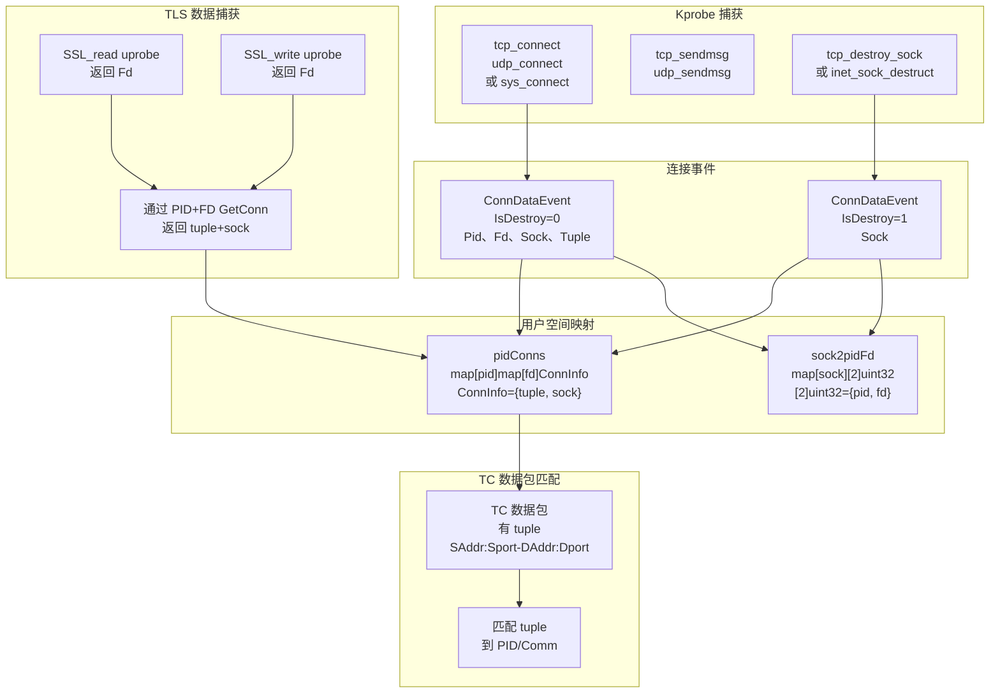
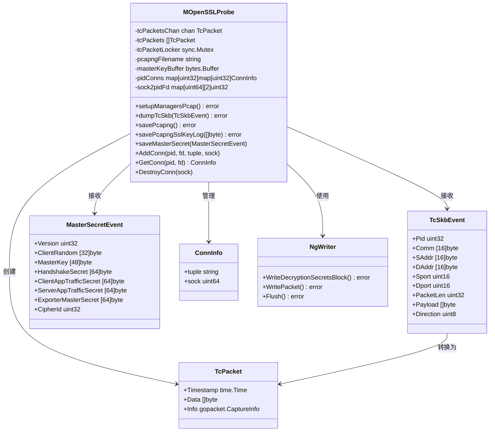

# PCAP 集成

## 目的与范围

本文档描述了 eCapture 的 PCAP-NG 文件生成功能,该功能能够以与 Wireshark 和其他网络分析工具兼容的格式进行网络数据包捕获和存储。PCAP 集成可以捕获加密的网络流量以及解密所需的 TLS/SSL 解密密钥,并将它们一起存储在单个带有解密密钥块 (DSB) 的 PCAP-NG 文件中。

有关其他输出格式的信息,请参阅 [文本输出模式](4.1-text-output-mode.md) 和 [TLS 密钥日志](4.3-tls-key-logging.md)。有关底层数据包捕获机制的详细信息,请参阅 [网络连接跟踪](../2-architecture/2.6-version-detection-and-bytecode-selection.md)。

---

## 概述

eCapture 的 PCAP 集成在 `pcap` 或 `pcapng` 模式下运行,这与文本模式有本质区别,它捕获完整的网络数据包而不仅仅是明文内容。此模式将三个数据源组合到统一的 PCAP-NG 文件中:

1. **网络数据包** 通过 TC (Traffic Control) eBPF 分类器在入口/出口捕获
2. **TLS 主密钥** 通过 uprobe 钩子从 SSL/TLS 函数提取
3. **连接元数据** 包括进程信息 (PID、UID、命令名称)

生成的 PCAP-NG 文件可以在 Wireshark 中打开,使用嵌入的主密钥自动解密 TLS 流量。

**PCAP 集成架构**


```mermaid
graph TB
    subgraph "捕获源"
        TC["TC eBPF 程序<br/>capture_packets<br/>ingress/egress"]
        UPROBE["Uprobe 钩子<br/>SSL_read/SSL_write<br/>SSL_do_handshake"]
        KPROBE["Kprobe 钩子<br/>tcp_sendmsg<br/>udp_sendmsg"]
    end
    
    subgraph "事件处理"
        TC_EVENT["TcSkbEvent<br/>网络数据包<br/>4元组 + 载荷"]
        MS_EVENT["MasterSecretEvent<br/>TLS 1.2/1.3 密钥<br/>ClientRandom + 密钥"]
        CONN_EVENT["ConnDataEvent<br/>PID/FD 映射<br/>元组生成"]
    end
    
    subgraph "PCAP 写入器 - MTCProbe"
        PACKET_CHAN["tcPacketsChan<br/>缓冲通道<br/>容量 2048"]
        PACKET_BUF["tcPackets 切片<br/>容量 256<br/>批量缓冲区"]
        MASTERKEY_BUF["masterKeyBuffer<br/>bytes.Buffer<br/>DSB 数据"]
    end
    
    subgraph "文件输出"
        PCAPNG_WRITER["PcapNG 写入器<br/>gopacket/pcapgo"]
        DSB_BLOCKS["DSB 块<br/>解密密钥<br/>TLS Key Log 格式"]
        EPB_BLOCKS["EPB 块<br/>增强型数据包<br/>带元数据"]
    end
    
    TC --> TC_EVENT
    UPROBE --> MS_EVENT
    KPROBE --> CONN_EVENT
    
    TC_EVENT -->|"dumpTcSkb"| PACKET_CHAN
    MS_EVENT -->|"savePcapngSslKeyLog"| MASTERKEY_BUF
    CONN_EVENT -->|"AddConn"| PACKET_CHAN
    
    PACKET_CHAN --> PACKET_BUF
    PACKET_BUF -->|"savePcapng"| PCAPNG_WRITER
    MASTERKEY_BUF -->|"savePcapng"| DSB_BLOCKS
    
    PCAPNG_WRITER --> EPB_BLOCKS
    DSB_BLOCKS --> PCAPNG_WRITER
```

来源: [user/module/probe_openssl.go:137-148](https://github.com/gojue/ecapture/blob/ca085d05/user/module/probe_openssl.go#L137-L148), [user/module/probe_openssl.go:287-296](https://github.com/gojue/ecapture/blob/ca085d05/user/module/probe_openssl.go#L287-L296), [README.md:173-187](https://github.com/gojue/ecapture/blob/ca085d05/README.md#L173-L187)

---

## 激活与配置

### 命令行用法

PCAP 模式使用 `-m pcap` 或 `-m pcapng` 标志与 `tls` 或 `gotls` 模块一起激活。必需参数包括:

| 参数 | 描述 | 默认值 |
|-----------|-------------|---------------|
| `-m pcap` 或 `-m pcapng` | 激活 PCAP 模式 | 不适用 (必需) |
| `-w` 或 `--pcapfile` | 输出文件路径 | `ecapture_openssl.pcapng` |
| `-i` | 要捕获的网络接口 | 不适用 (必需) |
| PCAP 过滤表达式 | 可选的 BPF 过滤器 (最后一个参数) | 无 |

**支持的协议**: TLS 加密的 HTTP/1.0、HTTP/1.1、HTTP/2 over TCP,以及 HTTP/3 QUIC over UDP。

示例命令:
```bash
sudo ecapture tls -m pcap -i eth0 --pcapfile=capture.pcapng tcp port 443
```

使用替代语法的示例命令:
```bash
sudo ecapture tls -m pcap -w ecap.pcapng -i ens160
```

捕获期间的示例输出:
```
2024-09-15T06:54:12Z INF AppName="eCapture(旁观者)"
2024-09-15T06:54:12Z INF HOOK type:Openssl elf ElfType=2 IFindex=2 IFname=ens160 PcapFilter= binrayPath=/usr/lib/aarch64-linux-gnu/libssl.so.3
2024-09-15T06:54:12Z INF packets saved into pcapng file. pcapng path=/home/ecapture/ecap.pcapng
2024-09-15T06:54:14Z INF packets saved into pcapng file. count=4
2024-09-15T06:54:16Z INF non-TLSv1.3 cipher suite found CLientRandom=f08e8d784962d1693c042f9fe266345507ccfaba58b823904a357f30dbfa1e71 CipherId=0
2024-09-15T06:54:16Z INF packets saved into pcapng file. count=183
2024-09-15T06:54:16Z INF CLIENT_RANDOM save success CLientRandom=f08e8d784962d1693c042f9fe266345507ccfaba58b823904a357f30dbfa1e71 TlsVersion=TLS1_2_VERSION bytes=176
```

**模式选择实现**


```mermaid
graph LR
    CLI_PARSE["CLI 解析器<br/>cobra command"] --> MODEL_CONFIG["OpensslConfig.Model<br/>字符串值"]
    MODEL_CONFIG --> SWITCH{"模式切换"}
    
    SWITCH -->|"pcap/pcapng"| PCAP_INIT["TlsCaptureModelTypePcap<br/>eBPFProgramType = 1"]
    SWITCH -->|"keylog/key"| KEYLOG_INIT["TlsCaptureModelTypeKeylog<br/>eBPFProgramType = 2"]
    SWITCH -->|"text/default"| TEXT_INIT["TlsCaptureModelTypeText<br/>eBPFProgramType = 0"]
    
    PCAP_INIT --> PCAP_SETUP["创建 tcPacketsChan<br/>设置 pcapngFilename<br/>setupManagersPcap"]
    KEYLOG_INIT --> KEYLOG_SETUP["打开 keylogger 文件<br/>setupManagersKeylog"]
    TEXT_INIT --> TEXT_SETUP["setupManagersText"]
    
    PCAP_SETUP --> RUN["Module.Run"]
    KEYLOG_SETUP --> RUN
    TEXT_SETUP --> RUN
```

来源: [user/module/probe_openssl.go:127-154](https://github.com/gojue/ecapture/blob/ca085d05/user/module/probe_openssl.go#L127-L154), [user/config/iconfig.go:73-79](https://github.com/gojue/ecapture/blob/ca085d05/user/config/iconfig.go#L73-L79), [cli/cmd/root.go:249-296](https://github.com/gojue/ecapture/blob/ca085d05/cli/cmd/root.go#L249-L296)

### 配置结构

PCAP 模式通过 `OpensslConfig` 配置:

```
OpensslConfig.Model = "pcap" 或 "pcapng"
OpensslConfig.PcapFile = 输出文件路径
OpensslConfig.Ifname = 网络接口名称
OpensslConfig.PcapFilter = 可选的 BPF 过滤表达式
```

此配置触发以下内容的初始化:
- `tcPacketsChan`: 缓冲通道 (容量 2048) 用于数据包队列
- `tcPackets`: 切片缓冲区 (容量 256) 用于批量写入
- `pcapngFilename`: 输出文件的绝对路径

来源: [user/module/probe_openssl.go:137-148](https://github.com/gojue/ecapture/blob/ca085d05/user/module/probe_openssl.go#L137-L148)

---

## PCAP-NG 文件格式

### 文件结构

eCapture 生成 PCAP-NG (下一代) 文件,它扩展了经典的 PCAP 格式,包含更丰富的元数据。文件结构包括:

1. **节头块 (SHB)**: 文件标识和字节序
2. **接口描述块 (IDB)**: 网络接口元数据
3. **解密密钥块 (DSB)**: 用于解密的 TLS 主密钥
4. **增强型数据包块 (EPB)**: 带时间戳的单个数据包数据

**PCAP-NG 块结构**


```mermaid
graph TB
    FILE["PCAP-NG 文件"]
    
    FILE --> SHB["节头块<br/>字节序: 0x1A2B3C4D<br/>版本: 1.0"]
    
    SHB --> IDB["接口描述块<br/>LinkType: Ethernet<br/>SnapLen: 262144<br/>名称/描述"]
    
    IDB --> DSB1["解密密钥块<br/>SecretsType: TLS Key Log<br/>CLIENT_RANDOM 格式<br/>TLS 1.2/1.3 密钥"]
    
    IDB --> EPB1["增强型数据包块<br/>InterfaceID: 0<br/>时间戳: ns 精度<br/>捕获长度<br/>原始长度<br/>数据包数据"]
    
    EPB1 --> EPB2["增强型数据包块<br/>..."]
    
    EPB2 --> DSB2["解密密钥块<br/>附加密钥"]
    
    DSB2 --> EPB3["增强型数据包块<br/>..."]
    
    EPB3 --> EPBN["增强型数据包块<br/>..."]
```

来源: [user/module/probe_openssl.go:558-565](https://github.com/gojue/ecapture/blob/ca085d05/user/module/probe_openssl.go#L558-L565), [user/module/probe_openssl.go:625-632](https://github.com/gojue/ecapture/blob/ca085d05/user/module/probe_openssl.go#L625-L632)

### 增强型数据包块 (EPB) 内容

每个捕获的数据包作为 EPB 存储,包含:

- **接口 ID**: 链接到 IDB (通常为 0)
- **时间戳**: 纳秒精度 (启动时间 + 单调时钟)
- **捕获的数据包长度**: 实际捕获的字节数
- **原始数据包长度**: 线路上的长度 (如果被截断,可能超过捕获长度)
- **数据包数据**: 原始以太网帧,包括:
  - 以太网头 (14 字节)
  - IP 头 (IPv4 或 IPv6)
  - 传输层头 (TCP/UDP)
  - 应用层载荷 (加密或解密)

数据包数据来自 TC eBPF 程序,这些程序在入口/出口点捕获完整的网络帧。

来源: [user/module/probe_openssl.go:747-750](https://github.com/gojue/ecapture/blob/ca085d05/user/module/probe_openssl.go#L747-L750)

---

## 解密密钥块 (DSB)

### 目的与格式

DSB 是一种 PCAP-NG 块类型,用于存储 TLS 解密密钥,使 Wireshark 能够自动解密捕获的 TLS 流量。eCapture 嵌入包含主密钥的 DSB 块,格式为浏览器和其他 TLS 工具使用的 SSLKEYLOGFILE 格式。

### DSB 数据格式

DSB 块包含标准密钥日志格式的 TLS 密钥:

```
CLIENT_RANDOM <client_random_hex> <master_secret_hex>
CLIENT_HANDSHAKE_TRAFFIC_SECRET <client_random_hex> <secret_hex>
SERVER_HANDSHAKE_TRAFFIC_SECRET <client_random_hex> <secret_hex>
CLIENT_TRAFFIC_SECRET_0 <client_random_hex> <secret_hex>
SERVER_TRAFFIC_SECRET_0 <client_random_hex> <secret_hex>
EXPORTER_SECRET <client_random_hex> <secret_hex>
```

对于 TLS 1.2,仅写入 `CLIENT_RANDOM`。对于 TLS 1.3,派生并写入多个流量密钥。

**主密钥提取和 DSB 写入**


```mermaid
graph TB
    subgraph "Uprobe 捕获"
        SSL_HANDSHAKE["SSL_do_handshake<br/>uprobe 入口/返回"]
        SSL_WBIO["SSL_get_wbio<br/>获取 FD 映射"]
        SSL_STATE["SSL_in_before/SSL_state<br/>握手状态"]
    end
    
    subgraph "eBPF 事件"
        MS_EVENT_12["MasterSecretEvent<br/>TLS 1.2<br/>ClientRandom 32B<br/>MasterKey 48B"]
        MS_EVENT_13["MasterSecretEvent<br/>TLS 1.3<br/>ClientRandom 32B<br/>HandshakeSecret 64B<br/>AppTrafficSecrets 64B"]
        MS_EVENT_BSSL["MasterSecretBSSLEvent<br/>BoringSSL 变体<br/>HashLen 动态<br/>各种密钥"]
    end
    
    subgraph "用户空间处理"
        DISPATCHER["Dispatcher<br/>事件类型路由"]
        SAVE_MS["saveMasterSecret<br/>OpenSSL 格式"]
        SAVE_BSSL["saveMasterSecretBSSL<br/>BoringSSL 格式"]
        NULL_CHECK{"空密钥<br/>检查"}
        DEDUP["masterKeys 映射<br/>按 ClientRandom<br/>去重"]
    end
    
    subgraph "DSB 生成"
        HKDF_EXPAND["HKDF ExpandLabel<br/>TLS 1.3 密钥<br/>派生"]
        FORMAT_12["格式化 TLS 1.2<br/>CLIENT_RANDOM 行"]
        FORMAT_13["格式化 TLS 1.3<br/>6 种密钥类型"]
        BUFFER["masterKeyBuffer<br/>bytes.Buffer"]
    end
    
    subgraph "文件写入"
        PCAP_WRITER["savePcapngSslKeyLog<br/>写入 DSB 到文件"]
        FLUSH["周期性刷新<br/>每 2 秒"]
    end
    
    SSL_HANDSHAKE --> MS_EVENT_12
    SSL_HANDSHAKE --> MS_EVENT_13
    SSL_HANDSHAKE --> MS_EVENT_BSSL
    
    MS_EVENT_12 --> DISPATCHER
    MS_EVENT_13 --> DISPATCHER
    MS_EVENT_BSSL --> DISPATCHER
    
    DISPATCHER --> SAVE_MS
    DISPATCHER --> SAVE_BSSL
    
    SAVE_MS --> NULL_CHECK
    SAVE_BSSL --> NULL_CHECK
    
    NULL_CHECK -->|"非空"| DEDUP
    NULL_CHECK -->|"全部为空"| DROP["丢弃事件"]
    
    DEDUP -->|"新的 ClientRandom"| HKDF_EXPAND
    DEDUP -->|"重复"| DROP
    
    HKDF_EXPAND --> FORMAT_12
    HKDF_EXPAND --> FORMAT_13
    
    FORMAT_12 --> BUFFER
    FORMAT_13 --> BUFFER
    
    BUFFER --> PCAP_WRITER
    PCAP_WRITER --> FLUSH
```

来源: [user/module/probe_openssl.go:482-575](https://github.com/gojue/ecapture/blob/ca085d05/user/module/probe_openssl.go#L482-L575), [user/module/probe_openssl.go:577-642](https://github.com/gojue/ecapture/blob/ca085d05/user/module/probe_openssl.go#L577-L642)

### 实现细节

#### TLS 1.2 主密钥

对于 TLS 1.2,主密钥直接从 SSL 结构捕获:

1. 在 `SSL_do_handshake` 上的 Uprobe 捕获 SSL 上下文
2. 导航到 `s3->tmp.new_cipher` 获取密码套件
3. 读取 `session->master_key` (48 字节)
4. 读取 `session->client_random` (32 字节)
5. 格式: `CLIENT_RANDOM <32 hex bytes> <48 hex bytes>`

#### TLS 1.3 流量密钥

对于 TLS 1.3,提取并派生多个密钥:

1. 从 SSL 结构捕获 `handshake_secret`、`handshake_traffic_hash`
2. 使用 HKDF 派生:
   - `client_handshake_traffic_secret` = HKDF-Expand-Label(handshake_secret, "c hs traffic", handshake_traffic_hash, hash_len)
   - `server_handshake_traffic_secret` = HKDF-Expand-Label(handshake_secret, "s hs traffic", handshake_traffic_hash, hash_len)
3. 直接捕获 `client_app_traffic_secret`、`server_app_traffic_secret`、`exporter_master_secret`
4. 将所有六种密钥类型写入 DSB

HKDF 扩展在用户空间执行,使用捕获的哈希算法 (基于密码套件的 SHA256 或 SHA384)。

来源: [user/module/probe_openssl.go:502-551](https://github.com/gojue/ecapture/blob/ca085d05/user/module/probe_openssl.go#L502-L551), [pkg/util/hkdf/hkdf.go](https://github.com/gojue/ecapture/blob/ca085d05/pkg/util/hkdf/hkdf.go)

#### 空密钥检测

eCapture 在写入 DSB 之前验证捕获的密钥不为空 (全零)。这可以防止密钥日志损坏:

- 对于 TLS 1.2: 检查 `master_key` 的所有 48 字节是否为零
- 对于 TLS 1.3: 检查所有流量密钥是否为零 (5 个不同的密钥)
- 如果所有密钥都为空,则丢弃该事件

来源: [user/module/probe_openssl.go:644-731](https://github.com/gojue/ecapture/blob/ca085d05/user/module/probe_openssl.go#L644-L731)

#### 去重

主密钥使用由十六进制编码的 `ClientRandom` 作为键的 `map[string]bool` 进行去重:

```
ClientRandom (32 字节) -> 十六进制字符串 (64 字符) -> 映射键
```

如果 `ClientRandom` 已存在于映射中,则不写入重复密钥。这可以防止同一 TLS 会话写入多个相同的 DSB 块。

来源: [user/module/probe_openssl.go:483-489](https://github.com/gojue/ecapture/blob/ca085d05/user/module/probe_openssl.go#L483-L489), [user/module/probe_openssl.go:578-584](https://github.com/gojue/ecapture/blob/ca085d05/user/module/probe_openssl.go#L578-L584)

---

## TC 数据包捕获集成

### 流量控制 (TC) eBPF 程序

PCAP 模式依赖于附加到网络接口的 TC eBPF 分类器进行数据包捕获。与在应用层捕获明文的 uprobe 不同,TC 程序捕获完整的网络数据包,包括加密载荷。

**TC 分类器附加点**


```mermaid
graph LR
    subgraph "网络接口"
        NIC["网络接口<br/>例如 eth0"]
    end
    
    subgraph "TC 入口路径"
        ING_QDISC["入口 Qdisc<br/>clsact"]
        ING_FILTER["TC 分类器<br/>capture_packets_ingress<br/>BPF 程序"]
    end
    
    subgraph "TC 出口路径"
        EG_QDISC["出口 Qdisc<br/>clsact"]
        EG_FILTER["TC 分类器<br/>capture_packets_egress<br/>BPF 程序"]
    end
    
    subgraph "内核网络栈"
        IP_LAYER["IP 层<br/>路由/过滤"]
        SOCKET["套接字层<br/>应用程序 I/O"]
    end
    
    subgraph "eBPF 映射"
        SKB_EVENTS["skb_events<br/>perf/ring 缓冲区<br/>TcSkbEvent 数据"]
    end
    
    NIC -->|"入口"| ING_QDISC
    ING_QDISC --> ING_FILTER
    ING_FILTER -->|"TC_ACT_OK"| IP_LAYER
    
    IP_LAYER --> SOCKET
    
    SOCKET -->|"出口"| EG_QDISC
    EG_QDISC --> EG_FILTER
    EG_FILTER -->|"TC_ACT_OK"| NIC
    
    ING_FILTER -->|"捕获"| SKB_EVENTS
    EG_FILTER -->|"捕获"| SKB_EVENTS
```

来源: [user/module/probe_openssl.go:303-307](https://github.com/gojue/ecapture/blob/ca085d05/user/module/probe_openssl.go#L303-L307)

### TcSkbEvent 结构

每个捕获的数据包生成一个包含以下内容的 `TcSkbEvent`:

| 字段 | 类型 | 描述 |
|-------|------|-------------|
| `Pid` | uint32 | 发送/接收数据包的进程 ID |
| `Tid` | uint32 | 线程 ID |
| `Uid` | uint32 | 用户 ID |
| `Gid` | uint32 | 组 ID |
| `Comm` | [16]byte | 命令名称 (进程) |
| `SAddr` | [16]byte | 源 IP 地址 (IPv4/IPv6) |
| `DAddr` | [16]byte | 目标 IP 地址 |
| `Sport` | uint16 | 源端口 |
| `Dport` | uint16 | 目标端口 |
| `PacketLen` | uint32 | 总数据包长度 |
| `Payload` | []byte | 数据包数据 (以太网帧) |
| `Direction` | uint8 | 0=出口, 1=入口 |

捕获完整的以太网帧,包括头和加密载荷。

来源: [user/event/event_tc.go](https://github.com/gojue/ecapture/blob/ca085d05/user/event/event_tc.go)

### BPF 过滤器集成

当提供 PCAP 过滤表达式时 (例如 `tcp port 443`),它会在加载时被编译为 eBPF 指令并修补到 TC 分类器程序中:

1. 使用 libpcap 语法解析过滤表达式
2. 编译为经典 BPF 指令
3. 转换为 eBPF 指令
4. 使用 `InstructionPatchers` 修补到 TC 程序中

此过滤在内核空间进行,减少了发送到用户空间的事件量。

来源: [user/module/probe_openssl.go:303-307](https://github.com/gojue/ecapture/blob/ca085d05/user/module/probe_openssl.go#L303-L307)

---

## 数据包处理流程

### 从 TC 到文件的事件流

**数据包捕获流程**


```mermaid
graph TB
    subgraph "内核空间"
        TC_ING["TC 入口分类器"]
        TC_EG["TC 出口分类器"]
        PERF_MAP["Perf 事件数组<br/>或 Ring 缓冲区"]
    end
    
    subgraph "用户空间 - 事件读取器"
        PERF_READER["perfEventReader<br/>或 ringbufEventReader"]
        DECODE["解码 TcSkbEvent<br/>从原始字节"]
    end
    
    subgraph "模块分发器"
        DISPATCHER["MOpenSSLProbe.Dispatcher"]
        DUMP_TCSKB["dumpTcSkb 方法"]
    end
    
    subgraph "数据包缓冲"
        BUILD_PKT["buildTcPacket<br/>构建 TcPacket"]
        CHAN["tcPacketsChan<br/>缓冲通道<br/>容量: 2048"]
        CONSUMER["通道消费者<br/>goroutine"]
        SLICE["tcPackets 切片<br/>批量缓冲区<br/>容量: 256"]
    end
    
    subgraph "文件写入"
        LOCK["tcPacketLocker<br/>互斥锁"]
        SAVE["savePcapng<br/>写入 EPB 块"]
        WRITER["PcapNG 写入器<br/>gopacket/pcapgo"]
        FLUSH["刷新到磁盘<br/>每 2 秒"]
    end
    
    TC_ING --> PERF_MAP
    TC_EG --> PERF_MAP
    
    PERF_MAP --> PERF_READER
    PERF_READER --> DECODE
    DECODE --> DISPATCHER
    
    DISPATCHER --> DUMP_TCSKB
    DUMP_TCSKB --> BUILD_PKT
    BUILD_PKT --> CHAN
    
    CHAN --> CONSUMER
    CONSUMER --> SLICE
    
    SLICE -->|"批量写入"| LOCK
    LOCK --> SAVE
    SAVE --> WRITER
    WRITER --> FLUSH
```

来源: [user/module/probe_openssl.go:747-750](https://github.com/gojue/ecapture/blob/ca085d05/user/module/probe_openssl.go#L747-L750), [user/module/probe_tc.go](https://github.com/gojue/ecapture/blob/ca085d05/user/module/probe_tc.go)

### TcPacket 构建

`dumpTcSkb` 方法将 `TcSkbEvent` 转换为 `TcPacket` 结构:

1. **时间戳转换**: 将内核单调时间转换为墙上时钟时间
   - `timestamp_ns = boot_time + skb_event.timestamp_ns`
2. **数据包数据提取**: 从事件载荷复制以太网帧
3. **元数据附加**: 包括 PID、命令、元组信息
4. **入队**: 发送到 `tcPacketsChan` 进行缓冲处理

`TcPacket` 结构包含:
- 时间戳 (纳秒精度)
- 数据包数据 (以太网帧字节)
- 连接信息 (用于与 uprobe 关联)

来源: [user/module/probe_tc.go](https://github.com/gojue/ecapture/blob/ca085d05/user/module/probe_tc.go)

### 批量写入

数据包以批量方式写入 PCAP-NG 文件以提高性能:

1. 消费者 goroutine 从 `tcPacketsChan` 读取
2. 在 `tcPackets` 切片中累积数据包 (最多 256 个)
3. 当切片满或超时时,调用 `savePcapng`
4. `savePcapng` 获取锁并将所有数据包作为 EPB 块写入
5. 每 2 秒刷新写入器到磁盘

这种批处理减少了系统调用开销并提高了吞吐量。

来源: [user/module/probe_tc.go](https://github.com/gojue/ecapture/blob/ca085d05/user/module/probe_tc.go)

---

## 文件写入器实现

### PcapNG 写入器初始化

eCapture 使用 `gopacket/pcapgo` 库生成 PCAP-NG 文件:

```
Writer: *pcapgo.NgWriter
File: *os.File 使用 O_CREATE | O_WRONLY | O_TRUNC 打开
Interface: pcapgo.NgInterface 带 LinkType、SnapLen、Name、Description
```

初始化序列:
1. 创建/截断输出文件
2. 使用文件句柄创建 `NgWriter`
3. 写入节头块 (SHB)
4. 写入接口描述块 (IDB)
5. 设置周期性刷新定时器 (2 秒)

来源: [user/module/probe_tc.go](https://github.com/gojue/ecapture/blob/ca085d05/user/module/probe_tc.go)

### DSB 写入

通过 `savePcapngSslKeyLog` 写入解密密钥:

1. 在 `masterKeyBuffer` 中将主密钥格式化为 TLS Key Log 行
2. 调用 `NgWriter.WriteDecryptionSecretsBlock`:
   - SecretsType: `pcapgo.DSB_SECRETS_TYPE_TLS` (0x544c534b)
   - SecretsData: 密钥日志格式化字节
3. 清除 `masterKeyBuffer` 以备下一批

DSB 块可以出现在文件的任何位置,与 EPB 块交错。Wireshark 处理所有 DSB 块以构建其解密密钥表。

来源: [user/module/probe_openssl.go:558-565](https://github.com/gojue/ecapture/blob/ca085d05/user/module/probe_openssl.go#L558-L565)

### EPB 写入

每个数据包作为增强型数据包块写入:

```
CaptureInfo: gopacket.CaptureInfo {
    Timestamp: time.Unix(0, timestamp_ns)
    CaptureLength: len(packet_data)
    Length: len(packet_data)
    InterfaceIndex: 0
}
```

`NgWriter.WritePacket` 方法处理 EPB 块格式化,包括:
- 块类型和长度字段
- 接口 ID
- 时间戳 (高/低 32 位分割)
- 捕获和原始长度
- 数据包数据
- 填充到 32 位边界
- 块总长度尾部

来源: [user/module/probe_tc.go](https://github.com/gojue/ecapture/blob/ca085d05/user/module/probe_tc.go)

### 周期性刷新

为确保数据即使在数据包不频繁时也能写入磁盘:

1. 启动 ticker goroutine,间隔 2 秒
2. 每次 tick 时,获取锁并刷新写入器
3. 记录数据包计数统计信息
4. 继续直到上下文取消

这可以防止程序终止时数据丢失。

来源: [user/module/probe_tc.go](https://github.com/gojue/ecapture/blob/ca085d05/user/module/probe_tc.go)

---

## 进程和连接关联

### PID/FD 到套接字映射

为了关联网络数据包 (在 TC 层捕获) 与 TLS 明文 (在 SSL 层捕获),eCapture 维护双向映射:

**连接跟踪架构**


```mermaid
graph TB
    subgraph "Kprobe 捕获"
        CONNECT["tcp_connect<br/>udp_connect<br/>或 sys_connect"]
        SENDMSG["tcp_sendmsg<br/>udp_sendmsg"]
        DESTROY["tcp_destroy_sock<br/>或 inet_sock_destruct"]
    end
    
    subgraph "连接事件"
        CONN_CREATE["ConnDataEvent<br/>IsDestroy=0<br/>Pid、Fd、Sock、Tuple"]
        CONN_DESTROY["ConnDataEvent<br/>IsDestroy=1<br/>Sock"]
    end
    
    subgraph "用户空间映射"
        PID_CONNS["pidConns<br/>map[pid]map[fd]ConnInfo<br/>ConnInfo={tuple, sock}"]
        SOCK_MAP["sock2pidFd<br/>map[sock][2]uint32<br/>[2]uint32={pid, fd}"]
    end
    
    subgraph "TLS 数据捕获"
        SSL_READ["SSL_read uprobe<br/>返回 Fd"]
        SSL_WRITE["SSL_write uprobe<br/>返回 Fd"]
        LOOKUP["通过 PID+FD GetConn<br/>返回 tuple+sock"]
    end
    
    subgraph "TC 数据包匹配"
        TC_PKT["TC 数据包<br/>有 tuple<br/>SAddr:Sport-DAddr:Dport"]
        MATCH["匹配 tuple<br/>到 PID/Comm"]
    end
    
    CONNECT --> CONN_CREATE
    DESTROY --> CONN_DESTROY
    
    CONN_CREATE --> PID_CONNS
    CONN_CREATE --> SOCK_MAP
    
    CONN_DESTROY --> PID_CONNS
    CONN_DESTROY --> SOCK_MAP
    
    SSL_READ --> LOOKUP
    SSL_WRITE --> LOOKUP
    LOOKUP --> PID_CONNS
    
    PID_CONNS --> TC_PKT
    TC_PKT --> MATCH
```

来源: [user/module/probe_openssl.go:398-480](https://github.com/gojue/ecapture/blob/ca085d05/user/module/probe_openssl.go#L398-L480)

### 连接生命周期

1. **创建**: 当建立连接时 (通过 `tcp_connect` 或 `sys_connect` 上的 kprobe 检测):
   - 生成 4 元组: `SrcIP:SrcPort-DstIP:DstPort`
   - 映射 PID+FD -> {tuple, sock}
   - 映射 sock -> {PID, FD}

2. **使用**: 当捕获 SSL 数据时 (通过 `SSL_read`/`SSL_write` 上的 uprobe):
   - 通过 PID+FD 查找 tuple 和 sock
   - 将 tuple 附加到 `SSLDataEvent`
   - 事件处理器使用 tuple 与 TC 数据包关联

3. **销毁**: 当套接字关闭时 (通过 `tcp_destroy_sock` 上的 kprobe 检测):
   - 删除 PID+FD -> ConnInfo 映射
   - 删除 sock -> PID+FD 映射
   - 延迟删除 (3 秒) 以允许正在处理的事件完成

这种关联使 Wireshark 能够显示:
- 哪个进程生成了每个数据包
- 哪个用户拥有该进程
- 进程的命令名称

来源: [user/module/probe_openssl.go:398-462](https://github.com/gojue/ecapture/blob/ca085d05/user/module/probe_openssl.go#L398-L462)

---

## Wireshark 集成

### 打开 PCAP-NG 文件

要在 Wireshark 中查看捕获的流量:

1. **直接打开**: 
   ```bash
   wireshark ecapture.pcapng
   ```
   - 使用嵌入的 DSB (解密密钥块) 自动解密 TLS 流量
   - 无需额外配置
   - 适用于 Wireshark 3.0 及更高版本

2. **手动密钥日志配置** (如果缺少 DSB 或使用旧版 Wireshark): 
   - 导航: `Edit -> Preferences -> Protocols -> TLS -> (Pre)-Master-Secret log filename`
   - 指向主密钥日志文件
   - 注意: 在 PCAP 模式下,密钥嵌入在 DSB 块中,因此通常不需要此操作

3. **实时捕获**: 
   - 当 eCapture 运行时,Wireshark 可以打开文件进行实时查看
   - 文件每 2 秒刷新到磁盘
   - 在 Wireshark 中使用 "Capture -> Refresh" 查看新数据包
   - 使用 Ctrl+C 终止 eCapture 以进行优雅关闭和完整文件写入

### 显示过滤器

用于 eCapture PCAP-NG 文件的有用 Wireshark 显示过滤器:

| 过滤表达式 | 目的 | 示例输出 |
|-------------------|---------|----------------|
| `http` | HTTP/1.x 解密的请求/响应 | GET/POST 请求、状态码 |
| `http2` | HTTP/2 解密的帧 | HTTP/2 头、数据帧 |
| `http3` 或 `quic` | HTTP/3 QUIC 解密的流 | 带 HTTP/3 内容的 QUIC 数据包 |
| `tls.handshake` | 所有 TLS 握手消息 | ClientHello、ServerHello、Certificate |
| `tls.handshake.type == 1` | 仅 TLS ClientHello | 初始客户端握手 |
| `tls.handshake.type == 2` | 仅 TLS ServerHello | 服务器响应 |
| `frame.comment` | 带进程元数据的数据包 | PID、命令名称注释 |
| `tcp.port == 443` | 仅 HTTPS 流量 | 标准 TLS 端口 |
| `ip.addr == 192.168.1.1` | 特定 IP 地址 | 按源或目标过滤 |

**示例分析工作流**:
1. 打开文件: `wireshark ecapture.pcapng`
2. 应用过滤器: `http and ip.addr == 192.168.1.100`
3. 在 "Follow TCP Stream" 中查看解密的 HTTP 内容
4. 检查 DSB 块: Statistics → Decryption Secrets

来源: [README.md:189-230](https://github.com/gojue/ecapture/blob/ca085d05/README.md#L189-L230), [README_CN.md:162-204](https://github.com/gojue/ecapture/blob/ca085d05/README_CN.md#L162-L204)

### 协议层次结构

PCAP-NG 文件包含完整的协议栈:

```
Ethernet II
  └─ IPv4 或 IPv6
      └─ TCP 或 UDP
          └─ TLS 1.2/1.3
              └─ HTTP/1.1、HTTP/2 或 HTTP/3 (QUIC)
```

当存在 DSB 块时,Wireshark 会自动解析所有层并显示解密的应用程序数据。

---

## 性能考虑

### 缓冲区大小

| 缓冲区 | 大小 | 目的 |
|--------|------|---------|
| `tcPacketsChan` | 2048 个数据包 | 异步生产者/消费者缓冲 |
| `tcPackets` 切片 | 256 个数据包 | 批量写入以减少系统调用 |
| 每 CPU 映射 | 可配置 (默认 1024 * PAGE_SIZE) | eBPF 事件缓冲区大小 |

更大的缓冲区减少高流量下的数据包丢失,但增加内存使用。

来源: [user/module/probe_openssl.go:137-148](https://github.com/gojue/ecapture/blob/ca085d05/user/module/probe_openssl.go#L137-L148), [cli/cmd/root.go:143](https://github.com/gojue/ecapture/blob/ca085d05/cli/cmd/root.go#L143)

### 数据包丢失场景

1. **eBPF 映射溢出**: 如果每 CPU 映射填满,事件在内核中被丢弃
2. **通道溢出**: 如果 `tcPacketsChan` 填满 (2048 个数据包),可能会发生阻塞
3. **处理延迟**: 如果用户空间无法跟上内核事件速率

系统在数据包丢失时记录警告,包括来自 perf 缓冲区的丢失样本计数。

来源: [user/module/imodule.go:336-338](https://github.com/gojue/ecapture/blob/ca085d05/user/module/imodule.go#L336-L338)

### 优化策略

1. **增加映射大小**: 使用 `--mapsize` 标志为 eBPF 映射分配更多内存
2. **积极过滤**: 使用 PCAP 过滤表达式减少捕获的数据包量
3. **针对特定进程**: 使用 `-p` 标志仅捕获特定 PID
4. **SSD 存储**: 将 PCAP-NG 文件写入快速存储 (SSD) 以减少 I/O 瓶颈

---

## 实现类图

**关键类及其关系**


```mermaid
classDiagram
    class MOpenSSLProbe {
        -tcPacketsChan chan TcPacket
        -tcPackets []TcPacket
        -tcPacketLocker sync.Mutex
        -pcapngFilename string
        -masterKeyBuffer bytes.Buffer
        -pidConns map[uint32]map[uint32]ConnInfo
        -sock2pidFd map[uint64][2]uint32
        +setupManagersPcap() error
        +dumpTcSkb(TcSkbEvent) error
        +savePcapng() error
        +savePcapngSslKeyLog([]byte) error
        +saveMasterSecret(MasterSecretEvent)
        +AddConn(pid, fd, tuple, sock)
        +GetConn(pid, fd) ConnInfo
        +DestroyConn(sock)
    }
    
    class TcSkbEvent {
        +Pid uint32
        +Comm [16]byte
        +SAddr [16]byte
        +DAddr [16]byte
        +Sport uint16
        +Dport uint16
        +PacketLen uint32
        +Payload []byte
        +Direction uint8
    }
    
    class TcPacket {
        +Timestamp time.Time
        +Data []byte
        +Info gopacket.CaptureInfo
    }
    
    class MasterSecretEvent {
        +Version uint32
        +ClientRandom [32]byte
        +MasterKey [48]byte
        +HandshakeSecret [64]byte
        +ClientAppTrafficSecret [64]byte
        +ServerAppTrafficSecret [64]byte
        +ExporterMasterSecret [64]byte
        +CipherId uint32
    }
    
    class ConnInfo {
        +tuple string
        +sock uint64
    }
    
    class NgWriter {
        +WriteDecryptionSecretsBlock() error
        +WritePacket() error
        +Flush() error
    }
    
    MOpenSSLProbe --> TcSkbEvent : 接收
    MOpenSSLProbe --> TcPacket : 创建
    MOpenSSLProbe --> MasterSecretEvent : 接收
    MOpenSSLProbe --> ConnInfo : 管理
    MOpenSSLProbe --> NgWriter : 使用
    TcSkbEvent --> TcPacket : 转换为
```

来源: [user/module/probe_openssl.go:83-106](https://github.com/gojue/ecapture/blob/ca085d05/user/module/probe_openssl.go#L83-L106), [user/event/event_tc.go](https://github.com/gojue/ecapture/blob/ca085d05/user/event/event_tc.go), [user/event/event_ssl.go](https://github.com/gojue/ecapture/blob/ca085d05/user/event/event_ssl.go)

---

## 错误处理

### 常见问题

| 问题 | 原因 | 解决方案 |
|-------|-------|----------|
| PCAP 文件为空 | 没有数据包匹配过滤器 | 检查接口和过滤表达式 |
| 缺少 DSB 块 | 未捕获 TLS 握手 | 确保在连接建立前开始捕获 |
| Wireshark 无法解密 | 错误的密码套件/版本 | 检查 TLS 版本兼容性 |
| 文件未刷新 | 程序在未清理的情况下被杀死 | 等待优雅关闭或使用更长的捕获时间 |

### 日志记录

PCAP 模式日志包括:

- **初始化**: 
  - `INF packets saved into pcapng file. pcapng path=/path/to/file.pcapng`
  - `INF HOOK type:Openssl elf ElfType=2 IFindex=2 IFname=eth0 PcapFilter=tcp port 443 binrayPath=/usr/lib/libssl.so.3`
- **数据包保存计数** (每 2 秒): 
  - `INF packets saved into pcapng file. count=183`
- **主密钥检测**:
  - `INF non-TLSv1.3 cipher suite found CLientRandom=<hex> CipherId=0`
  - `INF CLIENT_RANDOM save success CLientRandom=<hex> TlsVersion=TLS1_2_VERSION bytes=176`
- **DSB 写入**: 
  - 成功会记录数据包计数
  - 失败: `WRN save sslKeylog failed`
- **模块关闭**: 
  - `INF module close.`
  - 退出前的最终数据包计数

来源: [README.md:189-230](https://github.com/gojue/ecapture/blob/ca085d05/README.md#L189-L230), [README_CN.md:162-201](https://github.com/gojue/ecapture/blob/ca085d05/README_CN.md#L162-L201)

---

## 与其他模式的比较

| 功能 | PCAP 模式 (`-m pcap`) | 文本模式 (`-m text`) | Keylog 模式 (`-m keylog`) |
|---------|-----------|-----------|-------------|
| 输出格式 | PCAP-NG 文件 | 文本日志 (控制台/文件) | SSLKEYLOGFILE 格式 |
| 网络数据包 | 完整捕获 (加密) | 不捕获 | 不捕获 |
| 明文内容 | 通过 Wireshark 中的 DSB 解密 | 直接明文输出 | 仅密钥 (与 tcpdump 配合使用) |
| TLS 密钥 | 嵌入在 DSB 块中 | 不捕获 | 单独的密钥日志文件 |
| Wireshark 兼容 | 是 (原生,自动) | 否 | 是 (手动导入) |
| 性能影响 | 最高 (完整数据包 + 密钥) | 最低 (仅明文) | 低 (仅密钥) |
| 磁盘使用 | 高 (完整数据包) | 低 (仅文本) | 非常低 (仅密钥) |
| 使用场景 | 完整网络分析、协议调试 | 快速明文检查 | 与 tcpdump/tshark 集成 |
| 实时查看 | 通过 Wireshark 实时捕获 | 控制台输出 | 使用 tshark 实时解密 |
| 文件轮转 | 手动 | 通过 `--eventrotatetime` | 手动 |

**模式选择指南**:
- **使用 PCAP 模式** 当需要完整的网络分析、协议调试或与 Wireshark 集成时
- **使用文本模式** 用于快速检查明文内容或日志分析
- **使用 Keylog 模式** 当与现有数据包捕获工具 (tcpdump) 集成或需要最小开销时

有关其他模式的详细信息,请参阅 [文本输出模式](4.1-text-output-mode.md) 和 [TLS 密钥日志](4.3-tls-key-logging.md)。

来源: [README.md:151-253](https://github.com/gojue/ecapture/blob/ca085d05/README.md#L151-L253), [README_CN.md:128-220](https://github.com/gojue/ecapture/blob/ca085d05/README_CN.md#L128-L220)

---

## 相关组件

此 PCAP 集成依赖于其他几个 eCapture 子系统:

- **TC 程序**: 有关 TC eBPF 分类器详细信息,请参阅 [网络连接跟踪](../2-architecture/2.6-version-detection-and-bytecode-selection.md)
- **主密钥提取**: 有关 TLS 密钥捕获,请参阅 [主密钥提取](../3-capture-modules/3.1.4-gnutls-and-nss-modules.md)
- **事件处理**: 有关事件路由,请参阅 [事件处理流程](../2-architecture/2.2-event-processing-pipeline.md)
- **模块系统**: 有关 `IModule` 接口,请参阅 [模块系统与生命周期](../2-architecture/2.4-configuration-system.md)

PCAP 模式是 TLS 模块支持的三种输出格式之一,每种格式都针对不同的用例和工作流进行了优化。