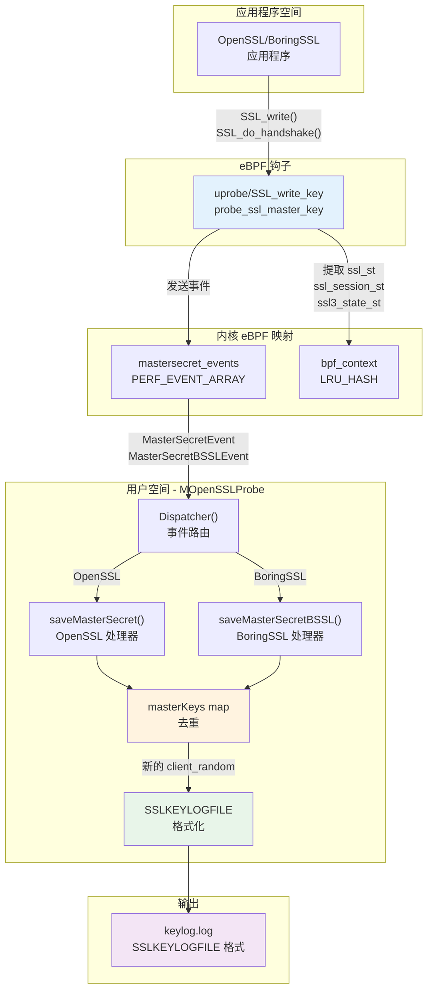
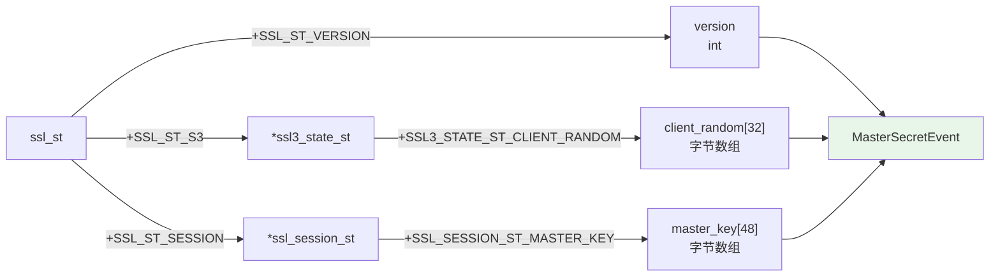
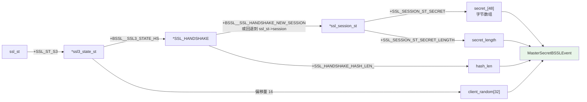
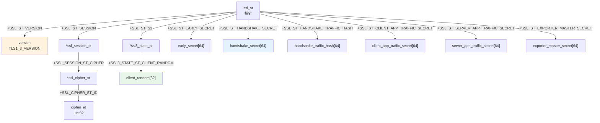
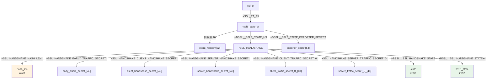
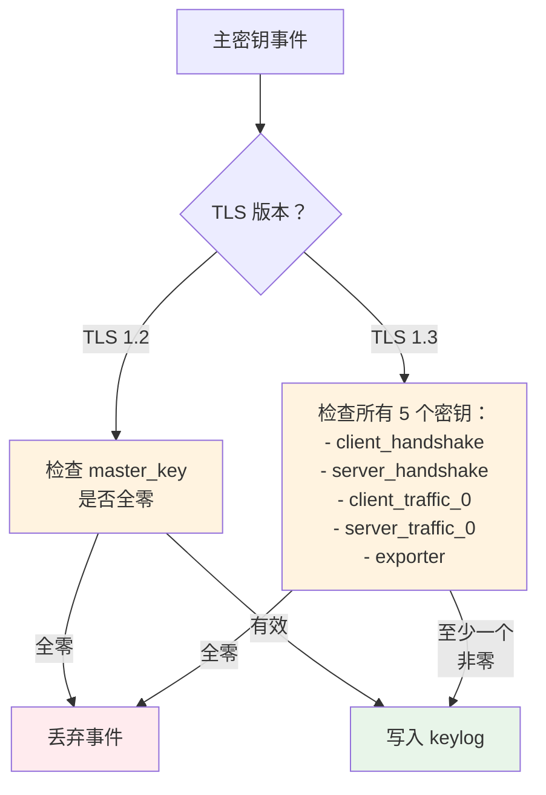
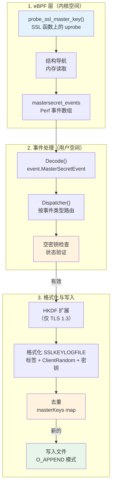

# TLS 密钥日志

## 目的与范围

本文档描述 eCapture 的 TLS 密钥日志功能，该功能从 OpenSSL 和 BoringSSL 应用程序中提取 TLS/SSL 主密钥，并将其写入 SSLKEYLOGFILE 格式的文件。此格式与 Wireshark 等网络协议分析器兼容，使得无需服务器私钥即可解密捕获的 TLS 流量。

有关捕获实际网络数据包以进行解密的信息，请参阅 [PCAP 集成](4.2-pcap-integration.md)。有关基于文本的明文捕获而无需网络数据包关联的信息，请参阅 [文本输出模式](4.1-text-output-mode.md)。

## 概述

TLS 密钥日志通过以下方式运行：
1. **提取主密钥**：使用 eBPF uprobe 从 SSL/TLS 库结构中提取
2. **格式化密钥**：根据 SSLKEYLOGFILE 规范格式化
3. **写入文件**：写入可被 Wireshark 或其他解密工具加载的文件
4. **去重条目**：避免多次写入相同的 client_random

输出文件遵循 NSS 密钥日志格式，其中每一行包含一个标签、客户端随机数和对应的十六进制格式的密钥。

来源：[user/module/probe_openssl.go:58-76](https://github.com/gojue/ecapture/blob/0766a93b/user/module/probe_openssl.go#L58-L76), [user/config/iconfig.go:72-79](https://github.com/gojue/ecapture/blob/0766a93b/user/config/iconfig.go#L72-L79)

## 密钥日志架构



**图示：TLS 密钥日志数据流**

系统在主密钥在内存中可用的时刻，钩住 SSL/TLS 握手函数以提取主密钥。eBPF 程序从 SSL 库结构中读取密钥材料并将事件发送到用户空间，在用户空间中对其进行格式化并写入密钥日志文件。

来源：[user/module/probe_openssl.go:482-575](https://github.com/gojue/ecapture/blob/0766a93b/user/module/probe_openssl.go#L482-L575), [kern/openssl_masterkey.h:80-257](https://github.com/gojue/ecapture/blob/0766a93b/kern/openssl_masterkey.h#L80-L257), [kern/boringssl_masterkey.h:169-403](https://github.com/gojue/ecapture/blob/0766a93b/kern/boringssl_masterkey.h#L169-L403)

## 配置

密钥日志模式通过 `OpensslConfig.Model` 字段配置：

| 配置值 | 常量 | 描述 |
|--------|------|------|
| `"keylog"` | `TlsCaptureModelKeylog` | 仅写入主密钥 |
| `"key"` | `TlsCaptureModelKey` | keylog 模式的别名 |

密钥日志文件路径通过 `OpensslConfig.KeylogFile` 指定（默认值：`./ecapture.keylog`）。

```go
// probe_openssl.go:128-136 的初始化示例
switch model {
case config.TlsCaptureModelKeylog, config.TlsCaptureModelKey:
    m.keyloggerFilename = m.conf.(*config.OpensslConfig).KeylogFile
    m.keylogger, err = os.OpenFile(m.keyloggerFilename, 
        os.O_APPEND|os.O_WRONLY|os.O_CREATE, 0o600)
    m.eBPFProgramType = TlsCaptureModelTypeKeylog
}
```

来源：[user/module/probe_openssl.go:128-136](https://github.com/gojue/ecapture/blob/0766a93b/user/module/probe_openssl.go#L128-L136), [user/config/iconfig.go:72-79](https://github.com/gojue/ecapture/blob/0766a93b/user/config/iconfig.go#L72-L79)

## SSLKEYLOGFILE 格式

SSLKEYLOGFILE 格式由空格分隔的记录组成，每行一个：

```
<Label> <ClientRandom> <Secret>
```

其中：
- **Label**：标识密钥类型（例如，`CLIENT_RANDOM`、`CLIENT_HANDSHAKE_TRAFFIC_SECRET`）
- **ClientRandom**：来自 TLS 握手的 32 字节随机值，十六进制编码
- **Secret**：密钥材料，十六进制编码（TLS 1.2 为 48 字节，TLS 1.3 根据密码套件为 32 或 48 字节）

### 支持的标签

| 标签 | TLS 版本 | 描述 |
|------|----------|------|
| `CLIENT_RANDOM` | TLS 1.2 | TLS 1.2 及更早版本的主密钥 |
| `CLIENT_EARLY_TRAFFIC_SECRET` | TLS 1.3 | 0-RTT 密钥（如果启用了早期数据） |
| `CLIENT_HANDSHAKE_TRAFFIC_SECRET` | TLS 1.3 | 客户端握手流量密钥 |
| `SERVER_HANDSHAKE_TRAFFIC_SECRET` | TLS 1.3 | 服务器握手流量密钥 |
| `CLIENT_TRAFFIC_SECRET_0` | TLS 1.3 | 客户端应用流量密钥 |
| `SERVER_TRAFFIC_SECRET_0` | TLS 1.3 | 服务器应用流量密钥 |
| `EXPORTER_SECRET` | TLS 1.3 | 导出器主密钥 |

来源：[user/module/probe_openssl.go:499-553](https://github.com/gojue/ecapture/blob/0766a93b/user/module/probe_openssl.go#L499-L553), [pkg/util/hkdf/hkdf.go](https://github.com/gojue/ecapture/blob/0766a93b/pkg/util/hkdf/hkdf.go)

## TLS 1.2 主密钥提取

### OpenSSL TLS 1.2



**图示：OpenSSL TLS 1.2 结构导航**

对于 TLS 1.2，eBPF 程序提取：
1. **Client Random**：从 `ssl_st->s3->client_random` 
2. **Master Key**：从 `ssl_st->session->master_key`（48 字节）
3. **Version**：从 `ssl_st->version`

用户空间处理器将其格式化为：
```
CLIENT_RANDOM <32字节十六进制> <48字节十六进制>
```

来源：[kern/openssl_masterkey.h:82-168](https://github.com/gojue/ecapture/blob/0766a93b/kern/openssl_masterkey.h#L82-L168), [user/module/probe_openssl.go:493-500](https://github.com/gojue/ecapture/blob/0766a93b/user/module/probe_openssl.go#L493-L500)

### BoringSSL TLS 1.2

BoringSSL 使用不同的结构布局：



**图示：BoringSSL TLS 1.2 结构导航**

BoringSSL 在 `ssl_session_st->secret_` 中存储密钥，变长存储在 `secret_length` 中。eBPF 程序检查多个位置以找到会话：
1. 首先：`ssl_st->s3->hs->new_session`
2. 回退：`ssl_st->session`

来源：[kern/boringssl_masterkey.h:139-342](https://github.com/gojue/ecapture/blob/0766a93b/kern/boringssl_masterkey.h#L139-L342), [user/module/probe_openssl.go:577-642](https://github.com/gojue/ecapture/blob/0766a93b/user/module/probe_openssl.go#L577-L642)

## TLS 1.3 主密钥提取

TLS 1.3 使用通过 HKDF（基于 HMAC 的密钥派生函数）派生的多个密钥。eCapture 提取基础密钥并在用户空间执行 HKDF 扩展。

### OpenSSL TLS 1.3 结构布局



**图示：OpenSSL TLS 1.3 密钥在 ssl_st 中的位置**

对于 OpenSSL 1.1.1+，密钥直接存储在 `ssl_st` 结构中。密码 ID 决定哈希函数（SHA-256 用于 32 字节密钥，SHA-384 用于 48 字节密钥）。

来源：[kern/openssl_masterkey.h:171-256](https://github.com/gojue/ecapture/blob/0766a93b/kern/openssl_masterkey.h#L171-L256), [user/module/probe_openssl.go:501-551](https://github.com/gojue/ecapture/blob/0766a93b/user/module/probe_openssl.go#L501-L551)

### BoringSSL TLS 1.3 结构布局



**图示：BoringSSL TLS 1.3 密钥在 SSL_HANDSHAKE 中的位置**

BoringSSL 将 TLS 1.3 密钥存储在 `SSL_HANDSHAKE` 结构的私有字段中。偏移量基于结构的已知布局计算，考虑了内存对齐。密钥最大为 48 字节（SSL_MAX_MD_SIZE）。

来源：[kern/boringssl_masterkey.h:343-402](https://github.com/gojue/ecapture/blob/0766a93b/kern/boringssl_masterkey.h#L343-L402), [kern/boringssl_const.h:1-63](https://github.com/gojue/ecapture/blob/0766a93b/kern/boringssl_const.h#L1-L63)

### TLS 1.3 的 HKDF 扩展

对于 TLS 1.3，eCapture 从 SSL 结构中提取 `handshake_secret` 和 `handshake_traffic_hash`，然后使用 HKDF-Expand-Label 计算客户端和服务器握手流量密钥：

```
CLIENT_HANDSHAKE_TRAFFIC_SECRET = HKDF-Expand-Label(
    handshake_secret,
    "c hs traffic",
    handshake_traffic_hash,
    hash_length
)

SERVER_HANDSHAKE_TRAFFIC_SECRET = HKDF-Expand-Label(
    handshake_secret,
    "s hs traffic",
    handshake_traffic_hash,
    hash_length
)
```

哈希函数（SHA-256 或 SHA-384）由密码套件决定：
- **TLS_AES_128_GCM_SHA256** (0x1301)：32 字节，SHA-256
- **TLS_CHACHA20_POLY1305_SHA256** (0x1303)：32 字节，SHA-256
- **TLS_AES_256_GCM_SHA384** (0x1302)：48 字节，SHA-384

来源：[user/module/probe_openssl.go:502-551](https://github.com/gojue/ecapture/blob/0766a93b/user/module/probe_openssl.go#L502-L551), [pkg/util/hkdf/hkdf.go](https://github.com/gojue/ecapture/blob/0766a93b/pkg/util/hkdf/hkdf.go)

## 密钥去重

eCapture 维护一个以 client_random（十六进制编码）为键的 `masterKeys` 映射以防止重复条目：

```go
type MOpenSSLProbe struct {
    masterKeys map[string]bool  // map[client_random_hex]bool
    // ...
}

func (m *MOpenSSLProbe) saveMasterSecret(secretEvent *event.MasterSecretEvent) {
    k := fmt.Sprintf("%02x", secretEvent.ClientRandom)
    
    _, f := m.masterKeys[k]
    if f {
        // 已存在，跳过
        return
    }
    
    // ... 格式化并写入 ...
    m.masterKeys[k] = true
}
```

这是必要的，因为：
1. 在一个连接期间 SSL/TLS 函数可能被多次调用
2. 会话恢复可以重用相同的 client_random
3. 多个捕获点（SSL_write、SSL_read、SSL_do_handshake）可能观察到相同的密钥

来源：[user/module/probe_openssl.go:96-99](https://github.com/gojue/ecapture/blob/0766a93b/user/module/probe_openssl.go#L96-L99), [user/module/probe_openssl.go:482-575](https://github.com/gojue/ecapture/blob/0766a93b/user/module/probe_openssl.go#L482-L575)

## 空密钥检测

eCapture 在写入密钥日志文件之前验证密钥不是全零。这可以防止写入无效或未初始化的密钥：



**图示：空密钥检测逻辑**

验证发生在函数 `mk12NullSecrets()` 和 `mk13NullSecrets()` 中：

```go
// TLS 1.2：检查范围 [0:hashLen] 中的所有字节是否为零
func (m *MOpenSSLProbe) mk12NullSecrets(hashLen int, secret []byte) bool {
    isNull := true
    for i := 0; i < hashLen; i++ {
        if secret[i] != 0 {
            isNull = false
            break
        }
    }
    return isNull
}

// TLS 1.3：检查所有 5 个密钥是否为零
func (m *MOpenSSLProbe) mk13NullSecrets(hashLen int,
    ClientHandshakeSecret [64]byte,
    ClientTrafficSecret0 [64]byte,
    ServerHandshakeSecret [64]byte,
    ServerTrafficSecret0 [64]byte,
    ExporterSecret [64]byte) bool {
    // 如果所有 5 个密钥都为空（isNullCount == 5），返回 true
    // 如果至少有一个密钥有非零字节，返回 false
}
```

来源：[user/module/probe_openssl.go:652-731](https://github.com/gojue/ecapture/blob/0766a93b/user/module/probe_openssl.go#L652-L731)

## 输出文件格式示例

典型的密钥日志文件包含如下条目：

```
CLIENT_RANDOM 0123456789abcdef... 0a1b2c3d4e5f6789...
CLIENT_HANDSHAKE_TRAFFIC_SECRET 0123456789abcdef... 1a2b3c4d5e6f7890...
SERVER_HANDSHAKE_TRAFFIC_SECRET 0123456789abcdef... 2b3c4d5e6f789012...
CLIENT_TRAFFIC_SECRET_0 0123456789abcdef... 3c4d5e6f78901234...
SERVER_TRAFFIC_SECRET_0 0123456789abcdef... 4d5e6f7890123456...
EXPORTER_SECRET 0123456789abcdef... 5e6f789012345678...
```

文件以 `O_APPEND` 模式打开，允许多次 eCapture 运行在同一文件中累积密钥。文件权限设置为 `0o600`（仅所有者可读/写）以保证安全。

来源：[user/module/probe_openssl.go:131-136](https://github.com/gojue/ecapture/blob/0766a93b/user/module/probe_openssl.go#L131-L136), [user/module/probe_openssl.go:567-572](https://github.com/gojue/ecapture/blob/0766a93b/user/module/probe_openssl.go#L567-L572)

## 与 Wireshark 集成

要在 Wireshark 中使用密钥日志文件解密 TLS 流量：

1. **捕获数据包**：使用 eCapture 的 PCAP 模式或 tcpdump
2. **生成密钥日志文件**：使用 eCapture 的密钥日志模式：
   ```bash
   ecapture tls --keylogfile=/tmp/keys.log
   ```
3. **配置 Wireshark**：
   - 编辑 → 首选项 → 协议 → TLS
   - 将"(Pre)-Master-Secret log filename"设置为 `/tmp/keys.log`
4. **重新加载捕获**或重启 Wireshark

Wireshark 将自动解密与密钥日志文件中 client_random 值匹配的 TLS 流量。

### 组合 PCAP + Keylog 模式

当使用 PCAP 模式时，eCapture 可以将密钥日志数据直接嵌入 PCAPNG 文件作为解密密钥块（DSB），无需单独的密钥日志文件。详情请参阅 [PCAP 集成](4.2-pcap-integration.md)。

来源：[user/module/probe_openssl.go:560-564](https://github.com/gojue/ecapture/blob/0766a93b/user/module/probe_openssl.go#L560-L564)

## 密钥提取的状态验证

eBPF 程序在提取密钥之前验证 TLS 握手已达到适当的状态：

### OpenSSL 状态要求

对于 OpenSSL，密钥提取发生在握手完成后的任何 SSL_write 或 SSL_read 调用期间。检查版本字段，但不执行明确的状态验证，因为密钥存储在持久结构中。

### BoringSSL 状态要求

BoringSSL 维护明确的握手状态机。eBPF 程序验证：

**TLS 1.2 状态：**
- 客户端：`state >= CLIENT_STATE12_SEND_CLIENT_FINISHED` (16)
- 服务器：`state >= SERVER_STATE12_READ_CLIENT_FINISHED` (18)

**TLS 1.3 状态：**
- 客户端：`tls13_state >= CLIENT_STATE13_READ_SERVER_FINISHED` (8)
- 服务器：`tls13_state >= SERVER_STATE13_READ_CLIENT_FINISHED` (14)

```c
// 来自 boringssl_masterkey.h:289-293
if (ssl3_hs_state.state < CLIENT_STATE12_SEND_CLIENT_FINISHED) {
    // 尚未完成。
    return 0;
}

// 来自 boringssl_masterkey.h:345-348
if (ssl3_hs_state.tls13_state < CLIENT_STATE13_READ_SERVER_FINISHED) {
    // 尚未完成。
    return 0;
}
```

这确保仅在握手完成且所有密钥材料可用后才提取密钥。

来源：[kern/boringssl_masterkey.h:263-348](https://github.com/gojue/ecapture/blob/0766a93b/kern/boringssl_masterkey.h#L263-L348), [kern/boringssl_masterkey.h:77-86](https://github.com/gojue/ecapture/blob/0766a93b/kern/boringssl_masterkey.h#L77-L86)

## 错误处理

密钥日志系统处理几种错误情况：

| 条件 | 行为 |
|------|------|
| 文件打开失败 | 初始化失败，向用户返回错误 |
| 写入失败 | 记录警告，丢弃事件 |
| 检测到空密钥 | 静默丢弃事件 |
| 重复的 client_random | 跳过事件，不写入 |
| 哈希长度超过缓冲区 | 截断到最大大小并发出警告 |
| eBPF 探针读取失败 | 不向用户空间发送事件 |

日志记录器提供有关每个成功写入密钥的详细信息：

```go
m.logger.Info().
    Str("TlsVersion", v.String()).
    Str("CLientRandom", k).
    Int("bytes", l).
    Msg("CLIENT_RANDOM save success")
```

来源：[user/module/probe_openssl.go:567-572](https://github.com/gojue/ecapture/blob/0766a93b/user/module/probe_openssl.go#L567-L572), [user/module/probe_openssl.go:594-607](https://github.com/gojue/ecapture/blob/0766a93b/user/module/probe_openssl.go#L594-L607)

## 实现总结

密钥日志实现跨越三个层次：



**图示：密钥日志实现层次**

系统通过以下方式实现高可靠性：
- **原子写入**：每一行原子写入文件
- **去重**：防止冗余条目
- **验证**：在写入前确保密钥非空
- **状态检查**：仅在握手完成后提取密钥
- **错误处理**：失败时优雅降级

来源：[user/module/probe_openssl.go:733-754](https://github.com/gojue/ecapture/blob/0766a93b/user/module/probe_openssl.go#L733-L754), [kern/openssl_masterkey.h:80-257](https://github.com/gojue/ecapture/blob/0766a93b/kern/openssl_masterkey.h#L80-L257), [kern/boringssl_masterkey.h:169-403](https://github.com/gojue/ecapture/blob/0766a93b/kern/boringssl_masterkey.h#L169-L403)