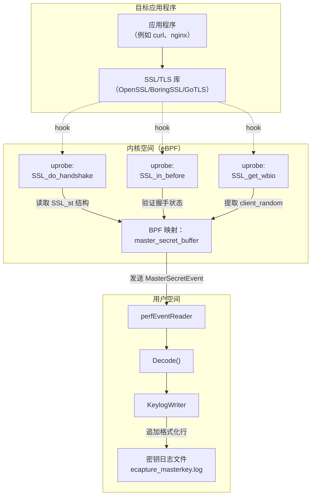
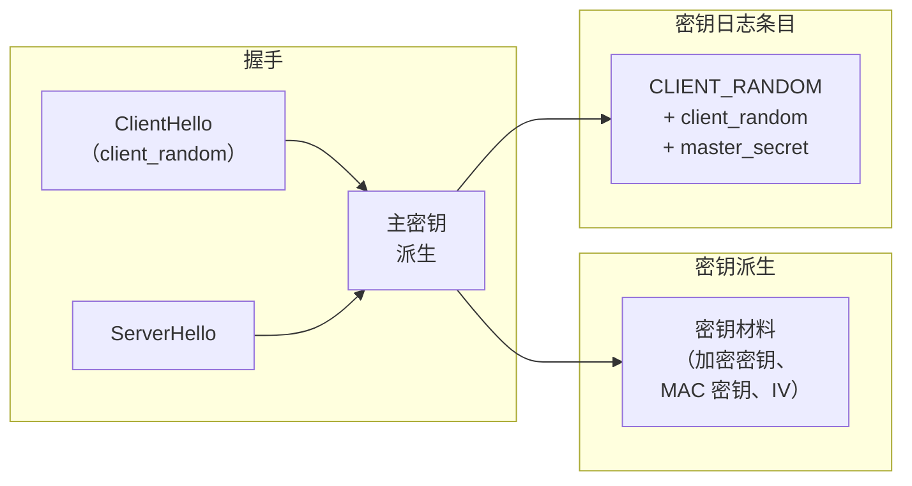
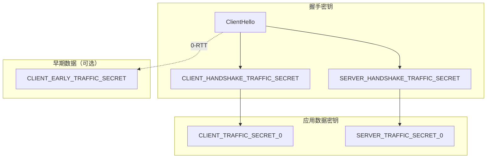
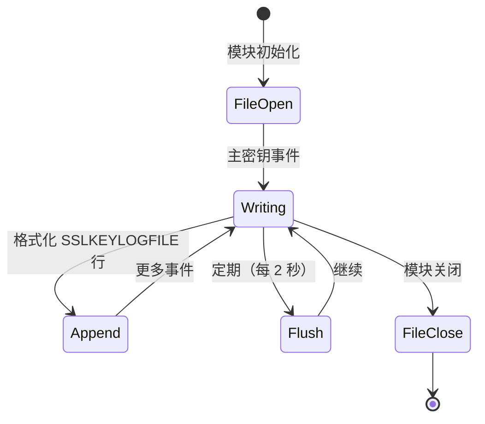

# TLS 密钥日志

## 目的与范围

本页面文档化了 eCapture 的密钥日志输出模式（`-m keylog`），该模式从加密连接中捕获 TLS/SSL 主密钥和流量密钥，并以标准的 SSLKEYLOGFILE 格式写入。这使得可以使用 Wireshark 和 tshark 等工具对捕获后的 TLS 流量进行解密，而无需修改目标应用程序。

关于直接捕获解密后明文的信息，请参阅[文本输出模式](4.1-text-output-mode.md)。关于同时捕获加密数据包和解密密钥的信息，请参阅[PCAP 集成](4.2-pcap-integration.md)。关于如何从不同 TLS 库提取主密钥的详细信息，请参阅[主密钥提取](../3-capture-modules/3.1.5-master-secret-extraction.md)。

---

## 概述

密钥日志模式在 TLS/SSL 握手发生时从内存中捕获加密密钥材料，并以行业标准的 SSLKEYLOGFILE 格式将其写入文件。该文件随后可以加载到 Wireshark 中，或与 tshark 配合使用来解密捕获的 TLS 流量，其效果等同于设置 `SSLKEYLOGFILE` 环境变量，但无需修改应用程序。

**关键特性：**
- **非侵入式**：无需重启应用程序或更改配置
- **标准格式**：兼容所有支持 SSLKEYLOGFILE 的工具
- **实时**：在握手完成时捕获密钥
- **协议支持**：TLS 1.2（CLIENT_RANDOM + 主密钥）和 TLS 1.3（多个流量密钥）

来源：[README.md:234-248](https://github.com/gojue/ecapture/blob/ca085d05/README.md#L234-L248)、[CHANGELOG.md:695-723](https://github.com/gojue/ecapture/blob/ca085d05/CHANGELOG.md#L695-L723)

---

## 命令使用

### 基本密钥日志捕获

```bash
# 捕获到默认文件（ecapture_masterkey.log）
sudo ecapture tls -m keylog

# 指定自定义密钥日志文件
sudo ecapture tls -m keylog --keylogfile=/path/to/keys.log

# 替代语法
sudo ecapture gotls -m key --keylogfile=gotls_keys.log
```

### 命令行参数

| 参数 | 别名 | 默认值 | 描述 |
|-----------|-------|---------|-------------|
| `-m keylog` | `-m key` | - | 启用密钥日志捕获模式 |
| `--keylogfile` | - | `ecapture_masterkey.log` | 捕获密钥的输出文件路径 |
| `--libssl` | - | 自动检测 | 目标 SSL/TLS 库路径 |
| `-i` | - | - | 网络接口（可选，在仅密钥日志模式下不使用） |

来源：[README.md:234-248](https://github.com/gojue/ecapture/blob/ca085d05/README.md#L234-L248)、[README_CN.md:206-216](https://github.com/gojue/ecapture/blob/ca085d05/README_CN.md#L206-L216)

---

## SSLKEYLOGFILE 格式

密钥日志文件遵循 NSS Key Log Format，这是 TLS 密钥日志的事实标准。每行包含一个标签，后跟十六进制编码的密钥材料。

### TLS 1.2 格式

```
CLIENT_RANDOM <64 个十六进制字符：客户端随机数> <96 个十六进制字符：48 字节主密钥>
```

**示例：**
```
CLIENT_RANDOM 52b5f8fe00c0d970c46b63e48a30c5e0c77c7a4e65ea8d5ce3d3e7c76f8c4e11 1d927f7d2e2c8b0f3e0c5a2b7d9e6f4a1c8d0e2f5b7c9a0d1e3f6a8b0c2d4e6f8a1c3d5e7f9b1c3d5e7f9b1c3d
```

### TLS 1.3 格式

TLS 1.3 为不同的流量阶段生成多个密钥：

```
CLIENT_HANDSHAKE_TRAFFIC_SECRET <64 个十六进制字符：客户端随机数> <64+ 个十六进制字符：密钥>
SERVER_HANDSHAKE_TRAFFIC_SECRET <64 个十六进制字符：客户端随机数> <64+ 个十六进制字符：密钥>
CLIENT_TRAFFIC_SECRET_0 <64 个十六进制字符：客户端随机数> <64+ 个十六进制字符：密钥>
SERVER_TRAFFIC_SECRET_0 <64 个十六进制字符：客户端随机数> <64+ 个十六进制字符：密钥>
```

**示例：**
```
CLIENT_HANDSHAKE_TRAFFIC_SECRET e3b0c44298fc1c149afbf4c8996fb92427ae41e4649b934ca495991b7852b855 a1b2c3d4e5f6...
SERVER_HANDSHAKE_TRAFFIC_SECRET e3b0c44298fc1c149afbf4c8996fb92427ae41e4649b934ca495991b7852b855 f6e5d4c3b2a1...
```

### 格式规范

| 字段 | 格式 | 描述 |
|-------|--------|-------------|
| 标签 | ASCII 字符串 | 密钥类型标识符（例如，`CLIENT_RANDOM`） |
| 客户端随机数 | 64 个十六进制字符 | 来自 TLS 握手的 32 字节随机值 |
| 密钥 | 可变长度十六进制 | 主密钥（TLS 1.2 为 48 字节）或流量密钥（TLS 1.3 为 32+ 字节） |

来源：[README.md:234-248](https://github.com/gojue/ecapture/blob/ca085d05/README.md#L234-L248)、[CHANGELOG.md:695-723](https://github.com/gojue/ecapture/blob/ca085d05/CHANGELOG.md#L695-L723)

---

## 主密钥捕获架构

### eBPF 捕获流程


```mermaid
flowchart TB
    subgraph "目标应用程序"
        APP["应用程序<br/>（例如 curl、nginx）"]
        SSL_LIB["SSL/TLS 库<br/>（OpenSSL/BoringSSL/GoTLS）"]
    end
    
    subgraph "内核空间（eBPF）"
        UPROBE_HANDSHAKE["uprobe:<br/>SSL_do_handshake"]
        UPROBE_BEFORE["uprobe:<br/>SSL_in_before"]
        UPROBE_WBIO["uprobe:<br/>SSL_get_wbio"]
        MS_MAP["BPF 映射：<br/>master_secret_buffer"]
    end
    
    subgraph "用户空间"
        READER["perfEventReader"]
        DECODER["Decode()"]
        KEYLOGGER["KeylogWriter"]
        KEYLOG_FILE["密钥日志文件<br/>ecapture_masterkey.log"]
    end
    
    APP --> SSL_LIB
    SSL_LIB -.hook.-> UPROBE_HANDSHAKE
    SSL_LIB -.hook.-> UPROBE_BEFORE
    SSL_LIB -.hook.-> UPROBE_WBIO
    
    UPROBE_HANDSHAKE -->|"读取 SSL_st 结构"| MS_MAP
    UPROBE_BEFORE -->|"验证握手状态"| MS_MAP
    UPROBE_WBIO -->|"提取 client_random"| MS_MAP
    
    MS_MAP -->|"发送 MasterSecretEvent"| READER
    READER --> DECODER
    DECODER --> KEYLOGGER
    KEYLOGGER -->|"追加格式化行"| KEYLOG_FILE
```

来源：提供的架构图、[README.md:91-95](https://github.com/gojue/ecapture/blob/ca085d05/README.md#L91-L95)

### 事件结构

`MasterSecretEvent` 结构体携带从内核到用户空间捕获的密钥材料：

**关键字段：**
- `timestamp`：纳秒精度的事件时间
- `pid`：TLS 连接的进程 ID
- `tid`：线程 ID
- `client_random`：来自 ClientHello 的 32 字节随机数
- `master_secret`：48 字节主密钥（TLS 1.2）或流量密钥（TLS 1.3）
- `version`：TLS 协议版本（TLS 1.2 为 0x0303，TLS 1.3 为 0x0304）

来源：[README.md:91-95](https://github.com/gojue/ecapture/blob/ca085d05/README.md#L91-L95)、架构概述中的事件结构

---

## 与解密工具的集成

### Wireshark 集成

捕获密钥日志文件后，将其与 Wireshark 配合使用进行基于 GUI 的解密：

1. **捕获数据包**（在单独的终端中）：
   ```bash
   sudo tcpdump -i eth0 -w traffic.pcap port 443
   ```

2. **捕获密钥**（同时进行）：
   ```bash
   sudo ecapture tls -m keylog --keylogfile=keys.log
   ```

3. **配置 Wireshark**：
   - 打开 Wireshark 首选项：编辑 → 首选项 → 协议 → TLS
   - 将"(Pre)-Master-Secret log filename"设置为 `keys.log`
   - 打开 `traffic.pcap` 以查看解密后的流量

### tshark 实时解密

使用 tshark 进行命令行实时解密，无需单独的 pcap 文件：

```bash
# 终端 1：启动密钥日志捕获
sudo ecapture tls -m keylog --keylogfile=ecapture_keys.log

# 终端 2：解密并显示 HTTP/1.x 流量
tshark -o tls.keylog_file:ecapture_keys.log \
       -Y http \
       -T fields \
       -e http.file_data \
       -f "port 443" \
       -i eth0

# 对于 HTTP/2 流量
tshark -o tls.keylog_file:ecapture_keys.log \
       -Y http2 \
       -T fields \
       -e http2.data.data \
       -f "port 443" \
       -i eth0
```

### 组合 PCAP + 密钥日志模式

为方便起见，使用 PCAP 模式可自动捕获数据包和密钥：

```bash
# 单个命令捕获加密数据包和密钥
sudo ecapture tls -m pcap -i eth0 --pcapfile=capture.pcapng

# pcapng 文件包含嵌入式解密密钥块（DSB）
# 直接在 Wireshark 中打开，无需单独的密钥日志配置
```

来源：[README.md:234-248](https://github.com/gojue/ecapture/blob/ca085d05/README.md#L234-L248)、[CHANGELOG.md:724-757](https://github.com/gojue/ecapture/blob/ca085d05/CHANGELOG.md#L724-L757)

---

## TLS 协议版本差异

### TLS 1.2 密钥材料


```mermaid
flowchart LR
    subgraph "握手"
        CH["ClientHello<br/>（client_random）"]
        SH["ServerHello"]
        MS["主密钥<br/>派生"]
    end
    
    subgraph "密钥派生"
        MS --> KM["密钥材料<br/>（加密密钥、<br/>MAC 密钥、IV）"]
    end
    
    subgraph "密钥日志条目"
        LOG["CLIENT_RANDOM<br/>+ client_random<br/>+ master_secret"]
    end
    
    CH --> MS
    SH --> MS
    MS --> LOG
```

**TLS 1.2 特性：**
- **单一主密钥**：一个 48 字节的值派生所有会话密钥
- **静态密钥**：整个连接期间使用相同的密钥
- **格式**：`CLIENT_RANDOM <random> <master_secret>`
- **eBPF 钩子点**：`SSL_do_handshake` 返回后，主密钥计算完成

### TLS 1.3 密钥材料


```mermaid
flowchart TB
    subgraph "握手密钥"
        CH["ClientHello"]
        CHS["CLIENT_HANDSHAKE_TRAFFIC_SECRET"]
        SHS["SERVER_HANDSHAKE_TRAFFIC_SECRET"]
    end
    
    subgraph "应用数据密钥"
        CTS["CLIENT_TRAFFIC_SECRET_0"]
        STS["SERVER_TRAFFIC_SECRET_0"]
    end
    
    subgraph "早期数据（可选）"
        EARLY["CLIENT_EARLY_TRAFFIC_SECRET"]
    end
    
    CH --> CHS
    CH --> SHS
    CHS --> CTS
    SHS --> STS
    CH -.0-RTT.-> EARLY
```

**TLS 1.3 特性：**
- **多个密钥**：握手和应用数据阶段使用单独的密钥
- **前向保密**：客户端→服务器和服务器→客户端使用不同的密钥
- **密钥更新**：可以在连接中途生成新密钥
- **eBPF 捕获点**：必须钩住多个函数以捕获所有密钥：
  - 握手密钥：在密钥调度计算期间
  - 应用密钥：密钥派生完成后
  - 早期密钥：在 0-RTT 处理期间（如果使用）

来源：[CHANGELOG.md:695-723](https://github.com/gojue/ecapture/blob/ca085d05/CHANGELOG.md#L695-L723)、[README.md:91-95](https://github.com/gojue/ecapture/blob/ca085d05/README.md#L91-L95)

---

## 特定库实现

### OpenSSL/BoringSSL

**钩住的函数：**
- `SSL_do_handshake`：主要握手完成点
- `SSL_in_before`：在提取前验证握手状态
- `SSL_get_wbio`：用于验证 SSL 上下文

**结构体偏移：**
不同的 OpenSSL 版本具有不同的 `SSL` 和 `SSL_SESSION` 结构布局。eCapture 使用预计算的偏移：

| OpenSSL 版本 | 偏移文件 | 主密钥位置 |
|-----------------|-------------|------------------------|
| 1.0.2a-u | `openssl_1_0_2_kern.c` | `ssl->s3->tmp.master_secret` |
| 1.1.0-1.1.1 | `openssl_1_1_1_kern.c` | `ssl->session->master_secret` |
| 3.0.0+ | `openssl_3_0_0_kern.c` | `ssl_connection_st->session->master_secret` |

**TLS 版本检测：**
```c
// 从 SSL 结构读取 TLS 版本
u16 version = ssl->version;  // 0x0303 = TLS 1.2，0x0304 = TLS 1.3

// TLS 1.3 需要读取多个密钥
if (version == 0x0304) {
    // 从 ssl->s3->client_handshake_traffic_secret 读取
    // 从 ssl->s3->server_handshake_traffic_secret 读取
    // 从 ssl->s3->client_traffic_secret_0 读取
    // 从 ssl->s3->server_traffic_secret_0 读取
}
```

来源：[README.md:91-95](https://github.com/gojue/ecapture/blob/ca085d05/README.md#L91-L95)、架构图

### Go TLS

**钩住的函数：**
- `crypto/tls.(*Conn).writeKeyLog`：直接钩住 Go 的内置密钥日志写入器
- `crypto/tls.(*Conn).Write`：在握手完成后拦截

**密钥捕获方法：**
Go 的标准库内置支持 `SSLKEYLOGFILE`。eCapture 钩住内部的 `writeKeyLog` 函数以拦截 Go 会写入密钥日志文件的相同数据：

```
uprobe: crypto/tls.(*Conn).writeKeyLog
  -> 读取参数：label、clientRandom、secret
  -> 根据 label 类型格式化
  -> 发送到用户空间
```

**结构体导航：**
- Go TLS 连接：`*tls.Conn`
- 通过反射访问：`conn.config.KeyLogWriter` 路径
- 对于剥离的二进制文件：使用 pclntab 定位符号偏移

来源：[README.md:257-276](https://github.com/gojue/ecapture/blob/ca085d05/README.md#L257-L276)

### GnuTLS

**钩住的函数：**
- `gnutls_session_get_random`：提取客户端随机数
- `gnutls_session_get_master_secret`：提取主密钥
- v1.3.0 中添加了早期密钥支持

**捕获流程：**
1. 钩住 `gnutls_handshake` 完成
2. 调用 `gnutls_session_get_random` 获取 client_random
3. 调用 `gnutls_session_get_master_secret` 获取 master_secret
4. 格式化并写入密钥日志

来源：[CHANGELOG.md:129-139](https://github.com/gojue/ecapture/blob/ca085d05/CHANGELOG.md#L129-L139)

---

## 密钥日志文件管理

### 文件写入策略


```mermaid
stateDiagram-v2
    [*] --> FileOpen: 模块初始化
    FileOpen --> Writing: 主密钥事件
    Writing --> Append: 格式化 SSLKEYLOGFILE 行
    Append --> Writing: 更多事件
    Writing --> Flush: 定期（每 2 秒）
    Flush --> Writing: 继续
    Writing --> FileClose: 模块关闭
    FileClose --> [*]
```

**关键行为：**
- **追加模式**：文件以 O_APPEND 打开以防止数据丢失
- **缓冲写入**：使用缓冲写入器以提高效率
- **定期刷新**：每 2 秒刷新一次或在模块关闭时刷新
- **无重复**：相同的 client_random + master_secret 组合仅写入一次
- **并发安全**：互斥锁保护多线程写入

### 文件轮转

密钥日志文件不会自动轮转。对于长时间运行的捕获，请考虑：

```bash
# 使用 logrotate 或手动轮转
sudo logrotate -f /etc/logrotate.d/ecapture

# 或定期停止/重启捕获
sudo ecapture tls -m keylog --keylogfile=keys-$(date +%Y%m%d-%H%M%S).log
```

来源：架构概述、[CHANGELOG.md:671-675](https://github.com/gojue/ecapture/blob/ca085d05/CHANGELOG.md#L671-L675)

---

## 使用示例

### 示例 1：解密 curl HTTPS 请求

```bash
# 终端 1：启动密钥日志捕获
sudo ecapture tls -m keylog --keylogfile=/tmp/keys.log

# 终端 2：发起 HTTPS 请求
curl https://example.com

# 终端 3：查看捕获的密钥（等待片刻以完成握手）
cat /tmp/keys.log
# 输出：
# CLIENT_RANDOM 8e4fb5f2c19f1c4d5e6a7b8c9d0e1f2a3b4c5d6e7f8a9b0c1d2e3f4a5b6c7d8e ...
```

### 示例 2：组合 tcpdump + 密钥日志解密

```bash
# 终端 1：捕获数据包
sudo tcpdump -i any -w /tmp/traffic.pcap 'tcp port 443'

# 终端 2：捕获密钥
sudo ecapture tls -m keylog --keylogfile=/tmp/keys.log

# 终端 3：生成流量
curl https://www.google.com
curl https://www.github.com

# 之后：使用 tshark 解密
tshark -r /tmp/traffic.pcap \
       -o tls.keylog_file:/tmp/keys.log \
       -Y http \
       -T fields \
       -e frame.number \
       -e http.request.full_uri \
       -e http.response.code
```

### 示例 3：多进程监控

```bash
# 捕获所有进程的密钥
sudo ecapture tls -m keylog --keylogfile=/tmp/all_keys.log

# 在密钥日志处理中按特定 PID 过滤
# （注意：SSLKEYLOGFILE 格式不包含 PID，但 eCapture 会记录它）
sudo ecapture tls -m keylog --keylogfile=/tmp/keys.log -p 1234
```

### 示例 4：Go TLS 应用程序

```bash
# 捕获 Go TLS 密钥
sudo ecapture gotls -m keylog \
    --elfpath=/usr/local/bin/mygoapp \
    --keylogfile=/tmp/gotls_keys.log

# 运行 Go 应用程序
/usr/local/bin/mygoapp

# 验证密钥捕获
cat /tmp/gotls_keys.log
```

来源：[README.md:234-248](https://github.com/gojue/ecapture/blob/ca085d05/README.md#L234-L248)、[README_CN.md:206-216](https://github.com/gojue/ecapture/blob/ca085d05/README_CN.md#L206-L216)

---

## 故障排除

### 未捕获到密钥

**可能原因：**
1. **握手未完成**：检查 TLS 连接是否成功建立
2. **库版本错误**：验证检测到的 OpenSSL 版本是否与字节码匹配
3. **静态链接**：使用 `--libssl` 指向二进制文件，而不是共享库
4. **权限不足**：确保以 root 运行或具有 CAP_BPF 能力

**调试步骤：**
```bash
# 检查检测到的库版本
sudo ecapture tls -m keylog --keylogfile=/tmp/test.log
# 查找日志行："OpenSSL/BoringSSL version not found..."或检测到的版本

# 验证库路径
ldd /usr/bin/curl | grep ssl
# 使用检测到的路径配合 --libssl 标志
```

### 不完整的 TLS 1.3 密钥

**症状：** 仅捕获部分密钥，解密部分有效

**解决方案：** TLS 1.3 需要多个钩子点。确保 eCapture 支持该库版本：
- OpenSSL 3.0+：需要 `ssl_connection_st` 结构支持
- BoringSSL：可能有不同的密钥存储布局
- 查看 CHANGELOG 中的版本特定修复

### 密钥日志文件格式错误

**症状：** Wireshark/tshark 报告无效的密钥日志格式

**验证：**
```bash
# 检查格式：每行应匹配模式
grep -E '^(CLIENT_RANDOM|SERVER_RANDOM|CLIENT_HANDSHAKE_TRAFFIC_SECRET) [0-9a-f]{64} [0-9a-f]+$' /tmp/keys.log

# 计数条目
wc -l /tmp/keys.log

# 检查重复项（应该没有或很少）
sort /tmp/keys.log | uniq -d
```

来源：[README.md:91-95](https://github.com/gojue/ecapture/blob/ca085d05/README.md#L91-L95)、[CHANGELOG.md:695-723](https://github.com/gojue/ecapture/blob/ca085d05/CHANGELOG.md#L695-L723)

---

## 性能考虑

### 开销分析

| 方面 | 影响 | 缓解措施 |
|--------|--------|------------|
| eBPF 开销 | 每个钩住函数调用约 1-5% CPU | 最小；仅在握手期间发生 |
| 内存使用 | 每个捕获密钥约 100 字节 | 对于典型工作负载可忽略不计 |
| 磁盘 I/O | 缓冲写入，每 2 秒刷新 | 对于高吞吐量场景使用快速存储 |
| 文件大小增长 | 每个 TLS 连接约 150 字节 | 对于长时间运行的捕获进行文件轮转 |

**建议的限制：**
- 最大连接数/秒：约 10,000（受 eBPF 映射大小和事件吞吐量限制）
- 最大并发连接数：约 100,000（受映射大小配置限制）

### 优化提示

1. **针对特定进程**：使用 `-p` 标志减少 eBPF 开销
2. **使用 SSD 存储**：用于高频握手场景
3. **必要时禁用**：如果不需要密钥，使用 `-m text` 或 `-m pcap` 而不带密钥日志
4. **监控映射满载**：检查日志中的"map full"错误

来源：架构概述、通用 eBPF 性能特性