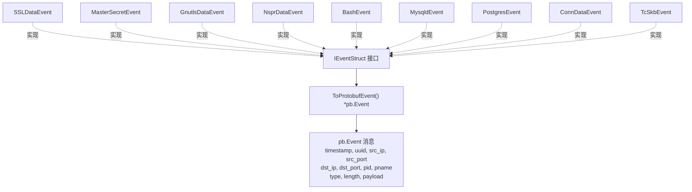
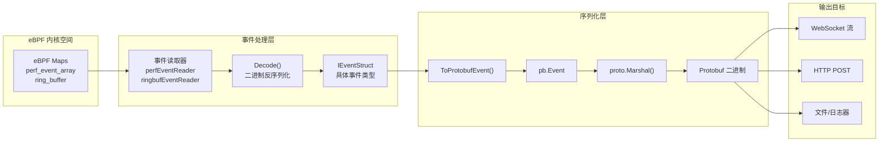
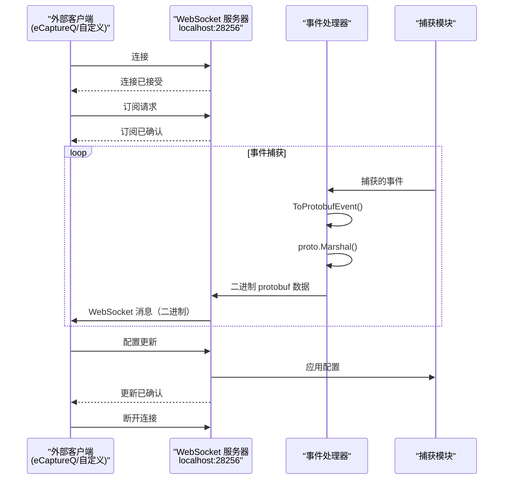
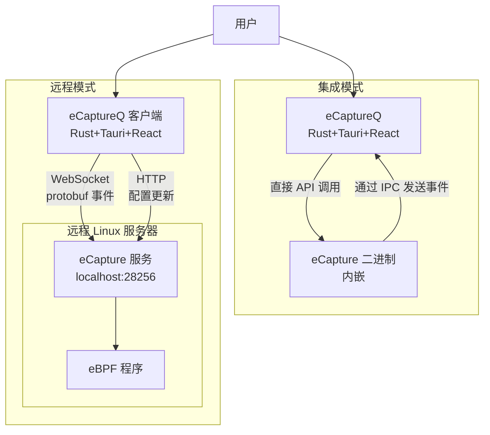
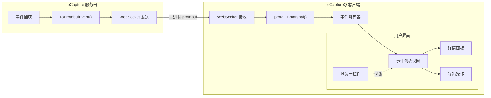

# Protobuf 与外部集成

## 目的与范围

本文档描述 eCapture 基于 protobuf 的事件序列化和外部集成能力。它涵盖了如何将捕获的事件转换为 Protocol Buffer 格式以传输到外部系统、用于实时事件转发的 WebSocket 流协议，以及与 eCaptureQ 图形用户界面的集成。

有关基于文本的输出格式的信息，请参阅[文本输出模式](4.1-text-output-mode.md)。有关 PCAP 文件生成，请参阅[PCAP 集成](4.2-pcap-integration.md)。有关通过 HTTP API 进行配置管理，请参阅[配置系统](../2-architecture/2.3-configuration-system.md)。

---

## Protobuf 事件模式

### 事件接口与序列化

eCapture 中的所有事件类型都实现了 `IEventStruct` 接口，该接口包含用于序列化的 `ToProtobufEvent()` 方法。这种标准化方法使得无论来自哪个模块，都能以统一的方式将事件传输到外部系统。

**图示：事件序列化接口**



来源：[user/event/event_openssl.go:237-266](https://github.com/gojue/ecapture/blob/0766a93b/user/event/event_openssl.go#L237-L266), [user/event/event_masterkey.go:123-137](https://github.com/gojue/ecapture/blob/0766a93b/user/event/event_masterkey.go#L123-L137), [user/event/event_gnutls.go:125-138](https://github.com/gojue/ecapture/blob/0766a93b/user/event/event_gnutls.go#L125-L138), [user/event/event_nspr.go:143-157](https://github.com/gojue/ecapture/blob/0766a93b/user/event/event_nspr.go#L143-L157), [user/event/event_bash.go:103-117](https://github.com/gojue/ecapture/blob/0766a93b/user/event/event_bash.go#L103-L117), [user/event/event_mysqld.go:138-152](https://github.com/gojue/ecapture/blob/0766a93b/user/event/event_mysqld.go#L138-L152), [user/event/event_postgres.go:87-102](https://github.com/gojue/ecapture/blob/0766a93b/user/event/event_postgres.go#L87-L102)

### Protobuf 事件结构

统一的 `pb.Event` protobuf 消息包含以下字段：

| 字段 | 类型 | 描述 |
|-------|------|-------------|
| `timestamp` | int64 | 事件时间戳，纳秒（Unix 纪元） |
| `uuid` | string | 唯一事件标识符（因事件类型而异） |
| `src_ip` | string | 源 IP 地址（如果可用） |
| `src_port` | uint32 | 源端口号（如果可用） |
| `dst_ip` | string | 目标 IP 地址（如果可用） |
| `dst_port` | uint32 | 目标端口号（如果可用） |
| `pid` | int64 | 生成事件的进程 ID |
| `pname` | string | 进程名称（命令） |
| `type` | uint32 | 事件特定类型字段（因模块而异） |
| `length` | uint32 | 载荷长度（字节） |
| `payload` | bytes | 原始事件数据（因事件类型而异） |

来源：[user/event/event_openssl.go:237-266](https://github.com/gojue/ecapture/blob/0766a93b/user/event/event_openssl.go#L237-L266), [protobuf/PROTOCOLS.md](https://github.com/gojue/ecapture/blob/0766a93b/protobuf/PROTOCOLS.md)

### 事件类型转换

每种事件类型根据其数据结构以不同方式实现 `ToProtobufEvent()`：

**表：事件类型 Protobuf 映射**

| 事件类型 | UUID 格式 | Type 字段 | Payload 内容 | IP/端口可用 |
|------------|-------------|------------|-----------------|-------------------|
| `SSLDataEvent` | `sock:PID_TID_Comm_FD_DataType_Tuple_Sock` | 数据方向（0=接收, 1=发送） | SSL/TLS 明文 | 是（来自 tuple） |
| `MasterSecretEvent` | `ClientRandom`（十六进制） | TLS 版本 | Keylog 格式字符串 | 否（127.0.0.1:0） |
| `MasterSecretBSSLEvent` | `ClientRandom`（十六进制） | TLS 版本 | Keylog 格式字符串 | 否（127.0.0.1:0） |
| `GnutlsDataEvent` | `PID_TID_Comm_DataType` | 数据方向 | GnuTLS 明文 | 否（127.0.0.1:0） |
| `NsprDataEvent` | `PID_TID_Comm_DataType` | 数据方向 | NSS 明文 | 否（127.0.0.1:0） |
| `BashEvent` | `PID_UID_Comm` | Bash 事件类型 | 命令行 | 否（127.0.0.1:0） |
| `MysqldEvent` | `PID_Comm` | 返回值 | SQL 查询 | 否（127.0.0.1:0） |
| `PostgresEvent` | `PID_Comm` | 0 | SQL 查询 | 否（127.0.0.1:0） |
| `ConnDataEvent` | `PID_TID_Comm_FD` | 0 | 连接 tuple | 是（来自 tuple） |
| `TcSkbEvent` | `PID_Ifindex_Comm` | 0 | 网络数据包 | 否（127.0.0.1:0） |

来源：[user/event/event_openssl.go:237-266](https://github.com/gojue/ecapture/blob/0766a93b/user/event/event_openssl.go#L237-L266), [user/event/event_masterkey.go:123-137,242-256](), [user/event/event_gnutls.go:125-138](https://github.com/gojue/ecapture/blob/0766a93b/user/event/event_gnutls.go#L125-L138), [user/event/event_nspr.go:143-157](https://github.com/gojue/ecapture/blob/0766a93b/user/event/event_nspr.go#L143-L157), [user/event/event_bash.go:103-117](https://github.com/gojue/ecapture/blob/0766a93b/user/event/event_bash.go#L103-L117), [user/event/event_mysqld.go:138-152](https://github.com/gojue/ecapture/blob/0766a93b/user/event/event_mysqld.go#L138-L152), [user/event/event_postgres.go:87-102](https://github.com/gojue/ecapture/blob/0766a93b/user/event/event_postgres.go#L87-L102), [user/event/event_openssl_tc.go:99-113](https://github.com/gojue/ecapture/blob/0766a93b/user/event/event_openssl_tc.go#L99-L113)

---

## 事件序列化架构

### 序列化流程

事件从 eBPF 程序流经事件处理流程，并可选择性地序列化为 protobuf 格式以进行外部传输。

**图示：Protobuf 序列化流程**



来源：[user/event/event_openssl.go:237-266](https://github.com/gojue/ecapture/blob/0766a93b/user/event/event_openssl.go#L237-L266), [pkg/event_processor/base_event.go:185-194](https://github.com/gojue/ecapture/blob/0766a93b/pkg/event_processor/base_event.go#L185-L194)

### 实现细节

`ToProtobufEvent()` 方法在所有事件类型中遵循一致的模式：

1. **创建 protobuf 消息**：实例化 `pb.Event` 结构
2. **填充公共字段**：设置时间戳、UUID、PID、进程名称
3. **解析连接信息**：在可用时提取 IP 地址和端口（来自 tuple 字符串）
4. **设置事件特定字段**：根据事件内容填充 `type`、`length` 和 `payload`
5. **返回指针**：返回 `*pb.Event` 以进行编组

**示例：SSLDataEvent Protobuf 转换**

```
// SSLDataEvent.ToProtobufEvent() 实现模式：
1. 使用时间戳和 UUID 创建 pb.Event
2. 解析 tuple 字符串格式 "IP:Port-IP:Port"
3. 拆分为源和目标部分
4. 提取 IP 地址和端口号
5. 从 Data[:DataLen] 设置载荷
6. 返回 protobuf 事件指针
```

来源：[user/event/event_openssl.go:237-266](https://github.com/gojue/ecapture/blob/0766a93b/user/event/event_openssl.go#L237-L266)

### IP 地址和端口提取

具有网络连接信息的事件（主要来自 TLS/SSL 模块）从 tuple 字符串中提取 IP 地址和端口：

**Tuple 格式解析逻辑**：
- **IPv4 格式**：`192.168.1.1:443-10.0.0.1:54321`
- **IPv6 格式**：`[2001:db8::1]:443-[fe80::1]:54321`
- **解析步骤**：
  1. 按 `-` 分隔符拆分以分离源和目标
  2. 将每个部分按 `:` 拆分以分离 IP 和端口
  3. 处理 IPv6 括号表示法
  4. 将端口字符串转换为 uint32

来源：[user/event/event_openssl.go:245-263](https://github.com/gojue/ecapture/blob/0766a93b/user/event/event_openssl.go#L245-L263), [user/event/event_openssl.go:361-379](https://github.com/gojue/ecapture/blob/0766a93b/user/event/event_openssl.go#L361-L379)

---

## WebSocket 流协议

### 服务器架构

eCapture 提供 WebSocket 服务器用于实时事件流传输到外部客户端。该服务器默认在 `localhost:28256` 上运行，并实现用于事件传输和配置更新的双向协议。

**图示：WebSocket 通信架构**



来源：[CHANGELOG.md:82-87](https://github.com/gojue/ecapture/blob/0766a93b/CHANGELOG.md#L82-L87), [README.md:322-327](https://github.com/gojue/ecapture/blob/0766a93b/README.md#L322-L327)

### WebSocket 消息格式

WebSocket 协议使用包含 protobuf 序列化事件的二进制帧：

| 组件 | 描述 |
|-----------|-------------|
| **帧类型** | 二进制（0x02） |
| **载荷** | Protobuf 编码的 `pb.Event` 消息 |
| **编码** | Protocol Buffers 二进制格式 |
| **压缩** | 可选（在握手期间协商） |

**消息流模式**：
1. **心跳**：定期 ping/pong 以维护连接
2. **事件流**：protobuf 编码事件的连续流
3. **控制消息**：配置更新和订阅管理

来源：[CHANGELOG.md:82-87](https://github.com/gojue/ecapture/blob/0766a93b/CHANGELOG.md#L82-L87)

### 事件转发配置

可以配置 WebSocket 服务器以选择性地转发事件：

- **模块过滤**：仅从特定模块转发事件（tls、gotls 等）
- **进程过滤**：按 PID 或 UID 过滤
- **事件类型过滤**：选择特定事件类型（数据、主密钥、连接）
- **速率限制**：控制事件传输速率以防止客户端过载

来源：[README.md:322-327](https://github.com/gojue/ecapture/blob/0766a93b/README.md#L322-L327), [docs/event-forward-api.md](https://github.com/gojue/ecapture/blob/0766a93b/docs/event-forward-api.md)

---

## eCaptureQ 集成

### 远程模式架构

eCaptureQ 是一个跨平台的 GUI 客户端，用于可视化 eCapture 事件。它以两种模式运行：

**图示：eCaptureQ 集成模式**



来源：[README.md:267-281](https://github.com/gojue/ecapture/blob/0766a93b/README.md#L267-L281), [README_CN.md:267-281](https://github.com/gojue/ecapture/blob/0766a93b/README_CN.md#L267-L281)

### 远程模式通信协议

在远程模式下，eCaptureQ 通过两个通道与 eCapture 通信：

**1. WebSocket 事件流（二进制）**
- **端点**：`ws://host:28256/ws`
- **协议**：带 protobuf 二进制帧的 WebSocket
- **目的**：从 eCapture 到 GUI 的实时事件流
- **流向**：服务器 → 客户端（事件单向）

**2. HTTP 配置 API（JSON）**
- **端点**：`http://host:28256/config`
- **协议**：带 JSON 载荷的 RESTful HTTP
- **目的**：运行时配置更新
- **流向**：客户端 → 服务器（请求/响应）

来源：[README.md:322-327](https://github.com/gojue/ecapture/blob/0766a93b/README.md#L322-L327), [docs/remote-config-update-api.md](https://github.com/gojue/ecapture/blob/0766a93b/docs/remote-config-update-api.md)

### 事件可视化流程

eCaptureQ 处理 protobuf 事件以进行可视化：

**图示：eCaptureQ 事件处理**



来源：[README.md:287-302](https://github.com/gojue/ecapture/blob/0766a93b/README.md#L287-L302)

### 协议文档

完整的 protobuf 模式定义和协议规范记录在：

- **英文**：[protobuf/PROTOCOLS.md](https://github.com/gojue/ecapture/blob/0766a93b/protobuf/PROTOCOLS.md)
- **中文**：[protobuf/PROTOCOLS_CN.md](https://github.com/gojue/ecapture/blob/0766a93b/protobuf/PROTOCOLS_CN.md)

这些文档详细说明了：
- 消息字段定义
- 事件类型枚举
- 序列化示例
- 版本兼容性指南

来源：[README.md:304-308](https://github.com/gojue/ecapture/blob/0766a93b/README.md#L304-L308), [README_CN.md:283-287](https://github.com/gojue/ecapture/blob/0766a93b/README_CN.md#L283-L287)

---

## 外部系统的 HTTP API

### 配置更新 API

eCapture 在 `localhost:28256` 上公开 HTTP API 用于运行时配置管理。这使得外部系统能够动态控制捕获行为，而无需重启进程。

**API 端点**：

| 方法 | 端点 | 目的 | 请求格式 |
|--------|----------|---------|----------------|
| GET | `/config` | 检索当前配置 | N/A |
| POST | `/config` | 更新配置参数 | JSON |
| GET | `/status` | 查询模块状态 | N/A |

**配置更新示例**：
```json
POST /config
{
  "pid": 1234,
  "uid": 1000,
  "btf_mode": 0,
  "log_level": "info"
}
```

来源：[README.md:322-324](https://github.com/gojue/ecapture/blob/0766a93b/README.md#L322-L324), [docs/remote-config-update-api.md](https://github.com/gojue/ecapture/blob/0766a93b/docs/remote-config-update-api.md)

### 事件转发 API

外部系统可以通过 HTTP POST 回调接收事件：

**转发配置**：
```json
POST /config
{
  "event_forward": {
    "enabled": true,
    "url": "http://external-system:8080/events",
    "format": "protobuf",
    "modules": ["tls", "gotls"],
    "batch_size": 100,
    "batch_timeout_ms": 1000
  }
}
```

**事件 POST 格式**：
- **Content-Type**：`application/x-protobuf` 或 `application/json`
- **Body**：Protobuf 二进制或 JSON 序列化事件
- **Headers**：用于认证/路由的自定义标头

来源：[README.md:325-327](https://github.com/gojue/ecapture/blob/0766a93b/README.md#L325-L327), [docs/event-forward-api.md](https://github.com/gojue/ecapture/blob/0766a93b/docs/event-forward-api.md)

### 安全考虑

默认情况下，HTTP API 绑定到 `localhost:28256` 以确保安全：

1. **仅本地访问**：默认仅接受 localhost 连接
2. **无认证**：依赖于 OS 级别的进程隔离
3. **远程访问**：需要 SSH 隧道或反向代理配置
4. **速率限制**：可配置请求速率限制以防止滥用

对于远程访问，使用 SSH 端口转发：
```bash
ssh -L 28256:localhost:28256 user@remote-host
```

来源：[README.md:82-85](https://github.com/gojue/ecapture/blob/0766a93b/README.md#L82-L85), [README_CN.md:83-88](https://github.com/gojue/ecapture/blob/0766a93b/README_CN.md#L83-L88)

---

## 集成示例

### 自定义客户端实现

实现自定义 protobuf 客户端需要：

1. **Protobuf 定义**：导入或编译 `protobuf/gen/v1/event.proto`
2. **WebSocket 连接**：建立到 `ws://host:28256/ws` 的连接
3. **二进制反序列化**：使用特定语言的 protobuf 库进行反编组
4. **事件处理**：根据 `type` 和 `uuid` 字段处理事件

**Python 示例模式**：
```python
# 1. 导入生成的 protobuf 类
from ecapture.protobuf.gen.v1 import event_pb2

# 2. 连接到 WebSocket
ws = websocket.WebSocketApp("ws://localhost:28256/ws")

# 3. 处理二进制消息
def on_message(ws, message):
    event = event_pb2.Event()
    event.ParseFromString(message)
    # 处理事件字段
    print(f"PID: {event.pid}, Payload: {event.payload}")
```

来源：[CHANGELOG.md:16](https://github.com/gojue/ecapture/blob/0766a93b/CHANGELOG.md#L16)

### Burp Suite 集成

eCapture 可以将 HTTP/HTTPS 事件转发到 Burp Suite 进行安全分析：

**配置**：
```json
POST /config
{
  "event_forward": {
    "enabled": true,
    "url": "http://localhost:8080",
    "format": "http_proxy",
    "modules": ["tls", "gotls"],
    "filter": {
      "protocols": ["http", "https"]
    }
  }
}
```

事件载荷被重构为 HTTP 请求/响应并转发到 Burp 的代理端口。

来源：[README.md:325-327](https://github.com/gojue/ecapture/blob/0766a93b/README.md#L325-L327), [docs/event-forward-api.md](https://github.com/gojue/ecapture/blob/0766a93b/docs/event-forward-api.md)

### 监控系统集成

将 eCapture 与监控平台（Prometheus、Grafana、ELK）集成：

**指标导出模式**：
1. **WebSocket 订阅者**：消费 protobuf 事件
2. **指标聚合**：按类型、PID、协议统计事件
3. **时序导出**：将指标推送到 Prometheus/InfluxDB
4. **告警**：在异常模式上触发告警（例如，不寻常的 SQL 查询）

**示例指标**：
- `ecapture_events_total{module="tls", pid="1234"}` - 事件计数器
- `ecapture_payload_bytes{module="tls"}` - 捕获的总字节数
- `ecapture_connections_active` - 活动连接数

来源：[README.md:325-327](https://github.com/gojue/ecapture/blob/0766a93b/README.md#L325-L327)

---

## 实现说明

### 事件批处理

对于高吞吐量场景，可以在 protobuf 序列化之前批处理事件：

- **批大小**：可配置（默认：100 个事件）
- **超时**：刷新部分批次前的最大等待时间（默认：1 秒）
- **压缩**：批处理消息的可选 gzip 压缩
- **排序**：批次内的事件保持基于时间戳的排序

来源：[docs/event-forward-api.md](https://github.com/gojue/ecapture/blob/0766a93b/docs/event-forward-api.md)

### 版本兼容性

protobuf 模式使用字段编号来确保向后/向前兼容性：

- **新字段**：可以添加而不会破坏现有客户端
- **弃用字段**：标记但不删除以保持兼容性
- **版本头**：WebSocket 握手包含协议版本
- **优雅降级**：较旧的客户端忽略未知字段

来源：[protobuf/PROTOCOLS.md](https://github.com/gojue/ecapture/blob/0766a93b/protobuf/PROTOCOLS.md)

### 性能优化

Protobuf 序列化针对性能进行了优化：

- **零拷贝**：在可能的情况下，载荷字节被引用而不是复制
- **池分配**：事件对象被池化以减少 GC 压力
- **异步编组**：序列化在后台 goroutine 中进行
- **缓冲区大小**：基于典型事件大小预分配缓冲区

来源：[user/event/event_openssl.go:237-266](https://github.com/gojue/ecapture/blob/0766a93b/user/event/event_openssl.go#L237-L266)