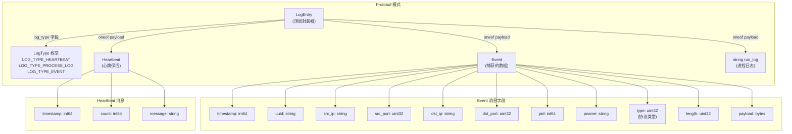
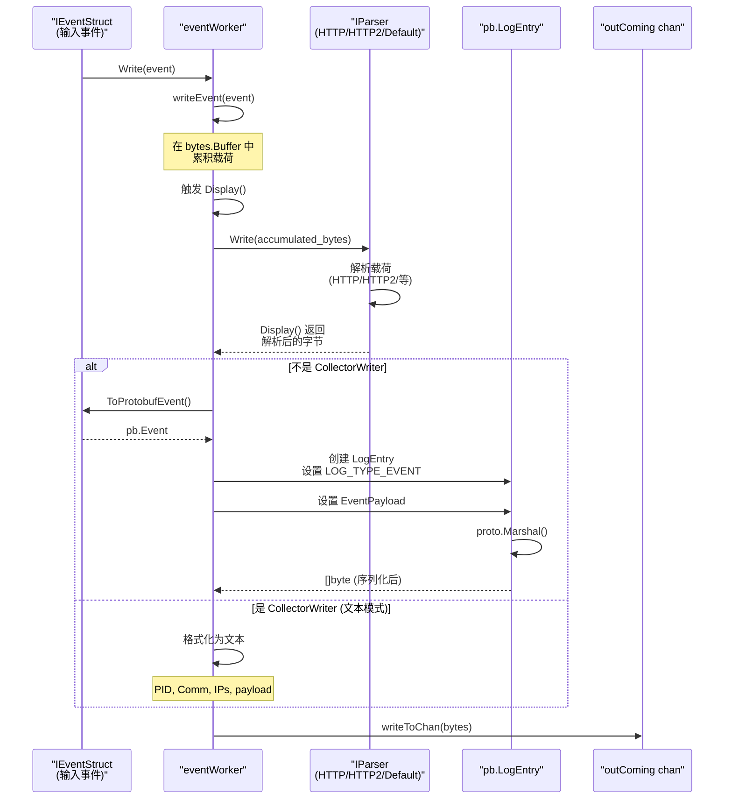
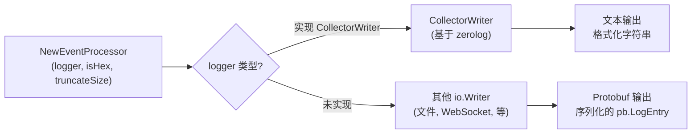
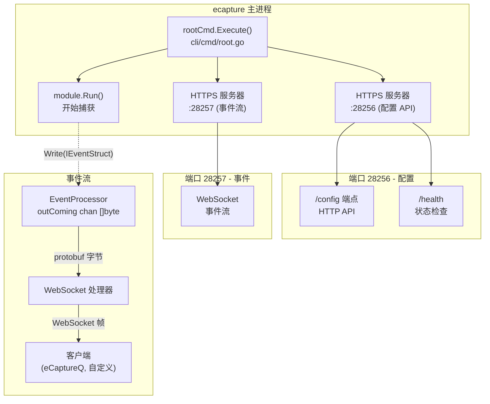
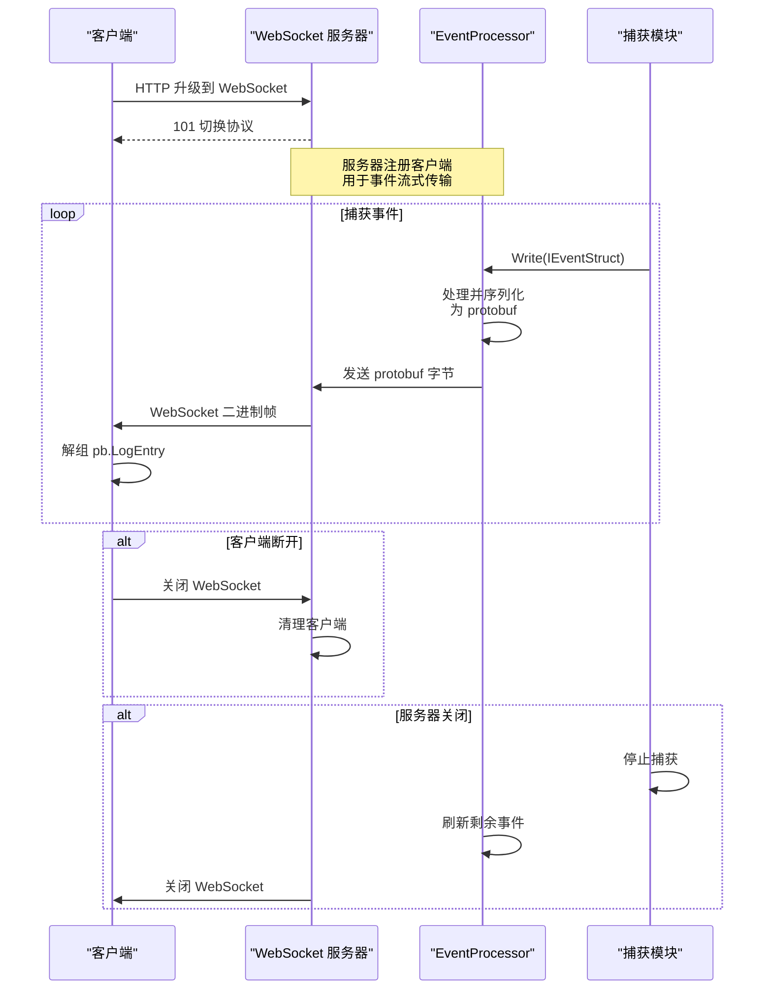
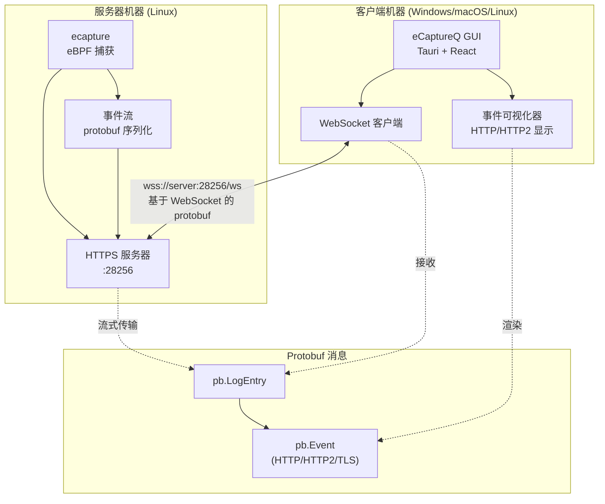
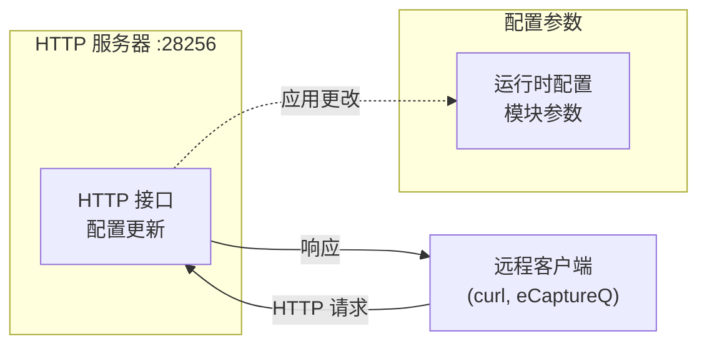
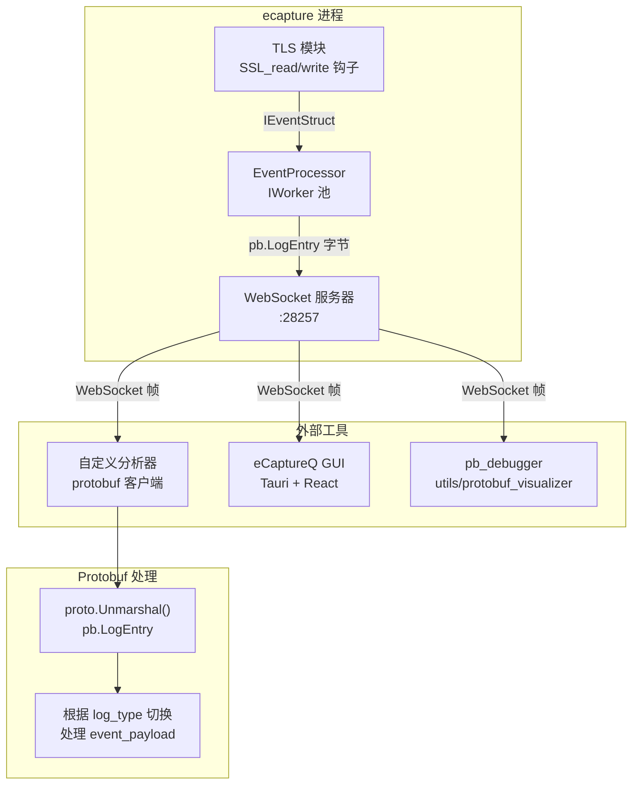
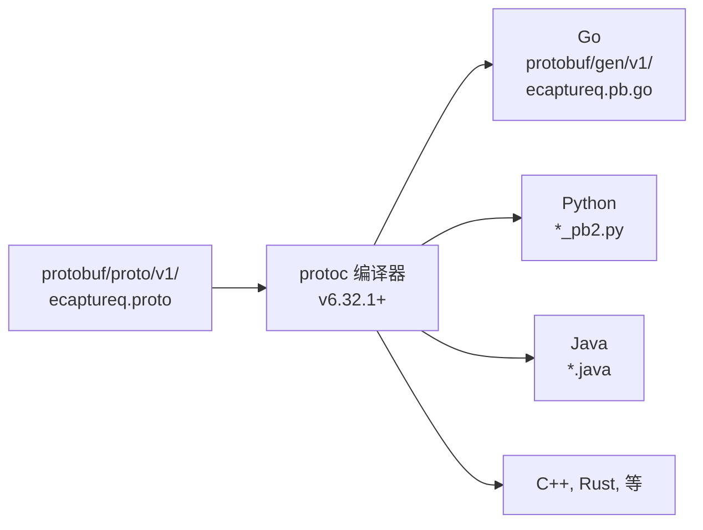
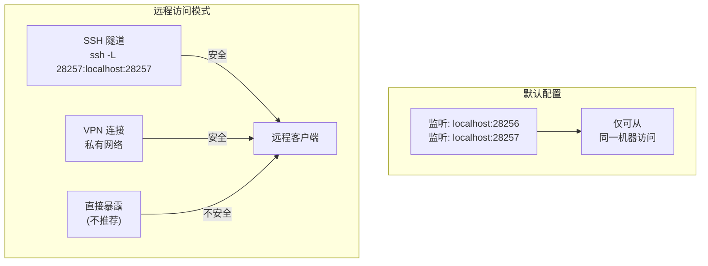

# Protobuf 与外部集成

## 目的与范围

本文档描述 ecapture 基于 protobuf 的事件序列化格式和外部集成能力。从版本 0.8.0 开始，ecapture 通过 Protocol Buffers 提供结构化事件流，支持与外部工具、图形界面和分析平台的实时集成。有关基于文本的控制台输出信息，请参阅 [4.1 文本输出模式](4.1-text-output-mode.md)。有关 PCAP 文件生成，请参阅 [4.2 PCAP 集成](4.2-pcap-integration.md)。

protobuf 格式支持：
- 结构化事件序列化，便于程序化处理
- WebSocket 流式传输，用于实时事件交付
- 与 eCaptureQ 图形界面集成
- HTTP API 用于远程配置和事件转发
- 与 Burp Suite 等工具的兼容性，用于安全分析

## Protobuf 事件结构

### LogEntry 和 Event 模式

ecapture 使用在 `protobuf/proto/v1/ecaptureq.proto` 中定义的分层 protobuf 模式，所有输出都封装在 `LogEntry` 消息中。该模式通过 `LogType` 枚举支持三种类型的日志条目：


```mermaid
graph TB
    subgraph "Protobuf 模式"
        LogEntry["LogEntry<br/>(顶层封装器)"]
        LogType["LogType 枚举<br/>LOG_TYPE_HEARTBEAT<br/>LOG_TYPE_PROCESS_LOG<br/>LOG_TYPE_EVENT"]
        EventPayload["Event<br/>(捕获的数据)"]
        HeartbeatPayload["Heartbeat<br/>(心跳保活)"]
        LogPayload["string run_log<br/>(进程日志)"]
        
        LogEntry -->|"log_type 字段"| LogType
        LogEntry -->|"oneof payload"| EventPayload
        LogEntry -->|"oneof payload"| HeartbeatPayload
        LogEntry -->|"oneof payload"| LogPayload
    end
    
    subgraph "Event 消息字段"
        EventPayload --> Timestamp["timestamp: int64"]
        EventPayload --> UUID["uuid: string"]
        EventPayload --> SrcIP["src_ip: string"]
        EventPayload --> SrcPort["src_port: uint32"]
        EventPayload --> DstIP["dst_ip: string"]
        EventPayload --> DstPort["dst_port: uint32"]
        EventPayload --> PID["pid: int64"]
        EventPayload --> PName["pname: string"]
        EventPayload --> Type["type: uint32<br/>(协议类型)"]
        EventPayload --> Length["length: uint32"]
        EventPayload --> Payload["payload: bytes"]
    end
    
    subgraph "Heartbeat 消息"
        HeartbeatPayload --> HBTimestamp["timestamp: int64"]
        HeartbeatPayload --> HBCount["count: int64"]
        HeartbeatPayload --> HBMessage["message: string"]
    end
```

**Protobuf 消息结构层次**

来源：[protobuf/PROTOCOLS.md:14-62](https://github.com/gojue/ecapture/blob/ca085d05/protobuf/PROTOCOLS.md#L14-L62), [pkg/event_processor/iworker.go:214-227](https://github.com/gojue/ecapture/blob/ca085d05/pkg/event_processor/iworker.go#L214-L227), [user/event/ievent.go:41-52](https://github.com/gojue/ecapture/blob/ca085d05/user/event/ievent.go#L41-L52)

### 事件类型枚举

`Event` 消息中的 `type` 字段对应于 [pkg/event_processor/iparser.go:25-47](https://github.com/gojue/ecapture/blob/ca085d05/pkg/event_processor/iparser.go#L25-L47) 中定义的 `ParserType` 枚举，指示应如何解释载荷：

| ParserType 值 | 常量名称 | 描述 |
|--------------|---------|------|
| 0 | `ParserTypeNull` | 原始二进制数据，未应用解析（DefaultParser） |
| 1 | `ParserTypeHttpRequest` | HTTP/1.x 请求 |
| 2 | `ParserTypeHttp2Request` | HTTP/2 请求，带 HPACK 解压缩 |
| 3 | `ParserTypeHttpResponse` | HTTP/1.x 响应 |
| 4 | `ParserTypeHttp2Response` | HTTP/2 响应，带 HPACK 解压缩 |
| 5 | `ParserTypeWebSocket` | WebSocket 帧 |

解析器类型在 `NewParser()` 函数 [pkg/event_processor/iparser.go:85-115](https://github.com/gojue/ecapture/blob/ca085d05/pkg/event_processor/iparser.go#L85-L115) 中通过内容检测动态确定。对载荷调用每个注册解析器的 `detect()` 方法，第一个成功匹配的解析器决定解析器类型。如果没有解析器匹配，则使用 `DefaultParser` 并设置 `ParserTypeNull`。

来源：[pkg/event_processor/iparser.go:25-115](https://github.com/gojue/ecapture/blob/ca085d05/pkg/event_processor/iparser.go#L25-L115), [pkg/event_processor/iworker.go:203-218](https://github.com/gojue/ecapture/blob/ca085d05/pkg/event_processor/iworker.go#L203-L218), [protobuf/PROTOCOLS.md:34-40](https://github.com/gojue/ecapture/blob/ca085d05/protobuf/PROTOCOLS.md#L34-L40)

## 流水线中的事件序列化

### EventProcessor 到 Protobuf 的转换

当事件流经事件处理流水线时，它们在输出阶段被转换为 protobuf 格式。转换发生在 `eventWorker.Display()` 方法中：


```mermaid
sequenceDiagram
    participant IEventStruct as "IEventStruct<br/>(输入事件)"
    participant Worker as "eventWorker"
    participant Parser as "IParser<br/>(HTTP/HTTP2/Default)"
    participant LogEntry as "pb.LogEntry"
    participant Output as "outComing chan"
    
    IEventStruct->>Worker: Write(event)
    Worker->>Worker: writeEvent(event)
    Note over Worker: 在 bytes.Buffer 中<br/>累积载荷
    
    Worker->>Worker: 触发 Display()
    Worker->>Parser: Write(accumulated_bytes)
    Parser->>Parser: 解析载荷<br/>(HTTP/HTTP2/等)
    Parser-->>Worker: Display() 返回<br/>解析后的字节
    
    alt 不是 CollectorWriter
        Worker->>IEventStruct: ToProtobufEvent()
        IEventStruct-->>Worker: pb.Event
        Worker->>LogEntry: 创建 LogEntry<br/>设置 LOG_TYPE_EVENT
        Worker->>LogEntry: 设置 EventPayload
        LogEntry->>LogEntry: proto.Marshal()
        LogEntry-->>Worker: []byte (序列化后)
    else 是 CollectorWriter (文本模式)
        Worker->>Worker: 格式化为文本
        Note over Worker: PID, Comm, IPs, payload
    end
    
    Worker->>Output: writeToChan(bytes)
```

**事件到 Protobuf 的转换序列**

关键区别在于配置的 logger 是否实现了 `CollectorWriter` 接口。如果没有，事件将被序列化为 protobuf；否则，它们被格式化为人类可读的文本。

来源：[pkg/event_processor/iworker.go:174-228](https://github.com/gojue/ecapture/blob/ca085d05/pkg/event_processor/iworker.go#L174-L228), [user/event/ievent.go:54-70](https://github.com/gojue/ecapture/blob/ca085d05/user/event/ievent.go#L54-L70)

### Protobuf 与文本模式选择

输出模式由传递给 `NewEventProcessor()` 的 logger 类型决定：


```mermaid
graph LR
    NewEventProcessor["NewEventProcessor<br/>(logger, isHex, truncateSize)"]
    
    LoggerCheck{"logger 类型?"}
    
    CollectorWriter["CollectorWriter<br/>(基于 zerolog)"]
    OtherWriter["其他 io.Writer<br/>(文件, WebSocket, 等)"]
    
    TextOutput["文本输出<br/>格式化字符串"]
    ProtobufOutput["Protobuf 输出<br/>序列化的 pb.LogEntry"]
    
    NewEventProcessor --> LoggerCheck
    LoggerCheck -->|"实现 CollectorWriter"| CollectorWriter
    LoggerCheck -->|"未实现"| OtherWriter
    
    CollectorWriter --> TextOutput
    OtherWriter --> ProtobufOutput
```

**Logger 类型决定序列化格式**

这种设计允许相同的事件处理流水线同时服务于人类可读的控制台输出和结构化的 protobuf 流式传输，而无需代码重复。

来源：[pkg/event_processor/iworker.go:198-228](https://github.com/gojue/ecapture/blob/ca085d05/pkg/event_processor/iworker.go#L198-L228), [pkg/event_processor/processor.go:206-215](https://github.com/gojue/ecapture/blob/ca085d05/pkg/event_processor/processor.go#L206-L215)

## WebSocket 流式传输服务器

### 服务器架构

从版本 0.8.0 开始，ecapture 包含一个嵌入式 HTTPS 服务器，提供 WebSocket 端点用于实时事件流式传输。服务器与捕获模块并发运行，监听两个端口：


```mermaid
graph TB
    subgraph "ecapture 主进程"
        RootCmd["rootCmd.Execute()<br/>cli/cmd/root.go"]
        ModuleRun["module.Run()<br/>开始捕获"]
        HTTPServer1["HTTPS 服务器<br/>:28256 (配置 API)"]
        HTTPServer2["HTTPS 服务器<br/>:28257 (事件流)"]
        
        RootCmd --> ModuleRun
        RootCmd --> HTTPServer1
        RootCmd --> HTTPServer2
    end
    
    subgraph "端口 28256 - 配置"
        ConfigAPI["/config 端点<br/>HTTP API"]
        HealthAPI["/health<br/>状态检查"]
        
        HTTPServer1 --> ConfigAPI
        HTTPServer1 --> HealthAPI
    end
    
    subgraph "端口 28257 - 事件"
        WSEndpoint["WebSocket<br/>事件流"]
        
        HTTPServer2 --> WSEndpoint
    end
    
    subgraph "事件流"
        EventProcessor["EventProcessor<br/>outComing chan []byte"]
        WSHandler["WebSocket 处理器"]
        Client["客户端<br/>(eCaptureQ, 自定义)"]
        
        EventProcessor -->|"protobuf 字节"| WSHandler
        WSHandler -->|"WebSocket 帧"| Client
    end
    
    ModuleRun -.->|"Write(IEventStruct)"| EventProcessor
```

**嵌入式 HTTPS 服务器架构**

服务器默认监听 `localhost:28256` 用于配置，`localhost:28257` 用于事件流式传输（可通过 `--listen` 标志配置）。关注点分离允许 HTTP API 访问而不会干扰高吞吐量的事件流。

来源：[README_JA.md:83-89](https://github.com/gojue/ecapture/blob/ca085d05/README_JA.md#L83-L89), [pkg/event_processor/processor.go:30-50](https://github.com/gojue/ecapture/blob/ca085d05/pkg/event_processor/processor.go#L30-L50), [pkg/event_processor/iworker.go:164-172](https://github.com/gojue/ecapture/blob/ca085d05/pkg/event_processor/iworker.go#L164-L172)

### WebSocket 协议

客户端连接到端口 28257 的 WebSocket 端点，并接收 protobuf 序列化的 `LogEntry` 消息的连续流。每个 WebSocket 消息包含恰好一个作为二进制数据封送的 `pb.LogEntry`：

| 字段 | 类型 | 描述 |
|------|------|------|
| WebSocket 消息 | 二进制 | 包含一个通过 `proto.Marshal()` 封送的 `pb.LogEntry` |
| `LogEntry.log_type` | 枚举 | `LOG_TYPE_EVENT`, `LOG_TYPE_HEARTBEAT`, 或 `LOG_TYPE_PROCESS_LOG` |
| `LogEntry.event_payload` | `pb.Event` | 当 `log_type == LOG_TYPE_EVENT` 时存在 |
| `LogEntry.heartbeat_payload` | `pb.Heartbeat` | 当 `log_type == LOG_TYPE_HEARTBEAT` 时存在 |
| `LogEntry.run_log` | string | 当 `log_type == LOG_TYPE_PROCESS_LOG` 时存在 |

**客户端集成步骤：**

1. 建立到 `ws://localhost:28257/` 的 WebSocket 连接（或 `wss://` 用于 TLS）
2. 持续读取二进制 WebSocket 消息
3. 使用 `proto.Unmarshal()` 将每条消息解组为 `pb.LogEntry`
4. 根据 `log_type` 切换以确定哪个载荷字段包含数据
5. 对于 `LOG_TYPE_EVENT`，访问 `event_payload` 以获取捕获的数据

protobuf 封送发生在 [pkg/event_processor/iworker.go:222-226](https://github.com/gojue/ecapture/blob/ca085d05/pkg/event_processor/iworker.go#L222-L226)，其中 `proto.Marshal(le)` 在发送到 `outComing` 通道之前序列化 `LogEntry`。

来源：[pkg/event_processor/iworker.go:214-227](https://github.com/gojue/ecapture/blob/ca085d05/pkg/event_processor/iworker.go#L214-L227), [protobuf/PROTOCOLS.md:54-62](https://github.com/gojue/ecapture/blob/ca085d05/protobuf/PROTOCOLS.md#L54-L62), [protobuf/PROTOCOLS.md:68-96](https://github.com/gojue/ecapture/blob/ca085d05/protobuf/PROTOCOLS.md#L68-L96)

### 连接生命周期


```mermaid
sequenceDiagram
    participant Client as "客户端"
    participant WSServer as "WebSocket 服务器"
    participant EventProc as "EventProcessor"
    participant Module as "捕获模块"
    
    Client->>WSServer: HTTP 升级到 WebSocket
    WSServer-->>Client: 101 切换协议
    
    Note over WSServer,EventProc: 服务器注册客户端<br/>用于事件流式传输
    
    loop 捕获事件
        Module->>EventProc: Write(IEventStruct)
        EventProc->>EventProc: 处理并序列化<br/>为 protobuf
        EventProc->>WSServer: 发送 protobuf 字节
        WSServer->>Client: WebSocket 二进制帧
        Client->>Client: 解组 pb.LogEntry
    end
    
    alt 客户端断开
        Client->>WSServer: 关闭 WebSocket
        WSServer->>WSServer: 清理客户端
    end
    
    alt 服务器关闭
        Module->>Module: 停止捕获
        EventProc->>EventProc: 刷新剩余事件
        WSServer->>Client: 关闭 WebSocket
    end
```

**WebSocket 连接生命周期**

来源：[CHANGELOG.md:82-89](https://github.com/gojue/ecapture/blob/ca085d05/CHANGELOG.md#L82-L89)

## eCaptureQ GUI 集成

### 远程模式架构

[eCaptureQ](https://github.com/gojue/ecaptureq) 是 ecapture 的官方跨平台 GUI 客户端。它连接到 ecapture 的 WebSocket 端点以接收事件并提供实时可视化。远程模式架构使 Windows/macOS 客户端能够连接到 Linux 服务器：


```mermaid
graph TB
    subgraph "客户端机器 (Windows/macOS/Linux)"
        eCaptureQ["eCaptureQ GUI<br/>Tauri + React"]
        WSClient["WebSocket 客户端"]
        Visualizer["事件可视化器<br/>HTTP/HTTP2 显示"]
        
        eCaptureQ --> WSClient
        eCaptureQ --> Visualizer
    end
    
    subgraph "服务器机器 (Linux)"
        ecapture["ecapture<br/>eBPF 捕获"]
        HTTPSServer["HTTPS 服务器<br/>:28256"]
        EventStream["事件流<br/>protobuf 序列化"]
        
        ecapture --> HTTPSServer
        ecapture --> EventStream
        EventStream --> HTTPSServer
    end
    
    WSClient <-->|"wss://server:28256/ws<br/>基于 WebSocket 的 protobuf"| HTTPSServer
    
    subgraph "Protobuf 消息"
        LogEntry["pb.LogEntry"]
        Event["pb.Event<br/>(HTTP/HTTP2/TLS)"]
        
        LogEntry --> Event
    end
    
    HTTPSServer -.->|"流式传输"| LogEntry
    WSClient -.->|"接收"| LogEntry
    Visualizer -.->|"渲染"| Event
```

**eCaptureQ 远程模式集成**

来源：[README.md:287-302](https://github.com/gojue/ecapture/blob/ca085d05/README.md#L287-L302), [README_CN.md:267-281](https://github.com/gojue/ecapture/blob/ca085d05/README_CN.md#L267-L281)

### 集成模式与远程模式

eCaptureQ 支持两种部署模型：

| 模式 | 描述 | 客户端平台 | 服务器平台 |
|------|------|-----------|-----------|
| **集成** | eCaptureQ 捆绑 ecapture 二进制并在本地运行 | Linux, Android | 不适用（仅本地） |
| **远程** | eCaptureQ 连接到远程 ecapture 服务器 | Windows, macOS, Linux | Linux, Android |

在集成模式下，eCaptureQ 生成 ecapture 进程并通过 localhost 连接到其 WebSocket 端点。在远程模式下，用户配置远程服务器地址，eCaptureQ 通过网络建立 WebSocket 连接。

来源：[README.md:293-296](https://github.com/gojue/ecapture/blob/ca085d05/README.md#L293-L296), [README_CN.md:273-276](https://github.com/gojue/ecapture/blob/ca085d05/README_CN.md#L273-L276)

## HTTP 配置 API

### 远程配置更新

ecapture 在端口 28256 上公开 HTTP 接口，用于在不重启捕获进程的情况下进行运行时配置更新。根据 [README_JA.md:88](https://github.com/gojue/ecapture/blob/ca085d05/README_JA.md#L88) 中的启动日志，服务器显示："You can update the configuration file via the HTTP interface."

**HTTP 配置接口**


```mermaid
graph LR
    subgraph "HTTP 服务器 :28256"
        HTTPInterface["HTTP 接口<br/>配置更新"]
    end
    
    subgraph "配置参数"
        RuntimeConfig["运行时配置<br/>模块参数"]
    end
    
    Client["远程客户端<br/>(curl, eCaptureQ)"]
    
    Client -->|"HTTP 请求"| HTTPInterface
    HTTPInterface -.->|"应用更改"| RuntimeConfig
    HTTPInterface -->|"响应"| Client
```

**HTTP 配置接口架构**

HTTP 接口允许在捕获运行时进行动态配置更新。特定的 API 端点和请求格式可能因版本而异。

来源：[README_JA.md:88](https://github.com/gojue/ecapture/blob/ca085d05/README_JA.md#L88), [README_JA.md:83-89](https://github.com/gojue/ecapture/blob/ca085d05/README_JA.md#L83-L89)

## 外部工具集成

### 自定义事件消费者

基于 protobuf 的事件流支持与自定义分析工具的集成。端口 28257 上的 WebSocket 端点提供了一个与语言无关的接口来消费捕获的事件：


```mermaid
graph TB
    subgraph "ecapture 进程"
        TLSCapture["TLS 模块<br/>SSL_read/write 钩子"]
        EventProc["EventProcessor<br/>IWorker 池"]
        WSServer["WebSocket 服务器<br/>:28257"]
        
        TLSCapture -->|"IEventStruct"| EventProc
        EventProc -->|"pb.LogEntry 字节"| WSServer
    end
    
    subgraph "外部工具"
        CustomAnalyzer["自定义分析器<br/>protobuf 客户端"]
        ECaptureQ["eCaptureQ GUI<br/>Tauri + React"]
        DebugTool["pb_debugger<br/>utils/protobuf_visualizer"]
        
        WSServer -->|"WebSocket 帧"| CustomAnalyzer
        WSServer -->|"WebSocket 帧"| ECaptureQ
        WSServer -->|"WebSocket 帧"| DebugTool
    end
    
    subgraph "Protobuf 处理"
        Unmarshal["proto.Unmarshal()<br/>pb.LogEntry"]
        EventHandler["根据 log_type 切换<br/>处理 event_payload"]
        
        CustomAnalyzer --> Unmarshal
        Unmarshal --> EventHandler
    end
```

**通过 WebSocket 的外部工具集成**

任何可以建立 WebSocket 连接并解析 protobuf 消息的工具都可以消费 ecapture 事件。`utils/protobuf_visualizer/` 中的参考实现演示了基本的消费模式。

来源：[utils/protobuf_visualizer/README.md:1-42](https://github.com/gojue/ecapture/blob/ca085d05/utils/protobuf_visualizer/README.md#L1-L42), [pkg/event_processor/iworker.go:214-227](https://github.com/gojue/ecapture/blob/ca085d05/pkg/event_processor/iworker.go#L214-L227)

### WebSocket 客户端示例

对于自定义集成，客户端可以直接连接到 ecapture 在端口 28257 上的 WebSocket 端点。`utils/protobuf_visualizer/pb_debugger.go` 中存在一个参考客户端实现，演示了集成模式：

**示例客户端流程（伪代码）**

```
import websocket
import protobuf_gen.ecaptureq_pb2 as pb

# 连接到事件流
ws = websocket.connect("ws://127.0.0.1:28257/")

while True:
    # 接收二进制消息
    message = ws.recv()
    
    # 解组 protobuf
    log_entry = pb.LogEntry()
    log_entry.ParseFromString(message)
    
    # 根据类型处理
    if log_entry.log_type == pb.LOG_TYPE_EVENT:
        event = log_entry.event_payload
        print(f"UUID: {event.uuid}")
        print(f"协议类型: {event.type}")
        print(f"PID: {event.pid} ({event.pname})")
        print(f"载荷长度: {event.length}")
        print(f"数据: {event.payload[:100]}...")
    elif log_entry.log_type == pb.LOG_TYPE_HEARTBEAT:
        hb = log_entry.heartbeat_payload
        print(f"心跳: count={hb.count}, msg={hb.message}")
```

[utils/protobuf_visualizer/pb_debugger.go](https://github.com/gojue/ecapture/blob/ca085d05/utils/protobuf_visualizer/pb_debugger.go) 中的 Go 参考实现展示了紧凑模式、十六进制显示和载荷截断的命令行选项。protobuf 模式定义记录在 [protobuf/PROTOCOLS.md](https://github.com/gojue/ecapture/blob/ca085d05/protobuf/PROTOCOLS.md) 中。

来源：[utils/protobuf_visualizer/README.md:1-42](https://github.com/gojue/ecapture/blob/ca085d05/utils/protobuf_visualizer/README.md#L1-L42), [protobuf/PROTOCOLS.md:68-96](https://github.com/gojue/ecapture/blob/ca085d05/protobuf/PROTOCOLS.md#L68-L96)

### Protobuf 模式生成

客户端必须从 `protobuf/proto/v1/ecaptureq.proto` 中的模式定义生成特定语言的 protobuf 绑定：


```mermaid
graph LR
    ProtoSource["protobuf/proto/v1/<br/>ecaptureq.proto"]
    ProtocCompiler["protoc 编译器<br/>v6.32.1+"]
    GoBindings["Go<br/>protobuf/gen/v1/<br/>ecaptureq.pb.go"]
    PythonBindings["Python<br/>*_pb2.py"]
    JavaBindings["Java<br/>*.java"]
    OtherBindings["C++, Rust, 等"]
    
    ProtoSource --> ProtocCompiler
    ProtocCompiler --> GoBindings
    ProtocCompiler --> PythonBindings
    ProtocCompiler --> JavaBindings
    ProtocCompiler --> OtherBindings
```

**多语言的 Protobuf 代码生成**

仓库在 [protobuf/gen/v1/ecaptureq.pb.go](https://github.com/gojue/ecapture/blob/ca085d05/protobuf/gen/v1/ecaptureq.pb.go) 中包含预生成的 Go 绑定。要重新生成或为其他语言创建绑定，请使用 [protobuf/README.md:24-42](https://github.com/gojue/ecapture/blob/ca085d05/protobuf/README.md#L24-L42) 中记录的 `protoc` 编译器：

```bash
protoc --proto_path=protobuf/proto \
       --go_out=protobuf/gen --go_opt=paths=source_relative \
       --go-grpc_out=protobuf/gen --go-grpc_opt=paths=source_relative \
       protobuf/proto/v1/ecaptureq.proto
```

对于其他语言，将 `--go_out` 替换为适当的插件（例如 `--python_out`, `--java_out` 等）。

来源：[protobuf/README.md:1-42](https://github.com/gojue/ecapture/blob/ca085d05/protobuf/README.md#L1-L42), [protobuf/PROTOCOLS.md:3-10](https://github.com/gojue/ecapture/blob/ca085d05/protobuf/PROTOCOLS.md#L3-L10), [pkg/event_processor/iworker.go:29](https://github.com/gojue/ecapture/blob/ca085d05/pkg/event_processor/iworker.go#L29)

## 集成安全考虑

### 网络绑定与访问控制

WebSocket 和 HTTP 服务器默认绑定到 `localhost`，将访问限制在本地机器：


```mermaid
graph TB
    subgraph "默认配置"
        Localhost["监听: localhost:28256<br/>监听: localhost:28257"]
        LocalOnly["仅可从<br/>同一机器访问"]
        
        Localhost --> LocalOnly
    end
    
    subgraph "远程访问模式"
        SSHTunnel["SSH 隧道<br/>ssh -L 28257:localhost:28257"]
        VPN["VPN 连接<br/>私有网络"]
        DirectExpose["直接暴露<br/>(不推荐)"]
        
        SSHTunnel -->|"安全"| RemoteClient["远程客户端"]
        VPN -->|"安全"| RemoteClient
        DirectExpose -->|"不安全"| RemoteClient
    end
```

**远程访问的安全最佳实践**

1. **仅本地绑定**：默认的 `localhost` 绑定防止网络暴露 [README_JA.md:83](https://github.com/gojue/ecapture/blob/ca085d05/README_JA.md#L83)
2. **SSH 隧道**：对于远程访问，使用 SSH 端口转发：
   ```bash
   ssh -L 28257:localhost:28257 user@remote-server
   ```
3. **root 权限要求**：ecapture 需要 root/CAP_BPF，提供操作系统级别的访问控制
4. **无内置身份验证**：截至当前版本，WebSocket 接口不实现身份验证
5. **网络隔离**：当需要远程访问时，在隔离或受信任的网络上部署 ecapture

来源：[README_JA.md:83-89](https://github.com/gojue/ecapture/blob/ca085d05/README_JA.md#L83-L89), [README.md:82-86](https://github.com/gojue/ecapture/blob/ca085d05/README.md#L82-L86)

### 数据隐私考虑

protobuf 事件流包含来自捕获的 SSL/TLS 连接的明文载荷数据：

| 数据类型 | 敏感度 | 考虑事项 |
|---------|--------|---------|
| TLS 载荷 | **高** | 包含解密的 HTTPS 数据、凭证、API 密钥 |
| 连接元数据 | **中** | 源/目标 IP、端口、PID 暴露网络拓扑 |
| 进程名称 | **低** | 进程名称（pname 字段）可能揭示运行的应用程序 |

**安全建议：**

- 将 WebSocket 流视为与原始数据包捕获在敏感度方面等同
- 如果通过网络传输，为 WebSocket 连接实现 TLS（wss://）
- 确保符合组织数据处理策略
- 考虑在静态存储中加密存储的 protobuf 日志
- 在长期存储中轮换或编辑敏感数据

来源：[protobuf/PROTOCOLS.md:24-42](https://github.com/gojue/ecapture/blob/ca085d05/protobuf/PROTOCOLS.md#L24-L42), [pkg/event_processor/iworker.go:214-227](https://github.com/gojue/ecapture/blob/ca085d05/pkg/event_processor/iworker.go#L214-L227)