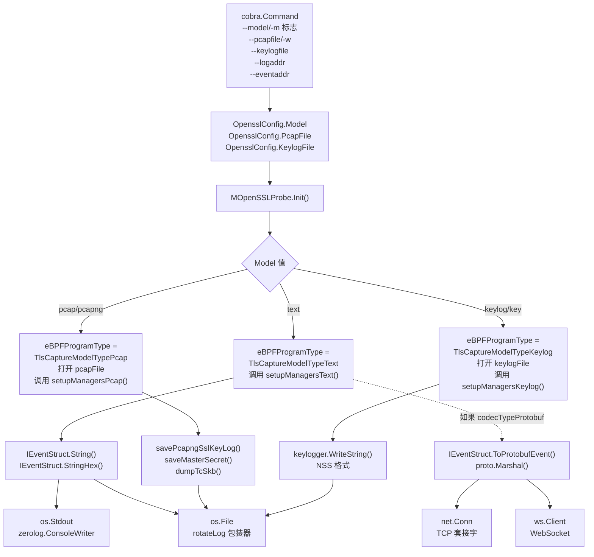
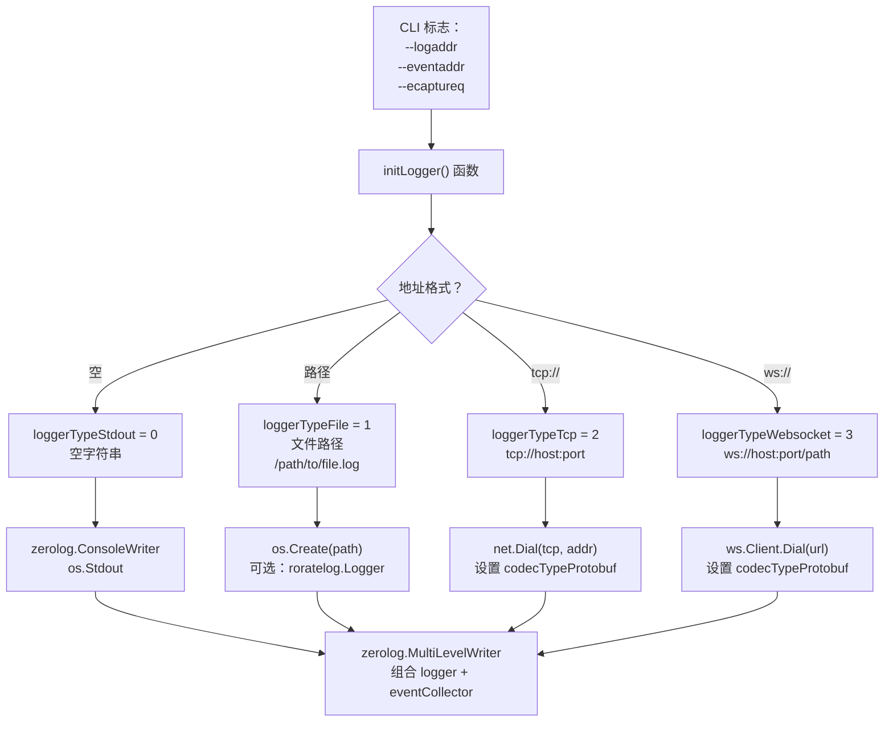

# 输出格式

eCapture 提供四种不同的输出格式，用于捕获的网络流量、主密钥和审计数据。每种格式服务于特定的使用场景，并与不同的分析工具集成。输出格式决定了数据编码（文本、二进制 PCAP、密钥日志、protobuf）和目标位置（控制台、文件、TCP 套接字、WebSocket）。

## 输出格式概览

| 格式 | 主要用途 | 输出目标 | Wireshark 兼容 | 实时显示 |
|--------|------------------|-------------------|---------------------|-----------|
| **文本** | 交互式调试、日志分析 | 控制台、文件、WebSocket | 否 | 是 |
| **PCAP** | 网络分析、流量重放 | PCAP-NG 文件 | 是 | 否 |
| **密钥日志** | 使用外部工具进行 TLS 解密 | NSS 密钥日志文件 | 是（配合 tcpdump） | 否 |
| **Protobuf** | 工具集成、eCaptureQ GUI | TCP、WebSocket | 否 | 是 |

详细信息请参考各子页面：
- [文本输出模式](4.1-text-output-mode.md) - 纯文本格式化、HTTP 解析、颜色编码
- [PCAP 集成](4.2-pcap-integration.md) - PCAP-NG 文件生成、DSB 块、Wireshark 工作流
- [TLS 密钥日志](4.3-tls-key-logging.md) - 主密钥提取、SSLKEYLOGFILE 格式
- [Protobuf 与外部集成](4.4-protobuf-and-external-integration.md) - 二进制协议、WebSocket 流式传输、eCaptureQ

**来源：** [README.md:172-253](https://github.com/gojue/ecapture/blob/0766a93b/README.md#L172-L253), [user/module/probe_openssl.go:58-76](https://github.com/gojue/ecapture/blob/0766a93b/user/module/probe_openssl.go#L58-L76), [user/config/iconfig.go:73-79](https://github.com/gojue/ecapture/blob/0766a93b/user/config/iconfig.go#L73-L79)

## 输出格式架构

### 格式选择与编码流程

以下图表展示了 CLI 标志如何转换为输出编码器和目标写入器：



**来源：** [user/module/probe_openssl.go:109-176](https://github.com/gojue/ecapture/blob/0766a93b/user/module/probe_openssl.go#L109-L176), [user/config/iconfig.go:95-112](https://github.com/gojue/ecapture/blob/0766a93b/user/config/iconfig.go#L95-L112), [cli/cmd/root.go:178-247](https://github.com/gojue/ecapture/blob/0766a93b/cli/cmd/root.go#L178-L247)

### 格式类型常量

输出格式使用代码库中的 `TlsCaptureModelType` 枚举定义：

| 枚举值 | 常量名称 | CLI 标志 | 描述 |
|------------|--------------|----------|-------------|
| `0` | `TlsCaptureModelTypePcap` | `pcap`、`pcapng` | PCAP-NG 二进制格式 |
| `1` | `TlsCaptureModelTypeText` | `text`（默认） | 人类可读文本 |
| `2` | `TlsCaptureModelTypeKeylog` | `keylog`、`key` | NSS 密钥日志格式 |

CLI 通过 `--model/-m` 标志接受字符串值：
- `text` → `TlsCaptureModelTypeText` → 使用 `setupManagersText()`
- `pcap` 或 `pcapng` → `TlsCaptureModelTypePcap` → 使用 `setupManagersPcap()`
- `keylog` 或 `key` → `TlsCaptureModelTypeKeylog` → 使用 `setupManagersKeylog()`

当在 `--eventaddr` 中使用远程目标（`tcp://` 或 `ws://`）时，Protobuf 格式会自动启用。

**来源：** [user/module/probe_openssl.go:58-76](https://github.com/gojue/ecapture/blob/0766a93b/user/module/probe_openssl.go#L58-L76), [user/config/iconfig.go:73-79](https://github.com/gojue/ecapture/blob/0766a93b/user/config/iconfig.go#L73-L79)

## 事件结构与序列化

所有捕获的事件都实现了 `IEventStruct` 接口，该接口定义了多种输出格式的方法：

### IEventStruct 接口方法

```go
type IEventStruct interface {
    Decode(payload []byte) error
    String() string                    // 文本格式
    StringHex() string                 // 带十六进制转储的文本格式
    Clone() IEventStruct
    EventType() Type
    GetUUID() string
    Payload() []byte
    PayloadLen() int
    Base() Base                        // 公共元数据
    ToProtobufEvent() *pb.Event       // Protobuf 格式
}
```

### 按模块分类的事件类型

| 模块 | 事件结构 | 包含内容 | 输出模式 |
|--------|----------------|----------|--------------|
| TLS/SSL | `SSLDataEvent` | 加密负载、元组、TLS 版本 | 文本、PCAP、Protobuf |
| TLS/SSL | `ConnDataEvent` | 连接 4 元组（IP:端口对） | PCAP、Protobuf |
| TLS/SSL | `MasterSecretEvent` | 客户端随机数、主密钥 | 密钥日志、PCAP（DSB） |
| TLS/SSL | `TcSkbEvent` | 来自 TC 钩子的原始数据包数据 | PCAP |
| GoTLS | `TlsDataEvent` | Go TLS 明文、连接信息 | 文本、PCAP、Protobuf |
| GnuTLS | `GnutlsDataEvent` | GnuTLS 明文 | 文本、Protobuf |
| NSS | `NsprDataEvent` | NSS/NSPR 明文 | 文本、Protobuf |
| Bash | `BashEvent` | Shell 命令行 | 文本、Protobuf |
| MySQL | `MysqldEvent` | SQL 查询、返回值 | 文本、Protobuf |
| PostgreSQL | `PostgresEvent` | SQL 查询 | 文本、Protobuf |

每个事件结构为其支持的输出格式实现序列化：
- `String()` / `StringHex()` 用于带可选颜色编码的文本输出
- `ToProtobufEvent()` 用于二进制 protobuf 序列化
- 模块特定方法（`saveMasterSecret()`、`dumpTcSkb()`）用于 PCAP/密钥日志

**来源：** [user/event/event_openssl.go:77-391](https://github.com/gojue/ecapture/blob/0766a93b/user/event/event_openssl.go#L77-L391), [user/event/event_masterkey.go:37-273](https://github.com/gojue/ecapture/blob/0766a93b/user/event/event_masterkey.go#L37-L273), [user/event/event_bash.go:37-133](https://github.com/gojue/ecapture/blob/0766a93b/user/event/event_bash.go#L37-L133), [user/event/event_mysqld.go:68-168](https://github.com/gojue/ecapture/blob/0766a93b/user/event/event_mysqld.go#L68-L168)

## 输出目标配置

eCapture 将日志记录（诊断消息）与事件输出（捕获的数据）分离。两者都支持多种目标类型。

### 目标类型检测



**来源：** [cli/cmd/root.go:68-73](https://github.com/gojue/ecapture/blob/0766a93b/cli/cmd/root.go#L68-L73), [cli/cmd/root.go:178-247](https://github.com/gojue/ecapture/blob/0766a93b/cli/cmd/root.go#L178-L247)

### 目标类型常量与行为

| 常量 | 值 | 触发模式 | 写入器实现 | 编解码器类型 |
|----------|-------|----------------|----------------------|------------|
| `loggerTypeStdout` | `0` | 空字符串 | `zerolog.ConsoleWriter` → `os.Stdout` | 文本 |
| `loggerTypeFile` | `1` | `/path/to/file` | `os.Create()` + 可选 `roratelog.Logger` | 文本 |
| `loggerTypeTcp` | `2` | `tcp://host:port` | `net.Dial("tcp", addr)` | Protobuf |
| `loggerTypeWebsocket` | `3` | `ws://` 或 `wss://` | `ws.Client.Dial(url)` | Protobuf |

### 编解码器选择逻辑

目标类型决定用于事件序列化的编解码器：

```go
// 在 initLogger() 函数中
if strings.Contains(addr, "tcp://") || strings.Contains(addr, "ws://") {
    // 远程目标使用 protobuf
    module.eventOutputType = codecTypeProtobuf
} else {
    // 本地目标使用文本
    module.eventOutputType = codecTypeText
}
```

远程目标（`tcp://`、`ws://`）通过 `IEventStruct.ToProtobufEvent()` 自动启用 protobuf 编码，而本地目标使用 `IEventStruct.String()`。

### 日志轮转

文件目标在配置时支持自动轮转：
- `--eventroratesize <MB>` - 当文件达到大小限制时轮转
- `--eventroratetime <秒>` - 按时间间隔轮转

轮转由文件句柄周围的 `roratelog.Logger` 包装器处理。

**来源：** [cli/cmd/root.go:68-73](https://github.com/gojue/ecapture/blob/0766a93b/cli/cmd/root.go#L68-L73), [cli/cmd/root.go:178-247](https://github.com/gojue/ecapture/blob/0766a93b/cli/cmd/root.go#L178-L247), [cli/cmd/root.go:151-152](https://github.com/gojue/ecapture/blob/0766a93b/cli/cmd/root.go#L151-L152)

### 按类型路由事件

事件管道使用三种分类类型将事件路由通过不同的处理阶段：

| 事件类型 | 常量值 | 处理器 | 目的 |
|------------|---------------|---------|---------|
| `TypeOutput` | `event.TypeOutput` | `module.output()` | 预格式化事件，直接输出 |
| `TypeEventProcessor` | `event.TypeEventProcessor` | `EventProcessor.Write()` | HTTP/HTTP2 解析、协议检测 |
| `TypeModuleData` | `event.TypeModuleData` | `module.Dispatcher()` | 内部缓存、PCAP 写入、密钥日志 |

事件在 `Clone()` 期间被分配类型：

```go
// SSLDataEvent 的示例
func (se *SSLDataEvent) Clone() IEventStruct {
    event := new(SSLDataEvent)
    event.eventType = TypeModuleData  // 路由到模块调度器
    return event
}
```

**来源：** [user/event/event_openssl.go:200-204](https://github.com/gojue/ecapture/blob/0766a93b/user/event/event_openssl.go#L200-L204), [user/module/imodule.go:430-447](https://github.com/gojue/ecapture/blob/0766a93b/user/module/imodule.go#L430-L447)

## 格式特定使用场景

### 文本模式

**使用场景：**
- 交互式调试和实时监控
- 基于控制台的流量检查
- 使用 grep/awk 进行日志文件分析
- HTTP/HTTP2 协议分析

**输出示例：**
- 带颜色编码的纯文本请求/响应体
- HTTP/1.1 头部和内容
- 带流 ID 的 HTTP/2 逐帧解码
- 连接元数据（PID、进程名、IP:端口元组）

有关格式化详细信息、颜色方案和 HTTP 解析，请参阅[文本输出模式](4.1-text-output-mode.md)。

**来源：** [user/module/probe_openssl.go:756-775](https://github.com/gojue/ecapture/blob/0766a93b/user/module/probe_openssl.go#L756-L775), [user/event/event_openssl.go:167-198](https://github.com/gojue/ecapture/blob/0766a93b/user/event/event_openssl.go#L167-L198)

### PCAP 模式

**使用场景：**
- 使用 Wireshark 进行网络分析
- 流量归档以供后续分析
- 与现有基于 PCAP 的工具集成
- 将明文捕获与数据包检查结合

**输出结构：**
- 带接口描述块（IDB）的 PCAP-NG 文件格式
- 用于捕获数据包的增强数据包块（EPB）
- 包含主密钥的解密秘密块（DSB）
- 自动密钥到连接的关联

有关文件格式详细信息和 Wireshark 工作流，请参阅 [PCAP 集成](4.2-pcap-integration.md)。

**来源：** [user/module/probe_openssl.go:733-754](https://github.com/gojue/ecapture/blob/0766a93b/user/module/probe_openssl.go#L733-L754)

### 密钥日志模式

**使用场景：**
- 使用 Wireshark 解密现有 pcap 文件
- 使用 tshark 进行实时解密
- 符合基于 SSLKEYLOGFILE 的工具
- 将密钥捕获与数据包捕获分离

**输出格式：**
```
CLIENT_RANDOM <32字节十六进制> <48字节十六进制主密钥>
CLIENT_HANDSHAKE_TRAFFIC_SECRET <32字节十六进制> <秘密>
SERVER_HANDSHAKE_TRAFFIC_SECRET <32字节十六进制> <秘密>
```

有关 TLS 1.2/1.3 密钥提取和集成示例，请参阅 [TLS 密钥日志](4.3-tls-key-logging.md)。

**来源：** [user/module/probe_openssl.go:482-642](https://github.com/gojue/ecapture/blob/0766a93b/user/module/probe_openssl.go#L482-L642)

### Protobuf 模式

**使用场景：**
- eCaptureQ GUI 集成
- 使用结构化数据进行自定义工具开发
- 通过 TCP/WebSocket 进行远程监控
- 事件转发到 SIEM 系统

**协议：**
- 通过 `pb.Event` 消息类型进行二进制 protobuf 编码
- 字段：`timestamp`、`uuid`、`pid`、`pname`、`src_ip`、`dst_ip`、`payload`
- 带心跳机制的 WebSocket 帧

有关协议模式和客户端示例，请参阅 [Protobuf 与外部集成](4.4-protobuf-and-external-integration.md)。

**来源：** [user/event/event_openssl.go:237-266](https://github.com/gojue/ecapture/blob/0766a93b/user/event/event_openssl.go#L237-L266), [protobuf/PROTOCOLS.md](https://github.com/gojue/ecapture/blob/0766a93b/protobuf/PROTOCOLS.md)

## CLI 配置参考

### 全局输出标志

| 标志 | 简写 | 类型 | 默认值 | 描述 |
|------|-------|------|---------|-------------|
| `--logaddr` | `-l` | string | `""` | 日志记录器目标：文件路径、`tcp://host:port`、`ws://host:port` |
| `--eventaddr` | | string | `""` | 事件收集器目标（如果未设置，则使用 `--logaddr`） |
| `--ecaptureq` | | string | `""` | 用于 eCaptureQ 集成的本地 WebSocket 服务器 |
| `--listen` | | string | `localhost:28256` | 用于运行时配置更新的 HTTP API 服务器 |
| `--eventroratesize` | | uint16 | `0` | 当大小超过 N MB 时轮转事件文件（0=禁用） |
| `--eventroratetime` | | uint16 | `0` | 每 N 秒轮转事件文件（0=禁用） |

### 模块特定格式标志

适用于 `tls`、`gotls`、`gnutls`、`nss` 模块：

| 标志 | 简写 | 类型 | 默认值 | 描述 |
|------|-------|------|---------|-------------|
| `--model` | `-m` | string | `text` | 格式：`text`、`pcap`、`pcapng`、`keylog`、`key` |
| `--pcapfile` | `-w` | string | `ecapture_openssl.pcapng` | PCAP 模式的输出文件 |
| `--keylogfile` | | string | `ecapture_masterkey.log` | 密钥日志模式的输出文件 |
| `--hex` | | bool | `false` | 在文本模式下十六进制转储负载 |

### 示例命令

```bash
# 文本模式输出到控制台
sudo ecapture tls

# 文本模式输出到文件并启用轮转
sudo ecapture tls --eventaddr=/var/log/ecapture.log --eventroratesize=100

# PCAP 模式使用自定义文件
sudo ecapture tls -m pcap -w /tmp/capture.pcapng -i eth0

# 用于 Wireshark 解密的密钥日志模式
sudo ecapture tls -m keylog --keylogfile=/tmp/keys.log

# Protobuf 流式传输到 eCaptureQ
sudo ecapture tls --ecaptureq=:9090

# 远程 TCP 流式传输
sudo ecapture tls --eventaddr=tcp://192.168.1.100:8080
```

**来源：** [cli/cmd/root.go:136-153](https://github.com/gojue/ecapture/blob/0766a93b/cli/cmd/root.go#L136-L153), [README.md:172-253](https://github.com/gojue/ecapture/blob/0766a93b/README.md#L172-L253)

## 输出格式比较

| 格式 | CLI 标志 | 需要文件 | 实时显示 | 协议解析 | 主密钥 | Wireshark 兼容 |
|--------|----------|---------------|-------------------|------------------|-------------|---------------------|
| **文本** | `-m text` | 可选 | ✓ 是（stdout） | ✓ HTTP/1.x、HTTP/2 | ✗ 否（自 v0.7.0） | ✗ 否 |
| **PCAP** | `-m pcap` | ✓ 必需（`-w`） | ✗ 否 | ✗ 否 | ✓ 是（DSB 块） | ✓ 是 |
| **密钥日志** | `-m keylog` | ✓ 必需 | ✗ 否 | ✗ 否 | ✓ 是（NSS 格式） | ✓ 是（配合 tcpdump） |
| **Protobuf** | 自动 | 可选 | ✓ 是（TCP/WS） | △ 依赖模块 | ✓ 嵌入事件中 | ✗ 否 |

### 格式选择指南

**选择文本模式的情况：**
- 需要对捕获的流量进行即时视觉反馈
- 想要通过 grep/搜索 HTTP 请求/响应
- 正在进行交互式应用程序行为调试
- 需要 HTTP/2 逐帧分析

**选择 PCAP 模式的情况：**
- 需要在 Wireshark 中进行全面的数据包分析
- 想要归档流量以供后续取证
- 需要明文和加密数据包数据
- 想要将主密钥嵌入捕获文件

**选择密钥日志模式的情况：**
- 已经使用 tcpdump/tshark 进行捕获
- 需要与 SSLKEYLOGFILE 兼容的输出
- 想要解密现有的 PCAP 文件
- 正在使用 Wireshark 的 TLS 解密功能

**选择 Protobuf 模式的情况：**
- 正在与 eCaptureQ 或自定义工具集成
- 需要结构化的、机器可解析的事件
- 正在转发到远程系统
- 想要通过网络进行实时流式传输

**来源：** [README.md:172-253](https://github.com/gojue/ecapture/blob/0766a93b/README.md#L172-L253), [CHANGELOG.md:487-493](https://github.com/gojue/ecapture/blob/0766a93b/CHANGELOG.md#L487-L493), [user/config/iconfig.go:73-79](https://github.com/gojue/ecapture/blob/0766a93b/user/config/iconfig.go#L73-L79)