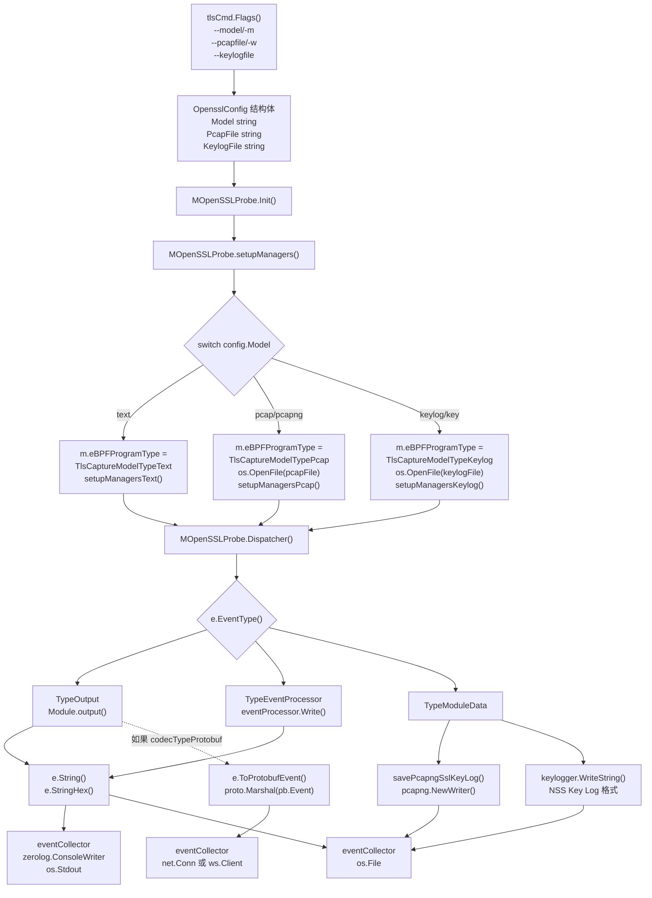
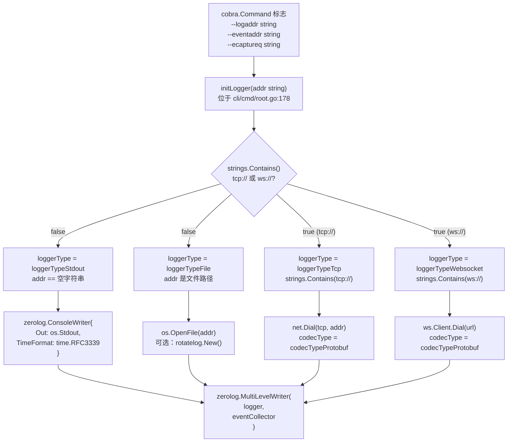
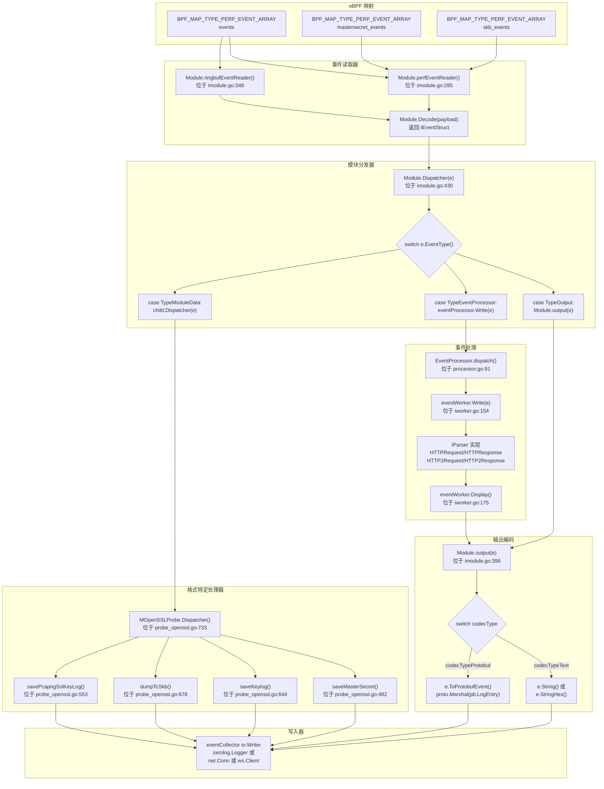

# 输出格式

eCapture 为捕获的网络流量、主密钥和审计数据提供四种不同的输出格式。输出格式由 `--model/-m` 标志控制，并决定数据编码（文本、二进制 PCAP、keylog、protobuf）和目标写入器（`io.Writer` 实现）。

## 输出格式概览

| 格式 | CLI 标志 | 编码器实现 | 写入器类型 | Wireshark 兼容 | 实时 |
|--------|----------|----------------------|-------------|---------------------|-----------|
| **文本** | `-m text` | `IEventStruct.String()` | `zerolog.ConsoleWriter`, `os.File` | 否 | 是 |
| **PCAP** | `-m pcap` | `savePcapngSslKeyLog()` | `os.File` (PCAP-NG) | 是 | 否 |
| **Keylog** | `-m keylog` | `WriteString()` NSS 格式 | `os.File` | 是（配合 tcpdump） | 否 |
| **Protobuf** | 自动（远程地址） | `proto.Marshal(pb.Event)` | `net.Conn`, `ws.Client` | 否 | 是 |

输出格式选择在 `MOpenSSLProbe.setupManagers()` 及其子函数（`setupManagersText()`、`setupManagersPcap()`、`setupManagersKeylog()`）中实现。每种格式通过 `Module.Dispatcher()` 函数使用不同的事件路由路径。

有关特定输出模式的详细信息，请参见：
- [文本输出模式](4.1-text-output-mode.md) - 纯文本格式化、HTTP 解析、颜色编码
- [PCAP 集成](4.2-pcap-integration.md) - PCAP-NG 文件生成、DSB 块、Wireshark 工作流程
- [TLS 密钥日志](4.3-tls-key-logging.md) - 主密钥提取、SSLKEYLOGFILE 格式
- [Protobuf 与外部集成](4.4-protobuf-and-external-integration.md) - 二进制协议、WebSocket 流式传输、eCaptureQ

**来源：** [user/module/probe_openssl.go:109-176](https://github.com/gojue/ecapture/blob/ca085d05/user/module/probe_openssl.go#L109-L176), [user/config/iconfig.go:73-79](https://github.com/gojue/ecapture/blob/ca085d05/user/config/iconfig.go#L73-L79), [cli/cmd/root.go:178-247](https://github.com/gojue/ecapture/blob/ca085d05/cli/cmd/root.go#L178-L247)

## 输出格式架构

### 格式选择与编码流程

以下图表展示了 CLI 标志（`cobra.Command`）如何转换为特定格式的 eBPF 程序类型和输出编码器：


```mermaid
graph TB
    CLI["tlsCmd.Flags()<br/>--model/-m<br/>--pcapfile/-w<br/>--keylogfile"]
    
    Config["OpensslConfig 结构体<br/>Model string<br/>PcapFile string<br/>KeylogFile string"]
    
    ModuleInit["MOpenSSLProbe.Init()"]
    
    SetupMgrs["MOpenSSLProbe.setupManagers()"]
    
    FormatSwitch{"switch config.Model"}
    
    TextBranch["m.eBPFProgramType =<br/>TlsCaptureModelTypeText<br/>setupManagersText()"]
    PcapBranch["m.eBPFProgramType =<br/>TlsCaptureModelTypePcap<br/>os.OpenFile(pcapFile)<br/>setupManagersPcap()"]
    KeylogBranch["m.eBPFProgramType =<br/>TlsCaptureModelTypeKeylog<br/>os.OpenFile(keylogFile)<br/>setupManagersKeylog()"]
    
    Dispatcher["MOpenSSLProbe.Dispatcher()"]
    
    EventType{"e.EventType()"}
    
    TypeOutput["TypeOutput<br/>Module.output()"]
    TypeProcessor["TypeEventProcessor<br/>eventProcessor.Write()"]
    TypeModule["TypeModuleData"]
    
    TextEncode["e.String()<br/>e.StringHex()"]
    PcapWrite["savePcapngSslKeyLog()<br/>pcapng.NewWriter()"]
    KeylogWrite["keylogger.WriteString()<br/>NSS Key Log 格式"]
    ProtobufEncode["e.ToProtobufEvent()<br/>proto.Marshal(pb.Event)"]
    
    ConsoleOut["eventCollector<br/>zerolog.ConsoleWriter<br/>os.Stdout"]
    FileOut["eventCollector<br/>os.File"]
    RemoteOut["eventCollector<br/>net.Conn 或 ws.Client"]
    
    CLI --> Config
    Config --> ModuleInit
    ModuleInit --> SetupMgrs
    SetupMgrs --> FormatSwitch
    
    FormatSwitch -->|"text"| TextBranch
    FormatSwitch -->|"pcap/pcapng"| PcapBranch
    FormatSwitch -->|"keylog/key"| KeylogBranch
    
    TextBranch --> Dispatcher
    PcapBranch --> Dispatcher
    KeylogBranch --> Dispatcher
    
    Dispatcher --> EventType
    
    EventType --> TypeOutput
    EventType --> TypeProcessor
    EventType --> TypeModule
    
    TypeOutput --> TextEncode
    TypeOutput -.->|"如果 codecTypeProtobuf"| ProtobufEncode
    TypeModule --> PcapWrite
    TypeModule --> KeylogWrite
    TypeProcessor --> TextEncode
    
    TextEncode --> ConsoleOut
    TextEncode --> FileOut
    PcapWrite --> FileOut
    KeylogWrite --> FileOut
    ProtobufEncode --> RemoteOut
```

**来源：** [user/module/probe_openssl.go:109-176](https://github.com/gojue/ecapture/blob/ca085d05/user/module/probe_openssl.go#L109-L176), [user/module/probe_openssl.go:733-775](https://github.com/gojue/ecapture/blob/ca085d05/user/module/probe_openssl.go#L733-L775), [cli/cmd/tls.go:35-66](https://github.com/gojue/ecapture/blob/ca085d05/cli/cmd/tls.go#L35-L66), [user/config/iconfig.go:95-112](https://github.com/gojue/ecapture/blob/ca085d05/user/config/iconfig.go#L95-L112)

### 格式类型常量

输出格式使用 [user/config/iconfig.go:73-79](https://github.com/gojue/ecapture/blob/ca085d05/user/config/iconfig.go#L73-L79) 中定义的 `TlsCaptureModelType` 枚举：

| 枚举值 | 常量名称 | CLI 标志 | 设置函数 | eBPF 程序类型 |
|------------|--------------|----------|----------------|-------------------|
| `0` | `TlsCaptureModelTypePcap` | `pcap`, `pcapng` | `setupManagersPcap()` | `PcapNG` |
| `1` | `TlsCaptureModelTypeText` | `text`（默认） | `setupManagersText()` | `Text` |
| `2` | `TlsCaptureModelTypeKeylog` | `keylog`, `key` | `setupManagersKeylog()` | `Keylog` |

字符串到枚举的转换发生在 `MOpenSSLProbe.setupManagers()` 的 [user/module/probe_openssl.go:133-158](https://github.com/gojue/ecapture/blob/ca085d05/user/module/probe_openssl.go#L133-L158) 处：

```
switch strings.ToLower(m.conf.(*config.OpensslConfig).Model) {
case ModePcap, ModePcapng:
    m.eBPFProgramType = TlsCaptureModelTypePcap
case ModeKeylog, ModeKey:
    m.eBPFProgramType = TlsCaptureModelTypeKeylog
case ModeText:
    fallthrough
default:
    m.eBPFProgramType = TlsCaptureModelTypeText
}
```

当目标地址（`--eventaddr` 或 `--logaddr`）以 `tcp://` 或 `ws://` 开头时，Protobuf 编码会通过 `codecTypeProtobuf` 自动启用，这在 `initLogger()` 的 [cli/cmd/root.go:178-247](https://github.com/gojue/ecapture/blob/ca085d05/cli/cmd/root.go#L178-L247) 处确定。

**来源：** [user/config/iconfig.go:73-79](https://github.com/gojue/ecapture/blob/ca085d05/user/config/iconfig.go#L73-L79), [user/module/probe_openssl.go:133-158](https://github.com/gojue/ecapture/blob/ca085d05/user/module/probe_openssl.go#L133-L158), [cli/cmd/root.go:178-247](https://github.com/gojue/ecapture/blob/ca085d05/cli/cmd/root.go#L178-L247)

## 事件结构与序列化

所有捕获的事件都实现了 `IEventStruct` 接口，该接口定义了多种输出格式的方法。

### IEventStruct 接口方法

[user/event/ievent.go:41-52](https://github.com/gojue/ecapture/blob/ca085d05/user/event/ievent.go#L41-L52) 中定义的 `IEventStruct` 接口提供了多种序列化方法：

```
type IEventStruct interface {
    Decode(payload []byte) error       // 解码 eBPF 事件
    String() string                    // 文本格式（美化打印）
    StringHex() string                 // 带十六进制转储的文本格式
    Clone() IEventStruct               // 创建独立副本
    EventType() Type                   // TypeOutput/TypeProcessor/TypeModuleData
    GetUUID() string                   // 连接标识符
    Payload() []byte                   // 原始载荷字节
    PayloadLen() int                   // 载荷长度
    Base() Base                        // 通用元数据（PID、IP、端口）
    ToProtobufEvent() *pb.Event        // Protobuf 序列化
}
```

`EventType()` 返回值控制路由：
- `TypeOutput` - 通过 `Module.output()` 直接输出 [user/module/imodule.go:430-441](https://github.com/gojue/ecapture/blob/ca085d05/user/module/imodule.go#L430-L441)
- `TypeEventProcessor` - 通过 `EventProcessor` 进行 HTTP 解析 [user/module/imodule.go:442-444](https://github.com/gojue/ecapture/blob/ca085d05/user/module/imodule.go#L442-L444)
- `TypeModuleData` - 模块特定处理（PCAP/keylog） [user/module/imodule.go:445-447](https://github.com/gojue/ecapture/blob/ca085d05/user/module/imodule.go#L445-L447)

### 按模块分类的事件类型

| 模块 | 事件结构 | 文件 | 输出模式 | EventType |
|--------|----------------|------|--------------|-----------|
| TLS/SSL | `SSLDataEvent` | `event_openssl.go` | 文本、PCAP、Protobuf | `TypeEventProcessor` |
| TLS/SSL | `ConnDataEvent` | `event_openssl.go` | PCAP、Protobuf | `TypeModuleData` |
| TLS/SSL | `MasterSecretEvent` | `event_masterkey.go` | Keylog、PCAP（DSB） | `TypeModuleData` |
| TLS/SSL | `TcSkbEvent` | `event_tc_skb.go` | PCAP | `TypeModuleData` |
| GoTLS | `TlsDataEvent` | `event_gotls.go` | 文本、PCAP、Protobuf | `TypeEventProcessor` |
| GnuTLS | `GnutlsDataEvent` | `event_gnutls.go` | 文本、Protobuf | `TypeOutput` |
| NSS | `NsprDataEvent` | `event_nspr.go` | 文本、Protobuf | `TypeOutput` |
| Bash | `BashEvent` | `event_bash.go` | 文本、Protobuf | `TypeOutput` |
| MySQL | `MysqldEvent` | `event_mysqld.go` | 文本、Protobuf | `TypeOutput` |
| PostgreSQL | `PostgresEvent` | `event_postgres.go` | 文本、Protobuf | `TypeOutput` |

每个事件结构实现特定格式的序列化：
- `String()` 在 [user/event/event_openssl.go:167-198](https://github.com/gojue/ecapture/blob/ca085d05/user/event/event_openssl.go#L167-L198) - 带可选颜色编码的文本输出
- `StringHex()` 在 [user/event/event_openssl.go:200-204](https://github.com/gojue/ecapture/blob/ca085d05/user/event/event_openssl.go#L200-L204) - 十六进制转储格式
- `ToProtobufEvent()` 在 [user/event/event_openssl.go:237-266](https://github.com/gojue/ecapture/blob/ca085d05/user/event/event_openssl.go#L237-L266) - 二进制 protobuf 序列化
- 模块特定的分发器方法，如 `saveMasterSecret()` 在 [user/module/probe_openssl.go:482-642](https://github.com/gojue/ecapture/blob/ca085d05/user/module/probe_openssl.go#L482-L642)

**来源：** [user/event/event_openssl.go:77-391](https://github.com/gojue/ecapture/blob/ca085d05/user/event/event_openssl.go#L77-L391), [user/event/event_masterkey.go:37-273](https://github.com/gojue/ecapture/blob/ca085d05/user/event/event_masterkey.go#L37-L273), [user/event/event_bash.go:37-133](https://github.com/gojue/ecapture/blob/ca085d05/user/event/event_bash.go#L37-L133), [user/event/event_mysqld.go:68-168](https://github.com/gojue/ecapture/blob/ca085d05/user/event/event_mysqld.go#L68-L168)

## 输出目标配置

eCapture 将日志记录（诊断消息）与事件输出（捕获的数据）分开。两者都支持多种目标类型。

### 目标类型检测

[cli/cmd/root.go:178-247](https://github.com/gojue/ecapture/blob/ca085d05/cli/cmd/root.go#L178-L247) 中的 `initLogger()` 函数分析目标地址并创建适当的 `io.Writer` 实现：


```mermaid
graph TB
    Flags["cobra.Command 标志<br/>--logaddr string<br/>--eventaddr string<br/>--ecaptureq string"]
    
    InitLogger["initLogger(addr string)<br/>位于 cli/cmd/root.go:178"]
    
    CheckFormat{"strings.Contains()<br/>tcp:// 或 ws://?"}
    
    StdoutType["loggerType = loggerTypeStdout<br/>addr == 空字符串"]
    FileType["loggerType = loggerTypeFile<br/>addr 是文件路径"]
    TcpType["loggerType = loggerTypeTcp<br/>strings.Contains(tcp://)"]
    WsType["loggerType = loggerTypeWebsocket<br/>strings.Contains(ws://)"]
    
    CreateStdout["zerolog.ConsoleWriter{<br/>  Out: os.Stdout,<br/>  TimeFormat: time.RFC3339<br/>}"]
    CreateFile["os.OpenFile(addr)<br/>可选：rotatelog.New()"]
    CreateTcp["net.Dial(tcp, addr)<br/>codecType = codecTypeProtobuf"]
    CreateWs["ws.Client.Dial(url)<br/>codecType = codecTypeProtobuf"]
    
    MultiWriter["zerolog.MultiLevelWriter(<br/>  logger,<br/>  eventCollector<br/>)"]
    
    Flags --> InitLogger
    InitLogger --> CheckFormat
    
    CheckFormat -->|"false"| StdoutType
    CheckFormat -->|"false"| FileType
    CheckFormat -->|"true (tcp://)"| TcpType
    CheckFormat -->|"true (ws://)"| WsType
    
    StdoutType --> CreateStdout
    FileType --> CreateFile
    TcpType --> CreateTcp
    WsType --> CreateWs
    
    CreateStdout --> MultiWriter
    CreateFile --> MultiWriter
    CreateTcp --> MultiWriter
    CreateWs --> MultiWriter
```

该函数返回两个值：
1. `logger` - 用于诊断消息（模块启动、错误）
2. `eventCollector` - 用于捕获的事件（明文数据、密钥）

两者都合并到 `MultiLevelWriter` 中，供同时输出到两个通道的模块使用。

**来源：** [cli/cmd/root.go:178-247](https://github.com/gojue/ecapture/blob/ca085d05/cli/cmd/root.go#L178-L247), [cli/cmd/root.go:68-73](https://github.com/gojue/ecapture/blob/ca085d05/cli/cmd/root.go#L68-L73)

### 目标类型常量和行为

| 常量 | 值 | 触发模式 | 写入器实现 | 编解码器类型 |
|----------|-------|----------------|----------------------|------------|
| `loggerTypeStdout` | `0` | 空字符串 | `zerolog.ConsoleWriter` → `os.Stdout` | 文本 |
| `loggerTypeFile` | `1` | `/path/to/file` | `os.Create()` + 可选 `roratelog.Logger` | 文本 |
| `loggerTypeTcp` | `2` | `tcp://host:port` | `net.Dial("tcp", addr)` | Protobuf |
| `loggerTypeWebsocket` | `3` | `ws://` 或 `wss://` | `ws.Client.Dial(url)` | Protobuf |

### 编解码器选择逻辑

目标类型决定了用于事件序列化的编解码器：

```go
// 在 initLogger() 函数中
if strings.Contains(addr, "tcp://") || strings.Contains(addr, "ws://") {
    // 远程目标使用 protobuf
    module.eventOutputType = codecTypeProtobuf
} else {
    // 本地目标使用文本
    module.eventOutputType = codecTypeText
}
```

远程目标（`tcp://`、`ws://`）通过 `IEventStruct.ToProtobufEvent()` 自动启用 protobuf 编码，而本地目标使用 `IEventStruct.String()`。

### 日志轮转

文件目标在配置时支持自动轮转：
- `--eventroratesize <MB>` - 当文件达到大小限制时轮转
- `--eventroratetime <秒>` - 按时间间隔轮转

轮转由文件句柄周围的 `roratelog.Logger` 包装器处理。

**来源：** [cli/cmd/root.go:68-73](https://github.com/gojue/ecapture/blob/ca085d05/cli/cmd/root.go#L68-L73), [cli/cmd/root.go:178-247](https://github.com/gojue/ecapture/blob/ca085d05/cli/cmd/root.go#L178-L247), [cli/cmd/root.go:151-152](https://github.com/gojue/ecapture/blob/ca085d05/cli/cmd/root.go#L151-L152)

---

## 事件输出流程

捕获的事件在到达最终目标之前要经过多阶段流程。

### 事件流架构

以下图表展示了从 eBPF 映射到最终输出的完整事件流程：


```mermaid
flowchart TB
    subgraph "eBPF 映射"
        EventsMap["BPF_MAP_TYPE_PERF_EVENT_ARRAY<br/>events"]
        MasterSecretMap["BPF_MAP_TYPE_PERF_EVENT_ARRAY<br/>mastersecret_events"]
        TcSkbMap["BPF_MAP_TYPE_PERF_EVENT_ARRAY<br/>skb_events"]
    end
    
    subgraph "事件读取器"
        PerfReader["Module.perfEventReader()<br/>位于 imodule.go:285"]
        RingbufReader["Module.ringbufEventReader()<br/>位于 imodule.go:348"]
        Decode["Module.Decode(payload)<br/>返回 IEventStruct"]
    end
    
    subgraph "模块分发器"
        Dispatcher["Module.Dispatcher(e)<br/>位于 imodule.go:430"]
        TypeSwitch{"switch e.EventType()"}
        
        OutputCase["case TypeOutput:<br/>Module.output(e)"]
        ProcessorCase["case TypeEventProcessor:<br/>eventProcessor.Write(e)"]
        ModuleCase["case TypeModuleData:<br/>child.Dispatcher(e)"]
    end
    
    subgraph "事件处理"
        EventProcessor["EventProcessor.dispatch()<br/>位于 processor.go:91"]
        IWorker["eventWorker.Write(e)<br/>位于 iworker.go:154"]
        IParser["IParser 实现<br/>HTTPRequest/HTTPResponse<br/>HTTP2Request/HTTP2Response"]
        DisplayMethod["eventWorker.Display()<br/>位于 iworker.go:175"]
    end
    
    subgraph "格式特定处理器"
        ChildDispatcher["MOpenSSLProbe.Dispatcher()<br/>位于 probe_openssl.go:733"]
        SaveMasterSecret["saveMasterSecret()<br/>位于 probe_openssl.go:482"]
        SaveKeylog["saveKeylog()<br/>位于 probe_openssl.go:644"]
        DumpTcSkb["dumpTcSkb()<br/>位于 probe_openssl.go:678"]
        SavePcapng["savePcapngSslKeyLog()<br/>位于 probe_openssl.go:553"]
    end
    
    subgraph "输出编码"
        OutputMethod["Module.output(e)<br/>位于 imodule.go:396"]
        CodecSwitch{"switch codecType"}
        StringEncode["e.String() 或<br/>e.StringHex()"]
        ProtobufEncode["e.ToProtobufEvent()<br/>proto.Marshal(pb.LogEntry)"]
    end
    
    subgraph "写入器"
        EventCollector["eventCollector io.Writer<br/>zerolog.Logger 或<br/>net.Conn 或 ws.Client"]
    end
    
    EventsMap --> PerfReader
    MasterSecretMap --> PerfReader
    TcSkbMap --> PerfReader
    
    EventsMap --> RingbufReader
    
    PerfReader --> Decode
    RingbufReader --> Decode
    Decode --> Dispatcher
    
    Dispatcher --> TypeSwitch
    
    TypeSwitch --> OutputCase
    TypeSwitch --> ProcessorCase
    TypeSwitch --> ModuleCase
    
    OutputCase --> OutputMethod
    ProcessorCase --> EventProcessor
    ModuleCase --> ChildDispatcher
    
    EventProcessor --> IWorker
    IWorker --> IParser
    IParser --> DisplayMethod
    DisplayMethod --> OutputMethod
    
    ChildDispatcher --> SaveMasterSecret
    ChildDispatcher --> SaveKeylog
    ChildDispatcher --> DumpTcSkb
    ChildDispatcher --> SavePcapng
    
    SaveMasterSecret --> EventCollector
    SaveKeylog --> EventCollector
    DumpTcSkb --> EventCollector
    SavePcapng --> EventCollector
    
    OutputMethod --> CodecSwitch
    CodecSwitch -->|"codecTypeText"| StringEncode
    CodecSwitch -->|"codecTypeProtobuf"| ProtobufEncode
    
    StringEncode --> EventCollector
    ProtobufEncode --> EventCollector
```

**来源：** [user/module/imodule.go:285-448](https://github.com/gojue/ecapture/blob/ca085d05/user/module/imodule.go#L285-L448), [user/module/probe_openssl.go:733-775](https://github.com/gojue/ecapture/blob/ca085d05/user/module/probe_openssl.go#L733-L775), [pkg/event_processor/processor.go:66-109](https://github.com/gojue/ecapture/blob/ca085d05/pkg/event_processor/processor.go#L66-L109), [pkg/event_processor/iworker.go:154-172](https://github.com/gojue/ecapture/blob/ca085d05/pkg/event_processor/iworker.go#L154-L172)

### 按类型路由事件

事件流程使用 [user/event/ievent.go:26-37](https://github.com/gojue/ecapture/blob/ca085d05/user/event/ievent.go#L26-L37) 中定义的三种分类类型来路由事件：

| 事件类型 | 常量值 | 处理函数 | 目的 | 事件示例 |
|------------|---------------|------------------|---------|----------------|
| `TypeOutput` | `0` | `Module.output()` 位于 [user/module/imodule.go:396-428](https://github.com/gojue/ecapture/blob/ca085d05/user/module/imodule.go#L396-L428) | 预格式化事件，直接输出 | `BashEvent`、`MysqldEvent` |
| `TypeEventProcessor` | `2` | `EventProcessor.Write()` 位于 [pkg/event_processor/processor.go:165-175](https://github.com/gojue/ecapture/blob/ca085d05/pkg/event_processor/processor.go#L165-L175) | HTTP/HTTP2 解析，协议检测 | `SSLDataEvent`、`TlsDataEvent` |
| `TypeModuleData` | `1` | `child.Dispatcher()` 调用于 [user/module/imodule.go:445-447](https://github.com/gojue/ecapture/blob/ca085d05/user/module/imodule.go#L445-L447) | PCAP 写入、keylog、内部状态 | `MasterSecretEvent`、`TcSkbEvent` |

事件在 `Clone()` 方法中设置其类型。例如，`SSLDataEvent.Clone()` 在 [user/event/event_openssl.go:154-159](https://github.com/gojue/ecapture/blob/ca085d05/user/event/event_openssl.go#L154-L159)：

```
func (se *SSLDataEvent) Clone() IEventStruct {
    event := new(SSLDataEvent)
    event.eventType = TypeEventProcessor  // 路由到 EventProcessor
    // ... 复制字段 ...
    return event
}
```

而 `MasterSecretEvent.Clone()` 在 [user/event/event_masterkey.go:185-193](https://github.com/gojue/ecapture/blob/ca085d05/user/event/event_masterkey.go#L185-L193) 设置 `TypeModuleData` 以路由到模块特定的 PCAP/keylog 处理器。

**来源：** [user/event/ievent.go:26-37](https://github.com/gojue/ecapture/blob/ca085d05/user/event/ievent.go#L26-L37), [user/event/event_openssl.go:154-159](https://github.com/gojue/ecapture/blob/ca085d05/user/event/event_openssl.go#L154-L159), [user/event/event_masterkey.go:185-193](https://github.com/gojue/ecapture/blob/ca085d05/user/event/event_masterkey.go#L185-L193), [user/module/imodule.go:430-447](https://github.com/gojue/ecapture/blob/ca085d05/user/module/imodule.go#L430-L447)

---

## 格式特定处理

每种输出格式在模块的分发器内实现专门的处理逻辑。

## 格式特定用例

### 文本模式

**何时使用：**
- 交互式调试和实时监控
- 基于控制台的流量检查
- 使用 grep/awk 进行日志文件分析
- HTTP/HTTP2 协议分析

**输出示例：**
- 带颜色编码的纯文本请求/响应体
- HTTP/1.1 头和内容
- 带流 ID 的 HTTP/2 逐帧解码
- 连接元数据（PID、进程名、IP:端口元组）

有关格式化详细信息、颜色方案和 HTTP 解析，请参见 [文本输出模式](4.1-text-output-mode.md)。

**来源：** [user/module/probe_openssl.go:756-775](https://github.com/gojue/ecapture/blob/ca085d05/user/module/probe_openssl.go#L756-L775), [user/event/event_openssl.go:167-198](https://github.com/gojue/ecapture/blob/ca085d05/user/event/event_openssl.go#L167-L198)

### PCAP 模式

**何时使用：**
- 使用 Wireshark 进行网络分析
- 流量归档以供后续分析
- 与现有基于 PCAP 的工具集成
- 结合明文捕获与数据包检查

**输出结构：**
- 带接口描述块（IDB）的 PCAP-NG 文件格式
- 用于捕获数据包的增强包块（EPB）
- 包含主密钥的解密密钥块（DSB）
- 自动密钥到连接关联

有关文件格式详细信息和 Wireshark 工作流程，请参见 [PCAP 集成](4.2-pcap-integration.md)。

**来源：** [user/module/probe_openssl.go:733-754](https://github.com/gojue/ecapture/blob/ca085d05/user/module/probe_openssl.go#L733-L754)

### Keylog 模式

**何时使用：**
- 使用 Wireshark 解密现有 pcap 文件
- 使用 tshark 实时解密
- 符合基于 SSLKEYLOGFILE 的工具
- 将密钥捕获与数据包捕获分离

**输出格式：**
```
CLIENT_RANDOM <32字节十六进制> <48字节十六进制主密钥>
CLIENT_HANDSHAKE_TRAFFIC_SECRET <32字节十六进制> <密钥>
SERVER_HANDSHAKE_TRAFFIC_SECRET <32字节十六进制> <密钥>
```

有关 TLS 1.2/1.3 密钥提取和集成示例，请参见 [TLS 密钥日志](4.3-tls-key-logging.md)。

**来源：** [user/module/probe_openssl.go:482-642](https://github.com/gojue/ecapture/blob/ca085d05/user/module/probe_openssl.go#L482-L642)

### Protobuf 模式

**何时使用：**
- eCaptureQ GUI 集成
- 使用结构化数据进行自定义工具开发
- 通过 TCP/WebSocket 远程监控
- 事件转发到 SIEM 系统

**协议：**
- 通过 `pb.Event` 消息类型的二进制 protobuf 编码
- 字段：`timestamp`、`uuid`、`pid`、`pname`、`src_ip`、`dst_ip`、`payload`
- 带心跳机制的 WebSocket 帧

有关协议架构和客户端示例，请参见 [Protobuf 与外部集成](4.4-protobuf-and-external-integration.md)。

**来源：** [user/event/event_openssl.go:237-266](https://github.com/gojue/ecapture/blob/ca085d05/user/event/event_openssl.go#L237-L266), [protobuf/PROTOCOLS.md](https://github.com/gojue/ecapture/blob/ca085d05/protobuf/PROTOCOLS.md)

## CLI 配置参考

### 全局输出标志

| 标志 | 简写 | 类型 | 默认值 | 描述 |
|------|-------|------|---------|-------------|
| `--logaddr` | `-l` | string | `""` | 日志目标：文件路径、`tcp://host:port`、`ws://host:port` |
| `--eventaddr` | | string | `""` | 事件收集器目标（如未设置，使用 `--logaddr`） |
| `--ecaptureq` | | string | `""` | eCaptureQ 集成的本地 WebSocket 服务器 |
| `--listen` | | string | `localhost:28256` | 用于运行时配置更新的 HTTP API 服务器 |
| `--eventroratesize` | | uint16 | `0` | 当大小超过 N MB 时轮转事件文件（0=禁用） |
| `--eventroratetime` | | uint16 | `0` | 每 N 秒轮转事件文件（0=禁用） |

### 模块特定格式标志

适用于 `tls`、`gotls`、`gnutls`、`nss` 模块：

| 标志 | 简写 | 类型 | 默认值 | 描述 |
|------|-------|------|---------|-------------|
| `--model` | `-m` | string | `text` | 格式：`text`、`pcap`、`pcapng`、`keylog`、`key` |
| `--pcapfile` | `-w` | string | `ecapture_openssl.pcapng` | PCAP 模式的输出文件 |
| `--keylogfile` | | string | `ecapture_masterkey.log` | keylog 模式的输出文件 |
| `--hex` | | bool | `false` | 在文本模式下以十六进制转储载荷 |

### 示例命令

```bash
# 文本模式到控制台（默认）
sudo ecapture tls

# 文本模式到文件并轮转（100MB 块）
sudo ecapture tls --eventaddr=/var/log/ecapture.log --eventroratesize=100

# PCAP 模式，带接口和过滤器
sudo ecapture tls -m pcap -w /tmp/capture.pcapng -i eth0 "tcp port 443"

# Keylog 模式用于 Wireshark 解密
sudo ecapture tls -m keylog --keylogfile=/tmp/keys.log

# Protobuf 流式传输到本地 eCaptureQ WebSocket 服务器
sudo ecapture tls --ecaptureq=localhost:9090

# 使用 protobuf 编解码器的远程 TCP 流式传输
sudo ecapture tls --eventaddr=tcp://192.168.1.100:8080

# 远程 WebSocket 流式传输
sudo ecapture tls --eventaddr=ws://192.168.1.100:8080/events

# 文本模式，带十六进制转储
sudo ecapture tls -m text --hex

# PCAP 模式，带 pcap 过滤器表达式
sudo ecapture tls -m pcap -i wlan0 -w capture.pcapng "host 192.168.1.1 and tcp port 443"
```

`--ecaptureq` 标志是一个快捷方式，它将 `--logaddr` 和 `--eventaddr` 都设置为相同的 WebSocket 地址，并自动添加协议前缀（`ws://`）。有关标志定义，请参见 [cli/cmd/root.go:136-153](https://github.com/gojue/ecapture/blob/ca085d05/cli/cmd/root.go#L136-L153)。

**来源：** [cli/cmd/root.go:136-153](https://github.com/gojue/ecapture/blob/ca085d05/cli/cmd/root.go#L136-L153), [README.md:172-253](https://github.com/gojue/ecapture/blob/ca085d05/README.md#L172-L253), [README.md:636-637](https://github.com/gojue/ecapture/blob/ca085d05/README.md#L636-L637)

### 配置结构

输出配置存储在多个位置：

1. **BaseConfig**：所有模块的通用设置
   - `LoggerAddr`：日志目标
   - `EventCollectorAddr`：事件收集器目标
   - `LoggerType`：目标类型（stdout/file/tcp/ws）

2. **OpensslConfig**：SSL 模块特定设置
   - `Model`：输出格式模式
   - `PcapFile`：PCAP 文件路径
   - `KeylogFile`：Keylog 文件路径

3. **模块运行时状态**：从配置派生
   - `eBPFProgramType`：内部格式类型枚举
   - `keylogger`：keylog 的打开文件句柄
   - `pcapngFilename`：解析后的 PCAP 文件路径

**来源：** [user/config/iconfig.go:95-112](https://github.com/gojue/ecapture/blob/ca085d05/user/config/iconfig.go#L95-L112), [user/module/probe_openssl.go:83-106](https://github.com/gojue/ecapture/blob/ca085d05/user/module/probe_openssl.go#L83-L106)

---

## 输出格式选择矩阵

以下表格总结了格式功能和要求：

| 格式 | CLI 标志 | 文件输出 | 实时 | Wireshark 兼容 | 主密钥 | 协议解析 |
|--------|----------|-------------|-----------|---------------------|----------------|------------------|
| **文本** | `-m text` | 可选（--eventaddr） | 是（stdout） | 否 | 否（v0.7.0+） | 是（HTTP/1.1、HTTP/2） |
| **PCAP** | `-m pcap` | 必需（--pcapfile） | 否 | 是 | 是（DSB 块） | 否 |
| **Keylog** | `-m keylog` | 必需（--keylogfile） | 否 | 是（配合 tcpdump） | 是（NSS 格式） | 否 |
| **Protobuf** | 自动（--ecaptureq） | 可选（--eventaddr） | 是（WebSocket） | 否 | 嵌入式 | 变化 |

**兼容性说明：**
- v0.8.5 中添加了文本模式的 HTTP/2 支持
- PCAP DSB 块支持嵌入式主密钥
- Keylog 格式与 Wireshark 的"Pre-Master-Secret 日志文件名"设置兼容
- 使用 eCaptureQ 集成时自动启用 Protobuf 模式

**来源：** [README.md:172-253](https://github.com/gojue/ecapture/blob/ca085d05/README.md#L172-L253), [CHANGELOG.md:487-493](https://github.com/gojue/ecapture/blob/ca085d05/CHANGELOG.md#L487-L493)