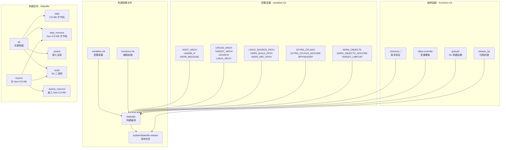
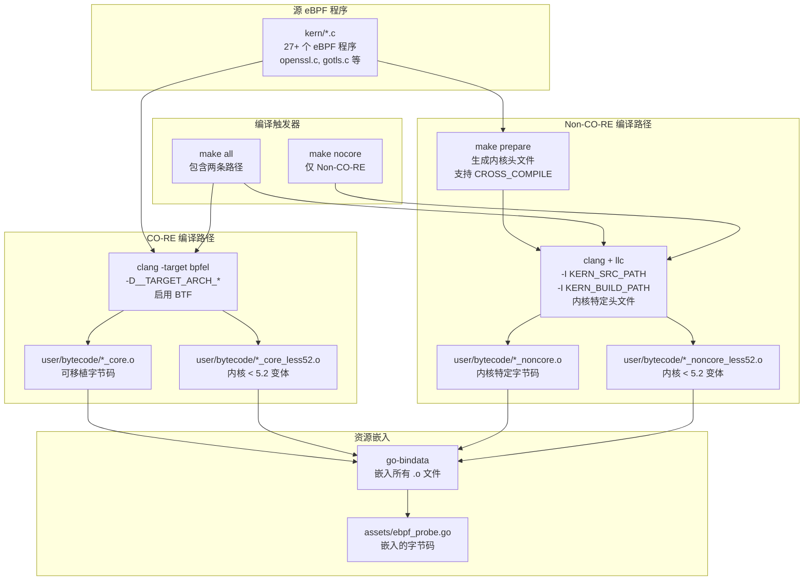
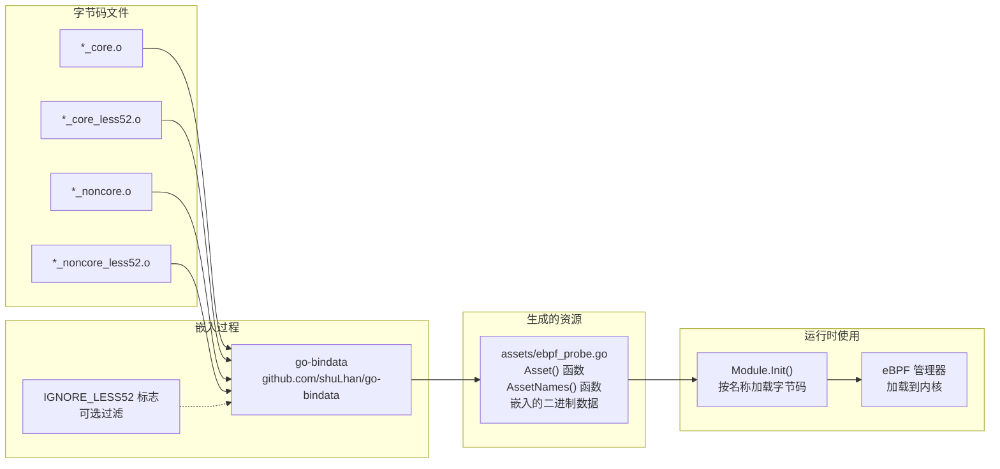
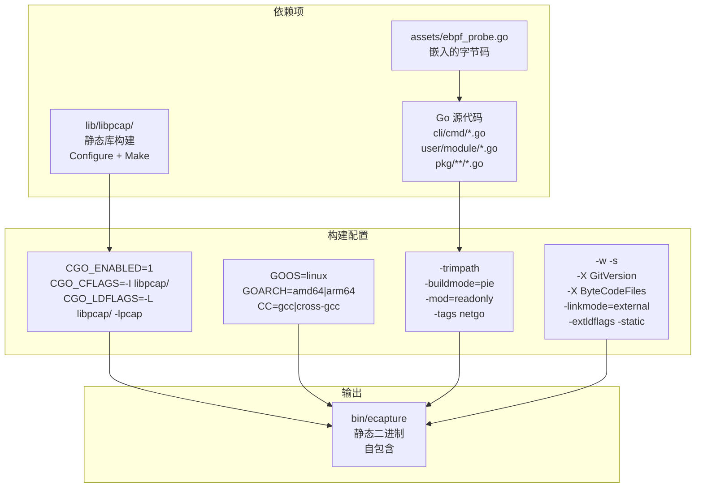
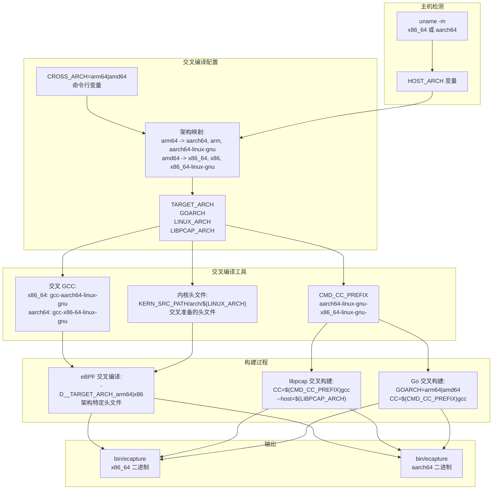
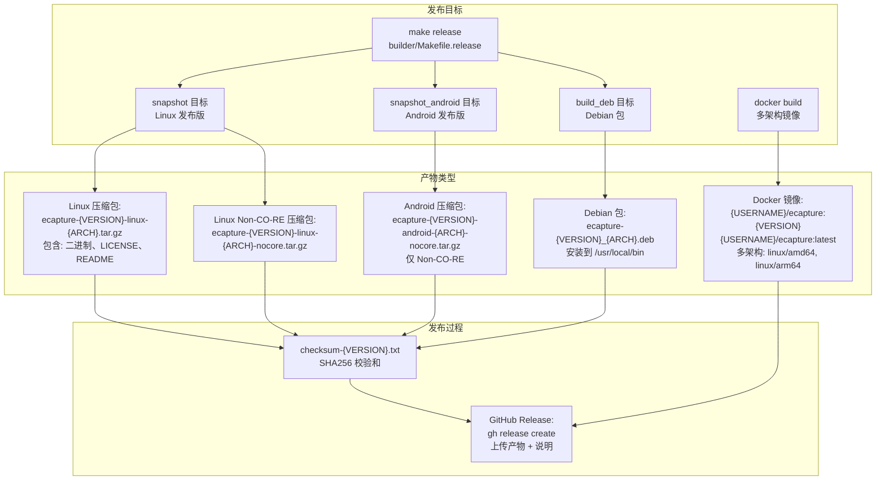
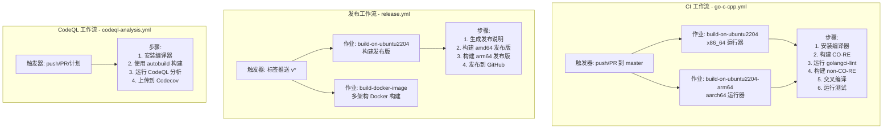

# 构建系统

eCapture 构建系统是一个基于 Makefile 的复杂构建编排系统，实现了双 eBPF 编译路径（CO-RE 和 non-CO-RE）、跨架构编译、资源嵌入以及多格式发布产物生成。本页面文档记录了构建配置、编译流程、依赖管理和发布流程。

关于开发新 eBPF 程序的信息，请参见 [eBPF 程序开发](5.2-ebpf-program-development.md)。关于模块开发，请参见 [添加新模块](5.3-adding-new-modules.md)。

## 构建配置架构

构建系统由三个相互关联的 Makefile 组成，分别管理配置、编排和发布流程。



**来源：** [Makefile:1-2](https://github.com/gojue/ecapture/blob/0766a93b/Makefile#L1-L2), [functions.mk:1-76](https://github.com/gojue/ecapture/blob/0766a93b/functions.mk#L1-L76), [builder/Makefile.release:1-3](https://github.com/gojue/ecapture/blob/0766a93b/builder/Makefile.release#L1-L3)

### 配置变量

`variables.mk` 文件（未显示但在 [Makefile:1](https://github.com/gojue/ecapture/blob/0766a93b/Makefile#L1) 中引用）定义了关键构建配置：

| 变量类别 | 关键变量 | 用途 |
|------------------|---------------|---------|
| **架构检测** | `HOST_ARCH`, `UNAME_R`, `CLANG_VERSION`, `GO_VERSION` | 检测主机环境 |
| **交叉编译** | `CROSS_ARCH`, `TARGET_ARCH`, `GOARCH`, `LINUX_ARCH`, `LIBPCAP_ARCH` | 目标架构配置 |
| **内核路径** | `LINUX_SOURCE_PATH`, `KERN_BUILD_PATH`, `KERN_SRC_PATH` | 内核头文件位置 |
| **构建标志** | `EXTRA_CFLAGS`, `EXTRA_CFLAGS_NOCORE`, `BPFHEADER` | eBPF 编译器标志 |
| **版本控制** | `VERSION_NUM`, `LAST_GIT_TAG`, `BPF_NOCORE_TAG`, `PACKAGE_VERSION` | 版本信息 |
| **工具** | `CMD_CLANG`, `CMD_LLC`, `CMD_GO`, `CMD_CC_PREFIX` | 命令路径 |

构建系统通过 `make env` 打印所有配置（[Makefile:19-63](https://github.com/gojue/ecapture/blob/0766a93b/Makefile#L19-L63)）。

**来源：** [Makefile:19-63](https://github.com/gojue/ecapture/blob/0766a93b/Makefile#L19-L63), [.github/workflows/go-c-cpp.yml:16-33](https://github.com/gojue/ecapture/blob/0766a93b/.github/workflows/go-c-cpp.yml#L16-L33)

### 辅助函数

[functions.mk:1-76](https://github.com/gojue/ecapture/blob/0766a93b/functions.mk#L1-L76) 文件提供可重用的构建函数：

#### 版本检查函数

```makefile
.checkver_$(CMD_CLANG)  # 验证 clang >= 9
.checkver_$(CMD_GO)      # 验证 go >= 1.24
.checkver_$(CMD_BPFTOOL) # 验证 bpftool 可用性
```

这些函数（[functions.mk:13-40](https://github.com/gojue/ecapture/blob/0766a93b/functions.mk#L13-L40)）创建标记文件以避免重复检查，如果不满足要求则构建失败。

#### 变量覆盖函数

`allow-override` 函数（[functions.mk:41-45](https://github.com/gojue/ecapture/blob/0766a93b/functions.mk#L41-L45)）启用条件变量默认值：

```makefile
$(call allow-override,VERSION_FLAG,$(UNAME_R))
```

这种模式允许命令行或环境变量覆盖默认值。

#### Go 构建函数

`gobuild` 函数（[functions.mk:47-54](https://github.com/gojue/ecapture/blob/0766a93b/functions.mk#L47-L54)）封装了带静态链接的 Go 构建命令：

- 启用 CGO 并静态链接 libpcap
- 设置构建模式为 PIE（位置无关可执行文件）
- 通过 `-ldflags` 注入版本信息
- 通过 `ByteCodeFiles` 变量注入字节码文件列表
- 使用 `-extldflags -static` 执行静态链接

#### 发布归档函数

`release_tar` 函数（[functions.mk:62-76](https://github.com/gojue/ecapture/blob/0766a93b/functions.mk#L62-L76)）创建发布归档：

```makefile
$(call release_tar,linux,)        # Linux 发布版
$(call release_tar,android,nocore) # Android 发布版（仅 non-CO-RE）
```

**来源：** [functions.mk:1-76](https://github.com/gojue/ecapture/blob/0766a93b/functions.mk#L1-L76)

## eBPF 编译流程

构建系统实现了两条并行的 eBPF 编译路径：CO-RE（一次编译、到处运行）用于具有 BTF 的现代内核，non-CO-RE 用于需要特定头文件的旧内核。



**来源：** [Makefile:117-183](https://github.com/gojue/ecapture/blob/0766a93b/Makefile#L117-L183), [Makefile:186-195](https://github.com/gojue/ecapture/blob/0766a93b/Makefile#L186-L195)

### CO-RE 编译

CO-RE 编译（[Makefile:117-134](https://github.com/gojue/ecapture/blob/0766a93b/Makefile#L117-L134)）使用 BTF（BPF 类型格式）生成可移植的 eBPF 字节码：

**编译命令：**
```makefile
$(CMD_CLANG) -D__TARGET_ARCH_$(LINUX_ARCH) \
    $(EXTRA_CFLAGS) \
    $(BPFHEADER) \
    -target bpfel -c $< -o $(OUTPUT) \
    -fno-ident -fdebug-compilation-dir . -g \
    -D__BPF_TARGET_MISSING="..." \
    -MD -MP
```

**关键特性：**

1. **目标架构：** `-D__TARGET_ARCH_x86` 或 `-D__TARGET_ARCH_arm64`（[Makefile:122](https://github.com/gojue/ecapture/blob/0766a93b/Makefile#L122)）
2. **启用 BTF：** 使用 `-target bpfel` 生成带 CO-RE 重定位的 BPF ELF 格式
3. **调试信息：** 包含 `-g` 用于 BTF 生成和 `-gdwarf-4`（通过 `EXTRA_CFLAGS`）
4. **依赖跟踪：** `-MD -MP` 生成 `.d` 文件用于增量构建

**输出：**
- `user/bytecode/*_core.o` - 标准 CO-RE 字节码
- `user/bytecode/*_core_less52.o` - 内核 < 5.2 变体，带 `-DKERNEL_LESS_5_2`（[Makefile:131](https://github.com/gojue/ecapture/blob/0766a93b/Makefile#L131)）

内核 < 5.2 变体是必要的，因为早期内核缺少某些 eBPF 功能（例如有界循环、特定辅助函数）。

**来源：** [Makefile:117-134](https://github.com/gojue/ecapture/blob/0766a93b/Makefile#L117-L134), [.github/workflows/go-c-cpp.yml:38-42](https://github.com/gojue/ecapture/blob/0766a93b/.github/workflows/go-c-cpp.yml#L38-L42)

### Non-CO-RE 编译

Non-CO-RE 编译（[Makefile:146-183](https://github.com/gojue/ecapture/blob/0766a93b/Makefile#L146-L183)）使用显式头文件包含生成内核特定字节码：

**准备步骤：**
```makefile
make prepare  # 如果需要则生成内核头文件
```

此步骤（[Makefile:98-104](https://github.com/gojue/ecapture/blob/0766a93b/Makefile#L98-L104)）在交叉编译场景中调用内核头文件生成：
```bash
cd $(LINUX_SOURCE_PATH) && $(KERNEL_HEADER_GEN)
```

**编译命令：**
```makefile
$(CMD_CLANG) \
    $(EXTRA_CFLAGS_NOCORE) \
    $(BPFHEADER) \
    -I $(KERN_SRC_PATH)/arch/$(LINUX_ARCH)/include \
    -I $(KERN_BUILD_PATH)/arch/$(LINUX_ARCH)/include/generated \
    -I $(KERN_SRC_PATH)/include \
    [... 总共 8 个包含路径 ...] \
    -c $< -o - | $(CMD_LLC) \
    -march=bpf -filetype=obj -o $(OUTPUT)
```

**关键特性：**

1. **内核头文件：** 使用 8 个包含路径的内核头文件（[Makefile:154-161](https://github.com/gojue/ecapture/blob/0766a93b/Makefile#L154-L161)）
2. **两阶段编译：** 
   - 阶段 1：`clang` 编译为 LLVM 位码（`-o -`）
   - 阶段 2：`llc` 转换为 BPF 目标文件
3. **架构特定：** 包含 `arch/$(LINUX_ARCH)/include` 头文件
4. **交叉编译：** 支持跨架构构建的 `CROSS_COMPILE` 前缀

**输出：**
- `user/bytecode/*_noncore.o` - 内核特定字节码
- `user/bytecode/*_noncore_less52.o` - 内核 < 5.2 变体（[Makefile:178](https://github.com/gojue/ecapture/blob/0766a93b/Makefile#L178)）

**来源：** [Makefile:98-104](https://github.com/gojue/ecapture/blob/0766a93b/Makefile#L98-L104), [Makefile:146-183](https://github.com/gojue/ecapture/blob/0766a93b/Makefile#L146-L183)

### 内核 < 5.2 支持

两条编译路径都使用 `-DKERNEL_LESS_5_2` 预处理器标志生成内核 < 5.2 的变体。这在 C 代码中启用条件编译：

```c
#ifdef KERNEL_LESS_5_2
    // 使用旧的 eBPF 功能
#else
    // 使用现代 eBPF 功能
#endif
```

这些变体在文件名中带有 `_less52` 后缀（[Makefile:132](https://github.com/gojue/ecapture/blob/0766a93b/Makefile#L132), [Makefile:183](https://github.com/gojue/ecapture/blob/0766a93b/Makefile#L183)）。

**来源：** [Makefile:131-134](https://github.com/gojue/ecapture/blob/0766a93b/Makefile#L131-L134), [Makefile:178-183](https://github.com/gojue/ecapture/blob/0766a93b/Makefile#L178-L183)

## 资源嵌入系统

eBPF 编译后，所有字节码文件使用 `go-bindata` 嵌入到 Go 二进制中。



**来源：** [Makefile:186-195](https://github.com/gojue/ecapture/blob/0766a93b/Makefile#L186-L195)

### 资源生成

`assets` 目标（[Makefile:186-188](https://github.com/gojue/ecapture/blob/0766a93b/Makefile#L186-L188)）嵌入所有字节码：

```makefile
.PHONY: assets
assets: .checkver_$(CMD_GO) ebpf ebpf_noncore
	$(CMD_GO) run github.com/shuLhan/go-bindata/cmd/go-bindata \
	    $(IGNORE_LESS52) -pkg assets -o "assets/ebpf_probe.go" \
	    $(wildcard ./user/bytecode/*.o)
```

`assets_noncore` 目标（[Makefile:191-195](https://github.com/gojue/ecapture/blob/0766a93b/Makefile#L191-L195)）仅嵌入 non-CO-RE 字节码用于特殊构建（如 Android）。

**关键特性：**

1. **包名：** 在 `assets` 包中生成
2. **输出文件：** `assets/ebpf_probe.go`
3. **输入文件：** `user/bytecode/` 中的所有 `.o` 文件
4. **可选过滤：** `IGNORE_LESS52` 可以排除内核 < 5.2 变体

### 生成的资源接口

`go-bindata` 工具生成带有函数的 Go 代码：

```go
// Asset 加载并返回给定名称的资源
func Asset(name string) ([]byte, error)

// AssetNames 返回所有嵌入资源的名称
func AssetNames() []string

// AssetInfo 返回资源的元数据
func AssetInfo(name string) (os.FileInfo, error)
```

运行时，模块按文件名加载字节码：

```go
bytecode, err := assets.Asset("user/bytecode/openssl_kern_core.o")
```

构建系统通过 `ByteCodeFiles` 构建变量将可用字节码文件列表注入二进制（[functions.mk:52](https://github.com/gojue/ecapture/blob/0766a93b/functions.mk#L52)）：

```makefile
-X 'github.com/gojue/ecapture/cli/cmd.ByteCodeFiles=$(BYTECODE_FILES)'
```

这允许在运行时在 CO-RE 和 non-CO-RE 字节码之间进行选择。

**来源：** [Makefile:186-195](https://github.com/gojue/ecapture/blob/0766a93b/Makefile#L186-L195), [go.mod:12](https://github.com/gojue/ecapture/blob/0766a93b/go.mod#L12), [functions.mk:52](https://github.com/gojue/ecapture/blob/0766a93b/functions.mk#L52)

## Go 二进制编译

Go 二进制编译集成了静态链接和嵌入资源。



**来源：** [Makefile:199-208](https://github.com/gojue/ecapture/blob/0766a93b/Makefile#L199-L208), [Makefile:211-225](https://github.com/gojue/ecapture/blob/0766a93b/Makefile#L211-L225), [functions.mk:47-54](https://github.com/gojue/ecapture/blob/0766a93b/functions.mk#L47-L54)

### libpcap 静态构建

在 Go 编译之前，构建系统编译静态 `libpcap` 库（[Makefile:199-208](https://github.com/gojue/ecapture/blob/0766a93b/Makefile#L199-L208)）：

```makefile
$(TARGET_LIBPCAP):
	test -f ./lib/libpcap/configure || git submodule update --init
	cd lib/libpcap && \
	    CC=$(CMD_CC_PREFIX)$(CMD_CC) AR=$(CMD_AR_PREFIX)$(CMD_AR) \
	    CFLAGS="-O2 -g -gdwarf-4 -static -Wno-unused-result" \
	    ./configure --disable-rdma --disable-shared --disable-usb \
	        --disable-netmap --disable-bluetooth --disable-dbus \
	        --without-libnl --without-dpdk --without-dag \
	        --without-septel --without-snf --without-gcc \
	        --with-pcap=linux --without-turbocap \
	        --host=$(LIBPCAP_ARCH) && \
	    CC=$(CMD_CC_PREFIX)$(CMD_CC) AR=$(CMD_AR_PREFIX)$(CMD_AR) make
```

**配置要点：**

- **静态构建：** `--disable-shared` 和 CFLAGS 中的 `-static`
- **最小功能：** 禁用 RDMA、USB、Bluetooth、DBus
- **仅 Linux：** `--with-pcap=linux`
- **交叉编译：** 使用 `$(CMD_CC_PREFIX)` 和 `--host=$(LIBPCAP_ARCH)`
- **调试信息：** `-g -gdwarf-4` 用于调试

静态 `libpcap.a` 链接到最终二进制。

**来源：** [Makefile:199-208](https://github.com/gojue/ecapture/blob/0766a93b/Makefile#L199-L208)

### Go 构建命令

`gobuild` 函数（[functions.mk:47-54](https://github.com/gojue/ecapture/blob/0766a93b/functions.mk#L47-L54)）执行 Go 编译：

```makefile
CGO_ENABLED=1 \
CGO_CFLAGS='-O2 -g -gdwarf-4 -I$(CURDIR)/lib/libpcap/' \
CGO_LDFLAGS='-O2 -g -L$(CURDIR)/lib/libpcap/ -lpcap -static' \
GOOS=linux GOARCH=$(GOARCH) CC=$(CMD_CC_PREFIX)$(CMD_CC) \
$(CMD_GO) build -trimpath -buildmode=pie -mod=readonly \
    -tags '$(TARGET_TAG),netgo' \
    -ldflags "-w -s \
        -X 'github.com/gojue/ecapture/cli/cmd.GitVersion=$(TARGET_TAG)_$(GOARCH):$(VERSION_NUM):$(VERSION_FLAG)' \
        -X 'github.com/gojue/ecapture/cli/cmd.ByteCodeFiles=$(BYTECODE_FILES)' \
        -linkmode=external -extldflags -static" \
    -o $(OUT_BIN)
```

**构建标志说明：**

| 标志 | 用途 |
|------|---------|
| `CGO_ENABLED=1` | 启用 CGO 用于 libpcap 集成 |
| `CGO_CFLAGS` | 包含 libpcap 头文件 |
| `CGO_LDFLAGS` | 链接静态 libpcap |
| `-trimpath` | 移除构建路径以实现可重现性 |
| `-buildmode=pie` | 位置无关可执行文件 |
| `-mod=readonly` | 如果 `go.mod` 需要更新则失败 |
| `-tags netgo` | 使用纯 Go 网络栈（备份） |
| `-w -s` | 去除调试符号 |
| `-X` | 注入版本和字节码列表 |
| `-linkmode=external` | 使用外部 C 链接器 |
| `-extldflags -static` | 完全静态二进制 |

**版本注入：**

构建注入两个关键变量：
1. `GitVersion` - 格式：`{TAG}_{ARCH}:{VERSION_NUM}:{VERSION_FLAG}`
2. `ByteCodeFiles` - 字节码类型列表（如 "core", "noncore"）

这些在运行时可通过 `cli/cmd` 包变量访问。

**来源：** [functions.mk:47-54](https://github.com/gojue/ecapture/blob/0766a93b/functions.mk#L47-L54)

### 构建目标

| 目标 | eBPF 字节码 | 资源 | 描述 |
|--------|---------------|--------|-------------|
| `make all` | CO-RE + non-CO-RE | 全部 | 包含两种字节码类型的完整构建 |
| `make nocore` | 仅 non-CO-RE | Non-CO-RE | 内核特定构建 |
| `make build` | （使用现有） | 全部 | 仅 Go 二进制 |
| `make build_noncore` | （使用现有） | Non-CO-RE | Non-CO-RE Go 二进制 |

`all` 目标（[Makefile:6](https://github.com/gojue/ecapture/blob/0766a93b/Makefile#L6)）是默认目标，生成包含 CO-RE 和 non-CO-RE 字节码的二进制，允许运行时选择。

`nocore` 目标（[Makefile:10](https://github.com/gojue/ecapture/blob/0766a93b/Makefile#L10)）生成仅包含内核特定字节码的较小二进制，适用于资源受限环境或 Android。

**来源：** [Makefile:4-14](https://github.com/gojue/ecapture/blob/0766a93b/Makefile#L4-L14), [Makefile:211-225](https://github.com/gojue/ecapture/blob/0766a93b/Makefile#L211-L225)

## 交叉编译架构

eCapture 支持 x86_64 和 aarch64 架构之间的双向交叉编译。



**来源：** [.github/workflows/go-c-cpp.yml:56-65](https://github.com/gojue/ecapture/blob/0766a93b/.github/workflows/go-c-cpp.yml#L56-L65), [.github/workflows/release.yml:93-97](https://github.com/gojue/ecapture/blob/0766a93b/.github/workflows/release.yml#L93-L97), [builder/init_env.sh:43-61](https://github.com/gojue/ecapture/blob/0766a93b/builder/init_env.sh#L43-L61)

### 交叉编译变量

通过设置 `CROSS_ARCH` 触发交叉编译：

```bash
CROSS_ARCH=arm64 make    # 在 x86_64 主机上构建 arm64
CROSS_ARCH=amd64 make    # 在 aarch64 主机上构建 amd64
```

构建系统将 `CROSS_ARCH` 映射到多个架构特定变量：

| 变量 | arm64 值 | amd64 值 | 用途 |
|----------|-------------|-------------|---------|
| `GOARCH` | `arm64` | `amd64` | Go 架构目标 |
| `LINUX_ARCH` | `arm64` | `x86` | Linux 内核架构名称 |
| `TARGET_ARCH` | `aarch64` | `x86_64` | GCC 目标架构 |
| `LIBPCAP_ARCH` | `aarch64-linux-gnu` | `x86_64-linux-gnu` | libpcap configure host |
| `CMD_CC_PREFIX` | `aarch64-linux-gnu-` | `x86_64-linux-gnu-` | 交叉编译器前缀 |

这些映射在 `variables.mk` 中定义（引用但未显示）。

**来源：** [builder/init_env.sh:43-61](https://github.com/gojue/ecapture/blob/0766a93b/builder/init_env.sh#L43-L61)

### 交叉编译工具链设置

CI 工作流（[.github/workflows/go-c-cpp.yml:16-33](https://github.com/gojue/ecapture/blob/0766a93b/.github/workflows/go-c-cpp.yml#L16-L33)）和初始化脚本（[builder/init_env.sh:1-106](https://github.com/gojue/ecapture/blob/0766a93b/builder/init_env.sh#L1-L106)）安装交叉编译工具链：

**在 x86_64 主机上（目标 arm64）：**
```bash
sudo apt-get install gcc-aarch64-linux-gnu linux-source
cd /usr/src/linux-source-*
sudo make ARCH=arm64 CROSS_COMPILE=aarch64-linux-gnu- prepare
```

**在 aarch64 主机上（目标 x86_64）：**
```bash
sudo apt-get install gcc-x86-64-linux-gnu linux-source
cd /usr/src/linux-source-*
sudo make ARCH=x86 CROSS_COMPILE=x86_64-linux-gnu- prepare
```

`make prepare` 命令生成 non-CO-RE eBPF 编译所需的架构特定内核头文件。

**来源：** [.github/workflows/go-c-cpp.yml:16-33](https://github.com/gojue/ecapture/blob/0766a93b/.github/workflows/go-c-cpp.yml#L16-L33), [.github/workflows/go-c-cpp.yml:76-93](https://github.com/gojue/ecapture/blob/0766a93b/.github/workflows/go-c-cpp.yml#L76-L93), [builder/init_env.sh:72-89](https://github.com/gojue/ecapture/blob/0766a93b/builder/init_env.sh#L72-L89)

### 交叉编译实践

#### eBPF 交叉编译

CO-RE eBPF 字节码通过 `-D__TARGET_ARCH_$(LINUX_ARCH)` 标志感知架构（[Makefile:122](https://github.com/gojue/ecapture/blob/0766a93b/Makefile#L122)），解析为：
- x86_64 的 `-D__TARGET_ARCH_x86`
- aarch64 的 `-D__TARGET_ARCH_arm64`

Non-CO-RE 编译使用目标架构的交叉准备内核头文件（[Makefile:154-161](https://github.com/gojue/ecapture/blob/0766a93b/Makefile#L154-L161)）。

#### libpcap 交叉构建

libpcap configure 步骤（[Makefile:203-207](https://github.com/gojue/ecapture/blob/0766a93b/Makefile#L203-L207)）使用：
```makefile
CC=$(CMD_CC_PREFIX)$(CMD_CC) --host=$(LIBPCAP_ARCH)
```

其中：
- `CMD_CC_PREFIX` 是 `aarch64-linux-gnu-` 或 `x86_64-linux-gnu-`
- `LIBPCAP_ARCH` 是 `aarch64-linux-gnu` 或 `x86_64-linux-gnu`

#### Go 交叉构建

Go 构建（[functions.mk:51](https://github.com/gojue/ecapture/blob/0766a93b/functions.mk#L51)）设置：
```makefile
GOARCH=$(GOARCH) CC=$(CMD_CC_PREFIX)$(CMD_CC)
```

这告诉 Go 使用交叉编译器进行 CGO 编译并针对指定架构。

**来源：** [Makefile:122](https://github.com/gojue/ecapture/blob/0766a93b/Makefile#L122), [Makefile:154-161](https://github.com/gojue/ecapture/blob/0766a93b/Makefile#L154-L161), [Makefile:203-207](https://github.com/gojue/ecapture/blob/0766a93b/Makefile#L203-L207), [functions.mk:51](https://github.com/gojue/ecapture/blob/0766a93b/functions.mk#L51)

### CI/CD 交叉编译工作流

GitHub Actions 工作流演示了交叉编译过程：

```yaml
- name: Build CO-RE (Cross-Compilation)
  run: |
    make clean
    CROSS_ARCH=arm64 make env
    CROSS_ARCH=arm64 make -j8

- name: Build non-CO-RE (Cross-Compilation/Android)
  run: |
    make clean
    CROSS_ARCH=arm64 make env
    ANDROID=1 CROSS_ARCH=arm64 make nocore -j8
```

此工作流（[.github/workflows/go-c-cpp.yml:56-65](https://github.com/gojue/ecapture/blob/0766a93b/.github/workflows/go-c-cpp.yml#L56-L65)）验证：
1. CO-RE 交叉编译工作正常
2. Non-CO-RE 交叉编译工作正常
3. Android 特定构建工作正常（仅 non-CO-RE）

该工作流在 x86_64（[.github/workflows/go-c-cpp.yml:9-11](https://github.com/gojue/ecapture/blob/0766a93b/.github/workflows/go-c-cpp.yml#L9-L11)）和 aarch64（[.github/workflows/go-c-cpp.yml:69-71](https://github.com/gojue/ecapture/blob/0766a93b/.github/workflows/go-c-cpp.yml#L69-L71)）运行器上运行。

**来源：** [.github/workflows/go-c-cpp.yml:56-65](https://github.com/gojue/ecapture/blob/0766a93b/.github/workflows/go-c-cpp.yml#L56-L65), [.github/workflows/go-c-cpp.yml:116-125](https://github.com/gojue/ecapture/blob/0766a93b/.github/workflows/go-c-cpp.yml#L116-L125)

## 发布产物生成

构建系统生成多种发布产物格式：压缩包、Debian 包、Docker 镜像和 Android 特定构建。



**来源：** [builder/Makefile.release:1-151](https://github.com/gojue/ecapture/blob/0766a93b/builder/Makefile.release#L1-L151), [.github/workflows/release.yml:1-129](https://github.com/gojue/ecapture/blob/0766a93b/.github/workflows/release.yml#L1-L129)

### 发布压缩包生成

`release_tar` 函数（[functions.mk:62-76](https://github.com/gojue/ecapture/blob/0766a93b/functions.mk#L62-L76)）创建发布归档：

```makefile
$(call release_tar,linux,)          # 完整构建（CO-RE + non-CO-RE）
$(call release_tar,linux,nocore)    # 仅 Non-CO-RE
$(call release_tar,android,nocore)  # Android（仅 non-CO-RE）
```

**压缩包内容：**
1. `ecapture` 二进制
2. `LICENSE` 文件
3. `CHANGELOG.md`
4. `README.md` 和 `README_CN.md`

**命名约定：**
```
ecapture-{VERSION}-{PLATFORM}-{ARCH}{CORE_SUFFIX}.tar.gz
```

其中：
- `VERSION` 来自 `SNAPSHOT_VERSION` 或 git 标签
- `PLATFORM` 是 `linux` 或 `android`
- `ARCH` 是 `amd64` 或 `arm64`
- `CORE_SUFFIX` 为空或 `-nocore`

示例：
- `ecapture-v0.8.0-linux-amd64.tar.gz`（完整构建）
- `ecapture-v0.8.0-linux-arm64-nocore.tar.gz`（non-CO-RE）
- `ecapture-v0.8.0-android-arm64-nocore.tar.gz`（Android）

**来源：** [functions.mk:62-76](https://github.com/gojue/ecapture/blob/0766a93b/functions.mk#L62-L76), [builder/Makefile.release:94-112](https://github.com/gojue/ecapture/blob/0766a93b/builder/Makefile.release#L94-L112)

### Debian 包生成

`build_deb` 目标（[builder/Makefile.release:135-151](https://github.com/gojue/ecapture/blob/0766a93b/builder/Makefile.release#L135-L151)）创建 `.deb` 包：

**包结构：**
```
BUILD_DIR/
├── DEBIAN/
│   └── control         # 包元数据
└── usr/local/bin/
    └── ecapture        # 二进制
```

**控制文件字段：**
- `Package`: `ecapture`
- `Version`: 来自 `PACKAGE_VERSION`
- `Architecture`: `amd64` 或 `arm64`
- `Maintainer`: 包维护者
- `Description`: 简短描述
- `Homepage`: 项目 URL

**输出文件名：**
```
ecapture-{VERSION}_{ARCH}.deb
```

示例：`ecapture-0.8.0_amd64.deb`

该包将二进制安装到 `/usr/local/bin/ecapture`，使其在使用 `dpkg -i` 安装后全局可访问。

**来源：** [builder/Makefile.release:135-151](https://github.com/gojue/ecapture/blob/0766a93b/builder/Makefile.release#L135-L151)

### Docker 多架构镜像

Docker 构建（[builder/Dockerfile:1-39](https://github.com/gojue/ecapture/blob/0766a93b/builder/Dockerfile#L1-L39)）使用 BuildKit 创建多架构镜像：

**构建过程：**

1. **基础镜像：** `ubuntu:22.04` 带构建依赖
2. **编译器安装：** clang-14、llvm-14、gcc
3. **Go 安装：** 目标架构的特定版本 Go 二进制
4. **eCapture 构建：** 完整 `make all` 带嵌入字节码
5. **最终镜像：** 最小 `alpine:latest` 仅包含二进制

**多架构工作流**（[.github/workflows/release.yml:101-129](https://github.com/gojue/ecapture/blob/0766a93b/.github/workflows/release.yml#L101-L129)）：

```yaml
- name: Build and push
  uses: docker/build-push-action@v5
  with:
    platforms: linux/amd64,linux/arm64
    push: true
    tags: |
      {USERNAME}/ecapture:{VERSION}
      {USERNAME}/ecapture:latest
```

**关键功能：**

- **构建缓存：** 使用注册表缓存加快构建
- **版本注入：** `--build-args VERSION={VERSION}`
- **入口点：** `/ecapture` 用于直接执行
- **多平台：** 同时构建 amd64 和 arm64

使用：
```bash
docker run --rm -it --privileged {USERNAME}/ecapture:latest tls
```

**来源：** [builder/Dockerfile:1-39](https://github.com/gojue/ecapture/blob/0766a93b/builder/Dockerfile#L1-L39), [.github/workflows/release.yml:101-129](https://github.com/gojue/ecapture/blob/0766a93b/.github/workflows/release.yml#L101-L129)

### 发布发布工作流

`publish` 目标（[builder/Makefile.release:114-124](https://github.com/gojue/ecapture/blob/0766a93b/builder/Makefile.release#L114-L124)）将产物发布到 GitHub：

```makefile
publish:
	cd $(OUTPUT_DIR)
	$(CMD_CHECKSUM) ecapture*v* | $(CMD_SED) 's/.\/bin\///g' > checksum-{VERSION}.txt
	FILES=$$(ls ecapture-*.tar.gz ecapture*.deb checksum-*.txt)
	$(CMD_GITHUB) release create $(DEB_VERSION) $$FILES \
	    --title "eCapture $(DEB_VERSION)" \
	    --notes-file $(RELEASE_NOTES)
```

**过程：**

1. 为所有产物生成 SHA256 校验和
2. 收集压缩包、`.deb` 文件和校验和文件
3. 使用标签创建 GitHub release
4. 上传所有文件
5. 包含来自 `bin/release_notes.txt` 的发布说明

**发布说明生成**（[.github/workflows/release.yml:68-80](https://github.com/gojue/ecapture/blob/0766a93b/.github/workflows/release.yml#L68-L80)）使用 GitHub API：

```bash
gh api /repos/{repo}/releases/generate-notes \
    -f tag_name={VERSION} \
    -f previous_tag_name={PREVIOUS_TAG}
```

这会根据提交消息和 PR 自动生成发布说明。

**来源：** [builder/Makefile.release:114-124](https://github.com/gojue/ecapture/blob/0766a93b/builder/Makefile.release#L114-L124), [.github/workflows/release.yml:63-87](https://github.com/gojue/ecapture/blob/0766a93b/.github/workflows/release.yml#L63-L87)

### Android 特定构建

Android 构建专门使用 non-CO-RE 编译（[.github/workflows/go-c-cpp.yml:61-65](https://github.com/gojue/ecapture/blob/0766a93b/.github/workflows/go-c-cpp.yml#L61-L65)）：

```bash
ANDROID=1 CROSS_ARCH=arm64 make nocore
```

**理由：**

1. Android 内核通常缺少 BTF 支持
2. Android 使用自定义内核版本
3. Non-CO-RE 确保与 Android 内核的兼容性
4. 更小的二进制（无 CO-RE 字节码开销）

`ANDROID` 标志可能在 `variables.mk` 中触发 Android 特定的预处理器指令或配置。

Android 发布版使用 `android` 平台名称标记：
```
ecapture-v0.8.0-android-arm64-nocore.tar.gz
```

**来源：** [.github/workflows/go-c-cpp.yml:61-65](https://github.com/gojue/ecapture/blob/0766a93b/.github/workflows/go-c-cpp.yml#L61-L65), [builder/Makefile.release:104-112](https://github.com/gojue/ecapture/blob/0766a93b/builder/Makefile.release#L104-L112)

## CI/CD 集成

GitHub Actions 工作流自动化构建、测试和发布。



**来源：** [.github/workflows/go-c-cpp.yml:1-128](https://github.com/gojue/ecapture/blob/0766a93b/.github/workflows/go-c-cpp.yml#L1-L128), [.github/workflows/release.yml:1-129](https://github.com/gojue/ecapture/blob/0766a93b/.github/workflows/release.yml#L1-L129), [.github/workflows/codeql-analysis.yml:1-92](https://github.com/gojue/ecapture/blob/0766a93b/.github/workflows/codeql-analysis.yml#L1-L92)

### CI 工作流 (go-c-cpp.yml)

此工作流（[.github/workflows/go-c-cpp.yml:1-128](https://github.com/gojue/ecapture/blob/0766a93b/.github/workflows/go-c-cpp.yml#L1-L128)）在每次推送和 PR 时运行：

**构建矩阵：**
- **x86_64 作业：** Ubuntu 22.04 在 x86_64 运行器上（[.github/workflows/go-c-cpp.yml:9-67](https://github.com/gojue/ecapture/blob/0766a93b/.github/workflows/go-c-cpp.yml#L9-L67)）
- **aarch64 作业：** Ubuntu 22.04 在 ARM64 运行器上（[.github/workflows/go-c-cpp.yml:69-127](https://github.com/gojue/ecapture/blob/0766a93b/.github/workflows/go-c-cpp.yml#L69-L127)）

**构建序列：**

1. **安装依赖**（[.github/workflows/go-c-cpp.yml:16-33](https://github.com/gojue/ecapture/blob/0766a93b/.github/workflows/go-c-cpp.yml#L16-L33)）：
   - Go 1.24.6
   - clang-14、llvm-14、gcc
   - 交叉编译工具链
   - Linux 内核源码

2. **原生 CO-RE 构建**（[.github/workflows/go-c-cpp.yml:38-44](https://github.com/gojue/ecapture/blob/0766a93b/.github/workflows/go-c-cpp.yml#L38-L44)）：
   ```bash
   make clean
   make env
   DEBUG=1 make -j8
   ```

3. **代码检查**（[.github/workflows/go-c-cpp.yml:45-50](https://github.com/gojue/ecapture/blob/0766a93b/.github/workflows/go-c-cpp.yml#L45-L50)）：
   ```bash
   golangci-lint run
   ```

4. **原生 non-CO-RE 构建**（[.github/workflows/go-c-cpp.yml:51-55](https://github.com/gojue/ecapture/blob/0766a93b/.github/workflows/go-c-cpp.yml#L51-L55)）：
   ```bash
   make nocore
   ```

5. **交叉编译 CO-RE**（[.github/workflows/go-c-cpp.yml:56-60](https://github.com/gojue/ecapture/blob/0766a93b/.github/workflows/go-c-cpp.yml#L56-L60)）：
   ```bash
   CROSS_ARCH=arm64 make  # 在 x86_64 上
   CROSS_ARCH=amd64 make  # 在 ARM64 上
   ```

6. **交叉编译 Android**（[.github/workflows/go-c-cpp.yml:61-65](https://github.com/gojue/ecapture/blob/0766a93b/.github/workflows/go-c-cpp.yml#L61-L65)）：
   ```bash
   ANDROID=1 CROSS_ARCH=arm64 make nocore
   ```

7. **运行测试**（[.github/workflows/go-c-cpp.yml:66-67](https://github.com/gojue/ecapture/blob/0766a93b/.github/workflows/go-c-cpp.yml#L66-L67)）：
   ```bash
   go test -v -race ./...
   ```

这个全面的 CI 确保所有构建配置都能正常工作。

**来源：** [.github/workflows/go-c-cpp.yml:1-128](https://github.com/gojue/ecapture/blob/0766a93b/.github/workflows/go-c-cpp.yml#L1-L128)

### 发布工作流 (release.yml)

此工作流（[.github/workflows/release.yml:1-129](https://github.com/gojue/ecapture/blob/0766a93b/.github/workflows/release.yml#L1-L129)）在版本标签（`v*`）时触发：

**作业：**

1. **构建和发布**（[.github/workflows/release.yml:13-100](https://github.com/gojue/ecapture/blob/0766a93b/.github/workflows/release.yml#L13-L100)）：
   - 从提交生成发布说明
   - 构建 amd64 原生发布版
   - 构建 arm64 交叉编译发布版
   - 创建 GitHub release
   - 上传所有产物

2. **Docker 多架构构建**（[.github/workflows/release.yml:101-129](https://github.com/gojue/ecapture/blob/0766a93b/.github/workflows/release.yml#L101-L129)）：
   - 为 `linux/amd64` 和 `linux/arm64` 构建
   - 推送到 Docker Hub
   - 使用版本和 `latest` 标签

**生成的发布产物：**

对于 **amd64**（在 x86_64 上原生构建）：
- `ecapture-{VERSION}-linux-amd64.tar.gz`
- `ecapture-{VERSION}-linux-amd64.deb`

对于 **arm64**（在 x86_64 上交叉编译）：
- `ecapture-{VERSION}-linux-arm64.tar.gz`
- `ecapture-{VERSION}-android-arm64-nocore.tar.gz`
- `ecapture-{VERSION}-linux-arm64.deb`

另外：
- 包含 SHA256 哈希的 `checksum-{VERSION}.txt`
- 包含生成的发布说明的 `release_notes.txt`

**来源：** [.github/workflows/release.yml:1-129](https://github.com/gojue/ecapture/blob/0766a93b/.github/workflows/release.yml#L1-L129)

### CodeQL 分析工作流

CodeQL 工作流（[.github/workflows/codeql-analysis.yml:1-92](https://github.com/gojue/ecapture/blob/0766a93b/.github/workflows/codeql-analysis.yml#L1-L92)）执行安全扫描：

**触发器：**
- 推送到 master
- Pull requests
- 每周计划（周三 15:42）

**语言矩阵：**
- C/C++ 分析 eBPF 代码
- Go 分析应用代码

**过程：**
1. 安装构建依赖
2. 运行 autobuild（尝试自动检测构建）
3. 如果 autobuild 失败，显式运行 `make nocore`
4. 执行 CodeQL 分析
5. 将结果上传到 GitHub Security 选项卡
6. 上传覆盖率到 Codecov

这确保了代码库的持续安全监控。

**来源：** [.github/workflows/codeql-analysis.yml:1-92](https://github.com/gojue/ecapture/blob/0766a93b/.github/workflows/codeql-analysis.yml#L1-L92)

## 开发环境设置

`builder/init_env.sh` 脚本（[builder/init_env.sh:1-106](https://github.com/gojue/ecapture/blob/0766a93b/builder/init_env.sh#L1-L106)）自动化 Ubuntu 上的开发环境设置：

**功能：**

1. **发行版检测：** 根据 Ubuntu 版本选择适当的 clang 版本
2. **架构检测：** 配置交叉编译工具链
3. **依赖安装：** 安装所有必需的构建工具
4. **内核头文件准备：** 为原生和交叉编译准备头文件
5. **Go 安装：** 下载并安装 Go 1.24.6
6. **仓库克隆：** 克隆 eCapture 源码

**使用：**
```bash
/bin/bash -c "$(curl -fsSL https://raw.githubusercontent.com/gojue/ecapture/master/builder/init_env.sh)"
```

**支持的 Ubuntu 版本：**
- 20.04（clang-10）
- 20.10、21.04、21.10、22.04、22.10（clang-11/12）
- 23.04、23.10（clang-15）
- 24.04（clang-18）

运行后，开发人员可以立即使用 `make` 构建 eCapture。

**来源：** [builder/init_env.sh:1-106](https://github.com/gojue/ecapture/blob/0766a93b/builder/init_env.sh#L1-L106)

## 构建系统总结

eCapture 构建系统实现了一个生产级的编译和发布流程，具有以下特点：

**架构：**
- 三文件 Makefile 系统，关注点分离
- 双 eBPF 编译（CO-RE 和 non-CO-RE）
- 双向交叉编译（x86_64 ↔ aarch64）
- 静态链接用于自包含二进制
- 通过 go-bindata 嵌入资源

**输出：**
- Linux 原生构建（CO-RE + non-CO-RE）
- Linux 仅 non-CO-RE 构建
- Android ARM64 构建
- Debian 包
- 多架构 Docker 镜像
- SHA256 校验和

**自动化：**
- 在 x86_64 和 aarch64 上持续集成
- 版本标签时自动发布
- 使用 CodeQL 进行安全分析
- 环境设置脚本

这个全面的构建系统确保 eCapture 在各种 Linux 环境中可靠运行，从具有 BTF 启用内核的现代服务器到旧系统和 Android 设备。