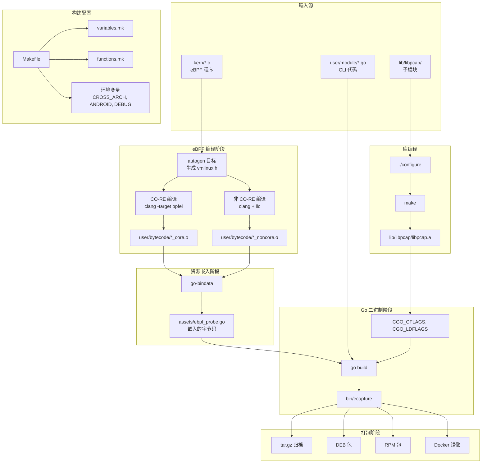
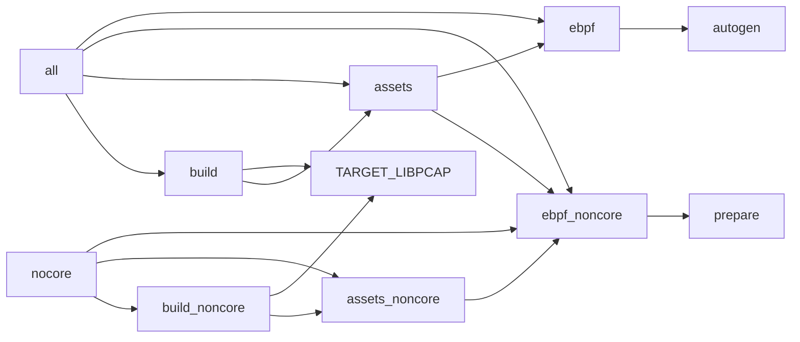
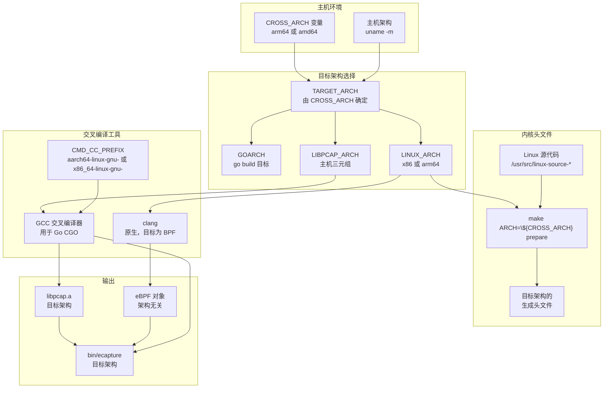
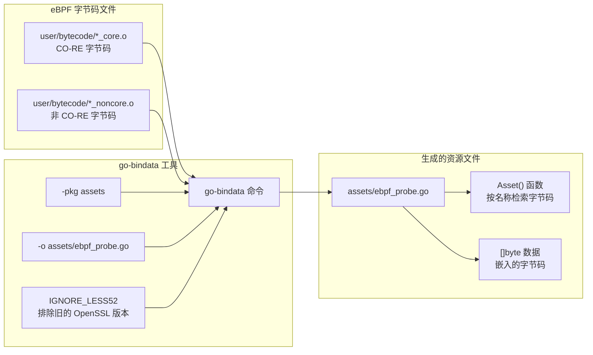
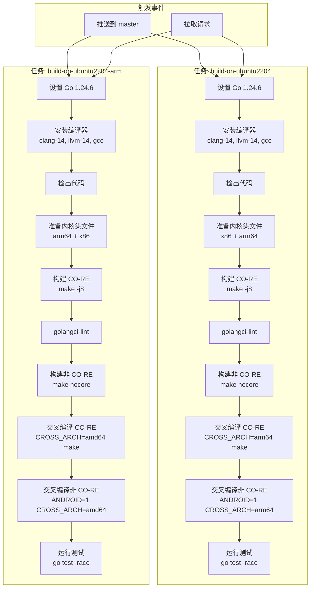
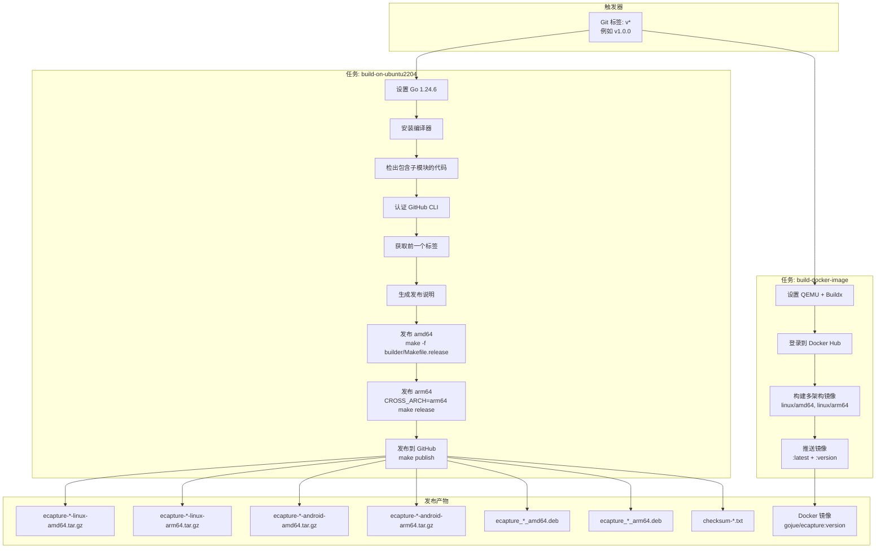

# 构建系统

## 目的与范围

本文档描述了 eCapture 的构建系统，包括 Makefile 目标、编译过程、交叉编译支持、资源嵌入以及 CI/CD 工作流。构建系统同时处理 CO-RE（一次编译 - 随处运行）和非 CO-RE eBPF 字节码的编译，生成多种包格式，并支持 x86_64 和 arm64 架构的跨平台构建。

有关 eBPF 程序开发和结构的信息，请参阅 [eBPF 程序开发](5.2-ebpf-program-development.md)。有关发布和部署的详细信息，请参阅 [CI/CD 与发布流程](5.5-cicd-and-release-process.md)。

---

## 构建系统架构

构建系统通过一个主 Makefile 进行协调，该 Makefile 将任务委托给专门的 makefile 以处理不同的构建目标。整体架构遵循多阶段流程：eBPF 编译、资源嵌入和 Go 二进制编译。

### 构建流程概览


```mermaid
graph TB
    subgraph "输入源"
        KERN_C["kern/*.c<br/>eBPF 程序"]
        USER_GO["user/module/*.go<br/>CLI 代码"]
        LIBPCAP_SRC["lib/libpcap/<br/>子模块"]
    end
    
    subgraph "构建配置"
        MAKEFILE["Makefile"]
        VARIABLES["variables.mk"]
        FUNCTIONS["functions.mk"]
        ENV_VARS["环境变量<br/>CROSS_ARCH, ANDROID, DEBUG"]
    end
    
    subgraph "eBPF 编译阶段"
        AUTOGEN["autogen 目标<br/>生成 vmlinux.h"]
        CORE_COMPILE["CO-RE 编译<br/>clang -target bpfel"]
        NONCORE_COMPILE["非 CO-RE 编译<br/>clang + llc"]
        BYTECODE_CORE["user/bytecode/*_core.o"]
        BYTECODE_NONCORE["user/bytecode/*_noncore.o"]
    end
    
    subgraph "资源嵌入阶段"
        GOBINDATA["go-bindata"]
        ASSETS["assets/ebpf_probe.go<br/>嵌入的字节码"]
    end
    
    subgraph "库编译"
        LIBPCAP_CONF["./configure"]
        LIBPCAP_MAKE["make"]
        LIBPCAP_A["lib/libpcap/libpcap.a"]
    end
    
    subgraph "Go 二进制阶段"
        GO_BUILD["go build"]
        CGO_FLAGS["CGO_CFLAGS, CGO_LDFLAGS"]
        BINARY["bin/ecapture"]
    end
    
    subgraph "打包阶段"
        TAR["tar.gz 归档"]
        DEB["DEB 包"]
        RPM["RPM 包"]
        DOCKER["Docker 镜像"]
    end
    
    MAKEFILE --> VARIABLES
    MAKEFILE --> FUNCTIONS
    MAKEFILE --> ENV_VARS
    
    KERN_C --> AUTOGEN
    AUTOGEN --> CORE_COMPILE
    AUTOGEN --> NONCORE_COMPILE
    CORE_COMPILE --> BYTECODE_CORE
    NONCORE_COMPILE --> BYTECODE_NONCORE
    
    BYTECODE_CORE --> GOBINDATA
    BYTECODE_NONCORE --> GOBINDATA
    GOBINDATA --> ASSETS
    
    LIBPCAP_SRC --> LIBPCAP_CONF
    LIBPCAP_CONF --> LIBPCAP_MAKE
    LIBPCAP_MAKE --> LIBPCAP_A
    
    ASSETS --> GO_BUILD
    USER_GO --> GO_BUILD
    LIBPCAP_A --> CGO_FLAGS
    CGO_FLAGS --> GO_BUILD
    GO_BUILD --> BINARY
    
    BINARY --> TAR
    BINARY --> DEB
    BINARY --> RPM
    BINARY --> DOCKER
```

**来源：** [Makefile:1-245](https://github.com/gojue/ecapture/blob/ca085d05/Makefile#L1-L245), [functions.mk:1-76](https://github.com/gojue/ecapture/blob/ca085d05/functions.mk#L1-L76)

---

## 主要构建目标

Makefile 为不同的构建场景提供了几个顶级目标。每个目标代表从源代码到二进制文件的完整构建流水线。

| 目标 | 描述 | eBPF 模式 | 使用场景 |
|--------|-------------|-----------|----------|
| `all` | 完整构建，包含 CO-RE 和非 CO-RE 字节码 | 两者都有 | 在支持 BTF 的系统上进行开发和测试 |
| `nocore` / `noncore` | 仅使用非 CO-RE 字节码构建 | 仅非 CO-RE | 生产构建以获得最大兼容性 |
| `ebpf` | 仅编译 CO-RE eBPF 程序 | CO-RE | 在不完整重新构建的情况下测试 eBPF 更改 |
| `ebpf_noncore` | 仅编译非 CO-RE eBPF 程序 | 非 CO-RE | 测试非 CO-RE eBPF 更改 |
| `assets` | 将所有字节码文件嵌入到 Go 中 | 两者都有 | 手动资源生成 |
| `assets_noncore` | 仅嵌入非 CO-RE 字节码 | 非 CO-RE | 非 CO-RE 构建的手动资源生成 |
| `build` | 使用 CO-RE 资源编译 Go 二进制文件 | CO-RE | 手动二进制编译 |
| `build_noncore` | 使用非 CO-RE 资源编译 Go 二进制文件 | 非 CO-RE | 手动二进制编译 |
| `clean` | 删除构建产物 | 不适用 | 为全新构建清理环境 |
| `env` | 显示构建环境变量 | 不适用 | 调试构建配置 |

**来源：** [Makefile:4-11](https://github.com/gojue/ecapture/blob/ca085d05/Makefile#L4-L11), [Makefile:106-245](https://github.com/gojue/ecapture/blob/ca085d05/Makefile#L106-L245)

### 目标依赖关系图


```mermaid
graph LR
    all["all"]
    nocore["nocore"]
    ebpf["ebpf"]
    ebpf_noncore["ebpf_noncore"]
    assets["assets"]
    assets_noncore["assets_noncore"]
    build["build"]
    build_noncore["build_noncore"]
    autogen["autogen"]
    prepare["prepare"]
    libpcap["TARGET_LIBPCAP"]
    
    all --> ebpf
    all --> ebpf_noncore
    all --> assets
    all --> build
    
    nocore --> ebpf_noncore
    nocore --> assets_noncore
    nocore --> build_noncore
    
    ebpf --> autogen
    ebpf_noncore --> prepare
    
    assets --> ebpf
    assets --> ebpf_noncore
    assets_noncore --> ebpf_noncore
    
    build --> libpcap
    build --> assets
    build_noncore --> libpcap
    build_noncore --> assets_noncore
```

**来源：** [Makefile:6-11](https://github.com/gojue/ecapture/blob/ca085d05/Makefile#L6-L11), [Makefile:134-201](https://github.com/gojue/ecapture/blob/ca085d05/Makefile#L134-L201)

---

## CO-RE 与非 CO-RE 编译

eCapture 支持两种 eBPF 编译模式：CO-RE（一次编译 - 随处运行）和非 CO-RE。构建系统使用不同的编译标志和内核头文件要求处理这两种模式。

### CO-RE 编译

CO-RE 字节码使用 BTF（BPF 类型格式）支持进行编译，允许单个二进制文件在不同内核版本上无需重新编译即可工作。

**编译命令：**
```
clang -D__TARGET_ARCH_$(LINUX_ARCH) \
    -target bpfel \
    -O2 -g -Wall -Werror \
    -c kern/source.c \
    -o user/bytecode/source_core.o
```

**关键特性：**
- 使用 `-target bpfel` 指定 BPF ELF 格式
- 需要内核中的 BTF 支持（Linux 5.2+）
- 在 `user/bytecode/` 中生成 `*_core.o` 文件
- 包含结构体字段偏移量的 CO-RE 重定位
- 需要 `bpftool` 生成的 `vmlinux.h`

**来源：** [Makefile:117-127](https://github.com/gojue/ecapture/blob/ca085d05/Makefile#L117-L127)

### 非 CO-RE 编译

非 CO-RE 字节码针对特定的内核头文件进行编译，构建时需要提供内核源代码。此模式为旧内核提供更广泛的兼容性。

**编译命令：**
```
clang \
    -I $(KERN_SRC_PATH)/arch/$(LINUX_ARCH)/include \
    -I $(KERN_BUILD_PATH)/arch/$(LINUX_ARCH)/include/generated \
    -I $(KERN_SRC_PATH)/include \
    -c kern/source.c \
    -o - | llc -march=bpf -filetype=obj \
    -o user/bytecode/source_noncore.o
```

**关键特性：**
- 两阶段编译：`clang` → LLVM IR → `llc` → BPF 对象
- 构建时需要内核源代码
- 在 `user/bytecode/` 中生成 `*_noncore.o` 文件
- 没有 CO-RE 重定位；结构体偏移量是硬编码的
- 适用于不支持 BTF 的内核

**来源：** [Makefile:139-159](https://github.com/gojue/ecapture/blob/ca085d05/Makefile#L139-L159)

### 编译对比

| 方面 | CO-RE | 非 CO-RE |
|--------|-------|-----------|
| 内核头文件 | 仅 `vmlinux.h` | 完整的内核源代码树 |
| 可移植性 | 单个二进制文件适用于所有内核 | 特定内核的二进制文件 |
| 内核要求 | Linux 5.2+ 带 BTF | Linux 4.15+ |
| 构建输出 | `*_core.o` | `*_noncore.o` |
| 编译工具 | 仅 `clang` | `clang` + `llc` |
| 结构体偏移量 | CO-RE 重定位 | 编译时硬编码 |

**来源：** [Makefile:117-159](https://github.com/gojue/ecapture/blob/ca085d05/Makefile#L117-L159)

---

## 交叉编译支持

构建系统支持 arm64 和 amd64 架构的交叉编译。交叉编译由 `CROSS_ARCH` 环境变量控制。

### 交叉编译架构


```mermaid
graph TB
    subgraph "主机环境"
        HOST_ARCH["主机架构<br/>uname -m"]
        CROSS_VAR["CROSS_ARCH 变量<br/>arm64 或 amd64"]
    end
    
    subgraph "目标架构选择"
        TARGET_ARCH["TARGET_ARCH<br/>由 CROSS_ARCH 确定"]
        GOARCH["GOARCH<br/>go build 目标"]
        LINUX_ARCH["LINUX_ARCH<br/>x86 或 arm64"]
        LIBPCAP_ARCH["LIBPCAP_ARCH<br/>主机三元组"]
    end
    
    subgraph "内核头文件"
        LINUX_SOURCE["Linux 源代码<br/>/usr/src/linux-source-*"]
        KERN_PREPARE["make ARCH=\${CROSS_ARCH} prepare"]
        KERN_HEADERS["目标架构的<br/>生成头文件"]
    end
    
    subgraph "交叉编译工具"
        CLANG["clang<br/>原生，目标为 BPF"]
        CC_PREFIX["CMD_CC_PREFIX<br/>aarch64-linux-gnu- 或 x86_64-linux-gnu-"]
        GCC["GCC 交叉编译器<br/>用于 Go CGO"]
    end
    
    subgraph "输出"
        EBPF_OBJ["eBPF 对象<br/>架构无关"]
        LIBPCAP["libpcap.a<br/>目标架构"]
        BINARY["bin/ecapture<br/>目标架构"]
    end
    
    HOST_ARCH --> TARGET_ARCH
    CROSS_VAR --> TARGET_ARCH
    TARGET_ARCH --> GOARCH
    TARGET_ARCH --> LINUX_ARCH
    TARGET_ARCH --> LIBPCAP_ARCH
    
    LINUX_SOURCE --> KERN_PREPARE
    LINUX_ARCH --> KERN_PREPARE
    KERN_PREPARE --> KERN_HEADERS
    
    LINUX_ARCH --> CLANG
    CLANG --> EBPF_OBJ
    
    CC_PREFIX --> GCC
    LIBPCAP_ARCH --> GCC
    GCC --> LIBPCAP
    GCC --> BINARY
    
    EBPF_OBJ --> BINARY
    LIBPCAP --> BINARY
```

**来源：** [Makefile:99-104](https://github.com/gojue/ecapture/blob/ca085d05/Makefile#L99-L104), [.github/workflows/go-c-cpp.yml:56-65](https://github.com/gojue/ecapture/blob/ca085d05/.github/workflows/go-c-cpp.yml#L56-L65)

### 交叉编译示例

**在 x86_64 主机上为 arm64 构建：**
```bash
CROSS_ARCH=arm64 make all
```

**在 arm64 主机上为 amd64 构建：**
```bash
CROSS_ARCH=amd64 make all
```

**为 arm64 构建 Android 版本：**
```bash
ANDROID=1 CROSS_ARCH=arm64 make nocore
```

**来源：** [Makefile:92-96](https://github.com/gojue/ecapture/blob/ca085d05/Makefile#L92-L96), [.github/workflows/go-c-cpp.yml:56-65](https://github.com/gojue/ecapture/blob/ca085d05/.github/workflows/go-c-cpp.yml#L56-L65)

### 内核源代码要求

对于非 CO-RE 交叉编译，构建系统需要为目标架构准备内核头文件。`prepare` 目标处理此操作：

```makefile
prepare:
	if [ -d "$(LINUX_SOURCE_PATH)" ]; then \
		$(CMD_CD) $(LINUX_SOURCE_PATH) && $(KERNEL_HEADER_GEN) || exit 1; \
	elif [ -n "$(CROSS_ARCH)" ]; then \
		echo "linux source not found"; exit 1; \
	fi
```

内核头文件使用架构特定的命令进行准备：
- 对于 arm64：`make ARCH=arm64 CROSS_COMPILE=aarch64-linux-gnu- prepare`
- 对于 x86_64：`make ARCH=x86 CROSS_COMPILE=x86_64-linux-gnu- prepare`

**来源：** [Makefile:98-104](https://github.com/gojue/ecapture/blob/ca085d05/Makefile#L98-L104), [.github/workflows/go-c-cpp.yml:25-32](https://github.com/gojue/ecapture/blob/ca085d05/.github/workflows/go-c-cpp.yml#L25-L32), [.github/workflows/go-c-cpp.yml:86-92](https://github.com/gojue/ecapture/blob/ca085d05/.github/workflows/go-c-cpp.yml#L86-L92)

---

## 使用 go-bindata 进行资源嵌入

构建系统使用 `go-bindata` 将所有编译的 eBPF 字节码文件嵌入到 Go 二进制文件中。这使得 eCapture 可以作为单个可执行文件分发，无需依赖外部字节码文件。

### 资源嵌入流程


```mermaid
graph LR
    subgraph "eBPF 字节码文件"
        CORE_O["user/bytecode/*_core.o<br/>CO-RE 字节码"]
        NONCORE_O["user/bytecode/*_noncore.o<br/>非 CO-RE 字节码"]
    end
    
    subgraph "go-bindata 工具"
        BINDATA["go-bindata 命令"]
        PKG_FLAG["-pkg assets"]
        OUTPUT_FLAG["-o assets/ebpf_probe.go"]
        IGNORE["IGNORE_LESS52<br/>排除旧的 OpenSSL 版本"]
    end
    
    subgraph "生成的资源文件"
        ASSET_GO["assets/ebpf_probe.go"]
        ASSET_FUNC["Asset() 函数<br/>按名称检索字节码"]
        BYTE_ARRAY["[]byte 数据<br/>嵌入的字节码"]
    end
    
    CORE_O --> BINDATA
    NONCORE_O --> BINDATA
    PKG_FLAG --> BINDATA
    OUTPUT_FLAG --> BINDATA
    IGNORE --> BINDATA
    
    BINDATA --> ASSET_GO
    ASSET_GO --> ASSET_FUNC
    ASSET_GO --> BYTE_ARRAY
```

**来源：** [Makefile:162-171](https://github.com/gojue/ecapture/blob/ca085d05/Makefile#L162-L171)

### 资源生成命令

**完整资源生成（CO-RE + 非 CO-RE）：**
```makefile
assets: ebpf ebpf_noncore
	$(CMD_GO) run github.com/shuLhan/go-bindata/cmd/go-bindata \
		$(IGNORE_LESS52) -pkg assets -o "assets/ebpf_probe.go" \
		$(wildcard ./user/bytecode/*.o)
```

**仅非 CO-RE 资源生成：**
```makefile
assets_noncore: ebpf_noncore
	$(CMD_GO) run github.com/shuLhan/go-bindata/cmd/go-bindata \
		$(IGNORE_LESS52) -pkg assets -o "assets/ebpf_probe.go" \
		$(wildcard ./user/bytecode/*.o)
```

`IGNORE_LESS52` 变量排除较旧的 OpenSSL 1.0.2 和 1.1.0 版本，以减小针对新系统的构建的二进制文件大小。

**来源：** [Makefile:162-171](https://github.com/gojue/ecapture/blob/ca085d05/Makefile#L162-L171)

### 在代码中使用资源

生成的 `assets/ebpf_probe.go` 文件提供了一个 `Asset()` 函数，模块使用该函数检索嵌入的字节码：

```go
// 模块代码中的使用示例
bytecode, err := assets.Asset("openssl_3_0_0_kern_core.o")
```

这允许模块系统在运行时根据检测到的库版本选择和加载适当的 eBPF 字节码。

**来源：** [Makefile:162-171](https://github.com/gojue/ecapture/blob/ca085d05/Makefile#L162-L171)

---

## libpcap 静态库编译

eCapture 需要 libpcap 来实现数据包捕获功能。构建系统将 libpcap 编译为静态库以避免运行时依赖。

### libpcap 构建配置

```makefile
$(TARGET_LIBPCAP):
	test -f ./lib/libpcap/configure || git submodule update --init
	cd lib/libpcap && \
		CC=$(CMD_CC_PREFIX)$(CMD_CC) AR=$(CMD_AR_PREFIX)$(CMD_AR) \
		CFLAGS="-O2 -g -gdwarf-4 -static -Wno-unused-result" \
		./configure \
			--disable-rdma \
			--disable-shared \
			--disable-usb \
			--disable-netmap \
			--disable-bluetooth \
			--disable-dbus \
			--without-libnl \
			--without-dpdk \
			--without-dag \
			--without-septel \
			--without-snf \
			--without-gcc \
			--with-pcap=linux \
			--without-turbocap \
			--host=$(LIBPCAP_ARCH) && \
		CC=$(CMD_CC_PREFIX)$(CMD_CC) AR=$(CMD_AR_PREFIX)$(CMD_AR) make
```

**关键配置点：**
- `--disable-shared`：仅构建静态库（`.a`）
- `--with-pcap=linux`：使用 Linux 原生数据包捕获
- `--host=$(LIBPCAP_ARCH)`：交叉编译目标三元组
- `CFLAGS` 包含 `-static` 和 `-gdwarf-4` 用于调试

**来源：** [Makefile:175-184](https://github.com/gojue/ecapture/blob/ca085d05/Makefile#L175-L184)

### CGO 集成

编译的 libpcap 静态库通过 CGO 标志链接到 Go 二进制文件：

```makefile
CGO_ENABLED=1
CGO_CFLAGS='-O2 -g -I$(CURDIR)/lib/libpcap/'
CGO_LDFLAGS='-O2 -g -L$(CURDIR)/lib/libpcap/ -lpcap -static'
```

这会生成一个完全静态链接的二进制文件，没有外部库依赖。

**来源：** [functions.mk:47-54](https://github.com/gojue/ecapture/blob/ca085d05/functions.mk#L47-L54)

---

## 构建变量与配置

构建系统使用在 `variables.mk` 中定义的众多变量，并可以通过环境变量或命令行参数覆盖。

### 关键构建变量

| 变量 | 默认值/检测方式 | 用途 |
|----------|---------------------|---------|
| `CROSS_ARCH` | 空（原生） | 目标架构：`arm64` 或 `amd64` |
| `ANDROID` | `0` | 启用 Android 特定的构建标志 |
| `DEBUG` | `0` | 启用调试符号和详细输出 |
| `SNAPSHOT_VERSION` | Git describe | 发布构建的版本字符串 |
| `CLANG_VERSION` | 从 `clang --version` 检测 | Clang 主版本号 |
| `GO_VERSION` | 从 `go version` 检测 | Go 版本（必须是 1.24+） |
| `HOST_ARCH` | `uname -m` | 主机架构 |
| `TARGET_ARCH` | 从 `CROSS_ARCH` 派生 | 编译的目标架构 |
| `GOARCH` | 从 `TARGET_ARCH` 派生 | Go 架构：`amd64` 或 `arm64` |
| `LINUX_ARCH` | 从 `TARGET_ARCH` 派生 | Linux 内核架构：`x86` 或 `arm64` |
| `KERN_RELEASE` | `uname -r` | 原生构建的内核版本 |
| `LINUX_SOURCE_PATH` | 在 `/usr/src` 中自动检测 | 非 CO-RE 的内核源代码路径 |
| `BPF_NOCORE_TAG` | 内核版本标签 | 非 CO-RE 字节码版本标记 |

**来源：** [Makefile:1-2](https://github.com/gojue/ecapture/blob/ca085d05/Makefile#L1-L2), [Makefile:20-63](https://github.com/gojue/ecapture/blob/ca085d05/Makefile#L20-L63)

### 环境显示

`env` 目标显示所有构建配置：

```bash
make env
```

示例输出：
```
eCapture Makefile Environment:
---------------------------------------
PARALLEL                 -j8
----------------[ from args ]---------------
CROSS_ARCH               arm64
ANDROID                  0
DEBUG                    1
---------------------------------------
HOST_ARCH                x86_64
CLANG_VERSION            14
GO_VERSION               1.24.6
TARGET_ARCH              arm64
GOARCH                   arm64
LINUX_ARCH               arm64
---------------------------------------
```

**来源：** [Makefile:19-63](https://github.com/gojue/ecapture/blob/ca085d05/Makefile#L19-L63)

---

## Makefile 函数

`functions.mk` 文件为构建逻辑提供可重用的函数。

### 版本检查函数

```makefile
.checkver_$(CMD_CLANG):
	@if [ ${CLANG_VERSION} -lt 9 ]; then
		echo "you MUST use clang 9 or newer"
		exit 1
	fi
	
.checkver_$(CMD_GO):
	@if [ ${GO_VERSION_MAJ} -eq 1 ]; then
		if [ ${GO_VERSION_MIN} -lt 24 ]; then
			echo "you MUST use golang 1.24 or newer"
			exit 1
		fi
	fi
```

这些检查函数确保最低工具版本：
- Clang 9+
- Go 1.24+
- bpftool（用于 CO-RE vmlinux.h 生成）

**来源：** [functions.mk:12-40](https://github.com/gojue/ecapture/blob/ca085d05/functions.mk#L12-L40)

### Go 构建函数

```makefile
define gobuild
	CGO_ENABLED=1 \
	CGO_CFLAGS='-O2 -g -gdwarf-4 -I$(CURDIR)/lib/libpcap/' \
	CGO_LDFLAGS='-O2 -g -L$(CURDIR)/lib/libpcap/ -lpcap -static' \
	GOOS=linux GOARCH=$(GOARCH) CC=$(CMD_CC_PREFIX)$(CMD_CC) \
	$(CMD_GO) build -trimpath -buildmode=pie -mod=readonly \
		-tags '$(TARGET_TAG),netgo' \
		-ldflags "-w -s \
			-X 'github.com/gojue/ecapture/cli/cmd.GitVersion=$(TARGET_TAG)_$(GOARCH):$(VERSION_NUM):$(VERSION_FLAG)' \
			-X 'github.com/gojue/ecapture/cli/cmd.ByteCodeFiles=$(BYTECODE_FILES)' \
			-linkmode=external -extldflags -static" \
		-o $(OUT_BIN)
endef
```

此函数编译 Go 二进制文件，具有以下特性：
- 静态链接（`-linkmode=external -extldflags -static`）
- PIE（位置无关可执行文件）以增强安全性
- 通过 `-ldflags -X` 嵌入版本信息
- 启用 CGO 并链接 libpcap

**来源：** [functions.mk:47-54](https://github.com/gojue/ecapture/blob/ca085d05/functions.mk#L47-L54)

### 发布 Tar 函数

```makefile
define release_tar
	$(call allow-override,TAR_DIR,ecapture-$(DEB_VERSION)-$(1)-$(GOARCH)$(CORE_PREFIX))
	$(call allow-override,OUT_ARCHIVE,$(OUTPUT_DIR)/$(TAR_DIR).tar.gz)
	$(CMD_MAKE) clean
	ANDROID=$(ANDROID) $(CMD_MAKE) $(2)
	$(CMD_MKDIR) -p $(TAR_DIR)
	$(CMD_CP) LICENSE $(TAR_DIR)/
	$(CMD_CP) CHANGELOG.md $(TAR_DIR)/
	$(CMD_CP) README.md $(TAR_DIR)/
	$(CMD_CP) $(OUTPUT_DIR)/ecapture $(TAR_DIR)/
	$(CMD_TAR) -czf $(OUT_ARCHIVE) $(TAR_DIR)
endef
```

此函数创建包含文档和二进制文件的发布归档。

**来源：** [functions.mk:62-76](https://github.com/gojue/ecapture/blob/ca085d05/functions.mk#L62-L76)

---

## CI/CD 流水线

CI/CD 系统使用 GitHub Actions 实现，包含两个主要工作流：持续集成和发布。

### 持续集成工作流


```mermaid
graph TB
    subgraph "触发事件"
        PUSH["推送到 master"]
        PR["拉取请求"]
    end
    
    subgraph "任务: build-on-ubuntu2204"
        SETUP_GO_X86["设置 Go 1.24.6"]
        INSTALL_X86["安装编译器<br/>clang-14, llvm-14, gcc"]
        CHECKOUT_X86["检出代码"]
        KERNEL_X86["准备内核头文件<br/>x86 + arm64"]
        BUILD_CORE_X86["构建 CO-RE<br/>make -j8"]
        LINT_X86["golangci-lint"]
        BUILD_NOCORE_X86["构建非 CO-RE<br/>make nocore"]
        CROSS_CORE_X86["交叉编译 CO-RE<br/>CROSS_ARCH=arm64 make"]
        CROSS_NOCORE_X86["交叉编译非 CO-RE<br/>ANDROID=1 CROSS_ARCH=arm64"]
        TEST_X86["运行测试<br/>go test -race"]
    end
    
    subgraph "任务: build-on-ubuntu2204-arm"
        SETUP_GO_ARM["设置 Go 1.24.6"]
        INSTALL_ARM["安装编译器<br/>clang-14, llvm-14, gcc"]
        CHECKOUT_ARM["检出代码"]
        KERNEL_ARM["准备内核头文件<br/>arm64 + x86"]
        BUILD_CORE_ARM["构建 CO-RE<br/>make -j8"]
        LINT_ARM["golangci-lint"]
        BUILD_NOCORE_ARM["构建非 CO-RE<br/>make nocore"]
        CROSS_CORE_ARM["交叉编译 CO-RE<br/>CROSS_ARCH=amd64 make"]
        CROSS_NOCORE_ARM["交叉编译非 CO-RE<br/>ANDROID=1 CROSS_ARCH=amd64"]
        TEST_ARM["运行测试<br/>go test -race"]
    end
    
    PUSH --> SETUP_GO_X86
    PR --> SETUP_GO_X86
    PUSH --> SETUP_GO_ARM
    PR --> SETUP_GO_ARM
    
    SETUP_GO_X86 --> INSTALL_X86
    INSTALL_X86 --> CHECKOUT_X86
    CHECKOUT_X86 --> KERNEL_X86
    KERNEL_X86 --> BUILD_CORE_X86
    BUILD_CORE_X86 --> LINT_X86
    LINT_X86 --> BUILD_NOCORE_X86
    BUILD_NOCORE_X86 --> CROSS_CORE_X86
    CROSS_CORE_X86 --> CROSS_NOCORE_X86
    CROSS_NOCORE_X86 --> TEST_X86
    
    SETUP_GO_ARM --> INSTALL_ARM
    INSTALL_ARM --> CHECKOUT_ARM
    CHECKOUT_ARM --> KERNEL_ARM
    KERNEL_ARM --> BUILD_CORE_ARM
    BUILD_CORE_ARM --> LINT_ARM
    LINT_ARM --> BUILD_NOCORE_ARM
    BUILD_NOCORE_ARM --> CROSS_CORE_ARM
    CROSS_CORE_ARM --> CROSS_NOCORE_ARM
    CROSS_NOCORE_ARM --> TEST_ARM
```

**来源：** [.github/workflows/go-c-cpp.yml:1-128](https://github.com/gojue/ecapture/blob/ca085d05/.github/workflows/go-c-cpp.yml#L1-L128)

### 关键 CI 步骤

1. **编译器安装**：安装 clang-14、llvm-14 和交叉编译工具链
2. **内核头文件准备**：提取并准备用于原生和交叉编译的 Linux 内核头文件
3. **CO-RE 构建**：使用完整的 CO-RE 支持进行编译并运行代码检查工具
4. **非 CO-RE 构建**：编译内核特定的字节码
5. **交叉编译**：为相反的架构构建（x86→arm64，arm64→x86）
6. **Android 构建**：创建与 Android 兼容的非 CO-RE 二进制文件
7. **测试**：使用竞态检测器运行单元测试

**来源：** [.github/workflows/go-c-cpp.yml:12-67](https://github.com/gojue/ecapture/blob/ca085d05/.github/workflows/go-c-cpp.yml#L12-L67), [.github/workflows/go-c-cpp.yml:69-127](https://github.com/gojue/ecapture/blob/ca085d05/.github/workflows/go-c-cpp.yml#L69-L127)

---

## 发布流程

发布工作流由版本标签触发，并生成多种类型的产物。

### 发布工作流


```mermaid
graph TB
    subgraph "触发器"
        TAG["Git 标签: v*<br/>例如 v1.0.0"]
    end
    
    subgraph "任务: build-on-ubuntu2204"
        SETUP["设置 Go 1.24.6"]
        INSTALL["安装编译器"]
        CHECKOUT["检出包含子模块的代码"]
        AUTH["认证 GitHub CLI"]
        PREV_TAG["获取前一个标签"]
        NOTES["生成发布说明"]
        
        RELEASE_AMD64["发布 amd64<br/>make -f builder/Makefile.release"]
        RELEASE_ARM64["发布 arm64<br/>CROSS_ARCH=arm64 make release"]
        PUBLISH["发布到 GitHub<br/>make publish"]
    end
    
    subgraph "任务: build-docker-image"
        DOCKER_SETUP["设置 QEMU + Buildx"]
        DOCKER_LOGIN["登录到 Docker Hub"]
        DOCKER_BUILD["构建多架构镜像<br/>linux/amd64, linux/arm64"]
        DOCKER_PUSH["推送镜像<br/>:latest + :version"]
    end
    
    subgraph "发布产物"
        TAR_AMD64["ecapture-*-linux-amd64.tar.gz"]
        TAR_ARM64["ecapture-*-linux-arm64.tar.gz"]
        TAR_ANDROID_AMD64["ecapture-*-android-amd64.tar.gz"]
        TAR_ANDROID_ARM64["ecapture-*-android-arm64.tar.gz"]
        DEB_AMD64["ecapture_*_amd64.deb"]
        DEB_ARM64["ecapture_*_arm64.deb"]
        CHECKSUMS["checksum-*.txt"]
        DOCKER_IMAGE["Docker 镜像<br/>gojue/ecapture:version"]
    end
    
    TAG --> SETUP
    SETUP --> INSTALL
    INSTALL --> CHECKOUT
    CHECKOUT --> AUTH
    AUTH --> PREV_TAG
    PREV_TAG --> NOTES
    NOTES --> RELEASE_AMD64
    RELEASE_AMD64 --> RELEASE_ARM64
    RELEASE_ARM64 --> PUBLISH
    
    TAG --> DOCKER_SETUP
    DOCKER_SETUP --> DOCKER_LOGIN
    DOCKER_LOGIN --> DOCKER_BUILD
    DOCKER_BUILD --> DOCKER_PUSH
    
    PUBLISH --> TAR_AMD64
    PUBLISH --> TAR_ARM64
    PUBLISH --> TAR_ANDROID_AMD64
    PUBLISH --> TAR_ANDROID_ARM64
    PUBLISH --> DEB_AMD64
    PUBLISH --> DEB_ARM64
    PUBLISH --> CHECKSUMS
    
    DOCKER_PUSH --> DOCKER_IMAGE
```

**来源：** [.github/workflows/release.yml:1-129](https://github.com/gojue/ecapture/blob/ca085d05/.github/workflows/release.yml#L1-L129)

### 发布 Makefile 目标

`builder/Makefile.release` 提供了用于创建发布产物的专门目标：

| 目标 | 描述 | 输出 |
|--------|-------------|--------|
| `snapshot` | 构建 Linux 非 CO-RE 发布版 | `ecapture-*-linux-*.tar.gz` |
| `snapshot_android` | 构建 Android 非 CO-RE 发布版 | `ecapture-*-android-*.tar.gz` |
| `build_deb` | 创建 Debian 包 | `ecapture_*_*.deb` |
| `publish` | 将所有产物上传到 GitHub | 包含所有文件的 GitHub 发布 |

**来源：** [builder/Makefile.release:1-151](https://github.com/gojue/ecapture/blob/ca085d05/builder/Makefile.release#L1-L151)

### 发布归档结构

每个发布归档包含：
- `ecapture` 二进制文件（静态链接）
- `LICENSE` 文件
- `CHANGELOG.md`
- `README.md`
- `README_CN.md`

**来源：** [builder/Makefile.release:69-75](https://github.com/gojue/ecapture/blob/ca085d05/builder/Makefile.release#L69-L75)

---

## 包格式

### DEB 包

构建系统创建具有以下结构的 Debian 包：

```
ecapture_<version>_<arch>.deb
├── DEBIAN/
│   └── control (元数据)
└── usr/local/bin/
    └── ecapture (二进制文件)
```

**Control 文件字段：**
- Package: ecapture
- Version: 语义版本（例如 1.0.0）
- Architecture: amd64 或 arm64
- Maintainer: 包维护者信息
- Description: eCapture 描述
- Homepage: https://ecapture.cc

**来源：** [builder/Makefile.release:134-151](https://github.com/gojue/ecapture/blob/ca085d05/builder/Makefile.release#L134-L151)

### RPM 包

可以使用带有 spec 文件的 `rpm` 目标构建 RPM 包：

```bash
make rpm VERSION=0.0.0 RELEASE=1
```

spec 文件位于 `builder/rpmBuild.spec`。

**来源：** [Makefile:65-71](https://github.com/gojue/ecapture/blob/ca085d05/Makefile#L65-L71)

### Docker 镜像

使用两阶段 Dockerfile 构建多架构 Docker 镜像：

**阶段 1：构建器**
- 基础镜像：`ubuntu:22.04`
- 安装编译器和 Go
- 使用 `make all` 构建 eCapture

**阶段 2：运行时**
- 基础镜像：`alpine:latest`
- 仅包含 `ecapture` 二进制文件
- 入口点：`/ecapture`

**来源：** [builder/Dockerfile:1-39](https://github.com/gojue/ecapture/blob/ca085d05/builder/Dockerfile#L1-L39)

---

## 构建环境设置

对于设置构建环境的开发人员，`builder/init_env.sh` 脚本自动安装所有依赖项。

### 自动化设置脚本

```bash
/bin/bash -c "$(curl -fsSL https://raw.githubusercontent.com/gojue/ecapture/master/builder/init_env.sh)"
```

此脚本执行以下操作：
1. 检测 Ubuntu 版本并选择适当的 Clang 版本
2. 检测主机架构（x86_64 或 aarch64）
3. 通过 apt-get 安装构建依赖项
4. 安装交叉编译工具链
5. 下载并解压 Linux 内核源代码
6. 为原生和交叉编译准备内核头文件
7. 下载并安装 Go 1.24.6
8. 克隆 eCapture 仓库

**支持的 Ubuntu 版本：**
- 20.04（Clang 10）
- 20.10（Clang 10）
- 21.04（Clang 11）
- 21.10、22.04、22.10（Clang 12）
- 23.04、23.10（Clang 15）
- 24.04（Clang 18）

**来源：** [builder/init_env.sh:1-106](https://github.com/gojue/ecapture/blob/ca085d05/builder/init_env.sh#L1-L106)

---

## 构建验证

### 版本检查

构建系统通过 `.checkver_*` 目标强制执行最低工具版本，这些目标必须在编译开始前通过：

```makefile
.checkver_$(CMD_CLANG): | .check_$(CMD_CLANG)
	@if [ ${CLANG_VERSION} -lt 9 ]; then
		echo "you MUST use clang 9 or newer"
		exit 1
	fi

.checkver_$(CMD_GO): | .check_$(CMD_GO)
	@if [ ${GO_VERSION_MIN} -lt 24 ]; then
		echo "you MUST use golang 1.24 or newer"
		exit 1
	fi
```

**来源：** [functions.mk:13-35](https://github.com/gojue/ecapture/blob/ca085d05/functions.mk#L13-L35)

### 构建测试

CI 系统运行全面的测试：

```bash
# 使用竞态检测器的单元测试
go test -v -race ./... -coverprofile=coverage.out

# 特定模块的端到端测试
bash ./test/e2e/tls_e2e_test.sh
bash ./test/e2e/gnutls_e2e_test.sh
bash ./test/e2e/gotls_e2e_test.sh
```

**来源：** [Makefile:216-244](https://github.com/gojue/ecapture/blob/ca085d05/Makefile#L216-L244), [.github/workflows/go-c-cpp.yml:66-67](https://github.com/gojue/ecapture/blob/ca085d05/.github/workflows/go-c-cpp.yml#L66-L67)

---

## 常见构建场景

### 原生构建（开发）

```bash
# 完整构建，包含 CO-RE 和非 CO-RE
make clean
make all

# 仅非 CO-RE（更快，更小的二进制文件）
make clean
make nocore
```

### 交叉编译

```bash
# 在 x86_64 上为 arm64 构建
make clean
CROSS_ARCH=arm64 make all

# 在 arm64 上为 amd64 构建
make clean
CROSS_ARCH=amd64 make all
```

### Android 构建

```bash
# Android arm64
make clean
ANDROID=1 CROSS_ARCH=arm64 make nocore

# Android amd64
make clean
ANDROID=1 CROSS_ARCH=amd64 make nocore
```

### 调试构建

```bash
# 启用调试符号和详细输出
make clean
DEBUG=1 make all
```

### 发布构建

```bash
# 创建带版本的发布归档
make clean
SNAPSHOT_VERSION=v1.0.0 make -f builder/Makefile.release release

# 发布到 GitHub
SNAPSHOT_VERSION=v1.0.0 make -f builder/Makefile.release publish
```

**来源：** [Makefile:1-245](https://github.com/gojue/ecapture/blob/ca085d05/Makefile#L1-L245), [builder/Makefile.release:1-151](https://github.com/gojue/ecapture/blob/ca085d05/builder/Makefile.release#L1-L151)