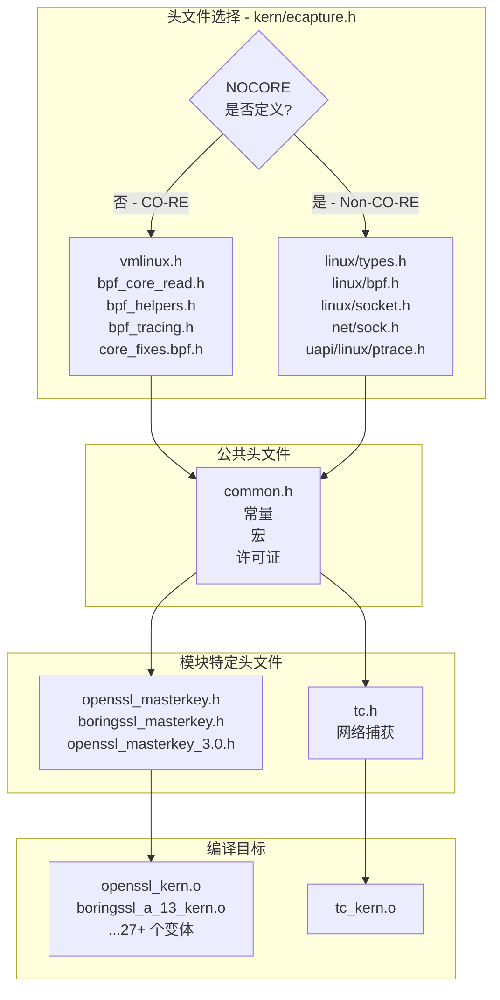
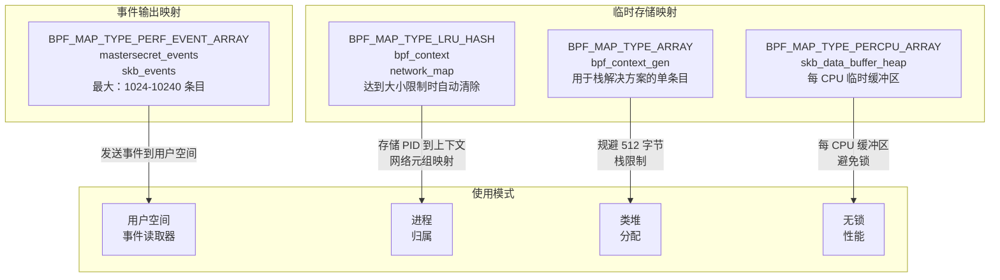
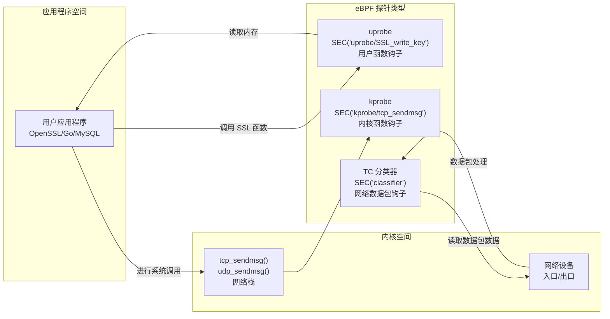
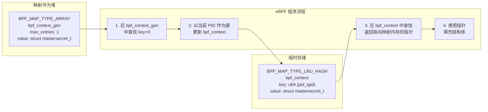
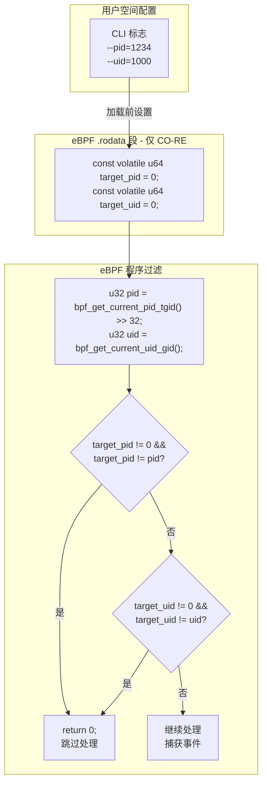
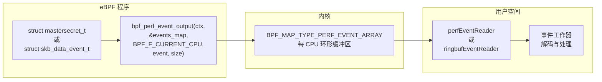
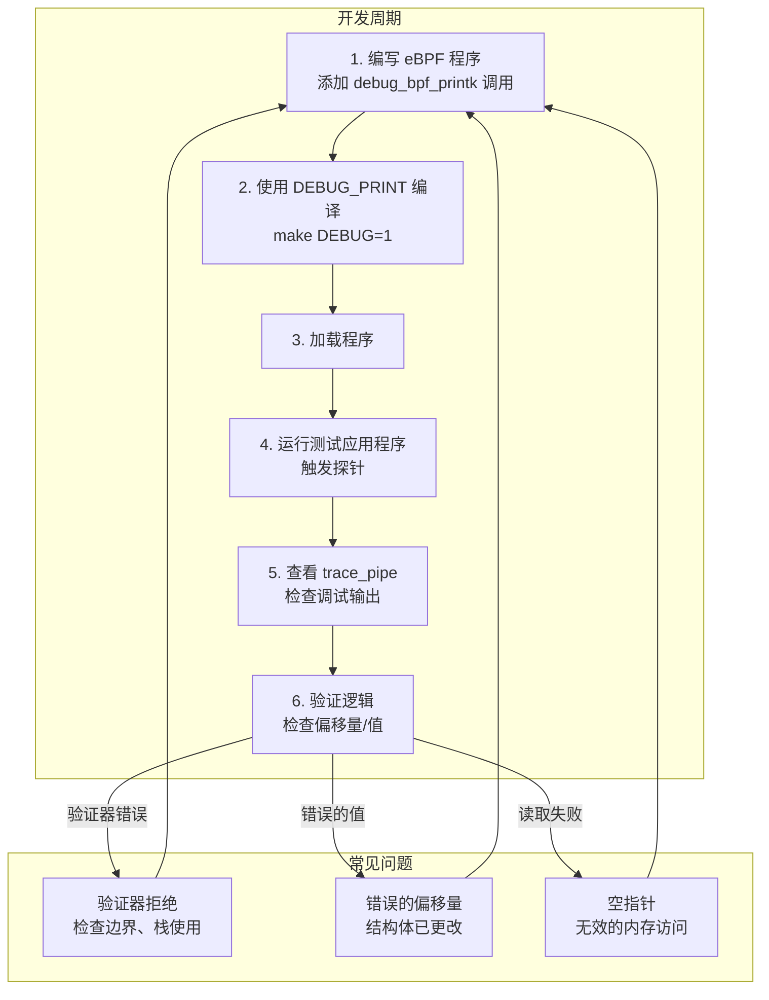
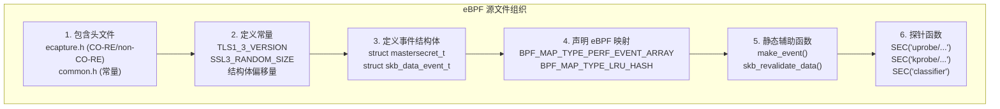

# eBPF 程序开发

## 目的与范围

本页提供了为 eCapture 开发 eBPF 程序的综合指南。涵盖开发环境设置、常见模式、辅助函数、映射类型、探针附加机制、内存管理策略和调试技术等内容。

关于 eBPF 程序结构模式和组织的详细信息，请参阅 [eBPF 程序结构](5.2.1-ebpf-program-structure.md)。关于在复杂结构（如 SSL/TLS 库）中计算偏移量的技术，请参阅 [结构体偏移量计算](5.2.2-structure-offset-calculation.md)。关于编译这些 eBPF 程序的整体构建过程，请参阅 [构建系统](5.1-build-system.md)。

---

## 开发环境

### CO-RE 与 Non-CO-RE 编译模式

eCapture eBPF 程序支持两种编译模式，由 [kern/ecapture.h:18-88](https://github.com/gojue/ecapture/blob/0766a93b/kern/ecapture.h#L18-L88) 中定义的 `NOCORE` 预处理器标志控制：

**CO-RE 模式（一次编译 - 到处运行）：**
- 使用 BTF（BPF 类型格式）实现内核兼容性
- 包含具有所有内核类型的 `vmlinux.h`
- 利用 `bpf_core_read()` 辅助函数实现可移植的结构体访问
- 需要内核 5.2+ 且支持 BTF
- 可以使用 `.rodata` 段存储常量值

**Non-CO-RE 模式：**
- 使用来自特定内核版本的传统内核头文件
- 直接包含 `<linux/types.h>`、`<linux/bpf.h>` 等
- 需要为每个目标内核版本单独编译
- 支持旧版内核（< 5.2）
- 不能使用 `.rodata` 段（参见 [kern/common.h:63-71](https://github.com/gojue/ecapture/blob/0766a93b/kern/common.h#L63-L71)）



**来源：** [kern/ecapture.h:18-92](https://github.com/gojue/ecapture/blob/0766a93b/kern/ecapture.h#L18-L92), [kern/common.h:63-71](https://github.com/gojue/ecapture/blob/0766a93b/kern/common.h#L63-L71)

---

## 公共头文件与定义

### 核心头文件：ecapture.h

[kern/ecapture.h:1-92](https://github.com/gojue/ecapture/blob/0766a93b/kern/ecapture.h#L1-L92) 头文件是所有 eBPF 程序的基础，提供：

| 功能 | 用途 | 位置 |
|---------|---------|----------|
| 模式选择 | 在 CO-RE 和 Non-CO-RE 之间切换 | 第 18-28、27-88 行 |
| 辅助宏 | 为 Clang 兼容性重新定义 `asm_inline` | 第 43-46 行 |
| 内核类型 | 为 Non-CO-RE 提供 `tcphdr`、`ipv6hdr` 结构体 | 第 69-86 行 |
| 公共包含 | 始终包含 `common.h` | 第 90 行 |

### 公共定义：common.h

[kern/common.h:1-85](https://github.com/gojue/ecapture/blob/0766a93b/kern/common.h#L1-L85) 头文件定义了所有 eBPF 程序中使用的常量和宏：

**调试宏：**
```c
#ifdef DEBUG_PRINT
#define debug_bpf_printk(fmt, ...)                     \
    do {                                               \
        char s[] = fmt;                                \
        bpf_trace_printk(s, sizeof(s), ##__VA_ARGS__); \
    } while (0)
#else
#define debug_bpf_printk(fmt, ...)
#endif
```

**关键常量：**

| 常量 | 值 | 用途 |
|----------|-------|---------|
| `TASK_COMM_LEN` | 16 | 进程命令名称长度 |
| `PATH_MAX_LEN` | 256 | 最大路径长度 |
| `MAX_DATA_SIZE_OPENSSL` | 16384 | TLS 记录最大大小（RFC 5246） |
| `MAX_DATA_SIZE_MYSQL` | 256 | MySQL 查询捕获大小 |
| `MAX_DATA_SIZE_BASH` | 256 | Bash 命令捕获大小 |
| `SKB_MAX_DATA_SIZE` | 2048 | 网络数据包缓冲区大小 |
| `AF_INET` | 2 | IPv4 地址族 |
| `AF_INET6` | 10 | IPv6 地址族 |
| `TC_ACT_OK` | 0 | TC 程序返回值 |

**目标过滤（仅 CO-RE 模式）：**
```c
#ifndef KERNEL_LESS_5_2
const volatile u64 target_pid = 0;
const volatile u64 target_uid = 0;
const volatile u64 target_errno = BASH_ERRNO_DEFAULT;
#endif
```

`.rodata` 中的这些 volatile 常量允许用户空间在加载 eBPF 程序之前设置过滤参数。

**来源：** [kern/common.h:18-85](https://github.com/gojue/ecapture/blob/0766a93b/kern/common.h#L18-L85), [kern/ecapture.h:18-92](https://github.com/gojue/ecapture/blob/0766a93b/kern/ecapture.h#L18-L92)

---

## eBPF 映射类型与用法

eCapture 使用多种 BPF 映射类型来实现不同的目的。以下是综合概述：



### 映射类型比较

| 映射类型 | 使用场景 | 关键特性 | 示例 |
|----------|-----------|--------------|---------|
| `PERF_EVENT_ARRAY` | 向用户空间发送事件 | 高吞吐量流式传输 | `mastersecret_events` [kern/openssl_masterkey.h:48-53](https://github.com/gojue/ecapture/blob/0766a93b/kern/openssl_masterkey.h#L48-L53) |
| `LRU_HASH` | PID/连接跟踪 | 达到容量时自动清除 | `bpf_context` [kern/boringssl_masterkey.h:115-119](https://github.com/gojue/ecapture/blob/0766a93b/kern/boringssl_masterkey.h#L115-L119)、`network_map` [kern/tc.h:73-77](https://github.com/gojue/ecapture/blob/0766a93b/kern/tc.h#L73-L77) |
| `ARRAY` | 固定大小查找 | 快速索引访问 | `bpf_context_gen` [kern/openssl_masterkey.h:62-67](https://github.com/gojue/ecapture/blob/0766a93b/kern/openssl_masterkey.h#L62-L67) |
| `PERCPU_ARRAY` | 每 CPU 临时缓冲区 | 无锁操作 | `skb_data_buffer_heap` [kern/tc.h:65-69](https://github.com/gojue/ecapture/blob/0766a93b/kern/tc.h#L65-L69) |

### 常见映射定义

**事件输出映射（主密钥提取）：**
```c
struct {
    __uint(type, BPF_MAP_TYPE_PERF_EVENT_ARRAY);
    __uint(key_size, sizeof(u32));
    __uint(value_size, sizeof(u32));
    __uint(max_entries, 1024);
} mastersecret_events SEC(".maps");
```

**网络连接跟踪映射：**
```c
struct {
    __uint(type, BPF_MAP_TYPE_LRU_HASH);
    __type(key, struct net_id_t);      // 4 元组
    __type(value, struct net_ctx_t);   // PID/UID/comm
    __uint(max_entries, 10240);
} network_map SEC(".maps");
```

**来源：** [kern/tc.h:57-77](https://github.com/gojue/ecapture/blob/0766a93b/kern/tc.h#L57-L77), [kern/openssl_masterkey.h:48-67](https://github.com/gojue/ecapture/blob/0766a93b/kern/openssl_masterkey.h#L48-L67), [kern/boringssl_masterkey.h:107-126](https://github.com/gojue/ecapture/blob/0766a93b/kern/boringssl_masterkey.h#L107-L126)

---

## 探针类型与附加点

eCapture 使用三种主要的 eBPF 程序类型来实现不同的拦截场景：



### Uprobe 程序

Uprobe 附加到用户空间函数以拦截函数调用并提取数据。主要用例：SSL/TLS 主密钥提取。

**示例：SSL 主密钥捕获**
[kern/openssl_masterkey.h:81-82](https://github.com/gojue/ecapture/blob/0766a93b/kern/openssl_masterkey.h#L81-L82)
```c
SEC("uprobe/SSL_write_key")
int probe_ssl_master_key(struct pt_regs *ctx)
```

**关键模式：**
1. **访问函数参数：** 使用 `PT_REGS_PARM1(ctx)` 获取第一个参数（ssl_st 指针）
2. **读取用户空间内存：** 使用 `bpf_probe_read_user()` 读取结构体字段
3. **按 PID/UID 过滤：** 在 CO-RE 模式下检查 `target_pid`、`target_uid`

**来源：** [kern/openssl_masterkey.h:81-257](https://github.com/gojue/ecapture/blob/0766a93b/kern/openssl_masterkey.h#L81-L257), [kern/boringssl_masterkey.h:169-403](https://github.com/gojue/ecapture/blob/0766a93b/kern/boringssl_masterkey.h#L169-L403)

### Kprobe 程序

Kprobe 附加到内核函数进行连接跟踪和网络归属。

**示例：TCP 连接跟踪**
[kern/tc.h:290-347](https://github.com/gojue/ecapture/blob/0766a93b/kern/tc.h#L290-L347)
```c
SEC("kprobe/tcp_sendmsg")
int tcp_sendmsg(struct pt_regs *ctx)
```

**用途：** 提取连接 4 元组（src_ip、src_port、dst_ip、dst_port）并与 PID/UID 关联。

**关键操作：**
1. 提取 PID/UID：`bpf_get_current_pid_tgid()`、`bpf_get_current_uid_gid()`
2. 读取套接字结构：`PT_REGS_PARM1(ctx)` 获取 `struct sock *`
3. 提取连接信息：IPv4/IPv6 地址和端口
4. 存储到映射：`bpf_map_update_elem(&network_map, &conn_id, &net_ctx, BPF_ANY)`

**来源：** [kern/tc.h:290-397](https://github.com/gojue/ecapture/blob/0766a93b/kern/tc.h#L290-L397)

### TC 分类器程序

TC（流量控制）分类器在设备层捕获入口和出口流量的网络数据包。

**示例：数据包捕获**
[kern/tc.h:279-288](https://github.com/gojue/ecapture/blob/0766a93b/kern/tc.h#L279-L288)
```c
SEC("classifier")
int egress_cls_func(struct __sk_buff *skb)
SEC("classifier")
int ingress_cls_func(struct __sk_buff *skb)
```

**两者都调用公共函数：** [kern/tc.h:135-276](https://github.com/gojue/ecapture/blob/0766a93b/kern/tc.h#L135-L276)
```c
static __always_inline int capture_packets(struct __sk_buff *skb, bool is_ingress)
```

**关键操作：**
1. 解析数据包头：以太网 → IP/IPv6 → TCP/UDP
2. 从数据包提取 4 元组
3. 在 `network_map` 中查找 PID 归属
4. 应用 PID/UID 过滤器
5. 通过 `bpf_perf_event_output()` 发送到用户空间

**来源：** [kern/tc.h:135-288](https://github.com/gojue/ecapture/blob/0766a93b/kern/tc.h#L135-L288)

---

## 内存管理与栈限制

### 512 字节栈问题

eBPF 程序有严格的 **512 字节栈限制**。大型结构体（例如 `mastersecret_t` 约 320 字节）无法在栈上分配。

### 解决方案：类堆分配模式

eCapture 使用 `BPF_MAP_TYPE_ARRAY` 的巧妙模式来模拟堆分配：



**实现：**
[kern/openssl_masterkey.h:71-78](https://github.com/gojue/ecapture/blob/0766a93b/kern/openssl_masterkey.h#L71-L78)
```c
static __always_inline struct mastersecret_t *make_event() {
    u32 key_gen = 0;
    struct mastersecret_t *bpf_ctx = bpf_map_lookup_elem(&bpf_context_gen, &key_gen);
    if (!bpf_ctx) return 0;
    u64 id = bpf_get_current_pid_tgid();
    bpf_map_update_elem(&bpf_context, &id, bpf_ctx, BPF_ANY);
    return bpf_map_lookup_elem(&bpf_context, &id);
}
```

**工作原理：**
1. `bpf_context_gen` 是一个单条目数组，保存结构体模板
2. 在键 0 处查找返回指向映射分配内存的指针
3. 复制到 `bpf_context` 哈希映射，以 PID 为键
4. 从哈希映射返回指针（在程序持续期间保证有效）
5. 此指针引用映射内存（而非栈），绕过 512 字节限制

**替代方案：每 CPU 数组**
[kern/tc.h:92-100](https://github.com/gojue/ecapture/blob/0766a93b/kern/tc.h#L92-L100)
```c
static __always_inline struct skb_data_event_t *make_skb_data_event() {
    u32 kZero = 0;
    struct skb_data_event_t *event =
        bpf_map_lookup_elem(&skb_data_buffer_heap, &kZero);
    if (event == NULL) {
        return NULL;
    }
    return event;
}
```

这使用 `BPF_MAP_TYPE_PERCPU_ARRAY` 实现无锁的每 CPU 临时存储。

**来源：** [kern/openssl_masterkey.h:71-78](https://github.com/gojue/ecapture/blob/0766a93b/kern/openssl_masterkey.h#L71-L78), [kern/boringssl_masterkey.h:130-137](https://github.com/gojue/ecapture/blob/0766a93b/kern/boringssl_masterkey.h#L130-L137), [kern/tc.h:92-100](https://github.com/gojue/ecapture/blob/0766a93b/kern/tc.h#L92-L100)

---

## 过滤与目标选择

### PID 和 UID 过滤

eCapture 实现可选过滤以减少开销并专注于特定进程：



**实现模式：**
[kern/openssl_masterkey.h:88-96](https://github.com/gojue/ecapture/blob/0766a93b/kern/openssl_masterkey.h#L88-L96)
```c
#ifndef KERNEL_LESS_5_2
    // if target_ppid is 0 then we target all pids
    if (target_pid != 0 && target_pid != pid) {
        return 0;
    }
    if (target_uid != 0 && target_uid != uid) {
        return 0;
    }
#endif
```

**关键点：**
- 仅在 CO-RE 模式下可用（内核 5.2+）
- 变量在 `.rodata` 中声明为 `const volatile`
- 值 0 表示"捕获所有"（无过滤）
- 提前返回最小化被过滤进程的开销

### 网络层过滤

TC 程序还通过桩函数支持 L2/L3/L4 数据包过滤：

[kern/tc.h:122-132](https://github.com/gojue/ecapture/blob/0766a93b/kern/tc.h#L122-L132)
```c
// filter_pcap_ebpf_l2 是用于注入 pcap 过滤器的桩函数。
static __noinline bool filter_pcap_ebpf_l2(void *_skb, void *__skb,
                                           void *___skb, void *data,
                                           void* data_end) {
    return data != data_end && _skb == __skb && __skb == ___skb;
}

static __always_inline bool filter_pcap_l2(struct __sk_buff *skb, void *data,
                                           void *data_end) {
    return filter_pcap_ebpf_l2((void *) skb, (void *) skb, (void *) skb, data,
                               data_end);
}
```

此桩函数可以在编译时替换为 pcap 过滤器字节码，实现 BPF 级别的数据包过滤。

**来源：** [kern/common.h:66-71](https://github.com/gojue/ecapture/blob/0766a93b/kern/common.h#L66-L71), [kern/openssl_masterkey.h:88-96](https://github.com/gojue/ecapture/blob/0766a93b/kern/openssl_masterkey.h#L88-L96), [kern/tc.h:122-150](https://github.com/gojue/ecapture/blob/0766a93b/kern/tc.h#L122-L150)

---

## 辅助函数与宏

### 内存访问辅助函数

**CO-RE 安全读取：**
[kern/tc.h:22-28](https://github.com/gojue/ecapture/blob/0766a93b/kern/tc.h#L22-L28)
```c
#define READ_KERN(ptr)                                                  \
    ({                                                                  \
        typeof(ptr) _val;                                               \
        __builtin_memset((void *)&_val, 0, sizeof(_val));               \
        bpf_core_read((void *)&_val, sizeof(_val), &ptr);               \
        _val;                                                           \
    })
```

**用户空间内存读取：**
- `bpf_probe_read_user()` - 从用户空间地址读取
- `bpf_probe_read_kernel()` - 从内核内存读取（在初始复制之后）

### SKB 数据验证

由于 eBPF 验证器的要求，网络数据包处理需要仔细的边界检查：

[kern/tc.h:102-119](https://github.com/gojue/ecapture/blob/0766a93b/kern/tc.h#L102-L119)
```c
static __always_inline bool skb_revalidate_data(struct __sk_buff *skb,
                                                uint8_t **head, uint8_t **tail,
                                                const u32 offset) {
    if (*head + offset > *tail) {
        if (bpf_skb_pull_data(skb, offset) < 0) {
            return false;
        }

        *head = (uint8_t *)(long)skb->data;
        *tail = (uint8_t *)(long)skb->data_end;

        if (*head + offset > *tail) {
            return false;
        }
    }

    return true;
}
```

**用途：** 确保数据包数据在访问前在线性缓冲区中可用。验证器跟踪 `skb->data` 和 `skb->data_end` 指针，并要求证明访问在边界内。

### 辅助函数摘要表

| 函数 | 用途 | 使用上下文 |
|----------|---------|---------------|
| `bpf_get_current_pid_tgid()` | 获取当前 PID/TID | 所有探针类型 |
| `bpf_get_current_uid_gid()` | 获取当前 UID/GID | 所有探针类型 |
| `bpf_get_current_comm()` | 获取进程名称 | 所有探针类型 |
| `bpf_probe_read_user()` | 读取用户空间内存 | Uprobe 程序 |
| `bpf_probe_read_kernel()` | 读取内核内存 | 复制到栈后 |
| `bpf_map_lookup_elem()` | 查找映射条目 | 所有上下文 |
| `bpf_map_update_elem()` | 更新映射条目 | 所有上下文 |
| `bpf_perf_event_output()` | 向用户空间发送事件 | 事件报告 |
| `bpf_ntohs()` / `bpf_htons()` | 网络字节序转换 | 网络程序 |
| `bpf_skb_pull_data()` | 将数据包数据拉到线性缓冲区 | TC 程序 |
| `bpf_core_read()` | CO-RE 安全字段读取 | 仅 CO-RE 模式 |

**来源：** [kern/tc.h:22-119](https://github.com/gojue/ecapture/blob/0766a93b/kern/tc.h#L22-L119), [kern/openssl_masterkey.h:71-78](https://github.com/gojue/ecapture/blob/0766a93b/kern/openssl_masterkey.h#L71-L78)

---

## 事件报告机制

### Perf 事件输出

从 eBPF 向用户空间发送数据的主要机制：



**标准模式：**
[kern/openssl_masterkey.h:165-168](https://github.com/gojue/ecapture/blob/0766a93b/kern/openssl_masterkey.h#L165-L168)
```c
bpf_perf_event_output(
    ctx, &mastersecret_events, BPF_F_CURRENT_CPU, 
    mastersecret, sizeof(struct mastersecret_t));
```

**标志：**
- `BPF_F_CURRENT_CPU` - 发送到当前 CPU 的缓冲区（无锁）
- 对于 TC 程序，编码数据包长度：`flags |= (u64)skb->len << 32;` [kern/tc.h:260-261](https://github.com/gojue/ecapture/blob/0766a93b/kern/tc.h#L260-L261)

### 最小与完整事件数据

TC 程序通过在可能的情况下发送最小元数据来优化带宽：

[kern/tc.h:263-271](https://github.com/gojue/ecapture/blob/0766a93b/kern/tc.h#L263-L271)
```c
// if net_packet event not chosen, send minimal data only:
//     timestamp (u64)      8 字节
//     pid (u32)            4 字节
//     comm (char[])       16 字节
//     packet len (u32)     4 字节
//     ifindex (u32)        4 字节
size_t pkt_size = TC_PACKET_MIN_SIZE;
bpf_perf_event_output(skb, &skb_events, flags, &event, pkt_size);
```

这允许 eBPF 程序在需要时发送元数据加完整数据包数据，或者仅发送元数据以减少流量。

**来源：** [kern/tc.h:260-271](https://github.com/gojue/ecapture/blob/0766a93b/kern/tc.h#L260-L271), [kern/openssl_masterkey.h:165-168](https://github.com/gojue/ecapture/blob/0766a93b/kern/openssl_masterkey.h#L165-L168), [kern/boringssl_masterkey.h:339-341](https://github.com/gojue/ecapture/blob/0766a93b/kern/boringssl_masterkey.h#L339-L341)

---

## 调试技术

### 调试打印宏

[kern/common.h:18-26](https://github.com/gojue/ecapture/blob/0766a93b/kern/common.h#L18-L26)
```c
#ifdef DEBUG_PRINT
#define debug_bpf_printk(fmt, ...)                     \
    do {                                               \
        char s[] = fmt;                                \
        bpf_trace_printk(s, sizeof(s), ##__VA_ARGS__); \
    } while (0)
#else
#define debug_bpf_printk(fmt, ...)
#endif
```

**使用模式：**
```c
debug_bpf_printk("TLS version :%d\n", mastersecret->version);
debug_bpf_printk("client_random: %x %x %x\n", 
    mastersecret->client_random[0], 
    mastersecret->client_random[1],
    mastersecret->client_random[2]);
```

**查看输出：**
```bash
# 读取 trace_pipe 查看 bpf_printk 输出
sudo cat /sys/kernel/debug/tracing/trace_pipe
```

### 调试工作流程



### 常见调试场景

**场景 1：验证器拒绝**
```
; ret = bpf_probe_read_user(&mastersecret->secret_, sizeof(mastersecret->secret_), ms_ptr);
R0=inv(id=0) R1_w=map_value(id=0,off=40,ks=4,vs=320,imm=0) 
R2=inv48 R3_w=inv(id=0) R6=ctx(id=0,off=0,imm=0) R10=fp0
; stack out of bounds
```

**解决方案：** 使用基于映射的分配模式而不是栈分配

**场景 2：读取失败（ret != 0）**
```c
ret = bpf_probe_read_user(&version, sizeof(version), (void *)ssl_version_ptr);
if (ret) {
    debug_bpf_printk("bpf_probe_read tls_version failed, ret :%d\n", ret);
    return 0;
}
```

**可能原因：** 无效指针、错误的偏移量、换出的内存

**场景 3：错误的结构体偏移量**

使用用户空间工具验证偏移量：
- [utils/boringssl-offset.c:1-78](https://github.com/gojue/ecapture/blob/0766a93b/utils/boringssl-offset.c#L1-L78) - 生成 BoringSSL 偏移量
- 针对目标库头文件编译
- 与 eBPF 程序的偏移量常量进行比较

**来源：** [kern/common.h:18-26](https://github.com/gojue/ecapture/blob/0766a93b/kern/common.h#L18-L26), [kern/openssl_masterkey.h:97-257](https://github.com/gojue/ecapture/blob/0766a93b/kern/openssl_masterkey.h#L97-L257)

---

## 代码组织模式

### 结构声明模式



### 文件命名约定

| 模式 | 用途 | 示例 |
|---------|---------|----------|
| `*_masterkey.h` | 主密钥提取 | `openssl_masterkey.h`、`boringssl_masterkey.h` |
| `*_const.h` | 偏移量常量 | `boringssl_const.h` |
| `tc.h` | 流量控制程序 | 数据包捕获和连接跟踪 |
| `common.h` | 共享定义 | 常量、宏、许可证 |
| `ecapture.h` | 主头文件 | 模式切换、包含 |

### 多版本支持模式

eCapture 为不同的库版本维护单独的 eBPF 程序：

```
kern/
├── openssl_1_0_2a_kern.c        # OpenSSL 1.0.2a
├── openssl_1_1_0a_kern.c        # OpenSSL 1.1.0a
├── openssl_1_1_1j_kern.c        # OpenSSL 1.1.1j
├── openssl_3_0_0_kern.c         # OpenSSL 3.0.0
├── openssl_3_2_0_kern.c         # OpenSSL 3.2.0
├── boringssl_a_13_kern.c        # Android 13 BoringSSL
├── boringssl_a_14_kern.c        # Android 14 BoringSSL
└── ...
```

每个都包含特定版本的偏移量常量，但共享头文件中的公共逻辑。

**来源：** [kern/openssl_masterkey.h:1-257](https://github.com/gojue/ecapture/blob/0766a93b/kern/openssl_masterkey.h#L1-L257), [kern/boringssl_masterkey.h:1-403](https://github.com/gojue/ecapture/blob/0766a93b/kern/boringssl_masterkey.h#L1-L403), [kern/tc.h:1-397](https://github.com/gojue/ecapture/blob/0766a93b/kern/tc.h#L1-L397)

---

## 最佳实践摘要

| 实践 | 理由 | 实现 |
|----------|-----------|----------------|
| **使用基于映射的分配** | 避免 512 字节栈限制 | `make_event()` 模式 |
| **始终检查 bpf_probe_read 返回值** | 检测无效内存访问 | `if (ret) return 0;` |
| **对辅助函数使用 `__always_inline`** | 减少栈使用，提高性能 | 所有辅助函数 |
| **在解引用前验证指针** | 防止验证器拒绝 | `if (!ptr) return 0;` |
| **自由使用 `debug_bpf_printk`** | 在开发期间辅助调试 | 整个探针函数 |
| **应用早期过滤** | 最小化开销 | 在函数开始处进行 PID/UID 检查 |
| **在 pull 后重新验证 SKB 数据** | 满足验证器对数据包访问的要求 | `skb_revalidate_data()` |
| **尽可能使用 CO-RE** | 提高可移植性 | `bpf_core_read()` 宏 |
| **保持探针函数专注** | 降低复杂性，辅助验证器 | 每个探针单一职责 |
| **记录偏移量计算** | 维护版本兼容性 | 注释 + 偏移量工具 |

**来源：** [kern/common.h:1-85](https://github.com/gojue/ecapture/blob/0766a93b/kern/common.h#L1-L85), [kern/tc.h:1-397](https://github.com/gojue/ecapture/blob/0766a93b/kern/tc.h#L1-L397), [kern/openssl_masterkey.h:1-257](https://github.com/gojue/ecapture/blob/0766a93b/kern/openssl_masterkey.h#L1-L257)