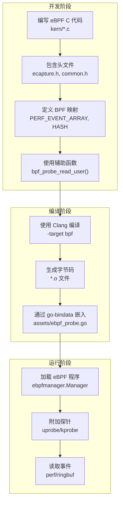
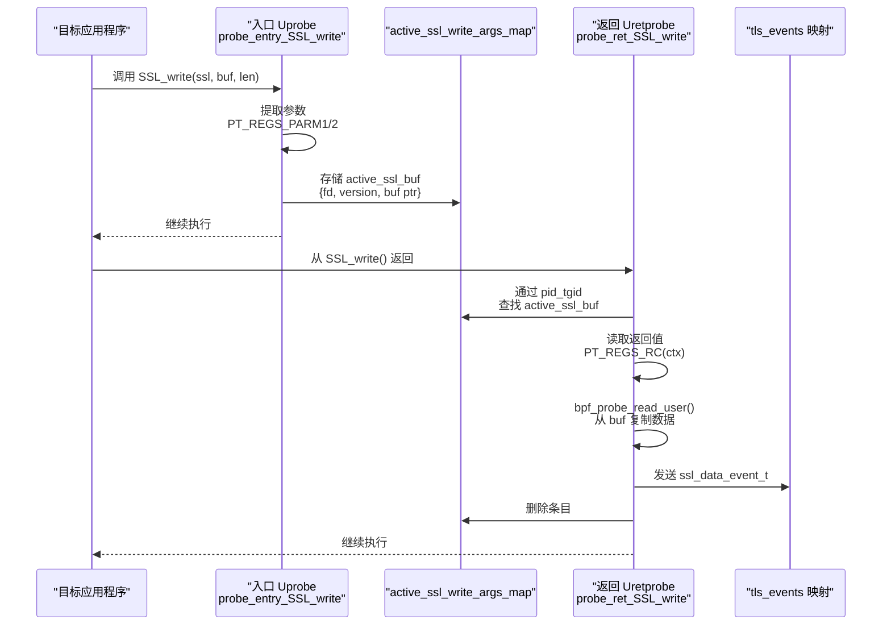
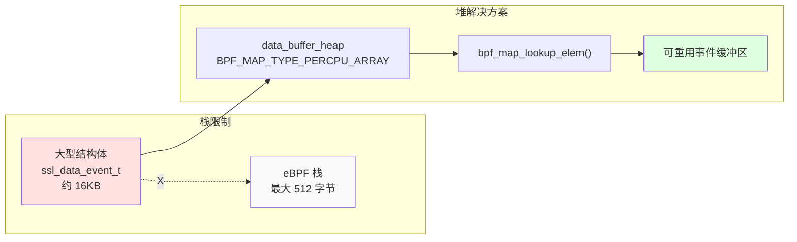

# eBPF 程序开发

本页面提供了在 eCapture 中开发 eBPF 程序的指南。内容涵盖常见模式、辅助函数、内存管理策略以及 eBPF 编程特有的约束条件。有关 eBPF 程序结构和组织的信息，请参阅 [eBPF 程序结构](5.2.1-ebpf-program-structure.md)。有关为库支持生成结构体偏移量的详细信息，请参阅 [结构体偏移量计算](5.2.2-structure-offset-calculation.md)。

## 概述

eCapture 的 eBPF 程序挂钩用户空间函数（uprobes）和内核函数（kprobes）以捕获 TLS 流量、网络数据包和系统事件。所有 eBPF 程序均使用 C 语言编写，位于 `kern/` 目录下。它们被编译为 eBPF 字节码，并在构建时嵌入到 Go 二进制文件中。

**主要 eBPF 程序类型：**

| 程序类型 | 用途 | 示例 |
|---------|------|------|
| `uprobe` | 挂钩用户空间函数入口 | `SSL_write`, `SSL_read` |
| `uretprobe` | 挂钩用户空间函数返回 | 捕获函数返回值 |
| `kprobe` | 挂钩内核函数入口 | `tcp_sendmsg`, `__sys_connect` |
| `kretprobe` | 挂钩内核函数返回 | `__sys_accept4` |
| `classifier` (TC) | 流量控制数据包过滤 | 出口/入口数据包捕获 |

来源：[kern/openssl.h:331-351](https://github.com/gojue/ecapture/blob/ca085d05/kern/openssl.h#L331-L351), [kern/tc.h:274-283](https://github.com/gojue/ecapture/blob/ca085d05/kern/tc.h#L274-L283)

## eBPF 开发工作流


```mermaid
graph TB
    subgraph "开发阶段"
        WRITE["编写 eBPF C 代码<br/>kern/*.c"]
        HEADERS["包含头文件<br/>ecapture.h, common.h"]
        MAPS["定义 BPF 映射<br/>PERF_EVENT_ARRAY, HASH"]
        HELPERS["使用辅助函数<br/>bpf_probe_read_user()"]
    end
    
    subgraph "编译阶段"
        CLANG["使用 Clang 编译<br/>-target bpf"]
        BYTECODE["生成字节码<br/>*.o 文件"]
        EMBED["通过 go-bindata 嵌入<br/>assets/ebpf_probe.go"]
    end
    
    subgraph "运行阶段"
        LOAD["加载 eBPF 程序<br/>ebpfmanager.Manager"]
        ATTACH["附加探针<br/>uprobe/kprobe"]
        READ["读取事件<br/>perf/ringbuf"]
    end
    
    WRITE --> HEADERS
    HEADERS --> MAPS
    MAPS --> HELPERS
    HELPERS --> CLANG
    CLANG --> BYTECODE
    BYTECODE --> EMBED
    EMBED --> LOAD
    LOAD --> ATTACH
    ATTACH --> READ
```

来源：[kern/openssl.h:1-14](https://github.com/gojue/ecapture/blob/ca085d05/kern/openssl.h#L1-L14), [kern/ecapture.h:15-90](https://github.com/gojue/ecapture/blob/ca085d05/kern/ecapture.h#L15-L90)

## 常见 eBPF 模式

### 两阶段 Uprobe 模式

eCapture 中最常见的模式是**两阶段 uprobe 方法**：入口探针存储函数参数，返回探针在函数完成后读取实际数据。


```mermaid
sequenceDiagram
    participant App as "目标应用程序"
    participant Entry as "入口 Uprobe<br/>probe_entry_SSL_write"
    participant Map as "active_ssl_write_args_map"
    participant Ret as "返回 Uretprobe<br/>probe_ret_SSL_write"
    participant Event as "tls_events 映射"
    
    App->>Entry: 调用 SSL_write(ssl, buf, len)
    Entry->>Entry: 提取参数<br/>PT_REGS_PARM1/2
    Entry->>Map: 存储 active_ssl_buf<br/>{fd, version, buf ptr}
    Entry-->>App: 继续执行
    
    App->>Ret: 从 SSL_write() 返回
    Ret->>Map: 通过 pid_tgid<br/>查找 active_ssl_buf
    Ret->>Ret: 读取返回值<br/>PT_REGS_RC(ctx)
    Ret->>Ret: bpf_probe_read_user()<br/>从 buf 复制数据
    Ret->>Event: 发送 ssl_data_event_t
    Ret->>Map: 删除条目
    Ret-->>App: 继续执行
```

**实现：**

入口探针存储上下文：
```c
// kern/openssl.h:268-304
static __inline int probe_entry_SSL(struct pt_regs* ctx, void *map, int bio_offset) {
    void* ssl = (void*)PT_REGS_PARM1(ctx);  // 第一个参数
    const char* buf = (const char*)PT_REGS_PARM2(ctx);  // 第二个参数
    
    struct active_ssl_buf active_ssl_buf_t;
    active_ssl_buf_t.fd = fd;
    active_ssl_buf_t.buf = buf;
    
    u64 current_pid_tgid = bpf_get_current_pid_tgid();
    bpf_map_update_elem(map, &current_pid_tgid, &active_ssl_buf_t, BPF_ANY);
    return 0;
}
```

返回探针检索数据：
```c
// kern/openssl.h:306-323
static __inline int probe_ret_SSL(struct pt_regs* ctx, void *map, enum ssl_data_event_type type) {
    u64 current_pid_tgid = bpf_get_current_pid_tgid();
    
    struct active_ssl_buf* active_ssl_buf_t = bpf_map_lookup_elem(map, &current_pid_tgid);
    if (active_ssl_buf_t != NULL) {
        const char* buf;
        bpf_probe_read(&buf, sizeof(const char*), &active_ssl_buf_t->buf);
        process_SSL_data(ctx, current_pid_tgid, type, buf, fd, version, bio_type);
    }
    bpf_map_delete_elem(map, &current_pid_tgid);
    return 0;
}
```

**为什么使用这种模式？**

1. 函数参数仅在入口时可用，返回时不可用
2. 返回值（写入/读取的字节数）仅在返回时可用
3. 在函数完成之前无法读取用户空间缓冲区（数据可能尚未准备好）

来源：[kern/openssl.h:268-323](https://github.com/gojue/ecapture/blob/ca085d05/kern/openssl.h#L268-L323), [kern/openssl.h:331-351](https://github.com/gojue/ecapture/blob/ca085d05/kern/openssl.h#L331-L351)

### 每 CPU 堆分配

eBPF 程序有 **512 字节的栈限制**。为了处理更大的结构体，eCapture 使用每 CPU 的 BPF 映射作为堆存储。


```mermaid
graph LR
    subgraph "栈限制"
        STACK["eBPF 栈<br/>最大 512 字节"]
        LARGE["大型结构体<br/>ssl_data_event_t<br/>约 16KB"]
    end
    
    subgraph "堆解决方案"
        HEAP_MAP["data_buffer_heap<br/>BPF_MAP_TYPE_PERCPU_ARRAY"]
        LOOKUP["bpf_map_lookup_elem()"]
        EVENT["可重用事件缓冲区"]
    end
    
    LARGE -.X.-> STACK
    LARGE --> HEAP_MAP
    HEAP_MAP --> LOOKUP
    LOOKUP --> EVENT
    
    style STACK fill:#f9f9f9
    style LARGE fill:#ffe1e1
    style EVENT fill:#e1ffe1
```

**实现：**

映射定义：
```c
// kern/openssl.h:113-118
struct {
    __uint(type, BPF_MAP_TYPE_PERCPU_ARRAY);
    __type(key, u32);
    __type(value, struct ssl_data_event_t);
    __uint(max_entries, 1);
} data_buffer_heap SEC(".maps");
```

辅助函数：
```c
// kern/openssl.h:141-158
static __inline struct ssl_data_event_t* create_ssl_data_event(u64 current_pid_tgid) {
    u32 kZero = 0;
    struct ssl_data_event_t* event = bpf_map_lookup_elem(&data_buffer_heap, &kZero);
    if (event == NULL) {
        return NULL;
    }
    
    event->timestamp_ns = bpf_ktime_get_ns();
    event->pid = current_pid_tgid >> 32;
    event->tid = current_pid_tgid & kMask32b;
    return event;
}
```

**关键点：**

- `BPF_MAP_TYPE_PERCPU_ARRAY` 为每个 CPU 提供一个实例
- 键始终为 0（每个 CPU 一个条目）
- CPU 之间无竞态条件
- 内存在调用之间重用

来源：[kern/openssl.h:113-158](https://github.com/gojue/ecapture/blob/ca085d05/kern/openssl.h#L113-L158), [kern/openssl_masterkey.h:69-78](https://github.com/gojue/ecapture/blob/ca085d05/kern/openssl_masterkey.h#L69-L78)

## BPF 映射参考

eCapture 使用多种 BPF 映射类型用于不同目的：

| 映射名称 | 类型 | 用途 | 键 | 值 |
|---------|------|------|-----|-----|
| `tls_events` | `PERF_EVENT_ARRAY` | 发送 SSL 数据到用户空间 | CPU ID | - |
| `connect_events` | `PERF_EVENT_ARRAY` | 发送连接事件 | CPU ID | - |
| `active_ssl_read_args_map` | `HASH` | 存储 SSL_read 上下文 | pid_tgid | `active_ssl_buf` |
| `active_ssl_write_args_map` | `HASH` | 存储 SSL_write 上下文 | pid_tgid | `active_ssl_buf` |
| `data_buffer_heap` | `PERCPU_ARRAY` | 大型事件缓冲区 | 0 | `ssl_data_event_t` |
| `ssl_st_fd` | `HASH` | SSL 指针到 FD 的映射 | ssl_st addr | fd |
| `tcp_fd_infos` | `HASH` | 临时 FD 信息存储 | pid_tgid | `tcp_fd_info` |
| `network_map` | `LRU_HASH` | PID 到套接字的映射 | `net_id_t` | `net_ctx_t` |
| `skb_events` | `PERF_EVENT_ARRAY` | 发送数据包数据 | CPU ID | - |

**映射定义模式：**
```c
// kern/openssl.h:79-84
struct {
    __uint(type, BPF_MAP_TYPE_PERF_EVENT_ARRAY);
    __uint(key_size, sizeof(u32));
    __uint(value_size, sizeof(u32));
    __uint(max_entries, 1024);
} tls_events SEC(".maps");
```

来源：[kern/openssl.h:79-135](https://github.com/gojue/ecapture/blob/ca085d05/kern/openssl.h#L79-L135), [kern/tc.h:57-77](https://github.com/gojue/ecapture/blob/ca085d05/kern/tc.h#L57-L77)

## 内存访问模式

### 读取用户空间内存

使用 `bpf_probe_read_user()` 安全地读取用户空间指针：

```c
// kern/openssl.h:186
bpf_probe_read_user(event->data, event->data_len, buf);
```

### 读取内核空间内存

对内核内存使用 `bpf_probe_read_kernel()` 或 `bpf_probe_read()`：

```c
// kern/openssl.h:409
bpf_probe_read_kernel(&address_family, sizeof(address_family), &sk->__sk_common.skc_family);
```

### 指针追踪

在跟踪多级指针解引用时，分别读取每一级：

```c
// kern/openssl.h:232-241
// 获取 ssl->bio 指针
ssl_bio_ptr = (u64 *)(ssl + bio_offset);
ret = bpf_probe_read_user(&ssl_bio_addr, sizeof(ssl_bio_addr), ssl_bio_ptr);

// 获取 ssl->bio->num
ssl_bio_num_ptr = (u64 *)(ssl_bio_addr + BIO_ST_NUM);
ret = bpf_probe_read_user(&ssl_bio_num_addr, sizeof(ssl_bio_num_addr), ssl_bio_num_ptr);
```

**重要提示：** 永远不要直接解引用用户空间指针。始终使用 `bpf_probe_read_*()` 辅助函数。

来源：[kern/openssl.h:186-266](https://github.com/gojue/ecapture/blob/ca085d05/kern/openssl.h#L186-L266)

## 过滤与上下文

### PID/UID 过滤

eCapture 支持使用全局常量进行 PID 和 UID 过滤：

```c
// kern/common.h:66-70
const volatile u64 target_pid = 0;
const volatile u64 target_uid = 0;
```

过滤辅助函数：
```c
// kern/ecapture.h:93-105
static __inline bool filter_rejects(u32 pid, u32 uid) {
    if (less52 == 1) {
        return false;  // 内核 < 5.2 时禁用过滤
    }
    if (target_pid != 0 && target_pid != pid) {
        return true;
    }
    if (target_uid != 0 && target_uid != uid) {
        return true;
    }
    return false;
}
```

在探针中使用：
```c
// kern/openssl.h:269-271
if (!passes_filter(ctx)) {
    return 0;
}
```

来源：[kern/ecapture.h:93-127](https://github.com/gojue/ecapture/blob/ca085d05/kern/ecapture.h#L93-L127), [kern/common.h:66-70](https://github.com/gojue/ecapture/blob/ca085d05/kern/common.h#L66-L70)

### 上下文提取

常见上下文信息：

| 信息 | 辅助函数 | 说明 |
|------|---------|------|
| PID/TID | `bpf_get_current_pid_tgid()` | 高 32 位 = PID，低 32 位 = TID |
| UID/GID | `bpf_get_current_uid_gid()` | 高 32 位 = GID，低 32 位 = UID |
| 进程名称 | `bpf_get_current_comm()` | 最大 16 个字符（TASK_COMM_LEN） |
| 时间戳 | `bpf_ktime_get_ns()` | 自启动以来的纳秒数 |

```c
// kern/openssl.h:151-153
event->timestamp_ns = bpf_ktime_get_ns();
event->pid = current_pid_tgid >> 32;
event->tid = current_pid_tgid & kMask32b;
```

来源：[kern/openssl.h:151-157](https://github.com/gojue/ecapture/blob/ca085d05/kern/openssl.h#L151-L157), [kern/common.h:28](https://github.com/gojue/ecapture/blob/ca085d05/kern/common.h#L28)

## 数据结构模式

### 事件结构

所有发送到用户空间的事件都遵循一致的模式：

```c
// kern/openssl.h:28-39
struct ssl_data_event_t {
    enum ssl_data_event_type type;  // kSSLRead 或 kSSLWrite
    u64 timestamp_ns;
    u32 pid;
    u32 tid;
    char data[MAX_DATA_SIZE_OPENSSL];  // 16KB 载荷
    s32 data_len;
    char comm[TASK_COMM_LEN];
    u32 fd;
    s32 version;
    u32 bio_type;
};
```

**设计原则：**

1. 固定大小的结构体（用户空间绑定事件中无指针）
2. 用于排序的时间戳
3. 用于标识的 PID/TID
4. 内联数据数组（不是指针）
5. 必要时紧凑：`__attribute__((packed))`

来源：[kern/openssl.h:28-55](https://github.com/gojue/ecapture/blob/ca085d05/kern/openssl.h#L28-L55)

### 连接跟踪结构

```c
// kern/openssl.h:41-55
struct connect_event_t {
    unsigned __int128 saddr;
    unsigned __int128 daddr;
    char comm[TASK_COMM_LEN];
    u64 timestamp_ns;
    u64 sock;
    u32 pid;
    u32 tid;
    u32 fd;
    u16 family;
    u16 sport;
    u16 dport;
    u8 is_destroy;
    u8 pad[7];
} __attribute__((packed));  // 防止填充空洞
```

来源：[kern/openssl.h:41-55](https://github.com/gojue/ecapture/blob/ca085d05/kern/openssl.h#L41-L55)

## 向用户空间发送事件

使用 `bpf_perf_event_output()` 或 `bpf_ringbuf_output()` 发送事件：

```c
// kern/openssl.h:188-189
bpf_perf_event_output(ctx, &tls_events, BPF_F_CURRENT_CPU, event,
                      sizeof(struct ssl_data_event_t));
```

**参数：**

- `ctx`：程序上下文（pt_regs 或 sk_buff）
- `map`：PERF_EVENT_ARRAY 或 RINGBUF 映射
- `flags`：perf 事件使用 `BPF_F_CURRENT_CPU`
- `data`：指向事件结构的指针
- `size`：事件结构的大小

**对于带数据包数据的 TC 程序：**
```c
// kern/tc.h:255-266
u64 flags = BPF_F_CURRENT_CPU;
flags |= (u64)skb->len << 32;  // 在 flags 中编码数据包长度

bpf_perf_event_output(skb, &skb_events, flags, &event, pkt_size);
```

来源：[kern/openssl.h:188-189](https://github.com/gojue/ecapture/blob/ca085d05/kern/openssl.h#L188-L189), [kern/tc.h:255-266](https://github.com/gojue/ecapture/blob/ca085d05/kern/tc.h#L255-L266)

## 调试技术

### 调试打印

使用 `debug_bpf_printk` 宏进行条件调试：

```c
// kern/common.h:18-26
#ifdef DEBUG_PRINT
#define debug_bpf_printk(fmt, ...)                     \
    do {                                               \
        char s[] = fmt;                                \
        bpf_trace_printk(s, sizeof(s), ##__VA_ARGS__); \
    } while (0)
#else
#define debug_bpf_printk(fmt, ...)
#endif
```

使用方法：
```c
debug_bpf_printk("SSL_write fd: %d, version: %d\n", fd, ssl_version);
```

查看输出：
```bash
cat /sys/kernel/debug/tracing/trace_pipe
```

**注意：** `bpf_trace_printk()` 有格式字符串限制且影响性能。仅在开发期间使用。

来源：[kern/common.h:18-26](https://github.com/gojue/ecapture/blob/ca085d05/kern/common.h#L18-L26)

### 错误处理

始终检查 BPF 辅助函数的返回值：

```c
// kern/openssl.h:280-283
ret = bpf_probe_read_user(&ssl_version, sizeof(ssl_version), (void *)ssl_ver_ptr);
if (ret) {
    debug_bpf_printk("(OPENSSL) bpf_probe_read ssl_ver_ptr failed, ret: %d\n", ret);
}
```

常见错误码：
- `-EFAULT`：无效的内存访问
- `-EINVAL`：无效的参数
- `-E2BIG`：大小太大

来源：[kern/openssl.h:280-283](https://github.com/gojue/ecapture/blob/ca085d05/kern/openssl.h#L280-L283)

## CO-RE 与非 CO-RE 考虑事项

eCapture 同时支持 CO-RE（一次编译，到处运行）和非 CO-RE 模式。

### CO-RE 模式

```c
// kern/ecapture.h:18-25
#ifndef NOCORE
// 启用 CO-RE
#include "vmlinux.h"
#include "bpf/bpf_core_read.h"
#include "bpf/bpf_helpers.h"
#include "bpf/bpf_tracing.h"
#include "bpf/bpf_endian.h"
#include "core_fixes.bpf.h"
```

优势：
- 可跨内核版本移植
- 使用 BTF（BPF 类型格式）信息
- 需要启用 BTF 的内核 5.2+

### 非 CO-RE 模式

```c
// kern/ecapture.h:27-73
#else
// 禁用 CO-RE
#include <linux/kconfig.h>
#include <linux/types.h>
#include <uapi/linux/ptrace.h>
#include <linux/bpf.h>
#include <linux/socket.h>
#include <net/sock.h>
```

优势：
- 适用于较旧的内核
- 不需要 BTF
- 编译时需要内核头文件

**开发提示：** 尽可能编写兼容两种模式的代码。构建系统会处理条件编译。

来源：[kern/ecapture.h:18-88](https://github.com/gojue/ecapture/blob/ca085d05/kern/ecapture.h#L18-L88)

## 常见陷阱

### 栈溢出

❌ **不要在栈上分配大型结构体：**
```c
struct ssl_data_event_t event;  // 16KB+ - 栈溢出！
```

✅ **要使用每 CPU 堆映射：**
```c
struct ssl_data_event_t* event = create_ssl_data_event(id);
```

### 无界循环

❌ **不要使用无界循环：**
```c
while (condition) { ... }  // 验证器会拒绝
```

✅ **要使用带 `#pragma unroll` 的有界循环：**
```c
#pragma unroll
for (int i = 0; i < 32; i++) { ... }  // 最大迭代次数已知
```

### 直接指针解引用

❌ **不要直接解引用用户指针：**
```c
u32 value = *user_ptr;  // 崩溃或被验证器拒绝
```

✅ **要使用 bpf_probe_read_user()：**
```c
u32 value;
bpf_probe_read_user(&value, sizeof(value), user_ptr);
```

### 缺少空值检查

❌ **不要假设映射查找成功：**
```c
struct data *d = bpf_map_lookup_elem(&map, &key);
d->field = value;  // 如果 d 为 NULL 则崩溃
```

✅ **要检查 NULL：**
```c
struct data *d = bpf_map_lookup_elem(&map, &key);
if (d != NULL) {
    d->field = value;
}
```

## 与用户空间的集成

### 在 Go 中定义探针

探针在模块的设置函数中注册：

```go
// user/module/probe_openssl_text.go:47-72
m.bpfManager = &manager.Manager{
    Probes: []*manager.Probe{
        {
            Section:          "uprobe/SSL_write",
            EbpfFuncName:     "probe_entry_SSL_write",
            AttachToFuncName: "SSL_write",
            BinaryPath:       binaryPath,
        },
        {
            Section:          "uretprobe/SSL_write",
            EbpfFuncName:     "probe_ret_SSL_write",
            AttachToFuncName: "SSL_write",
            BinaryPath:       binaryPath,
        },
    },
}
```

来源：[user/module/probe_openssl_text.go:46-164](https://github.com/gojue/ecapture/blob/ca085d05/user/module/probe_openssl_text.go#L46-L164)

### 运行时配置的常量编辑器

可以从用户空间设置全局常量：

```go
// 在运行时设置目标 PID
m.bpfManagerOptions.ConstantEditors = []manager.ConstantEditor{
    {
        Name:  "target_pid",
        Value: uint64(config.Pid),
    },
}
```

**注意：** 仅在支持全局变量的内核 5.2+ 上有效。

来源：[user/module/probe_openssl_text.go:181-186](https://github.com/gojue/ecapture/blob/ca085d05/user/module/probe_openssl_text.go#L181-L186)

## 测试与验证

### 验证器日志

如果验证器拒绝您的程序，请检查日志：

```go
// user/module/probe_openssl_text.go:169-173
VerifierOptions: ebpf.CollectionOptions{
    Programs: ebpf.ProgramOptions{
        LogSizeStart: 2097152,  // 2MB 日志缓冲区
    },
},
```

### 测试清单

- [ ] 检查所有 `bpf_probe_read_*()` 返回值
- [ ] 验证栈使用 < 512 字节
- [ ] 确认循环有界
- [ ] 使用 target_pid/target_uid 过滤器测试
- [ ] 验证事件结构是否正确紧凑
- [ ] 映射查找后检查 NULL
- [ ] 在 CO-RE 和非 CO-RE 构建上测试

来源：[user/module/probe_openssl_text.go:166-179](https://github.com/gojue/ecapture/blob/ca085d05/user/module/probe_openssl_text.go#L166-L179)

---

本指南涵盖了 eCapture 中 eBPF 开发的基本模式和约束。有关 eBPF 程序如何构建和组织的详细信息，请参阅 [eBPF 程序结构](5.2.1-ebpf-program-structure.md)。有关通过偏移量生成支持新库版本的信息，请参阅 [结构体偏移量计算](5.2.2-structure-offset-calculation.md)。