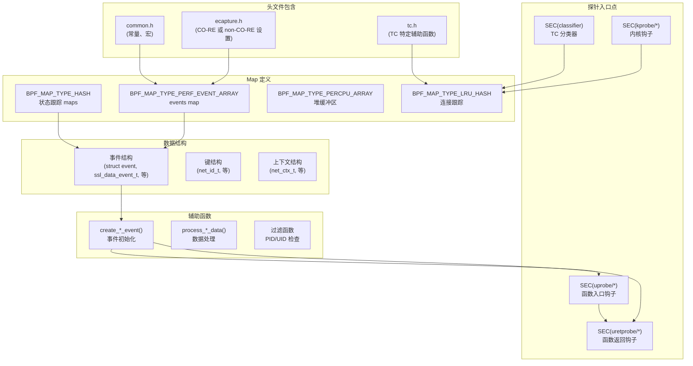
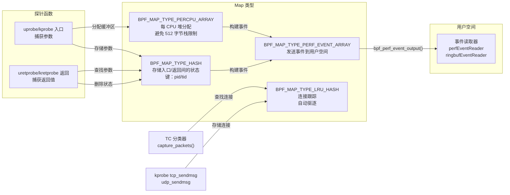
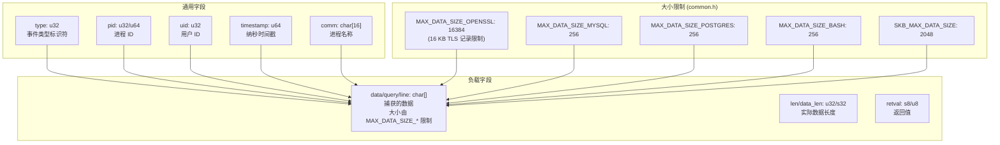
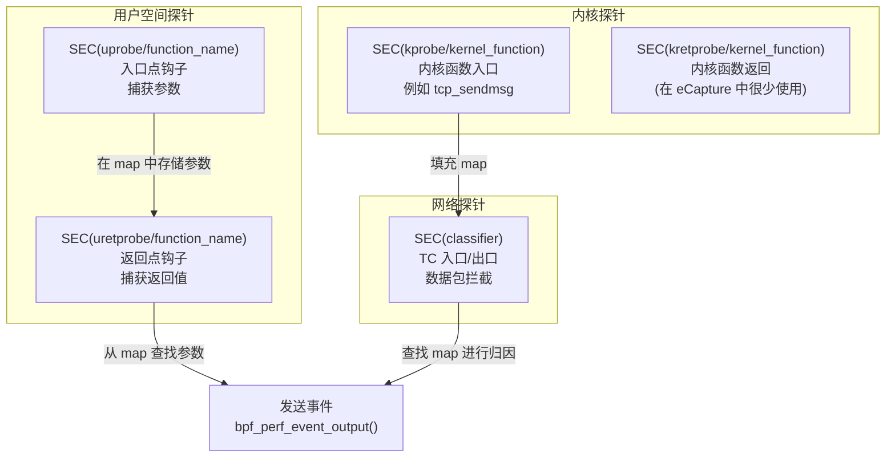
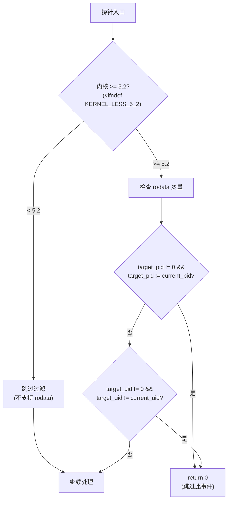

# eBPF 程序结构

本页面记录了 eCapture 的 eBPF 程序中使用的通用结构模式、约定和机制。内容涵盖 map 类型、探针挂载策略、事件结构、过滤模式以及所有捕获模块共享的数据导出机制。

有关构建和编译 eBPF 程序的信息，请参阅[构建系统](5.1-build-system.md)。有关计算库特定钩子的结构体偏移量的指导，请参阅[结构体偏移量计算](5.2.2-structure-offset-calculation.md)。有关创建使用 eBPF 程序的新模块的信息，请参阅[添加新模块](5.3-adding-new-modules.md)。

## eBPF 程序剖析

eCapture 中的所有 eBPF 程序都遵循通用结构，包括头文件包含、map 定义、事件结构、辅助函数和探针入口点。下图展示了这种标准剖析结构：



来源：[kern/ecapture.h](https://github.com/gojue/ecapture/blob/0766a93b/kern/ecapture.h), [kern/common.h](https://github.com/gojue/ecapture/blob/0766a93b/kern/common.h), [kern/bash_kern.c](https://github.com/gojue/ecapture/blob/0766a93b/kern/bash_kern.c), [kern/nspr_kern.c](https://github.com/gojue/ecapture/blob/0766a93b/kern/nspr_kern.c), [kern/mysqld_kern.c](https://github.com/gojue/ecapture/blob/0766a93b/kern/mysqld_kern.c), [kern/postgres_kern.c](https://github.com/gojue/ecapture/blob/0766a93b/kern/postgres_kern.c), [kern/tc.h](https://github.com/gojue/ecapture/blob/0766a93b/kern/tc.h)

## 头文件与编译模式

eCapture 支持两种 eBPF 编译模式：CO-RE（一次编译 - 到处运行）和 non-CO-RE。模式由 `NOCORE` 预处理器定义的存在与否决定。

### CO-RE 模式（启用 BTF）

当启用 CO-RE（未定义 `NOCORE`）时，程序使用：
- `vmlinux.h` - 来自 BTF 的内核类型定义
- `bpf/bpf_core_read.h` - CO-RE 字段访问宏
- `core_fixes.bpf.h` - 内核兼容性问题的变通方法

### Non-CO-RE 模式（传统）

当定义 `NOCORE` 时，程序使用：
- 来自构建系统的内核头文件
- 传统的 `bpf_probe_read()` 辅助函数
- 架构特定的结构定义

两种模式都包含：
- `bpf/bpf_helpers.h` - BPF 辅助函数声明
- `bpf/bpf_tracing.h` - 跟踪宏如 `PT_REGS_PARM*`
- `bpf/bpf_endian.h` - 字节序转换辅助函数

**头文件包含模式：**

```
ecapture.h 包含：
├── CO-RE 模式 (#ifndef NOCORE)
│   ├── vmlinux.h
│   ├── bpf/bpf_core_read.h
│   ├── bpf/bpf_helpers.h
│   ├── bpf/bpf_tracing.h
│   ├── bpf/bpf_endian.h
│   └── core_fixes.bpf.h
├── Non-CO-RE 模式 (#ifdef NOCORE)
│   ├── linux/types.h
│   ├── uapi/linux/ptrace.h
│   ├── linux/bpf.h
│   ├── linux/socket.h
│   ├── net/sock.h
│   ├── bpf/bpf_helpers.h
│   ├── bpf/bpf_tracing.h
│   ├── bpf/bpf_endian.h
│   └── uapi/linux/pkt_cls.h (用于 TC 程序)
└── common.h (总是包含)
```

来源：[kern/ecapture.h:15-93](https://github.com/gojue/ecapture/blob/0766a93b/kern/ecapture.h#L15-L93), [kern/common.h:15-85](https://github.com/gojue/ecapture/blob/0766a93b/kern/common.h#L15-L85)

## Map 类型与使用模式

eCapture eBPF 程序使用多种 BPF map 类型，每种都在从内核到用户空间的数据流中发挥特定作用。



### BPF_MAP_TYPE_PERF_EVENT_ARRAY

用于将捕获的事件从内核发送到用户空间。每个模块定义一个或多个 perf 事件数组：

| 模块 | Map 名称 | 事件类型 |
|--------|----------|------------|
| bash | `events` | `struct event` |
| nspr | `nspr_events` | `struct ssl_data_event_t` |
| mysqld | `events` | `struct data_t` |
| postgres | `events` | `struct data_t` |
| tc | `skb_events` | `struct skb_data_event_t` |

**定义模式：**
```c
struct {
    __uint(type, BPF_MAP_TYPE_PERF_EVENT_ARRAY);
    __uint(key_size, sizeof(u32));
    __uint(value_size, sizeof(u32));
    __uint(max_entries, 1024);
} events SEC(".maps");
```

来源：[kern/bash_kern.c:26-31](https://github.com/gojue/ecapture/blob/0766a93b/kern/bash_kern.c#L26-L31), [kern/nspr_kern.c:29-34](https://github.com/gojue/ecapture/blob/0766a93b/kern/nspr_kern.c#L29-L34), [kern/mysqld_kern.c:36-41](https://github.com/gojue/ecapture/blob/0766a93b/kern/mysqld_kern.c#L36-L41), [kern/postgres_kern.c:24-29](https://github.com/gojue/ecapture/blob/0766a93b/kern/postgres_kern.c#L24-L29), [kern/tc.h:57-62](https://github.com/gojue/ecapture/blob/0766a93b/kern/tc.h#L57-L62)

### BPF_MAP_TYPE_HASH

用于在探针入口和返回之间存储状态，通常将线程 ID 映射到捕获的参数：

**通用模式 - 参数存储：**
```c
// 在函数入口存储缓冲区指针
struct {
    __uint(type, BPF_MAP_TYPE_HASH);
    __type(key, u64);              // pid_tgid
    __type(value, const char*);    // 缓冲区指针
    __uint(max_entries, 1024);
} active_ssl_read_args_map SEC(".maps");

// 存储完整事件以跟踪返回值
struct {
    __uint(type, BPF_MAP_TYPE_HASH);
    __type(key, u32);              // pid
    __type(value, struct event);
    __uint(max_entries, 1024);
} events_t SEC(".maps");
```

**生命周期模式：**
1. 入口探针：`bpf_map_update_elem(&map, &key, &value, BPF_ANY)`
2. 返回探针：`bpf_map_lookup_elem(&map, &key)`
3. 返回探针：`bpf_map_delete_elem(&map, &key)`（清理）

来源：[kern/nspr_kern.c:41-53](https://github.com/gojue/ecapture/blob/0766a93b/kern/nspr_kern.c#L41-L53), [kern/bash_kern.c:33-38](https://github.com/gojue/ecapture/blob/0766a93b/kern/bash_kern.c#L33-L38), [kern/mysqld_kern.c:29-34](https://github.com/gojue/ecapture/blob/0766a93b/kern/mysqld_kern.c#L29-L34)

### BPF_MAP_TYPE_PERCPU_ARRAY

用作每 CPU 堆以避免 512 字节的 BPF 栈限制。允许分配大型事件结构：

```c
struct {
    __uint(type, BPF_MAP_TYPE_PERCPU_ARRAY);
    __type(key, u32);
    __type(value, struct ssl_data_event_t);  // 可以 > 512 字节
    __uint(max_entries, 1);
} data_buffer_heap SEC(".maps");

// 在辅助函数中使用：
static __inline struct ssl_data_event_t* create_ssl_data_event(u64 current_pid_tgid) {
    u32 kZero = 0;
    struct ssl_data_event_t* event = bpf_map_lookup_elem(&data_buffer_heap, &kZero);
    if (event == NULL) {
        return NULL;
    }
    // 初始化事件字段...
    return event;
}
```

来源：[kern/nspr_kern.c:57-62,68-80](), [kern/tc.h:64-69,92-100]()

### BPF_MAP_TYPE_LRU_HASH

用于 TC 程序中的连接跟踪。当满时自动驱逐最少使用的条目：

```c
struct {
    __uint(type, BPF_MAP_TYPE_LRU_HASH);
    __type(key, struct net_id_t);      // 4 元组 + 协议
    __type(value, struct net_ctx_t);    // pid、uid、comm
    __uint(max_entries, 10240);
} network_map SEC(".maps");
```

此 map 由 `tcp_sendmsg`/`udp_sendmsg` 上的 kprobe 填充，并由 TC 分类器查询以将数据包归因于进程。

来源：[kern/tc.h:72-77,290-347,349-397]()

## 事件结构

每个 eBPF 程序定义与捕获的数据相匹配的事件结构。这些结构根据其携带的数据有大小约束。

### 事件结构模式



### 事件结构示例

| 模块 | 结构 | 数据字段 | 最大大小 |
|--------|-----------|------------|----------|
| bash | `struct event` | `line[256]` | 256 字节 |
| nspr | `struct ssl_data_event_t` | `data[16384]` | 16 KB |
| mysqld | `struct data_t` | `query[256]` | 256 字节 |
| postgres | `struct data_t` | `query[256]` | 256 字节 |
| tc | `struct skb_data_event_t` | (无数据，使用 perf 标志) | 36 字节（仅头部） |

**大小原理：**
- TLS/SSL 模块使用 `MAX_DATA_SIZE_OPENSSL`（16384）以适应 RFC 5246 规定的最大 TLS 记录大小
- 数据库模块使用较小的缓冲区（256），因为仅捕获查询文本
- Shell 模块对命令行使用 256 字节
- TC 模块发送最小元数据并使用 `bpf_perf_event_output()` 标志来包含数据包数据

来源：[kern/common.h:28-43](https://github.com/gojue/ecapture/blob/0766a93b/kern/common.h#L28-L43), [kern/bash_kern.c:17-24](https://github.com/gojue/ecapture/blob/0766a93b/kern/bash_kern.c#L17-L24), [kern/nspr_kern.c:19-27](https://github.com/gojue/ecapture/blob/0766a93b/kern/nspr_kern.c#L19-L27), [kern/mysqld_kern.c:19-27](https://github.com/gojue/ecapture/blob/0766a93b/kern/mysqld_kern.c#L19-L27), [kern/postgres_kern.c:17-22](https://github.com/gojue/ecapture/blob/0766a93b/kern/postgres_kern.c#L17-L22), [kern/tc.h:30-37](https://github.com/gojue/ecapture/blob/0766a93b/kern/tc.h#L30-L37)

## 探针挂载与 SEC() 宏

`SEC()` 宏定义探针类型和挂载点。eCapture 使用四种主要探针类型：



### Uprobe/Uretprobe 模式

大多数 eCapture 模块遵循入口/返回探针对模式：

```
入口探针 (uprobe)：
1. 使用 PT_REGS_PARM* 宏提取函数参数
2. 将参数存储在哈希 map 中（键：pid/tid）
3. 可选：按 PID/UID 过滤
4. 返回

返回探针 (uretprobe)：
1. 使用 PT_REGS_RC() 提取返回值
2. 从哈希 map 查找存储的参数
3. 将参数 + 返回值组合成事件
4. 通过 bpf_perf_event_output() 发送事件
5. 删除 map 条目以进行清理
```

**示例 - NSPR SSL_write：**
- 入口：`SEC("uprobe/PR_Write")` 存储缓冲区指针
- 返回：`SEC("uretprobe/PR_Write")` 读取缓冲区内容和长度

来源：[kern/nspr_kern.c:114-162](https://github.com/gojue/ecapture/blob/0766a93b/kern/nspr_kern.c#L114-L162)

**示例 - Bash readline：**
- 入口：未钩住（来自 readline 库的函数指针）
- 返回：`SEC("uretprobe/bash_readline")` 捕获返回的字符串
- 附加：`SEC("uretprobe/bash_retval")` 捕获命令退出状态

来源：[kern/bash_kern.c:42-112](https://github.com/gojue/ecapture/blob/0766a93b/kern/bash_kern.c#L42-L112)

### Kprobe 用法

eCapture 主要使用 kprobe 进行连接跟踪，而不是数据捕获：

```c
SEC("kprobe/tcp_sendmsg")
int tcp_sendmsg(struct pt_regs *ctx) {
    // 提取套接字结构
    struct sock *sk = (struct sock *)PT_REGS_PARM1(ctx);
    
    // 从套接字读取连接 4 元组
    bpf_probe_read(&family, sizeof(family), &sk->__sk_common.skc_family);
    bpf_probe_read(&lport, sizeof(lport), &sk->__sk_common.skc_num);
    bpf_probe_read(&dport, sizeof(dport), &sk->__sk_common.skc_dport);
    bpf_probe_read(&src_ip4, sizeof(src_ip4), &sk->__sk_common.skc_rcv_saddr);
    bpf_probe_read(&dst_ip4, sizeof(dst_ip4), &sk->__sk_common.skc_daddr);
    
    // 存储与连接关联的 pid/uid/comm
    struct net_ctx_t net_ctx = {.pid = pid, .uid = uid};
    bpf_get_current_comm(&net_ctx.comm, sizeof(net_ctx.comm));
    bpf_map_update_elem(&network_map, &conn_id, &net_ctx, BPF_ANY);
}
```

对 `udp_sendmsg` 使用相同的模式。TC 分类器稍后使用此 map 将数据包归因于进程。

来源：[kern/tc.h:290-347,349-397]()

### TC 分类器模式

TC 分类器（`SEC("classifier")`）挂载到网络接口以进行数据包捕获：

```c
SEC("classifier")
int egress_cls_func(struct __sk_buff *skb) {
    return capture_packets(skb, false);  // false = 出口
}

SEC("classifier")
int ingress_cls_func(struct __sk_buff *skb) {
    return capture_packets(skb, true);   // true = 入口
}
```

`capture_packets()` 函数：
1. 解析以太网、IP 和 TCP/UDP 头
2. 提取 4 元组（src_ip、dst_ip、src_port、dst_port）
3. 在 `network_map` 中查找连接（由 kprobe 填充）
4. 如果找到连接，应用 PID/UID 过滤器
5. 通过 `bpf_perf_event_output()` 发送数据包元数据 + 数据

来源：[kern/tc.h:135-289](https://github.com/gojue/ecapture/blob/0766a93b/kern/tc.h#L135-L289)

## PID/UID 过滤

eCapture 支持按进程 ID 和用户 ID 进行可选过滤。过滤机制取决于内核版本：



### 只读数据变量（内核 >= 5.2）

对于支持 BTF 和 rodata 的内核，过滤目标在 `common.h` 中定义为常量：

```c
#ifndef KERNEL_LESS_5_2
const volatile u64 target_pid = 0;  // 0 = 捕获所有进程
const volatile u64 target_uid = 0;  // 0 = 捕获所有用户
const volatile u64 target_errno = BASH_ERRNO_DEFAULT;
#endif
```

这些变量标记为 `const volatile`，因此 BPF 验证器可以优化它们，但用户空间仍然可以在程序加载之前修改它们。当设置为 0 时，不应用过滤。

来源：[kern/common.h:64-71](https://github.com/gojue/ecapture/blob/0766a93b/kern/common.h#L64-L71)

### 过滤应用模式

标准过滤代码出现在每个探针中：

```c
u64 current_pid_tgid = bpf_get_current_pid_tgid();
u32 pid = current_pid_tgid >> 32;
u64 current_uid_gid = bpf_get_current_uid_gid();
u32 uid = current_uid_gid;

#ifndef KERNEL_LESS_5_2
    if (target_pid != 0 && target_pid != pid) {
        return 0;  // 跳过此事件
    }
    if (target_uid != 0 && target_uid != uid) {
        return 0;  // 跳过此事件
    }
#endif
```

对于内核 < 5.2（编译期间定义 `KERNEL_LESS_5_2` 时），省略过滤检查。

来源：[kern/bash_kern.c:44-57](https://github.com/gojue/ecapture/blob/0766a93b/kern/bash_kern.c#L44-L57), [kern/nspr_kern.c:116-130](https://github.com/gojue/ecapture/blob/0766a93b/kern/nspr_kern.c#L116-L130), [kern/mysqld_kern.c:64-77](https://github.com/gojue/ecapture/blob/0766a93b/kern/mysqld_kern.c#L64-L77), [kern/postgres_kern.c:37-49](https://github.com/gojue/ecapture/blob/0766a93b/kern/postgres_kern.c#L37-L49)

### 特殊情况 - Bash 返回值过滤

bash 模块包含对命令退出代码的附加过滤：

```c
#ifndef KERNEL_LESS_5_2
    if (target_errno != BASH_ERRNO_DEFAULT && target_errno != retval) {
        // 命令退出代码与目标不匹配
        if (event_p) {
            // 发送带有默认 errno 的事件以指示不匹配
            event_p->retval = BASH_ERRNO_DEFAULT;
            event_p->type = BASH_EVENT_TYPE_RETVAL;
            bpf_perf_event_output(ctx, &events, BPF_F_CURRENT_CPU, event_p, 
                                  sizeof(struct event));
            bpf_map_delete_elem(&events_t, &pid);
        }
        return 0;
    }
#endif
```

当 `target_errno` 设置为除 `BASH_ERRNO_DEFAULT`（128）之外的值时，只完全捕获具有该退出代码的命令。

来源：[kern/bash_kern.c:79-102](https://github.com/gojue/ecapture/blob/0766a93b/kern/bash_kern.c#L79-L102), [kern/common.h:51,69]()

## 数据提取模式

eCapture 根据源位置使用不同的 BPF 辅助函数来读取数据。

### 从用户空间读取

对于用户空间内存中的数据（函数参数、缓冲区）：

```c
// 读取到局部变量
char buf[256];
bpf_probe_read_user(buf, sizeof(buf), user_ptr);

// 读取到事件结构
bpf_probe_read_user(&event.data, event.data_len, buf_ptr);

// 读取结构成员
struct COM_QUERY_DATA query;
bpf_probe_read_user(&query, sizeof(query), st);
bpf_probe_read_user(&data.query, sizeof(data.query), query.query);
```

来源：[kern/bash_kern.c:64](https://github.com/gojue/ecapture/blob/0766a93b/kern/bash_kern.c#L64), [kern/nspr_kern.c:101](https://github.com/gojue/ecapture/blob/0766a93b/kern/nspr_kern.c#L101), [kern/mysqld_kern.c:214-216](https://github.com/gojue/ecapture/blob/0766a93b/kern/mysqld_kern.c#L214-L216)

### 从内核空间读取

对于内核结构（套接字、任务）：

```c
// 读取套接字族
u16 family;
bpf_probe_read(&family, sizeof(family), &sk->__sk_common.skc_family);

// 读取 IP 地址
u32 src_ip4, dst_ip4;
bpf_probe_read(&src_ip4, sizeof(src_ip4), &sk->__sk_common.skc_rcv_saddr);
bpf_probe_read(&dst_ip4, sizeof(dst_ip4), &sk->__sk_common.skc_daddr);

// CO-RE 替代方案（当 BTF 可用时）：
family = BPF_CORE_READ(sk, __sk_common.skc_family);
```

来源：[kern/tc.h:311-336](https://github.com/gojue/ecapture/blob/0766a93b/kern/tc.h#L311-L336)

### 从 pt_regs 读取

从 `struct pt_regs` 提取函数参数和返回值：

```c
// 函数参数（x86_64）：
void *arg1 = (void *)PT_REGS_PARM1(ctx);
void *arg2 = (void *)PT_REGS_PARM2(ctx);
void *arg3 = (void *)PT_REGS_PARM3(ctx);
u64 arg4 = (u64)PT_REGS_PARM4(ctx);

// 返回值：
int retval = (int)PT_REGS_RC(ctx);
```

`PT_REGS_PARM*` 和 `PT_REGS_RC` 宏是架构感知的，并在 `bpf/bpf_tracing.h` 中定义。它们为 x86_64、aarch64 等抽象寄存器访问。

来源：[kern/bash_kern.c:64,77](), [kern/nspr_kern.c:87,132](), [kern/mysqld_kern.c:59,79]()

### 获取进程信息

用于检索进程上下文的标准辅助函数：

```c
// 获取 PID 和 TID
u64 pid_tgid = bpf_get_current_pid_tgid();
u32 pid = pid_tgid >> 32;
u32 tid = pid_tgid & 0xFFFFFFFF;

// 获取 UID 和 GID
u64 uid_gid = bpf_get_current_uid_gid();
u32 uid = uid_gid;
u32 gid = uid_gid >> 32;

// 获取进程名称
char comm[TASK_COMM_LEN];  // TASK_COMM_LEN = 16
bpf_get_current_comm(&comm, sizeof(comm));

// 获取时间戳
u64 timestamp_ns = bpf_ktime_get_ns();
```

来源：[kern/bash_kern.c:44-46,65](), [kern/nspr_kern.c:76-78](https://github.com/gojue/ecapture/blob/0766a93b/kern/nspr_kern.c#L76-L78)

## 辅助函数

eBPF 程序定义辅助函数以避免代码重复并保持在 BPF 复杂性限制内。

### 事件创建辅助函数

从每 CPU 堆分配事件并初始化通用字段：

```c
static __inline struct ssl_data_event_t* create_ssl_data_event(u64 current_pid_tgid) {
    u32 kZero = 0;
    struct ssl_data_event_t* event = bpf_map_lookup_elem(&data_buffer_heap, &kZero);
    if (event == NULL) {
        return NULL;
    }
    
    const u32 kMask32b = 0xffffffff;
    event->timestamp_ns = bpf_ktime_get_ns();
    event->pid = current_pid_tgid >> 32;
    event->tid = current_pid_tgid & kMask32b;
    return event;
}
```

来源：[kern/nspr_kern.c:68-80](https://github.com/gojue/ecapture/blob/0766a93b/kern/nspr_kern.c#L68-L80), [kern/tc.h:92-100](https://github.com/gojue/ecapture/blob/0766a93b/kern/tc.h#L92-L100)

### 数据处理辅助函数

集中通用处理逻辑：

```c
static int process_SSL_data(struct pt_regs* ctx, u64 id, 
                           enum ssl_data_event_type type, const char* buf) {
    // 获取返回值（读取/写入的字节）
    int len = (int)PT_REGS_RC(ctx);
    if (len < 0) {
        return 0;
    }
    
    // 创建事件
    struct ssl_data_event_t* event = create_ssl_data_event(id);
    if (event == NULL) {
        return 0;
    }
    
    // 填充事件字段
    event->type = type;
    event->data_len = (len < MAX_DATA_SIZE_OPENSSL ? 
                       (len & (MAX_DATA_SIZE_OPENSSL - 1)) : 
                       MAX_DATA_SIZE_OPENSSL);
    bpf_probe_read_user(event->data, event->data_len, buf);
    bpf_get_current_comm(&event->comm, sizeof(event->comm));
    
    // 发送到用户空间
    bpf_perf_event_output(ctx, &nspr_events, BPF_F_CURRENT_CPU, 
                         event, sizeof(struct ssl_data_event_t));
    return 0;
}
```

来源：[kern/nspr_kern.c:86-105](https://github.com/gojue/ecapture/blob/0766a93b/kern/nspr_kern.c#L86-L105)

### 数据包验证辅助函数

TC 程序需要处理数据包边界检查：

```c
static __always_inline bool skb_revalidate_data(struct __sk_buff *skb,
                                                uint8_t **head, uint8_t **tail,
                                                const u32 offset) {
    if (*head + offset > *tail) {
        // 需要将更多数据拉入线性部分
        if (bpf_skb_pull_data(skb, offset) < 0) {
            return false;
        }
        
        // 拉取后更新指针
        *head = (uint8_t *)(long)skb->data;
        *tail = (uint8_t *)(long)skb->data_end;
        
        // 验证偏移量现在是否可访问
        if (*head + offset > *tail) {
            return false;
        }
    }
    
    return true;
}
```

此辅助函数确保在解引用之前数据包数据是可访问的，BPF 验证器需要这样做以证明安全性。

来源：[kern/tc.h:102-119](https://github.com/gojue/ecapture/blob/0766a93b/kern/tc.h#L102-L119)

### PCAP 过滤器注入点

eCapture 支持将 pcap-filter 表达式注入为 eBPF 代码。注入点用存根函数标记：

```c
// pcap-filter 注入的存根函数
static __noinline bool filter_pcap_ebpf_l2(void *_skb, void *__skb,
                                           void *___skb, void *data,
                                           void* data_end) {
    return data != data_end && _skb == __skb && __skb == ___skb;
}

static __always_inline bool filter_pcap_l2(struct __sk_buff *skb, void *data,
                                           void *data_end) {
    return filter_pcap_ebpf_l2((void *) skb, (void *) skb, (void *) skb, data,
                               data_end);
}
```

`__noinline` 属性防止内联，允许用户空间程序用编译的 pcap-filter 逻辑替换此函数的字节码。

来源：[kern/tc.h:121-132](https://github.com/gojue/ecapture/blob/0766a93b/kern/tc.h#L121-L132)

## 事件输出机制

事件通过 `bpf_perf_event_output()` 从内核发送到用户空间。

### 标准事件输出

```c
bpf_perf_event_output(ctx, &events, BPF_F_CURRENT_CPU, &event, sizeof(event));
```

参数：
- `ctx` - 探针上下文（`struct pt_regs*` 或 `struct __sk_buff*`）
- `&events` - perf 事件数组 map
- `BPF_F_CURRENT_CPU` - 发送到当前 CPU 的 perf 缓冲区
- `&event` - 指向事件结构的指针
- `sizeof(event)` - 要复制的大小

来源：[kern/bash_kern.c:67](https://github.com/gojue/ecapture/blob/0766a93b/kern/bash_kern.c#L67), [kern/nspr_kern.c:103](https://github.com/gojue/ecapture/blob/0766a93b/kern/nspr_kern.c#L103), [kern/mysqld_kern.c:139,263](), [kern/postgres_kern.c:58](https://github.com/gojue/ecapture/blob/0766a93b/kern/postgres_kern.c#L58)

### 可变大小事件输出

对于具有可变长度数据的事件，调整 size 参数：

```c
// MySQL：仅发送实际查询长度
size_t event_size = sizeof(struct data_t);
bpf_perf_event_output(ctx, &events, BPF_F_CURRENT_CPU, data, event_size);

// TC：发送最小头部 + 使用标志包含数据包数据
u64 flags = BPF_F_CURRENT_CPU;
flags |= (u64)skb->len << 32;  // 在高 32 位中编码数据包长度
size_t pkt_size = TC_PACKET_MIN_SIZE;  // 36 字节
bpf_perf_event_output(skb, &skb_events, flags, &event, pkt_size);
```

TC 方法在 flags 参数中编码数据包长度，允许内核将数据包数据附加到 perf 事件而无需将其复制到事件结构中。

来源：[kern/tc.h:260-271](https://github.com/gojue/ecapture/blob/0766a93b/kern/tc.h#L260-L271)

## 调试

eCapture 使用 BPF trace printk 提供条件调试输出。

### 调试宏

```c
#ifdef DEBUG_PRINT
#define debug_bpf_printk(fmt, ...)                     \
    do {                                               \
        char s[] = fmt;                                \
        bpf_trace_printk(s, sizeof(s), ##__VA_ARGS__); \
    } while (0)
#else
#define debug_bpf_printk(fmt, ...)
#endif
```

当在编译期间定义 `DEBUG_PRINT` 时，调试消息被写入 `/sys/kernel/debug/tracing/trace_pipe`。当未定义时，宏编译为空（零开销）。

来源：[kern/common.h:18-26](https://github.com/gojue/ecapture/blob/0766a93b/kern/common.h#L18-L26)

### 调试使用示例

```c
debug_bpf_printk("nspr uprobe/PR_Write pid :%d\n", pid);
debug_bpf_printk("capture packet process found, pid: %d, comm :%s\n", 
                 event.pid, event.comm);
debug_bpf_printk("mysql query:%s\n", data->query);
debug_bpf_printk("tcp_sendmsg pid : %d, comm :%s\n", net_ctx.pid, net_ctx.comm);
```

调试语句有助于跟踪程序执行、验证过滤器和诊断问题，而无需修改主逻辑。

来源：[kern/nspr_kern.c:120](https://github.com/gojue/ecapture/blob/0766a93b/kern/nspr_kern.c#L120), [kern/tc.h:253](https://github.com/gojue/ecapture/blob/0766a93b/kern/tc.h#L253), [kern/mysqld_kern.c:136](https://github.com/gojue/ecapture/blob/0766a93b/kern/mysqld_kern.c#L136), [kern/tc.h:344](https://github.com/gojue/ecapture/blob/0766a93b/kern/tc.h#L344)

## 许可证和版本元数据

所有 eBPF 程序必须包含许可证和版本信息：

```c
char __license[] SEC("license") = "Dual MIT/GPL";
__u32 _version SEC("version") = 0xFFFFFFFE;
```

- 许可证必须与 GPL 兼容才能使用仅 GPL 的 BPF 辅助函数
- 版本 `0xFFFFFFFE` 是一个特殊值，表示程序可在多个内核版本上运行

来源：[kern/common.h:82-83](https://github.com/gojue/ecapture/blob/0766a93b/kern/common.h#L82-L83)

## 总结表：通用模式

| 模式 | 位置 | 目的 |
|---------|----------|---------|
| `struct { __uint(type, BPF_MAP_TYPE_*); } map SEC(".maps")` | 所有模块 | 定义 BPF maps |
| `SEC("uprobe/function")` / `SEC("uretprobe/function")` | TLS、shell、DB 模块 | 钩住用户空间函数 |
| `SEC("kprobe/function")` | tc.h | 钩住内核函数 |
| `SEC("classifier")` | tc.h | TC 数据包捕获 |
| `#ifndef KERNEL_LESS_5_2` ... `#endif` | 所有模块 | 内核版本特定代码 |
| `const volatile u64 target_pid` | common.h | 过滤目标（rodata） |
| `bpf_get_current_pid_tgid()` | 所有模块 | 获取 PID/TID |
| `bpf_get_current_uid_gid()` | 所有模块 | 获取 UID/GID |
| `PT_REGS_PARM*()` / `PT_REGS_RC()` | 所有模块 | 提取函数参数/返回值 |
| `bpf_probe_read_user()` | 所有模块 | 读取用户空间内存 |
| `bpf_probe_read()` / `BPF_CORE_READ()` | tc.h | 读取内核内存 |
| `bpf_map_update_elem()` | 所有模块 | 存储状态 |
| `bpf_map_lookup_elem()` | 所有模块 | 检索状态 |
| `bpf_map_delete_elem()` | 所有模块 | 清理状态 |
| `bpf_perf_event_output()` | 所有模块 | 发送事件到用户空间 |
| `BPF_MAP_TYPE_PERCPU_ARRAY` | nspr、tc | 避免栈限制 |
| `static __always_inline` / `static __inline` | 所有模块 | 辅助函数 |
| `debug_bpf_printk()` | 所有模块 | 条件调试输出 |

来源：本文档中引用的所有 kern/*.c 和 kern/*.h 文件。