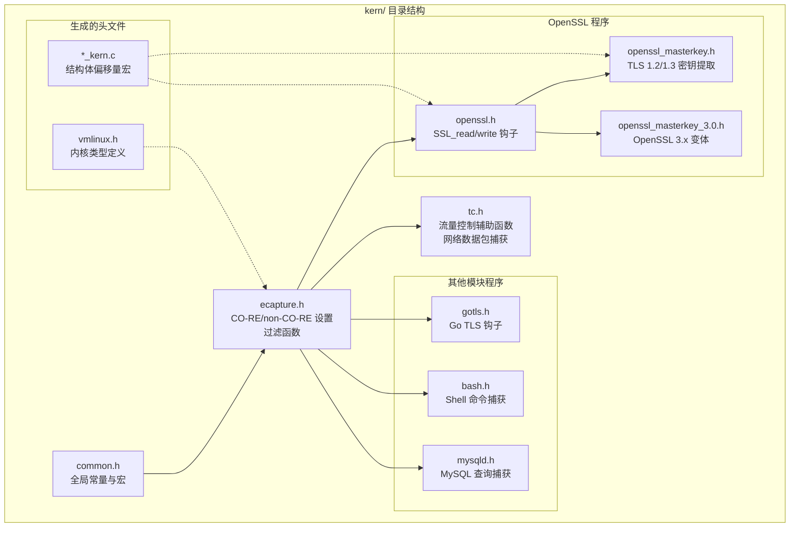
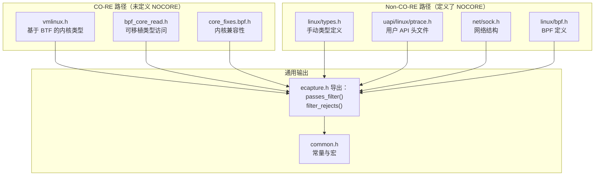
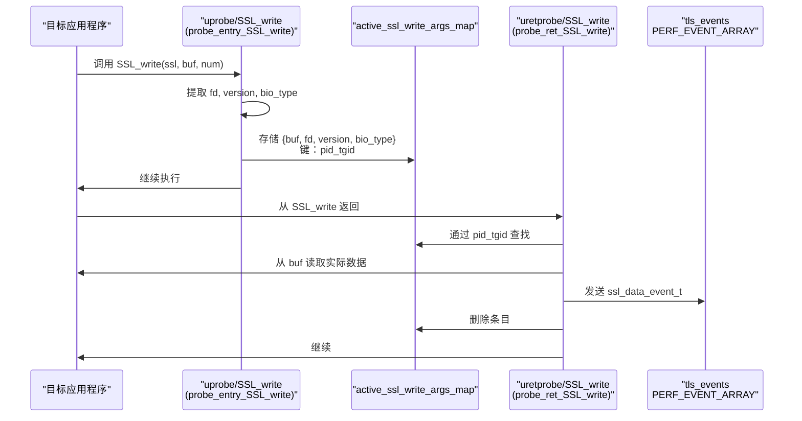
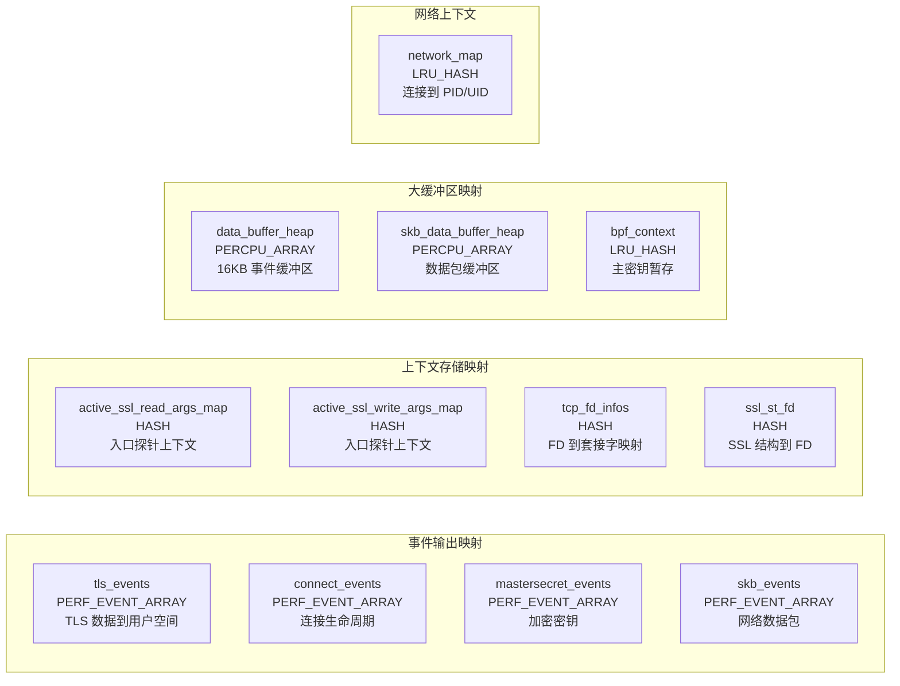
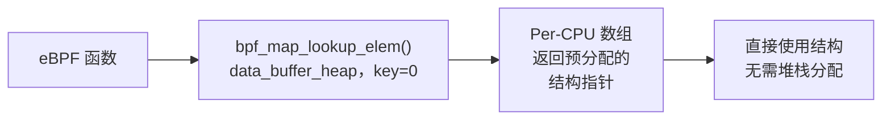
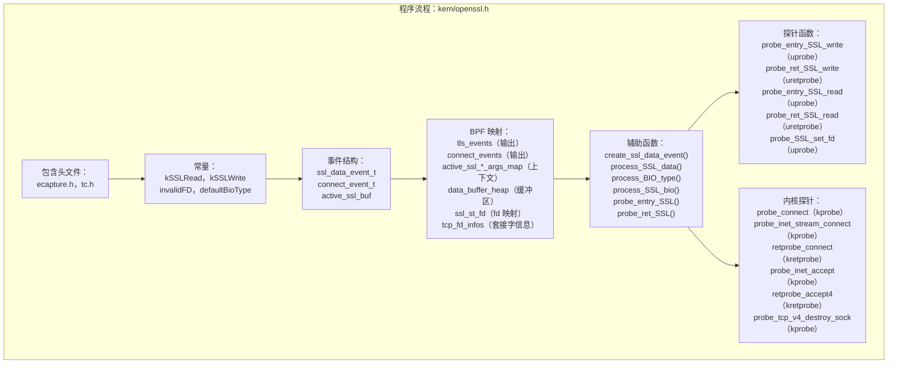
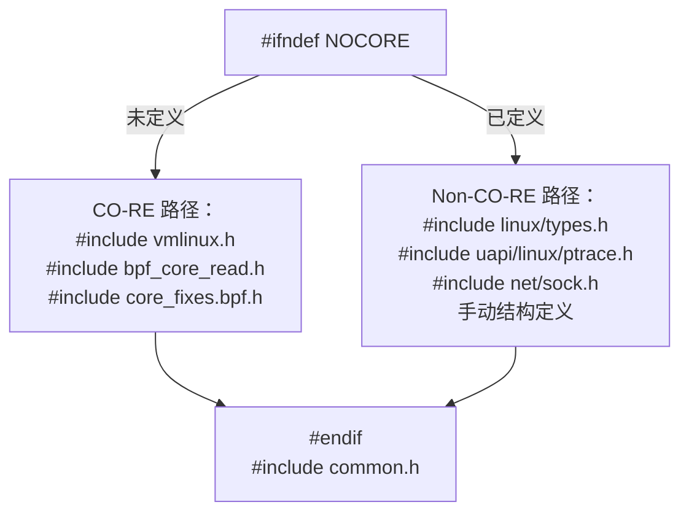

# eBPF 程序结构

本页面记录了 eCapture 代码库中 eBPF 程序的组织和结构，包括通用头文件、探针类型定义、事件结构、BPF 映射和辅助函数。它为编写或修改 eBPF 程序的开发人员提供参考。

有关为特定库版本生成结构体偏移量的信息，请参见[结构体偏移量计算](5.2.2-structure-offset-calculation.md)。有关实现完整捕获模块的指南，请参见[添加新模块](5.3-adding-new-modules.md)。

---

## 目录组织

所有 eBPF 内核空间程序都位于 `kern/` 目录中。这些程序遵循模块化结构，具有共享头文件和模块特定的实现文件。


```mermaid
graph TB
    subgraph "kern/ 目录结构"
        COMMON["common.h<br/>全局常量与宏"]
        ECAPTURE["ecapture.h<br/>CO-RE/non-CO-RE 设置<br/>过滤函数"]
        TC["tc.h<br/>流量控制辅助函数<br/>网络数据包捕获"]
        
        subgraph "OpenSSL 程序"
            OPENSSL["openssl.h<br/>SSL_read/write 钩子"]
            MASTERKEY["openssl_masterkey.h<br/>TLS 1.2/1.3 密钥提取"]
            MASTERKEY3["openssl_masterkey_3.0.h<br/>OpenSSL 3.x 变体"]
        end
        
        subgraph "其他模块程序"
            GOTLS["gotls.h<br/>Go TLS 钩子"]
            BASH["bash.h<br/>Shell 命令捕获"]
            MYSQL["mysqld.h<br/>MySQL 查询捕获"]
        end
        
        subgraph "生成的头文件"
            VMLINUX["vmlinux.h<br/>内核类型定义"]
            OFFSETS["*_kern.c<br/>结构体偏移量宏"]
        end
    end
    
    COMMON --> ECAPTURE
    ECAPTURE --> OPENSSL
    ECAPTURE --> TC
    ECAPTURE --> GOTLS
    ECAPTURE --> BASH
    ECAPTURE --> MYSQL
    
    OPENSSL --> MASTERKEY
    OPENSSL --> MASTERKEY3
    
    VMLINUX -.-> ECAPTURE
    OFFSETS -.-> OPENSSL
    OFFSETS -.-> MASTERKEY
```

**来源：** [kern/common.h](https://github.com/gojue/ecapture/blob/ca085d05/kern/common.h), [kern/ecapture.h](https://github.com/gojue/ecapture/blob/ca085d05/kern/ecapture.h), [kern/openssl.h](https://github.com/gojue/ecapture/blob/ca085d05/kern/openssl.h), [kern/tc.h](https://github.com/gojue/ecapture/blob/ca085d05/kern/tc.h)

---

## 通用头文件

### common.h - 全局定义

`common.h` 头文件定义了所有 eBPF 程序中使用的常量、宏和全局变量。

| 定义 | 用途 | 行引用 |
|------|------|--------|
| `debug_bpf_printk()` | 条件调试输出宏 | [kern/common.h:19-26](https://github.com/gojue/ecapture/blob/ca085d05/kern/common.h#L19-L26) |
| `TASK_COMM_LEN` | 进程名称长度（16 字节） | [kern/common.h:28](https://github.com/gojue/ecapture/blob/ca085d05/kern/common.h#L28) |
| `MAX_DATA_SIZE_OPENSSL` | TLS 数据缓冲区大小（16KB） | [kern/common.h:39](https://github.com/gojue/ecapture/blob/ca085d05/kern/common.h#L39) |
| `MAX_DATA_SIZE_MYSQL` | MySQL 查询缓冲区大小（256B） | [kern/common.h:40](https://github.com/gojue/ecapture/blob/ca085d05/kern/common.h#L40) |
| `AF_INET`, `AF_INET6` | 地址族常量 | [kern/common.h:49-50](https://github.com/gojue/ecapture/blob/ca085d05/kern/common.h#L49-L50) |
| `target_pid`, `target_uid` | 全局过滤变量（volatile） | [kern/common.h:68-69](https://github.com/gojue/ecapture/blob/ca085d05/kern/common.h#L68-L69) |
| `less52` | 内核版本标志（< 5.2） | [kern/common.h:66](https://github.com/gojue/ecapture/blob/ca085d05/kern/common.h#L66) |

**关键特性：**

1. **调试打印：** `debug_bpf_printk()` 宏根据 `DEBUG_PRINT` 标志条件编译调试输出。这避免了生产构建中的性能开销。

2. **缓冲区大小常量：** 符合 RFC 的不同协议大小（TLS 最大片段 = 16KB，数据库查询限制）。

3. **全局变量：** 标记为 `volatile` 以表明它们是从用户空间通过常量编辑器初始化的。

**来源：** [kern/common.h:15-86](https://github.com/gojue/ecapture/blob/ca085d05/kern/common.h#L15-L86)

---

### ecapture.h - 核心基础设施

`ecapture.h` 头文件为所有 eBPF 程序提供基础，处理 CO-RE（一次编译，到处运行）与 non-CO-RE 编译路径。


```mermaid
graph TB
    subgraph "CO-RE 路径（未定义 NOCORE）"
        VMLINUX["vmlinux.h<br/>基于 BTF 的内核类型"]
        BPF_CORE["bpf_core_read.h<br/>可移植类型访问"]
        CORE_FIXES["core_fixes.bpf.h<br/>内核兼容性"]
    end
    
    subgraph "Non-CO-RE 路径（定义了 NOCORE）"
        LINUX_TYPES["linux/types.h<br/>手动类型定义"]
        UAPI["uapi/linux/ptrace.h<br/>用户 API 头文件"]
        NET_SOCK["net/sock.h<br/>网络结构"]
        LINUX_BPF["linux/bpf.h<br/>BPF 定义"]
    end
    
    subgraph "通用输出"
        ECAPTURE["ecapture.h 导出：<br/>passes_filter()<br/>filter_rejects()"]
        COMMON["common.h<br/>常量与宏"]
    end
    
    VMLINUX --> ECAPTURE
    BPF_CORE --> ECAPTURE
    CORE_FIXES --> ECAPTURE
    
    LINUX_TYPES --> ECAPTURE
    UAPI --> ECAPTURE
    NET_SOCK --> ECAPTURE
    LINUX_BPF --> ECAPTURE
    
    ECAPTURE --> COMMON
```

**条件编译：**

预处理器指令 `#ifndef NOCORE` 位于 [kern/ecapture.h:18](https://github.com/gojue/ecapture/blob/ca085d05/kern/ecapture.h#L18)，决定使用哪个路径：

- **CO-RE 模式：** 使用 `vmlinux.h` 中的 BTF（BPF 类型格式）进行内核结构定义。需要内核 >= 5.2 并支持 BTF。
- **Non-CO-RE 模式：** 手动包含内核头文件。兼容旧内核但可移植性较差。

**过滤函数：**

在 [kern/ecapture.h:93-127](https://github.com/gojue/ecapture/blob/ca085d05/kern/ecapture.h#L93-L127) 中定义了两个关键过滤函数：

```c
// 检查 PID/UID 是否应被拒绝
static __inline bool filter_rejects(u32 pid, u32 uid)

// 检查事件是否通过所有过滤器
static __always_inline bool passes_filter(struct pt_regs *ctx)
```

这些函数检查 `target_pid` 和 `target_uid` 全局变量以实现选择性跟踪。

**来源：** [kern/ecapture.h:1-130](https://github.com/gojue/ecapture/blob/ca085d05/kern/ecapture.h#L1-L130)

---

## SEC() 宏与探针类型

eBPF 程序使用 `SEC()` 宏声明它们的附加类型。节名称决定了程序如何加载和附加。

### 探针类型参考

| 节名称 | 探针类型 | 用途 | 示例函数 |
|--------|----------|------|----------|
| `uprobe/<func>` | 用户空间入口探针 | 钩住函数入口 | [kern/openssl.h:331](https://github.com/gojue/ecapture/blob/ca085d05/kern/openssl.h#L331) |
| `uretprobe/<func>` | 用户空间返回探针 | 钩住函数返回 | [kern/openssl.h:336](https://github.com/gojue/ecapture/blob/ca085d05/kern/openssl.h#L336) |
| `kprobe/<func>` | 内核入口探针 | 钩住内核函数入口 | [kern/openssl.h:374](https://github.com/gojue/ecapture/blob/ca085d05/kern/openssl.h#L374) |
| `kretprobe/<func>` | 内核返回探针 | 钩住内核函数返回 | [kern/openssl.h:456](https://github.com/gojue/ecapture/blob/ca085d05/kern/openssl.h#L456) |
| `classifier` | 流量控制分类器 | 网络数据包过滤 | [kern/tc.h:274](https://github.com/gojue/ecapture/blob/ca085d05/kern/tc.h#L274) |

### 探针模式：入口/返回配对

大多数 uprobe 钩子遵循两阶段模式：


```mermaid
sequenceDiagram
    participant App as "目标应用程序"
    participant Entry as "uprobe/SSL_write<br/>(probe_entry_SSL_write)"
    participant Map as "active_ssl_write_args_map"
    participant Return as "uretprobe/SSL_write<br/>(probe_ret_SSL_write)"
    participant Events as "tls_events<br/>PERF_EVENT_ARRAY"
    
    App->>Entry: 调用 SSL_write(ssl, buf, num)
    Entry->>Entry: 提取 fd, version, bio_type
    Entry->>Map: 存储 {buf, fd, version, bio_type}<br/>键：pid_tgid
    Entry->>App: 继续执行
    
    App->>Return: 从 SSL_write 返回
    Return->>Map: 通过 pid_tgid 查找
    Return->>App: 从 buf 读取实际数据
    Return->>Events: 发送 ssl_data_event_t
    Return->>Map: 删除条目
    Return->>App: 继续
```

**入口探针（`probe_entry_SSL_write`）：**
- 在执行前捕获函数参数
- 将上下文存储在以线程 ID 为键的 BPF 映射中
- 示例：[kern/openssl.h:331-334](https://github.com/gojue/ecapture/blob/ca085d05/kern/openssl.h#L331-L334)

**返回探针（`probe_ret_SSL_write`）：**
- 从 BPF 映射中检索存储的上下文
- 在函数完成后读取实际数据
- 向用户空间发送事件
- 示例：[kern/openssl.h:336-339](https://github.com/gojue/ecapture/blob/ca085d05/kern/openssl.h#L336-L339)

**为什么使用这种模式？**
1. 函数参数仅在入口时有效
2. 返回值和缓冲区内容仅在返回时有效
3. 线程 ID（`bpf_get_current_pid_tgid()`）关联入口和返回

**来源：** [kern/openssl.h:268-323](https://github.com/gojue/ecapture/blob/ca085d05/kern/openssl.h#L268-L323), [kern/openssl.h:331-351](https://github.com/gojue/ecapture/blob/ca085d05/kern/openssl.h#L331-L351)

---

## 事件结构定义

事件结构定义了从内核发送到用户空间的数据格式。所有事件结构都是紧凑的，并在 eBPF 程序文件的顶部声明。

### SSL 数据事件

TLS 明文捕获的主要事件：

```c
struct ssl_data_event_t {
    enum ssl_data_event_type type;    // kSSLRead 或 kSSLWrite
    u64 timestamp_ns;                 // 纳秒时间戳
    u32 pid;                          // 进程 ID
    u32 tid;                          // 线程 ID
    char data[MAX_DATA_SIZE_OPENSSL]; // 捕获的明文（16KB）
    s32 data_len;                     // 实际数据长度
    char comm[TASK_COMM_LEN];         // 进程名称
    u32 fd;                           // 文件描述符
    s32 version;                      // TLS 版本
    u32 bio_type;                     // OpenSSL BIO 类型
};
```

定义于 [kern/openssl.h:28-39](https://github.com/gojue/ecapture/blob/ca085d05/kern/openssl.h#L28-L39)。

### 连接事件

跟踪 TCP 连接生命周期：

```c
struct connect_event_t {
    unsigned __int128 saddr;          // 源地址（IPv4/IPv6）
    unsigned __int128 daddr;          // 目标地址
    char comm[TASK_COMM_LEN];         // 进程名称
    u64 timestamp_ns;                 // 事件时间戳
    u64 sock;                         // 内核套接字指针
    u32 pid;                          // 进程 ID
    u32 tid;                          // 线程 ID
    u32 fd;                           // 文件描述符
    u16 family;                       // AF_INET 或 AF_INET6
    u16 sport;                        // 源端口
    u16 dport;                        // 目标端口
    u8 is_destroy;                    // 连接关闭标志
    u8 pad[7];                        // 填充
} __attribute__((packed));
```

定义于 [kern/openssl.h:41-55](https://github.com/gojue/ecapture/blob/ca085d05/kern/openssl.h#L41-L55)。注意 `__attribute__((packed))` 以消除填充空洞。

### 主密钥事件

用于 TLS 1.2 和 1.3 密钥提取：

```c
struct mastersecret_t {
    // TLS 1.2
    s32 version;
    u8 client_random[SSL3_RANDOM_SIZE];
    u8 master_key[MASTER_SECRET_MAX_LEN];
    
    // TLS 1.3
    u32 cipher_id;
    u8 early_secret[EVP_MAX_MD_SIZE];
    u8 handshake_secret[EVP_MAX_MD_SIZE];
    u8 handshake_traffic_hash[EVP_MAX_MD_SIZE];
    u8 client_app_traffic_secret[EVP_MAX_MD_SIZE];
    u8 server_app_traffic_secret[EVP_MAX_MD_SIZE];
    u8 exporter_master_secret[EVP_MAX_MD_SIZE];
};
```

定义于 [kern/openssl_masterkey.h:25-39](https://github.com/gojue/ecapture/blob/ca085d05/kern/openssl_masterkey.h#L25-L39)。包含 TLS 1.2（单个主密钥）与 TLS 1.3（多个流量密钥）的不同字段。

**来源：** [kern/openssl.h:23-55](https://github.com/gojue/ecapture/blob/ca085d05/kern/openssl.h#L23-L55), [kern/openssl_masterkey.h:21-43](https://github.com/gojue/ecapture/blob/ca085d05/kern/openssl_masterkey.h#L21-L43)

---

## BPF 映射定义

BPF 映射在内核和用户空间之间提供存储和通信。映射使用 `SEC(".maps")` 注解声明。

### 映射类型参考


```mermaid
graph LR
    subgraph "事件输出映射"
        TLS_EVENTS["tls_events<br/>PERF_EVENT_ARRAY<br/>TLS 数据到用户空间"]
        CONN_EVENTS["connect_events<br/>PERF_EVENT_ARRAY<br/>连接生命周期"]
        MASTER_EVENTS["mastersecret_events<br/>PERF_EVENT_ARRAY<br/>加密密钥"]
        SKB_EVENTS["skb_events<br/>PERF_EVENT_ARRAY<br/>网络数据包"]
    end
    
    subgraph "上下文存储映射"
        ACTIVE_READ["active_ssl_read_args_map<br/>HASH<br/>入口探针上下文"]
        ACTIVE_WRITE["active_ssl_write_args_map<br/>HASH<br/>入口探针上下文"]
        TCP_FD["tcp_fd_infos<br/>HASH<br/>FD 到套接字映射"]
        SSL_FD["ssl_st_fd<br/>HASH<br/>SSL 结构到 FD"]
    end
    
    subgraph "大缓冲区映射"
        DATA_HEAP["data_buffer_heap<br/>PERCPU_ARRAY<br/>16KB 事件缓冲区"]
        SKB_HEAP["skb_data_buffer_heap<br/>PERCPU_ARRAY<br/>数据包缓冲区"]
        BPF_CTX["bpf_context<br/>LRU_HASH<br/>主密钥暂存"]
    end
    
    subgraph "网络上下文"
        NETWORK_MAP["network_map<br/>LRU_HASH<br/>连接到 PID/UID"]
    end
```

### PERF_EVENT_ARRAY 映射

用于向用户空间发送数据。每个 CPU 核心都有一个专用的环形缓冲区。

```c
struct {
    __uint(type, BPF_MAP_TYPE_PERF_EVENT_ARRAY);
    __uint(key_size, sizeof(u32));
    __uint(value_size, sizeof(u32));
    __uint(max_entries, 1024);
} tls_events SEC(".maps");
```

定义于 [kern/openssl.h:79-84](https://github.com/gojue/ecapture/blob/ca085d05/kern/openssl.h#L79-L84)。类似的定义还有：
- `connect_events` 位于 [kern/openssl.h:87-92](https://github.com/gojue/ecapture/blob/ca085d05/kern/openssl.h#L87-L92)
- `mastersecret_events` 位于 [kern/openssl_masterkey.h:48-53](https://github.com/gojue/ecapture/blob/ca085d05/kern/openssl_masterkey.h#L48-L53)
- `skb_events` 位于 [kern/tc.h:57-62](https://github.com/gojue/ecapture/blob/ca085d05/kern/tc.h#L57-L62)

### 用于上下文存储的 HASH 映射

在探针入口和返回之间存储临时数据：

```c
struct {
    __uint(type, BPF_MAP_TYPE_HASH);
    __type(key, u64);                      // 线程 ID
    __type(value, struct active_ssl_buf);  // 函数参数
    __uint(max_entries, 1024);
} active_ssl_write_args_map SEC(".maps");
```

定义于 [kern/openssl.h:104-109](https://github.com/gojue/ecapture/blob/ca085d05/kern/openssl.h#L104-L109)。键始终是 `bpf_get_current_pid_tgid()` 用于线程关联。

### 用于大缓冲区的 PERCPU_ARRAY

通过使用 per-CPU 映射存储来规避 eBPF 的 512 字节堆栈限制：

```c
struct {
    __uint(type, BPF_MAP_TYPE_PERCPU_ARRAY);
    __type(key, u32);
    __type(value, struct ssl_data_event_t);  // 16KB+ 结构
    __uint(max_entries, 1);
} data_buffer_heap SEC(".maps");
```

定义于 [kern/openssl.h:113-118](https://github.com/gojue/ecapture/blob/ca085d05/kern/openssl.h#L113-L118)。始终使用键 `0` 访问，为大型事件结构提供堆分配的存储。

### 用于网络上下文的 LRU_HASH

将网络连接映射到进程上下文：

```c
struct {
    __uint(type, BPF_MAP_TYPE_LRU_HASH);
    __type(key, struct net_id_t);     // 5 元组：协议，源/目标 IP/端口
    __type(value, struct net_ctx_t);  // PID，UID，comm
    __uint(max_entries, 10240);
} network_map SEC(".maps");
```

定义于 [kern/tc.h:72-77](https://github.com/gojue/ecapture/blob/ca085d05/kern/tc.h#L72-L77)。LRU（最近最少使用）自动驱逐旧条目。

**来源：** [kern/openssl.h:74-134](https://github.com/gojue/ecapture/blob/ca085d05/kern/openssl.h#L74-L134), [kern/tc.h:56-77](https://github.com/gojue/ecapture/blob/ca085d05/kern/tc.h#L56-L77), [kern/openssl_masterkey.h:45-67](https://github.com/gojue/ecapture/blob/ca085d05/kern/openssl_masterkey.h#L45-L67)

---

## 辅助函数模式

### 堆栈限制解决方案

eBPF 程序有 512 字节的堆栈限制。大型结构必须通过映射分配：


```mermaid
graph LR
    FUNC["eBPF 函数"] --> LOOKUP["bpf_map_lookup_elem()<br/>data_buffer_heap，key=0"]
    LOOKUP --> PERCPU["Per-CPU 数组<br/>返回预分配的<br/>结构指针"]
    PERCPU --> USE["直接使用结构<br/>无需堆栈分配"]
```

**模式实现：**

```c
static __inline struct ssl_data_event_t* create_ssl_data_event(u64 current_pid_tgid) {
    u32 kZero = 0;
    struct ssl_data_event_t* event = 
        bpf_map_lookup_elem(&data_buffer_heap, &kZero);
    if (event == NULL) {
        return NULL;
    }
    // 初始化字段...
    return event;
}
```

定义于 [kern/openssl.h:141-158](https://github.com/gojue/ecapture/blob/ca085d05/kern/openssl.h#L141-L158)。类似模式在 `make_event()` 中位于 [kern/openssl_masterkey.h:71-78](https://github.com/gojue/ecapture/blob/ca085d05/kern/openssl_masterkey.h#L71-L78)。

### 数据读取辅助函数

**读取用户空间内存：**

```c
bpf_probe_read_user(&dest, sizeof(dest), src_ptr);
```

用于从目标应用程序的内存空间读取数据。示例位于 [kern/openssl.h:186](https://github.com/gojue/ecapture/blob/ca085d05/kern/openssl.h#L186)。

**读取内核内存：**

```c
bpf_probe_read_kernel(&dest, sizeof(dest), kernel_ptr);
```

用于读取内核结构，如 `struct sock`。示例位于 [kern/openssl.h:409](https://github.com/gojue/ecapture/blob/ca085d05/kern/openssl.h#L409)。

**CO-RE 字段访问：**

```c
#define READ_KERN(ptr)                                                  \
    ({                                                                  \
        typeof(ptr) _val;                                               \
        __builtin_memset((void *)&_val, 0, sizeof(_val));               \
        bpf_core_read((void *)&_val, sizeof(_val), &ptr);               \
        _val;                                                           \
    })
```

定义于 [kern/tc.h:22-28](https://github.com/gojue/ecapture/blob/ca085d05/kern/tc.h#L22-L28)。在 CO-RE 模式下提供可移植的字段访问。

### 过滤模式

探针开始时的标准过滤检查：

```c
if (!passes_filter(ctx)) {
    return 0;
}
```

检查 `target_pid` 和 `target_uid` 与当前进程。示例位于 [kern/openssl.h:269](https://github.com/gojue/ecapture/blob/ca085d05/kern/openssl.h#L269)。

**来源：** [kern/openssl.h:141-191](https://github.com/gojue/ecapture/blob/ca085d05/kern/openssl.h#L141-L191), [kern/tc.h:22-28](https://github.com/gojue/ecapture/blob/ca085d05/kern/tc.h#L22-L28), [kern/ecapture.h:93-127](https://github.com/gojue/ecapture/blob/ca085d05/kern/ecapture.h#L93-L127)

---

## 完整程序结构示例

### OpenSSL TLS 捕获程序


```mermaid
graph TB
    subgraph "程序流程：kern/openssl.h"
        INCLUDES["包含头文件：<br/>ecapture.h，tc.h"]
        
        CONSTS["常量：<br/>kSSLRead，kSSLWrite<br/>invalidFD，defaultBioType"]
        
        STRUCTS["事件结构：<br/>ssl_data_event_t<br/>connect_event_t<br/>active_ssl_buf"]
        
        MAPS["BPF 映射：<br/>tls_events（输出）<br/>connect_events（输出）<br/>active_ssl_*_args_map（上下文）<br/>data_buffer_heap（缓冲区）<br/>ssl_st_fd（fd 映射）<br/>tcp_fd_infos（套接字信息）"]
        
        HELPERS["辅助函数：<br/>create_ssl_data_event()<br/>process_SSL_data()<br/>process_BIO_type()<br/>process_SSL_bio()<br/>probe_entry_SSL()<br/>probe_ret_SSL()"]
        
        PROBES["探针函数：<br/>probe_entry_SSL_write（uprobe）<br/>probe_ret_SSL_write（uretprobe）<br/>probe_entry_SSL_read（uprobe）<br/>probe_ret_SSL_read（uretprobe）<br/>probe_SSL_set_fd（uprobe）"]
        
        KPROBES["内核探针：<br/>probe_connect（kprobe）<br/>probe_inet_stream_connect（kprobe）<br/>retprobe_connect（kretprobe）<br/>probe_inet_accept（kprobe）<br/>retprobe_accept4（kretprobe）<br/>probe_tcp_v4_destroy_sock（kprobe）"]
    end
    
    INCLUDES --> CONSTS
    CONSTS --> STRUCTS
    STRUCTS --> MAPS
    MAPS --> HELPERS
    HELPERS --> PROBES
    HELPERS --> KPROBES
```

### 文件结构分解

| 部分 | 行范围 | 用途 |
|------|--------|------|
| 许可证与包含 | [kern/openssl.h:1-16](https://github.com/gojue/ecapture/blob/ca085d05/kern/openssl.h#L1-L16) | 头文件依赖 |
| 常量与枚举 | [kern/openssl.h:19-26](https://github.com/gojue/ecapture/blob/ca085d05/kern/openssl.h#L19-L26) | 事件类型，默认值 |
| 事件结构 | [kern/openssl.h:28-72](https://github.com/gojue/ecapture/blob/ca085d05/kern/openssl.h#L28-L72) | 数据格式定义 |
| BPF 映射 | [kern/openssl.h:74-134](https://github.com/gojue/ecapture/blob/ca085d05/kern/openssl.h#L74-L134) | 存储声明 |
| 辅助函数 | [kern/openssl.h:136-323](https://github.com/gojue/ecapture/blob/ca085d05/kern/openssl.h#L136-L323) | 共享逻辑 |
| Uprobe 入口点 | [kern/openssl.h:325-351](https://github.com/gojue/ecapture/blob/ca085d05/kern/openssl.h#L325-L351) | SSL_read/write 钩子 |
| 连接跟踪 | [kern/openssl.h:354-525](https://github.com/gojue/ecapture/blob/ca085d05/kern/openssl.h#L354-L525) | Kprobe 实现 |
| SSL FD 映射 | [kern/openssl.h:528-543](https://github.com/gojue/ecapture/blob/ca085d05/kern/openssl.h#L528-L543) | SSL_set_fd 钩子 |

### 典型程序流程

1. **包含依赖项：** 标准头文件（`ecapture.h`，`tc.h`）
2. **定义事件类型：** 枚举和常量
3. **声明事件结构：** 用于用户空间通信的紧凑结构
4. **声明 BPF 映射：** 事件、上下文和大缓冲区的存储
5. **实现辅助函数：** 可重用的数据提取逻辑
6. **实现探针：** 带有 SEC() 注解的入口/返回探针对
7. **实现 Kprobe：** 用于网络上下文的内核级跟踪

**来源：** [kern/openssl.h:1-544](https://github.com/gojue/ecapture/blob/ca085d05/kern/openssl.h#L1-L544)

---

## CO-RE 与 Non-CO-RE 差异

代码库支持两种编译模式，在构建时确定。

### 编译标志

| 模式 | 标志 | vmlinux.h | 内核头文件 | 可移植性 |
|------|------|-----------|-----------|----------|
| CO-RE | （默认） | 必需 | 不需要 | 高 - 在任何 BTF 内核上运行 |
| Non-CO-RE | `-D NOCORE` | 不使用 | 必需 | 低 - 内核特定 |

### 预处理器条件


```mermaid
graph TB
    START["#ifndef NOCORE"]
    
    CORE_PATH["CO-RE 路径：<br/>#include vmlinux.h<br/>#include bpf_core_read.h<br/>#include core_fixes.bpf.h"]
    
    NONCORE_PATH["Non-CO-RE 路径：<br/>#include linux/types.h<br/>#include uapi/linux/ptrace.h<br/>#include net/sock.h<br/>手动结构定义"]
    
    ENDIF["#endif<br/>#include common.h"]
    
    START -->|未定义| CORE_PATH
    START -->|已定义| NONCORE_PATH
    CORE_PATH --> ENDIF
    NONCORE_PATH --> ENDIF
```

条件编译位于 [kern/ecapture.h:18-88](https://github.com/gojue/ecapture/blob/ca085d05/kern/ecapture.h#L18-L88)。

### 主要差异

**类型定义：**

- **CO-RE：** 使用 `vmlinux.h` 中的 BTF（BPF 类型格式）定义所有内核类型
- **Non-CO-RE：** 手动包含内核头文件，可能定义简化的结构（例如，`struct tcphdr` 位于 [kern/ecapture.h:69-72](https://github.com/gojue/ecapture/blob/ca085d05/kern/ecapture.h#L69-L72)）

**字段访问：**

- **CO-RE：** 使用 `bpf_core_read()` 进行可移植的字段访问，处理偏移差异
- **Non-CO-RE：** 直接指针运算，使用硬编码的偏移量（由偏移脚本生成）

**兼容性宏：**

```c
#ifdef asm_inline
#undef asm_inline
#define asm_inline asm
#endif
```

位于 [kern/ecapture.h:43-46](https://github.com/gojue/ecapture/blob/ca085d05/kern/ecapture.h#L43-L46)，处理 CLANG 与内核 `asm_inline` 宏的不兼容性。

**来源：** [kern/ecapture.h:18-88](https://github.com/gojue/ecapture/blob/ca085d05/kern/ecapture.h#L18-L88)

---

## 总结

eCapture 中的 eBPF 程序遵循一致的结构：

1. **模块化头文件：** 通用定义分离到可重用的头文件中
2. **事件驱动：** 通过 PERF_EVENT_ARRAY 映射发送结构化事件
3. **两阶段探针：** 入口探针存储上下文，返回探针读取结果
4. **堆栈解决方案：** 通过 PERCPU_ARRAY 映射分配大型结构
5. **双重编译：** 支持 CO-RE（可移植）和 non-CO-RE（兼容）模式
6. **过滤：** 全局变量启用基于 PID/UID 的选择性跟踪
7. **网络上下文：** Kprobe 为 TC 分类器构建进程到连接的映射

所有程序都包含全面的错误处理，带有调试打印语句和映射查找的空值检查。该架构通过辅助函数最大化代码重用，同时保持不同捕获模块之间的清晰分离。