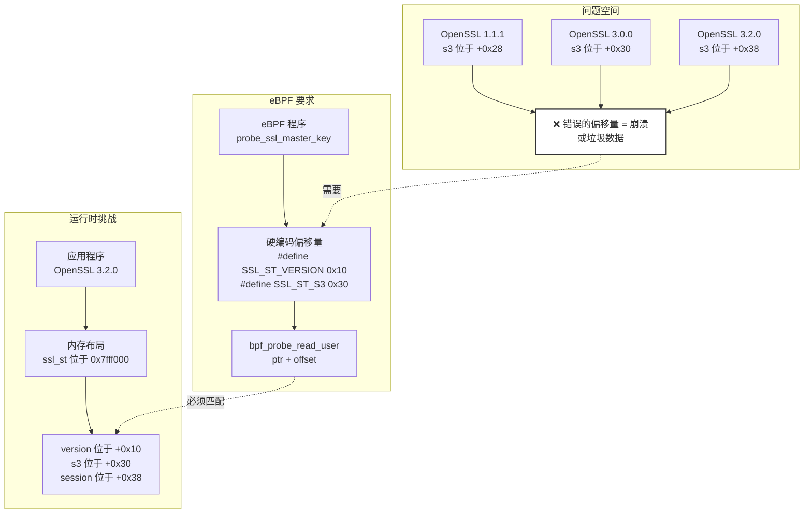
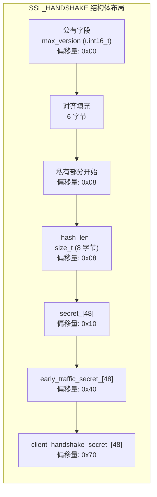
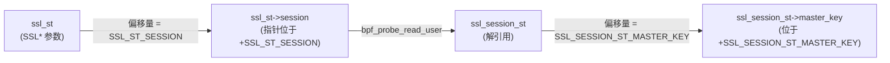
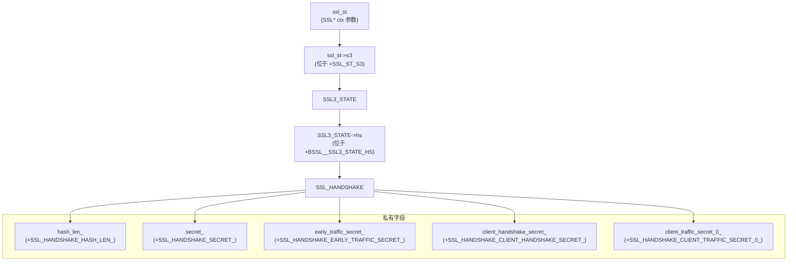
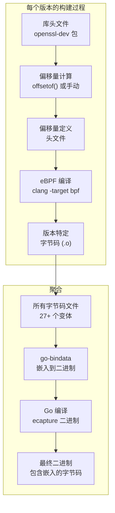

# 结构体偏移量计算

## 目的与范围

本文档解释了 eCapture 中用于计算 eBPF 程序访问 SSL/TLS 库结构体内存偏移量的技术。结构体偏移量计算是必要的,因为 eBPF 程序必须读取 OpenSSL 和 BoringSSL 的内部非公开结构体,而这些结构体在不同版本之间会发生变化。

关于通用的 eBPF 程序结构,请参见 [eBPF 程序结构](5.2.1-ebpf-program-structure.md)。关于添加新的捕获模块,请参见 [添加新模块](5.3-adding-new-modules.md)。关于使用这些偏移量的版本检测系统,请参见 [版本检测与字节码选择](../2-architecture/2.5-version-detection-and-bytecode-selection.md)。

---

## 偏移量问题

附加到 SSL/TLS 函数的 eBPF 程序需要从内部库结构体中提取加密密钥和会话数据。这些结构体不是公共 API 的一部分,它们的内存布局在不同版本之间会有所不同。这个挑战有三个维度:

**版本多样性**: eCapture 支持 OpenSSL 1.0.2 到 3.5.x 以及 BoringSSL Android 13-16,每个版本可能都有不同的结构体布局 [user/module/probe_openssl_lib.go:30-62](https://github.com/gojue/ecapture/blob/0766a93b/user/module/probe_openssl_lib.go#L30-L62)。

**公有与私有字段**: 某些关键字段在 C++ 中被标记为 `private`,使它们无法被标准偏移量计算工具访问 [kern/boringssl_const.h:11-27](https://github.com/gojue/ecapture/blob/0766a93b/kern/boringssl_const.h#L11-L27)。

**编译时要求**: eBPF 字节码必须在编译时嵌入偏移量值,因为在内核中无法进行运行时内省。



**图示: 偏移量不匹配问题**

来源: [kern/boringssl_masterkey.h:169-257](https://github.com/gojue/ecapture/blob/0766a93b/kern/boringssl_masterkey.h#L169-L257), [user/module/probe_openssl_lib.go:73-187](https://github.com/gojue/ecapture/blob/0766a93b/user/module/probe_openssl_lib.go#L73-L187)

---

## 偏移量计算技术

### 使用 offsetof() 与库头文件

计算偏移量的主要方法是使用 C 的 `offsetof()` 宏配合实际的库头文件。工具程序 [utils/boringssl-offset.c](https://github.com/gojue/ecapture/blob/0766a93b/utils/boringssl-offset.c) 演示了这种方法:

| 技术 | 描述 | 示例 |
|-----------|-------------|---------|
| **宏定义** | 定义要处理的结构体/字段对 | `X(ssl_st, version)` |
| **offsetof() 应用** | 标准 C 宏计算偏移量 | `offsetof(struct ssl_st, version)` |
| **代码生成** | 输出 C 预处理器定义 | `#define SSL_ST_VERSION 0x10` |

**关键实现**:

```c
#define SSL_STRUCT_OFFSETS                   \
    X(ssl_st, version)                       \
    X(ssl_st, session)                       \
    X(ssl_st, s3)                            \
    X(ssl_session_st, secret_length)         \
    X(ssl_session_st, secret)
```

`X` 宏模式使得能够遍历所有结构体/字段对 [utils/boringssl-offset.c:23-46](https://github.com/gojue/ecapture/blob/0766a93b/utils/boringssl-offset.c#L23-L46)。每对都被处理以生成偏移量定义:

```c
#define X(struct_name, field_name) \
    format(#struct_name, #field_name, offsetof(struct struct_name, field_name));
SSL_STRUCT_OFFSETS
#undef X
```

这种技术要求:
1. 在构建期间访问库头文件
2. 针对特定库版本进行编译
3. 为每个支持的版本单独编译

来源: [utils/boringssl-offset.c:1-78](https://github.com/gojue/ecapture/blob/0766a93b/utils/boringssl-offset.c#L1-L78)

---

### 私有字段的手动计算

BoringSSL 对 TLS 1.3 密钥使用 C++ 私有字段,使得它们无法被 `offsetof()` 访问。解决方案是基于内存布局分析进行手动偏移量计算:



**图示: BoringSSL SSL_HANDSHAKE 中的私有字段布局**

计算过程 [kern/boringssl_const.h:34-60](https://github.com/gojue/ecapture/blob/0766a93b/kern/boringssl_const.h#L34-L60):

| 步骤 | 计算 | 结果 | 注释 |
|------|-------------|--------|---------|
| 1. 找到最后的公有字段 | `BSSL__SSL_HANDSHAKE_MAX_VERSION` | 变化 | 来自 offsetof() |
| 2. 加上字段大小 | `+sizeof(uint16_t)` = `+2` | offset+2 | max_version 的大小 |
| 3. 应用对齐 | `roundup(offset+2, 8)` | 已对齐 | 8 字节边界 |
| 4. 第一个私有字段 | `+sizeof(size_t)` = `+8` | `hash_len_` 偏移量 | |
| 5. 后续字段 | `+SSL_MAX_MD_SIZE` | 顺序 | 每个密钥 48 字节 |

**偏移量公式**:
- `SSL_HANDSHAKE_HASH_LEN_ = roundup(BSSL__SSL_HANDSHAKE_MAX_VERSION+2, 8)`
- `SSL_HANDSHAKE_SECRET_ = SSL_HANDSHAKE_HASH_LEN_ + 8`
- `SSL_HANDSHAKE_EARLY_TRAFFIC_SECRET_ = SSL_HANDSHAKE_SECRET_ + 48*1`
- `SSL_HANDSHAKE_CLIENT_HANDSHAKE_SECRET_ = SSL_HANDSHAKE_SECRET_ + 48*2`

这种方法需要理解:
1. C++ 内存布局规则
2. 结构体对齐(在 x86_64 上通常是 8 字节)
3. 源代码中的成员声明顺序

来源: [kern/boringssl_const.h:1-63](https://github.com/gojue/ecapture/blob/0766a93b/kern/boringssl_const.h#L1-L63)

---

### 内存对齐考虑

结构体填充会影响偏移量计算。eBPF 程序必须考虑编译器插入的填充:

**对齐规则**:
- 标量类型对齐到其大小(uint16_t → 2 字节,uint64_t → 8 字节)
- 结构体对齐匹配最大成员
- 插入填充以维持对齐

**ssl3_state_st 的示例**:

```c
struct ssl3_state_st {
    u64 read_sequence;          // 偏移量: 0x00, 大小: 8
    u64 write_sequence;         // 偏移量: 0x08, 大小: 8
    unsigned char server_random[32];  // 偏移量: 0x10, 大小: 32
    unsigned char client_random[32];  // 偏移量: 0x30, 大小: 32
};
```

`client_random` 字段位于偏移量 `0x30`(48 字节),因为:
- `read_sequence`: 0 + 8 = 8
- `write_sequence`: 8 + 8 = 16 (0x10)
- `server_random`: 16 + 32 = 48 (0x30)

来源: [kern/boringssl_masterkey.h:59-65](https://github.com/gojue/ecapture/blob/0766a93b/kern/boringssl_masterkey.h#L59-L65)

---

## 版本特定的字节码策略

eCapture 通过为每个支持的库版本预编译单独的 eBPF 字节码来解决偏移量变化问题。构建系统生成多个字节码文件,每个文件都包含版本特定的偏移量。

### 字节码变体矩阵

```mermaid
graph TB
    subgraph "OpenSSL 变体"
        O102["openssl_1_0_2a_kern.o<br/>版本: 1.0.2a-u"]
        O110["openssl_1_1_0a_kern.o<br/>版本: 1.1.0a-l"]
        O111A["openssl_1_1_1a_kern.o<br/>版本: 1.1.1a"]
        O111B["openssl_1_1_1b_kern.o<br/>版本: 1.1.1b-c"]
        O111D["openssl_1_1_1d_kern.o<br/>版本: 1.1.1d-i"]
        O111J["openssl_1_1_1j_kern.o<br/>版本: 1.1.1j-w"]
        O300["openssl_3_0_0_kern.o<br/>版本: 3.0.0-11,13-17"]
        O3012["openssl_3_0_12_kern.o<br/>版本: 3.0.12"]
        O320["openssl_3_2_0_kern.o<br/>版本: 3.2.0-2"]
        O350["openssl_3_5_0_kern.o<br/>版本: 3.5.0-4"]
    end
    
    subgraph "BoringSSL 变体"
        BA13["boringssl_a_13_kern.o<br/>Android 13"]
        BA14["boringssl_a_14_kern.o<br/>Android 14"]
        BA15["boringssl_a_15_kern.o<br/>Android 15"]
        BA16["boringssl_a_16_kern.o<br/>Android 16"]
        BNA["boringssl_na_kern.o<br/>非 Android"]
    end
    
    subgraph "选择逻辑"
        DETECT["版本检测<br/>解析 .rodata 部分"]
        MAP["sslVersionBpfMap<br/>版本 → 字节码"]
        LOAD["加载适当的<br/>字节码"]
    end
    
    DETECT --> MAP
    MAP --> LOAD
    
    O102 -.-> LOAD
    O111J -.-> LOAD
    O300 -.-> LOAD
    BA13 -.-> LOAD
```



**图示: 字节码变体选择系统**

映射在 `initOpensslOffset()` 中定义 [user/module/probe_openssl_lib.go:73-187](https://github.com/gojue/ecapture/blob/0766a93b/user/module/probe_openssl_lib.go#L73-L187):

| 版本模式 | 字节码文件 | 偏移量来源 |
|-----------------|---------------|---------------|
| OpenSSL 1.0.2a-u (21 个版本) | `openssl_1_0_2a_kern.o` | 单一偏移量集 |
| OpenSSL 1.1.1a | `openssl_1_1_1a_kern.o` | 独特偏移量 |
| OpenSSL 1.1.1b-c | `openssl_1_1_1b_kern.o` | 共享偏移量 |
| OpenSSL 1.1.1d-i | `openssl_1_1_1d_kern.o` | 共享偏移量 |
| OpenSSL 1.1.1j-w | `openssl_1_1_1j_kern.o` | 共享偏移量 |
| OpenSSL 3.0.12 | `openssl_3_0_12_kern.o` | 特殊情况 |
| OpenSSL 3.0.x (其他) | `openssl_3_0_0_kern.o` | 共享偏移量 |

来源: [user/module/probe_openssl_lib.go:73-187](https://github.com/gojue/ecapture/blob/0766a93b/user/module/probe_openssl_lib.go#L73-L187), [variables.mk:189-228](https://github.com/gojue/ecapture/blob/0766a93b/variables.mk#L189-L228)

---

## 实际示例

### 示例 1: 读取 TLS 1.2 主密钥 (OpenSSL)

eBPF 程序必须导航多个指针间接引用才能读取主密钥:

**导航路径**: `ssl_st` → `ssl_st->session` → `ssl_session_st->master_key`



**图示: TLS 1.2 主密钥访问路径**

**代码实现** [kern/openssl_masterkey.h:140-165](https://github.com/gojue/ecapture/blob/0766a93b/kern/openssl_masterkey.h#L140-L165):

```c
// 步骤 1: 从 ssl_st 获取 ssl_session_st 指针
u64 *ssl_session_st_ptr = (u64 *)(ssl_st_ptr + SSL_ST_SESSION);
u64 ssl_session_st_addr;
ret = bpf_probe_read_user(&ssl_session_st_addr, sizeof(ssl_session_st_addr), 
                          ssl_session_st_ptr);

// 步骤 2: 从 ssl_session_st 读取 master_key
void *ms_ptr = (void *)(ssl_session_st_addr + SSL_SESSION_ST_MASTER_KEY);
ret = bpf_probe_read_user(&mastersecret->master_key, 
                          sizeof(mastersecret->master_key), ms_ptr);
```

**偏移量依赖**:
- `SSL_ST_SESSION`: 因 OpenSSL 版本而异(3.0+ 通常为 0x38)
- `SSL_SESSION_ST_MASTER_KEY`: 因版本而异(通常为 0x50-0x60)

来源: [kern/openssl_masterkey.h:140-168](https://github.com/gojue/ecapture/blob/0766a93b/kern/openssl_masterkey.h#L140-L168)

---

### 示例 2: 读取 TLS 1.3 密钥 (BoringSSL)

BoringSSL 中的 TLS 1.3 密钥需要通过握手结构访问私有字段:

**导航路径**: `ssl_st` → `ssl_st->s3` → `SSL3_STATE->hs` → `SSL_HANDSHAKE-><私有字段>`



**图示: BoringSSL 中的 TLS 1.3 密钥访问**

**代码实现** [kern/boringssl_masterkey.h:235-382](https://github.com/gojue/ecapture/blob/0766a93b/kern/boringssl_masterkey.h#L235-L382):

```c
// 步骤 1: 获取 s3 指针
u64 *ssl_s3_st_ptr = (u64 *)(ssl_st_ptr + SSL_ST_S3);
ret = bpf_probe_read_user(&s3_address, sizeof(s3_address), ssl_s3_st_ptr);

// 步骤 2: 获取握手结构指针
u64 *ssl_hs_st_ptr = (u64 *)(s3_address + BSSL__SSL3_STATE_HS);
ret = bpf_probe_read_user(&ssl_hs_st_addr, sizeof(ssl_hs_st_addr), ssl_hs_st_ptr);

// 步骤 3: 读取哈希长度
u64 *ssl_hs_hashlen_ptr = (u64 *)(ssl_hs_st_addr + SSL_HANDSHAKE_HASH_LEN_);
ret = bpf_probe_read_user(&hash_len, sizeof(hash_len), ssl_hs_hashlen_ptr);

// 步骤 4: 读取 TLS 1.3 密钥(使用为私有字段计算的偏移量)
void *cats_ptr_tls13 = (void *)(ssl_hs_st_addr + SSL_HANDSHAKE_CLIENT_TRAFFIC_SECRET_0_);
ret = bpf_probe_read_user(&mastersecret->client_traffic_secret_0_, 
                          sizeof(mastersecret->client_traffic_secret_0_),
                          cats_ptr_tls13);
```

**关键偏移量**:
- `SSL_HANDSHAKE_CLIENT_TRAFFIC_SECRET_0_ = SSL_HANDSHAKE_SECRET_ + 48*4`
- 每个 TLS 1.3 密钥为 48 字节(`SSL_MAX_MD_SIZE`)
- 顺序布局使得能够进行算术偏移量计算

来源: [kern/boringssl_masterkey.h:235-402](https://github.com/gojue/ecapture/blob/0766a93b/kern/boringssl_masterkey.h#L235-L402), [kern/boringssl_const.h:34-60](https://github.com/gojue/ecapture/blob/0766a93b/kern/boringssl_const.h#L34-L60)

---

### 示例 3: 版本特定的偏移量差异

OpenSSL 3.0.12 是一个特殊情况,其结构体偏移量与其他 3.0.x 版本不同:

**构建系统逻辑** [user/module/probe_openssl_lib.go:128-130](https://github.com/gojue/ecapture/blob/0766a93b/user/module/probe_openssl_lib.go#L128-L130):

```go
// OpenSSL 3.0.0-3.0.11 和 3.0.13-3.0.17 使用相同的字节码
for ch := 0; ch <= MaxSupportedOpenSSL30Version; ch++ {
    m.sslVersionBpfMap[fmt.Sprintf("openssl 3.0.%d", ch)] = "openssl_3_0_0_kern.o"
}

// OpenSSL 3.0.12 需要特殊的字节码
m.sslVersionBpfMap["openssl 3.0.12"] = "openssl_3_0_12_kern.o"
```

**原因**: 3.0.12 中的内部结构重组改变了字段偏移量,需要单独的偏移量计算和字节码编译。

**检测与选择流程**:

| 步骤 | 函数 | 操作 |
|------|----------|--------|
| 1 | `detectOpenssl()` | 解析 `.rodata` 部分获取版本字符串 |
| 2 | 版本规范化 | 转换 "OpenSSL 3.0.12" → "openssl 3.0.12" |
| 3 | 映射查找 | 检查 `sslVersionBpfMap["openssl 3.0.12"]` |
| 4 | 字节码选择 | 返回 `"openssl_3_0_12_kern.o"` |

来源: [user/module/probe_openssl_lib.go:128-136](https://github.com/gojue/ecapture/blob/0766a93b/user/module/probe_openssl_lib.go#L128-L136), [variables.mk:202](https://github.com/gojue/ecapture/blob/0766a93b/variables.mk#L202)

---

## 工具与实用程序

### 偏移量计算器工具

`boringssl-offset.c` 工具为特定 BoringSSL 版本生成偏移量定义:

**编译与使用**:
```bash
# 针对 BoringSSL 头文件编译
g++ -I include/ -I src/ utils/boringssl-offset.c -o offset-calc

# 运行以生成偏移量定义
./offset-calc > generated_offsets.h
```

**输出格式** [utils/boringssl-offset.c:60-67](https://github.com/gojue/ecapture/blob/0766a93b/utils/boringssl-offset.c#L60-L67):
```c
// ssl_st->version
#define SSL_ST_VERSION 0x10

// ssl_st->session
#define SSL_ST_SESSION 0x38

// bssl::SSL3_STATE->hs
#define BSSL__SSL3_STATE_HS 0x50
```

**支持的结构体**:
- `ssl_st`: 主 SSL 上下文结构体
- `ssl_session_st`: 会话状态,包括主密钥
- `ssl_cipher_st`: 密码套件信息
- `bssl::SSL3_STATE`: SSL 3.0/TLS 状态
- `bssl::SSL_HANDSHAKE`: 握手状态和密钥

来源: [utils/boringssl-offset.c:1-78](https://github.com/gojue/ecapture/blob/0766a93b/utils/boringssl-offset.c#L1-L78)

---

### 构建系统集成

Makefile 为所有版本编排偏移量生成和字节码编译:



**图示: 偏移量感知字节码的构建系统流程**

**目标定义** [variables.mk:190-228](https://github.com/gojue/ecapture/blob/0766a93b/variables.mk#L190-L228):
- 27+ 个 TARGETS 条目,每个代表一个库版本
- 每个目标编译为 `<name>_kern.o`
- CO-RE 和 non-CO-RE 模式分别编译
- Android 变体排除 shell/数据库模块

**支持偏移量的编译标志**:
- `-D__TARGET_ARCH_x86` 或 `-D__TARGET_ARCH_arm64`: 特定架构
- `-I ./kern/bpf/$(LINUX_ARCH)`: 包含架构头文件
- 通过 `#include` 指令包含版本特定的偏移量头文件

来源: [variables.mk:189-228](https://github.com/gojue/ecapture/blob/0766a93b/variables.mk#L189-L228), [Makefile (引用)]()

---

## 版本检测与降级策略

当精确版本的字节码不可用时,eCapture 实现了回退策略:

### 降级算法

**逻辑** [user/module/probe_openssl_lib.go:341-369](https://github.com/gojue/ecapture/blob/0766a93b/user/module/probe_openssl_lib.go#L341-L369):

1. **渐进式前缀匹配**: 迭代缩短版本字符串
   - "openssl 3.2.7" → 尝试 "openssl 3.2",然后 "openssl 3",等等

2. **版本比较**: 选择 ≤ 检测到的版本的最高兼容版本
   - 如果检测到版本 3.2.7 但只有 3.2.0 可用,则使用 3.2.0

3. **库路径启发式**: 基于库文件名的回退
   - `libssl.so.3` → 使用 OpenSSL 3.0 默认值
   - 其他 → 使用 OpenSSL 1.1.1 默认值

**实现**:

```go
func (m *MOpenSSLProbe) downgradeOpensslVersion(ver string, soPath string) (string, bool) {
    var candidates []string
    for i := len(ver) - 1; i > 0; i-- {
        prefix := ver[:i]
        for libKey := range m.sslVersionBpfMap {
            if strings.HasPrefix(libKey, prefix) && isVersionLessOrEqual(libKey, ver) {
                candidates = append(candidates, libKey)
            }
        }
        if len(candidates) > 0 {
            sort.Strings(candidates)
            return m.sslVersionBpfMap[candidates[len(candidates)-1]], true
        }
    }
    // 基于 soPath 的回退逻辑
}
```

**版本比较**: 自定义比较处理数字和字母后缀(例如,"1.1.1w") [user/module/probe_openssl_lib.go:371-448](https://github.com/gojue/ecapture/blob/0766a93b/user/module/probe_openssl_lib.go#L371-L448)。

来源: [user/module/probe_openssl_lib.go:341-448](https://github.com/gojue/ecapture/blob/0766a93b/user/module/probe_openssl_lib.go#L341-L448)

---

## 偏移量维护的最佳实践

### 添加新库版本时

1. **获取源代码**: 下载精确版本的源代码
2. **生成偏移量**: 使用偏移量计算器工具或手动分析
3. **创建头文件**: 生成版本特定的偏移量定义
4. **编译字节码**: 使用新偏移量构建 eBPF 程序
5. **更新映射**: 向 `sslVersionBpfMap` 添加条目
6. **更新构建系统**: 向 `variables.mk` 添加目标
7. **测试**: 使用该版本的实际应用程序进行验证

### 常见陷阱

| 问题 | 原因 | 解决方案 |
|-------|-------|----------|
| **不正确的对齐** | 遗漏编译器填充 | 使用 `pahole` 工具检查实际布局 |
| **私有字段访问** | C++ 访问控制 | 从公有字段手动计算 |
| **指针追踪错误** | 错误的解引用顺序 | 绘制结构体导航图 |
| **版本检测失败** | 缺少版本字符串 | 向检测正则表达式添加版本 |

### 调试偏移量问题

**eBPF 调试打印** [kern/boringssl_masterkey.h:273-275](https://github.com/gojue/ecapture/blob/0766a93b/kern/boringssl_masterkey.h#L273-L275):
```c
debug_bpf_printk("client_version:%d, state:%d, tls13_state:%d\n", 
                 client_version, ssl3_hs_state.state, ssl3_hs_state.tls13_state);
```

**验证步骤**:
1. 启用调试打印(`DEBUG=1` 构建标志)
2. 检查 `bpf_probe_read_user()` 返回值
3. 验证指针地址非零
4. 将提取的值与已知的良好数据进行比较
5. 使用 GDB 检查目标进程中的实际结构体布局

来源: [kern/boringssl_masterkey.h:169-402](https://github.com/gojue/ecapture/blob/0766a93b/kern/boringssl_masterkey.h#L169-L402), [kern/openssl_masterkey.h:80-257](https://github.com/gojue/ecapture/blob/0766a93b/kern/openssl_masterkey.h#L80-L257)