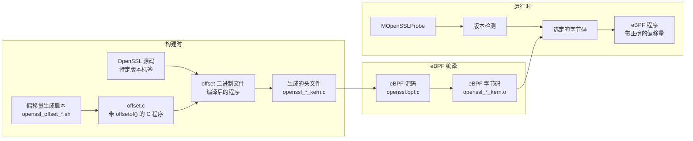
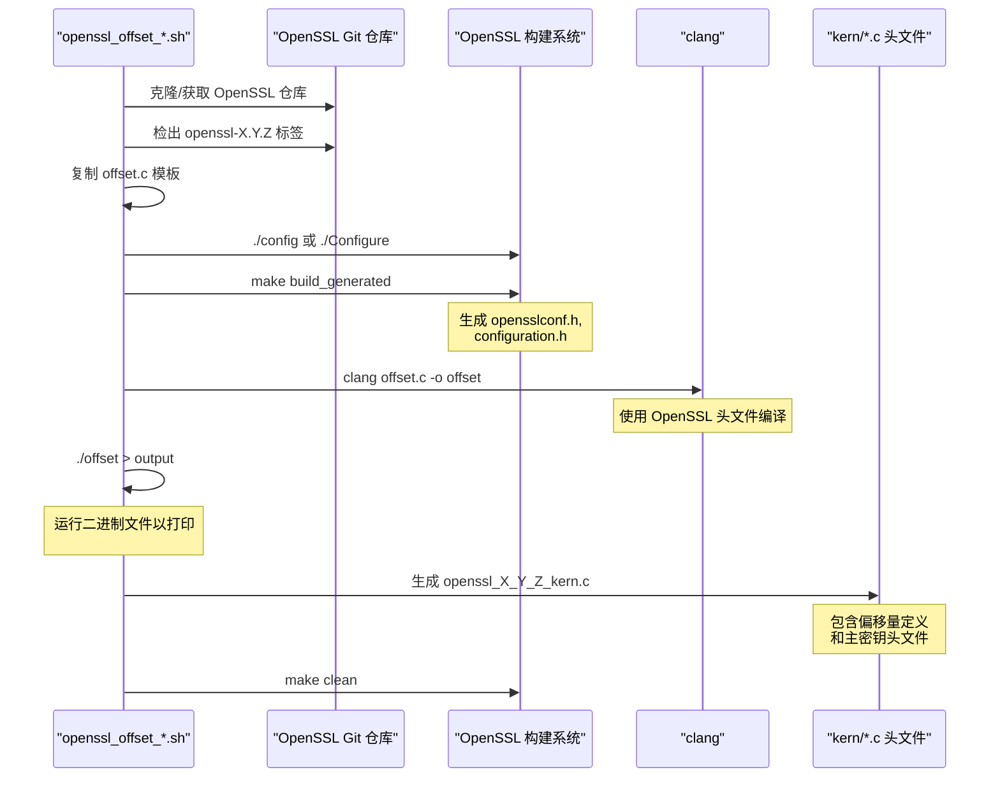
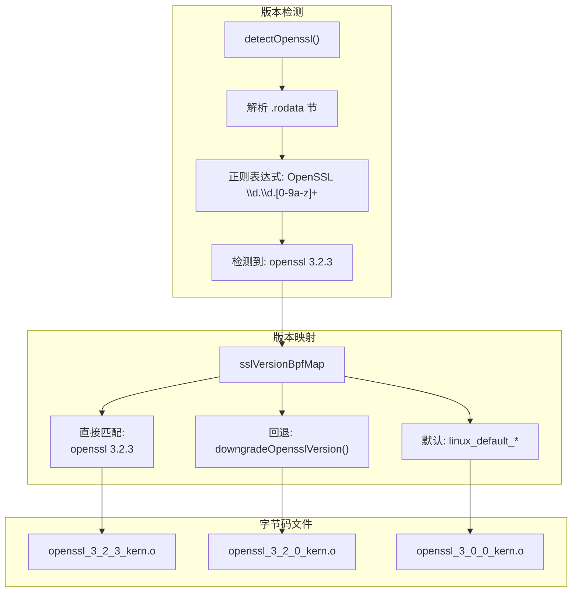
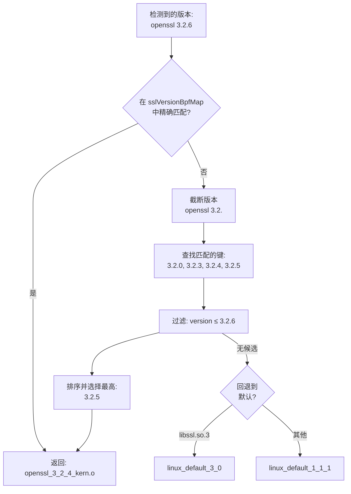
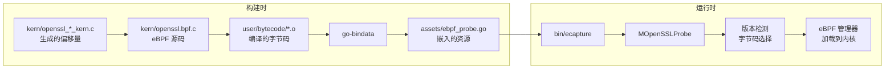

# 结构体偏移量计算

## 目的与范围

本文档说明 eCapture 如何为 SSL/TLS 库（OpenSSL、BoringSSL）生成结构体偏移量定义，以使 eBPF 程序能够访问内部数据结构。结构体偏移量是编译时的值，用于指定 C 结构体中字段的字节位置，这些位置会因库版本的内部 API 变化而有所不同。

关于 eBPF 程序结构和辅助函数的信息，请参见 [eBPF 程序结构](5.2.1-ebpf-program-structure.md)。关于创建新捕获模块的指南，请参见 [添加新模块](5.3-adding-new-modules.md)。

**来源：** [user/module/probe_openssl_lib.go:1-449](https://github.com/gojue/ecapture/blob/ca085d05/user/module/probe_openssl_lib.go#L1-L449)

## 为什么需要结构体偏移量

eBPF 程序在内核空间中运行，无法在运行时直接调用库函数或访问 C 结构体定义。在捕获 TLS 流量时，eCapture 必须从用户空间内存读取内部 SSL 结构体（例如 `SSL`、`SSL_CTX`、`SSL_SESSION`）。这些结构体是不透明的指针，其内部布局会在库版本之间发生变化。

偏移量生成过程通过以下方式解决这个问题：
1. **在构建时提取实际字段位置**，从特定库版本中获取
2. **生成 C 头文件**，为每个字段偏移量提供 `#define` 宏
3. **将这些定义嵌入**到 eBPF 字节码编译过程中
4. **使 `bpf_probe_read_user()` 能够**访问正确的内存位置

如果没有准确的偏移量，eBPF 程序将读取错误的内存地址，导致数据捕获损坏或内核验证器拒绝。


```mermaid
graph LR
    subgraph "构建时"
        SCRIPT["偏移量生成脚本<br/>openssl_offset_*.sh"]
        OFFSET_C["offset.c<br/>带 offsetof() 的 C 程序"]
        SSL_SRC["OpenSSL 源码<br/>特定版本标签"]
        OFFSET_BIN["offset 二进制文件<br/>编译后的程序"]
        HEADER["生成的头文件<br/>openssl_*_kern.c"]
    end
    
    subgraph "eBPF 编译"
        EBPF_SRC["eBPF 源码<br/>openssl.bpf.c"]
        EBPF_OBJ["eBPF 字节码<br/>openssl_*_kern.o"]
    end
    
    subgraph "运行时"
        PROBE["MOpenSSLProbe"]
        DETECT["版本检测"]
        BYTECODE["选定的字节码"]
        KERNEL["eBPF 程序<br/>带正确的偏移量"]
    end
    
    SCRIPT --> OFFSET_C
    SSL_SRC --> OFFSET_BIN
    OFFSET_C --> OFFSET_BIN
    OFFSET_BIN --> HEADER
    HEADER --> EBPF_SRC
    EBPF_SRC --> EBPF_OBJ
    
    PROBE --> DETECT
    DETECT --> BYTECODE
    EBPF_OBJ --> BYTECODE
    BYTECODE --> KERNEL
```

**来源：** [user/module/probe_openssl_lib.go:189-282](https://github.com/gojue/ecapture/blob/ca085d05/user/module/probe_openssl_lib.go#L189-L282), [utils/openssl_offset_3.0.sh:1-95](https://github.com/gojue/ecapture/blob/ca085d05/utils/openssl_offset_3.0.sh#L1-L95)

## 偏移量生成流程

### 脚本工作流程

每个偏移量生成脚本都遵循标准化的工作流程，从特定的 OpenSSL 版本系列中提取结构体偏移量。这个过程是自动化的，可重复的，以确保构建的一致性。


```mermaid
sequenceDiagram
    participant Script as "openssl_offset_*.sh"
    participant Git as "OpenSSL Git 仓库"
    participant Build as "OpenSSL 构建系统"
    participant Compiler as "clang"
    participant Output as "kern/*.c 头文件"
    
    Script->>Git: 克隆/获取 OpenSSL 仓库
    Script->>Git: 检出 openssl-X.Y.Z 标签
    Script->>Script: 复制 offset.c 模板
    Script->>Build: ./config 或 ./Configure
    Script->>Build: make build_generated
    Note over Build: 生成 opensslconf.h,<br/>configuration.h
    Script->>Compiler: clang offset.c -o offset
    Note over Compiler: 使用 OpenSSL 头文件编译
    Script->>Script: ./offset > output
    Note over Script: 运行二进制文件以打印<br/>#define 语句
    Script->>Output: 生成 openssl_X_Y_Z_kern.c
    Note over Output: 包含偏移量定义<br/>和主密钥头文件
    Script->>Build: make clean
```

**来源：** [utils/openssl_offset_3.0.sh:24-88](https://github.com/gojue/ecapture/blob/ca085d05/utils/openssl_offset_3.0.sh#L24-L88), [utils/openssl_offset_3.2.sh:24-75](https://github.com/gojue/ecapture/blob/ca085d05/utils/openssl_offset_3.2.sh#L24-L75)

### 偏移量提取实现

`offset.c` 文件（例如 `openssl_3_0_offset.c`、`openssl_3_2_0_offset.c`）使用 C 语言的 `offsetof()` 宏来计算结构体字段的字节偏移量。当针对特定的 OpenSSL 版本编译时，生成的二进制文件会打印带有实际数值偏移量的 `#define` 语句。

**提取的关键结构体字段：**

| 结构体 | 字段 | 用途 |
|--------|------|------|
| `SSL` | `version`, `wbio`, `rbio`, `session` | TLS 版本、I/O 通道、会话数据 |
| `SSL_CONNECTION` | `version`, `wbio`, `rbio` | OpenSSL 3.x 连接对象 |
| `SSL_SESSION` | `master_key`, `master_key_length`, `cipher` | 用于解密的会话密钥 |
| `SSL_CTX` | `keylog_callback` | 密钥日志回调指针 |
| `BIO` | `num` | 文件描述符编号 |

在 `openssl_3_0_0_kern.c` 中生成的输出示例：

```c
#define SSL_ST_VERSION 0
#define SSL_ST_WBIO 8
#define SSL_ST_RBIO 16
#define SSL_SESSION_ST_MASTER_KEY 32
```

**来源：** [utils/openssl_offset_3.0.sh:63-80](https://github.com/gojue/ecapture/blob/ca085d05/utils/openssl_offset_3.0.sh#L63-L80), [utils/openssl_offset_3.2.sh:51-67](https://github.com/gojue/ecapture/blob/ca085d05/utils/openssl_offset_3.2.sh#L51-L67)

### 特定版本的脚本

eCapture 为不同的 OpenSSL 主要.次要版本系列维护独立的偏移量生成脚本：

| 脚本 | 覆盖的版本 | 偏移量模板 | 备注 |
|------|-----------|-----------|------|
| `openssl_offset_3.0.sh` | 3.0.0 - 3.0.17 | `openssl_3_0_offset.c` | 版本 3.0.12 有独特的偏移量 |
| `openssl_offset_3.1.sh` | 3.1.0 - 3.1.8 | `openssl_3_0_offset.c` | 与 3.0.x 偏移量相同 |
| `openssl_offset_3.2.sh` | 3.2.0 - 3.2.5 | `openssl_3_2_0_offset.c` | 引入 `SSL_CONNECTION` |
| `openssl_offset_3.3.sh` | 3.3.0 - 3.3.4 | `openssl_3_2_0_offset.c` | 与 3.2.x 偏移量相同 |
| `openssl_offset_3.4.sh` | 3.4.0 - 3.4.2 | `openssl_3_2_0_offset.c` | 与 3.2.x 偏移量相同 |
| `openssl_offset_3.5.sh` | 3.5.0 - 3.5.4 | `openssl_3_5_0_offset.c` | 最新支持的版本 |

每个脚本定义一个版本映射（`sslVerMap`），将共享相同偏移量的补丁版本分组。例如，在 [utils/openssl_offset_3.0.sh:27-45](https://github.com/gojue/ecapture/blob/ca085d05/utils/openssl_offset_3.0.sh#L27-L45) 中：

```bash
declare -A sslVerMap=()
sslVerMap["0"]="0"   # 3.0.0 使用 openssl_3_0_0_kern.c
sslVerMap["1"]="0"   # 3.0.1 使用 openssl_3_0_0_kern.c
# ...
sslVerMap["12"]="12" # 3.0.12 有独特的偏移量
sslVerMap["13"]="0"  # 3.0.13+ 回到 3.0.0 偏移量
```

**来源：** [utils/openssl_offset_3.0.sh:27-45](https://github.com/gojue/ecapture/blob/ca085d05/utils/openssl_offset_3.0.sh#L27-L45), [utils/openssl_offset_3.2.sh:27-33](https://github.com/gojue/ecapture/blob/ca085d05/utils/openssl_offset_3.2.sh#L27-L33), [utils/openssl_offset_3.5.sh:27-33](https://github.com/gojue/ecapture/blob/ca085d05/utils/openssl_offset_3.5.sh#L27-L33)

## 版本分组与映射

### 运行时版本到字节码映射

`MOpenSSLProbe` 模块维护一个综合映射（`sslVersionBpfMap`），将检测到的库版本与预编译的 eBPF 字节码文件关联起来。该映射在 `initOpensslOffset()` 中初始化。


```mermaid
graph TB
    subgraph "版本检测"
        DETECT["detectOpenssl()"]
        ELF["解析 .rodata 节"]
        REGEX["正则表达式: OpenSSL \\d.\\d.[0-9a-z]+"]
        VERSION["检测到: openssl 3.2.3"]
    end
    
    subgraph "版本映射"
        MAP["sslVersionBpfMap"]
        DIRECT["直接匹配:<br/>openssl 3.2.3"]
        DOWNGRADE["回退: downgradeOpensslVersion()"]
        DEFAULT["默认: linux_default_*"]
    end
    
    subgraph "字节码文件"
        BPF_323["openssl_3_2_3_kern.o"]
        BPF_320["openssl_3_2_0_kern.o"]
        BPF_DEFAULT["openssl_3_0_0_kern.o"]
    end
    
    DETECT --> ELF
    ELF --> REGEX
    REGEX --> VERSION
    
    VERSION --> MAP
    MAP --> DIRECT
    MAP --> DOWNGRADE
    MAP --> DEFAULT
    
    DIRECT --> BPF_323
    DOWNGRADE --> BPF_320
    DEFAULT --> BPF_DEFAULT
```

**来源：** [user/module/probe_openssl_lib.go:73-187](https://github.com/gojue/ecapture/blob/ca085d05/user/module/probe_openssl_lib.go#L73-L187), [user/module/probe_openssl_lib.go:189-282](https://github.com/gojue/ecapture/blob/ca085d05/user/module/probe_openssl_lib.go#L189-L282)

### 版本分组策略

当多个 OpenSSL 版本的内部结构布局相同时，它们会共享字节码文件。这减少了字节码的重复，简化了维护。

**OpenSSL 1.1.1 分组** ([user/module/probe_openssl_lib.go:105-121](https://github.com/gojue/ecapture/blob/ca085d05/user/module/probe_openssl_lib.go#L105-L121))：

| 组 | 版本 | 字节码文件 | 原因 |
|----|------|-----------|------|
| A | 1.1.1a | `openssl_1_1_1a_kern.o` | 首个 1.1.1 版本 |
| B | 1.1.1b-c | `openssl_1_1_1b_kern.o` | 轻微结构变化 |
| C | 1.1.1d-i | `openssl_1_1_1d_kern.o` | 稳定的结构布局 |
| D | 1.1.1j-w | `openssl_1_1_1j_kern.o` | 最新 1.1.1 系列 |

**OpenSSL 3.x 分组** ([user/module/probe_openssl_lib.go:124-176](https://github.com/gojue/ecapture/blob/ca085d05/user/module/probe_openssl_lib.go#L124-L176))：

```
3.0.0 - 3.0.11  →  openssl_3_0_0_kern.o
3.0.12          →  openssl_3_0_12_kern.o  (异常：独特的偏移量)
3.0.13 - 3.0.17 →  openssl_3_0_0_kern.o
3.1.0 - 3.1.8   →  openssl_3_1_0_kern.o  (与 3.0.x 共享结构)
3.2.0 - 3.2.2   →  openssl_3_2_0_kern.o
3.2.3           →  openssl_3_2_3_kern.o
3.2.4 - 3.2.5   →  openssl_3_2_4_kern.o
3.3.0 - 3.3.1   →  openssl_3_3_0_kern.o
3.3.2           →  openssl_3_3_2_kern.o
3.3.3 - 3.3.4   →  openssl_3_3_3_kern.o
3.4.0           →  openssl_3_4_0_kern.o
3.4.1 - 3.4.2   →  openssl_3_4_1_kern.o
3.5.0 - 3.5.4   →  openssl_3_5_0_kern.o
```

**BoringSSL Android 版本** ([user/module/probe_openssl_lib.go:92-97](https://github.com/gojue/ecapture/blob/ca085d05/user/module/probe_openssl_lib.go#L92-L97))：

```
boringssl_a_13  →  boringssl_a_13_kern.o  (Android 13)
boringssl_a_14  →  boringssl_a_14_kern.o  (Android 14)
boringssl_a_15  →  boringssl_a_15_kern.o  (Android 15)
boringssl_a_16  →  boringssl_a_16_kern.o  (Android 16)
```

**来源：** [user/module/probe_openssl_lib.go:73-187](https://github.com/gojue/ecapture/blob/ca085d05/user/module/probe_openssl_lib.go#L73-L187)

### 版本降级机制

当在 `sslVersionBpfMap` 中找不到精确的版本匹配时，`downgradeOpensslVersion()` 函数实现一个回退策略，以找到最接近的兼容旧版本。

**算法** ([user/module/probe_openssl_lib.go:341-369](https://github.com/gojue/ecapture/blob/ca085d05/user/module/probe_openssl_lib.go#L341-L369))：

1. **前缀匹配**：从右到左迭代截断版本字符串
2. **候选过滤**：查找所有匹配前缀且 `version <= detected_version` 的版本
3. **选择**：选择最高兼容版本（按字典序排序）
4. **默认回退**：如果没有匹配，根据库文件名使用 `linux_default_3_0` 或 `linux_default_1_1_1`

示例：如果检测到 `openssl 3.2.6` 但不在映射中：
- 第 1 次迭代：搜索 `openssl 3.2.` → 找到 `3.2.0`、`3.2.3`、`3.2.4`、`3.2.5`
- 选择最高：`3.2.5` → 使用 `openssl_3_2_4_kern.o`


```mermaid
graph TD
    START["检测到的版本:<br/>openssl 3.2.6"]
    EXACT{"在 sslVersionBpfMap<br/>中精确匹配?"}
    PREFIX["截断版本<br/>openssl 3.2."]
    SEARCH["查找匹配的键:<br/>3.2.0, 3.2.3, 3.2.4, 3.2.5"]
    FILTER["过滤: version ≤ 3.2.6"]
    SORT["排序并选择最高:<br/>3.2.5"]
    BYTECODE["返回: openssl_3_2_4_kern.o"]
    DEFAULT{"回退到<br/>默认?"}
    DEFAULT_30["linux_default_3_0"]
    DEFAULT_111["linux_default_1_1_1"]
    
    START --> EXACT
    EXACT -->|是| BYTECODE
    EXACT -->|否| PREFIX
    PREFIX --> SEARCH
    SEARCH --> FILTER
    FILTER --> SORT
    SORT --> BYTECODE
    FILTER -->|无候选| DEFAULT
    DEFAULT -->|libssl.so.3| DEFAULT_30
    DEFAULT -->|其他| DEFAULT_111
```

**来源：** [user/module/probe_openssl_lib.go:341-369](https://github.com/gojue/ecapture/blob/ca085d05/user/module/probe_openssl_lib.go#L341-L369), [user/module/probe_openssl_lib.go:371-422](https://github.com/gojue/ecapture/blob/ca085d05/user/module/probe_openssl_lib.go#L371-L422)

## 支持新的库版本

### 添加新的 OpenSSL 版本

要支持新的 OpenSSL 版本（例如 `3.6.0`），开发人员必须确定现有偏移量是否兼容，或是否需要新的偏移量生成。

**步骤 1：创建偏移量生成脚本**

如果版本系列是新的，创建一个脚本，模仿现有脚本：

```bash
# 创建 utils/openssl_offset_3.6.sh
cp utils/openssl_offset_3.5.sh utils/openssl_offset_3.6.sh
```

**步骤 2：更新版本映射**

修改 `sslVerMap` 数组以包含新的补丁版本：

```bash
declare -A sslVerMap=()
sslVerMap["0"]="0"  # 3.6.0
sslVerMap["1"]="1"  # 3.6.1（如果偏移量不同）
# ... 随着发布添加更多版本
```

**步骤 3：运行偏移量生成**

从项目根目录执行脚本：

```bash
./utils/openssl_offset_3.6.sh
```

这会生成类似 `kern/openssl_3_6_0_kern.c` 的文件，其中包含偏移量定义。

**步骤 4：更新代码中的版本映射**

在 [user/module/probe_openssl_lib.go:73-187](https://github.com/gojue/ecapture/blob/ca085d05/user/module/probe_openssl_lib.go#L73-L187) 中修改 `initOpensslOffset()`：

```go
// 添加新的版本范围
for ch := 0; ch <= MaxSupportedOpenSSL36Version; ch++ {
    m.sslVersionBpfMap[fmt.Sprintf("openssl 3.6.%d", ch)] = "openssl_3_6_0_kern.o"
}
```

更新文件顶部的版本常量：

```go
const (
    MaxSupportedOpenSSL36Version = 5  // openssl 3.6.5
)
```

**步骤 5：验证 eBPF 编译**

确保生成的头文件能够正确编译：

```bash
make clean
make ebpf
# 验证 user/bytecode/openssl_3_6_0_kern_core.o 已创建
```

**步骤 6：测试版本检测**

使用新 OpenSSL 版本的系统测试模块，以验证：
- 正确的版本字符串检测
- 正确的字节码选择
- 成功的数据捕获

**来源：** [utils/openssl_offset_3.5.sh:1-81](https://github.com/gojue/ecapture/blob/ca085d05/utils/openssl_offset_3.5.sh#L1-L81), [user/module/probe_openssl_lib.go:73-187](https://github.com/gojue/ecapture/blob/ca085d05/user/module/probe_openssl_lib.go#L73-L187)

### 处理特殊情况

#### OpenSSL 3.0.12 异常

OpenSSL 3.0.12 虽然在 3.0.x 系列中，但有独特的结构体偏移量。这需要在版本映射中特殊处理 ([user/module/probe_openssl_lib.go:128-130](https://github.com/gojue/ecapture/blob/ca085d05/user/module/probe_openssl_lib.go#L128-L130))：

```go
// 3.0.0-3.0.11 和 3.0.13-3.0.17 使用 openssl_3_0_0_kern.o
m.sslVersionBpfMap[fmt.Sprintf("openssl 3.0.%d", SupportedOpenSSL30Version12)] = "openssl_3_0_12_kern.o"
```

在生成脚本中 ([utils/openssl_offset_3.0.sh:40](https://github.com/gojue/ecapture/blob/ca085d05/utils/openssl_offset_3.0.sh#L40))：

```bash
sslVerMap["12"]="12"  # 3.0.12 是不同的
```

#### BoringSSL 非 Android 版本

BoringSSL 对 Android 和非 Android 系统有独立的构建。非 Android 版本使用特殊标识符：

```go
// git repo: https://github.com/google/boringssl
"boringssl na": "boringssl_na_kern.o",
```

开发人员必须创建相应的偏移量脚本（例如 `boringssl_offset_na.sh`），遵循相同的模式，但使用 BoringSSL 仓库。

**来源：** [user/module/probe_openssl_lib.go:99-103](https://github.com/gojue/ecapture/blob/ca085d05/user/module/probe_openssl_lib.go#L99-L103), [utils/openssl_offset_3.0.sh:40](https://github.com/gojue/ecapture/blob/ca085d05/utils/openssl_offset_3.0.sh#L40)

### 偏移量验证

生成新偏移量后，通过以下方式验证正确性：

1. **编译时检查**：eBPF 验证器会拒绝无效的内存访问
2. **运行时测试**：捕获实际的 TLS 流量并验证数据完整性
3. **跨版本测试**：使用同一系列中的多个补丁版本进行测试
4. **比较**：将生成的偏移量与之前的版本进行比较，以识别变化

如果偏移量不正确，症状包括：
- eBPF 程序加载期间的内核验证器错误
- 捕获的数据损坏（错误的字节、空值）
- 主密钥提取不正确
- 目标进程中的分段错误

**来源：** [user/module/probe_openssl_lib.go:189-282](https://github.com/gojue/ecapture/blob/ca085d05/user/module/probe_openssl_lib.go#L189-L282)

## 与构建系统的集成

### Makefile 集成

偏移量生成脚本在开发期间手动调用，但不会在正常构建期间自动运行。生成的头文件提交到仓库的 `kern/` 目录中。

**构建过程** ([Makefile:117-127](https://github.com/gojue/ecapture/blob/ca085d05/Makefile#L117-L127))：

```makefile
$(KERN_OBJECTS): %.o: %.c \
    | .checkver_$(CMD_CLANG) \
    .checkver_$(CMD_GO) \
    autogen
    $(CMD_CLANG) -D__TARGET_ARCH_$(LINUX_ARCH) \
        $(EXTRA_CFLAGS) \
        $(BPFHEADER) \
        -target bpfel -c $< -o $(subst kern/,user/bytecode/,$(subst .o,_core.o,$@)) \
        ...
```

生成的头文件被 eBPF 源文件（例如 `openssl.bpf.c`）通过 `#include` 引入，然后编译成字节码。

**CI/CD 工作流** ([.github/workflows/go-c-cpp.yml:38-65](https://github.com/gojue/ecapture/blob/ca085d05/.github/workflows/go-c-cpp.yml#L38-L65))：

```yaml
- name: Build CO-RE
  run: |
    make clean
    make env
    DEBUG=1 make -j8
```

工作流不会重新生成偏移量，而是使用已提交的头文件。这确保了构建的一致性，避免了在 CI 期间依赖外部 OpenSSL 仓库。

**来源：** [Makefile:117-127](https://github.com/gojue/ecapture/blob/ca085d05/Makefile#L117-L127), [.github/workflows/go-c-cpp.yml:38-65](https://github.com/gojue/ecapture/blob/ca085d05/.github/workflows/go-c-cpp.yml#L38-L65)

### 资源嵌入

编译后，eBPF 字节码文件使用 `go-bindata` 嵌入到 Go 二进制文件中：

```makefile
assets: .checkver_$(CMD_GO) ebpf ebpf_noncore
    $(CMD_GO) run github.com/shuLhan/go-bindata/cmd/go-bindata $(IGNORE_LESS52) \
        -pkg assets -o "assets/ebpf_probe.go" $(wildcard ./user/bytecode/*.o)
```

这会创建 `assets/ebpf_probe.go`，包含所有字节码文件作为 Go 字节数组。在运行时，`MOpenSSLProbe` 根据检测到的版本选择并加载适当的字节码。


```mermaid
graph LR
    subgraph "构建时"
        HEADER["kern/openssl_*_kern.c<br/>生成的偏移量"]
        EBPF_SRC["kern/openssl.bpf.c<br/>eBPF 源码"]
        BYTECODE["user/bytecode/*.o<br/>编译的字节码"]
        EMBED["go-bindata"]
        ASSETS["assets/ebpf_probe.go<br/>嵌入的资源"]
    end
    
    subgraph "运行时"
        BINARY["bin/ecapture"]
        MODULE["MOpenSSLProbe"]
        SELECT["版本检测<br/>字节码选择"]
        LOAD["eBPF 管理器<br/>加载到内核"]
    end
    
    HEADER --> EBPF_SRC
    EBPF_SRC --> BYTECODE
    BYTECODE --> EMBED
    EMBED --> ASSETS
    ASSETS --> BINARY
    
    BINARY --> MODULE
    MODULE --> SELECT
    SELECT --> LOAD
```

**来源：** [Makefile:162-164](https://github.com/gojue/ecapture/blob/ca085d05/Makefile#L162-L164), [builder/Makefile.release:63-76](https://github.com/gojue/ecapture/blob/ca085d05/builder/Makefile.release#L63-L76)

### 跨编译考虑

在为不同架构交叉编译时（例如，在 amd64 上构建 arm64 二进制文件），偏移量值保持一致，因为它们依赖于 OpenSSL 库结构，而不是 CPU 架构。但是，由于 eBPF 指令集的差异，会为每个架构生成独立的字节码文件。

**跨编译工作流** ([.github/workflows/go-c-cpp.yml:56-65](https://github.com/gojue/ecapture/blob/ca085d05/.github/workflows/go-c-cpp.yml#L56-L65))：

```yaml
- name: Build CO-RE (Cross-Compilation)
  run: |
    make clean
    CROSS_ARCH=arm64 make env
    CROSS_ARCH=arm64 make -j8
```

使用相同的偏移量头文件，但 eBPF 编译器生成特定于架构的字节码（`*_core.o` 文件）。

**来源：** [.github/workflows/go-c-cpp.yml:56-65](https://github.com/gojue/ecapture/blob/ca085d05/.github/workflows/go-c-cpp.yml#L56-L65), [Makefile:56-60](https://github.com/gojue/ecapture/blob/ca085d05/Makefile#L56-L60)