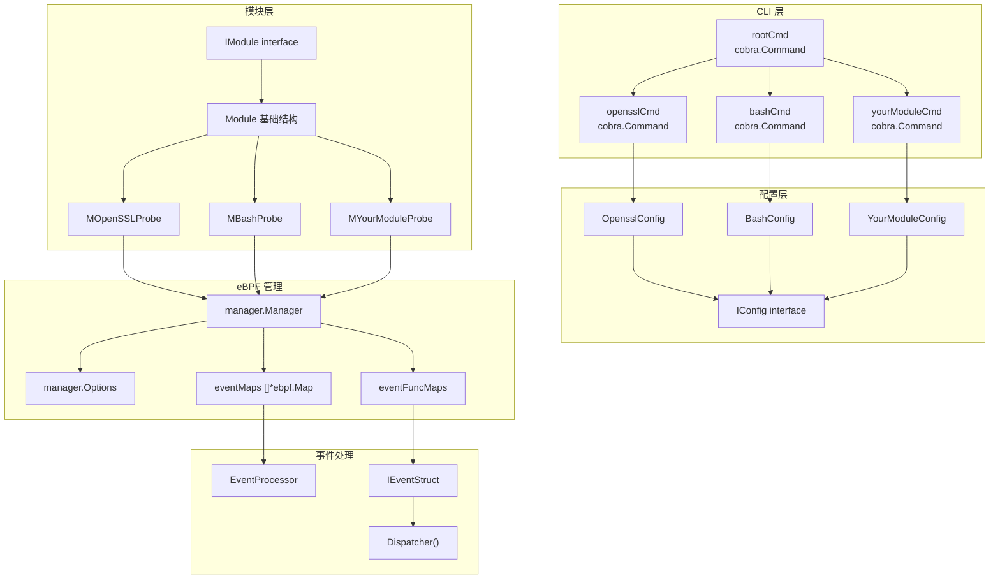
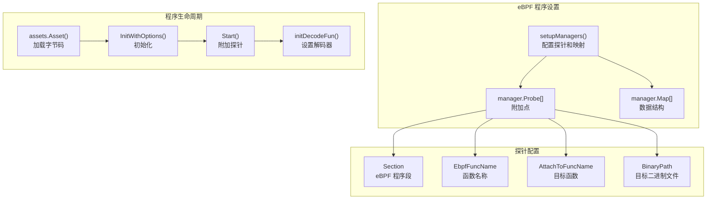
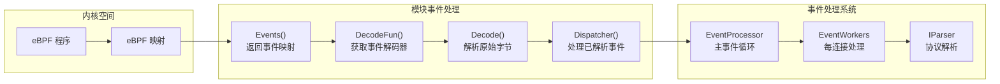
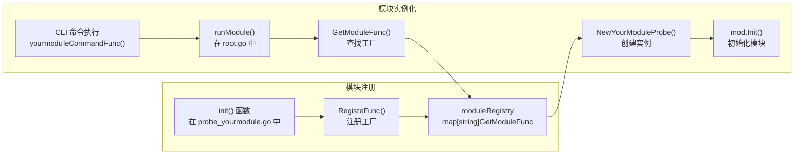

# 添加新模块

本文档提供了在 eCapture 系统中实现新捕获模块的分步指南。创建新模块涉及：(1) 实现 `IModule` 接口，(2) 创建 CLI 命令，(3) 定义配置结构，(4) 集成 eBPF 程序，以及 (5) 处理事件。

有关整体系统架构的信息，请参阅[架构设计](../2-architecture/index.md)。有关现有捕获模块的详细信息，请参阅[捕获模块](../3-capture-modules/index.md)。有关 eBPF 程序开发细节，请参阅[eBPF 程序开发](5.2-ebpf-program-development.md)。

## 模块架构概述

eCapture 模块系统使用插件架构，其中每个模块实现 `IModule` 接口 [user/module/imodule.go:47-75](https://github.com/gojue/ecapture/blob/0766a93b/user/module/imodule.go#L47-L75)。模块使用 eBPF 程序捕获特定类型的网络流量或系统事件。所有模块遵循一致的模式：通过 `manager.Manager` 管理 eBPF 程序，通过 `EventProcessor` 处理事件，并将数据输出到配置的目标位置。

**模块架构图**



来源：[user/module/imodule.go:47-75](https://github.com/gojue/ecapture/blob/0766a93b/user/module/imodule.go#L47-L75), [user/module/probe_openssl.go:83-106](https://github.com/gojue/ecapture/blob/0766a93b/user/module/probe_openssl.go#L83-L106), [cli/cmd/tls.go:29-48](https://github.com/gojue/ecapture/blob/0766a93b/cli/cmd/tls.go#L29-L48), [cli/cmd/root.go:249-403](https://github.com/gojue/ecapture/blob/0766a93b/cli/cmd/root.go#L249-L403)

## 核心接口要求

每个模块必须实现在 [user/module/imodule.go:47-75](https://github.com/gojue/ecapture/blob/0766a93b/user/module/imodule.go#L47-L75) 定义的 `IModule` 接口，并嵌入 `Module` 基础结构 [user/module/imodule.go:83-108](https://github.com/gojue/ecapture/blob/0766a93b/user/module/imodule.go#L83-L108)。该接口定义了基本的生命周期和事件处理方法：

**IModule 接口方法**

| 方法 | 签名 | 目的 |
|--------|-----------|---------|
| `Init()` | `Init(context.Context, *zerolog.Logger, config.IConfig, io.Writer) error` | 使用上下文、日志记录器、配置和事件写入器初始化模块 |
| `Name()` | `Name() string` | 返回用于注册的模块标识符 |
| `Start()` | `Start() error` | 加载 eBPF 程序并附加探针 |
| `Run()` | `Run() error` | 启动事件读取循环 |
| `Stop()` | `Stop() error` | 暂停捕获（可选） |
| `Close()` | `Close() error` | 清理资源并分离探针 |
| `SetChild()` | `SetChild(IModule)` | 为基础结构设置具体模块实现 |
| `Events()` | `Events() []*ebpf.Map` | 返回包含事件的 eBPF 映射 |
| `DecodeFun()` | `DecodeFun(*ebpf.Map) (event.IEventStruct, bool)` | 获取特定映射的事件解码器 |
| `Decode()` | `Decode(*ebpf.Map, []byte) (event.IEventStruct, error)` | 解析原始事件字节 |
| `Dispatcher()` | `Dispatcher(event.IEventStruct)` | 处理已解码的事件 |

基础 `Module` 结构提供了通用功能：
- 从 perf 数组和环形缓冲区读取事件 [user/module/imodule.go:308-391](https://github.com/gojue/ecapture/blob/0766a93b/user/module/imodule.go#L308-L391)
- BTF 模式自动检测 [user/module/imodule.go:173-190](https://github.com/gojue/ecapture/blob/0766a93b/user/module/imodule.go#L173-L190)
- eBPF 字节码文件选择（CO-RE vs non-CO-RE）[user/module/imodule.go:191-214](https://github.com/gojue/ecapture/blob/0766a93b/user/module/imodule.go#L191-L214)
- 与 `EventProcessor` 集成以进行数据聚合 [user/module/imodule.go:127](https://github.com/gojue/ecapture/blob/0766a93b/user/module/imodule.go#L127)
- 输出格式化（文本 vs protobuf）[user/module/imodule.go:461-479](https://github.com/gojue/ecapture/blob/0766a93b/user/module/imodule.go#L461-L479)

来源：[user/module/imodule.go:47-75](https://github.com/gojue/ecapture/blob/0766a93b/user/module/imodule.go#L47-L75), [user/module/imodule.go:83-108](https://github.com/gojue/ecapture/blob/0766a93b/user/module/imodule.go#L83-L108), [user/module/imodule.go:110-171](https://github.com/gojue/ecapture/blob/0766a93b/user/module/imodule.go#L110-L171)

## 模块实现模式

所有具体模块遵循一致的实现模式，具有特定的结构字段和初始化步骤：

| 组件 | 目的 | 实现 |
|-----------|---------|----------------|
| `bpfManager` | eBPF 程序生命周期管理 | `*manager.Manager` |
| `bpfManagerOptions` | eBPF 程序配置 | `manager.Options` |
| `eventFuncMaps` | 事件类型到解码器的映射 | `map[*ebpf.Map]event.IEventStruct` |
| `eventMaps` | 用于事件数据的 eBPF 映射 | `[]*ebpf.Map` |
| 模块特定字段 | 自定义状态和配置 | 因模块而异 |

```mermaid
graph TD
    subgraph "模块结构布局"
        Base["Module（嵌入）<br/>基础功能"]
        Manager["bpfManager<br/>*manager.Manager"]
        Options["bpfManagerOptions<br/>manager.Options"]
        EventMaps["eventMaps<br/>[]*ebpf.Map"]
        EventFuncs["eventFuncMaps<br/>map[*ebpf.Map]event.IEventStruct"]
        Custom["模块特定字段<br/>配置、状态等"]
    end
    
    subgraph "初始化流程"
        InitCall["调用 Init()"]
        BaseInit["Module.Init()"]
        SetChild["SetChild(m)"]
        InitMaps["初始化映射"]
        InitState["初始化模块状态"]
    end
    
    InitCall --> BaseInit
    BaseInit --> SetChild
    SetChild --> InitMaps
    InitMaps --> InitState
    
    Base --> Manager
    Manager --> Options
    Options --> EventMaps
    EventMaps --> EventFuncs
    EventFuncs --> Custom
```



来源：[user/module/probe_openssl.go:83-106](https://github.com/gojue/ecapture/blob/0766a93b/user/module/probe_openssl.go#L83-L106), [user/module/probe_bash.go:42-49](https://github.com/gojue/ecapture/blob/0766a93b/user/module/probe_bash.go#L42-L49), [user/module/probe_nspr.go:38-44](https://github.com/gojue/ecapture/blob/0766a93b/user/module/probe_nspr.go#L38-L44)

## eBPF 程序集成

模块通过 `manager.Manager` 系统与 eBPF 程序集成，该系统处理程序加载、附加和映射管理。每个模块必须定义其探针配置和映射要求：



来源：[user/module/probe_bash.go:147-236](https://github.com/gojue/ecapture/blob/0766a93b/user/module/probe_bash.go#L147-L236), [user/module/probe_openssl.go:285-355](https://github.com/gojue/ecapture/blob/0766a93b/user/module/probe_openssl.go#L285-L355), [user/module/probe_nspr.go:135-247](https://github.com/gojue/ecapture/blob/0766a93b/user/module/probe_nspr.go#L135-L247)

## 事件处理流程

模块通过提供事件映射和解码函数与事件处理系统集成。流程处理事件路由、解析和输出格式化：



来源：[user/module/imodule.go:267-333](https://github.com/gojue/ecapture/blob/0766a93b/user/module/imodule.go#L267-L333), [pkg/event_processor/processor.go:66-89](https://github.com/gojue/ecapture/blob/0766a93b/pkg/event_processor/processor.go#L66-L89), [pkg/event_processor/iworker.go:87-94](https://github.com/gojue/ecapture/blob/0766a93b/pkg/event_processor/iworker.go#L87-L94)

## 模块注册系统

模块使用工厂模式和 `RegisteFunc()` 系统自注册。这使得能够通过 `GetModuleFunc()` 进行动态模块发现和实例化：

```mermaid
graph TD
    subgraph "注册模式"
        Factory["NewXxxProbe()<br/>工厂函数"]
        ModStruct["创建模块结构"]
        SetName["设置模块名称"]
        SetType["设置探针类型"]
        Return["返回 IModule"]
    end
    
    subgraph "注册过程"
        InitFunc["init() 函数"]
        CallRegister["RegisteFunc(NewXxxProbe)"]
        ModuleMap["全局模块注册表"]
    end
    
    subgraph "模块发现"
        GetModules["模块枚举"]
        CreateInstance["工厂调用"]
        ModuleInit["模块初始化"]
    end
    
    Factory --> ModStruct
    ModStruct --> SetName
    SetName --> SetType
    SetType --> Return
    
    InitFunc --> CallRegister
    CallRegister --> ModuleMap
    
    GetModules --> CreateInstance
    CreateInstance --> ModuleInit
```



来源：[user/module/probe_bash.go:311-320](https://github.com/gojue/ecapture/blob/0766a93b/user/module/probe_bash.go#L311-L320), [user/module/probe_openssl.go:782-791](https://github.com/gojue/ecapture/blob/0766a93b/user/module/probe_openssl.go#L782-L791), [user/module/probe_nspr.go:273-282](https://github.com/gojue/ecapture/blob/0766a93b/user/module/probe_nspr.go#L273-L282)

## 分步实现指南

### 步骤 1：定义配置结构

在 `user/config/config_yourmodule.go` 中创建实现 `IConfig` 接口 [user/config/iconfig.go:24-70](https://github.com/gojue/ecapture/blob/0766a93b/user/config/iconfig.go#L24-L70) 的配置结构：

```go
type YourModuleConfig struct {
    BaseConfig                    // 嵌入基础配置
    YourModulePath string         // 模块特定路径
    Model          string         // 捕获模式：text、pcap、keylog
    PcapFile       string         // 输出 pcap 文件
    PcapFilter     string         // BPF 过滤表达式
    // 添加模块特定字段
}

func NewYourModuleConfig() *YourModuleConfig {
    return &YourModuleConfig{
        BaseConfig: BaseConfig{},
    }
}

func (y *YourModuleConfig) Check() error {
    // 验证配置
    return nil
}
```

参见示例：[user/config/config_openssl.go](https://github.com/gojue/ecapture/blob/0766a93b/user/config/config_openssl.go), [user/config/config_bash.go](https://github.com/gojue/ecapture/blob/0766a93b/user/config/config_bash.go)。

来源：[user/config/iconfig.go:24-70](https://github.com/gojue/ecapture/blob/0766a93b/user/config/iconfig.go#L24-L70), [cli/cmd/tls.go:26](https://github.com/gojue/ecapture/blob/0766a93b/cli/cmd/tls.go#L26), [cli/cmd/bash.go:24](https://github.com/gojue/ecapture/blob/0766a93b/cli/cmd/bash.go#L24)

### 步骤 2：创建 CLI 命令

遵循 Cobra 模式在 `cli/cmd/yourmodule.go` 中创建 CLI 命令文件：

```go
var ymc = config.NewYourModuleConfig()

var yourmoduleCmd = &cobra.Command{
    Use:     "yourmodule",
    Aliases: []string{"ym"},
    Short:   "从目标捕获数据",
    Long:    `关于模块功能的详细描述`,
    RunE:    yourmoduleCommandFunc,
}

func init() {
    yourmoduleCmd.PersistentFlags().StringVar(&ymc.YourModulePath, "path", "", "目标二进制路径")
    yourmoduleCmd.PersistentFlags().StringVarP(&ymc.Model, "model", "m", "text", "捕获模式：text、pcap、keylog")
    yourmoduleCmd.PersistentFlags().StringVarP(&ymc.PcapFile, "pcapfile", "w", "save.pcapng", "pcapng 输出文件")
    rootCmd.AddCommand(yourmoduleCmd)
}

func yourmoduleCommandFunc(command *cobra.Command, args []string) error {
    return runModule(module.ModuleNameYourModule, ymc)
}
```

[cli/cmd/root.go:250-403](https://github.com/gojue/ecapture/blob/0766a93b/cli/cmd/root.go#L250-L403) 中的 `runModule()` 函数处理：
- 从全局标志设置模块配置
- 初始化日志记录器和事件收集器
- 通过工厂函数创建模块实例
- 运行模块生命周期：Init → Run → Close

来源：[cli/cmd/tls.go:26-67](https://github.com/gojue/ecapture/blob/0766a93b/cli/cmd/tls.go#L26-L67), [cli/cmd/bash.go:24-55](https://github.com/gojue/ecapture/blob/0766a93b/cli/cmd/bash.go#L24-L55), [cli/cmd/root.go:250-403](https://github.com/gojue/ecapture/blob/0766a93b/cli/cmd/root.go#L250-L403)

### 步骤 3：创建模块结构

在 `user/module/probe_yourmodule.go` 中创建新文件并定义模块结构：

```go
type MYourModuleProbe struct {
    Module                                     // 嵌入基础模块
    bpfManager        *manager.Manager         // eBPF 程序管理器
    bpfManagerOptions manager.Options          // 管理器配置
    eventFuncMaps     map[*ebpf.Map]event.IEventStruct  // 映射 -> 解码器
    eventMaps         []*ebpf.Map              // 事件数据映射
    // 在此添加模块特定字段
    targetPath        string                   // 目标二进制路径
    targetFuncName    string                   // 要钩取的函数
}
```

来源：[user/module/probe_openssl.go:83-106](https://github.com/gojue/ecapture/blob/0766a93b/user/module/probe_openssl.go#L83-L106), [user/module/probe_bash.go:42-50](https://github.com/gojue/ecapture/blob/0766a93b/user/module/probe_bash.go#L42-L50)

### 步骤 4：实现 Init() 方法

实现 `Init()` 方法以初始化模块 [user/module/probe_openssl.go:109-176](https://github.com/gojue/ecapture/blob/0766a93b/user/module/probe_openssl.go#L109-L176)：

```go
func (m *MYourModuleProbe) Init(ctx context.Context, logger *zerolog.Logger, conf config.IConfig, ecw io.Writer) error {
    // 调用基础 Init()
    err := m.Module.Init(ctx, logger, conf, ecw)
    if err != nil {
        return err
    }
    
    // 设置配置
    m.conf = conf
    m.Module.SetChild(m)
    
    // 初始化事件映射和解码器
    m.eventMaps = make([]*ebpf.Map, 0, 2)
    m.eventFuncMaps = make(map[*ebpf.Map]event.IEventStruct)
    
    // 模块特定初始化
    ymc := conf.(*config.YourModuleConfig)
    m.targetPath = ymc.YourModulePath
    
    // 验证目标二进制文件存在
    if _, err := os.Stat(m.targetPath); err != nil {
        return fmt.Errorf("目标二进制文件未找到: %w", err)
    }
    
    return nil
}
```

来源：[user/module/probe_openssl.go:109-176](https://github.com/gojue/ecapture/blob/0766a93b/user/module/probe_openssl.go#L109-L176), [user/module/probe_bash.go:52-76](https://github.com/gojue/ecapture/blob/0766a93b/user/module/probe_bash.go#L52-L76)

### 步骤 5：配置 eBPF 程序

实现调用 `setupManagers()` 的 `Start()` 方法以配置 eBPF 程序。`setupManagers()` 方法定义探针附加点和映射 [user/module/probe_bash.go:147-236](https://github.com/gojue/ecapture/blob/0766a93b/user/module/probe_bash.go#L147-L236)：

```go
func (m *MYourModuleProbe) setupManagers() error {
    // 定义 uprobe 附加点
    m.bpfManager = &manager.Manager{
        Probes: []*manager.Probe{
            {
                Section:          "uprobe/your_target_function",
                EbpfFuncName:     "probe_your_function",
                AttachToFuncName: "your_target_function",
                BinaryPath:       m.targetPath,
            },
            {
                Section:          "uretprobe/your_target_function",
                EbpfFuncName:     "probe_your_function_ret",
                AttachToFuncName: "your_target_function",
                BinaryPath:       m.targetPath,
            },
        },
        Maps: []*manager.Map{
            {
                Name: "events",
            },
        },
    }
    
    // 设置管理器选项
    m.bpfManagerOptions = manager.Options{
        DefaultKProbeMaxActive: 512,
        VerifierOptions: ebpf.CollectionOptions{
            Programs: ebpf.ProgramOptions{
                LogSize: 2097152,
            },
        },
        RLimit: &unix.Rlimit{
            Cur: math.MaxUint64,
            Max: math.MaxUint64,
        },
    }
    
    return nil
}
```

**manager.Probe 配置参数**

| 参数 | 目的 | 示例 |
|-----------|---------|---------|
| `Section` | 字节码中的 eBPF 程序段名称 | `"uprobe/readline"` |
| `EbpfFuncName` | eBPF C 代码中的函数名称 | `"probe_readline"` |
| `AttachToFuncName` | 要钩取的目标函数 | `"readline"` |
| `BinaryPath` | 目标二进制文件的路径 | `"/bin/bash"` |
| `UID` | 按用户 ID 过滤（可选） | `"uprobe/SSL_write"` |

来源：[user/module/probe_bash.go:147-236](https://github.com/gojue/ecapture/blob/0766a93b/user/module/probe_bash.go#L147-L236), [user/module/probe_openssl.go:285-350](https://github.com/gojue/ecapture/blob/0766a93b/user/module/probe_openssl.go#L285-L350)

### 步骤 6：加载并启动 eBPF 程序

完成 `Start()` 方法以加载 eBPF 字节码并启动管理器 [user/module/probe_openssl.go:280-350](https://github.com/gojue/ecapture/blob/0766a93b/user/module/probe_openssl.go#L280-L350)：

```go
func (m *MYourModuleProbe) Start() error {
    // 设置管理器
    err := m.setupManagers()
    if err != nil {
        return err
    }
    
    // 获取 eBPF 字节码文件
    bpfFileName := m.geteBPFName("user/bytecode/yourmodule_kern.o")
    byteBuf, err := assets.Asset(bpfFileName)
    if err != nil {
        return fmt.Errorf("找不到资源: %w", err)
    }
    
    // 使用字节码初始化 eBPF 管理器
    if err = m.bpfManager.InitWithOptions(bytes.NewReader(byteBuf), m.bpfManagerOptions); err != nil {
        return fmt.Errorf("无法初始化管理器: %w", err)
    }
    
    // 启动 eBPF 管理器（附加探针）
    if err = m.bpfManager.Start(); err != nil {
        return fmt.Errorf("无法启动管理器: %w", err)
    }
    
    // 初始化事件解码器
    err = m.initDecodeFun()
    if err != nil {
        return err
    }
    
    return nil
}
```

`geteBPFName()` 方法根据系统检测自动选择正确的字节码变体（CO-RE vs non-CO-RE，kernel < 5.2）[user/module/imodule.go:191-214](https://github.com/gojue/ecapture/blob/0766a93b/user/module/imodule.go#L191-L214)。

来源：[user/module/probe_openssl.go:280-350](https://github.com/gojue/ecapture/blob/0766a93b/user/module/probe_openssl.go#L280-L350), [user/module/imodule.go:191-214](https://github.com/gojue/ecapture/blob/0766a93b/user/module/imodule.go#L191-L214)

### 步骤 7：实现事件处理

在 `initDecodeFun()` 中创建事件结构和解码器映射 [user/module/probe_bash.go:243-258](https://github.com/gojue/ecapture/blob/0766a93b/user/module/probe_bash.go#L243-L258)：

```go
func (m *MYourModuleProbe) initDecodeFun() error {
    // 获取 eBPF 映射
    eventsMap, found, err := m.bpfManager.GetMap("events")
    if err != nil {
        return err
    }
    if !found {
        return errors.New("未找到 events 映射")
    }
    
    // 创建事件解码器实例
    yourEvent := &event.YourModuleEvent{}
    
    // 将解码器映射到映射
    m.eventFuncMaps[eventsMap] = yourEvent
    
    // 将映射添加到事件映射列表
    m.eventMaps = append(m.eventMaps, eventsMap)
    
    return nil
}
```

来源：[user/module/probe_bash.go:243-258](https://github.com/gojue/ecapture/blob/0766a93b/user/module/probe_bash.go#L243-L258), [user/module/probe_openssl.go:336-348](https://github.com/gojue/ecapture/blob/0766a93b/user/module/probe_openssl.go#L336-L348)

### 步骤 8：实现必需的接口方法

实现其余的 `IModule` 接口方法：

```go
// Events 返回要从中读取事件的 eBPF 映射
func (m *MYourModuleProbe) Events() []*ebpf.Map {
    return m.eventMaps
}

// DecodeFun 返回给定 eBPF 映射的解码器
func (m *MYourModuleProbe) DecodeFun(em *ebpf.Map) (event.IEventStruct, bool) {
    fun, found := m.eventFuncMaps[em]
    return fun, found
}

// Dispatcher 处理已解码的事件
func (m *MYourModuleProbe) Dispatcher(e event.IEventStruct) {
    switch ev := e.(type) {
    case *event.YourModuleEvent:
        // 处理您的事件
        m.logger.Info().Str("data", ev.String()).Msg("捕获的事件")
        // 写入事件收集器
        m.processor.Write(ev)
    }
}

// Close 清理资源
func (m *MYourModuleProbe) Close() error {
    if err := m.bpfManager.Stop(manager.CleanAll); err != nil {
        return err
    }
    return m.Module.Close()
}
```

来源：[user/module/probe_openssl.go:389-396](https://github.com/gojue/ecapture/blob/0766a93b/user/module/probe_openssl.go#L389-L396), [user/module/probe_openssl.go:733-754](https://github.com/gojue/ecapture/blob/0766a93b/user/module/probe_openssl.go#L733-L754), [user/module/probe_openssl.go:352-358](https://github.com/gojue/ecapture/blob/0766a93b/user/module/probe_openssl.go#L352-L358)

### 步骤 9：注册模块

在模块文件末尾使用工厂模式添加注册代码：

```go
func init() {
    RegisteFunc(NewYourModuleProbe)
}

func NewYourModuleProbe() IModule {
    mod := &MYourModuleProbe{}
    mod.name = ModuleNameYourModule  // 定义此常量
    mod.mType = ProbeTypeUprobe
    return mod
}
```

将模块名称常量添加到 `user/module/const.go`：
```go
const (
    ModuleNameYourModule = "yourmodule"
)
```

`RegisteFunc()` 将工厂函数添加到全局模块注册表，通过 `GetModuleFunc()` 实现动态模块实例化 [cli/cmd/root.go:344](https://github.com/gojue/ecapture/blob/0766a93b/cli/cmd/root.go#L344)。

来源：[user/module/probe_bash.go:311-320](https://github.com/gojue/ecapture/blob/0766a93b/user/module/probe_bash.go#L311-L320), [user/module/probe_openssl.go:777-786](https://github.com/gojue/ecapture/blob/0766a93b/user/module/probe_openssl.go#L777-L786), [user/module/imodule.go](https://github.com/gojue/ecapture/blob/0766a93b/user/module/imodule.go)

### 步骤 10：将模块添加到构建系统

通过编辑 `Makefile` 将 eBPF 程序添加到构建系统：

1. 在 `variables.mk` 中将字节码目标添加到 `TARGETS` 变量
2. 在 `kern/yourmodule_kern.c` 创建 eBPF C 源文件
3. 构建将生成 `yourmodule_kern_core.o` 和 `yourmodule_kern_noncore.o`
4. 字节码通过 `go-bindata` 嵌入到 `assets/ebpf_probe.go`

详见[开发指南 - 构建系统](5.1-build-system.md)。

来源：[Makefile](https://github.com/gojue/ecapture/blob/0766a93b/Makefile), [variables.mk](https://github.com/gojue/ecapture/blob/0766a93b/variables.mk), [user/module/probe_bash.go:52-63](https://github.com/gojue/ecapture/blob/0766a93b/user/module/probe_bash.go#L52-L63)

## 创建事件结构

创建实现 `event.IEventStruct` 接口的事件结构，以表示 eBPF 程序捕获的数据。事件结构在内核空间 eBPF 程序和用户空间 Go 代码之间架起桥梁。

**事件结构模式**

创建事件文件 `user/event/event_yourmodule.go`：

```go
type YourModuleEvent struct {
    eventType EventType
    Pid       uint32
    Uid       uint32
    Timestamp uint64
    Comm      [16]byte
    // 与 eBPF 结构匹配的模块特定字段
    DataLen   uint32
    Data      [MAX_DATA_SIZE]byte
}

// Clone 创建新实例
func (e *YourModuleEvent) Clone() IEventStruct {
    return new(YourModuleEvent)
}

// EventType 返回用于路由的事件类型
func (e *YourModuleEvent) EventType() EventType {
    return e.eventType
}

// Decode 从 eBPF 解析原始字节
func (e *YourModuleEvent) Decode(payload []byte) error {
    buf := bytes.NewBuffer(payload)
    if err := binary.Read(buf, binary.LittleEndian, &e.Pid); err != nil {
        return err
    }
    if err := binary.Read(buf, binary.LittleEndian, &e.Uid); err != nil {
        return err
    }
    // 解码剩余字段...
    return nil
}

// String 返回人类可读格式
func (e *YourModuleEvent) String() string {
    s := fmt.Sprintf("PID:%d UID:%d Data:%s",
        e.Pid, e.Uid, string(e.Data[:e.DataLen]))
    return s
}

// StringHex 返回十六进制格式
func (e *YourModuleEvent) StringHex() string {
    return fmt.Sprintf("%s\n%s", e.String(), 
        hex.Dump(e.Data[:e.DataLen]))
}
```

**事件类型常量**

根据数据处理要求在 `Decode()` 方法中设置 `eventType`：

| 事件类型 | 目的 | 处理 |
|------------|---------|------------|
| `TypeEventProcessor` | 需要聚合/解析 | 发送到 `EventProcessor`，由 `IWorker` 处理 |
| `TypeOutput` | 直接输出 | 立即格式化并写入 |
| `TypeModuleData` | 模块内部 | 由模块的 `Dispatcher()` 处理 |

来源：[user/event/event_bash.go](https://github.com/gojue/ecapture/blob/0766a93b/user/event/event_bash.go), [pkg/event_processor/iworker.go:32-46](https://github.com/gojue/ecapture/blob/0766a93b/pkg/event_processor/iworker.go#L32-L46), [user/module/imodule.go:430-448](https://github.com/gojue/ecapture/blob/0766a93b/user/module/imodule.go#L430-L448)

## 模块注册与发现

模块系统使用工厂模式进行注册。模块在其 `init()` 函数中自注册，使其可用于动态实例化。

**模块注册流程**



[cli/cmd/root.go:250-403](https://github.com/gojue/ecapture/blob/0766a93b/cli/cmd/root.go#L250-L403) 中的 `runModule()` 函数协调整个模块生命周期：

1. 通过 `GetModuleFunc(modName)` 检索模块工厂
2. 通过调用工厂函数创建模块实例
3. 使用配置调用 `mod.Init()`
4. 调用 `mod.Run()` 启动捕获
5. 等待信号或配置重新加载
6. 调用 `mod.Close()` 进行清理

来源：[cli/cmd/root.go:250-403](https://github.com/gojue/ecapture/blob/0766a93b/cli/cmd/root.go#L250-L403), [user/module/probe_bash.go:311-320](https://github.com/gojue/ecapture/blob/0766a93b/user/module/probe_bash.go#L311-L320)

## 配置模式

模块通过 `IConfig` 接口接收配置。创建一个嵌入 `BaseConfig` 并添加模块特定字段的配置结构：

```go
type YourModuleConfig struct {
    BaseConfig               // 继承：Pid、Uid、Debug、IsHex、BtfMode、PerCpuMapSize
    YourModulePath string    // 目标二进制路径
    Model          string    // 输出模式：text、pcap、keylog
    // 根据需要添加更多字段
}

func (c *YourModuleConfig) Check() error {
    // 验证 YourModulePath 存在
    if c.YourModulePath == "" {
        return errors.New("需要目标路径")
    }
    return nil
}
```

配置通过 CLI → `runModule()` → `mod.Init()` → 模块代码路径传递。使用类型断言访问模块特定字段：

```go
func (m *MYourModuleProbe) Init(ctx context.Context, logger *zerolog.Logger, conf config.IConfig, ecw io.Writer) error {
    // ...
    ymc := conf.(*config.YourModuleConfig)
    m.targetPath = ymc.YourModulePath
    // ...
}
```

来源：[user/config/iconfig.go:95-112](https://github.com/gojue/ecapture/blob/0766a93b/user/config/iconfig.go#L95-L112), [cli/cmd/root.go:157-175](https://github.com/gojue/ecapture/blob/0766a93b/cli/cmd/root.go#L157-L175)

## 测试与调试

**测试方法**

| 测试阶段 | 技术 | 命令/工具 |
|---------------|-----------|--------------|
| eBPF 附加 | 验证探针已附加 | `bpftool prog list`、`bpftool map list` |
| 事件生成 | 触发目标应用程序 | 运行应用程序与模块 |
| 事件解码 | 添加调试日志 | 在 `Dispatcher()` 中使用 `logger.Debug().Msg()` |
| 集成 | 端到端测试 | `ecapture yourmodule --debug` |

**常见问题**

| 问题 | 症状 | 解决方案 |
|-------|----------|----------|
| 探针附加失败 | `couldn't start manager` | 验证 `BinaryPath` 和 `AttachToFuncName` 是否正确 |
| 未接收到事件 | 静默操作 | 检查 eBPF 程序是否触发，验证映射名称 |
| 解码错误 | `m.child.decode error` | 确保 Go 结构与 eBPF 结构布局完全匹配 |
| 未找到模块 | `cant found module function` | 验证 `init()` 调用 `RegisteFunc()`，检查模块名称 |

**调试工作流程**

1. 启用调试模式：`ecapture yourmodule --debug`
2. 检查 eBPF 程序加载：查找"BPF bytecode file is matched"日志
3. 验证探针附加：查找"module started successfully"日志
4. 监控事件：在 `Dispatcher()` 方法中添加日志
5. 检查事件处理器：查找处理器工作者日志

来源：[user/module/probe_openssl.go:280-350](https://github.com/gojue/ecapture/blob/0766a93b/user/module/probe_openssl.go#L280-L350), [user/module/imodule.go:285-306](https://github.com/gojue/ecapture/blob/0766a93b/user/module/imodule.go#L285-L306)

## 总结

创建新的 eCapture 模块涉及：

1. **配置**：创建实现 `IConfig` 的 `YourModuleConfig` 结构
2. **CLI 命令**：在 `cli/cmd/` 目录中添加 `yourmoduleCmd`
3. **模块结构**：创建嵌入 `Module` 基础的 `MYourModuleProbe`
4. **初始化**：实现 `Init()` 以设置模块状态
5. **eBPF 设置**：实现 `setupManagers()` 以配置探针和映射
6. **启动**：实现 `Start()` 以加载字节码并附加探针
7. **事件处理**：实现 `Events()`、`DecodeFun()`、`Dispatcher()`
8. **事件结构**：创建实现 `IEventStruct` 的事件类型
9. **注册**：添加调用 `RegisteFunc()` 的 `init()` 函数
10. **构建集成**：将 eBPF 程序添加到构建系统

参考现有模块如 `MOpenSSLProbe` [user/module/probe_openssl.go](https://github.com/gojue/ecapture/blob/0766a93b/user/module/probe_openssl.go) 或 `MBashProbe` [user/module/probe_bash.go](https://github.com/gojue/ecapture/blob/0766a93b/user/module/probe_bash.go) 作为参考实现。模块化架构确保新模块与现有的事件处理、配置和输出系统无缝集成。

来源：[user/module/probe_openssl.go](https://github.com/gojue/ecapture/blob/0766a93b/user/module/probe_openssl.go), [user/module/probe_bash.go](https://github.com/gojue/ecapture/blob/0766a93b/user/module/probe_bash.go), [cli/cmd/tls.go](https://github.com/gojue/ecapture/blob/0766a93b/cli/cmd/tls.go), [cli/cmd/bash.go](https://github.com/gojue/ecapture/blob/0766a93b/cli/cmd/bash.go)