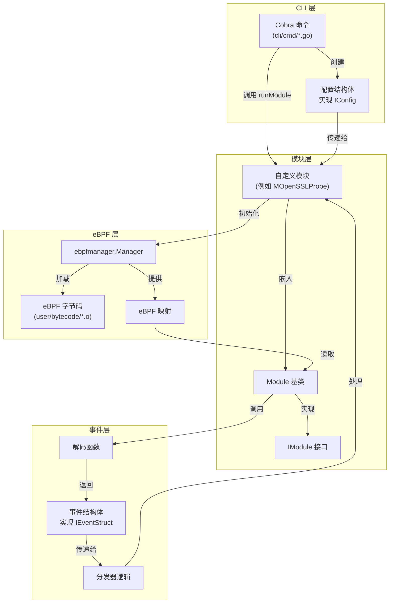
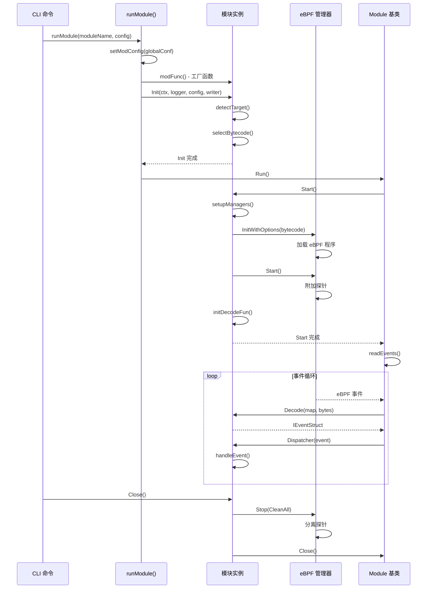
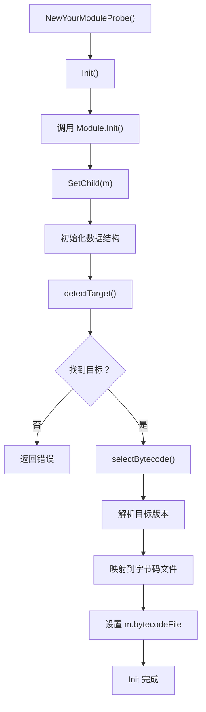
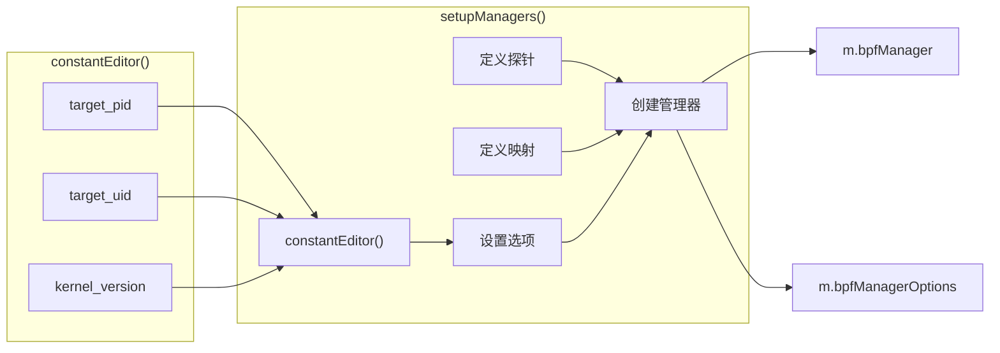

# 添加新模块

本指南介绍如何在 eCapture 中实现新的捕获模块。涵盖从定义模块结构到与 CLI 和 eBPF 子系统集成的完整过程。

有关为捕获数据实现事件解析器的信息，请参阅[事件处理与解析器](5.4-event-processing-and-parsers.md)。有关 eBPF 程序开发模式的信息，请参阅[eBPF 程序开发](5.2-ebpf-program-development.md)。

## 概述

eCapture 的模块化架构允许开发人员通过实现 `IModule` 接口来添加新的捕获目标（库、应用程序、系统调用）。每个模块包含：

- 实现 `IModule` 接口的模块实现结构体
- 实现 `IConfig` 接口的配置结构体
- CLI 命令定义
- 用于内核空间检测的 eBPF 程序
- 捕获数据的事件结构定义

系统提供基类（`Module`、`MTCProbe`）来处理常见功能，如 eBPF 映射读取、事件分发和生命周期管理。

## 模块架构

### 组件关系


```mermaid
graph TB
    subgraph "CLI 层"
        CMD["Cobra 命令<br/>(cli/cmd/*.go)"]
        CONFIG["配置结构体<br/>实现 IConfig"]
    end
    
    subgraph "模块层"
        IMODULE["IModule 接口"]
        BASE["Module 基类"]
        CUSTOM["自定义模块<br/>(例如 MOpenSSLProbe)"]
    end
    
    subgraph "eBPF 层"
        BYTECODE["eBPF 字节码<br/>(user/bytecode/*.o)"]
        MANAGER["ebpfmanager.Manager"]
        MAPS["eBPF 映射"]
    end
    
    subgraph "事件层"
        DECODER["解码函数"]
        EVENTS["事件结构体<br/>实现 IEventStruct"]
        DISPATCHER["分发器逻辑"]
    end
    
    CMD -->|创建| CONFIG
    CMD -->|调用 runModule| CUSTOM
    CONFIG -->|传递给| CUSTOM
    
    CUSTOM -->|嵌入| BASE
    BASE -->|实现| IMODULE
    
    CUSTOM -->|初始化| MANAGER
    MANAGER -->|加载| BYTECODE
    MANAGER -->|提供| MAPS
    
    MAPS -->|读取| BASE
    BASE -->|调用| DECODER
    DECODER -->|返回| EVENTS
    EVENTS -->|传递给| DISPATCHER
    DISPATCHER -->|处理| CUSTOM
```

来源：[user/module/imodule.go:47-75](https://github.com/gojue/ecapture/blob/ca085d05/user/module/imodule.go#L47-L75), [user/module/probe_openssl.go:83-106](https://github.com/gojue/ecapture/blob/ca085d05/user/module/probe_openssl.go#L83-L106), [cli/cmd/root.go:249-403](https://github.com/gojue/ecapture/blob/ca085d05/cli/cmd/root.go#L249-L403)

### IModule 接口

`IModule` 接口定义了所有模块必须实现的约定：

| 方法 | 用途 |
|--------|---------|
| `Init(context.Context, *zerolog.Logger, config.IConfig, io.Writer) error` | 使用上下文、日志记录器、配置和事件收集器写入器初始化模块 |
| `Name() string` | 返回模块名称标识符 |
| `Run() error` | 启动事件监控和处理 |
| `Start() error` | 启动 eBPF 程序并附加探针 |
| `Stop() error` | 停止事件监控 |
| `Close() error` | 清理并分离探针 |
| `SetChild(IModule)` | 设置对子实现的引用（用于基类） |
| `Decode(*ebpf.Map, []byte) (event.IEventStruct, error)` | 解码原始 eBPF 事件数据 |
| `Events() []*ebpf.Map` | 返回要从中读取事件的 eBPF 映射列表 |
| `DecodeFun(*ebpf.Map) (event.IEventStruct, bool)` | 获取特定映射的解码器函数 |
| `Dispatcher(event.IEventStruct)` | 处理已解码的事件 |

来源：[user/module/imodule.go:47-75](https://github.com/gojue/ecapture/blob/ca085d05/user/module/imodule.go#L47-L75)

## 实现步骤

### 步骤 1：创建模块结构

定义一个嵌入 `Module`（用于基本模块）或 `MTCProbe`（用于支持 TC 的 TLS/网络模块）的结构体：

```
type MYourModuleProbe struct {
    Module                    // 或 MTCProbe（用于网络模块）
    bpfManager        *manager.Manager
    bpfManagerOptions manager.Options
    eventFuncMaps     map[*ebpf.Map]event.IEventStruct
    eventMaps         []*ebpf.Map
    
    // 模块特定字段
    targetPath        string
    someConfig        string
}
```

**关键字段：**
- `bpfManager`：管理 eBPF 程序生命周期
- `bpfManagerOptions`：eBPF 管理器的配置（探针、映射、常量）
- `eventFuncMaps`：将 eBPF 映射映射到其解码器函数
- `eventMaps`：要从中读取事件的映射列表

来源：[user/module/probe_openssl.go:83-106](https://github.com/gojue/ecapture/blob/ca085d05/user/module/probe_openssl.go#L83-L106)

### 步骤 2：实现 Init 方法

`Init` 方法初始化模块，检测目标库/二进制文件，并准备 eBPF 配置：

```
func (m *MYourModuleProbe) Init(ctx context.Context, logger *zerolog.Logger, 
                                 conf config.IConfig, ecw io.Writer) error {
    // 1. 调用父类 Init
    err := m.Module.Init(ctx, logger, conf, ecw)
    if err != nil {
        return err
    }
    
    // 2. 设置配置和子引用
    m.conf = conf
    m.Module.SetChild(m)
    
    // 3. 初始化模块特定的数据结构
    m.eventMaps = make([]*ebpf.Map, 0, 2)
    m.eventFuncMaps = make(map[*ebpf.Map]event.IEventStruct)
    
    // 4. 检测目标二进制文件/库
    targetPath, err := m.detectTarget()
    if err != nil {
        return err
    }
    m.targetPath = targetPath
    
    // 5. 根据目标版本选择适当的 eBPF 字节码
    err = m.selectBytecode(targetPath)
    if err != nil {
        return err
    }
    
    return nil
}
```

来源：[user/module/probe_openssl.go:109-176](https://github.com/gojue/ecapture/blob/ca085d05/user/module/probe_openssl.go#L109-L176)

### 步骤 3：实现 Start 方法

`Start` 方法加载并附加 eBPF 程序：

```
func (m *MYourModuleProbe) Start() error {
    // 1. 使用探针和映射设置 eBPF 管理器
    err := m.setupManagers()
    if err != nil {
        return err
    }
    
    // 2. 从嵌入的资产加载字节码
    bpfFileName := m.geteBPFName("user/bytecode/yourmodule_kern.o")
    byteBuf, err := assets.Asset(bpfFileName)
    if err != nil {
        return fmt.Errorf("couldn't find asset %w", err)
    }
    
    // 3. 使用字节码初始化 eBPF 管理器
    if err = m.bpfManager.InitWithOptions(bytes.NewReader(byteBuf), 
                                          m.bpfManagerOptions); err != nil {
        return fmt.Errorf("couldn't init manager %w", err)
    }
    
    // 4. 启动管理器（附加探针）
    if err = m.bpfManager.Start(); err != nil {
        return fmt.Errorf("couldn't start manager %w", err)
    }
    
    // 5. 为事件映射设置解码函数
    err = m.initDecodeFun()
    if err != nil {
        return err
    }
    
    return nil
}
```

**setupManagers 实现模式：**

```
func (m *MYourModuleProbe) setupManagers() error {
    var probes []*manager.Probe
    
    // 定义 uprobes
    probes = append(probes, &manager.Probe{
        Section:     "uprobe/target_function",
        EbpfFuncName: "uprobe_target_function",
        AttachToFuncName: "target_function",
        BinaryPath:   m.targetPath,
    })
    
    // 定义返回探针
    probes = append(probes, &manager.Probe{
        Section:     "uretprobe/target_function",
        EbpfFuncName: "uretprobe_target_function",
        AttachToFuncName: "target_function",
        BinaryPath:   m.targetPath,
    })
    
    m.bpfManager = &manager.Manager{
        Probes: probes,
        Maps: []*manager.Map{
            {Name: "events"},
            {Name: "config_map"},
        },
    }
    
    m.bpfManagerOptions = manager.Options{
        DefaultKProbeMaxActive: 512,
        VerifierOptions: ebpf.CollectionOptions{
            Programs: ebpf.ProgramOptions{
                LogSize: 2097152,
            },
        },
        ConstantEditors: m.constantEditor(),
    }
    
    return nil
}
```

来源：[user/module/probe_openssl.go:280-350](https://github.com/gojue/ecapture/blob/ca085d05/user/module/probe_openssl.go#L280-L350)

### 步骤 4：实现事件解码

#### 设置解码函数

将每个 eBPF 事件映射映射到其解码器：

```
func (m *MYourModuleProbe) initDecodeFun() error {
    // 获取事件映射的引用
    eventsMap, found, err := m.bpfManager.GetMap("events")
    if err != nil {
        return err
    }
    if !found {
        return errors.New("events map not found")
    }
    
    // 注册解码器
    m.eventMaps = append(m.eventMaps, eventsMap)
    m.eventFuncMaps[eventsMap] = &event.YourEventStruct{}
    
    return nil
}
```

#### 实现 DecodeFun 和 Events

```
func (m *MYourModuleProbe) DecodeFun(em *ebpf.Map) (event.IEventStruct, bool) {
    fun, found := m.eventFuncMaps[em]
    return fun, found
}

func (m *MYourModuleProbe) Events() []*ebpf.Map {
    return m.eventMaps
}
```

来源：[user/module/probe_openssl.go:336-348](https://github.com/gojue/ecapture/blob/ca085d05/user/module/probe_openssl.go#L336-L348), [user/module/probe_openssl.go:397-404](https://github.com/gojue/ecapture/blob/ca085d05/user/module/probe_openssl.go#L397-L404)

### 步骤 5：实现 Dispatcher

处理已解码的事件：

```
func (m *MYourModuleProbe) Dispatcher(eventStruct event.IEventStruct) {
    switch ev := eventStruct.(type) {
    case *event.YourDataEvent:
        m.handleDataEvent(ev)
    case *event.YourConfigEvent:
        m.handleConfigEvent(ev)
    default:
        m.logger.Warn().Str("eventType", fmt.Sprintf("%T", ev)).
            Msg("unknown event type")
    }
}
```

来源：[user/module/probe_openssl.go:741-762](https://github.com/gojue/ecapture/blob/ca085d05/user/module/probe_openssl.go#L741-L762)

### 步骤 6：创建配置

定义一个实现 `IConfig` 的配置结构体：

```
type YourModuleConfig struct {
    config.BaseConfig
    
    TargetPath   string `json:"target_path"`
    SomeOption   string `json:"some_option"`
    Model        string `json:"model"`  // text, pcap, keylog, 等
}

func NewYourModuleConfig() *YourModuleConfig {
    return &YourModuleConfig{
        BaseConfig: config.BaseConfig{},
        Model:      config.TlsCaptureModelText,
    }
}

func (c *YourModuleConfig) Check() error {
    if c.TargetPath == "" {
        return errors.New("target path is required")
    }
    // 添加验证逻辑
    return nil
}
```

来源：[user/config/iconfig.go:95-112](https://github.com/gojue/ecapture/blob/ca085d05/user/config/iconfig.go#L95-L112)

### 步骤 7：创建 CLI 命令

在 `cli/cmd/` 中定义 Cobra 命令：

```
// cli/cmd/yourmodule.go
package cmd

import (
    "github.com/spf13/cobra"
    "github.com/gojue/ecapture/user/config"
    "github.com/gojue/ecapture/user/module"
)

var ymc = config.NewYourModuleConfig()

var yourModuleCmd = &cobra.Command{
    Use:   "yourmodule",
    Short: "此模块捕获内容的简要描述",
    Long: `带有示例的详细描述：
ecapture yourmodule --target=/path/to/target
ecapture yourmodule -m pcap -w capture.pcapng
`,
    RunE: yourModuleCommandFunc,
}

func init() {
    yourModuleCmd.PersistentFlags().StringVar(&ymc.TargetPath, 
        "target", "", "目标二进制文件的路径")
    yourModuleCmd.PersistentFlags().StringVarP(&ymc.Model, 
        "model", "m", "text", "捕获模式：text、pcap、keylog")
    rootCmd.AddCommand(yourModuleCmd)
}

func yourModuleCommandFunc(command *cobra.Command, args []string) error {
    return runModule(module.ModuleNameYourModule, ymc)
}
```

来源：[cli/cmd/tls.go:26-67](https://github.com/gojue/ecapture/blob/ca085d05/cli/cmd/tls.go#L26-L67), [cli/cmd/gotls.go:26-58](https://github.com/gojue/ecapture/blob/ca085d05/cli/cmd/gotls.go#L26-L58)

### 步骤 8：注册模块

创建工厂函数并通过 `init()` 注册：

```
// user/module/probe_yourmodule.go

const (
    ModuleNameYourModule = "yourmodule"
)

func init() {
    RegisteFunc(NewYourModuleProbe)
}

func NewYourModuleProbe() IModule {
    mod := &MYourModuleProbe{}
    mod.name = ModuleNameYourModule
    mod.mType = ProbeTypeUprobe  // 或 ProbeTypeKprobe、ProbeTypeTC
    return mod
}
```

来源：[user/module/probe_openssl.go:785-794](https://github.com/gojue/ecapture/blob/ca085d05/user/module/probe_openssl.go#L785-L794)

### 步骤 9：实现 Close 方法

清理资源：

```
func (m *MYourModuleProbe) Close() error {
    m.logger.Info().Msg("module close.")
    
    // 停止 eBPF 管理器
    if err := m.bpfManager.Stop(manager.CleanAll); err != nil {
        return fmt.Errorf("couldn't stop manager %w", err)
    }
    
    // 关闭任何打开的文件或资源
    if m.someFile != nil {
        m.someFile.Close()
    }
    
    // 调用父类 Close
    return m.Module.Close()
}
```

来源：[user/module/probe_openssl.go:352-358](https://github.com/gojue/ecapture/blob/ca085d05/user/module/probe_openssl.go#L352-L358)

## 模块生命周期流程


```mermaid
sequenceDiagram
    participant CLI as CLI 命令
    participant RM as runModule()
    participant Mod as 模块实例
    participant MGR as eBPF 管理器
    participant Base as Module 基类
    
    CLI->>RM: runModule(moduleName, config)
    RM->>RM: setModConfig(globalConf)
    RM->>Mod: modFunc() - 工厂函数
    RM->>Mod: Init(ctx, logger, config, writer)
    
    Mod->>Mod: detectTarget()
    Mod->>Mod: selectBytecode()
    Mod-->>RM: Init 完成
    
    RM->>Base: Run()
    Base->>Mod: Start()
    
    Mod->>Mod: setupManagers()
    Mod->>MGR: InitWithOptions(bytecode)
    MGR->>MGR: 加载 eBPF 程序
    Mod->>MGR: Start()
    MGR->>MGR: 附加探针
    
    Mod->>Mod: initDecodeFun()
    Mod-->>Base: Start 完成
    
    Base->>Base: readEvents()
    
    loop 事件循环
        MGR-->>Base: eBPF 事件
        Base->>Mod: Decode(map, bytes)
        Mod-->>Base: IEventStruct
        Base->>Mod: Dispatcher(event)
        Mod->>Mod: handleEvent()
    end
    
    CLI->>Mod: Close()
    Mod->>MGR: Stop(CleanAll)
    MGR->>MGR: 分离探针
    Mod->>Base: Close()
```

来源：[cli/cmd/root.go:336-398](https://github.com/gojue/ecapture/blob/ca085d05/cli/cmd/root.go#L336-L398), [user/module/imodule.go:236-262](https://github.com/gojue/ecapture/blob/ca085d05/user/module/imodule.go#L236-L262)

## 事件结构定义

事件必须实现 `IEventStruct` 接口：

```
// user/event/yourmodule.go

type YourDataEvent struct {
    EventType uint8
    Pid       uint32
    Timestamp uint64
    DataLen   uint32
    Data      [4096]byte
}

func (e *YourDataEvent) Decode(payload []byte) error {
    buf := bytes.NewBuffer(payload)
    return binary.Read(buf, binary.LittleEndian, e)
}

func (e *YourDataEvent) String() string {
    return fmt.Sprintf("PID:%d, Data:%s", e.Pid, string(e.Data[:e.DataLen]))
}

func (e *YourDataEvent) StringHex() string {
    return fmt.Sprintf("PID:%d, Data:%x", e.Pid, e.Data[:e.DataLen])
}

func (e *YourDataEvent) Clone() IEventStruct {
    return &YourDataEvent{}
}

func (e *YourDataEvent) EventType() EventType {
    return TypeEventProcessor  // 或 TypeOutput、TypeModuleData
}
```

来源：[user/event/event_openssl.go](https://github.com/gojue/ecapture/blob/ca085d05/user/event/event_openssl.go)（结构参考）

## 完整模块示例

### 模块初始化序列


```mermaid
graph TD
    A["NewYourModuleProbe()"] --> B["Init()"]
    B --> C["调用 Module.Init()"]
    C --> D["SetChild(m)"]
    D --> E["初始化数据结构"]
    E --> F["detectTarget()"]
    F --> G{"找到目标？"}
    G -->|否| H["返回错误"]
    G -->|是| I["selectBytecode()"]
    I --> J["解析目标版本"]
    J --> K["映射到字节码文件"]
    K --> L["设置 m.bytecodeFile"]
    L --> M["Init 完成"]
```

来源：[user/module/probe_openssl.go:109-176](https://github.com/gojue/ecapture/blob/ca085d05/user/module/probe_openssl.go#L109-L176)

### 管理器设置模式


```mermaid
graph LR
    subgraph "setupManagers()"
        A["定义探针"] --> B["创建管理器"]
        C["定义映射"] --> B
        D["设置选项"] --> B
        E["constantEditor()"] --> D
    end
    
    B --> F["m.bpfManager"]
    B --> G["m.bpfManagerOptions"]
    
    subgraph "constantEditor()"
        H["target_pid"] --> E
        I["target_uid"] --> E
        J["kernel_version"] --> E
    end
```

来源：[user/module/probe_openssl.go:361-395](https://github.com/gojue/ecapture/blob/ca085d05/user/module/probe_openssl.go#L361-L395)

## 常见模式

### 模式 1：版本检测和字节码选择

许多模块需要检测库/二进制文件版本并选择适当的字节码：

```
func (m *MYourModuleProbe) detectTarget() (string, error) {
    // 1. 如果提供了配置路径，则使用它
    if m.conf.(*config.YourModuleConfig).TargetPath != "" {
        return m.conf.(*config.YourModuleConfig).TargetPath, nil
    }
    
    // 2. 搜索常见路径
    paths := []string{
        "/usr/lib/libtarget.so",
        "/lib/x86_64-linux-gnu/libtarget.so",
    }
    
    for _, path := range paths {
        if _, err := os.Stat(path); err == nil {
            return path, nil
        }
    }
    
    return "", errors.New("target not found")
}

func (m *MYourModuleProbe) selectBytecode(targetPath string) error {
    // 从二进制文件解析版本
    version, err := parseVersion(targetPath)
    if err != nil {
        return err
    }
    
    // 将版本映射到字节码
    bytecodeMap := map[string]string{
        "1.0": "yourmodule_1_0_kern.o",
        "2.0": "yourmodule_2_0_kern.o",
    }
    
    bytecode, found := bytecodeMap[version]
    if !found {
        return fmt.Errorf("unsupported version: %s", version)
    }
    
    m.bytecodeFile = bytecode
    return nil
}
```

来源：[user/module/probe_openssl.go:178-278](https://github.com/gojue/ecapture/blob/ca085d05/user/module/probe_openssl.go#L178-L278)

### 模式 2：用于 eBPF 配置的常量编辑器

通过常量编辑器将配置传递给 eBPF 程序：

```
func (m *MYourModuleProbe) constantEditor() []manager.ConstantEditor {
    return []manager.ConstantEditor{
        {
            Name:  "target_pid",
            Value: uint64(m.conf.GetPid()),
        },
        {
            Name:  "target_uid",
            Value: uint64(m.conf.GetUid()),
        },
        {
            Name:  "enable_feature",
            Value: uint64(1),
        },
    }
}
```

这些常量在 eBPF 代码中引用为：

```c
const volatile u64 target_pid = 0;
const volatile u64 target_uid = 0;
```

来源：[user/module/probe_openssl.go:361-395](https://github.com/gojue/ecapture/blob/ca085d05/user/module/probe_openssl.go#L361-L395)

### 模式 3：多个 eBPF 映射

处理来自不同映射的多个事件类型：

```
func (m *MYourModuleProbe) initDecodeFun() error {
    // 数据事件
    dataMap, found, err := m.bpfManager.GetMap("data_events")
    if err != nil {
        return err
    }
    if found {
        m.eventMaps = append(m.eventMaps, dataMap)
        m.eventFuncMaps[dataMap] = &event.YourDataEvent{}
    }
    
    // 连接事件
    connMap, found, err := m.bpfManager.GetMap("conn_events")
    if err != nil {
        return err
    }
    if found {
        m.eventMaps = append(m.eventMaps, connMap)
        m.eventFuncMaps[connMap] = &event.YourConnEvent{}
    }
    
    return nil
}
```

来源：[user/module/probe_openssl.go:336-348](https://github.com/gojue/ecapture/blob/ca085d05/user/module/probe_openssl.go#L336-L348)

## 测试注意事项

### 单元测试

测试各个组件：

```
func TestModuleInit(t *testing.T) {
    mod := NewYourModuleProbe()
    ctx := context.Background()
    logger := zerolog.New(os.Stdout)
    config := config.NewYourModuleConfig()
    
    err := mod.Init(ctx, &logger, config, os.Stdout)
    if err != nil {
        t.Errorf("Init failed: %v", err)
    }
}
```

### 集成测试

使用实际的 eBPF 程序进行测试：

1. 构建 eBPF 字节码
2. 使用测试配置初始化模块
3. 启动模块
4. 触发目标应用程序事件
5. 验证捕获的事件
6. 清理

### 调试

启用调试日志：

```bash
ecapture yourmodule --debug -p <pid>
```

如果程序加载失败，检查 eBPF 验证器日志。

来源：[user/module/imodule.go:111-171](https://github.com/gojue/ecapture/blob/ca085d05/user/module/imodule.go#L111-L171)

## 总结

向 eCapture 添加新模块的步骤：

1. **定义模块结构体**，嵌入 `Module` 或 `MTCProbe`
2. **实现 `IModule` 接口**方法：Init、Start、Close、Events、DecodeFun、Dispatcher
3. **创建配置结构体**，实现 `IConfig`
4. **使用 Cobra 框架定义 CLI 命令**
5. **编写用于检测的 eBPF 程序**（参见[eBPF 程序开发](5.2-ebpf-program-development.md)）
6. **定义事件结构体**，实现 `IEventStruct`
7. **通过 init() 函数注册模块**，使用工厂方法
8. **使用目标应用程序进行彻底测试**

模块系统通过 `Module` 类提供广泛的基础功能，包括 eBPF 映射读取、事件分发、协议解析集成和生命周期管理。大多数新模块只需要实现目标特定的逻辑，如版本检测、字节码选择和事件处理。

来源：[user/module/imodule.go:47-480](https://github.com/gojue/ecapture/blob/ca085d05/user/module/imodule.go#L47-L480), [user/module/probe_openssl.go:83-794](https://github.com/gojue/ecapture/blob/ca085d05/user/module/probe_openssl.go#L83-L794), [cli/cmd/tls.go:26-67](https://github.com/gojue/ecapture/blob/ca085d05/cli/cmd/tls.go#L26-L67)