# 事件处理与解析器

本文档说明 eCapture 中的事件处理系统和协议解析器。该系统在原始 eBPF 事件和格式化输出之间架起桥梁，处理事件反序列化、聚合、协议解析和输出格式化。

有关输出格式（文本、PCAP、密钥日志）的信息，请参阅[输出格式](../4-output-formats/index.md)。有关模块如何生成事件的信息，请参阅[捕获模块](../3-capture-modules/index.md)。

## 概述

事件处理流程由三个主要组件组成：

1. **事件结构体** - 实现 `IEventStruct` 接口的强类型事件，用于反序列化 eBPF 数据
2. **事件处理器** - 管理 worker 生命周期并基于 UUID 路由事件
3. **协议解析器** - 从聚合的载荷中检测和解析应用协议（HTTP/1.x、HTTP/2）

## 事件结构体系统

### IEventStruct 接口

eCapture 中的所有事件都实现 `IEventStruct` 接口，该接口定义了事件处理的标准契约：

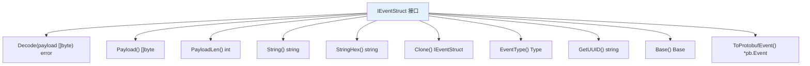

**来源：** [user/event/ievent.go:41-52](https://github.com/gojue/ecapture/blob/0766a93b/user/event/ievent.go#L41-L52)

接口方法各有特定用途：

| 方法 | 用途 |
|------|------|
| `Decode()` | 将 eBPF map 中的二进制载荷反序列化为结构化字段 |
| `Payload()` / `PayloadLen()` | 访问原始数据字节（例如 SSL 明文、SQL 查询） |
| `String()` / `StringHex()` | 格式化事件以供文本输出，有或无十六进制转储 |
| `Clone()` | 创建空实例用于多态事件读取 |
| `EventType()` | 确定路由：`TypeOutput`、`TypeModuleData` 或 `TypeEventProcessor` |
| `GetUUID()` | 生成唯一标识符用于分组相关事件 |
| `Base()` | 提取公共元数据（时间戳、PID、IP 地址）用于文本输出 |
| `ToProtobufEvent()` | 序列化为 protobuf 格式以集成 eCaptureQ GUI |

### 事件类型分类

事件通过 `Type` 枚举分类以控制其处理路径：

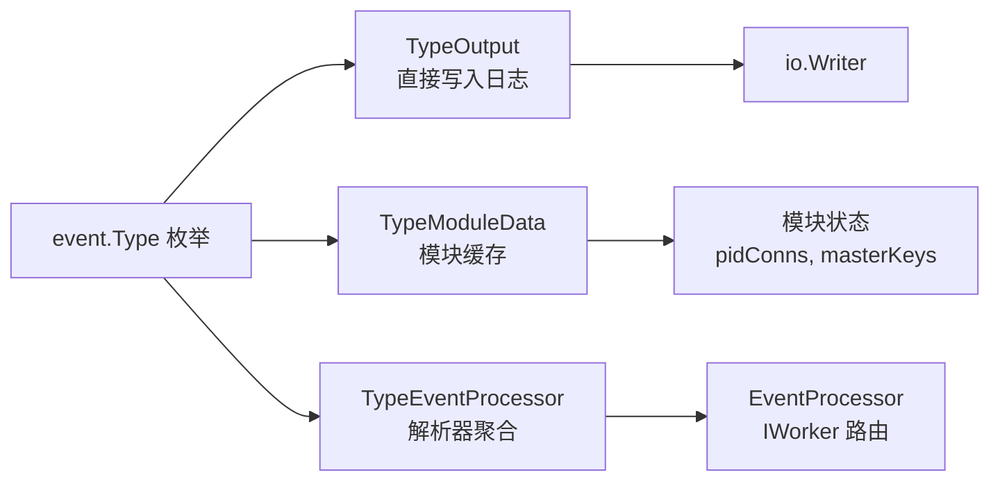

**来源：** [user/event/ievent.go:26-37](https://github.com/gojue/ecapture/blob/0766a93b/user/event/ievent.go#L26-L37)

- **`TypeOutput`** - 直接写入输出而不聚合的事件（例如 Bash 命令、数据库查询）
- **`TypeModuleData`** - 存储在模块状态中用于关联的事件（例如连接元数据、主密钥）
- **`TypeEventProcessor`** - 通过 EventProcessor 路由以进行载荷聚合和解析的事件（例如 SSL 数据事件）

### 具体事件实现

以下图表将事件结构体映射到它们的源模块：

```mermaid
graph TB
    subgraph "TLS 事件"
        SSLDataEvent["SSLDataEvent<br/>OpenSSL/BoringSSL 明文"]
        ConnDataEvent["ConnDataEvent<br/>TCP 连接元数据"]
        MasterSecretEvent["MasterSecretEvent<br/>TLS 1.2 主密钥"]
        MasterSecretBSSLEvent["MasterSecretBSSLEvent<br/>TLS 1.3 BoringSSL 密钥"]
    end
    
    subgraph "TLS 库事件"
        GnutlsDataEvent["GnutlsDataEvent<br/>GnuTLS 明文"]
        NsprDataEvent["NsprDataEvent<br/>NSPR/NSS 明文"]
    end
    
    subgraph "数据库事件"
        MysqldEvent["MysqldEvent<br/>MySQL 查询"]
        PostgresEvent["PostgresEvent<br/>PostgreSQL 查询"]
    end
    
    subgraph "Shell 事件"
        BashEvent["BashEvent<br/>Bash 命令"]
    end
    
    subgraph "网络事件"
        TcSkbEvent["TcSkbEvent<br/>TC 数据包捕获"]
    end
    
    IEventStruct["IEventStruct 接口"]
    
    SSLDataEvent -.->|实现| IEventStruct
    ConnDataEvent -.->|实现| IEventStruct
    MasterSecretEvent -.->|实现| IEventStruct
    MasterSecretBSSLEvent -.->|实现| IEventStruct
    GnutlsDataEvent -.->|实现| IEventStruct
    NsprDataEvent -.->|实现| IEventStruct
    MysqldEvent -.->|实现| IEventStruct
    PostgresEvent -.->|实现| IEventStruct
    BashEvent -.->|实现| IEventStruct
    TcSkbEvent -.->|实现| IEventStruct
```

**来源：** [user/event/event_openssl.go:77-92](https://github.com/gojue/ecapture/blob/0766a93b/user/event/event_openssl.go#L77-L92), [user/event/event_openssl.go:289-294](https://github.com/gojue/ecapture/blob/0766a93b/user/event/event_openssl.go#L289-L294), [user/event/event_masterkey.go:37-55](https://github.com/gojue/ecapture/blob/0766a93b/user/event/event_masterkey.go#L37-L55), [user/event/event_masterkey.go:156-174](https://github.com/gojue/ecapture/blob/0766a93b/user/event/event_masterkey.go#L156-L174), [user/event/event_gnutls.go:25-35](https://github.com/gojue/ecapture/blob/0766a93b/user/event/event_gnutls.go#L25-L35), [user/event/event_nspr.go:26-36](https://github.com/gojue/ecapture/blob/0766a93b/user/event/event_nspr.go#L26-L36), [user/event/event_mysqld.go:68-78](https://github.com/gojue/ecapture/blob/0766a93b/user/event/event_mysqld.go#L68-L78), [user/event/event_postgres.go:38-44](https://github.com/gojue/ecapture/blob/0766a93b/user/event/event_postgres.go#L38-L44), [user/event/event_bash.go:37-47](https://github.com/gojue/ecapture/blob/0766a93b/user/event/event_bash.go#L37-L47), [user/event/event_openssl_tc.go:30-40](https://github.com/gojue/ecapture/blob/0766a93b/user/event/event_openssl_tc.go#L30-L40)

#### SSLDataEvent 结构体

`SSLDataEvent` 是最常用的事件，从 OpenSSL/BoringSSL 捕获 SSL/TLS 明文：

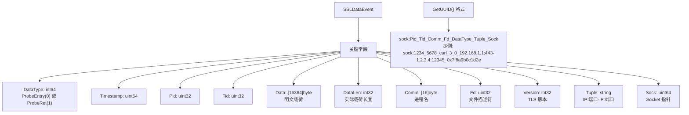

**来源：** [user/event/event_openssl.go:77-92](https://github.com/gojue/ecapture/blob/0766a93b/user/event/event_openssl.go#L77-L92), [user/event/event_openssl.go:138-141](https://github.com/gojue/ecapture/blob/0766a93b/user/event/event_openssl.go#L138-L141)

UUID 格式包含 `sock:` 前缀用于 socket 生命周期管理的 worker（参见 Worker 生命周期管理章节）。

#### ConnDataEvent 结构体

`ConnDataEvent` 提供来自 TC eBPF 钩子的连接元数据：

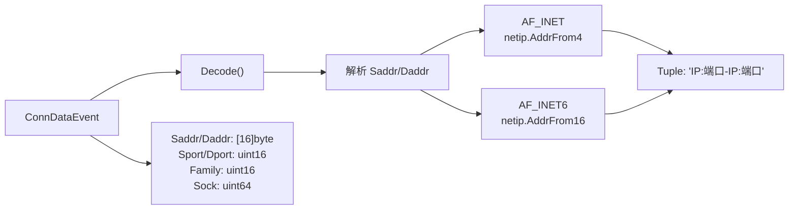

**来源：** [user/event/event_openssl.go:272-308](https://github.com/gojue/ecapture/blob/0766a93b/user/event/event_openssl.go#L272-L308)

### 事件解码过程

事件解码遵循使用 `binary.Read()` 的标准模式：

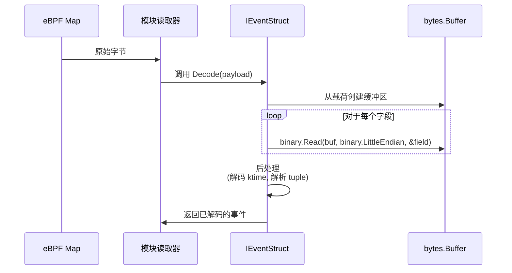

**来源：** [user/event/event_openssl.go:94-132](https://github.com/gojue/ecapture/blob/0766a93b/user/event/event_openssl.go#L94-L132), [user/event/event_bash.go:49-69](https://github.com/gojue/ecapture/blob/0766a93b/user/event/event_bash.go#L49-L69), [user/event/event_mysqld.go:80-109](https://github.com/gojue/ecapture/blob/0766a93b/user/event/event_mysqld.go#L80-L109)

所有事件都使用 `binary.LittleEndian` 以匹配 eBPF 数据布局。包含时间戳的事件调用 `DecodeKtime()` 将内核时间转换为 Unix 纳秒。

## EventProcessor 架构

### 核心组件

`EventProcessor` 管理事件处理流程：

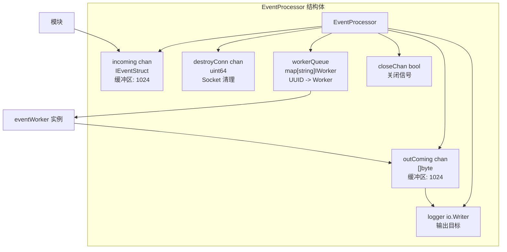

**来源：** [pkg/event_processor/processor.go:30-50](https://github.com/gojue/ecapture/blob/0766a93b/pkg/event_processor/processor.go#L30-L50)

处理器维护：
- **`incoming` 通道** - 从模块接收事件（缓冲区大小 1024）
- **`outComing` 通道** - 格式化输出到日志器（缓冲区大小 1024）
- **`destroyConn` 通道** - Socket 销毁通知
- **`workerQueue` 映射** - UUID 到 worker 的映射用于事件路由
- **`logger` io.Writer** - 输出目标（控制台、文件或 CollectorWriter）

### 事件调度流程

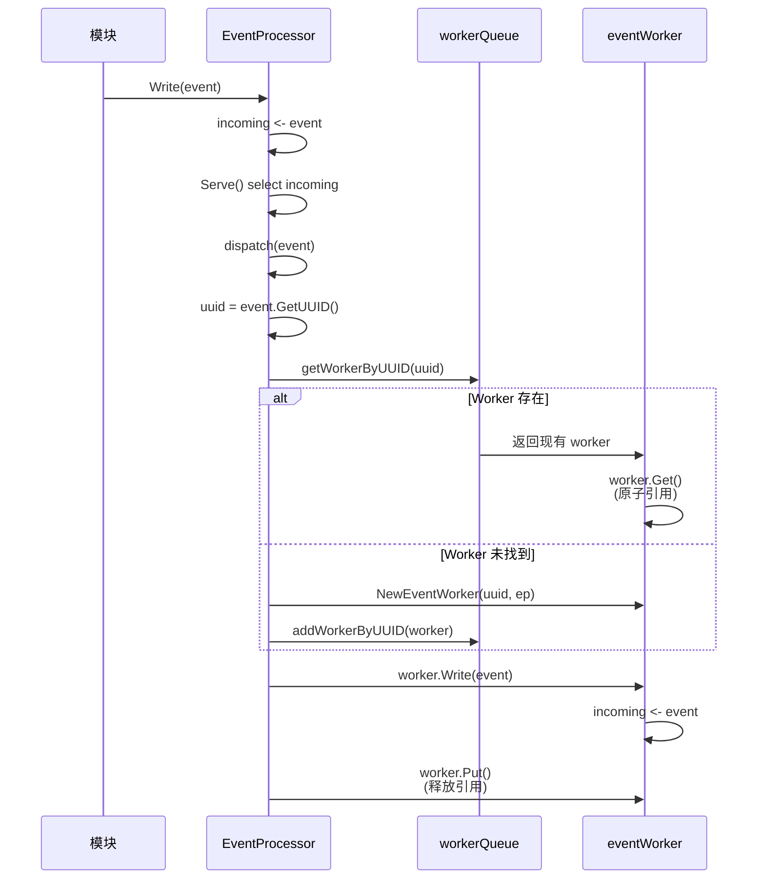

**来源：** [pkg/event_processor/processor.go:66-109](https://github.com/gojue/ecapture/blob/0766a93b/pkg/event_processor/processor.go#L66-L109), [pkg/event_processor/processor.go:130-148](https://github.com/gojue/ecapture/blob/0766a93b/pkg/event_processor/processor.go#L130-L148)

关键方面：
1. **基于 UUID 的路由** - `GetUUID()` 将相关事件分组到同一个 worker
2. **延迟 worker 创建** - Worker 在 UUID 的第一个事件时创建
3. **引用计数** - `Get()`/`Put()` 防止删除期间的竞态条件
4. **非阻塞写入** - 如果 incoming 通道已满则丢弃事件

## Worker 系统

### IWorker 接口

Worker 聚合事件并调用解析器：

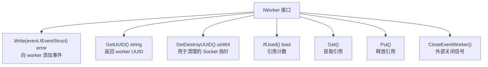

**来源：** [pkg/event_processor/iworker.go:35-49](https://github.com/gojue/ecapture/blob/0766a93b/pkg/event_processor/iworker.go#L35-L49)

### eventWorker 实现

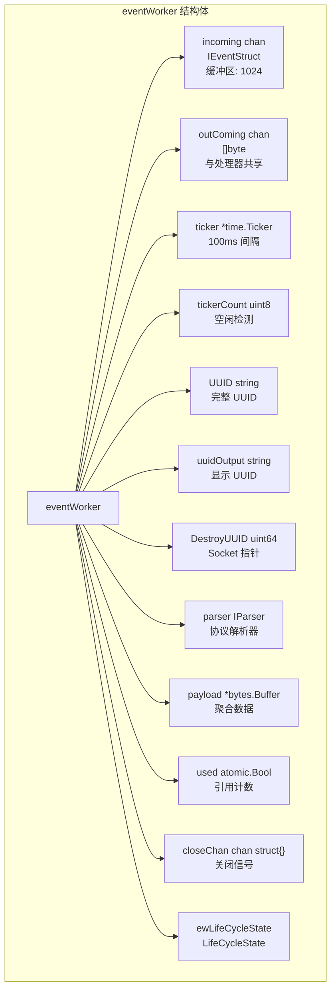

**来源：** [pkg/event_processor/iworker.go:70-89](https://github.com/gojue/ecapture/blob/0766a93b/pkg/event_processor/iworker.go#L70-L89)

### Worker 生命周期管理

Worker 基于 UUID 前缀支持两种生命周期模式：

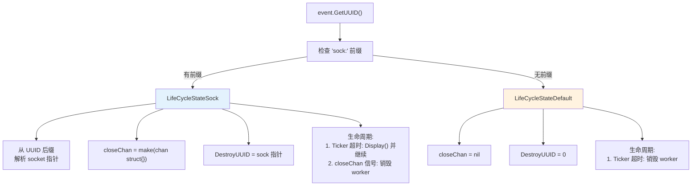

**来源：** [pkg/event_processor/iworker.go:57-63](https://github.com/gojue/ecapture/blob/0766a93b/pkg/event_processor/iworker.go#L57-L63), [pkg/event_processor/iworker.go:100-123](https://github.com/gojue/ecapture/blob/0766a93b/pkg/event_processor/iworker.go#L100-L123)

**LifeCycleStateDefault:**
- 当 UUID 不以 `sock:` 开头时使用
- Worker 在空闲超时后销毁（1 秒 = 10 次 tick × 100ms）
- 示例：Bash 事件、MySQL 查询，UUID 为 `PID_TID_Comm`

**LifeCycleStateSock:**
- 当 UUID 以 `sock:` 前缀开头时使用
- Worker 在空闲期间持续存在
- 仅在 socket 关闭时销毁（外部 `CloseEventWorker()` 调用）
- 示例：SSL 数据事件，UUID 为 `sock:PID_TID_Comm_Fd_DataType_Tuple_Sock`
- `DestroyUUID` 包含用于清理匹配的 socket 指针

### Worker 事件循环

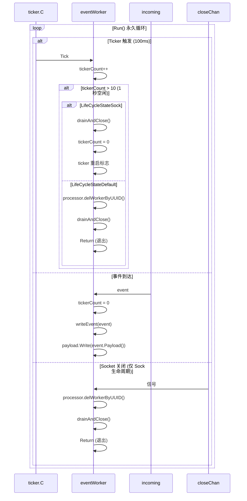

**来源：** [pkg/event_processor/iworker.go:262-306](https://github.com/gojue/ecapture/blob/0766a93b/pkg/event_processor/iworker.go#L262-L306)

关键行为：
- **Ticker 重置** - 每个事件到达时重置（`tickerCount = 0`）
- **载荷聚合** - 事件在 `payload` 缓冲区中累积
- **空闲超时** - 10 次 tick（1 秒）无事件触发生命周期操作
- **Socket 生命周期** - 来自外部 socket 销毁的 `closeChan` 信号

### 事件显示与解析

当 worker 准备输出时（超时或 socket 关闭），它调用显示流程：

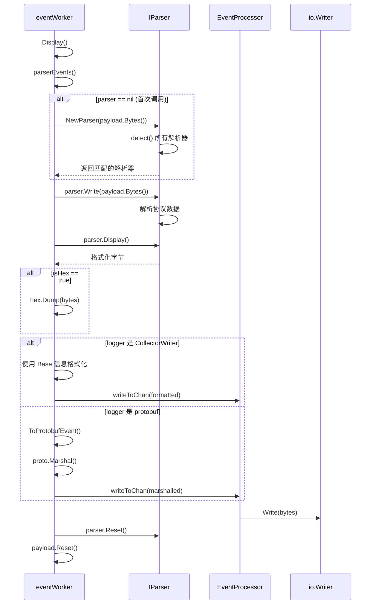

**来源：** [pkg/event_processor/iworker.go:175-228](https://github.com/gojue/ecapture/blob/0766a93b/pkg/event_processor/iworker.go#L175-L228), [pkg/event_processor/iworker.go:248-260](https://github.com/gojue/ecapture/blob/0766a93b/pkg/event_processor/iworker.go#L248-L260)

显示过程：
1. 聚合的载荷传递给解析器
2. 解析器检测协议并格式化输出
3. 基于日志器类型（文本 vs protobuf）格式化输出
4. Worker 状态重置以备下一批

## 解析器系统

### IParser 接口

解析器检测和格式化应用协议：

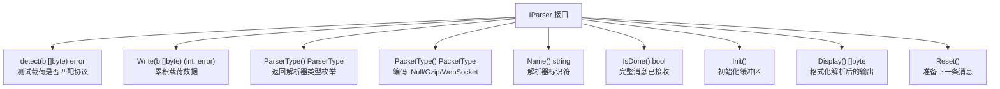

**来源：** [pkg/event_processor/iparser.go:49-60](https://github.com/gojue/ecapture/blob/0766a93b/pkg/event_processor/iparser.go#L49-L60)

### 解析器类型

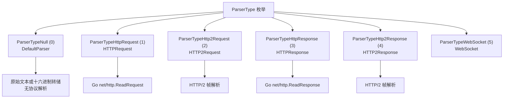

**来源：** [pkg/event_processor/iparser.go:40-47](https://github.com/gojue/ecapture/blob/0766a93b/pkg/event_processor/iparser.go#L40-L47)

### 解析器选择

`NewParser()` 函数自动检测协议：

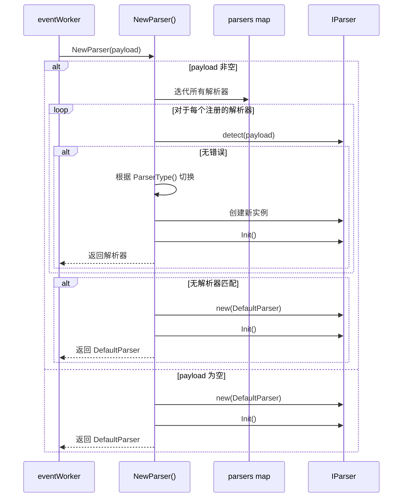

**来源：** [pkg/event_processor/iparser.go:85-115](https://github.com/gojue/ecapture/blob/0766a93b/pkg/event_processor/iparser.go#L85-L115)

检测顺序：
1. 尝试每个注册解析器的 `detect()` 方法
2. 第一个成功匹配创建类型化解析器实例
3. 如果无匹配则回退到 `DefaultParser`

### 解析器注册

解析器在包初始化期间自注册：

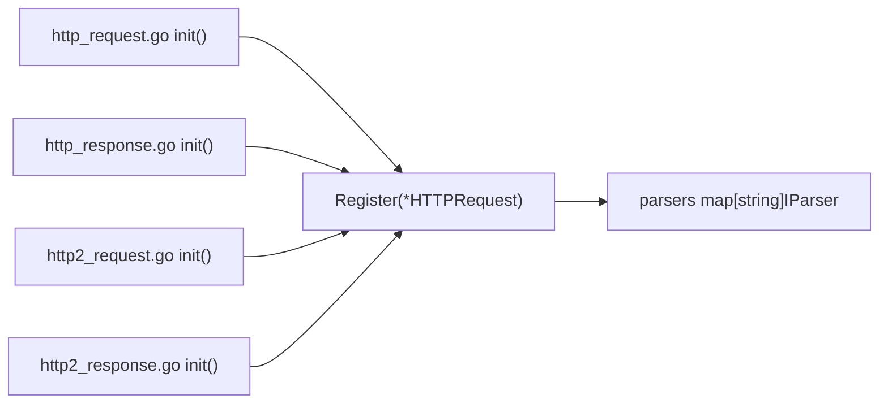

**来源：** [pkg/event_processor/http_request.go:159-163](https://github.com/gojue/ecapture/blob/0766a93b/pkg/event_processor/http_request.go#L159-L163), [pkg/event_processor/http_response.go:177-181](https://github.com/gojue/ecapture/blob/0766a93b/pkg/event_processor/http_response.go#L177-L181), [pkg/event_processor/iparser.go:64-73](https://github.com/gojue/ecapture/blob/0766a93b/pkg/event_processor/iparser.go#L64-L73)

### HTTP 请求解析器

`HTTPRequest` 解析器处理 HTTP/1.x 请求：

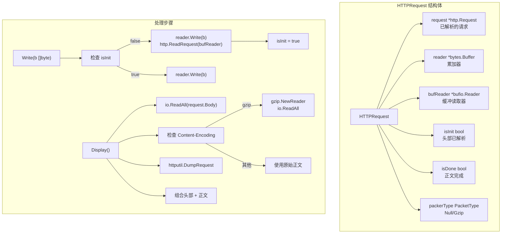

**来源：** [pkg/event_processor/http_request.go:28-35](https://github.com/gojue/ecapture/blob/0766a93b/pkg/event_processor/http_request.go#L28-L35), [pkg/event_processor/http_request.go:54-81](https://github.com/gojue/ecapture/blob/0766a93b/pkg/event_processor/http_request.go#L54-L81), [pkg/event_processor/http_request.go:105-157](https://github.com/gojue/ecapture/blob/0766a93b/pkg/event_processor/http_request.go#L105-L157)

关键特性：
- **增量解析** - 头部完成时调用一次 `http.ReadRequest()`
- **正文累积** - 额外写入追加到正文缓冲区
- **Gzip 解压** - 自动处理 `Content-Encoding: gzip`
- **HTTP/2 检测** - 如果 `Proto == "HTTP/2.0"` 则返回原始字节

### HTTP 响应解析器

类似于请求解析器，但使用 `http.ReadResponse()`：

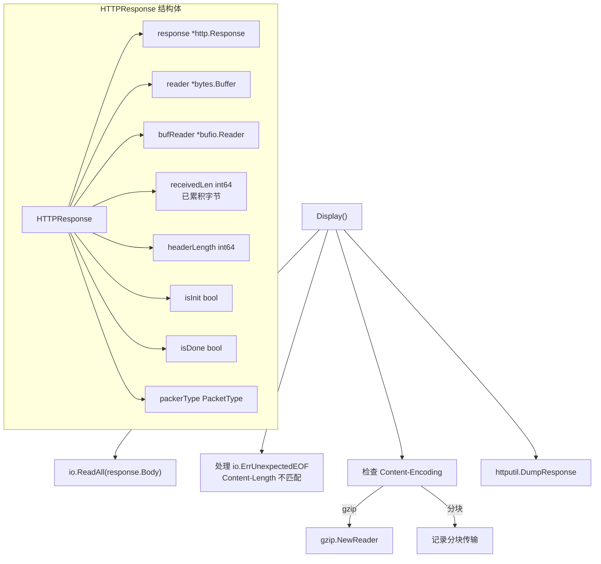

**来源：** [pkg/event_processor/http_response.go:28-37](https://github.com/gojue/ecapture/blob/0766a93b/pkg/event_processor/http_response.go#L28-L37), [pkg/event_processor/http_response.go:58-92](https://github.com/gojue/ecapture/blob/0766a93b/pkg/event_processor/http_response.go#L58-L92), [pkg/event_processor/http_response.go:115-175](https://github.com/gojue/ecapture/blob/0766a93b/pkg/event_processor/http_response.go#L115-L175)

响应解析器处理：
- **分块编码** - 通过 `ContentLength < 0` 检测
- **截断的响应** - 优雅处理 `ErrUnexpectedEOF`
- **Content-Length 不匹配** - 记录警告用于调试

### DefaultParser

非 HTTP 协议的回退解析器：

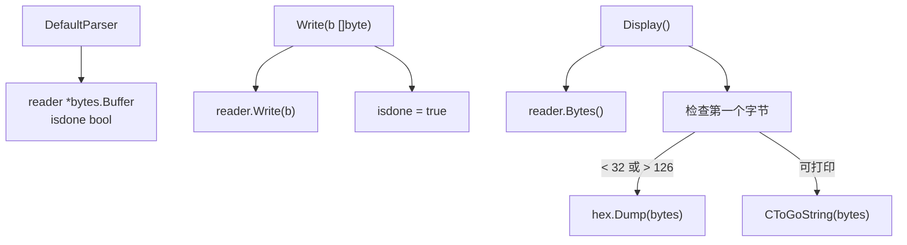

**来源：** [pkg/event_processor/iparser.go:117-166](https://github.com/gojue/ecapture/blob/0766a93b/pkg/event_processor/iparser.go#L117-L166)

DefaultParser：
- 立即累积所有数据（`isdone = true`）
- 自动检测二进制 vs 文本（检查第一个字节）
- 对不可打印数据使用十六进制转储
- 从 C 字符串中去除空终止符

## 完整事件流程示例

### TLS 捕获流程

```mermaid
sequenceDiagram
    participant eBPF as SSL_read uprobe
    participant PerfMap as perfEventMap
    participant Module as MOpenSSLProbe
    participant EP as EventProcessor
    participant EW as eventWorker
    participant Parser as HTTPRequest
    participant Logger as io.Writer
    
    eBPF->>PerfMap: SSL 数据事件
    Module->>PerfMap: perfReader.Read()
    Module->>Module: SSLDataEvent.Decode()
    Module->>Module: GetUUID()<br/>sock:1234_5678_curl_3_0_IP:Port_Sock
    
    Module->>EP: eventProcessor.Write(event)
    EP->>EP: incoming <- event
    EP->>EP: Serve() dispatch(event)
    
    EP->>EW: getWorkerByUUID() 或 NewEventWorker()
    EP->>EW: worker.Write(event)
    EW->>EW: incoming <- event
    
    EW->>EW: Run() select incoming
    EW->>EW: tickerCount = 0
    EW->>EW: writeEvent(event)
    EW->>EW: payload.Write(event.Payload())
    
    Note over EW: 等待超时或 socket 关闭
    
    EW->>EW: Ticker 触发 (检测到空闲)
    EW->>EW: Display()
    EW->>EW: parserEvents()
    
    EW->>Parser: NewParser(payload.Bytes())
    Parser->>Parser: detect() -> HTTPRequest
    EW->>Parser: parser.Write(payload.Bytes())
    Parser->>Parser: http.ReadRequest()
    EW->>Parser: parser.Display()
    Parser->>Parser: httputil.DumpRequest()
    Parser-->>EW: 格式化字节
    
    EW->>EP: outComing <- formatted
    EP->>Logger: logger.Write(formatted)
    
    EW->>Parser: parser.Reset()
    EW->>EW: payload.Reset()
```

**来源：** [pkg/event_processor/processor.go:66-109](https://github.com/gojue/ecapture/blob/0766a93b/pkg/event_processor/processor.go#L66-L109), [pkg/event_processor/iworker.go:262-306](https://github.com/gojue/ecapture/blob/0766a93b/pkg/event_processor/iworker.go#L262-L306), [pkg/event_processor/iworker.go:175-228](https://github.com/gojue/ecapture/blob/0766a93b/pkg/event_processor/iworker.go#L175-L228), [pkg/event_processor/iparser.go:85-115](https://github.com/gojue/ecapture/blob/0766a93b/pkg/event_processor/iparser.go#L85-L115)

## 输出格式化

### 文本模式

对于 `CollectorWriter` 日志器：

```mermaid
graph TB
    Display["eventWorker.Display()"]
    
    Display --> GetBase["originEvent.Base()"]
    GetBase --> Metadata["PID, Comm<br/>SrcIP:SrcPort<br/>DstIP:DstPort"]
    
    Display --> GetType["parser.ParserType()"]
    Display --> GetPayload["parser.Display()"]
    
    Display --> CheckHex["检查 isHex 标志"]
    CheckHex -->|true| HexDump["hex.Dump(payload)"]
    CheckHex -->|false| Raw["使用原始载荷"]
    
    Display --> Format["fmt.Fprintf()"]
    Format --> Output["PID:123, Comm:curl, Src:IP:Port, Dest:IP:Port,<br/>Payload:<br/>GET / HTTP/1.1..."]
```

**来源：** [pkg/event_processor/iworker.go:175-228](https://github.com/gojue/ecapture/blob/0766a93b/pkg/event_processor/iworker.go#L175-L228)

### Protobuf 模式

对于 protobuf 日志器（eCaptureQ GUI）：

```mermaid
graph TB
    Display["eventWorker.Display()"]
    
    Display --> CreateLogEntry["new(pb.LogEntry)"]
    Display --> SetType["LogType = LOG_TYPE_EVENT"]
    
    Display --> ToProto["originEvent.ToProtobufEvent()"]
    ToProto --> ProtoEvent["pb.Event{<br/>  Timestamp, UUID, PID, Pname,<br/>  SrcIP, SrcPort, DstIP, DstPort<br/>}"]
    
    Display --> SetPayload["ep.Payload = parser.Display()"]
    Display --> SetMeta["ep.Type = parser.ParserType()<br/>ep.Length = len(payload)"]
    
    Display --> Marshal["proto.Marshal(logEntry)"]
    Display --> WriteChan["outComing <- marshalled"]
```

**来源：** [pkg/event_processor/iworker.go:214-227](https://github.com/gojue/ecapture/blob/0766a93b/pkg/event_processor/iworker.go#L214-L227)

## 事件截断

EventProcessor 支持载荷截断：

```mermaid
graph TB
    writeEvent["eventWorker.writeEvent()"]
    
    writeEvent --> CheckSize["truncateSize > 0?"]
    CheckSize -->|false| Append["payload.Write(event.Payload())"]
    
    CheckSize -->|true| CheckLen["payload.Len() >= truncateSize?"]
    CheckLen -->|false| Append
    CheckLen -->|true| Truncate["payload.Truncate(truncateSize)"]
    Truncate --> Log["记录 '事件已截断，大小: N 字节'"]
    Truncate --> Return["Return (不写入)"]
```

**来源：** [pkg/event_processor/iworker.go:230-245](https://github.com/gojue/ecapture/blob/0766a93b/pkg/event_processor/iworker.go#L230-L245)

截断防止大型载荷造成过度内存使用（可通过 `--truncate` 标志配置）。

## 错误处理

### Event Worker 错误

Worker 使用错误通道处理非致命错误：

```mermaid
graph TB
    Error["发生错误"]
    
    Error --> Type1["ErrEventWorkerIncomingFull"]
    Error --> Type2["ErrEventWorkerOutcomingFull"]
    Error --> Type3["解析器写入错误"]
    
    Type1 --> Log1["事件已丢弃<br/>incoming 通道已满"]
    Type2 --> Log2["输出已丢弃<br/>outComing 通道已满"]
    Type3 --> Log3["解析器错误已记录<br/>继续处理"]
    
    All["所有错误"] --> EP["EventProcessor.errChan"]
    EP --> Caller["模块决定<br/>是否继续"]
```

**来源：** [pkg/event_processor/iworker.go:66-68](https://github.com/gojue/ecapture/blob/0766a93b/pkg/event_processor/iworker.go#L66-L68), [pkg/event_processor/processor.go:72-79](https://github.com/gojue/ecapture/blob/0766a93b/pkg/event_processor/processor.go#L72-L79)

关键错误行为：
- **非阻塞通道** - 如果缓冲区已满则丢弃事件而不是阻塞
- **解析器错误** - 已记录但不停止处理
- **Worker panic** - `Get()`/`Put()` panic 表示使用不正确

### Socket 生命周期清理

基于 socket 的 worker 通过 `destroyConn` 通道清理：

```mermaid
sequenceDiagram
    participant TC as TC eBPF
    participant Module as 模块
    participant EP as EventProcessor
    participant EW as eventWorker
    
    TC->>Module: ConnDataEvent<br/>IsDestroy=1
    Module->>Module: GetSockPointer()
    Module->>EP: WriteDestroyConn(sockPtr)
    
    EP->>EP: destroyConn <- sockPtr
    EP->>EP: Serve() select destroyConn
    EP->>EP: destroyWorkers(sockPtr)
    
    loop 对于每个 worker
        EP->>EW: GetDestroyUUID()
        
        alt 找到匹配
            EP->>EW: CloseEventWorker()
            EW->>EW: close(closeChan)
            EW->>EW: Run() 接收关闭信号
            EW->>EW: drainAndClose()
            EW->>EP: delWorkerByUUID()
        end
    end
```

**来源：** [pkg/event_processor/processor.go:177-185](https://github.com/gojue/ecapture/blob/0766a93b/pkg/event_processor/processor.go#L177-L185), [pkg/event_processor/processor.go:115-128](https://github.com/gojue/ecapture/blob/0766a93b/pkg/event_processor/processor.go#L115-L128), [pkg/event_processor/iworker.go:142-148](https://github.com/gojue/ecapture/blob/0766a93b/pkg/event_processor/iworker.go#L142-L148)

此机制确保关闭 socket 的 worker 被正确清理，防止内存泄漏。

## 总结

事件处理系统提供：

1. **强类型** 通过 `IEventStruct` 接口实现类型安全的事件处理
2. **基于 UUID 的路由** 将相关事件聚合到 worker 中
3. **双生命周期模式** 实现高效的资源管理
4. **自动协议检测** 和解析 HTTP/1.x 与 HTTP/2
5. **多种输出格式** 支持文本、十六进制和 protobuf
6. **优雅的错误处理** 采用非阻塞通道和事件丢弃机制

此架构使 eCapture 能够处理来自多个 eBPF 程序的大量事件流，同时维护适合人类和机器消费的结构化输出。