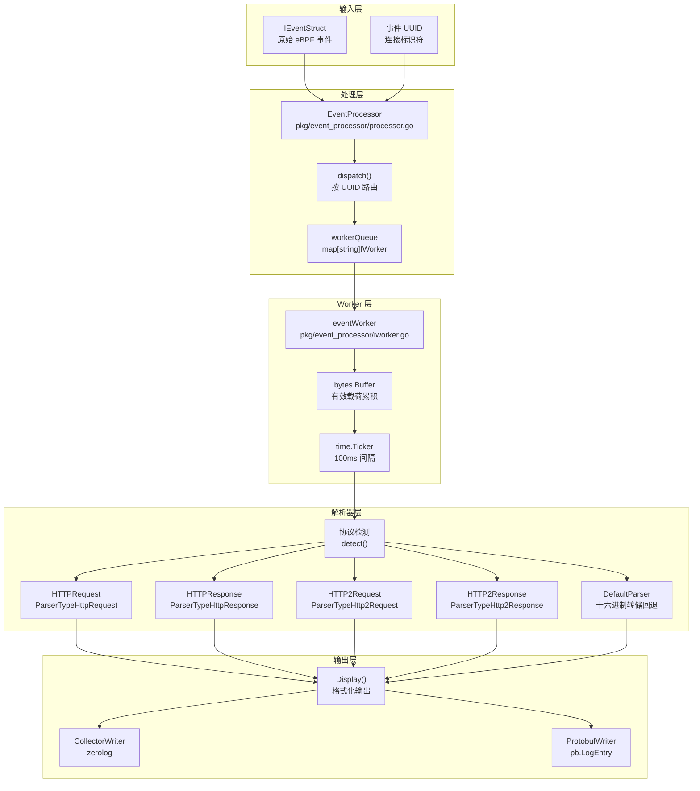
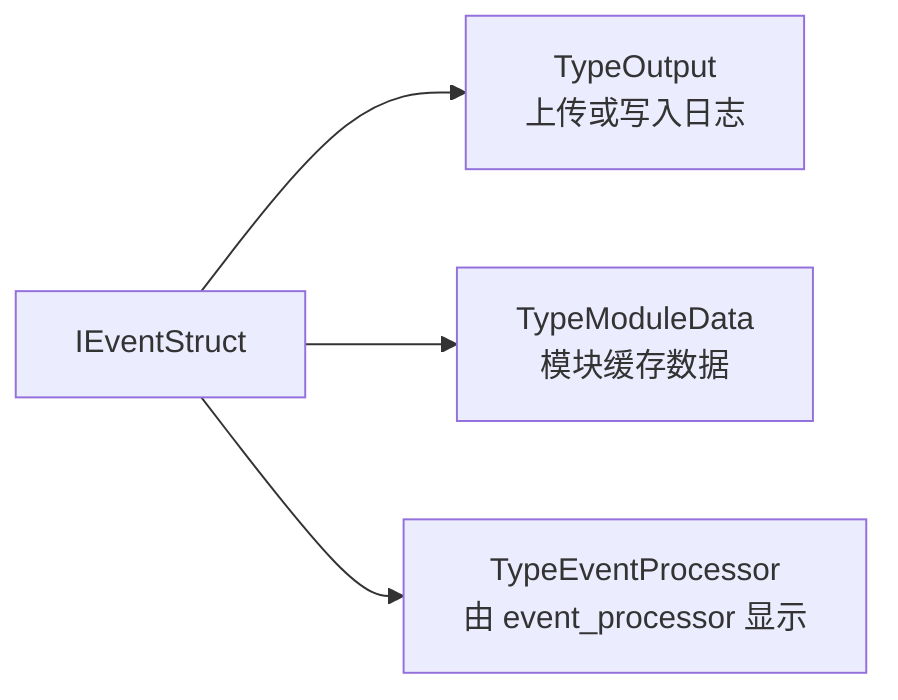
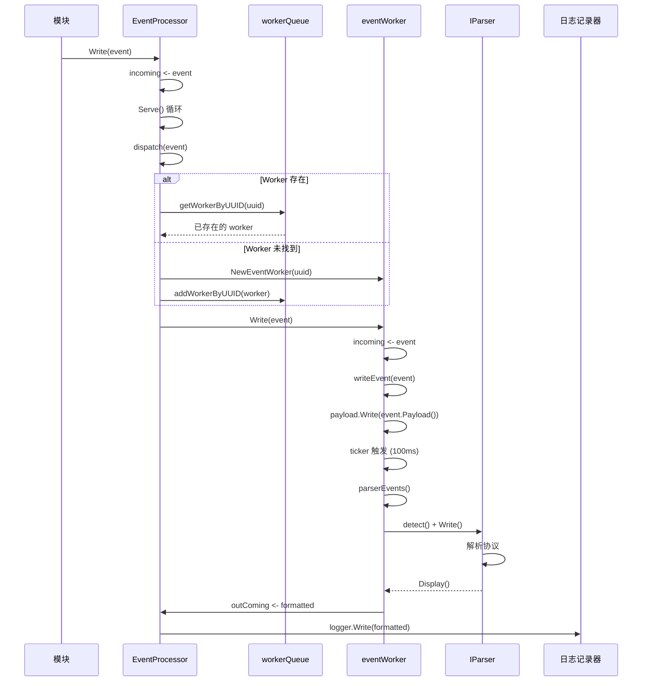
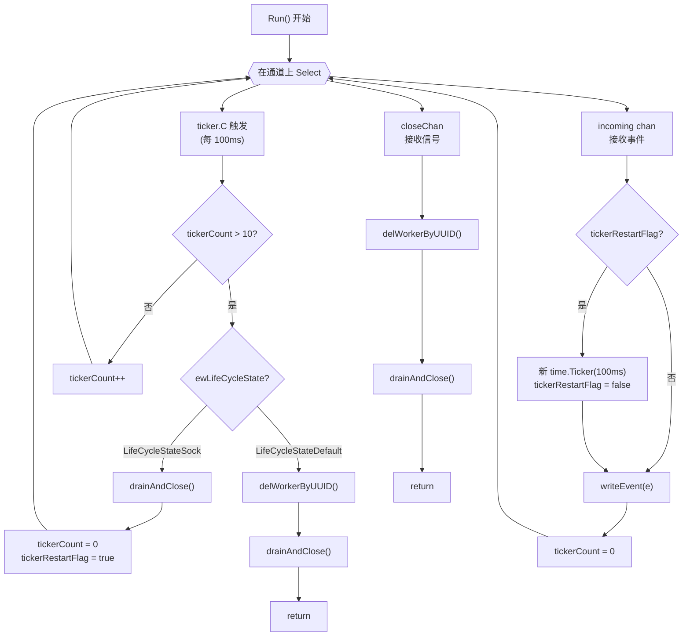
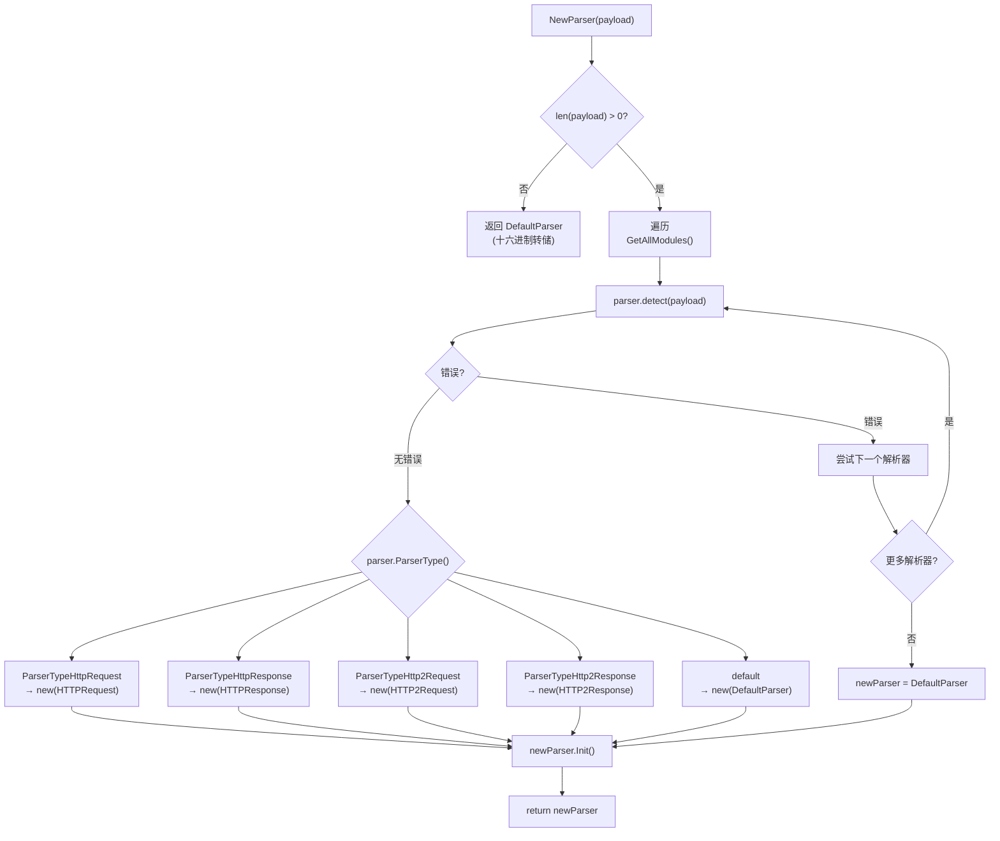
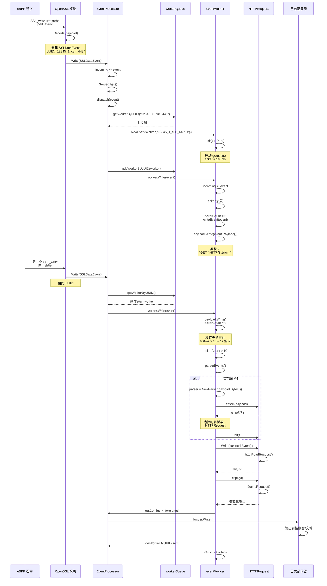

# 事件处理与解析器

本文档为使用 eCapture 事件处理系统和解析器的开发人员提供全面指南。内容涵盖事件处理架构、解析器系统、协议检测机制，以及添加新事件类型和实现自定义解析器的分步说明。

有关事件结构和类型本身的信息，请参见[事件结构与类型](../2-architecture/2.3-event-structures-and-types.md)。有关更广泛的事件处理流程架构，请参见[事件处理流程](../2-architecture/2.2-event-processing-pipeline.md)。有关特定协议的解析实现，请参见[协议解析](../2-architecture/2.8-protocol-parsing.md)。

---

## 事件处理架构概述

事件处理系统将原始 eBPF 事件转换为格式化的、协议感知的输出。该系统由三个主要层次组成：


```mermaid
graph TB
    subgraph "输入层"
        EVENT["IEventStruct<br/>原始 eBPF 事件"]
        UUID["事件 UUID<br/>连接标识符"]
    end
    
    subgraph "处理层"
        EP["EventProcessor<br/>pkg/event_processor/processor.go"]
        DISPATCH["dispatch()<br/>按 UUID 路由"]
        QUEUE["workerQueue<br/>map[string]IWorker"]
    end
    
    subgraph "Worker 层"
        EW["eventWorker<br/>pkg/event_processor/iworker.go"]
        BUFFER["bytes.Buffer<br/>有效载荷累积"]
        TICKER["time.Ticker<br/>100ms 间隔"]
    end
    
    subgraph "解析器层"
        DETECT["协议检测<br/>detect()"]
        HTTP_REQ["HTTPRequest<br/>ParserTypeHttpRequest"]
        HTTP_RES["HTTPResponse<br/>ParserTypeHttpResponse"]
        HTTP2_REQ["HTTP2Request<br/>ParserTypeHttp2Request"]
        HTTP2_RES["HTTP2Response<br/>ParserTypeHttp2Response"]
        DEFAULT["DefaultParser<br/>十六进制转储回退"]
    end
    
    subgraph "输出层"
        DISPLAY["Display()<br/>格式化输出"]
        COLLECTOR["CollectorWriter<br/>zerolog"]
        PROTOBUF["ProtobufWriter<br/>pb.LogEntry"]
    end
    
    EVENT --> EP
    UUID --> EP
    EP --> DISPATCH
    DISPATCH --> QUEUE
    QUEUE --> EW
    
    EW --> BUFFER
    BUFFER --> TICKER
    TICKER --> DETECT
    
    DETECT --> HTTP_REQ
    DETECT --> HTTP_RES
    DETECT --> HTTP2_REQ
    DETECT --> HTTP2_RES
    DETECT --> DEFAULT
    
    HTTP_REQ --> DISPLAY
    HTTP_RES --> DISPLAY
    HTTP2_REQ --> DISPLAY
    HTTP2_RES --> DISPLAY
    DEFAULT --> DISPLAY
    
    DISPLAY --> COLLECTOR
    DISPLAY --> PROTOBUF
```

**来源：** [pkg/event_processor/processor.go:1-216](https://github.com/gojue/ecapture/blob/ca085d05/pkg/event_processor/processor.go#L1-L216), [pkg/event_processor/iworker.go:1-366](https://github.com/gojue/ecapture/blob/ca085d05/pkg/event_processor/iworker.go#L1-L366), [pkg/event_processor/iparser.go:1-167](https://github.com/gojue/ecapture/blob/ca085d05/pkg/event_processor/iparser.go#L1-L167)

---

## 事件结构 (IEventStruct)

所有进入处理系统的事件都实现了 `IEventStruct` 接口，该接口为事件处理提供了标准契约。

### IEventStruct 接口

该接口定义在 [user/event/ievent.go:41-52](https://github.com/gojue/ecapture/blob/ca085d05/user/event/ievent.go#L41-L52)：

| 方法 | 返回类型 | 用途 |
|--------|-------------|---------|
| `Decode(payload []byte)` | `error` | 将原始 eBPF 数据反序列化为结构化事件 |
| `Payload()` | `[]byte` | 返回事件有效载荷数据 |
| `PayloadLen()` | `int` | 返回有效载荷长度 |
| `String()` | `string` | 返回人类可读的表示形式 |
| `StringHex()` | `string` | 返回十六进制转储表示形式 |
| `Clone()` | `IEventStruct` | 创建事件的深拷贝 |
| `EventType()` | `Type` | 返回事件分类（Output、ModuleData、EventProcessor） |
| `GetUUID()` | `string` | 返回唯一连接标识符 |
| `Base()` | `Base` | 返回基础元数据（PID、IP、端口等） |
| `ToProtobufEvent()` | `*pb.Event` | 转换为 protobuf 格式以进行序列化 |

### 事件类型

事件按其预期处理路径进行分类 [user/event/ievent.go:26-37](https://github.com/gojue/ecapture/blob/ca085d05/user/event/ievent.go#L26-L37)：


```mermaid
graph LR
    EVENT["IEventStruct"] --> OUTPUT["TypeOutput<br/>上传或写入日志"]
    EVENT --> MODULE["TypeModuleData<br/>模块缓存数据"]
    EVENT --> PROCESSOR["TypeEventProcessor<br/>由 event_processor 显示"]
```

**来源：** [user/event/ievent.go:15-71](https://github.com/gojue/ecapture/blob/ca085d05/user/event/ievent.go#L15-L71)

---

## EventProcessor 组件

`EventProcessor` 是接收来自模块的事件并将其路由到适当 worker 的中央协调器。它维护一个 worker 池，每个 worker 负责处理来自特定连接的事件。

### EventProcessor 结构

来自 [pkg/event_processor/processor.go:30-50](https://github.com/gojue/ecapture/blob/ca085d05/pkg/event_processor/processor.go#L30-L50) 的关键字段：

| 字段 | 类型 | 用途 |
|-------|------|---------|
| `incoming` | `chan event.IEventStruct` | 从模块接收新事件（缓冲区：1024） |
| `outComing` | `chan []byte` | 向日志记录器发送格式化输出（缓冲区：1024） |
| `destroyConn` | `chan uint64` | 发送套接字销毁信号以进行清理（缓冲区：1024） |
| `workerQueue` | `map[string]IWorker` | 将 UUID 映射到 worker 实例 |
| `logger` | `io.Writer` | 输出目标（控制台、文件、WebSocket） |
| `isHex` | `bool` | 是否以十六进制格式输出 |
| `truncateSize` | `uint64` | 截断前的最大有效载荷大小 |
| `closeChan` | `chan bool` | 关闭信号 |
| `errChan` | `chan error` | 错误报告通道（缓冲区：16） |

### 事件处理流程


```mermaid
sequenceDiagram
    participant Module as 模块
    participant EP as EventProcessor
    participant Queue as workerQueue
    participant Worker as eventWorker
    participant Parser as IParser
    participant Logger as 日志记录器
    
    Module->>EP: Write(event)
    EP->>EP: incoming <- event
    EP->>EP: Serve() 循环
    EP->>EP: dispatch(event)
    
    alt Worker 存在
        EP->>Queue: getWorkerByUUID(uuid)
        Queue-->>EP: 已存在的 worker
    else Worker 未找到
        EP->>Worker: NewEventWorker(uuid)
        EP->>Queue: addWorkerByUUID(worker)
    end
    
    EP->>Worker: Write(event)
    Worker->>Worker: incoming <- event
    Worker->>Worker: writeEvent(event)
    Worker->>Worker: payload.Write(event.Payload())
    
    Worker->>Worker: ticker 触发 (100ms)
    Worker->>Worker: parserEvents()
    Worker->>Parser: detect() + Write()
    Parser->>Parser: 解析协议
    Parser-->>Worker: Display()
    
    Worker->>EP: outComing <- formatted
    EP->>Logger: logger.Write(formatted)
```

### EventProcessor 方法

**核心方法：**

- **`Write(e event.IEventStruct)`** [pkg/event_processor/processor.go:165-175](https://github.com/gojue/ecapture/blob/ca085d05/pkg/event_processor/processor.go#L165-L175) - 向处理队列添加事件的外部入口点
- **`Serve() error`** [pkg/event_processor/processor.go:66-89](https://github.com/gojue/ecapture/blob/ca085d05/pkg/event_processor/processor.go#L66-L89) - 处理传入事件、销毁信号和输出的主事件循环
- **`dispatch(e event.IEventStruct) error`** [pkg/event_processor/processor.go:91-109](https://github.com/gojue/ecapture/blob/ca085d05/pkg/event_processor/processor.go#L91-L109) - 根据 UUID 将事件路由到 worker
- **`WriteDestroyConn(s uint64)`** [pkg/event_processor/processor.go:177-185](https://github.com/gojue/ecapture/blob/ca085d05/pkg/event_processor/processor.go#L177-L185) - 发出套接字已被销毁及其 worker 应被清理的信号
- **`Close() error`** [pkg/event_processor/processor.go:187-200](https://github.com/gojue/ecapture/blob/ca085d05/pkg/event_processor/processor.go#L187-L200) - 优雅地关闭处理器

**Worker 管理：**

- **`getWorkerByUUID(uuid string)`** [pkg/event_processor/processor.go:130-141](https://github.com/gojue/ecapture/blob/ca085d05/pkg/event_processor/processor.go#L130-L141) - 带引用计数的线程安全检索
- **`addWorkerByUUID(worker IWorker)`** [pkg/event_processor/processor.go:143-148](https://github.com/gojue/ecapture/blob/ca085d05/pkg/event_processor/processor.go#L143-L148) - 线程安全的 worker 注册
- **`delWorkerByUUID(worker IWorker)`** [pkg/event_processor/processor.go:151-155](https://github.com/gojue/ecapture/blob/ca085d05/pkg/event_processor/processor.go#L151-L155) - 线程安全的 worker 移除
- **`destroyWorkers(destroyUUID uint64)`** [pkg/event_processor/processor.go:115-128](https://github.com/gojue/ecapture/blob/ca085d05/pkg/event_processor/processor.go#L115-L128) - 关闭与已销毁套接字相关联的 worker

**来源：** [pkg/event_processor/processor.go:1-216](https://github.com/gojue/ecapture/blob/ca085d05/pkg/event_processor/processor.go#L1-L216)

---

## Worker 系统 (IWorker)

每个 `eventWorker` 处理单个连接（由 UUID 标识）的事件，累积有效载荷片段并在适当时触发解析。

### IWorker 接口

定义在 [pkg/event_processor/iworker.go:35-49](https://github.com/gojue/ecapture/blob/ca085d05/pkg/event_processor/iworker.go#L35-L49)：

```go
type IWorker interface {
    Write(event.IEventStruct) error      // 向处理队列添加事件
    GetUUID() string                      // 返回 worker 的 UUID
    GetDestroyUUID() uint64               // 返回用于生命周期跟踪的套接字 ID
    IfUsed() bool                         // 检查 worker 当前是否被引用
    Get()                                 // 增加引用计数
    Put()                                 // 减少引用计数
    CloseEventWorker()                    // 发信号通知 worker 关闭
}
```

### Worker 生命周期模型

Worker 支持两种不同的生命周期模型 [pkg/event_processor/iworker.go:57-63](https://github.com/gojue/ecapture/blob/ca085d05/pkg/event_processor/iworker.go#L57-L63)：

**1. LifeCycleStateDefault（自我管理）**
- 在第一个事件到达时创建
- 在 `MaxTickerCount`（10 × 100ms = 1 秒）不活动后自我销毁
- `closeChan` 为 `nil`
- 用于短期连接

**2. LifeCycleStateSock（套接字绑定）**
- 为 UUID 前缀为 `sock:` 的事件创建 [user/event/ievent.go:39](https://github.com/gojue/ecapture/blob/ca085d05/user/event/ievent.go#L39)
- 持续存在直到显式调用 `CloseEventWorker()`
- `closeChan` 为非 nil
- Worker 从 UUID 提取套接字 ID：`sock:Pid_Tid_Comm_Fd_DataType_Tuple_Sock`
- 用于长期套接字连接

```mermaid
stateDiagram-v2
    [*] --> Created: NewEventWorker()
    
    Created --> Default: UUID 无 "sock:" 前缀
    Created --> Socket: UUID 有 "sock:" 前缀
    
    Default --> Accumulating: Write(event)
    Accumulating --> Accumulating: 更多事件到达
    Accumulating --> Parsing: Ticker 触发 (100ms)
    Parsing --> Accumulating: 未空闲 (tickerCount < 10)
    Parsing --> Destroyed: 空闲超时 (tickerCount >= 10)
    
    Socket --> AccumulatingSock: Write(event)
    AccumulatingSock --> AccumulatingSock: 更多事件到达
    AccumulatingSock --> ParsingSock: Ticker 触发 (100ms)
    ParsingSock --> AccumulatingSock: 未空闲
    ParsingSock --> DrainSock: 空闲超时
    DrainSock --> AccumulatingSock: 更多事件到达
    Socket --> Destroyed: 调用 CloseEventWorker()
    
    Destroyed --> [*]
```

### Worker 事件处理循环

`Run()` 方法 [pkg/event_processor/iworker.go:262-306](https://github.com/gojue/ecapture/blob/ca085d05/pkg/event_processor/iworker.go#L262-L306) 实现主事件处理循环：


```mermaid
flowchart TB
    START["Run() 开始"] --> LOOP{{"在通道上 Select"}}
    
    LOOP --> TICKER["ticker.C 触发<br/>(每 100ms)"]
    LOOP --> EVENT["incoming chan<br/>接收事件"]
    LOOP --> CLOSE["closeChan<br/>接收信号"]
    
    TICKER --> CHECK{"tickerCount > 10?"}
    CHECK -->|是| LIFECYCLE{"ewLifeCycleState?"}
    CHECK -->|否| INC["tickerCount++"]
    INC --> LOOP
    
    LIFECYCLE -->|LifeCycleStateSock| DRAIN1["drainAndClose()"]
    LIFECYCLE -->|LifeCycleStateDefault| DEL["delWorkerByUUID()"]
    
    DRAIN1 --> RESET["tickerCount = 0<br/>tickerRestartFlag = true"]
    RESET --> LOOP
    
    DEL --> DRAIN2["drainAndClose()"]
    DRAIN2 --> RETURN["return"]
    
    EVENT --> RESTART{"tickerRestartFlag?"}
    RESTART -->|是| NEWTICKER["新 time.Ticker(100ms)<br/>tickerRestartFlag = false"]
    RESTART -->|否| WRITE["writeEvent(e)"]
    NEWTICKER --> WRITE
    WRITE --> ZERO["tickerCount = 0"]
    ZERO --> LOOP
    
    CLOSE --> DEL2["delWorkerByUUID()"]
    DEL2 --> DRAIN3["drainAndClose()"]
    DRAIN3 --> RETURN2["return"]
```

### 引用计数和线程安全

Worker 使用原子引用计数来防止销毁期间的竞态条件 [pkg/event_processor/iworker.go:346-360](https://github.com/gojue/ecapture/blob/ca085d05/pkg/event_processor/iworker.go#L346-L360)：

- **`Get()`** - 原子地将 `used` 标志设置为 true，由 `getWorkerByUUID()` 在返回 worker 之前调用
- **`Put()`** - 原子地将 `used` 标志设置为 false，在写入事件后调用
- **`IfUsed()`** - 检查 worker 当前是否被引用

`drainAndClose()` 方法 [pkg/event_processor/iworker.go:308-337](https://github.com/gojue/ecapture/blob/ca085d05/pkg/event_processor/iworker.go#L308-L337) 通过以下方式确保安全清理：
1. 排空 `incoming` 通道中的剩余事件
2. 等待直到 `IfUsed()` 返回 false（没有其他 goroutine 持有引用）
3. 调用 `Close()` 输出最终结果

**来源：** [pkg/event_processor/iworker.go:1-366](https://github.com/gojue/ecapture/blob/ca085d05/pkg/event_processor/iworker.go#L1-L366)

---

## 解析器系统 (IParser)

解析器将累积的有效载荷字节转换为人类可读的、协议特定的输出。该系统支持基于有效载荷内容的动态解析器选择。

### IParser 接口

定义在 [pkg/event_processor/iparser.go:49-60](https://github.com/gojue/ecapture/blob/ca085d05/pkg/event_processor/iparser.go#L49-L60)：

```go
type IParser interface {
    detect(b []byte) error        // 尝试从有效载荷识别协议
    Write(b []byte) (int, error)  // 累积有效载荷数据
    ParserType() ParserType       // 返回解析器类型标识符
    PacketType() PacketType       // 返回数据包编码（gzip 等）
    Name() string                 // 返回人类可读的解析器名称
    IsDone() bool                 // 检查解析是否完成
    Init()                        // 初始化解析器状态
    Display() []byte              // 生成格式化输出
    Reset()                       // 重置解析器以供重用
}
```

### 解析器类型

系统定义了几种解析器类型 [pkg/event_processor/iparser.go:40-47](https://github.com/gojue/ecapture/blob/ca085d05/pkg/event_processor/iparser.go#L40-L47)：

| ParserType | 值 | 用途 |
|------------|-------|---------|
| `ParserTypeNull` | 0 | 默认/未知协议（十六进制转储） |
| `ParserTypeHttpRequest` | 1 | HTTP/1.x 请求解析 |
| `ParserTypeHttp2Request` | 2 | HTTP/2 请求解析 |
| `ParserTypeHttpResponse` | 3 | HTTP/1.x 响应解析 |
| `ParserTypeHttp2Response` | 4 | HTTP/2 响应解析 |
| `ParserTypeWebSocket` | 5 | WebSocket 帧解析 |

### 数据包类型

解析器可以识别数据包编码 [pkg/event_processor/iparser.go:33-38](https://github.com/gojue/ecapture/blob/ca085d05/pkg/event_processor/iparser.go#L33-L38)：

| PacketType | 用途 |
|------------|---------|
| `PacketTypeNull` | 未压缩数据 |
| `PacketTypeGzip` | Gzip 压缩数据 |
| `PacketTypeWebSocket` | WebSocket 帧数据 |

**来源：** [pkg/event_processor/iparser.go:1-167](https://github.com/gojue/ecapture/blob/ca085d05/pkg/event_processor/iparser.go#L1-L167)

---

## 协议检测机制

解析器选择过程使用尝试每个解析器的方法，并自动回退到十六进制转储。

### 解析器注册

解析器在包初始化期间使用 `Register()` 函数注册自己 [pkg/event_processor/iparser.go:64-73](https://github.com/gojue/ecapture/blob/ca085d05/pkg/event_processor/iparser.go#L64-L73)：

```go
func init() {
    hr := &HTTPRequest{}
    hr.Init()
    Register(hr)  // 添加到全局 parsers 映射
}
```

所有注册的解析器都存储在全局 `parsers` 映射中 [pkg/event_processor/iparser.go:62](https://github.com/gojue/ecapture/blob/ca085d05/pkg/event_processor/iparser.go#L62)。

### 检测流程

`NewParser()` 函数 [pkg/event_processor/iparser.go:85-115](https://github.com/gojue/ecapture/blob/ca085d05/pkg/event_processor/iparser.go#L85-L115) 实现检测逻辑：


```mermaid
flowchart TB
    START["NewParser(payload)"] --> CHECK{"len(payload) > 0?"}
    
    CHECK -->|否| DEFAULT1["返回 DefaultParser<br/>(十六进制转储)"]
    CHECK -->|是| LOOP["遍历<br/>GetAllModules()"]
    
    LOOP --> DETECT["parser.detect(payload)"]
    DETECT --> RESULT{"错误?"}
    
    RESULT -->|无错误| TYPE{"parser.ParserType()"}
    RESULT -->|错误| NEXT["尝试下一个解析器"]
    
    TYPE --> HTTP_REQ["ParserTypeHttpRequest<br/>→ new(HTTPRequest)"]
    TYPE --> HTTP_RES["ParserTypeHttpResponse<br/>→ new(HTTPResponse)"]
    TYPE --> HTTP2_REQ["ParserTypeHttp2Request<br/>→ new(HTTP2Request)"]
    TYPE --> HTTP2_RES["ParserTypeHttp2Response<br/>→ new(HTTP2Response)"]
    TYPE --> DEFAULT2["default<br/>→ new(DefaultParser)"]
    
    HTTP_REQ --> INIT["newParser.Init()"]
    HTTP_RES --> INIT
    HTTP2_REQ --> INIT
    HTTP2_RES --> INIT
    DEFAULT2 --> INIT
    
    NEXT --> MORE{"更多解析器?"}
    MORE -->|是| DETECT
    MORE -->|否| FALLBACK["newParser = DefaultParser"]
    
    FALLBACK --> INIT
    INIT --> RETURN["return newParser"]
```

### 示例：HTTP 请求检测

`HTTPRequest` 解析器 [pkg/event_processor/http_request.go:83-92](https://github.com/gojue/ecapture/blob/ca085d05/pkg/event_processor/http_request.go#L83-L92) 使用 Go 的 `http.ReadRequest()` 来检测有效的 HTTP 请求：

```go
func (hr *HTTPRequest) detect(payload []byte) error {
    rd := bytes.NewReader(payload)
    buf := bufio.NewReader(rd)
    _, err := http.ReadRequest(buf)
    if err != nil {
        return err  // 不是有效的 HTTP 请求
    }
    return nil  // 检测到有效的 HTTP 请求
}
```

HTTP 响应的类似方法 [pkg/event_processor/http_response.go:94-102](https://github.com/gojue/ecapture/blob/ca085d05/pkg/event_processor/http_response.go#L94-L102)：

```go
func (hr *HTTPResponse) detect(payload []byte) error {
    rd := bytes.NewReader(payload)
    buf := bufio.NewReader(rd)
    _, err := http.ReadResponse(buf, nil)
    if err != nil {
        return err  // 不是有效的 HTTP 响应
    }
    return nil  // 检测到有效的 HTTP 响应
}
```

**来源：** [pkg/event_processor/iparser.go:85-115](https://github.com/gojue/ecapture/blob/ca085d05/pkg/event_processor/iparser.go#L85-L115), [pkg/event_processor/http_request.go:83-92](https://github.com/gojue/ecapture/blob/ca085d05/pkg/event_processor/http_request.go#L83-L92), [pkg/event_processor/http_response.go:94-102](https://github.com/gojue/ecapture/blob/ca085d05/pkg/event_processor/http_response.go#L94-L102)

---

## 添加新事件类型

要添加流经处理系统的新事件类型：

### 步骤 1：定义事件结构

在适当的 `user/event/` 子目录中创建实现 `IEventStruct` 的新结构：

```go
// user/event/mymodule/my_event.go
package mymodule

import (
    "encoding/binary"
    "github.com/gojue/ecapture/user/event"
    pb "github.com/gojue/ecapture/protobuf/gen/v1"
)

type MyCustomEvent struct {
    event.Base  // 嵌入基础事件元数据
    CustomField1 uint32
    CustomField2 [64]byte
}

func (e *MyCustomEvent) Decode(payload []byte) error {
    // 从 eBPF C 结构布局反序列化
    if len(payload) < 104 {  // sizeof(Base) + custom fields
        return errors.New("payload too short")
    }
    
    // 解码基础字段
    e.Base.Decode(payload)
    
    // 解码自定义字段
    offset := 40  // Base 结构的大小
    e.CustomField1 = binary.LittleEndian.Uint32(payload[offset:])
    copy(e.CustomField2[:], payload[offset+4:offset+68])
    
    return nil
}

func (e *MyCustomEvent) Clone() event.IEventStruct {
    newEvent := *e
    return &newEvent
}

func (e *MyCustomEvent) EventType() event.Type {
    return event.TypeEventProcessor  // 路由到 EventProcessor
}

func (e *MyCustomEvent) GetUUID() string {
    // 生成用于连接分组的唯一标识符
    return fmt.Sprintf("%d_%d_%s_%d", 
        e.PID, e.TID, e.PName, e.CustomField1)
}

// 实现其余的 IEventStruct 方法...
```

### 步骤 2：模块集成

在您的模块的 `Decode()` 方法中，实例化并填充您的事件：

```go
func (m *MyModule) Decode(em *ebpf.Map, b []byte) (event.IEventStruct, error) {
    e := &mymodule.MyCustomEvent{}
    err := e.Decode(b)
    if err != nil {
        return nil, err
    }
    return e, nil
}
```

### 步骤 3：发送到 EventProcessor

在您的模块的事件读取循环中，将事件写入 EventProcessor：

```go
// 在模块的 Run() 方法中
for {
    select {
    case event := <-eventChannel:
        m.processor.Write(event)  // 路由到 EventProcessor
    }
}
```

**来源：** [user/event/ievent.go:41-52](https://github.com/gojue/ecapture/blob/ca085d05/user/event/ievent.go#L41-L52), [pkg/event_processor/processor.go:165-175](https://github.com/gojue/ecapture/blob/ca085d05/pkg/event_processor/processor.go#L165-L175)

---

## 实现自定义解析器

要添加对新协议或输出格式的支持：

### 步骤 1：创建解析器结构

```go
// pkg/event_processor/my_protocol.go
package event_processor

import (
    "bytes"
    "bufio"
)

type MyProtocolParser struct {
    reader    *bytes.Buffer
    bufReader *bufio.Reader
    isDone    bool
    isInit    bool
    // 协议特定字段
    header    MyProtocolHeader
}
```

### 步骤 2：实现 IParser 接口

#### 初始化解析器

```go
func (p *MyProtocolParser) Init() {
    p.reader = bytes.NewBuffer(nil)
    p.bufReader = bufio.NewReader(p.reader)
    p.isDone = false
    p.isInit = false
}

func (p *MyProtocolParser) Name() string {
    return "MyProtocolParser"
}
```

#### 实现检测逻辑

```go
func (p *MyProtocolParser) detect(payload []byte) error {
    // 检查协议魔术字节或结构
    if len(payload) < 4 {
        return errors.New("payload too short")
    }
    
    // 示例：检查魔术数字
    magic := binary.BigEndian.Uint32(payload[0:4])
    if magic != MY_PROTOCOL_MAGIC {
        return errors.New("not my protocol")
    }
    
    return nil
}
```

#### 累积数据

```go
func (p *MyProtocolParser) Write(b []byte) (int, error) {
    // 第一次写入：解析头部
    if !p.isInit {
        n, err := p.reader.Write(b)
        if err != nil {
            return n, err
        }
        
        // 尝试解析头部
        err = p.parseHeader()
        if err != nil {
            return 0, err
        }
        
        p.isInit = true
        return n, nil
    }
    
    // 后续写入：累积主体
    n, err := p.reader.Write(b)
    if err != nil {
        return n, err
    }
    
    // 根据协议长度字段检查是否完整
    if p.reader.Len() >= p.header.TotalLength {
        p.isDone = true
    }
    
    return n, nil
}
```

#### 格式化输出

```go
func (p *MyProtocolParser) Display() []byte {
    var output bytes.Buffer
    
    // 格式化头部
    fmt.Fprintf(&output, "My Protocol v%d\n", p.header.Version)
    fmt.Fprintf(&output, "Type: %d\n", p.header.MessageType)
    fmt.Fprintf(&output, "Length: %d\n", p.header.TotalLength)
    fmt.Fprintf(&output, "\n")
    
    // 格式化主体
    body := p.reader.Bytes()[p.header.HeaderSize:]
    output.Write(body)
    
    return output.Bytes()
}
```

#### 实现其余方法

```go
func (p *MyProtocolParser) ParserType() ParserType {
    return ParserTypeNull  // 或定义新的 ParserType 常量
}

func (p *MyProtocolParser) PacketType() PacketType {
    return PacketTypeNull
}

func (p *MyProtocolParser) IsDone() bool {
    return p.isDone
}

func (p *MyProtocolParser) Reset() {
    p.isDone = false
    p.isInit = false
    p.reader.Reset()
    p.bufReader.Reset(p.reader)
}
```

### 步骤 3：注册解析器

添加一个 `init()` 函数以全局注册您的解析器：

```go
func init() {
    p := &MyProtocolParser{}
    p.Init()
    Register(p)  // 使解析器可用于检测
}
```

### 步骤 4：处理特殊情况

#### 压缩支持

如果您的协议支持压缩（如 HTTP gzip），在 `Display()` 中解压缩：

```go
func (p *MyProtocolParser) Display() []byte {
    rawData := p.reader.Bytes()
    
    if p.isCompressed {
        reader, err := gzip.NewReader(bytes.NewReader(rawData))
        if err != nil {
            return rawData  // 错误时返回原始数据
        }
        defer reader.Close()
        
        decompressed, err := io.ReadAll(reader)
        if err != nil {
            return rawData
        }
        
        p.packerType = PacketTypeGzip
        return decompressed
    }
    
    return rawData
}
```

#### 分块传输

如果您的协议使用分块传输编码，累积块：

```go
func (p *MyProtocolParser) Write(b []byte) (int, error) {
    n, err := p.reader.Write(b)
    if err != nil {
        return n, err
    }
    
    // 检查块终止符
    if bytes.HasSuffix(p.reader.Bytes(), []byte("0\r\n\r\n")) {
        p.isDone = true
    }
    
    return n, nil
}
```

**来源：** [pkg/event_processor/iparser.go:49-167](https://github.com/gojue/ecapture/blob/ca085d05/pkg/event_processor/iparser.go#L49-L167), [pkg/event_processor/http_request.go:1-164](https://github.com/gojue/ecapture/blob/ca085d05/pkg/event_processor/http_request.go#L1-L164), [pkg/event_processor/http_response.go:1-182](https://github.com/gojue/ecapture/blob/ca085d05/pkg/event_processor/http_response.go#L1-L182)

---

## 示例：HTTP 请求解析器实现

现有的 HTTP 请求解析器提供了完整的实现示例：

### 结构

[pkg/event_processor/http_request.go:28-35](https://github.com/gojue/ecapture/blob/ca085d05/pkg/event_processor/http_request.go#L28-L35)：

```go
type HTTPRequest struct {
    request    *http.Request     // 已解析的 HTTP 请求
    packerType PacketType        // 压缩类型
    isDone     bool              // 解析完成标志
    isInit     bool              // 头部已解析标志
    reader     *bytes.Buffer     // 原始数据累加器
    bufReader  *bufio.Reader     // 用于解析的缓冲读取器
}
```

### 关键方法

**检测** [pkg/event_processor/http_request.go:83-92](https://github.com/gojue/ecapture/blob/ca085d05/pkg/event_processor/http_request.go#L83-L92)：
- 使用 Go 的标准 `http.ReadRequest()` 来验证 HTTP 语法
- 如果有效载荷不是有效的 HTTP 请求则返回错误

**写入** [pkg/event_processor/http_request.go:54-81](https://github.com/gojue/ecapture/blob/ca085d05/pkg/event_processor/http_request.go#L54-L81)：
- 第一次写入时：解析 HTTP 请求行和头部
- 后续写入时：累积主体数据
- 当主体完整时设置 `isDone`（尽管目前始终为 false）

**显示** [pkg/event_processor/http_request.go:105-157](https://github.com/gojue/ecapture/blob/ca085d05/pkg/event_processor/http_request.go#L105-L157)：
- 使用 `io.ReadAll()` 读取请求主体
- 检测并解压缩 gzip 编码的主体
- 使用 `httputil.DumpRequest()` 格式化头部
- 附加主体内容

### HTTP 响应解析器

在 [pkg/event_processor/http_response.go:28-37](https://github.com/gojue/ecapture/blob/ca085d05/pkg/event_processor/http_response.go#L28-L37) 中的类似结构，主要区别：

- 使用 `http.ReadResponse()` 进行检测 [pkg/event_processor/http_response.go:94-102](https://github.com/gojue/ecapture/blob/ca085d05/pkg/event_processor/http_response.go#L94-L102)
- 处理分块传输编码和 Content-Length 验证 [pkg/event_processor/http_response.go:115-135](https://github.com/gojue/ecapture/blob/ca085d05/pkg/event_processor/http_response.go#L115-L135)
- 支持响应主体的 gzip 解压缩 [pkg/event_processor/http_response.go:136-159](https://github.com/gojue/ecapture/blob/ca085d05/pkg/event_processor/http_response.go#L136-L159)

**来源：** [pkg/event_processor/http_request.go:1-164](https://github.com/gojue/ecapture/blob/ca085d05/pkg/event_processor/http_request.go#L1-L164), [pkg/event_processor/http_response.go:1-182](https://github.com/gojue/ecapture/blob/ca085d05/pkg/event_processor/http_response.go#L1-L182)

---

## 解析器注册系统

### 全局解析器注册表

解析器系统维护一个全局注册表 [pkg/event_processor/iparser.go:62](https://github.com/gojue/ecapture/blob/ca085d05/pkg/event_processor/iparser.go#L62)：

```go
var parsers = make(map[string]IParser)
```

### 注册函数

[pkg/event_processor/iparser.go:64-73](https://github.com/gojue/ecapture/blob/ca085d05/pkg/event_processor/iparser.go#L64-L73)：

```go
func Register(p IParser) {
    if p == nil {
        panic("Register Parser is nil")
    }
    name := p.Name()
    if _, dup := parsers[name]; dup {
        panic(fmt.Sprintf("Register called twice for Parser %s", name))
    }
    parsers[name] = p
}
```

### 访问解析器

两个实用函数提供对已注册解析器的访问：

- **`GetAllModules() map[string]IParser`** [pkg/event_processor/iparser.go:76-78]() - 返回所有已注册的解析器用于检测循环
- **`GetModuleByName(name string) IParser`** [pkg/event_processor/iparser.go:81-83](https://github.com/gojue/ecapture/blob/ca085d05/pkg/event_processor/iparser.go#L81-L83) - 按名称检索特定解析器

### 初始化时注册模式

每个解析器文件包含一个 `init()` 函数，在包加载时注册解析器：

```go
func init() {
    hr := &HTTPRequest{}
    hr.Init()
    Register(hr)
}
```

这种模式确保在事件处理期间调用 `NewParser()` 之前所有解析器都已自动注册。

**来源：** [pkg/event_processor/iparser.go:62-83](https://github.com/gojue/ecapture/blob/ca085d05/pkg/event_processor/iparser.go#L62-L83), [pkg/event_processor/http_request.go:159-163](https://github.com/gojue/ecapture/blob/ca085d05/pkg/event_processor/http_request.go#L159-L163), [pkg/event_processor/http_response.go:177-181](https://github.com/gojue/ecapture/blob/ca085d05/pkg/event_processor/http_response.go#L177-L181)

---

## 完整事件处理示例

以下是完整事件如何流经系统的示例：


```mermaid
sequenceDiagram
    participant eBPF as eBPF 程序
    participant Module as OpenSSL 模块
    participant EP as EventProcessor
    participant WQ as workerQueue
    participant EW as eventWorker
    participant Parser as HTTPRequest
    participant Logger as 日志记录器
    
    eBPF->>Module: SSL_write uretprobe<br/>perf_event
    Module->>Module: Decode(payload)
    Note over Module: 创建 SSLDataEvent<br/>UUID: "12345_1_curl_443"
    
    Module->>EP: Write(SSLDataEvent)
    EP->>EP: incoming <- event
    EP->>EP: Serve() 接收
    EP->>EP: dispatch(event)
    
    EP->>WQ: getWorkerByUUID("12345_1_curl_443")
    WQ-->>EP: 未找到
    
    EP->>EW: NewEventWorker("12345_1_curl_443", ep)
    EW->>EW: init() + Run()
    Note over EW: 启动 goroutine<br/>ticker = 100ms
    
    EP->>WQ: addWorkerByUUID(worker)
    EP->>EW: worker.Write(event)
    EW->>EW: incoming <- event
    
    EW->>EW: ticker 触发
    EW->>EW: tickerCount = 0<br/>writeEvent(event)
    EW->>EW: payload.Write(event.Payload())
    Note over EW: 累积：<br/>"GET / HTTP/1.1\r\n..."
    
    eBPF->>Module: 另一个 SSL_write<br/>同一连接
    Module->>EP: Write(SSLDataEvent)
    Note over Module: 相同 UUID
    EP->>WQ: getWorkerByUUID()
    WQ-->>EP: 已存在的 worker
    EP->>EW: worker.Write(event)
    EW->>EW: payload.Write()<br/>tickerCount = 0
    
    Note over EW: 没有更多事件<br/>100ms × 10 = 1s 空闲
    
    EW->>EW: tickerCount > 10
    EW->>EW: parserEvents()
    
    alt 首次解析
        EW->>EW: parser = NewParser(payload.Bytes())
        EW->>Parser: detect(payload)
        Parser-->>EW: nil (成功)
        Note over EW: 选择的解析器：<br/>HTTPRequest
        EW->>Parser: Init()
    end
    
    EW->>Parser: Write(payload.Bytes())
    Parser->>Parser: http.ReadRequest()
    Parser-->>EW: len, nil
    
    EW->>Parser: Display()
    Parser->>Parser: DumpRequest()
    Parser-->>EW: 格式化输出
    
    EW->>EP: outComing <- formatted
    EP->>Logger: logger.Write()
    Logger->>Logger: 输出到控制台/文件
    
    EW->>EP: delWorkerByUUID(self)
    EW->>EW: Close() + return
```

**来源：** [pkg/event_processor/processor.go:66-109](https://github.com/gojue/ecapture/blob/ca085d05/pkg/event_processor/processor.go#L66-L109), [pkg/event_processor/iworker.go:91-137](https://github.com/gojue/ecapture/blob/ca085d05/pkg/event_processor/iworker.go#L91-L137), [pkg/event_processor/iworker.go:262-306](https://github.com/gojue/ecapture/blob/ca085d05/pkg/event_processor/iworker.go#L262-L306), [pkg/event_processor/iparser.go:85-115](https://github.com/gojue/ecapture/blob/ca085d05/pkg/event_processor/iparser.go#L85-L115)

---

## 测试自定义解析器

### 单元测试模式

为您的解析器创建一个测试文件：

```go
// pkg/event_processor/my_protocol_test.go
package event_processor

import (
    "testing"
)

func TestMyProtocolParser_Detect(t *testing.T) {
    p := &MyProtocolParser{}
    p.Init()
    
    // 有效载荷
    validPayload := []byte{0x12, 0x34, 0x56, 0x78, ...}
    err := p.detect(validPayload)
    if err != nil {
        t.Errorf("detect() 在有效载荷上失败：%v", err)
    }
    
    // 无效载荷
    invalidPayload := []byte{0xFF, 0xFF, 0xFF, 0xFF}
    err = p.detect(invalidPayload)
    if err == nil {
        t.Error("detect() 应该在无效载荷上失败")
    }
}

func TestMyProtocolParser_WriteAndDisplay(t *testing.T) {
    p := &MyProtocolParser{}
    p.Init()
    
    // 写入载荷块
    chunk1 := []byte{...}
    chunk2 := []byte{...}
    
    n, err := p.Write(chunk1)
    if err != nil {
        t.Fatalf("Write() 失败：%v", err)
    }
    
    n, err = p.Write(chunk2)
    if err != nil {
        t.Fatalf("Write() 失败：%v", err)
    }
    
    // 检查是否完成
    if !p.IsDone() {
        t.Error("解析器在完整载荷后应该完成")
    }
    
    // 获取格式化输出
    output := p.Display()
    if len(output) == 0 {
        t.Error("Display() 返回空输出")
    }
}
```

### 集成测试

使用完整的 EventProcessor 测试您的解析器：

```go
func TestMyProtocolParser_Integration(t *testing.T) {
    // 使用测试日志记录器创建 EventProcessor
    var buf bytes.Buffer
    logger := &buf
    ep := NewEventProcessor(logger, false, 0)
    
    // 启动处理器
    go ep.Serve()
    
    // 创建测试事件
    event := &MyTestEvent{
        Base: event.Base{
            PID: 1234,
            // ... 其他字段
        },
        // ... 自定义字段
    }
    
    // 写入事件
    ep.Write(event)
    
    // 等待处理
    time.Sleep(2 * time.Second)
    
    // 检查输出
    output := buf.String()
    if !strings.Contains(output, "My Protocol") {
        t.Errorf("输出不包含预期内容：%s", output)
    }
    
    // 清理
    ep.Close()
}
```

**来源：** [pkg/event_processor/iparser.go:49-167](https://github.com/gojue/ecapture/blob/ca085d05/pkg/event_processor/iparser.go#L49-L167), [pkg/event_processor/processor.go:206-215](https://github.com/gojue/ecapture/blob/ca085d05/pkg/event_processor/processor.go#L206-L215)

---

## 总结

eCapture 事件处理和解析器系统提供：

1. **EventProcessor** - 中央协调器，按 UUID 将事件路由到 worker
2. **eventWorker** - 按连接的有效载荷累积，具有两种生命周期模型（默认和套接字绑定）
3. **IParser** - 具有自动检测和回退的协议感知解析
4. **解析器注册表** - 用于可扩展性的全局注册系统

要扩展系统：

- 定义实现 `IEventStruct` 的新事件类型
- 创建实现 `IParser` 的解析器，包含 `detect()`、`Write()` 和 `Display()` 方法
- 在 `init()` 函数中注册解析器以实现自动发现
- 单独测试解析器并与完整的 EventProcessor 集成测试

该架构通过引用计数确保线程安全操作，支持短期和长期连接，并提供具有载荷排空的优雅关闭。