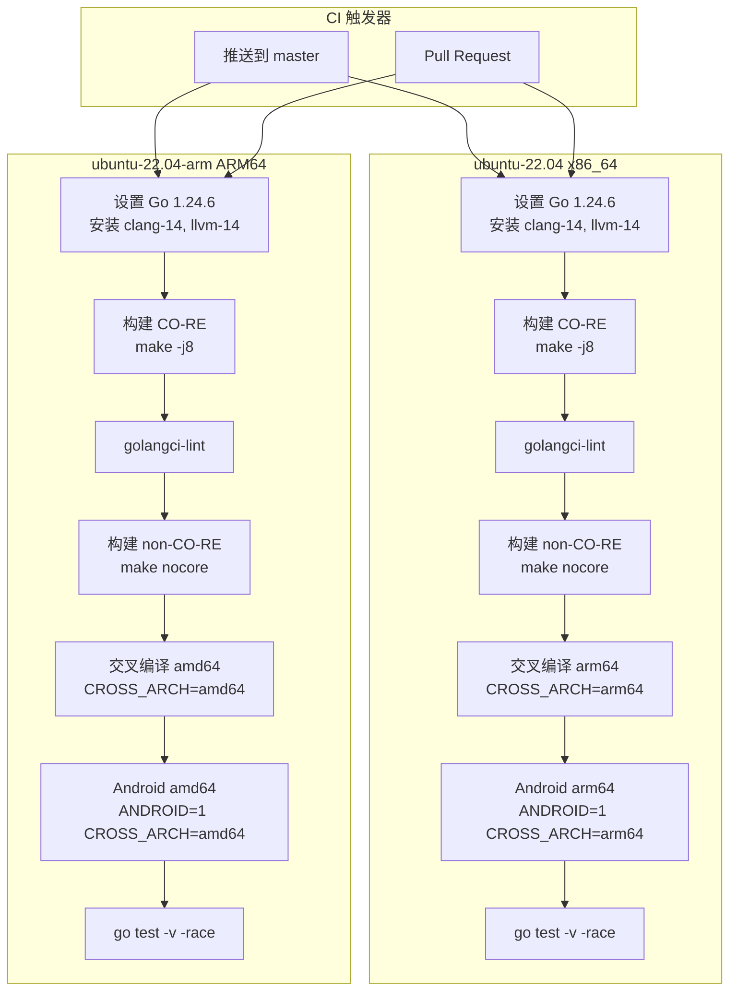
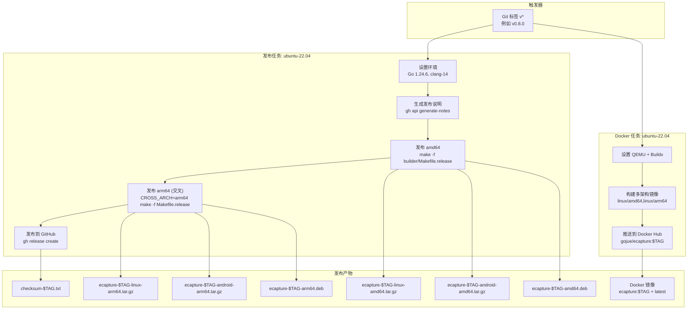
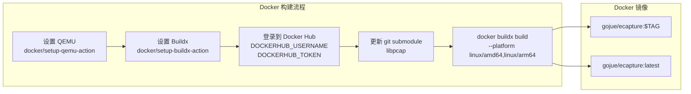

# CI/CD 与发布流程

本文档描述了 eCapture 项目的持续集成、持续部署和发布工作流程。内容涵盖 GitHub Actions 工作流、构建目标、打包格式以及完整的发布自动化流程。

有关构建系统本身（Makefile 目标、编译流程）的信息，请参阅[构建系统](5.1-build-system.md)。有关为项目做贡献的指导，请参阅[开发指南](index.md)。

---

## 概述

eCapture 使用 GitHub Actions 完成所有 CI/CD 操作，包含三个主要工作流：

| 工作流 | 触发条件 | 用途 | 文件 |
|----------|---------|---------|------|
| **go-c-cpp.yml** | 推送/PR 到 `master` | 持续集成、构建验证、测试 | [.github/workflows/go-c-cpp.yml](https://github.com/gojue/ecapture/blob/ca085d05/.github/workflows/go-c-cpp.yml) |
| **release.yml** | Git 标签 `v*` | 自动化发布构建与发布 | [.github/workflows/release.yml](https://github.com/gojue/ecapture/blob/ca085d05/.github/workflows/release.yml) |
| **codeql-analysis.yml** | 推送到 `master`，每周执行 | 安全扫描与代码分析 | [.github/workflows/codeql-analysis.yml](https://github.com/gojue/ecapture/blob/ca085d05/.github/workflows/codeql-analysis.yml) |

CI/CD 系统支持：
- **多架构构建**：原生 x86_64 和 arm64，以及交叉编译
- **多种构建模式**：CO-RE（内核无关）和 non-CO-RE（内核特定）
- **平台变体**：Linux 和 Android
- **多种打包格式**：tar.gz、DEB、RPM、Docker 镜像

来源：[.github/workflows/go-c-cpp.yml:1-128](https://github.com/gojue/ecapture/blob/ca085d05/.github/workflows/go-c-cpp.yml#L1-L128)、[.github/workflows/release.yml:1-129](https://github.com/gojue/ecapture/blob/ca085d05/.github/workflows/release.yml#L1-L129)、[.github/workflows/codeql-analysis.yml:1-92](https://github.com/gojue/ecapture/blob/ca085d05/.github/workflows/codeql-analysis.yml#L1-L92)

---

## 持续集成工作流

### 构建矩阵

主 CI 工作流（`go-c-cpp.yml`）在两个 GitHub 托管的运行器上并行运行：



**ubuntu-22.04 (x86_64) 上的 CI 构建步骤**

来源：[.github/workflows/go-c-cpp.yml:8-67](https://github.com/gojue/ecapture/blob/ca085d05/.github/workflows/go-c-cpp.yml#L8-L67)

### 环境设置

两个 CI 运行器都安装相同的开发依赖：

[.github/workflows/go-c-cpp.yml:16-33](https://github.com/gojue/ecapture/blob/ca085d05/.github/workflows/go-c-cpp.yml#L16-L33)
```yaml
- name: Install Compilers
  run: |
    sudo apt-get update
    sudo apt-get install --yes build-essential pkgconf libelf-dev \
      llvm-14 clang-14 flex bison linux-tools-common \
      linux-tools-generic gcc gcc-aarch64-linux-gnu \
      libssl-dev linux-source
    for tool in "clang" "llc" "llvm-strip"
    do
      sudo rm -f /usr/bin/$tool
      sudo ln -s /usr/bin/$tool-14 /usr/bin/$tool
    done
```

**关键依赖**：
- **Go 1.24.6**：构建 Go 代码所需
- **clang-14/llvm-14**：eBPF 程序编译
- **gcc-aarch64-linux-gnu**：交叉编译支持（x86 运行器）或 **gcc-x86-64-linux-gnu**（ARM 运行器）
- **linux-source**：跨架构构建所需的内核头文件
- **libelf-dev**：eBPF 的 ELF 文件操作
- **flex/bison**：内核头文件的解析器生成器

工作流还通过提取和配置 linux-source 包来准备交叉编译的内核头文件 [.github/workflows/go-c-cpp.yml:25-32](https://github.com/gojue/ecapture/blob/ca085d05/.github/workflows/go-c-cpp.yml#L25-L32)。

来源：[.github/workflows/go-c-cpp.yml:16-33](https://github.com/gojue/ecapture/blob/ca085d05/.github/workflows/go-c-cpp.yml#L16-L33)、[.github/workflows/go-c-cpp.yml:76-93](https://github.com/gojue/ecapture/blob/ca085d05/.github/workflows/go-c-cpp.yml#L76-L93)

### 构建阶段

每个 CI 任务执行五种构建配置：

| 阶段 | 命令 | 用途 | 输出 |
|-------|---------|---------|--------|
| **CO-RE 构建** | `make -j8` | CO-RE eBPF + Go 二进制文件 | `bin/ecapture`（支持 BTF） |
| **代码检查** | `golangci-lint` | 代码质量检查 | 检查报告 |
| **Non-CO-RE 构建** | `make nocore` | Non-CO-RE eBPF + Go 二进制文件 | `bin/ecapture`（内核特定） |
| **交叉编译 CO-RE** | `CROSS_ARCH=arm64 make -j8` | 跨架构 CO-RE 构建 | `bin/ecapture`（其他架构） |
| **交叉编译 Android** | `ANDROID=1 CROSS_ARCH=arm64 make nocore` | Android non-CO-RE 构建 | `bin/ecapture`（Android） |
| **测试** | `go test -v -race ./...` | 使用竞态检测器的单元测试 | 测试结果 |

**构建阶段 1：CO-RE 构建** [.github/workflows/go-c-cpp.yml:38-44](https://github.com/gojue/ecapture/blob/ca085d05/.github/workflows/go-c-cpp.yml#L38-L44)
```bash
make clean
make env
DEBUG=1 make -j8
cd ./lib/libpcap/ && sudo make install
```

这会构建：
- CO-RE eBPF 字节码文件（`user/bytecode/*_core.o`）
- Non-CO-RE 字节码文件（`user/bytecode/*_noncore.o`）
- 静态 libpcap 库（`lib/libpcap/libpcap.a`）
- 嵌入所有字节码的最终 Go 二进制文件

**构建阶段 2：代码检查** [.github/workflows/go-c-cpp.yml:45-50](https://github.com/gojue/ecapture/blob/ca085d05/.github/workflows/go-c-cpp.yml#L45-L50)

使用 `golangci-lint-action@v8` 和版本 v2.1 来强制执行 Go 代码库的代码质量标准。

**构建阶段 3：Non-CO-RE 构建** [.github/workflows/go-c-cpp.yml:51-55](https://github.com/gojue/ecapture/blob/ca085d05/.github/workflows/go-c-cpp.yml#L51-L55)

仅构建 non-CO-RE 字节码，适用于不支持 BTF 的系统。`make nocore` 目标：
1. 使用内核头文件编译 eBPF 程序（不可移植）
2. 仅嵌入 `*_noncore.o` 文件
3. 创建一个在没有 BTF 的情况下可以工作的二进制文件，但它是内核版本特定的

**构建阶段 4：交叉编译** [.github/workflows/go-c-cpp.yml:56-60](https://github.com/gojue/ecapture/blob/ca085d05/.github/workflows/go-c-cpp.yml#L56-L60)

使用 `CROSS_ARCH=arm64` 环境变量来：
1. 设置 `TARGET_ARCH=arm64` 和 `GOARCH=arm64`
2. 使用 `aarch64-linux-gnu-gcc` 进行交叉编译
3. 使用 `-D__TARGET_ARCH_arm64` 构建 eBPF 程序
4. 链接到交叉编译的 libpcap

**构建阶段 5：Android 交叉编译** [.github/workflows/go-c-cpp.yml:61-65](https://github.com/gojue/ecapture/blob/ca085d05/.github/workflows/go-c-cpp.yml#L61-L65)

结合 `ANDROID=1` 和 `CROSS_ARCH=arm64` 来：
1. 添加 Android 特定的构建标签
2. 使用 BoringSSL 偏移量而不是 OpenSSL
3. 仅构建 non-CO-RE（Android 内核可能缺少 BTF）

来源：[.github/workflows/go-c-cpp.yml:38-67](https://github.com/gojue/ecapture/blob/ca085d05/.github/workflows/go-c-cpp.yml#L38-L67)、[.github/workflows/go-c-cpp.yml:98-127](https://github.com/gojue/ecapture/blob/ca085d05/.github/workflows/go-c-cpp.yml#L98-L127)

### 测试执行

最后的 CI 阶段使用竞态检测器运行测试套件：

[.github/workflows/go-c-cpp.yml:126-127](https://github.com/gojue/ecapture/blob/ca085d05/.github/workflows/go-c-cpp.yml#L126-L127)
```bash
go test -v -race ./...
```

`-race` 标志启用 Go 的竞态检测器，以捕获事件处理管道、工作池和模块生命周期代码中的并发内存访问问题。

来源：[.github/workflows/go-c-cpp.yml:66-67](https://github.com/gojue/ecapture/blob/ca085d05/.github/workflows/go-c-cpp.yml#L66-L67)、[.github/workflows/go-c-cpp.yml:126-127](https://github.com/gojue/ecapture/blob/ca085d05/.github/workflows/go-c-cpp.yml#L126-L127)

---

## 发布工作流

### 触发器与并发控制

发布工作流在匹配 `v*` 模式的 Git 标签上触发（例如 `v0.8.0`、`v0.8.1-rc1`）：

[.github/workflows/release.yml:2-9](https://github.com/gojue/ecapture/blob/ca085d05/.github/workflows/release.yml#L2-L9)
```yaml
on:
  push:
    tags:
      - "v*"

concurrency:
  group: ${{ github.workflow }}-${{ github.ref }}
  cancel-in-progress: true
```

`concurrency` 设置确保每个标签只运行一个发布构建，如果推送了新标签，则取消任何正在进行的构建。

来源：[.github/workflows/release.yml:2-9](https://github.com/gojue/ecapture/blob/ca085d05/.github/workflows/release.yml#L2-L9)

### 发布管道架构



**发布管道阶段**

来源：[.github/workflows/release.yml:11-129](https://github.com/gojue/ecapture/blob/ca085d05/.github/workflows/release.yml#L11-L129)

### 发布说明生成

工作流使用 GitHub 的 API 自动生成发布说明：

[.github/workflows/release.yml:63-87](https://github.com/gojue/ecapture/blob/ca085d05/.github/workflows/release.yml#L63-L87)
```yaml
- name: Get Previous Tag
  id: previoustag
  run: |
    PREVIOUS=$(git describe --tags --abbrev=0 HEAD^ 2>/dev/null || echo "")
    echo "PREVIOUS_TAG=$PREVIOUS" >> $GITHUB_OUTPUT

- name: Generate Release Notes
  id: release_notes
  run: |
    gh api \
      --method POST \
      -H "Accept: application/vnd.github+json" \
      /repos/${{ github.repository }}/releases/generate-notes \
      -f tag_name=${{ github.ref_name }} \
      -f previous_tag_name=${{ steps.previoustag.outputs.PREVIOUS_TAG }} \
      > release_notes.json
    echo "NOTES<<EOF" >> $GITHUB_OUTPUT
    jq -r .body release_notes.json >> $GITHUB_OUTPUT
    echo "EOF" >> $GITHUB_OUTPUT

- name: Write File
  uses: DamianReeves/write-file-action@v1.2
  with:
    path: ./bin/release_notes.txt
    contents: |
      ${{ steps.release_notes.outputs.NOTES }}
```

此过程：
1. 使用 `git describe` 找到上一个标签
2. 调用 GitHub 的 `/releases/generate-notes` API 端点
3. 从 JSON 响应中提取正文
4. 写入 `bin/release_notes.txt` 以包含在发布中

来源：[.github/workflows/release.yml:63-87](https://github.com/gojue/ecapture/blob/ca085d05/.github/workflows/release.yml#L63-L87)

### 发布构建

发布任务执行两种构建配置：

**原生 amd64 构建** [.github/workflows/release.yml:88-92](https://github.com/gojue/ecapture/blob/ca085d05/.github/workflows/release.yml#L88-L92)
```bash
make clean
make env
make -f builder/Makefile.release release SNAPSHOT_VERSION=${{ github.ref_name }}
```

**交叉编译 arm64 构建** [.github/workflows/release.yml:93-97](https://github.com/gojue/ecapture/blob/ca085d05/.github/workflows/release.yml#L93-L97)
```bash
make clean
make env
CROSS_ARCH=arm64 make -f builder/Makefile.release release SNAPSHOT_VERSION=${{ github.ref_name }}
```

[builder/Makefile.release:10](https://github.com/gojue/ecapture/blob/ca085d05/builder/Makefile.release#L10) 中的每个 `make release` 调用触发：
```makefile
release: snapshot build_deb snapshot_android
```

此级联目标生成：
1. **`snapshot`**：包含 CO-RE + non-CO-RE 字节码的 Linux tar.gz 归档
2. **`build_deb`**：从构建的二进制文件创建 Debian 包
3. **`snapshot_android`**：仅包含 non-CO-RE 字节码的 Android tar.gz 归档

来源：[.github/workflows/release.yml:88-100](https://github.com/gojue/ecapture/blob/ca085d05/.github/workflows/release.yml#L88-L100)、[builder/Makefile.release:10](https://github.com/gojue/ecapture/blob/ca085d05/builder/Makefile.release#L10)

### 归档创建

`snapshot` 和 `snapshot_android` 目标使用 `release_tar` 函数：

[functions.mk:62-76](https://github.com/gojue/ecapture/blob/ca085d05/functions.mk#L62-L76)
```makefile
define release_tar
	$(call allow-override,CORE_PREFIX,$(call CHECK_IS_NON_CORE,$(2),nocore))
	$(call allow-override,TAR_DIR,ecapture-$(DEB_VERSION)-$(1)-$(GOARCH)$(CORE_PREFIX))
	$(call allow-override,OUT_ARCHIVE,$(OUTPUT_DIR)/$(TAR_DIR).tar.gz)
	$(CMD_MAKE) clean
	ANDROID=$(ANDROID) $(CMD_MAKE) $(2)
	# create the tar ball and checksum files
	$(CMD_MKDIR) -p $(TAR_DIR)
	$(CMD_CP) LICENSE $(TAR_DIR)/LICENSE
	$(CMD_CP) CHANGELOG.md $(TAR_DIR)/CHANGELOG.md
	$(CMD_CP) README.md $(TAR_DIR)/README.md
	$(CMD_CP) README_CN.md $(TAR_DIR)/README_CN.md
	$(CMD_CP) $(OUTPUT_DIR)/ecapture $(TAR_DIR)/ecapture
	$(CMD_TAR) -czf $(OUT_ARCHIVE) $(TAR_DIR)
endef
```

例如，使用 `SNAPSHOT_VERSION=v0.8.0` 调用 `snapshot` 会生成：
- **归档名称**：`ecapture-v0.8.0-linux-amd64.tar.gz`
- **内容**：
  - `ecapture`（二进制文件）
  - `LICENSE`
  - `CHANGELOG.md`
  - `README.md`
  - `README_CN.md`

Android 构建会附加 `-nocore` 以指示仅包含 non-CO-RE：
- **归档名称**：`ecapture-v0.8.0-android-arm64-nocore.tar.gz`

来源：[functions.mk:62-76](https://github.com/gojue/ecapture/blob/ca085d05/functions.mk#L62-L76)、[builder/Makefile.release:94-112](https://github.com/gojue/ecapture/blob/ca085d05/builder/Makefile.release#L94-L112)

### Debian 包创建

`build_deb` 目标构建一个 `.deb` 包：

[builder/Makefile.release:135-151](https://github.com/gojue/ecapture/blob/ca085d05/builder/Makefile.release#L135-L151)
```makefile
build_deb:
	# Create package directory structure
	$(CMD_RM) -rf $(BUILD_DIR)
	$(CMD_MKDIR) -p $(BUILD_DIR)/DEBIAN
	$(CMD_MKDIR) -p $(BUILD_DIR)/usr/local/bin
	# Copy binary
	$(CMD_CP) bin/ecapture $(BUILD_DIR)/usr/local/bin/ecapture
	# Create control file (DEBIAN/control)
	$(CMD_ECHO) "Package: $(PACKAGE_NAME)" > $(BUILD_DIR)/DEBIAN/control
	$(CMD_ECHO) "Version: $(PACKAGE_VERSION)" >> $(BUILD_DIR)/DEBIAN/control
	$(CMD_ECHO) "BuildDate: $(BUILD_DATE)" >> $(BUILD_DIR)/DEBIAN/control
	$(CMD_ECHO) "Architecture: $(GOARCH)" >> $(BUILD_DIR)/DEBIAN/control
	$(CMD_ECHO) "Maintainer: $(PACKAGE_MAINTAINER)" >> $(BUILD_DIR)/DEBIAN/control
	$(CMD_ECHO) "Description: $(PACKAGE_DESC)" >> $(BUILD_DIR)/DEBIAN/control
	$(CMD_ECHO) "Homepage: $(PACKAGE_HOMEPAGE)" >> $(BUILD_DIR)/DEBIAN/control
	# Build DEB package
	$(CMD_DPKG-DEB) --build $(BUILD_DIR) $(OUT_DEB_FILE)
```

**DEB 包结构**：
```
ecapture-v0.8.0-amd64.deb
├── DEBIAN/
│   └── control（元数据）
└── usr/
    └── local/
        └── bin/
            └── ecapture（二进制文件）
```

control 文件包含：
- **Package**：`ecapture`
- **Version**：来自 `SNAPSHOT_VERSION`（例如 `v0.8.0`）
- **Architecture**：`amd64` 或 `arm64`
- **Maintainer**：包维护者信息
- **Description**：简要包描述
- **Homepage**：https://ecapture.cc

来源：[builder/Makefile.release:135-151](https://github.com/gojue/ecapture/blob/ca085d05/builder/Makefile.release#L135-L151)

### 发布到 GitHub Releases

最后一步将所有产物上传到 GitHub release：

[.github/workflows/release.yml:98-100](https://github.com/gojue/ecapture/blob/ca085d05/.github/workflows/release.yml#L98-L100)
```bash
make -f builder/Makefile.release publish SNAPSHOT_VERSION=${{ github.ref_name }}
```

[builder/Makefile.release:114-124](https://github.com/gojue/ecapture/blob/ca085d05/builder/Makefile.release#L114-L124)
```makefile
publish: \
	$(OUTPUT_DIR) \
	$(OUT_ARCHIVE) \
	$(OUT_DEB_FILE) \
	| .check_tree \
	.check_$(CMD_GITHUB)
	@$(CMD_CD) $(OUTPUT_DIR)
	@$(CMD_CHECKSUM) ecapture*v* | $(CMD_SED) 's/.\/bin\///g' > $(OUT_CHECKSUMS)
	@FILES=$$(ls ecapture-*.tar.gz ecapture*.deb checksum-*.txt)
	@$(CMD_GITHUB) release create $(DEB_VERSION) $$FILES \
		--title "eCapture $(DEB_VERSION)" \
		--notes-file $(RELEASE_NOTES)
```

**发布的产物**（对于版本 v0.8.0）：
- `ecapture-v0.8.0-linux-amd64.tar.gz`
- `ecapture-v0.8.0-linux-arm64.tar.gz`
- `ecapture-v0.8.0-android-amd64-nocore.tar.gz`
- `ecapture-v0.8.0-android-arm64-nocore.tar.gz`
- `ecapture-v0.8.0-amd64.deb`
- `ecapture-v0.8.0-arm64.deb`
- `checksum-v0.8.0.txt`（所有文件的 SHA256 校验和）

来源：[.github/workflows/release.yml:98-100](https://github.com/gojue/ecapture/blob/ca085d05/.github/workflows/release.yml#L98-L100)、[builder/Makefile.release:114-124](https://github.com/gojue/ecapture/blob/ca085d05/builder/Makefile.release#L114-L124)

---

## Docker 镜像发布

### 多架构 Docker 构建

发布工作流包含一个单独的任务用于构建和发布 Docker 镜像：

[.github/workflows/release.yml:101-129](https://github.com/gojue/ecapture/blob/ca085d05/.github/workflows/release.yml#L101-L129)



**Docker 构建流程**

**步骤 1：设置多架构支持** [.github/workflows/release.yml:106-109](https://github.com/gojue/ecapture/blob/ca085d05/.github/workflows/release.yml#L106-L109)

使用 Docker Buildx 和 QEMU 从单个命令构建 `linux/amd64` 和 `linux/arm64` 架构的镜像。

**步骤 2：身份验证** [.github/workflows/release.yml:110-114](https://github.com/gojue/ecapture/blob/ca085d05/.github/workflows/release.yml#L110-L114)

使用 GitHub Secrets 登录到 Docker Hub：
- `DOCKERHUB_USERNAME`：Docker Hub 用户名
- `DOCKERHUB_TOKEN`：Docker Hub 访问令牌

**步骤 3：构建并推送** [.github/workflows/release.yml:117-129](https://github.com/gojue/ecapture/blob/ca085d05/.github/workflows/release.yml#L117-L129)
```yaml
- name: Build and push
  uses: docker/build-push-action@v5
  with:
    context: .
    build-args: VERSION=${{ github.ref_name }}
    file: ./builder/Dockerfile
    platforms: linux/amd64,linux/arm64
    push: true
    cache-from: type=registry,ref=${{ secrets.DOCKERHUB_USERNAME }}/ecapture:buildcache
    cache-to: type=registry,ref=${{ secrets.DOCKERHUB_USERNAME }}/ecapture:buildcache,mode=max
    tags: |
      ${{ secrets.DOCKERHUB_USERNAME }}/ecapture:${{ github.ref_name }}
      ${{ secrets.DOCKERHUB_USERNAME }}/ecapture:latest
```

关键特性：
- **平台**：同时为 `linux/amd64` 和 `linux/arm64` 构建
- **构建缓存**：使用镜像仓库缓存加速后续构建
- **标签**：每个发布获得两个标签（版本特定和 `latest`）
- **构建参数**：传递 `VERSION` 用于版本嵌入

来源：[.github/workflows/release.yml:101-129](https://github.com/gojue/ecapture/blob/ca085d05/.github/workflows/release.yml#L101-L129)

### Dockerfile 结构

Docker 构建在 [builder/Dockerfile:1-39](https://github.com/gojue/ecapture/blob/ca085d05/builder/Dockerfile#L1-L39) 中定义：

**阶段 1：构建器镜像** [builder/Dockerfile:1-32](https://github.com/gojue/ecapture/blob/ca085d05/builder/Dockerfile#L1-L32)
```dockerfile
FROM ubuntu:22.04 as ecapture_builder

# Install build dependencies
RUN apt-get update && apt-get install --yes \
  git build-essential pkgconf libelf-dev llvm-14 clang-14 \
  linux-tools-common linux-headers-$(uname -r) make gcc flex bison \
  file wget linux-source

# Install Go 1.24.6
ARG TARGETARCH
RUN wget -O go.tar.gz https://golang.google.cn/dl/go1.24.6.linux-${TARGETARCH}.tar.gz && \
  tar -C /usr/local -xzf go.tar.gz

# Build ecapture
COPY ./ /build/ecapture
ARG VERSION
RUN cd /build/ecapture && \
  make clean && \
  make all SNAPSHOT_VERSION=${VERSION}_docker
```

`TARGETARCH` 参数由 Docker Buildx 根据目标平台自动设置为 `amd64` 或 `arm64`。

**阶段 2：发布镜像** [builder/Dockerfile:34-39](https://github.com/gojue/ecapture/blob/ca085d05/builder/Dockerfile#L34-L39)
```dockerfile
FROM alpine:latest as ecapture

COPY --from=ecapture_builder /build/ecapture/bin/ecapture /ecapture

ENTRYPOINT ["/ecapture"]
```

最终镜像：
- 使用最小的 Alpine Linux 基础镜像
- 仅包含 `ecapture` 二进制文件
- 总大小：约 50MB（明显小于构建器镜像）
- 将 `/ecapture` 设置为入口点

**Docker 镜像标签**：
- `gojue/ecapture:v0.8.0`（版本特定）
- `gojue/ecapture:latest`（始终指向最新版本）

来源：[builder/Dockerfile:1-39](https://github.com/gojue/ecapture/blob/ca085d05/builder/Dockerfile#L1-L39)

---

## 构建目标参考

### Makefile 目标

下表总结了主 [Makefile](https://github.com/gojue/ecapture/blob/ca085d05/Makefile) 中所有可用的构建目标：

| 目标 | 命令 | 描述 | 包含的字节码 | 输出 |
|--------|---------|-------------|-------------------|--------|
| `all` | `make` | 完整构建：CO-RE + non-CO-RE | 两者 | `bin/ecapture` |
| `nocore` / `noncore` | `make nocore` | 仅 non-CO-RE | 仅 non-CO-RE | `bin/ecapture` |
| `ebpf` | `make ebpf` | 编译 CO-RE 字节码 | 不适用 | `user/bytecode/*_core.o` |
| `ebpf_noncore` | `make ebpf_noncore` | 编译 non-CO-RE 字节码 | 不适用 | `user/bytecode/*_noncore.o` |
| `assets` | `make assets` | 嵌入所有字节码 | 两者 | `assets/ebpf_probe.go` |
| `assets_noncore` | `make assets_noncore` | 嵌入 non-CO-RE 字节码 | 仅 non-CO-RE | `assets/ebpf_probe.go` |
| `build` | `make build` | 构建 Go 二进制文件（所有字节码） | 两者 | `bin/ecapture` |
| `build_noncore` | `make build_noncore` | 构建 Go 二进制文件（仅 non-CO-RE） | 仅 non-CO-RE | `bin/ecapture` |
| `clean` | `make clean` | 删除构建产物 | 不适用 | （清理） |
| `test-race` | `make test-race` | 运行带竞态检测器的测试 | 不适用 | 测试结果 |
| `rpm` | `make rpm` | 构建 RPM 包 | 两者 | `~/rpmbuild/RPMS/` |

来源：[Makefile:1-245](https://github.com/gojue/ecapture/blob/ca085d05/Makefile#L1-L245)

### 交叉编译

交叉编译使用 `CROSS_ARCH` 环境变量启用：

**在 x86_64 主机上构建 ARM64**：
```bash
CROSS_ARCH=arm64 make all
```

**在 ARM64 主机上构建 x86_64**：
```bash
CROSS_ARCH=amd64 make all
```

`CROSS_ARCH` 变量触发：
1. **工具链选择**：使用 `aarch64-linux-gnu-gcc` 或 `x86_64-linux-gnu-gcc`
2. **eBPF 架构标志**：设置 `-D__TARGET_ARCH_arm64` 或 `-D__TARGET_ARCH_x86`
3. **Go 交叉编译**：设置 `GOARCH=arm64` 或 `GOARCH=amd64`
4. **内核头文件**：使用来自 `/usr/src/` 的交叉编译内核头文件

来源：[Makefile:56-60](https://github.com/gojue/ecapture/blob/ca085d05/Makefile#L56-L60)、[.github/workflows/go-c-cpp.yml:56-65](https://github.com/gojue/ecapture/blob/ca085d05/.github/workflows/go-c-cpp.yml#L56-L65)

### Android 构建

Android 构建需要 `ANDROID=1` 标志：

```bash
ANDROID=1 CROSS_ARCH=arm64 make nocore
```

Android 特定行为：
- **仅 non-CO-RE**：Android 内核通常缺少 BTF 支持
- **BoringSSL 偏移量**：使用 Android BoringSSL 而不是 OpenSSL
- **静态链接**：确保二进制文件无需外部依赖即可运行
- **构建标签**：添加 `android` 构建标签用于条件编译

构建系统会检测 Android 标志并调整：
1. **库检测**：优先进行 BoringSSL 版本检测
2. **偏移量选择**：使用 `boringssl_offset_*.sh` 生成的头文件
3. **目标标签**：在 `go build` 的 `-tags` 参数中包含 `android`

来源：[Makefile:27](https://github.com/gojue/ecapture/blob/ca085d05/Makefile#L27)、[.github/workflows/go-c-cpp.yml:61-65](https://github.com/gojue/ecapture/blob/ca085d05/.github/workflows/go-c-cpp.yml#L61-L65)

---

## 版本管理

### 版本嵌入

版本信息在构建时使用 Go 链接器标志嵌入到二进制文件中：

[functions.mk:47-54](https://github.com/gojue/ecapture/blob/ca085d05/functions.mk#L47-L54)
```makefile
define gobuild
	CGO_ENABLED=1 \
	CGO_CFLAGS='-O2 -g -gdwarf-4 -I$(CURDIR)/lib/libpcap/' \
	CGO_LDFLAGS='-O2 -g -L$(CURDIR)/lib/libpcap/ -lpcap -static' \
	GOOS=linux GOARCH=$(GOARCH) CC=$(CMD_CC_PREFIX)$(CMD_CC) \
	$(CMD_GO) build -trimpath -buildmode=pie -mod=readonly -tags '$(TARGET_TAG),netgo' \
	  -ldflags "-w -s \
	    -X 'github.com/gojue/ecapture/cli/cmd.GitVersion=$(TARGET_TAG)_$(GOARCH):$(VERSION_NUM):$(VERSION_FLAG)' \
	    -X 'github.com/gojue/ecapture/cli/cmd.ByteCodeFiles=$(BYTECODE_FILES)' \
	    -linkmode=external -extldflags -static" \
	  -o $(OUT_BIN)
endef
```

**嵌入的变量**：
- `cli/cmd.GitVersion`：包含 `$(TARGET_TAG)_$(GOARCH):$(VERSION_NUM):$(VERSION_FLAG)`
  - 示例：`v0.8.0_amd64:v0.8.0:5.15.0-1045-generic`
- `cli/cmd.ByteCodeFiles`：根据构建类型为 `core,noncore` 或 `noncore`

**版本组件**：
| 组件 | 来源 | 示例 |
|-----------|--------|---------|
| `TARGET_TAG` | Git 标签或 `SNAPSHOT_VERSION` | `v0.8.0` |
| `GOARCH` | 目标架构 | `amd64`、`arm64` |
| `VERSION_NUM` | 最新 git 标签 | `v0.8.0` |
| `VERSION_FLAG` | 内核版本或主机架构 | `5.15.0-1045-generic` |

用户可以查询版本信息：
```bash
$ ./ecapture version
eCapture v0.8.0_amd64:v0.8.0:5.15.0-1045-generic
GitURL: https://github.com/gojue/ecapture
ByteCodeFiles: core,noncore
```

来源：[functions.mk:47-54](https://github.com/gojue/ecapture/blob/ca085d05/functions.mk#L47-L54)

### 快照版本控制

在开发和测试期间，快照使用 `SNAPSHOT_VERSION` 环境变量：

```bash
SNAPSHOT_VERSION=v0.8.0-rc1 make -f builder/Makefile.release snapshot
```

这会覆盖默认的版本检测（最新 git 标签）并生成：
- 归档：`ecapture-v0.8.0-rc1-linux-amd64.tar.gz`
- DEB：`ecapture-v0.8.0-rc1-amd64.deb`
- 嵌入版本：`v0.8.0-rc1_amd64:v0.8.0-rc1:...`

来源：[builder/Makefile.release:38](https://github.com/gojue/ecapture/blob/ca085d05/builder/Makefile.release#L38)、[.github/workflows/release.yml:92](https://github.com/gojue/ecapture/blob/ca085d05/.github/workflows/release.yml#L92)

---

## 安全扫描

### CodeQL 分析

项目包含通过 CodeQL 进行的自动安全扫描：

[.github/workflows/codeql-analysis.yml:14-22](https://github.com/gojue/ecapture/blob/ca085d05/.github/workflows/codeql-analysis.yml#L14-L22)
```yaml
on:
  push:
    branches: [ master ]
  pull_request:
    branches: [ master ]
  schedule:
    - cron: '42 15 * * 3'  # 每周三 15:42 UTC
```

**CodeQL 工作流**：
1. **语言矩阵**：分析 C/C++（eBPF 程序）和 Go（用户空间代码）
2. **构建步骤**：运行 `make nocore -j4` 编译所有代码以进行分析
3. **分析**：扫描安全漏洞、代码质量问题
4. **报告**：结果显示在 GitHub Security 选项卡中

工作流运行于：
- 每次推送到 `master`
- 每个 pull request
- 每周三 15:42 UTC

来源：[.github/workflows/codeql-analysis.yml:1-92](https://github.com/gojue/ecapture/blob/ca085d05/.github/workflows/codeql-analysis.yml#L1-L92)

---

## 构建系统依赖

### 所需工具

CI/CD 系统需要以下工具可用：

**编译器工具链**：
- **clang** ≥ 9（由 [functions.mk:17-22](https://github.com/gojue/ecapture/blob/ca085d05/functions.mk#L17-L22) 强制执行）
- **llc**（LLVM 编译器）
- **llvm-strip**（用于剥离调试符号）
- **gcc**（用于 Go CGO 编译）
- **gcc-aarch64-linux-gnu** 或 **gcc-x86-64-linux-gnu**（交叉编译）

**Go 工具链**：
- **go** ≥ 1.24（由 [functions.mk:28-35](https://github.com/gojue/ecapture/blob/ca085d05/functions.mk#L28-L35) 强制执行）
- **go-bindata**（用于嵌入字节码）

**构建工具**：
- **make**（GNU Make）
- **bpftool**（用于 CO-RE vmlinux.h 生成）
- **flex** / **bison**（解析器生成器）
- **tar** / **gzip**（归档）
- **dpkg-deb**（DEB 包创建）
- **rpmbuild**（RPM 包创建，可选）

**开发工具**：
- **git**（版本控制）
- **gh**（GitHub CLI 用于创建发布）
- **sha256sum**（校验和生成）

版本检查作为 makefile 目标实现 [functions.mk:2-40](https://github.com/gojue/ecapture/blob/ca085d05/functions.mk#L2-L40)：
```makefile
.checkver_$(CMD_CLANG): | .check_$(CMD_CLANG)
	@if [ ${CLANG_VERSION} -lt 9 ]; then
		echo "you MUST use clang 9 or newer"
		exit 1
	fi

.checkver_$(CMD_GO): | .check_$(CMD_GO)
	@if [ ${GO_VERSION_MAJ} -eq 1 ]; then
		if [ ${GO_VERSION_MIN} -lt 24 ]; then
			echo "you MUST use golang 1.24 or newer"
			exit 1
		fi
	fi
```

来源：[functions.mk:2-40](https://github.com/gojue/ecapture/blob/ca085d05/functions.mk#L2-L40)、[builder/init_env.sh:1-106](https://github.com/gojue/ecapture/blob/ca085d05/builder/init_env.sh#L1-L106)

### 环境初始化

项目为 Ubuntu 提供了自动环境设置脚本：

[builder/init_env.sh:1-106](https://github.com/gojue/ecapture/blob/ca085d05/builder/init_env.sh#L1-L106)

**支持的 Ubuntu 版本**：
- 20.04 (clang-10)
- 20.10 (clang-10)
- 21.04 (clang-11)
- 21.10 (clang-12)
- 22.04 (clang-12)
- 22.10 (clang-12)
- 23.04 (clang-15)
- 23.10 (clang-15)
- 24.04 (clang-18)

**使用方法**：
```bash
/bin/bash -c "$(curl -fsSL https://raw.githubusercontent.com/gojue/ecapture/master/builder/init_env.sh)"
```

脚本：
1. 检测 Ubuntu 版本并选择适当的 clang 版本
2. 安装所有必需的开发包
3. 提取并准备用于交叉编译的内核头文件
4. 下载并安装 Go 1.24.6
5. 克隆 eCapture 仓库
6. 验证安装

来源：[builder/init_env.sh:1-106](https://github.com/gojue/ecapture/blob/ca085d05/builder/init_env.sh#L1-L106)

---

## 包格式详情

### TAR.GZ 归档

**结构**：
```
ecapture-v0.8.0-linux-amd64.tar.gz
├── ecapture（二进制文件）
├── LICENSE
├── CHANGELOG.md
├── README.md
└── README_CN.md
```

**命名约定**：
- Linux：`ecapture-$(VERSION)-linux-$(ARCH).tar.gz`
- Android：`ecapture-$(VERSION)-android-$(ARCH)-nocore.tar.gz`

**校验和文件**（`checksum-v0.8.0.txt`）：
```
<SHA256>  ecapture-v0.8.0-linux-amd64.tar.gz
<SHA256>  ecapture-v0.8.0-linux-arm64.tar.gz
<SHA256>  ecapture-v0.8.0-android-amd64-nocore.tar.gz
<SHA256>  ecapture-v0.8.0-android-arm64-nocore.tar.gz
<SHA256>  ecapture-v0.8.0-amd64.deb
<SHA256>  ecapture-v0.8.0-arm64.deb
```

来源：[functions.mk:62-76](https://github.com/gojue/ecapture/blob/ca085d05/functions.mk#L62-L76)、[builder/Makefile.release:122](https://github.com/gojue/ecapture/blob/ca085d05/builder/Makefile.release#L122)

### DEB 包

**安装**：
```bash
sudo dpkg -i ecapture-v0.8.0-amd64.deb
```

**安装的文件**：
- 二进制文件：`/usr/local/bin/ecapture`
- 无配置文件或 systemd 单元（简单安装）

**Control 文件字段**：
```
Package: ecapture
Version: v0.8.0
Architecture: amd64
Maintainer: CFC4N <cfc4n.cs@gmail.com>
Description: capture SSL/TLS text content without CA cert using eBPF
Homepage: https://ecapture.cc
```

来源：[builder/Makefile.release:135-151](https://github.com/gojue/ecapture/blob/ca085d05/builder/Makefile.release#L135-L151)

### RPM 包

RPM 包创建可用但不在自动发布流程中使用：

[Makefile:65-71](https://github.com/gojue/ecapture/blob/ca085d05/Makefile#L65-L71)
```makefile
rpm:
	@$(CMD_RPM_SETUP_TREE) || exit 1
	$(CMD_SED) -i '0,/^Version:.*$$/s//Version:    $(TAG)/' builder/rpmBuild.spec
	$(CMD_SED) -i '0,/^Release:.*$$/s//Release:    $(RPM_RELEASE)/' builder/rpmBuild.spec
	$(CMD_TAR) zcvf ~/rpmbuild/SOURCES/$(RPM_SOURCE0) ./
	$(CMD_RPMBUILD) -ba builder/rpmBuild.spec
```

**手动构建**：
```bash
make rpm VERSION=0.8.0 RELEASE=1
```

这会在 `~/rpmbuild/RPMS/$(ARCH)/` 中创建 RPM 包。

来源：[Makefile:65-71](https://github.com/gojue/ecapture/blob/ca085d05/Makefile#L65-L71)

---

## CI/CD 故障排除

### 常见构建失败

**问题："missing required tool clang"**

构建需要 clang 版本 9 或更高。安装它：
```bash
sudo apt-get install clang-14
sudo ln -s /usr/bin/clang-14 /usr/bin/clang
```

**问题："you MUST use golang 1.24 or newer"**

项目需要 Go 1.24+。从 https://go.dev/dl/ 下载或使用初始化脚本。

**问题："linux source not found with path"**

交叉编译需要内核头文件。安装：
```bash
sudo apt-get install linux-source
cd /usr/src
sudo tar -xf linux-source-*.tar.bz2
cd linux-source-*
sudo make ARCH=arm64 CROSS_COMPILE=aarch64-linux-gnu- prepare
```

**问题："golangci-lint failed"**

在本地运行以查看具体问题：
```bash
golangci-lint run
```

修复格式问题：
```bash
make format
```

来源：[functions.mk:13-35](https://github.com/gojue/ecapture/blob/ca085d05/functions.mk#L13-L35)、[.github/workflows/go-c-cpp.yml:16-33](https://github.com/gojue/ecapture/blob/ca085d05/.github/workflows/go-c-cpp.yml#L16-L33)

### 调试发布构建

在本地重现发布构建：

```bash
# 设置版本
export SNAPSHOT_VERSION=v0.8.0-test

# 构建 amd64
make clean
make env
make -f builder/Makefile.release release

# 构建 arm64（需要交叉编译设置）
make clean
CROSS_ARCH=arm64 make env
CROSS_ARCH=arm64 make -f builder/Makefile.release release
```

检查生成的产物：
```bash
ls -lh bin/
# 应该显示：
# - ecapture-v0.8.0-test-linux-amd64.tar.gz
# - ecapture-v0.8.0-test-android-amd64-nocore.tar.gz
# - ecapture-v0.8.0-test-amd64.deb
```

来源：[builder/Makefile.release:94-151](https://github.com/gojue/ecapture/blob/ca085d05/builder/Makefile.release#L94-L151)