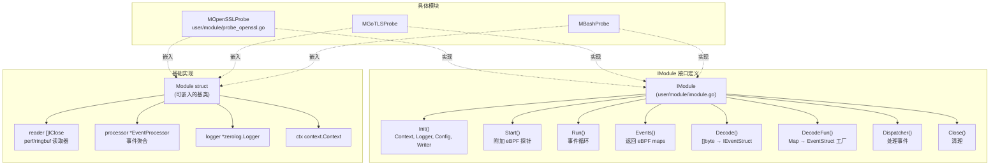
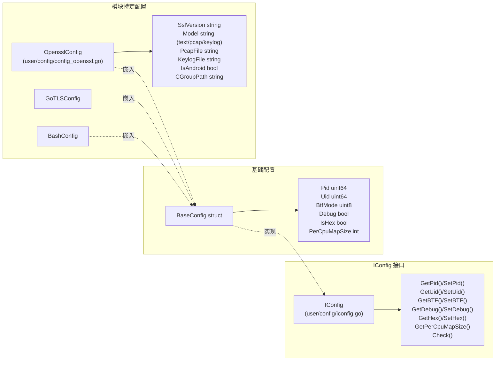
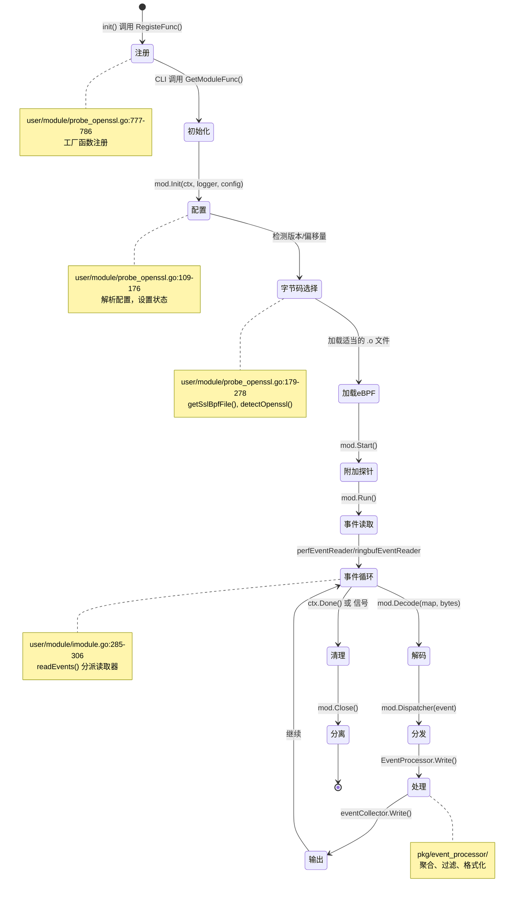
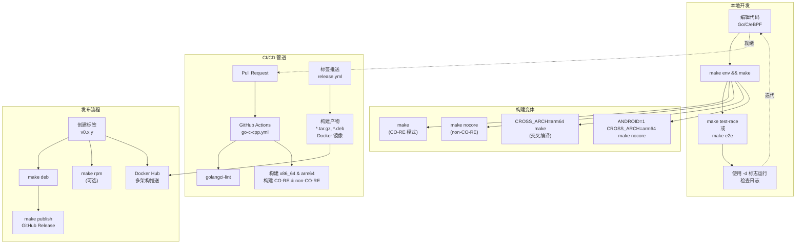
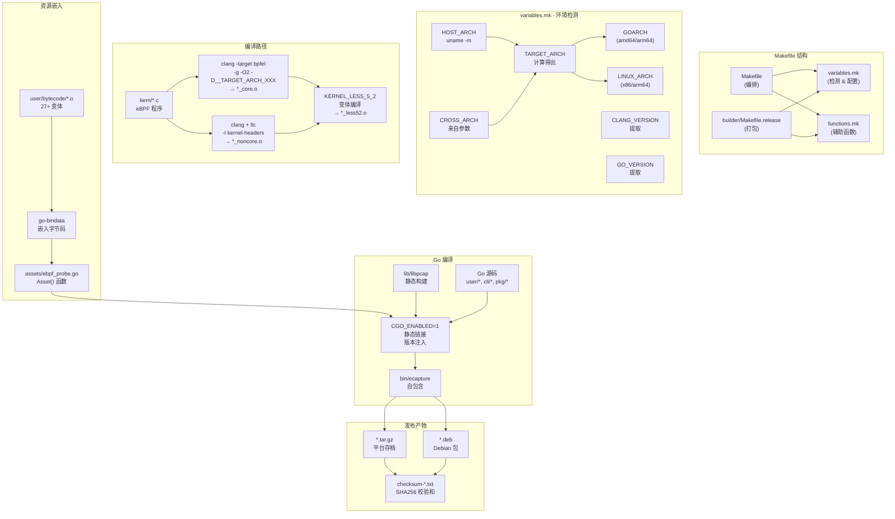

# 开发指南

本指南面向希望为 eCapture 做出贡献、添加新捕获模块、修改现有功能或理解代码库架构的开发人员。它涵盖了开发环境设置、关键接口、构建系统和扩展点。

有关特定开发任务的详细信息，请参阅：
- [构建系统](5.1-build-system.md) - 全面的构建系统文档
- [eBPF 程序开发](5.2-ebpf-program-development.md) - 编写 eBPF 程序
- [添加新模块](5.3-adding-new-modules.md) - 创建新捕获模块
- [事件处理与解析器](5.4-event-processing-and-parsers.md) - 事件处理和协议解析

---

## 开发环境要求

eCapture 需要特定的工具和依赖项进行开发。该项目为基于 Ubuntu 的系统提供了自动化设置脚本。

### 必需工具

| 工具 | 最低版本 | 用途 |
|------|----------------|---------|
| `clang` | 9+（推荐 14） | eBPF 字节码编译 |
| `llvm` | 9+（推荐 14） | eBPF 工具链 |
| `golang` | 1.24+ | 应用程序编译 |
| `gcc` | 任何最新版本 | 交叉编译支持 |
| `linux-headers` | 匹配内核版本 | Non-CO-RE 编译 |
| `libelf-dev` | - | ELF 文件解析 |
| `bpftool` | - | eBPF 字节码生成 |

### 自动化设置

项目提供了 [builder/init_env.sh:1-106](https://github.com/gojue/ecapture/blob/0766a93b/builder/init_env.sh#L1-L106)，可在 Ubuntu 20.04-24.04 上为 x86_64 和 aarch64 架构自动安装依赖。它会：

1. 检测 Ubuntu 版本并选择适当的 clang 版本
2. 安装编译工具链和交叉编译工具
3. 提取并准备 Linux 内核头文件
4. 安装 Go 1.24.6
5. 克隆包含子模块的仓库

**来源：** [builder/init_env.sh:1-106](https://github.com/gojue/ecapture/blob/0766a93b/builder/init_env.sh#L1-L106), [.github/workflows/go-c-cpp.yml:16-33](https://github.com/gojue/ecapture/blob/0766a93b/.github/workflows/go-c-cpp.yml#L16-L33)

---

## 核心开发接口

eCapture 的架构围绕三个关键接口构建，开发人员必须理解这些接口才能扩展功能。

### IModule 接口

`IModule` 接口定义了所有捕获模块的契约。每个模块（OpenSSL、GoTLS、Bash 等）都实现此接口。



#### IModule 方法契约

| 方法 | 用途 | 典型实现 |
|--------|---------|----------------------|
| `Init()` | 初始化模块状态、解析配置、设置映射 | 加载 eBPF 字节码选择逻辑，初始化缓存 |
| `Start()` | 将 eBPF 程序附加到钩子 | 调用 `bpfManager.Start()`，附加 uprobes/kprobes/TC |
| `Run()` | 开始事件处理 | 启动事件读取器，运行处理器 |
| `Events()` | 返回用于事件读取的 eBPF maps | 返回 perf/ringbuf maps |
| `Decode()` | 将原始字节反序列化为事件结构体 | 解析事件类型，反序列化字段 |
| `DecodeFun()` | 将 eBPF map 映射到事件解码器 | 返回适当的 `IEventStruct` 工厂 |
| `Dispatcher()` | 处理已解码的事件 | 路由到输出、更新状态、保存密钥 |
| `Close()` | 清理资源 | 停止读取器、关闭文件、分离探针 |

**来源：** [user/module/imodule.go:47-75](https://github.com/gojue/ecapture/blob/0766a93b/user/module/imodule.go#L47-L75), [user/module/imodule.go:83-108](https://github.com/gojue/ecapture/blob/0766a93b/user/module/imodule.go#L83-L108)

### IConfig 接口

所有模块都通过 `IConfig` 接口接收配置，该接口提供通用设置和模块特定选项。



#### 通用配置字段

| 字段 | 类型 | 用途 | 示例 |
|-------|------|---------|---------|
| `Pid` | `uint64` | 目标进程 ID（0 = 全部） | `1234` |
| `Uid` | `uint64` | 目标用户 ID（0 = 全部） | `1000` |
| `BtfMode` | `uint8` | BTF 模式（0=自动, 1=core, 2=non-core） | `0` |
| `Debug` | `bool` | 启用调试日志 | `true` |
| `IsHex` | `bool` | 十六进制输出模式 | `false` |
| `PerCpuMapSize` | `int` | 每个 CPU 的 eBPF map 大小（页） | `1024` |

**来源：** [user/config/iconfig.go:24-70](https://github.com/gojue/ecapture/blob/0766a93b/user/config/iconfig.go#L24-L70), [user/config/iconfig.go:95-112](https://github.com/gojue/ecapture/blob/0766a93b/user/config/iconfig.go#L95-L112)

### IEventStruct 接口

从 eBPF 流向用户空间的事件实现 `IEventStruct`，启用多态事件处理。

| 方法 | 返回类型 | 用途 |
|--------|-------------|---------|
| `Decode([]byte)` | `error` | 从原始字节反序列化 |
| `String()` | `string` | 人类可读的文本格式 |
| `StringHex()` | `string` | 十六进制文本格式 |
| `Clone()` | `IEventStruct` | 创建新实例用于解码 |
| `EventType()` | `EventType` | 事件分类 |
| `ToProtobufEvent()` | `*pb.Event` | 转换为 protobuf |

**来源：** [user/event/event.go](https://github.com/gojue/ecapture/blob/0766a93b/user/event/event.go)（在导入中引用）

---

## 模块开发生命周期

理解模块从初始化到关闭的生命周期对于开发至关重要。



### 生命周期阶段详情

**1. 注册阶段**
- 模块工厂函数通过 `init()` 中的 `RegisteFunc()` 注册
- 示例：[user/module/probe_openssl.go:777-786](https://github.com/gojue/ecapture/blob/0766a93b/user/module/probe_openssl.go#L777-L786)
- 工厂创建实现 `IModule` 的模块实例

**2. 初始化阶段** 
- CLI 调用 `Init(ctx, logger, config, eventCollector)`
- 模块解析配置：[user/module/probe_openssl.go:109-176](https://github.com/gojue/ecapture/blob/0766a93b/user/module/probe_openssl.go#L109-L176)
- 设置内部状态：连接映射、密钥缓存等
- 确定 BTF 模式和内核版本

**3. 字节码选择阶段**
- 模块检测目标库版本（如 OpenSSL 1.0.x-3.5.x）
- 选择适当的 eBPF 字节码：`_core.o` vs `_noncore.o` vs `_less52.o`
- 示例：[user/module/probe_openssl.go:179-278](https://github.com/gojue/ecapture/blob/0766a93b/user/module/probe_openssl.go#L179-L278)

**4. 探针附加阶段**
- `Start()` 方法将 eBPF 程序附加到钩子
- 使用 `ebpfmanager` 库进行生命周期管理
- 配置常量编辑器用于 PID/UID 过滤

**5. 事件读取阶段**
- `Run()` 为每个 eBPF map 启动事件读取器
- 读取器实现在 [user/module/imodule.go:308-350](https://github.com/gojue/ecapture/blob/0766a93b/user/module/imodule.go#L308-L350)（perf）和 [user/module/imodule.go:353-391](https://github.com/gojue/ecapture/blob/0766a93b/user/module/imodule.go#L353-L391)（ringbuf）
- 每个事件触发 `Decode()` → `Dispatcher()` 管道

**6. 事件处理阶段**
- `EventProcessor` 聚合、过滤和格式化事件
- 处理连接生命周期和协议解析
- 输出到配置的目标（文件、websocket、stdout）

**7. 清理阶段**
- `Close()` 停止读取器、分离探针、关闭文件
- 由 context 取消或 OS 信号触发

**来源：** [user/module/imodule.go:110-171](https://github.com/gojue/ecapture/blob/0766a93b/user/module/imodule.go#L110-L171), [user/module/imodule.go:236-262](https://github.com/gojue/ecapture/blob/0766a93b/user/module/imodule.go#L236-L262), [user/module/probe_openssl.go:109-176](https://github.com/gojue/ecapture/blob/0766a93b/user/module/probe_openssl.go#L109-L176), [user/module/probe_openssl.go:280-350](https://github.com/gojue/ecapture/blob/0766a93b/user/module/probe_openssl.go#L280-L350)

---

## 开发工作流

eCapture 开发工作流集成了本地开发、测试和 CI/CD 自动化。



### 本地构建命令

| 命令 | 用途 | 输出 |
|---------|---------|--------|
| `make env` | 显示构建环境变量 | 配置信息 |
| `make` 或 `make all` | 构建 CO-RE + non-CO-RE 字节码和二进制文件 | `bin/ecapture` |
| `make nocore` | 仅构建 non-CO-RE 字节码 | `bin/ecapture`（non-CO-RE） |
| `make clean` | 删除构建产物 | 清理工作区 |
| `CROSS_ARCH=arm64 make` | 为 ARM64 交叉编译 | `bin/ecapture`（arm64） |
| `DEBUG=1 make` | 使用调试符号构建 | 启用调试的二进制文件 |
| `make test-race` | 使用竞态检测器运行测试 | 测试结果 |
| `make e2e` | 运行端到端测试 | 集成测试结果 |
| `make format` | 使用 clang-format 格式化 C 代码 | 格式化的代码 |

### CI/CD 自动化

项目使用 GitHub Actions 进行持续集成：

**Pull Request 检查** [.github/workflows/go-c-cpp.yml:1-128](https://github.com/gojue/ecapture/blob/0766a93b/.github/workflows/go-c-cpp.yml#L1-L128)
1. **在 Ubuntu 22.04 x86_64 上构建**
   - 安装工具链（clang-14, gcc-aarch64-linux-gnu）
   - 构建 CO-RE 模式
   - 运行 golangci-lint
   - 构建 non-CO-RE 模式
   - 交叉编译到 arm64（CO-RE 和 Android non-CO-RE）
   - 运行竞态检测器测试

2. **在 Ubuntu 22.04 ARM64 上构建**
   - x86_64 工作流的镜像
   - 交叉编译到 x86_64

**发布自动化** [.github/workflows/release.yml:1-129](https://github.com/gojue/ecapture/blob/0766a93b/.github/workflows/release.yml#L1-L129)
1. 标签推送时触发（`v*`）
2. 为 amd64 和 arm64 构建
3. 从上一个标签生成发布说明
4. 创建 tar.gz 存档和校验和
5. 构建多架构 Docker 镜像
6. 发布到 GitHub Releases 和 Docker Hub

**来源：** [.github/workflows/go-c-cpp.yml:1-128](https://github.com/gojue/ecapture/blob/0766a93b/.github/workflows/go-c-cpp.yml#L1-L128), [.github/workflows/release.yml:1-129](https://github.com/gojue/ecapture/blob/0766a93b/.github/workflows/release.yml#L1-L129), [Makefile:1-269](https://github.com/gojue/ecapture/blob/0766a93b/Makefile#L1-L269)

---

## 构建系统架构

eCapture 构建系统功能强大，处理多种架构、内核版本和编译模式。



### 关键构建概念

**1. 双重编译模式**
- **CO-RE（Compile Once - Run Everywhere）**：使用 BTF，可在任何启用 BTF 的内核上运行
  - 使用 `clang -target bpfel` 编译为 `*_core.o`
  - 跨内核版本可移植
- **Non-CO-RE**：需要内核头文件，特定于内核版本
  - 使用内核头文件编译为 `*_noncore.o`
  - 对于没有 BTF 的内核或 Android 是必需的

**2. 内核版本变体**
- 内核 < 5.2 具有不同的 eBPF 辅助函数
- 使用 `-DKERNEL_LESS_5_2` 编译单独的 `*_less52.o` 文件
- 基于 `kernel.HostVersion()` 的运行时选择

**3. 交叉编译支持**
- `CROSS_ARCH` 变量触发交叉编译
- 需要交叉工具链：`gcc-aarch64-linux-gnu` 或 `gcc-x86-64-linux-gnu`
- 目标架构的内核头文件：`/usr/src/linux-source-*/arch/{x86,arm64}`

**4. 资源嵌入**
- 所有 eBPF 字节码通过 `go-bindata` 嵌入到 Go 二进制文件中
- 运行时不依赖 `.o` 文件
- 运行时从 `assets.Asset()` 选择适当的字节码

**5. 版本注入**
- 通过 ldflags 注入 Git 版本：[functions.mk:47-54](https://github.com/gojue/ecapture/blob/0766a93b/functions.mk#L47-L54)
- 格式：`os_arch:vX.Y.Z-date-commit:kernel_version`
- 注入字节码模式：`ByteCodeFiles=core|noncore|all`

**来源：** [Makefile:1-269](https://github.com/gojue/ecapture/blob/0766a93b/Makefile#L1-L269), [variables.mk:1-200](https://github.com/gojue/ecapture/blob/0766a93b/variables.mk#L1-L200), [functions.mk:1-76](https://github.com/gojue/ecapture/blob/0766a93b/functions.mk#L1-L76), [builder/Makefile.release:1-151](https://github.com/gojue/ecapture/blob/0766a93b/builder/Makefile.release#L1-L151)

---

## 开发人员的关键代码模式

### 模式 1：模块注册

所有模块在 `init()` 中使用工厂模式注册自己：

```go
// user/module/probe_openssl.go:777-786
func init() {
    RegisteFunc(NewOpenSSLProbe)
}

func NewOpenSSLProbe() IModule {
    mod := &MOpenSSLProbe{}
    mod.name = ModuleNameOpenssl
    mod.mType = ProbeTypeUprobe
    return mod
}
```

CLI 通过 `GetModuleFunc(modName)` 检索模块。

### 模式 2：eBPF 字节码选择

模块实现版本检测和字节码选择：

```go
// 1. 检测库版本
verString, err := m.detectOpenssl(soPath)

// 2. 将版本映射到字节码文件
bpfFile, found := m.sslVersionBpfMap[verString]

// 3. 应用 CO-RE/non-CO-RE 后缀
filename := m.geteBPFName("user/bytecode/" + bpfFile)
// 结果：user/bytecode/openssl_3_0_kern_core.o

// 4. 从嵌入资源加载
byteBuf, err := assets.Asset(filename)
```

参考：[user/module/probe_openssl.go:179-278](https://github.com/gojue/ecapture/blob/0766a93b/user/module/probe_openssl.go#L179-L278), [user/module/imodule.go:191-214](https://github.com/gojue/ecapture/blob/0766a93b/user/module/imodule.go#L191-L214)

### 模式 3：事件分发

事件通过类型切换分发器流动：

```go
// user/module/probe_openssl.go:733-754
func (m *MOpenSSLProbe) Dispatcher(eventStruct event.IEventStruct) {
    switch ev := eventStruct.(type) {
    case *event.ConnDataEvent:
        if ev.IsDestroy == 0 {
            m.AddConn(ev.Pid, ev.Fd, ev.Tuple, ev.Sock)
        } else {
            m.DelConn(ev.Sock)
        }
    case *event.MasterSecretEvent:
        m.saveMasterSecret(ev)
    case *event.TcSkbEvent:
        m.dumpTcSkb(ev)
    case *event.SSLDataEvent:
        m.dumpSslData(ev)
    }
}
```

### 模式 4：eBPF 管理器设置

模块使用 `ebpfmanager` 进行探针生命周期管理：

```go
m.bpfManager = &manager.Manager{
    Probes: []*manager.Probe{
        {Section: "uprobe/SSL_write", ElfFuncName: "SSL_write"},
        {Section: "uretprobe/SSL_write", ElfFuncName: "SSL_write"},
        // ... 更多探针
    },
    Maps: []*manager.Map{
        {Name: "events"},
        {Name: "mastersecret_events"},
    },
}

m.bpfManagerOptions = manager.Options{
    ConstantEditors: m.constantEditor(), // PID/UID 过滤
}

// 加载并启动
byteBuf, _ := assets.Asset(bpfFileName)
m.bpfManager.InitWithOptions(bytes.NewReader(byteBuf), m.bpfManagerOptions)
m.bpfManager.Start()
```

**来源：** [user/module/probe_openssl.go:733-754](https://github.com/gojue/ecapture/blob/0766a93b/user/module/probe_openssl.go#L733-L754), [user/module/imodule.go:191-214](https://github.com/gojue/ecapture/blob/0766a93b/user/module/imodule.go#L191-L214)

---

## 测试与调试

### 单元测试

使用竞态检测运行单元测试：
```bash
make test-race
```

这将执行带有 libpcap 正确 CGO 标志的 `go test -v -race ./...`。

### 端到端测试

运行模块特定的 E2E 测试：
```bash
make e2e-tls      # TLS 模块测试
make e2e-gnutls   # GnuTLS 模块测试
make e2e-gotls    # GoTLS 模块测试
make e2e          # 所有 E2E 测试
```

参考：[Makefile:240-268](https://github.com/gojue/ecapture/blob/0766a93b/Makefile#L240-L268)

### 调试模式

启用调试日志：
```bash
./ecapture tls -d          # 调试到标准输出
./ecapture tls -d -l /tmp/debug.log  # 调试到文件
```

调试模式启用：
- 详细的 eBPF 验证器输出
- 连接跟踪日志
- 事件解码详情
- 处理器状态信息

### 常见开发问题

| 问题 | 原因 | 解决方案 |
|-------|-------|----------|
| eBPF 验证器错误 | 字节码与内核不兼容 | 检查内核版本，尝试 `-b 2` 使用 non-CO-RE |
| 模块未找到 | 工厂未注册 | 添加带有 `RegisteFunc()` 调用的 `init()` |
| 事件未捕获 | 钩子/偏移量错误 | 验证库版本检测逻辑 |
| 编译错误 | 缺少头文件 | 运行 `make env` 检查 KERN_SRC_PATH |
| 交叉编译失败 | 缺少工具链 | 安装 `gcc-aarch64-linux-gnu` 或 `gcc-x86-64-linux-gnu` |

**来源：** [Makefile:240-268](https://github.com/gojue/ecapture/blob/0766a93b/Makefile#L240-L268), [user/module/imodule.go:110-171](https://github.com/gojue/ecapture/blob/0766a93b/user/module/imodule.go#L110-L171)

---

## 开发人员的后续步骤

有关特定开发任务的详细信息：

- **[构建系统](5.1-build-system.md)**：深入了解 Makefile 结构、变量、交叉编译和资源嵌入
- **[eBPF 程序开发](5.2-ebpf-program-development.md)**：编写 eBPF C 程序、使用辅助函数、映射操作和调试
- **[添加新模块](5.3-adding-new-modules.md)**：创建新捕获模块的分步指南，包含完整的生命周期实现
- **[事件处理与解析器](5.4-event-processing-and-parsers.md)**：实现事件结构体、协议解析器和输出格式化

其他资源：
- [架构设计](../2-architecture/index.md)：高级系统架构和组件交互
- [命令行界面](../1-overview/1.2-command-line-interface.md)：CLI 结构和命令模式
- [配置系统](../2-architecture/2.3-configuration-system.md)：IConfig 实现和运行时更新

**来源：** [cli/cmd/root.go:80-403](https://github.com/gojue/ecapture/blob/0766a93b/cli/cmd/root.go#L80-L403), [user/module/imodule.go:47-480](https://github.com/gojue/ecapture/blob/0766a93b/user/module/imodule.go#L47-L480), [user/config/iconfig.go:1-212](https://github.com/gojue/ecapture/blob/0766a93b/user/config/iconfig.go#L1-L212), [Makefile:1-269](https://github.com/gojue/ecapture/blob/0766a93b/Makefile#L1-L269)