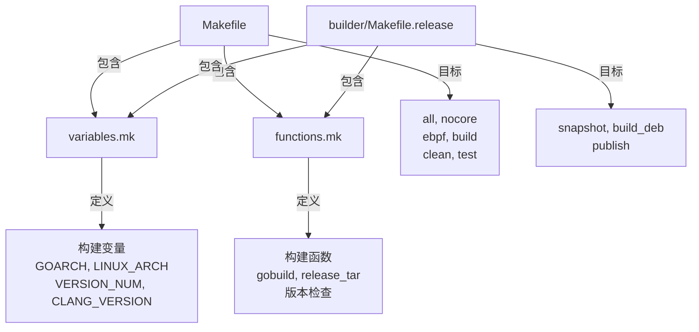
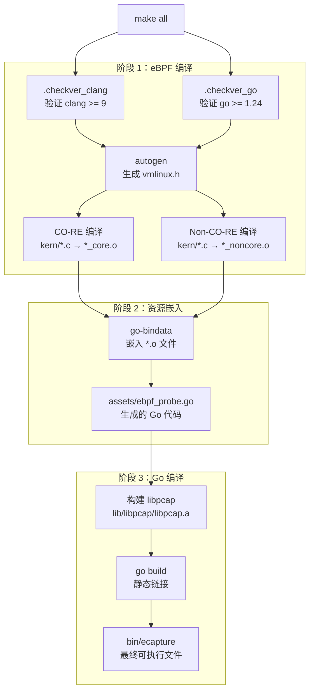
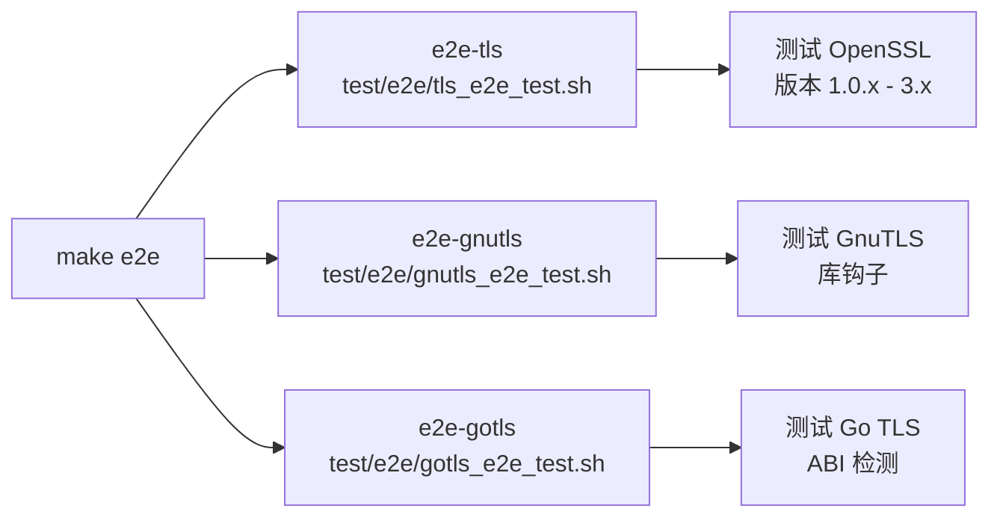
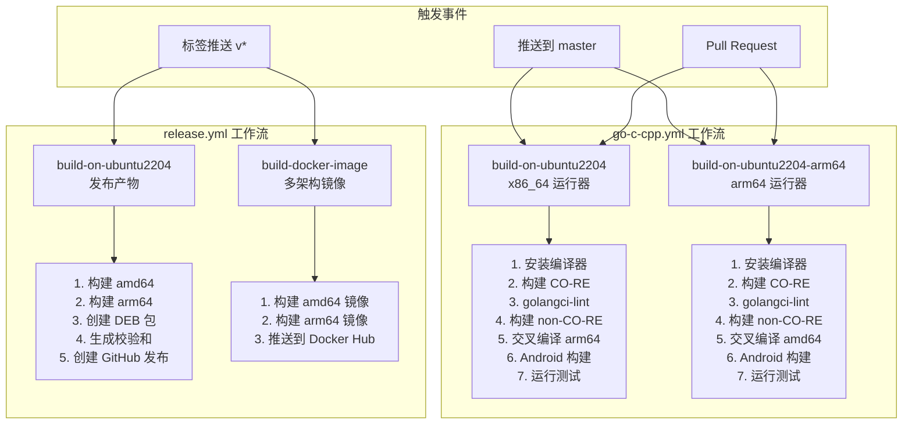
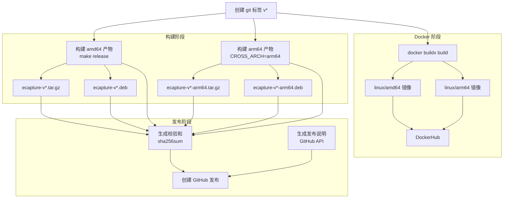

# 开发指南

本文档为向 eCapture 项目贡献代码的开发者提供全面指导。内容涵盖构建系统、开发工作流、测试流程和发布过程。有关实现新捕获模块的信息，请参阅 [添加新模块](5.3-adding-new-modules.md)。有关 eBPF 程序开发的详细信息，请参阅 [eBPF 程序开发](5.2-ebpf-program-development.md)。

---

## 开发环境设置

### 前置条件

eCapture 开发需要以下工具和库：

| 组件 | 最低版本 | 用途 |
|-----------|----------------|---------|
| Go | 1.24 | 用户空间程序编译 |
| Clang | 9+ (推荐 14) | eBPF 程序编译 |
| LLVM | 9+ (推荐 14) | eBPF 字节码生成 |
| Linux Kernel | 4.18+ | eBPF 支持 |
| libelf-dev | - | ELF 文件解析 |
| Linux headers | - | 内核结构定义 |

### 环境初始化脚本

项目在 [builder/init_env.sh:1-106](https://github.com/gojue/ecapture/blob/ca085d05/builder/init_env.sh#L1-L106) 提供了自动化环境设置脚本。该脚本执行以下操作：

1. 检测 Ubuntu 版本并选择适当的 Clang 版本 ([builder/init_env.sh:16-39](https://github.com/gojue/ecapture/blob/ca085d05/builder/init_env.sh#L16-L39))
2. 通过 apt-get 安装所需的软件包 ([builder/init_env.sh:72-74](https://github.com/gojue/ecapture/blob/ca085d05/builder/init_env.sh#L72-L74))
3. 配置交叉编译工具链 ([builder/init_env.sh:43-61](https://github.com/gojue/ecapture/blob/ca085d05/builder/init_env.sh#L43-L61))
4. 为 eBPF 编译准备 Linux 内核源码 ([builder/init_env.sh:81-89](https://github.com/gojue/ecapture/blob/ca085d05/builder/init_env.sh#L81-L89))
5. 下载并安装 Go ([builder/init_env.sh:94-97](https://github.com/gojue/ecapture/blob/ca085d05/builder/init_env.sh#L94-L97))

**架构检测：**
脚本会自动检测主机架构并配置交叉编译：
- 在 x86_64 上：设置 aarch64 交叉编译 ([builder/init_env.sh:48-52](https://github.com/gojue/ecapture/blob/ca085d05/builder/init_env.sh#L48-L52))
- 在 aarch64 上：设置 x86_64 交叉编译 ([builder/init_env.sh:53-58](https://github.com/gojue/ecapture/blob/ca085d05/builder/init_env.sh#L53-L58))

**手动执行：**
```bash
/bin/bash -c "$(curl -fsSL https://raw.githubusercontent.com/gojue/ecapture/master/builder/init_env.sh)"
```

来源：[builder/init_env.sh:1-106](https://github.com/gojue/ecapture/blob/ca085d05/builder/init_env.sh#L1-L106)

---

## 构建系统架构

### Makefile 结构

构建系统由三个主要文件组成：


```mermaid
graph TB
    Main[Makefile]
    Vars[variables.mk]
    Funcs[functions.mk]
    Release[builder/Makefile.release]
    
    Main -->|包含| Vars
    Main -->|包含| Funcs
    Release -->|包含| Vars
    Release -->|包含| Funcs
    
    Vars -->|定义| BuildVars["构建变量<br/>GOARCH, LINUX_ARCH<br/>VERSION_NUM, CLANG_VERSION"]
    Funcs -->|定义| BuildFuncs["构建函数<br/>gobuild, release_tar<br/>版本检查"]
    
    Main -->|目标| CoreTargets["all, nocore<br/>ebpf, build<br/>clean, test"]
    Release -->|目标| RelTargets["snapshot, build_deb<br/>publish"]
```

**构建系统组件：**
- `Makefile`：主构建编排 ([Makefile:1-245](https://github.com/gojue/ecapture/blob/ca085d05/Makefile#L1-L245))
- `variables.mk`：环境检测和变量定义
- `functions.mk`：可重用的构建函数 ([functions.mk:1-76](https://github.com/gojue/ecapture/blob/ca085d05/functions.mk#L1-L76))
- `builder/Makefile.release`：发布打包和分发 ([builder/Makefile.release:1-151](https://github.com/gojue/ecapture/blob/ca085d05/builder/Makefile.release#L1-L151))

来源：[Makefile:1-11](https://github.com/gojue/ecapture/blob/ca085d05/Makefile#L1-L11)、[functions.mk:1-76](https://github.com/gojue/ecapture/blob/ca085d05/functions.mk#L1-L76)、[builder/Makefile.release:1-10](https://github.com/gojue/ecapture/blob/ca085d05/builder/Makefile.release#L1-L10)

### 构建目标概览

| 目标 | 用途 | 包含的字节码 |
|--------|---------|-------------------|
| `all` | 完整构建（CO-RE 和 non-CO-RE） | 两者都包含 |
| `nocore` | 仅构建 non-CO-RE | 仅 non-CO-RE |
| `ebpf` | 编译 CO-RE eBPF 字节码 | CO-RE |
| `ebpf_noncore` | 编译 non-CO-RE eBPF 字节码 | non-CO-RE |
| `assets` | 生成 Go 嵌入式字节码 | 两者都包含 |
| `build` | 编译 Go 二进制文件 | - |
| `clean` | 删除构建产物 | - |
| `test-race` | 运行带竞态检测器的单元测试 | - |
| `e2e` | 运行端到端测试 | - |

来源：[Makefile:4-14](https://github.com/gojue/ecapture/blob/ca085d05/Makefile#L4-L14)、[Makefile:106-245](https://github.com/gojue/ecapture/blob/ca085d05/Makefile#L106-L245)

---

## 构建流程

### 完整构建流水线


```mermaid
graph TB
    Start[make all]
    
    subgraph "阶段 1：eBPF 编译"
        AutoGen[autogen<br/>生成 vmlinux.h]
        CheckClang[.checkver_clang<br/>验证 clang >= 9]
        CheckGo[.checkver_go<br/>验证 go >= 1.24]
        
        CoreCompile[CO-RE 编译<br/>kern/*.c → *_core.o]
        NonCoreCompile[Non-CO-RE 编译<br/>kern/*.c → *_noncore.o]
    end
    
    subgraph "阶段 2：资源嵌入"
        Bindata[go-bindata<br/>嵌入 *.o 文件]
        AssetsGo[assets/ebpf_probe.go<br/>生成的 Go 代码]
    end
    
    subgraph "阶段 3：Go 编译"
        LibPcap[构建 libpcap<br/>lib/libpcap/libpcap.a]
        GoBuild[go build<br/>静态链接]
        Binary[bin/ecapture<br/>最终可执行文件]
    end
    
    Start --> CheckClang
    Start --> CheckGo
    CheckClang --> AutoGen
    CheckGo --> AutoGen
    
    AutoGen --> CoreCompile
    AutoGen --> NonCoreCompile
    
    CoreCompile --> Bindata
    NonCoreCompile --> Bindata
    
    Bindata --> AssetsGo
    
    AssetsGo --> LibPcap
    LibPcap --> GoBuild
    GoBuild --> Binary
```

来源：[Makefile:6-11](https://github.com/gojue/ecapture/blob/ca085d05/Makefile#L6-L11)、[Makefile:133-201](https://github.com/gojue/ecapture/blob/ca085d05/Makefile#L133-L201)

### CO-RE 与 Non-CO-RE 编译

**CO-RE（一次编译，到处运行）：**
```bash
clang -D__TARGET_ARCH_x86 \
  -target bpfel \
  -c kern/openssl.c \
  -o user/bytecode/openssl_kern_core.o \
  -g -fno-ident
```

- 生成与内核无关的字节码 ([Makefile:122-127](https://github.com/gojue/ecapture/blob/ca085d05/Makefile#L122-L127))
- 需要支持 BTF（BPF 类型格式）的内核
- 使用 `bpftool btf dump` 生成的 `vmlinux.h` ([Makefile:130-131](https://github.com/gojue/ecapture/blob/ca085d05/Makefile#L130-L131))
- 文件大小更小，可跨内核版本移植

**Non-CO-RE（特定内核）：**
```bash
clang -I /usr/src/linux-source/arch/x86/include \
  -c kern/openssl.c -o - | \
llc -march=bpf -filetype=obj \
  -o user/bytecode/openssl_kern_noncore.o
```

- 需要目标内核的内核头文件 ([Makefile:144-159](https://github.com/gojue/ecapture/blob/ca085d05/Makefile#L144-L159))
- 可在不支持 BTF 的旧内核上工作
- 针对特定内核，不同内核版本需要重新构建
- 由于包含内核结构定义，文件大小更大

**构建变量：**
- `KERN_SRC_PATH`：内核源码路径 ([Makefile:147-154](https://github.com/gojue/ecapture/blob/ca085d05/Makefile#L147-L154))
- `KERN_BUILD_PATH`：内核构建路径 ([Makefile:148-152](https://github.com/gojue/ecapture/blob/ca085d05/Makefile#L148-L152))
- `LINUX_ARCH`：目标架构（x86、arm64）([Makefile:122](https://github.com/gojue/ecapture/blob/ca085d05/Makefile#L122))

来源：[Makefile:117-159](https://github.com/gojue/ecapture/blob/ca085d05/Makefile#L117-L159)

### 资源嵌入流程

构建系统使用 `go-bindata` 将所有 eBPF 字节码文件嵌入到 Go 二进制文件中：

1. **编译 eBPF 程序**：在 `user/bytecode/` 中生成 `*.o` 文件
2. **生成 Go 代码**：`go-bindata` 读取所有 `.o` 文件 ([Makefile:164](https://github.com/gojue/ecapture/blob/ca085d05/Makefile#L164))
3. **创建资源包**：生成 `assets/ebpf_probe.go` ([Makefile:164](https://github.com/gojue/ecapture/blob/ca085d05/Makefile#L164))
4. **嵌入到二进制文件**：Go 构建包含嵌入的资源

这种方法消除了在二进制文件旁分发单独字节码文件的需要。

来源：[Makefile:162-171](https://github.com/gojue/ecapture/blob/ca085d05/Makefile#L162-L171)

---

## 构建 eCapture

### 标准构建（本地架构）

**完整构建，包含 CO-RE 和 non-CO-RE：**
```bash
make clean
make env          # 显示构建环境
make all          # 构建所有内容
```

**仅 non-CO-RE（用于旧内核）：**
```bash
make clean
make nocore
```

`nocore` 目标适用于以下情况：
- 目标系统缺少 BTF 支持
- 部署到特定内核版本
- 通过排除 CO-RE 字节码来减少二进制大小

来源：[Makefile:4-14](https://github.com/gojue/ecapture/blob/ca085d05/Makefile#L4-L14)

### 交叉编译

**在 x86_64 上为 ARM64 构建：**
```bash
make clean
CROSS_ARCH=arm64 make env
CROSS_ARCH=arm64 make all
```

**在 ARM64 上为 x86_64 构建：**
```bash
make clean
CROSS_ARCH=amd64 make env
CROSS_ARCH=amd64 make all
```

**交叉编译要求：**
- 已安装交叉编译工具链 ([.github/workflows/go-c-cpp.yml:19](https://github.com/gojue/ecapture/blob/ca085d05/.github/workflows/go-c-cpp.yml#L19))
  - 对于 ARM64：`gcc-aarch64-linux-gnu`
  - 对于 x86_64：`gcc-x86-64-linux-gnu`
- 已准备目标架构的内核头文件 ([.github/workflows/go-c-cpp.yml:31](https://github.com/gojue/ecapture/blob/ca085d05/.github/workflows/go-c-cpp.yml#L31))

**libpcap 交叉编译：**
构建系统自动为交叉编译配置 libpcap：
```bash
CC=aarch64-linux-gnu-gcc AR=aarch64-linux-gnu-ar \
  ./configure --host=aarch64-linux-gnu
```

来源：[Makefile:56-65](https://github.com/gojue/ecapture/blob/ca085d05/Makefile#L56-L65)、[Makefile:176-184](https://github.com/gojue/ecapture/blob/ca085d05/Makefile#L176-L184)、[.github/workflows/go-c-cpp.yml:56-65](https://github.com/gojue/ecapture/blob/ca085d05/.github/workflows/go-c-cpp.yml#L56-L65)

### Android 构建

**为 Android 构建（ARM64）：**
```bash
make clean
CROSS_ARCH=arm64 make env
ANDROID=1 CROSS_ARCH=arm64 make nocore
```

**Android 特定注意事项：**
- Android 构建仅使用 non-CO-RE ([.github/workflows/go-c-cpp.yml:61-65](https://github.com/gojue/ecapture/blob/ca085d05/.github/workflows/go-c-cpp.yml#L61-L65))
- 特殊处理 BoringSSL 版本（Android 12-16）
- ARM 架构的网络字节序调整

来源：[Makefile:95](https://github.com/gojue/ecapture/blob/ca085d05/Makefile#L95)、[.github/workflows/go-c-cpp.yml:61-65](https://github.com/gojue/ecapture/blob/ca085d05/.github/workflows/go-c-cpp.yml#L61-L65)

### 构建环境变量

| 变量 | 说明 | 示例 |
|----------|-------------|---------|
| `CROSS_ARCH` | 目标架构 | `arm64`、`amd64` |
| `ANDROID` | Android 构建标志 | `1`（启用）|
| `DEBUG` | 调试构建标志 | `1`（启用调试符号）|
| `SNAPSHOT_VERSION` | 覆盖版本字符串 | `v0.8.0` |

**环境显示：**
```bash
make env
```

此命令显示所有构建变量，包括：
- 主机架构检测
- 内核版本
- 编译器版本
- 目标架构设置
- 版本信息

来源：[Makefile:19-63](https://github.com/gojue/ecapture/blob/ca085d05/Makefile#L19-L63)

---

## 测试

### 单元测试

**运行单元测试：**
```bash
go test -v ./...
```

**使用竞态检测器运行：**
```bash
make test-race
```

竞态检测器构建 ([Makefile:216-224](https://github.com/gojue/ecapture/blob/ca085d05/Makefile#L216-L224))：
- 启用 `CGO_ENABLED=1` 以实现 C 集成
- 与 libpcap 静态链接
- 使用竞态检测器识别数据竞争

来源：[Makefile:216-224](https://github.com/gojue/ecapture/blob/ca085d05/Makefile#L216-L224)

### 端到端测试

项目为每个主要模块提供 E2E 测试脚本：


```mermaid
graph LR
    E2E[make e2e]
    
    TLS[e2e-tls<br/>test/e2e/tls_e2e_test.sh]
    GnuTLS[e2e-gnutls<br/>test/e2e/gnutls_e2e_test.sh]
    GoTLS[e2e-gotls<br/>test/e2e/gotls_e2e_test.sh]
    
    E2E --> TLS
    E2E --> GnuTLS
    E2E --> GoTLS
    
    TLS --> TestOpenSSL["测试 OpenSSL<br/>版本 1.0.x - 3.x"]
    GnuTLS --> TestGnuTLS["测试 GnuTLS<br/>库钩子"]
    GoTLS --> TestGo["测试 Go TLS<br/>ABI 检测"]
```

**运行特定 E2E 测试：**
```bash
make e2e-tls       # 测试 TLS/SSL 捕获
make e2e-gnutls    # 测试 GnuTLS 捕获
make e2e-gotls     # 测试 Go TLS 捕获
```

**运行所有 E2E 测试：**
```bash
make e2e
```

来源：[Makefile:226-244](https://github.com/gojue/ecapture/blob/ca085d05/Makefile#L226-L244)

---

## CI/CD 流水线

### GitHub Actions 工作流架构


```mermaid
graph TB
    subgraph "触发事件"
        Push[推送到 master]
        PR[Pull Request]
        Tag[标签推送 v*]
    end
    
    subgraph "go-c-cpp.yml 工作流"
        Job1[build-on-ubuntu2204<br/>x86_64 运行器]
        Job2[build-on-ubuntu2204-arm64<br/>arm64 运行器]
        
        Job1Steps["1. 安装编译器<br/>2. 构建 CO-RE<br/>3. golangci-lint<br/>4. 构建 non-CO-RE<br/>5. 交叉编译 arm64<br/>6. Android 构建<br/>7. 运行测试"]
        
        Job2Steps["1. 安装编译器<br/>2. 构建 CO-RE<br/>3. golangci-lint<br/>4. 构建 non-CO-RE<br/>5. 交叉编译 amd64<br/>6. Android 构建<br/>7. 运行测试"]
        
        Job1 --> Job1Steps
        Job2 --> Job2Steps
    end
    
    subgraph "release.yml 工作流"
        ReleaseJob1[build-on-ubuntu2204<br/>发布产物]
        ReleaseJob2[build-docker-image<br/>多架构镜像]
        
        ReleaseSteps["1. 构建 amd64<br/>2. 构建 arm64<br/>3. 创建 DEB 包<br/>4. 生成校验和<br/>5. 创建 GitHub 发布"]
        
        DockerSteps["1. 构建 amd64 镜像<br/>2. 构建 arm64 镜像<br/>3. 推送到 Docker Hub"]
        
        ReleaseJob1 --> ReleaseSteps
        ReleaseJob2 --> DockerSteps
    end
    
    Push --> Job1
    Push --> Job2
    PR --> Job1
    PR --> Job2
    Tag --> ReleaseJob1
    Tag --> ReleaseJob2
```

来源：[.github/workflows/go-c-cpp.yml:1-128](https://github.com/gojue/ecapture/blob/ca085d05/.github/workflows/go-c-cpp.yml#L1-L128)、[.github/workflows/release.yml:1-129](https://github.com/gojue/ecapture/blob/ca085d05/.github/workflows/release.yml#L1-L129)

### CI 构建矩阵

CI 系统构建并测试多种配置：

| 架构 | 本地构建 | 交叉编译 | Android |
|--------------|--------------|-------------------|---------|
| x86_64 | ✓ CO-RE + non-CO-RE | ✓ arm64 目标 | ✓ arm64 |
| arm64 | ✓ CO-RE + non-CO-RE | ✓ amd64 目标 | ✓ amd64 |

**CI 构建步骤：**

1. **设置环境** ([.github/workflows/go-c-cpp.yml:16-33](https://github.com/gojue/ecapture/blob/ca085d05/.github/workflows/go-c-cpp.yml#L16-L33)):
   - 安装 Go 1.24.6
   - 安装 Clang 14、LLVM 工具
   - 提取并准备 Linux 内核源码

2. **本地 CO-RE 构建** ([.github/workflows/go-c-cpp.yml:38-44](https://github.com/gojue/ecapture/blob/ca085d05/.github/workflows/go-c-cpp.yml#L38-L44)):
   ```bash
   make clean
   make env
   DEBUG=1 make -j8
   ```

3. **代码质量检查** ([.github/workflows/go-c-cpp.yml:45-50](https://github.com/gojue/ecapture/blob/ca085d05/.github/workflows/go-c-cpp.yml#L45-L50)):
   - 对 Go 代码运行 `golangci-lint`
   - 版本：v2.1

4. **Non-CO-RE 构建** ([.github/workflows/go-c-cpp.yml:51-55](https://github.com/gojue/ecapture/blob/ca085d05/.github/workflows/go-c-cpp.yml#L51-L55)):
   ```bash
   make clean
   make nocore
   ```

5. **交叉编译** ([.github/workflows/go-c-cpp.yml:56-65](https://github.com/gojue/ecapture/blob/ca085d05/.github/workflows/go-c-cpp.yml#L56-L65)):
   ```bash
   CROSS_ARCH=arm64 make env
   CROSS_ARCH=arm64 make -j8
   ANDROID=1 CROSS_ARCH=arm64 make nocore -j8
   ```

6. **测试执行** ([.github/workflows/go-c-cpp.yml:66-67](https://github.com/gojue/ecapture/blob/ca085d05/.github/workflows/go-c-cpp.yml#L66-L67)):
   ```bash
   go test -v -race ./...
   ```

来源：[.github/workflows/go-c-cpp.yml:9-127](https://github.com/gojue/ecapture/blob/ca085d05/.github/workflows/go-c-cpp.yml#L9-L127)

### 编译器版本管理

CI 系统确保一致的编译器版本：

**Clang/LLVM 设置：**
```bash
for tool in "clang" "llc" "llvm-strip"
do
  sudo rm -f /usr/bin/$tool
  sudo ln -s /usr/bin/$tool-14 /usr/bin/$tool
done
```

这会创建符号链接以强制使用 Clang 14 ([.github/workflows/go-c-cpp.yml:20-24](https://github.com/gojue/ecapture/blob/ca085d05/.github/workflows/go-c-cpp.yml#L20-L24))。

**内核源码准备：**
```bash
cd /usr/src
source_file=$(find . -maxdepth 1 -name "*linux-source*.tar.bz2")
sudo tar -xf $source_file
cd $source_dir
sudo make ARCH=arm64 CROSS_COMPILE=aarch64-linux-gnu- prepare V=0
```

为交叉编译准备内核头文件 ([.github/workflows/go-c-cpp.yml:25-32](https://github.com/gojue/ecapture/blob/ca085d05/.github/workflows/go-c-cpp.yml#L25-L32))。

来源：[.github/workflows/go-c-cpp.yml:16-33](https://github.com/gojue/ecapture/blob/ca085d05/.github/workflows/go-c-cpp.yml#L16-L33)

---

## 发布流程

### 发布工作流


```mermaid
graph TB
    Start[创建 git 标签 v*]
    
    subgraph "构建阶段"
        Build1[构建 amd64 产物<br/>make release]
        Build2[构建 arm64 产物<br/>CROSS_ARCH=arm64]
        
        Build1 --> Archive1[ecapture-v*.tar.gz]
        Build1 --> DEB1[ecapture-v*.deb]
        
        Build2 --> Archive2[ecapture-v*-arm64.tar.gz]
        Build2 --> DEB2[ecapture-v*-arm64.deb]
    end
    
    subgraph "Docker 阶段"
        Docker[docker buildx build]
        Docker --> ImageAMD64[linux/amd64 镜像]
        Docker --> ImageARM64[linux/arm64 镜像]
        
        ImageAMD64 --> DockerHub
        ImageARM64 --> DockerHub
    end
    
    subgraph "发布阶段"
        GenChecksum[生成校验和<br/>sha256sum]
        GenNotes[生成发布说明<br/>GitHub API]
        
        Archive1 --> GenChecksum
        Archive2 --> GenChecksum
        DEB1 --> GenChecksum
        DEB2 --> GenChecksum
        
        GenChecksum --> Release[创建 GitHub 发布]
        GenNotes --> Release
    end
    
    Start --> Build1
    Start --> Build2
    Start --> Docker
    
    Build1 --> GenChecksum
    Build2 --> GenChecksum
```

来源：[.github/workflows/release.yml:1-129](https://github.com/gojue/ecapture/blob/ca085d05/.github/workflows/release.yml#L1-L129)、[builder/Makefile.release:1-151](https://github.com/gojue/ecapture/blob/ca085d05/builder/Makefile.release#L1-L151)

### 发布目标

**创建快照（开发构建）：**
```bash
make -f builder/Makefile.release snapshot
```

**创建发布（特定版本）：**
```bash
SNAPSHOT_VERSION=v0.8.0 make -f builder/Makefile.release release
```

**发布到 GitHub：**
```bash
SNAPSHOT_VERSION=v0.8.0 make -f builder/Makefile.release publish
```

`release` 目标编排 ([builder/Makefile.release:10](https://github.com/gojue/ecapture/blob/ca085d05/builder/Makefile.release#L10))：
1. `snapshot`：构建 Linux 产物
2. `build_deb`：创建 DEB 包
3. `snapshot_android`：构建 Android 产物

来源：[builder/Makefile.release:10-151](https://github.com/gojue/ecapture/blob/ca085d05/builder/Makefile.release#L10-L151)

### 打包格式

#### TAR.GZ 归档文件

**归档内容：**
- `ecapture` 二进制文件
- `LICENSE`
- `CHANGELOG.md`
- `README.md` 和 `README_CN.md`

**命名约定：**
```
ecapture-{VERSION}-{OS}-{ARCH}[-nocore].tar.gz
```

示例：
- `ecapture-v0.8.0-linux-amd64.tar.gz`（CO-RE + non-CO-RE）
- `ecapture-v0.8.0-android-arm64-nocore.tar.gz`（仅 non-CO-RE）

**归档创建** ([builder/Makefile.release:62-76](https://github.com/gojue/ecapture/blob/ca085d05/builder/Makefile.release#L62-L76)):
```bash
$(CMD_MKDIR) -p $(TAR_DIR)
$(CMD_CP) LICENSE $(TAR_DIR)/LICENSE
$(CMD_CP) bin/ecapture $(TAR_DIR)/ecapture
$(CMD_TAR) -czf $(OUT_ARCHIVE) $(TAR_DIR)
```

来源：[builder/Makefile.release:62-76](https://github.com/gojue/ecapture/blob/ca085d05/builder/Makefile.release#L62-L76)、[functions.mk:62-76](https://github.com/gojue/ecapture/blob/ca085d05/functions.mk#L62-L76)

#### DEB 包

**包结构：**
```
ecapture-v0.8.0-amd64.deb
├── DEBIAN/
│   └── control
└── usr/
    └── local/
        └── bin/
            └── ecapture
```

**控制文件字段** ([builder/Makefile.release:143-149](https://github.com/gojue/ecapture/blob/ca085d05/builder/Makefile.release#L143-L149)):
- Package: ecapture
- Version: 从 git 标签提取
- Architecture: amd64 或 arm64
- Maintainer: CFC4N <cfc4ncs@gmail.com>
- Description: capture SSL/TLS text content without CA cert by eBPF

**构建过程：**
```bash
make -f builder/Makefile.release deb
```

使用 `dpkg-deb --build` 创建 DEB 包 ([builder/Makefile.release:151](https://github.com/gojue/ecapture/blob/ca085d05/builder/Makefile.release#L151))。

来源：[builder/Makefile.release:132-151](https://github.com/gojue/ecapture/blob/ca085d05/builder/Makefile.release#L132-L151)

#### Docker 镜像

**多架构构建：**
```bash
docker buildx build \
  --platform linux/amd64,linux/arm64 \
  --build-arg VERSION=v0.8.0 \
  -t ecapture:v0.8.0 \
  -t ecapture:latest \
  --push .
```

**Dockerfile 阶段** ([builder/Dockerfile:1-39](https://github.com/gojue/ecapture/blob/ca085d05/builder/Dockerfile#L1-L39)):

1. **构建器阶段**：Ubuntu 22.04 基础镜像
   - 安装编译器（Clang 14、Go 1.24.6）
   - 使用 `make all` 构建 eCapture
   
2. **运行时阶段**：Alpine Linux
   - 仅复制 `ecapture` 二进制文件
   - 设置 ENTRYPOINT 为 `/ecapture`

**镜像标签：**
- `{username}/ecapture:v{VERSION}`（特定版本）
- `{username}/ecapture:latest`（最新发布）

来源：[.github/workflows/release.yml:101-129](https://github.com/gojue/ecapture/blob/ca085d05/.github/workflows/release.yml#L101-L129)、[builder/Dockerfile:1-39](https://github.com/gojue/ecapture/blob/ca085d05/builder/Dockerfile#L1-L39)

### 发布说明生成

发布工作流自动生成发布说明：

1. **获取前一个标签** ([.github/workflows/release.yml:63-67](https://github.com/gojue/ecapture/blob/ca085d05/.github/workflows/release.yml#L63-L67)):
   ```bash
   PREVIOUS=$(git describe --tags --abbrev=0 HEAD^ 2>/dev/null || echo "")
   ```

2. **通过 GitHub API 生成说明** ([.github/workflows/release.yml:68-80](https://github.com/gojue/ecapture/blob/ca085d05/.github/workflows/release.yml#L68-L80)):
   ```bash
   gh api --method POST \
     /repos/$REPO/releases/generate-notes \
     -f tag_name=$TAG \
     -f previous_tag_name=$PREVIOUS_TAG
   ```

3. **创建发布** ([builder/Makefile.release:124](https://github.com/gojue/ecapture/blob/ca085d05/builder/Makefile.release#L124)):
   ```bash
   gh release create $(VERSION) $$FILES \
     --title "eCapture $(VERSION)" \
     --notes-file $(RELEASE_NOTES)
   ```

来源：[.github/workflows/release.yml:63-87](https://github.com/gojue/ecapture/blob/ca085d05/.github/workflows/release.yml#L63-L87)、[builder/Makefile.release:114-124](https://github.com/gojue/ecapture/blob/ca085d05/builder/Makefile.release#L114-L124)

---

## 开发工作流总结

### 典型开发周期

1. **设置环境：**
   ```bash
   /bin/bash -c "$(curl -fsSL https://raw.githubusercontent.com/gojue/ecapture/master/builder/init_env.sh)"
   ```

2. **克隆并构建：**
   ```bash
   git clone https://github.com/gojue/ecapture.git
   cd ecapture
   make env          # 验证环境
   make all          # 构建所有内容
   ```

3. **进行修改：**
   - 在 `kern/` 中修改 eBPF 程序
   - 在 `cli/`、`user/` 或其他包中修改 Go 代码

4. **测试：**
   ```bash
   make clean
   make all
   go test -v ./...
   make e2e          # 如果测试模块
   ```

5. **格式化代码：**
   ```bash
   make format       # 使用 clang-format 格式化 C 代码
   ```

6. **提交并推送：**
   ```bash
   git add .
   git commit -m "Your change description"
   git push origin your-branch
   ```

7. **创建 Pull Request：**
   - CI 自动在 x86_64 和 arm64 上运行
   - 测试本地和交叉编译构建
   - 使用 golangci-lint 检查代码质量

### 关键构建命令参考

| 命令 | 用途 | 使用场景 |
|---------|---------|----------|
| `make env` | 显示构建环境 | 验证配置 |
| `make all` | 完整构建（CO-RE + non-CO-RE）| 开发 |
| `make nocore` | 仅 non-CO-RE 构建 | 旧内核 |
| `make clean` | 删除构建产物 | 清理重建 |
| `make test-race` | 使用竞态检测器运行测试 | 查找并发问题 |
| `make e2e` | 运行 E2E 测试 | 集成测试 |
| `make format` | 格式化 C 代码 | 代码风格 |
| `CROSS_ARCH=arm64 make` | 为 ARM64 交叉编译 | ARM 目标 |
| `ANDROID=1 make nocore` | 为 Android 构建 | 移动部署 |

来源：[Makefile:1-245](https://github.com/gojue/ecapture/blob/ca085d05/Makefile#L1-L245)、[builder/Makefile.release:1-151](https://github.com/gojue/ecapture/blob/ca085d05/builder/Makefile.release#L1-L151)