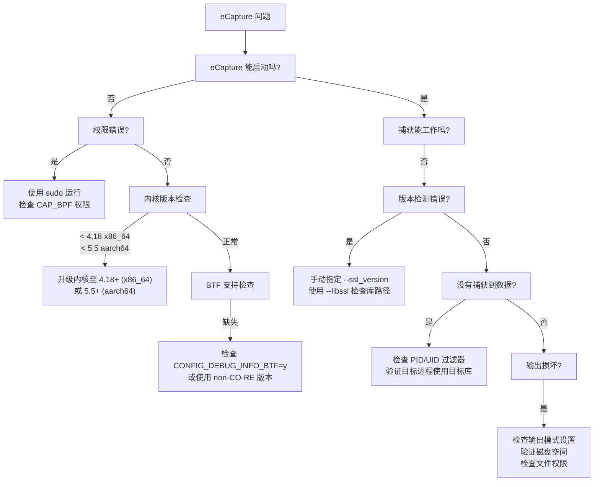
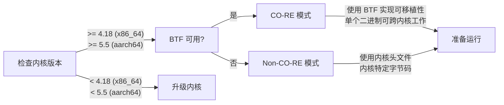
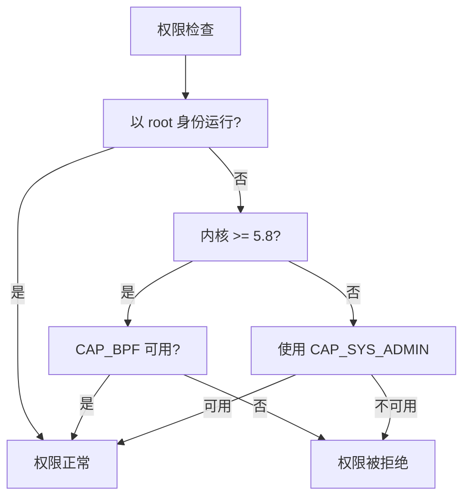
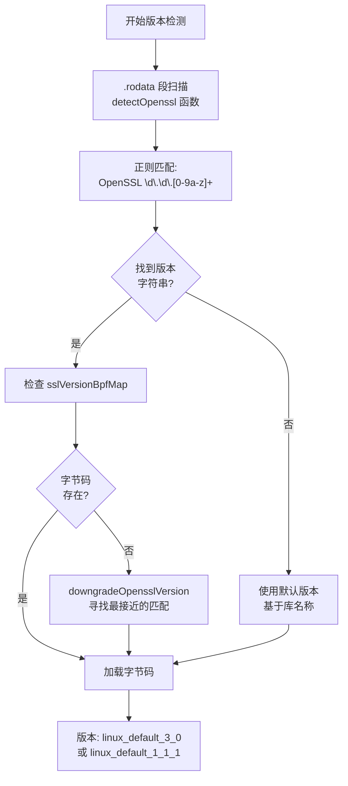
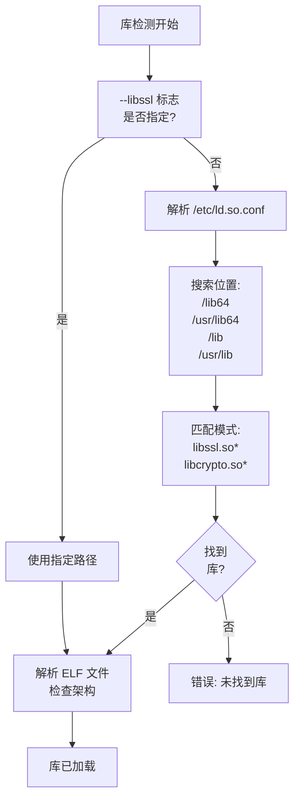
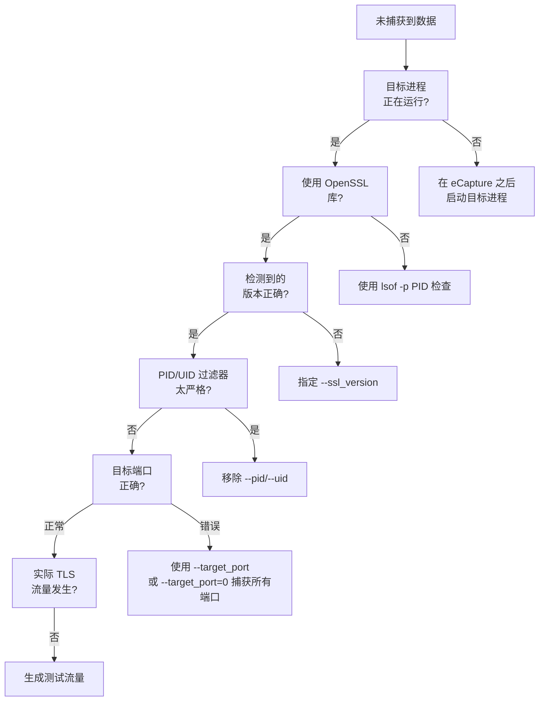
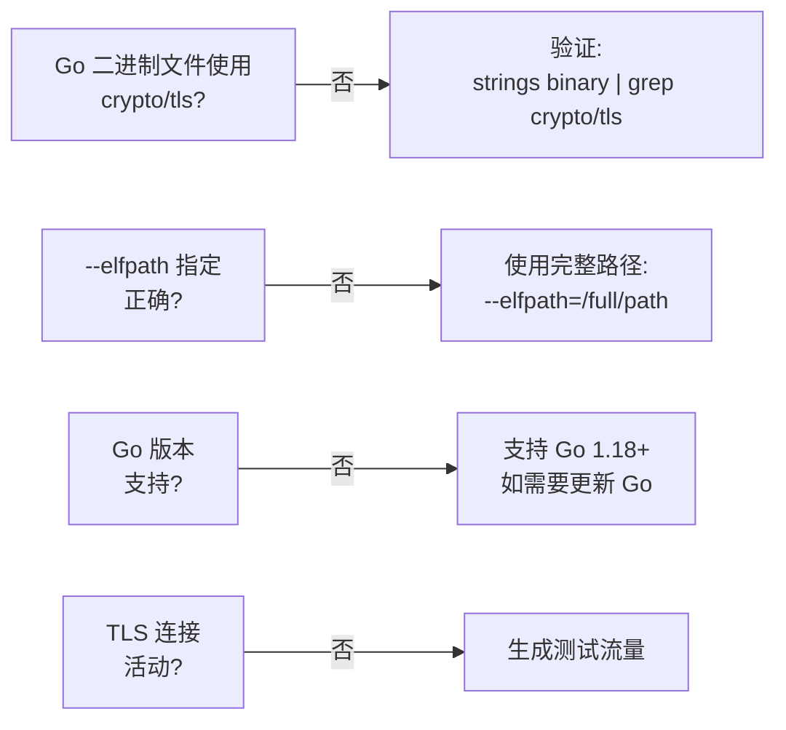

# 常见问题

本页面提供使用 eCapture 时遇到的常见问题的解决方案，以及调试技术和常见问题解答。有关系统要求和安装的信息，请参阅[依赖与系统要求](../1-overview/1.3-dependencies-and-system-requirements.md)。有关构建问题，请参考[构建系统](../5-development-guide/5.1-build-system.md)。

---

## 常见问题决策树

以下图表显示了诊断常见 eCapture 问题的决策树：



来源：[README.md:13-17](https://github.com/gojue/ecapture/blob/0766a93b/README.md#L13-L17), [CHANGELOG.md:41-50](https://github.com/gojue/ecapture/blob/0766a93b/CHANGELOG.md#L41-L50), [user/module/probe_openssl_lib.go:64-70](https://github.com/gojue/ecapture/blob/0766a93b/user/module/probe_openssl_lib.go#L64-L70)

---

## 内核和系统要求问题

### 问题："内核版本过低"或 eCapture 无法启动

**症状：**
- 关于内核版本的错误消息
- 程序立即退出
- eBPF 程序加载失败

**所需内核版本：**

| 架构 | 最低内核版本 | CO-RE 支持 |
|------|------------|-----------|
| x86_64 | 4.18 | 是 |
| aarch64 | 5.5 | 是 |

**解决方案：**

1. 检查内核版本：
```bash
uname -r
```

2. 验证 BTF 支持（CO-RE 模式所需）：
```bash
cat /boot/config-$(uname -r) | grep CONFIG_DEBUG_INFO_BTF
# 应返回：CONFIG_DEBUG_INFO_BTF=y
```

3. 如果 BTF 不可用：
   - 检查 BTF 数据是否存在：`ls -l /sys/kernel/btf/vmlinux`
   - 如果 BTF 不可用，eCapture 会自动回退到 non-CO-RE 模式

**故障排除图：**



来源：[README.md:13-17](https://github.com/gojue/ecapture/blob/0766a93b/README.md#L13-L17), [variables.mk:153-167](https://github.com/gojue/ecapture/blob/0766a93b/variables.mk#L153-L167), [CHANGELOG.md:41](https://github.com/gojue/ecapture/blob/0766a93b/CHANGELOG.md#L41)

---

## 权限问题

### 问题："操作不被允许"或"权限被拒绝"

**症状：**
- 加载 eBPF 程序时出错
- "failed to load BPF program" 消息
- CAP_BPF 相关错误

**所需权限：**

eCapture 需要 **ROOT 权限**或特定权限：

1. **CAP_BPF** - 加载 eBPF 程序（Linux 5.8+）
2. **CAP_PERFMON** - 访问性能监控
3. **CAP_NET_ADMIN** - 附加 TC 程序
4. **CAP_SYS_ADMIN** - 旧版内核的传统权限

**解决方案：**

1. 使用 sudo 运行：
```bash
sudo ecapture tls
```

2. 检查权限（Linux 5.8+）：
```bash
# eCapture 会自动检测 CAP_BPF
# 如果检测失败，您会看到警告
```

3. 对于 Docker 容器：
```bash
docker run --rm --privileged=true --net=host gojue/ecapture tls
```

**权限检查流程：**



来源：[CHANGELOG.md:322-323](https://github.com/gojue/ecapture/blob/0766a93b/CHANGELOG.md#L322-L323), [CHANGELOG.md:343](https://github.com/gojue/ecapture/blob/0766a93b/CHANGELOG.md#L343), [CHANGELOG.md:370](https://github.com/gojue/ecapture/blob/0766a93b/CHANGELOG.md#L370)

---

## 版本检测问题

### 问题："未找到 OpenSSL/BoringSSL 版本"或"使用默认版本"

**症状：**
- 警告："OpenSSL/BoringSSL version not found from shared library file"
- 警告："used default version"
- 未捕获到数据或数据不正确

**版本检测过程：**



**解决方案：**

1. **手动指定 OpenSSL 版本：**
```bash
# 对于 OpenSSL 3.0.x
sudo ecapture tls --ssl_version="openssl 3.0.0"

# 对于 OpenSSL 1.1.1
sudo ecapture tls --ssl_version="openssl 1.1.1"

# 对于 Android BoringSSL
sudo ecapture tls --ssl_version="boringssl_a_14"
```

2. **显式指定库路径：**
```bash
# 如果库在非标准位置
sudo ecapture tls --libssl=/usr/local/lib/libssl.so.3

# 对于静态链接的二进制文件
sudo ecapture tls --libssl=/path/to/static/binary
```

3. **支持的 OpenSSL/BoringSSL 版本：**

| 库类型 | 支持的版本 |
|--------|-----------|
| OpenSSL 1.0.2 | 1.0.2a - 1.0.2u |
| OpenSSL 1.1.0 | 1.1.0a - 1.1.0l |
| OpenSSL 1.1.1 | 1.1.1a - 1.1.1w |
| OpenSSL 3.0.x | 3.0.0 - 3.0.17 |
| OpenSSL 3.1.x | 3.1.0 - 3.1.8 |
| OpenSSL 3.2.x | 3.2.0 - 3.2.5 |
| OpenSSL 3.3.x | 3.3.0 - 3.3.4 |
| OpenSSL 3.4.x | 3.4.0 - 3.4.2 |
| OpenSSL 3.5.x | 3.5.0 - 3.5.4 |
| BoringSSL (Android) | Android 12-16 (A12-A16) |
| BoringSSL (Non-Android) | 最新 master 分支 |

4. **版本降级逻辑：**

当找不到完全匹配时，eCapture 实现了自动版本降级以找到最接近的支持版本。

**错误消息映射：**

| 错误/警告 | 含义 | 解决方案 |
|----------|------|---------|
| `OpenSSL/BoringSSL version not found from shared library file` | 在 .rodata 段中找不到版本字符串 | 手动指定 `--ssl_version` |
| `used default version` | 使用回退字节码 | 验证捕获是否工作；如果不行，指定版本 |
| `Can not find Default BoringSSL version` | sslVersionBpfMap 缺少 Android 默认值 | 使用 `--android_ver` 检查 Android 版本 |
| `OpenSSL/BoringSSL version bytecode not found` | 检测到的版本没有编译的字节码 | 使用支持的版本或默认版本 |

来源：[user/module/probe_openssl_lib.go:189-282](https://github.com/gojue/ecapture/blob/0766a93b/user/module/probe_openssl_lib.go#L189-L282), [user/module/probe_openssl_lib.go:284-317](https://github.com/gojue/ecapture/blob/0766a93b/user/module/probe_openssl_lib.go#L284-L317), [user/module/probe_openssl_lib.go:341-369](https://github.com/gojue/ecapture/blob/0766a93b/user/module/probe_openssl_lib.go#L341-L369), [user/module/probe_openssl_lib.go:44-62](https://github.com/gojue/ecapture/blob/0766a93b/user/module/probe_openssl_lib.go#L44-L62), [variables.mk:190-212](https://github.com/gojue/ecapture/blob/0766a93b/variables.mk#L190-L212)

---

## 库检测问题

### 问题："couldn't find bpf bytecode file error"或找不到库

**症状：**
- 错误："couldn't find bpf bytecode file error"
- 库路径检测失败
- 没有附加钩子

**库搜索顺序：**



**解决方案：**

1. **检查库是否存在：**
```bash
# 查找 OpenSSL 库
ldconfig -p | grep libssl

# 检查库版本
strings /usr/lib/x86_64-linux-gnu/libssl.so.3 | grep "OpenSSL"
```

2. **修复 /etc/ld.so.conf 路径问题：**
```bash
# 验证 ld.so.conf
cat /etc/ld.so.conf

# 更新库缓存
sudo ldconfig
```

3. **显式指定库路径：**
```bash
# 对于自定义安装
sudo ecapture tls --libssl=/opt/openssl/lib/libssl.so

# 对于非标准路径的容器环境
sudo ecapture tls --libssl=/custom/path/libssl.so.1.1
```

4. **常见库位置：**

| 发行版 | 典型路径 |
|--------|---------|
| Ubuntu/Debian | `/usr/lib/x86_64-linux-gnu/libssl.so.3` |
| CentOS/RHEL | `/usr/lib64/libssl.so.1.1` |
| Alpine Linux | `/usr/lib/libssl.so.3` |
| Android | `/apex/com.android.conscrypt/lib64/libssl.so` |

来源：[CHANGELOG.md:84](https://github.com/gojue/ecapture/blob/0766a93b/CHANGELOG.md#L84), [CHANGELOG.md:436](https://github.com/gojue/ecapture/blob/0766a93b/CHANGELOG.md#L436), [user/module/probe_openssl_lib.go:189-217](https://github.com/gojue/ecapture/blob/0766a93b/user/module/probe_openssl_lib.go#L189-L217)

---

## 运行时错误

### 问题：空指针异常

**症状：**
- 程序崩溃并出现空指针解引用
- 探针初始化时发生 panic

**常见原因和解决方案：**

1. **GnuTLS 探针设置失败：**
```
panic: runtime error: invalid memory address or nil pointer dereference
in gnutls probe
```

**解决方案：**已在 v1.5.0 中修复 - 确保您使用的是最新版本。

2. **未初始化的通道：**
```
panic: send on nil channel
```

**解决方案：**模块初始化顺序问题。使用重现步骤提交错误报告。

来源：[CHANGELOG.md:20](https://github.com/gojue/ecapture/blob/0766a93b/CHANGELOG.md#L20), [CHANGELOG.md:603](https://github.com/gojue/ecapture/blob/0766a93b/CHANGELOG.md#L603)

### 问题：并发 Map 访问

**症状：**
- 错误："concurrent map read and map write"
- 高负载期间程序崩溃
- 数据损坏

**解决方案：**

这是 v0.7.3 中修复的已知问题。更新到最新版本：
```bash
# 检查您的版本
ecapture -v

# 更新到最新版本
wget https://github.com/gojue/ecapture/releases/latest/download/ecapture-linux-amd64.tar.gz
```

来源：[CHANGELOG.md:650](https://github.com/gojue/ecapture/blob/0766a93b/CHANGELOG.md#L650)

### 问题："incoming chan is full"错误

**症状：**
- 警告："incoming chan is full"
- 进程意外退出
- 捕获期间数据丢失

**解决方案：**

这表示事件处理管道过载。已在 v0.9.0 中修复。

1. **减少捕获范围：**
```bash
# 按 PID 过滤
sudo ecapture tls --pid=1234

# 按 UID 过滤
sudo ecapture tls --uid=1000
```

2. **增加 map 大小：**
```bash
# 默认为 5120 KB，如需要可增加
sudo ecapture tls --mapsize=10240
```

3. **使用 pcap 模式而不是 text 模式：**
```bash
# PCAP 模式对于大流量捕获性能更好
sudo ecapture tls -m pcap -w output.pcapng -i eth0
```

来源：[CHANGELOG.md:373](https://github.com/gojue/ecapture/blob/0766a93b/CHANGELOG.md#L373), [CHANGELOG.md:709](https://github.com/gojue/ecapture/blob/0766a93b/CHANGELOG.md#L709)

---

## 模块特定故障排除

### OpenSSL/TLS 模块

#### 问题：成功启动但未捕获到数据

**诊断步骤：**



**示例命令：**

```bash
# 捕获所有端口
sudo ecapture tls --target_port=0

# 捕获特定进程
sudo ecapture tls --pid=$(pgrep curl)

# 调试详细输出
sudo ecapture tls --log-level=debug
```

来源：[README.md:72-149](https://github.com/gojue/ecapture/blob/0766a93b/README.md#L72-L149), [CHANGELOG.md:778](https://github.com/gojue/ecapture/blob/0766a93b/CHANGELOG.md#L778)

#### 问题：Keylog 文件为空或不完整

**症状：**
- `--keylogfile` 已创建但为空
- 缺少 CLIENT_RANDOM 条目
- Wireshark 无法解密流量

**解决方案：**

1. **验证 keylog 模式：**
```bash
# keylog 模式的正确语法
sudo ecapture tls -m keylog --keylogfile=keys.log
```

2. **检查 TLS 版本：**
- TLS 1.2：捕获带主密钥的 `CLIENT_RANDOM`
- TLS 1.3：捕获流量密钥（需要 OpenSSL 3.0+）

3. **常见问题：**
- OpenSSL 3.0.12 有特定错误（已在 v1.4.1 中修复）
- GoTLS keylog 中缺少尾随字节（已在 v1.4.0 中修复）
- 某些 OpenSSL 版本中 keylog 丢失（已在 v1.3.0 中修复）

来源：[CHANGELOG.md:69](https://github.com/gojue/ecapture/blob/0766a93b/CHANGELOG.md#L69), [CHANGELOG.md:85](https://github.com/gojue/ecapture/blob/0766a93b/CHANGELOG.md#L85), [CHANGELOG.md:127](https://github.com/gojue/ecapture/blob/0766a93b/CHANGELOG.md#L127)

#### 问题：PCAP 文件损坏或 Wireshark 无法打开

**症状：**
- PCAP 文件无法在 Wireshark 中打开
- "格式无效"错误
- 数据包缺失

**解决方案：**

1. **确保正确终止：**
```bash
# 使用 Ctrl+C 正确关闭 PCAP 文件
# 不要使用 kill -9
```

2. **检查磁盘空间：**
```bash
df -h /path/to/pcap/directory
```

3. **验证 PCAP-NG 格式：**
```bash
# eCapture 使用 PCAP-NG 格式
file output.pcapng
# 应显示：pcapng capture file
```

4. **DSB（解密密钥块）：**
eCapture 在 PCAP-NG 文件中将 TLS 密钥写入 DSB。确保您使用的是较新版本的 Wireshark（3.0+）。

来源：[CHANGELOG.md:161](https://github.com/gojue/ecapture/blob/0766a93b/CHANGELOG.md#L161), [CHANGELOG.md:542](https://github.com/gojue/ecapture/blob/0766a93b/CHANGELOG.md#L542), [CHANGELOG.md:664](https://github.com/gojue/ecapture/blob/0766a93b/CHANGELOG.md#L664)

### GoTLS 模块

#### 问题："cant found RET offset"或剥离的 Go 二进制文件

**症状：**
- 错误："cant found RET offset in gotls mode"
- 剥离的 Go 二进制文件无法工作
- PIE 可执行文件偏移错误

**解决方案：**

1. **剥离二进制文件支持：**
已在 v0.7.0 中添加 - 更新到最新版本。

2. **PIE 可执行文件问题：**
```bash
# 检查二进制文件是否为 PIE
file /path/to/go/binary
# 应显示："dynamically linked"或"pie executable"
```

已在 v0.7.7 中修复 aarch64 PIE 可执行文件。

3. **指定 Go 二进制文件路径：**
```bash
sudo ecapture gotls --elfpath=/path/to/go/binary
```

来源：[CHANGELOG.md:593](https://github.com/gojue/ecapture/blob/0766a93b/CHANGELOG.md#L593), [CHANGELOG.md:752](https://github.com/gojue/ecapture/blob/0766a93b/CHANGELOG.md#L752), [CHANGELOG.md:573](https://github.com/gojue/ecapture/blob/0766a93b/CHANGELOG.md#L573)

#### 问题：未捕获到 GoTLS 数据

**检查清单：**



来源：[README.md:259-276](https://github.com/gojue/ecapture/blob/0766a93b/README.md#L259-L276)

### Bash/Zsh 模块

#### 问题：未捕获 Bash 命令

**症状：**
- 没有 bash 输出
- 探针附加失败
- "不正确的探针附加"警告

**解决方案：**

1. **检查 bash 路径：**
```bash
which bash
# 常见路径：/bin/bash, /usr/bin/bash
```

2. **改进的 bash 路径检测：**
已在 v1.3.1 中修复，具有更好的路径检测和探针附加。

3. **Readline 钩子验证：**
```bash
# 检查 bash 是否使用 readline
ldd $(which bash) | grep readline
```

来源：[CHANGELOG.md:114-115](https://github.com/gojue/ecapture/blob/0766a93b/CHANGELOG.md#L114-L115), [CHANGELOG.md:592](https://github.com/gojue/ecapture/blob/0766a93b/CHANGELOG.md#L592)

### MySQL/PostgreSQL 模块

#### 问题：未捕获 SQL 查询

**支持的版本：**

| 数据库 | 支持的版本 |
|--------|----------|
| MySQL | 5.6, 5.7, 8.0 |
| MariaDB | 所有版本 |
| PostgreSQL | 10+ |

**解决方案：**

1. **验证 mysqld 进程：**
```bash
ps aux | grep mysqld
```

2. **检查 dispatch_command 符号：**
```bash
# 对于 MySQL
nm /usr/sbin/mysqld | grep dispatch_command
```

3. **模块特定标志：**
```bash
# MySQL
sudo ecapture mysqld

# PostgreSQL
sudo ecapture postgres
```

来源：[README.md:42](https://github.com/gojue/ecapture/blob/0766a93b/README.md#L42), [README.md:157-159](https://github.com/gojue/ecapture/blob/0766a93b/README.md#L157-L159)

---

## 性能问题

### 问题：高 CPU 或内存使用率

**症状：**
- eCapture 消耗过多 CPU
- 内存持续增长
- 系统减速

**解决方案：**

1. **内存优化（v0.9.5+）：**
```bash
# 设置截断大小以减少内存成本
sudo ecapture tls --truncate_size=1024
```

2. **减少 map 大小：**
```bash
# 默认为 5120 KB
sudo ecapture tls --mapsize=2048
```

3. **使用过滤器：**
```bash
# 按 PID 过滤
sudo ecapture tls --pid=1234

# 按 UID 过滤
sudo ecapture tls --uid=1000

# 按端口过滤（pcap 模式）
sudo ecapture tls -m pcap -i eth0 "tcp port 443"
```

4. **双重生命周期管理（v1.2.0+）：**
eCapture 现在实现了优化的事件工作器生命周期管理，以实现更好的资源使用。

来源：[CHANGELOG.md:291](https://github.com/gojue/ecapture/blob/0766a93b/CHANGELOG.md#L291), [CHANGELOG.md:137](https://github.com/gojue/ecapture/blob/0766a93b/CHANGELOG.md#L137), [CHANGELOG.md:709](https://github.com/gojue/ecapture/blob/0766a93b/CHANGELOG.md#L709)

### 问题：不完整的 SSL 数据或截断

**症状：**
- 截断的 HTTP 响应
- "过长长度的不完整 SSL 数据"
- 缺失数据块

**解决方案：**

1. **调整截断大小：**
```bash
# 默认截断大小
sudo ecapture tls --truncate_size=4096
```

2. **已在 v0.9.5 中修复：**
长长度不完整 SSL 数据的错误已解决。

来源：[CHANGELOG.md:289](https://github.com/gojue/ecapture/blob/0766a93b/CHANGELOG.md#L289), [CHANGELOG.md:154](https://github.com/gojue/ecapture/blob/0766a93b/CHANGELOG.md#L154)

---

## 构建和编译问题

### 问题：构建失败，提示"header not found"

**症状：**
- 内核头文件生成期间出错
- 缺少 vmlinux.h
- 交叉编译失败

**解决方案：**

1. **安装所需工具：**
```bash
# Ubuntu/Debian
sudo apt-get install clang llvm libelf-dev linux-headers-$(uname -r)

# CentOS/RHEL
sudo yum install clang llvm elfutils-libelf-devel kernel-devel
```

2. **交叉编译设置：**
```bash
# 对于 x86_64 上的 ARM64
sudo apt-get install gcc-aarch64-linux-gnu

# 设置 CROSS_ARCH
make CROSS_ARCH=arm64
```

3. **内核头文件路径：**
```bash
# 如果非标准，指定内核头文件
make KERN_HEADERS=/path/to/kernel/headers
```

来源：[CHANGELOG.md:447](https://github.com/gojue/ecapture/blob/0766a93b/CHANGELOG.md#L447), [variables.mk:172-179](https://github.com/gojue/ecapture/blob/0766a93b/variables.mk#L172-L179)

### 问题：Docker 构建错误

**症状：**
- Docker 镜像构建失败
- 基础镜像中的 CVE 漏洞

**解决方案：**

1. **使用官方 Docker 镜像：**
```bash
docker pull gojue/ecapture:latest
```

2. **从源代码构建：**
```bash
# 克隆仓库
git clone https://github.com/gojue/ecapture.git
cd ecapture

# 构建
make
```

来源：[CHANGELOG.md:372](https://github.com/gojue/ecapture/blob/0766a93b/CHANGELOG.md#L372), [README.md:59-68](https://github.com/gojue/ecapture/blob/0766a93b/README.md#L59-L68)

---

## 常见问题解答

### 问：eCapture 支持 Windows 或 macOS 吗？

**答：**不，eCapture 仅支持 Linux 和 Android 系统。它依赖于 eBPF 技术，这是 Linux 特有的。对于跨平台可视化，请在远程模式下使用 [eCaptureQ](#README.md:287-302) GUI。

来源：[README.md:13-17](https://github.com/gojue/ecapture/blob/0766a93b/README.md#L13-L17)

### 问：我可以在没有 root 权限的情况下捕获流量吗？

**答：**eCapture 需要 root 权限或特定权限（CAP_BPF、CAP_PERFMON、CAP_NET_ADMIN）来加载 eBPF 程序。没有办法绕过这个要求。

来源：[README.md:15](https://github.com/gojue/ecapture/blob/0766a93b/README.md#L15)

### 问：为什么 eCapture 显示"未找到 OpenSSL 版本"？

**答：**eCapture 尝试通过解析库的 `.rodata` 段自动检测 OpenSSL 版本。如果检测失败：
1. 它使用自动降级逻辑找到最接近的版本
2. 回退到默认版本（通常是 3.0 或 1.1.1）
3. 您可以使用 `--ssl_version` 手动指定版本

来源：[user/module/probe_openssl_lib.go:189-282](https://github.com/gojue/ecapture/blob/0766a93b/user/module/probe_openssl_lib.go#L189-L282), [user/module/probe_openssl_lib.go:284-317](https://github.com/gojue/ecapture/blob/0766a93b/user/module/probe_openssl_lib.go#L284-L317)

### 问：CO-RE 和 non-CO-RE 模式有什么区别？

**答：**
- **CO-RE（一次编译 - 到处运行）：**使用 BTF 信息使 eBPF 程序跨不同内核版本可移植。需要支持 BTF 的内核（CONFIG_DEBUG_INFO_BTF=y）。
- **Non-CO-RE：**使用特定内核头文件编译 eBPF 程序。可在没有 BTF 的旧内核上工作，但需要特定于内核的字节码。

eCapture 自动检测 BTF 可用性并选择适当的模式。

来源：[variables.mk:270-272](https://github.com/gojue/ecapture/blob/0766a93b/variables.mk#L270-L272)

### 问：我可以捕获静态链接二进制文件的流量吗？

**答：**可以，对于静态链接的二进制文件，使用 `--libssl` 直接指定二进制文件路径：
```bash
sudo ecapture tls --libssl=/path/to/static/binary
```

来源：[README.md:169](https://github.com/gojue/ecapture/blob/0766a93b/README.md#L169)

### 问：如何在 Wireshark 中使用捕获的 keylog？

**答：**
1. 捕获 TLS 密钥：
```bash
sudo ecapture tls -m keylog --keylogfile=keys.log
```

2. 在 Wireshark 中：
   - 转到 编辑 → 首选项 → 协议 → TLS
   - 将"(Pre)-Master-Secret 日志文件名"设置为 keys.log 的路径
   - 重新加载捕获

3. 或直接使用 tshark：
```bash
tshark -o tls.keylog_file:keys.log -Y http -f "port 443" -i eth0
```

来源：[README.md:235-247](https://github.com/gojue/ecapture/blob/0766a93b/README.md#L235-L247)

### 问：eCapture 会影响被监控应用程序的性能吗？

**答：**eCapture 对性能的影响很小，因为：
1. eBPF 在内核空间运行，开销低
2. 使用高效的 perf 环形缓冲区进行数据传输
3. 在 eBPF 级别实现过滤
4. 内存优化截断（v0.9.5+）

但是，捕获非常高流量的应用程序可能需要调整 `--mapsize` 和 `--truncate_size`。

来源：[CHANGELOG.md:291](https://github.com/gojue/ecapture/blob/0766a93b/CHANGELOG.md#L291), [CHANGELOG.md:709](https://github.com/gojue/ecapture/blob/0766a93b/CHANGELOG.md#L709)

### 问：我可以按进程或用户过滤捕获吗？

**答：**可以，eCapture 支持多种过滤选项：

```bash
# 按 PID 过滤
sudo ecapture tls --pid=1234

# 按 UID 过滤
sudo ecapture tls --uid=1000

# 按端口过滤（所有模块）
sudo ecapture tls --target_port=443

# PCAP 过滤器（仅 pcap 模式）
sudo ecapture tls -m pcap -i eth0 "host 192.168.1.1 and port 443"
```

来源：[README.md:183-184](https://github.com/gojue/ecapture/blob/0766a93b/README.md#L183-L184), [CHANGELOG.md:472](https://github.com/gojue/ecapture/blob/0766a93b/CHANGELOG.md#L472)

### 问：如何捕获 HTTP/2 或 HTTP/3 流量？

**答：**
- **HTTP/2：**在 text 模式下自动支持（v0.8.5+）。eCapture 解析 HTTP/2 帧并显示标头/数据。
- **HTTP/3（QUIC）：**在 PCAP 模式下支持。使用：
```bash
sudo ecapture tls -m pcap -i eth0 "udp port 443"
```

来源：[README.md:179](https://github.com/gojue/ecapture/blob/0766a93b/README.md#L179), [CHANGELOG.md:487](https://github.com/gojue/ecapture/blob/0766a93b/CHANGELOG.md#L487)

### 问：支持哪些 Android 版本？

**答：**eCapture 支持带有 BoringSSL 的 Android 12 到 Android 16。指定 Android 版本：
```bash
sudo ecapture tls --android_ver=14
```

可用版本：a_13（Android 12/13）、a_14（Android 14）、a_15（Android 15）、a_16（Android 16）。

来源：[variables.mk:94-97](https://github.com/gojue/ecapture/blob/0766a93b/variables.mk#L94-L97), [CHANGELOG.md:23](https://github.com/gojue/ecapture/blob/0766a93b/CHANGELOG.md#L23), [CHANGELOG.md:305](https://github.com/gojue/ecapture/blob/0766a93b/CHANGELOG.md#L305)

### 问：我可以使用 eCapture 进行安全审计吗？

**答：**可以，eCapture 专为安全审计场景设计：
- **主机安全：**捕获 bash/zsh 命令
- **数据库审计：**捕获 MySQL/PostgreSQL 查询
- **网络安全：**捕获和分析加密流量
- **合规性：**使用 `--eventcollector` 标志生成审计日志

来源：[README.md:40-42](https://github.com/gojue/ecapture/blob/0766a93b/README.md#L40-L42)

### 问：eCapture 在容器中工作吗？

**答：**可以，但有注意事项：
1. 容器必须在特权模式下运行或具有 BPF 权限
2. 可以监控容器内部和外部的进程
3. 使用主机网络模式进行网络捕获

```bash
docker run --rm --privileged=true --net=host \
  -v /path/to/output:/output \
  gojue/ecapture tls --eventcollector=/output/events.log
```

来源：[README.md:63-68](https://github.com/gojue/ecapture/blob/0766a93b/README.md#L63-L68)

---

## 调试技术

### 启用调试日志

```bash
# 启用调试输出
sudo ecapture tls --log-level=debug

# 将日志保存到文件
sudo ecapture tls --logaddr=/var/log/ecapture.log
```

### 验证 eBPF 程序加载

```bash
# 检查已加载的 eBPF 程序
sudo bpftool prog list | grep ecapture

# 检查 eBPF maps
sudo bpftool map list

# 转储 map 内容（高级）
sudo bpftool map dump id <map_id>
```

### 跟踪系统调用

```bash
# 跟踪 eCapture 系统调用
sudo strace -f ecapture tls

# 跟踪特定系统调用
sudo strace -e trace=bpf,perf_event_open ecapture tls
```

### 检查库加载

```bash
# 验证目标进程是否加载了库
sudo lsof -p <PID> | grep libssl

# 检查库依赖关系
ldd /path/to/target/binary | grep ssl
```

### 网络验证

```bash
# 验证网络接口
ip link show

# 检查 TC 过滤器（用于数据包捕获）
sudo tc filter show dev eth0 ingress
sudo tc filter show dev eth0 egress

# 监控网络流量
sudo tcpdump -i eth0 -n "port 443"
```

### 核心转储分析

如果 eCapture 崩溃：
```bash
# 启用核心转储
ulimit -c unlimited

# 运行 eCapture
sudo ecapture tls

# 分析核心转储（如果发生崩溃）
gdb ecapture core
```

### 有用的诊断命令

| 命令 | 目的 |
|------|-----|
| `ecapture -v` | 显示版本信息 |
| `uname -r` | 检查内核版本 |
| `cat /boot/config-$(uname -r) \| grep BTF` | 验证 BTF 支持 |
| `ls -l /sys/kernel/btf/vmlinux` | 检查 BTF 可用性 |
| `sudo bpftool prog list` | 列出 eBPF 程序 |
| `ldd $(which ecapture)` | 检查依赖关系 |
| `file /path/to/libssl.so` | 验证库架构 |

来源：[CHANGELOG.md:521](https://github.com/gojue/ecapture/blob/0766a93b/CHANGELOG.md#L521), [README_CN.md:84-126](https://github.com/gojue/ecapture/blob/0766a93b/README_CN.md#L84-L126)

---

## 获取帮助

如果您遇到此处未涵盖的问题：

1. **检查 GitHub Issues：**在 https://github.com/gojue/ecapture/issues 搜索现有问题
2. **创建新 Issue：**包括：
   - eCapture 版本（`ecapture -v`）
   - 内核版本（`uname -r`）
   - 发行版和架构
   - 完整的错误消息
   - 重现步骤
   - 调试日志输出
3. **加入社区：**QQ群 或 GitHub Discussions
4. **查看更新日志：**最近的修复可能解决了您的问题：[CHANGELOG.md:1-782](https://github.com/gojue/ecapture/blob/0766a93b/CHANGELOG.md#L1-L782)

---

## 快速参考：错误消息

| 错误消息 | 页面章节 | 快速修复 |
|---------|---------|---------|
| "kernel version is too low" | [内核要求](#内核和系统要求问题) | 升级内核 |
| "Operation not permitted" | [权限问题](#权限问题) | 使用 `sudo` |
| "OpenSSL version not found" | [版本检测](#版本检测问题) | 使用 `--ssl_version` 标志 |
| "couldn't find bpf bytecode" | [库检测](#库检测问题) | 使用 `--libssl` 标志 |
| "incoming chan is full" | [运行时错误](#问题incoming-chan-is-full错误) | 减少范围或增加 mapsize |
| "concurrent map access" | [运行时错误](#问题并发-map-访问) | 更新到 v0.7.3+ |
| "cant found RET offset" | [GoTLS 模块](#问题cant-found-ret-offset或剥离的-go-二进制文件) | 更新到 v0.7.0+ |

来源：[CHANGELOG.md:1-782](https://github.com/gojue/ecapture/blob/0766a93b/CHANGELOG.md#L1-L782), [user/module/probe_openssl_lib.go:64-70](https://github.com/gojue/ecapture/blob/0766a93b/user/module/probe_openssl_lib.go#L64-L70), [README.md:1-335](https://github.com/gojue/ecapture/blob/0766a93b/README.md#L1-L335)