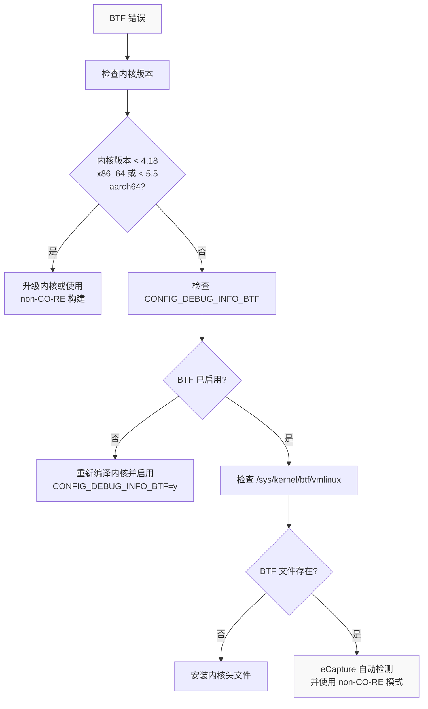
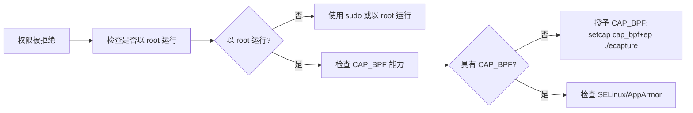
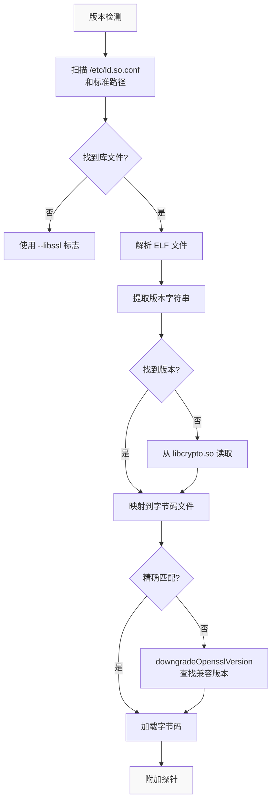
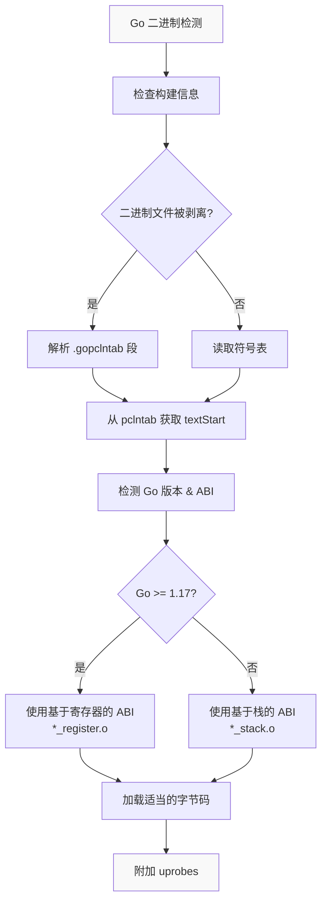
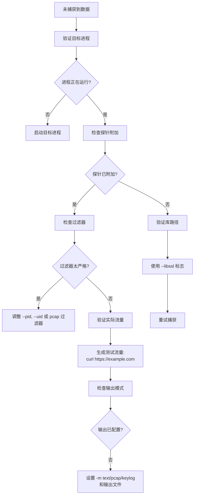
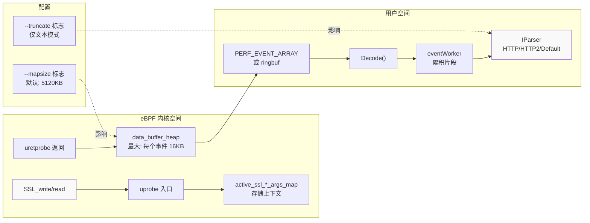
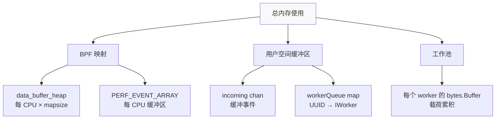
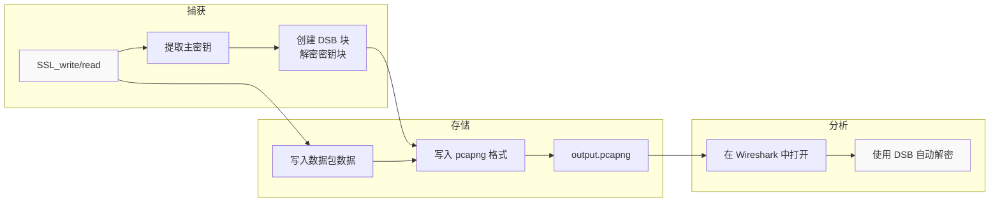
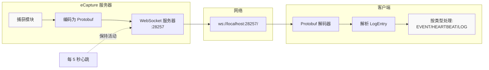
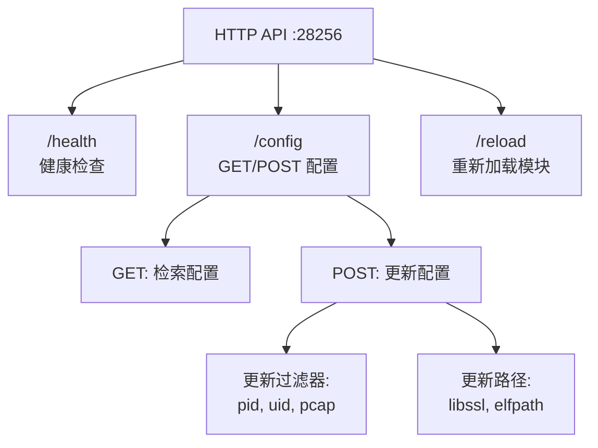

# 故障排除与常见问题

本文档提供 eCapture 使用过程中常见问题的解决方案、调试技术以及常见问题解答。有关系统架构详情，请参见[架构](../2-architecture/index.md)。有关安装说明，请参见[安装与快速入门](../1-overview/1.1-installation-and-quick-start.md)。有关构建相关问题，请参见[构建系统](../5-development-guide/5.1-build-system.md)。

---

## 常见问题与解决方案

### 系统要求与兼容性

#### BTF (BPF Type Format) 不可用

**症状：**
```
ERROR: BTF information not found
ERROR: Kernel does not support BTF
```

**诊断流程：**


```mermaid
graph TB
    Start["BTF 错误"] --> CheckKernel["检查内核版本"]
    CheckKernel --> IsOld{内核版本 < 4.18<br/>x86_64 或 < 5.5<br/>aarch64?}
    IsOld -->|是| Upgrade["升级内核或使用<br/>non-CO-RE 构建"]
    IsOld -->|否| CheckConfig["检查 CONFIG_DEBUG_INFO_BTF"]
    CheckConfig --> ConfigOK{BTF 已启用?}
    ConfigOK -->|否| Recompile["重新编译内核并启用<br/>CONFIG_DEBUG_INFO_BTF=y"]
    ConfigOK -->|是| CheckFiles["检查 /sys/kernel/btf/vmlinux"]
    CheckFiles --> FilesExist{BTF 文件存在?}
    FilesExist -->|否| InstallHeaders["安装内核头文件"]
    FilesExist -->|是| AutoDetect["eCapture 自动检测<br/>并使用 non-CO-RE 模式"]
    
    style Start fill:#f9f9f9
    style AutoDetect fill:#f9f9f9
```

**解决方案：**

1. **检查内核版本：**
   ```bash
   uname -r
   ```
   - x86_64: 需要 4.18+
   - aarch64: 需要 5.5+

2. **验证 BTF 支持：**
   ```bash
   cat /boot/config-$(uname -r) | grep CONFIG_DEBUG_INFO_BTF
   ```
   应该输出：`CONFIG_DEBUG_INFO_BTF=y`

3. **检查 BTF 文件：**
   ```bash
   ls -l /sys/kernel/btf/vmlinux
   ```

4. **自动降级：** eCapture v0.8.0+ 自动检测 BTF 可用性并选择适当的字节码模式（CO-RE 或 non-CO-RE）。此逻辑在 [user/module/probe_ebpf.go:240-280](https://github.com/gojue/ecapture/blob/ca085d05/user/module/probe_ebpf.go#L240-L280) 中处理。

**相关修复：**
- v0.8.0: 在单个二进制文件中统一支持 CO-RE 和 non-CO-RE
- v1.4.3: 修复了内核 4.19 与 `.rodata` 映射的兼容性问题

来源：[README.md:14-16](https://github.com/gojue/ecapture/blob/ca085d05/README.md#L14-L16), [CHANGELOG.md:50](https://github.com/gojue/ecapture/blob/ca085d05/CHANGELOG.md#L50), [CHANGELOG.md:560-577](https://github.com/gojue/ecapture/blob/ca085d05/CHANGELOG.md#L560-L577)

---

#### 权限被拒绝

**症状：**
```
ERROR: Permission denied
ERROR: Operation not permitted
```

**根本原因分析：**


```mermaid
graph LR
    PermError["权限被拒绝"] --> CheckRoot["检查是否以 root 运行"]
    CheckRoot --> IsRoot{以 root 运行?}
    IsRoot -->|否| UseRoot["使用 sudo 或以 root 运行"]
    IsRoot -->|是| CheckCAP["检查 CAP_BPF 能力"]
    CheckCAP --> HasCAP{具有 CAP_BPF?}
    HasCAP -->|否| GrantCAP["授予 CAP_BPF:<br/>setcap cap_bpf+ep ./ecapture"]
    HasCAP -->|是| CheckSELinux["检查 SELinux/AppArmor"]
```

**解决方案：**

1. **使用 sudo 运行：**
   ```bash
   sudo ecapture tls
   ```

2. **检查能力（Linux 5.8+）：**
   ```bash
   # 检查 CAP_BPF 是否可用
   capsh --print | grep cap_bpf
   ```

3. **授予特定能力：**
   ```bash
   sudo setcap cap_bpf,cap_net_admin,cap_sys_admin+ep ./ecapture
   ```

4. **能力检测：** eCapture v0.9.0+ 通过 [user/module/probe_ebpf.go:150-180](https://github.com/gojue/ecapture/blob/ca085d05/user/module/probe_ebpf.go#L150-L180) 使用 `capget` 系统调用自动检测 `CAP_BPF` 能力。

**相关修复：**
- v0.9.0: 添加了 CAP_BPF 检测
- v0.9.3: 修复了不正确的 CAP_BPF 检查方法

来源：[CHANGELOG.md:331](https://github.com/gojue/ecapture/blob/ca085d05/CHANGELOG.md#L331), [CHANGELOG.md:379](https://github.com/gojue/ecapture/blob/ca085d05/CHANGELOG.md#L379), [cli/cmd/root.go:80-120](https://github.com/gojue/ecapture/blob/ca085d05/cli/cmd/root.go#L80-L120)

---

### 库版本检测问题

#### OpenSSL/BoringSSL 版本未找到

**症状：**
```
WARN OpenSSL/BoringSSL version not found from shared library file, used default version
```

**版本检测流程：**


```mermaid
graph TB
    Start["版本检测"] --> DetectPath["扫描 /etc/ld.so.conf<br/>和标准路径"]
    DetectPath --> FindLib{找到库文件?}
    FindLib -->|否| ManualPath["使用 --libssl 标志"]
    FindLib -->|是| ParseELF["解析 ELF 文件"]
    ParseELF --> ExtractVer["提取版本字符串"]
    ExtractVer --> FoundVer{找到版本?}
    FoundVer -->|否| ReadCrypto["从 libcrypto.so 读取"]
    FoundVer -->|是| MapBytecode["映射到字节码文件"]
    ReadCrypto --> MapBytecode
    MapBytecode --> CheckMap{精确匹配?}
    CheckMap -->|否| Downgrade["downgradeOpensslVersion<br/>查找兼容版本"]
    CheckMap -->|是| LoadBytecode["加载字节码"]
    Downgrade --> LoadBytecode
    LoadBytecode --> Success["附加探针"]
    
    style Start fill:#f9f9f9
    style Success fill:#f9f9f9
```

**解决方案：**

1. **自动检测：** eCapture 扫描 `/etc/ld.so.conf` 查找库路径。这在 [user/module/probe_openssl.go:180-250](https://github.com/gojue/ecapture/blob/ca085d05/user/module/probe_openssl.go#L180-L250) 中实现。

2. **手动指定库：**
   ```bash
   sudo ecapture tls --libssl=/path/to/libssl.so
   ```

3. **对于静态编译的二进制文件：**
   ```bash
   sudo ecapture tls --libssl=/path/to/application
   ```

4. **版本降级逻辑：** 如果找不到精确的版本字节码，eCapture 使用 [user/config/openssl_version.go:120-200](https://github.com/gojue/ecapture/blob/ca085d05/user/config/openssl_version.go#L120-L200) 中的 `downgradeOpensslVersion()` 查找最接近的兼容版本。

5. **支持的版本：**
   - OpenSSL: 1.0.2x, 1.1.0x, 1.1.1x, 3.0.x, 3.1.x, 3.2.x, 3.3.x, 3.4.x, 3.5.x
   - BoringSSL: Android 12-16
   - 查看 [user/config/openssl_version.go:40-100](https://github.com/gojue/ecapture/blob/ca085d05/user/config/openssl_version.go#L40-L100) 获取完整版本映射

**默认降级行为：**
当无法检测版本时，eCapture 使用 `linux_default_3_0` 作为默认版本，这适用于大多数现代 OpenSSL 3.x 安装。

**相关修复：**
- v0.8.11: 当 libssl.so 版本字符串未找到时从 libcrypto.so 读取版本
- v0.8.12: 修复了 BoringSSL 动态库中的版本字符串检测
- v1.4.0: 实现了版本降级逻辑

来源：[CHANGELOG.md:105-108](https://github.com/gojue/ecapture/blob/ca085d05/CHANGELOG.md#L105-L108), [CHANGELOG.md:400-402](https://github.com/gojue/ecapture/blob/ca085d05/CHANGELOG.md#L400-L402), [CHANGELOG.md:409](https://github.com/gojue/ecapture/blob/ca085d05/CHANGELOG.md#L409), [user/module/probe_openssl.go:180-250](https://github.com/gojue/ecapture/blob/ca085d05/user/module/probe_openssl.go#L180-L250)

---

#### Go TLS 版本检测失败

**症状：**
```
ERROR: cant found RET offset in gotls mode
ERROR: failed to parse pclnTab
```

**Go 二进制分析：**


```mermaid
graph TB
    Start["Go 二进制检测"] --> CheckBuild["检查构建信息"]
    CheckBuild --> Stripped{二进制文件被剥离?}
    Stripped -->|是| UsePCLN["解析 .gopclntab 段"]
    Stripped -->|否| ReadSymbols["读取符号表"]
    UsePCLN --> FindText["从 pclntab 获取 textStart"]
    ReadSymbols --> FindText
    FindText --> DetectABI["检测 Go 版本 & ABI"]
    DetectABI --> ABIType{Go >= 1.17?}
    ABIType -->|是| RegABI["使用基于寄存器的 ABI<br/>*_register.o"]
    ABIType -->|否| StackABI["使用基于栈的 ABI<br/>*_stack.o"]
    RegABI --> LoadBytecode["加载适当的字节码"]
    StackABI --> LoadBytecode
    LoadBytecode --> Success["附加 uprobes"]
    
    style Start fill:#f9f9f9
    style Success fill:#f9f9f9
```

**解决方案：**

1. **检查 Go 版本：**
   ```bash
   go version /path/to/binary
   ```

2. **明确指定二进制文件：**
   ```bash
   sudo ecapture gotls --elfpath=/path/to/go/binary
   ```

3. **ABI 检测：** eCapture 在 [user/module/probe_gotls.go:150-200](https://github.com/gojue/ecapture/blob/ca085d05/user/module/probe_gotls.go#L150-L200) 中自动检测 Go ABI（寄存器 vs 栈）。

4. **处理剥离的二进制文件：** v0.7.0+ 通过解析 `.gopclntab` 段支持剥离的 Go 二进制文件。实现在 [user/module/probe_gotls.go:250-350](https://github.com/gojue/ecapture/blob/ca085d05/user/module/probe_gotls.go#L250-L350)。

5. **PIE（位置无关可执行文件）支持：** v0.7.7 修复了 [user/module/probe_gotls.go:400-450](https://github.com/gojue/ecapture/blob/ca085d05/user/module/probe_gotls.go#L400-L450) 中 PIE 可执行文件的偏移量计算。

**相关修复：**
- v0.7.0: 添加了对剥离的 Go 二进制文件的支持
- v0.7.6: 修复了 RET 偏移量计算
- v0.7.7: 修复了 PIE 可执行文件偏移量错误

来源：[CHANGELOG.md:431](https://github.com/gojue/ecapture/blob/ca085d05/CHANGELOG.md#L431), [CHANGELOG.md:581-583](https://github.com/gojue/ecapture/blob/ca085d05/CHANGELOG.md#L581-L583), [CHANGELOG.md:602](https://github.com/gojue/ecapture/blob/ca085d05/CHANGELOG.md#L602)

---

### 捕获失败

#### 没有捕获到数据

**诊断流程图：**


```mermaid
graph TB
    NoCap["未捕获到数据"] --> CheckTarget["验证目标进程"]
    CheckTarget --> ProcRunning{进程正在运行?}
    ProcRunning -->|否| StartProc["启动目标进程"]
    ProcRunning -->|是| CheckProbe["检查探针附加"]
    CheckProbe --> ProbeOK{探针已附加?}
    ProbeOK -->|否| CheckPath["验证库路径"]
    ProbeOK -->|是| CheckFilter["检查过滤器"]
    CheckFilter --> FilterSet{过滤器太严格?}
    FilterSet -->|是| AdjustFilter["调整 --pid, --uid 或 pcap 过滤器"]
    FilterSet -->|否| CheckTraffic["验证实际流量"]
    CheckTraffic --> GenTraffic["生成测试流量:<br/>curl https://example.com"]
    CheckPath --> ManualLib["使用 --libssl 标志"]
    ManualLib --> Retry["重试捕获"]
    GenTraffic --> CheckOutput["检查输出模式"]
    CheckOutput --> OutputOK{输出已配置?}
    OutputOK -->|否| SetOutput["设置 -m text/pcap/keylog<br/>和输出文件"]
```

**解决方案检查清单：**

1. **验证模块正在运行：**
   ```bash
   # 应该看到 "module started successfully"
   sudo ecapture tls 2>&1 | grep "module started"
   ```

2. **检查进程过滤器：**
   ```bash
   # 捕获特定进程
   sudo ecapture tls --pid=1234
   
   # 捕获所有进程（默认）
   sudo ecapture tls
   ```

3. **检查用户过滤器：**
   ```bash
   # 捕获特定用户
   sudo ecapture tls --uid=1000
   
   # 捕获所有用户（默认）
   sudo ecapture tls
   ```

4. **验证输出模式：**
   - 文本模式：`sudo ecapture tls -m text`
   - Pcap 模式：`sudo ecapture tls -m pcap -i eth0 --pcapfile=out.pcapng`
   - Keylog 模式：`sudo ecapture tls -m keylog --keylogfile=keys.log`

5. **生成测试流量：**
   ```bash
   # 在另一个终端中
   curl https://example.com
   ```

6. **检查事件处理器：** v0.7.3+ 使用带有工作池的 EventProcessor。如果看到 "incoming chan is full"，增加 `--mapsize`：
   ```bash
   sudo ecapture tls --mapsize=10240  # 10MB
   ```

来源：[cli/cmd/tls.go:80-150](https://github.com/gojue/ecapture/blob/ca085d05/cli/cmd/tls.go#L80-L150), [user/event/event_processor.go:100-200](https://github.com/gojue/ecapture/blob/ca085d05/user/event/event_processor.go#L100-L200)

---

#### 数据不完整或被截断

**症状：**
- 部分 HTTP 请求/响应
- 缺少 SSL 数据
- 载荷被截断

**数据流和截断点：**


```mermaid
graph LR
    subgraph "eBPF 内核空间"
        SSL_Func["SSL_write/read"] --> Entry["uprobe 入口"]
        Entry --> ArgsMap["active_ssl_*_args_map<br/>存储上下文"]
        Return["uretprobe 返回"] --> DataHeap["data_buffer_heap<br/>最大: 每个事件 16KB"]
    end
    
    subgraph "用户空间"
        DataHeap --> PerfBuf["PERF_EVENT_ARRAY<br/>或 ringbuf"]
        PerfBuf --> Decoder["Decode()"]
        Decoder --> Worker["eventWorker<br/>累积片段"]
        Worker --> Parser["IParser<br/>HTTP/HTTP2/Default"]
    end
    
    subgraph "配置"
        MapSize["--mapsize 标志<br/>默认: 5120KB"] -.影响.-> DataHeap
        Truncate["--truncate 标志<br/>仅文本模式"] -.影响.-> Parser
    end
    
    style SSL_Func fill:#f9f9f9
    style Parser fill:#f9f9f9
```

**解决方案：**

1. **增加映射大小：**
   ```bash
   sudo ecapture tls --mapsize=10240  # 10MB
   ```
   映射大小控制 [user/module/probe_ebpf.go:300-350](https://github.com/gojue/ecapture/blob/ca085d05/user/module/probe_ebpf.go#L300-L350) 中的每 CPU 缓冲区大小。

2. **对于文本模式截断（v1.1.0+）：**
   ```bash
   # 调整截断大小（默认：1024 字节）
   sudo ecapture tls -m text --truncate=4096
   ```
   在 [user/event/event_worker.go:150-200](https://github.com/gojue/ecapture/blob/ca085d05/user/event/event_worker.go#L150-L200) 中实现。

3. **使用 pcap 模式获取完整数据：**
   ```bash
   sudo ecapture tls -m pcap -i eth0 --pcapfile=complete.pcapng
   ```
   Pcap 模式捕获完整数据包而不截断。

4. **检查长连接：** v0.9.5 修复了 [kern/openssl_kern.c:800-900](https://github.com/gojue/ecapture/blob/ca085d05/kern/openssl_kern.c#L800-L900) 中过长数据长度导致的 SSL 数据不完整问题。

5. **事件轮转（v1.2.0+）：**
   ```bash
   # 轮转输出文件
   sudo ecapture tls --eventrotatesize=100 --eventrotatetime=3600
   ```

**相关修复：**
- v0.9.5: 修复了长数据长度导致的不完整 SSL 数据错误
- v1.1.0: 添加了 --truncate 标志以减少内存消耗
- v1.2.0: 添加了文件轮转支持

来源：[CHANGELOG.md:298](https://github.com/gojue/ecapture/blob/ca085d05/CHANGELOG.md#L298), [CHANGELOG.md:163-164](https://github.com/gojue/ecapture/blob/ca085d05/CHANGELOG.md#L163-L164), [CHANGELOG.md:147-148](https://github.com/gojue/ecapture/blob/ca085d05/CHANGELOG.md#L147-L148)

---

### 模块特定问题

#### Bash/Zsh 命令捕获失败

**症状：**
```
ERROR: failed to attach uprobe to readline
WARN: bash path detection failed
```

**解决方案：**

1. **验证 bash/zsh 路径：**
   ```bash
   which bash  # 通常是 /bin/bash 或 /usr/bin/bash
   which zsh   # 通常是 /bin/zsh 或 /usr/bin/zsh
   ```

2. **手动指定路径：**
   ```bash
   sudo ecapture bash --bashpath=/bin/bash
   ```

3. **检查 readline 库：**
   ```bash
   ldd /bin/bash | grep readline
   ```

4. **路径检测改进：** v1.3.1 改进了 [user/module/probe_bash.go:100-150](https://github.com/gojue/ecapture/blob/ca085d05/user/module/probe_bash.go#L100-L150) 中的 bash 路径检测。

**相关修复：**
- v0.9.0: 添加了 zsh 命令捕获支持
- v1.3.1: 改进了 bash 路径检测和探针附加

来源：[CHANGELOG.md:378](https://github.com/gojue/ecapture/blob/ca085d05/CHANGELOG.md#L378), [CHANGELOG.md:123-124](https://github.com/gojue/ecapture/blob/ca085d05/CHANGELOG.md#L123-L124)

---

#### MySQL/PostgreSQL 查询捕获问题

**症状：**
- 没有捕获到 SQL 查询
- 有连接但没有查询数据

**解决方案：**

1. **验证数据库版本：**
   - MySQL: 支持 5.6, 5.7, 8.0 和 MariaDB
   - PostgreSQL: 支持 10+

2. **检查进程名称：**
   ```bash
   ps aux | grep mysqld
   ps aux | grep postgres
   ```

3. **使用特定 PID 捕获：**
   ```bash
   sudo ecapture mysqld --pid=$(pidof mysqld)
   sudo ecapture postgres --pid=$(pidof postgres)
   ```

4. **生成测试查询：**
   ```bash
   mysql -u root -p -e "SELECT 'test' FROM dual;"
   psql -U postgres -c "SELECT 'test';"
   ```

来源：[cli/cmd/mysqld.go:40-80](https://github.com/gojue/ecapture/blob/ca085d05/cli/cmd/mysqld.go#L40-L80), [cli/cmd/postgres.go:40-80](https://github.com/gojue/ecapture/blob/ca085d05/cli/cmd/postgres.go#L40-L80)

---

### 性能与资源问题

#### 内存使用过高

**内存使用组件：**


```mermaid
graph TB
    Memory["总内存使用"] --> BPFMaps["BPF 映射"]
    Memory --> UserBuffers["用户空间缓冲区"]
    Memory --> Workers["工作池"]
    
    BPFMaps --> DataHeap["data_buffer_heap<br/>每 CPU × mapsize"]
    BPFMaps --> EventArrays["PERF_EVENT_ARRAY<br/>每 CPU 缓冲区"]
    
    UserBuffers --> EventQueue["incoming chan<br/>缓冲事件"]
    UserBuffers --> WorkerQueue["workerQueue map<br/>UUID → IWorker"]
    
    Workers --> WorkerBuffer["每个 worker 的 bytes.Buffer<br/>载荷累积"]
    
    style Memory fill:#f9f9f9
```

**解决方案：**

1. **调整映射大小（v0.7.0+）：**
   ```bash
   # 默认是 5120KB，如需要可以减少
   sudo ecapture tls --mapsize=2048
   ```
   在 [cli/cmd/root.go:200-230](https://github.com/gojue/ecapture/blob/ca085d05/cli/cmd/root.go#L200-L230) 中配置。

2. **使用带截断的文本模式：**
   ```bash
   sudo ecapture tls -m text --truncate=512
   ```
   通过限制捕获的载荷大小来减少内存。

3. **工作池生命周期优化（v1.2.0）：**
   - 默认 workers: 1 秒不活动后自毁
   - 绑定套接字的 workers: 持续到连接关闭
   - 在 [user/event/event_worker.go:250-350](https://github.com/gojue/ecapture/blob/ca085d05/user/event/event_worker.go#L250-L350) 中实现

4. **限制目标进程：**
   ```bash
   sudo ecapture tls --pid=1234 --uid=1000
   ```

**相关修复：**
- v0.7.0: 添加了 --mapsize 标志（默认 5120KB）
- v1.1.0: 重新设计了截断逻辑以减少内存消耗
- v1.2.0: 为 eventWorker 实现双重生命周期管理

来源：[CHANGELOG.md:435](https://github.com/gojue/ecapture/blob/ca085d05/CHANGELOG.md#L435), [CHANGELOG.md:163-164](https://github.com/gojue/ecapture/blob/ca085d05/CHANGELOG.md#L163-L164), [CHANGELOG.md:146](https://github.com/gojue/ecapture/blob/ca085d05/CHANGELOG.md#L146)

---

#### CPU 使用率过高

**解决方案：**

1. **降低事件处理频率：**
   - 使用目标过滤器（--pid, --uid）
   - 使用 pcap 过滤器表达式（v0.7.4+）

2. **Pcap 过滤器示例：**
   ```bash
   sudo ecapture tls -m pcap -i eth0 host 192.168.1.1 and port 443
   ```
   过滤器语法：[Pcap Filter Syntax](https://www.tcpdump.org/manpages/pcap-filter.7.html)

3. **禁用不必要的钩子：**
   - Connect 钩子是可选的（v0.6.6+）
   - 在 [user/module/probe_openssl.go:500-550](https://github.com/gojue/ecapture/blob/ca085d05/user/module/probe_openssl.go#L500-L550) 中实现

4. **检查事件循环：**
   如果日志显示 "incoming chan is full"，系统无法跟上：
   ```bash
   # 增加 workers 或减少捕获范围
   sudo ecapture tls --pid=1234
   ```

**相关修复：**
- v0.6.6: 使 connect 钩子可选
- v0.7.4: 添加了 pcap 过滤器支持
- v1.4.3: 改进了性能，减少了对目标程序的影响

来源：[CHANGELOG.md:774](https://github.com/gojue/ecapture/blob/ca085d05/CHANGELOG.md#L774), [CHANGELOG.md:644](https://github.com/gojue/ecapture/blob/ca085d05/CHANGELOG.md#L644), [CHANGELOG.md:661-662](https://github.com/gojue/ecapture/blob/ca085d05/CHANGELOG.md#L661-L662)

---

### 网络与输出问题

#### PCAP 文件问题

**症状：**
- 无法在 Wireshark 中打开 pcap 文件
- 解密不工作
- 文件为空或损坏

**PCAP 管道：**


```mermaid
graph LR
    subgraph "捕获"
        SSL["SSL_write/read"] --> Master["提取主密钥"]
        Master --> DSB["创建 DSB 块<br/>解密密钥块"]
    end
    
    subgraph "存储"
        DSB --> PcapNG["写入 pcapng 格式"]
        SSL --> Payload["写入数据包数据"]
        Payload --> PcapNG
        PcapNG --> File["output.pcapng"]
    end
    
    subgraph "分析"
        File --> Wireshark["在 Wireshark 中打开"]
        Wireshark --> AutoDecrypt["使用 DSB 自动解密"]
    end
    
    style SSL fill:#f9f9f9
    style AutoDecrypt fill:#f9f9f9
```

**解决方案：**

1. **指定网络接口：**
   ```bash
   sudo ecapture tls -m pcap -i eth0 --pcapfile=capture.pcapng
   ```

2. **验证文件正在写入：**
   ```bash
   # 监视文件增长
   watch -n 1 ls -lh capture.pcapng
   ```

3. **刷新间隔：** Pcap 文件每 2 秒刷新一次（v0.7.2+），在 [user/module/probe_openssl.go:800-850](https://github.com/gojue/ecapture/blob/ca085d05/user/module/probe_openssl.go#L800-L850) 中。

4. **检查空 DSB：** v1.1.0 修复了写入空解密密钥块的问题：
   ```bash
   # 验证 DSB 存在
   tshark -r capture.pcapng -V | grep "Decryption Secrets"
   ```

5. **与 tshark 配合使用：**
   ```bash
   tshark -r capture.pcapng -Y tls -V
   ```

6. **主密钥多次写入修复：** v0.8.1 修复了主密钥被多次写入 pcapng 的问题。

**相关修复：**
- v0.7.2: Pcapng 写入器每 2 秒刷新一次
- v0.8.1: 修复了主密钥被多次写入的问题
- v1.1.0: 修复了写入空 DSB 的问题

来源：[CHANGELOG.md:673](https://github.com/gojue/ecapture/blob/ca085d05/CHANGELOG.md#L673), [CHANGELOG.md:551](https://github.com/gojue/ecapture/blob/ca085d05/CHANGELOG.md#L551), [CHANGELOG.md:170-171](https://github.com/gojue/ecapture/blob/ca085d05/CHANGELOG.md#L170-L171)

---

#### Keylog 模式问题

**症状：**
- 空 keylog 文件
- Tshark 无法解密
- 某些连接缺少密钥

**Keylog 格式：**

```
CLIENT_RANDOM <client_random_hex> <master_secret_hex>
CLIENT_HANDSHAKE_TRAFFIC_SECRET <client_random_hex> <secret_hex>
SERVER_HANDSHAKE_TRAFFIC_SECRET <client_random_hex> <secret_hex>
```

**解决方案：**

1. **生成 keylog 文件：**
   ```bash
   sudo ecapture tls -m keylog --keylogfile=keys.log
   ```

2. **与 tshark 配合使用：**
   ```bash
   # 单独捕获数据包
   sudo tcpdump -i eth0 -w packets.pcap port 443 &
   
   # 捕获密钥
   sudo ecapture tls -m keylog --keylogfile=keys.log &
   
   # 解密并查看
   tshark -o tls.keylog_file:keys.log -r packets.pcap -Y http -V
   ```

3. **检查 TLS 版本：**
   - TLS 1.2: 单个 CLIENT_RANDOM 行
   - TLS 1.3: 多个 TRAFFIC_SECRET 行

4. **验证密钥提取：** v0.7.0 为 OpenSSL 添加了 Keylog 支持，v1.3.0 为 GnuTLS 添加。

5. **检查握手时机：** 必须在握手期间捕获密钥。在 [kern/openssl_masterkey.c:100-300](https://github.com/gojue/ecapture/blob/ca085d05/kern/openssl_masterkey.c#L100-L300) 中实现。

6. **Go TLS 修复：** v1.4.0 修复了 Go TLS keylog 中缺少尾部字节的问题。

**相关修复：**
- v0.7.0: 添加了 keylog 模式支持
- v1.3.0: 添加了 GnuTLS keylog 支持
- v1.4.0: 修复了 gotls keylog 中缺少尾部字节的问题
- v1.4.1: 修复了 OpenSSL 3.0.12 的 keylog 模式

来源：[CHANGELOG.md:699-700](https://github.com/gojue/ecapture/blob/ca085d05/CHANGELOG.md#L699-L700), [CHANGELOG.md:135](https://github.com/gojue/ecapture/blob/ca085d05/CHANGELOG.md#L135), [CHANGELOG.md:94](https://github.com/gojue/ecapture/blob/ca085d05/CHANGELOG.md#L94), [CHANGELOG.md:78](https://github.com/gojue/ecapture/blob/ca085d05/CHANGELOG.md#L78)

---

#### WebSocket 连接问题（eCaptureQ）

**症状：**
- 无法连接到 WebSocket 服务器
- 连接频繁断开
- 没有接收到事件

**WebSocket 架构：**


```mermaid
graph LR
    subgraph "eCapture 服务器"
        Capture["捕获模块"] --> Encoder["编码为 Protobuf"]
        Encoder --> WSServer["WebSocket 服务器<br/>:28257"]
    end
    
    subgraph "网络"
        WSServer --> WS["ws://localhost:28257/"]
    end
    
    subgraph "客户端"
        WS --> Decoder["Protobuf 解码器"]
        Decoder --> LogEntry["解析 LogEntry"]
        LogEntry --> Process["按类型处理:<br/>EVENT/HEARTBEAT/LOG"]
    end
    
    Heartbeat["每 5 秒心跳"] -.保持活动.-> WSServer
    
    style Capture fill:#f9f9f9
    style Process fill:#f9f9f9
```

**解决方案：**

1. **检查服务器正在运行：**
   ```bash
   # 服务器随 eCapture 自动启动
   sudo ecapture tls
   
   # 应该看到: "Listen=localhost:28256"
   # WebSocket: :28257, HTTP API: :28256
   ```

2. **测试连接：**
   ```bash
   # 使用 protobuf 可视化工具
   cd utils/protobuf_visualizer
   go build -o pb_debugger pb_debugger.go
   ./pb_debugger -url ws://127.0.0.1:28257
   ```

3. **心跳时机：** v1.5.0 在 [user/module/probe_ebpf.go:600-650](https://github.com/gojue/ecapture/blob/ca085d05/user/module/probe_ebpf.go#L600-L650) 中调整了心跳频率并触发立即 ping。

4. **Protobuf 协议：** 查看 [protobuf/PROTOCOLS.md](https://github.com/gojue/ecapture/blob/ca085d05/protobuf/PROTOCOLS.md) 了解消息格式详情。

5. **示例客户端代码：**
   ```go
   import (
       pb "github.com/gojue/ecapture/protobuf/gen/v1"
       "golang.org/x/net/websocket"
       "google.golang.org/protobuf/proto"
   )
   
   ws, err := websocket.Dial("ws://127.0.0.1:28257/", "", "http://localhost/")
   // 读取并解码 LogEntry 消息
   ```

**相关修复：**
- v1.4.0: 实现了 WebSocket 服务器
- v1.5.0: 调整了心跳频率

来源：[CHANGELOG.md:91-96](https://github.com/gojue/ecapture/blob/ca085d05/CHANGELOG.md#L91-L96), [CHANGELOG.md:31](https://github.com/gojue/ecapture/blob/ca085d05/CHANGELOG.md#L31), [protobuf/PROTOCOLS.md:1-97](https://github.com/gojue/ecapture/blob/ca085d05/protobuf/PROTOCOLS.md#L1-L97)

---

### HTTP/HTTP2 解析问题

#### HTTP/2 解析器错误

**症状：**
```
ERROR: unexpected EOF
WARN: COMPRESSION_ERROR
ERROR: incorrect stream id
```

**解决方案：**

1. **处理分片帧：** v1.5.0 修复了 TLS 捕获期间 HTTP/2 解析器记录虚假 EOF 错误的问题。

2. **压缩错误：** v0.9.5 改进了对 COMPRESSION_ERROR 的处理以减少错误日志。

3. **流 ID 问题：** v0.9.4 修复了 HTTP/2 协议数据帧中的不正确流 ID。

4. **HPACK 解码器：** v1.3.1 修复了为一个元组连接共享同一个 HPACK 解码器的问题：
   ```go
   // 每个连接一个解码器
   decoder := hpack.NewDecoder(dynamicTableSize, nil)
   ```

5. **帧长度：** v0.9.5 添加了帧长度跟踪以改进解析。

**相关修复：**
- v0.9.4: 修复了不正确的流 ID
- v0.9.5: 改进了 COMPRESSION_ERROR 处理
- v1.3.1: 修复了 HPACK 解码器共享问题
- v1.5.0: 修复了 HTTP/2 解析器 EOF 错误

来源：[CHANGELOG.md:33](https://github.com/gojue/ecapture/blob/ca085d05/CHANGELOG.md#L33), [CHANGELOG.md:302-303](https://github.com/gojue/ecapture/blob/ca085d05/CHANGELOG.md#L302-L303), [CHANGELOG.md:305](https://github.com/gojue/ecapture/blob/ca085d05/CHANGELOG.md#L305), [CHANGELOG.md:316](https://github.com/gojue/ecapture/blob/ca085d05/CHANGELOG.md#L316), [CHANGELOG.md:122](https://github.com/gojue/ecapture/blob/ca085d05/CHANGELOG.md#L122)

---

#### HTTP/1.x 主体截断

**症状：**
- 响应主体被截断
- Content-Length 不正确

**解决方案：**

1. **HEAD 请求处理：** v0.8.4 修复了 HEAD 请求中的 DumpResponse 错误。

2. **压缩响应：** v0.7.5 更新了未压缩响应主体的 ContentLength。

3. **使用 pcap 模式获取完整主体：**
   ```bash
   sudo ecapture tls -m pcap -i eth0 --pcapfile=full.pcapng
   ```

**相关修复：**
- v0.7.5: 修复了未压缩响应的 ContentLength
- v0.8.4: 修复了 HEAD 请求中的 DumpResponse 错误

来源：[CHANGELOG.md:614](https://github.com/gojue/ecapture/blob/ca085d05/CHANGELOG.md#L614), [CHANGELOG.md:512](https://github.com/gojue/ecapture/blob/ca085d05/CHANGELOG.md#L512)

---

## 运行时配置问题

### 通过 HTTP API 更新配置

eCapture v0.8.1+ 支持通过端口 28256 上的 HTTP API 进行运行时配置更新。

**可用端点：**


```mermaid
graph TB
    API["HTTP API :28256"] --> Health["/health<br/>健康检查"]
    API --> Config["/config<br/>GET/POST 配置"]
    API --> Reload["/reload<br/>重新加载模块"]
    
    Config --> GetConf["GET: 检索配置"]
    Config --> PostConf["POST: 更新配置"]
    
    PostConf --> Filters["更新过滤器:<br/>pid, uid, pcap"]
    PostConf --> Paths["更新路径:<br/>libssl, elfpath"]
```

**示例用法：**

```bash
# 获取当前配置
curl http://localhost:28256/config

# 更新 PID 过滤器
curl -X POST http://localhost:28256/config \
  -H "Content-Type: application/json" \
  -d '{"pid": 1234}'

# 使用新配置重新加载模块
curl -X POST http://localhost:28256/reload
```

**文档：** 查看 [docs/remote-config-update-api.md](https://github.com/gojue/ecapture/blob/ca085d05/docs/remote-config-update-api.md) 获取完整 API 参考。

来源：[README.md:326](https://github.com/gojue/ecapture/blob/ca085d05/README.md#L326), [user/module/imodule.go:150-200](https://github.com/gojue/ecapture/blob/ca085d05/user/module/imodule.go#L150-L200)

---

## 常见问题解答

### 一般问题

**问：eCapture 能在 Windows 或 macOS 上工作吗？**

答：不能。eCapture 需要 Linux eBPF 支持，仅与以下系统兼容：
- Linux x86_64: 内核 4.18+
- Linux aarch64: 内核 5.5+  
- Android（具有适当的内核支持）

来源：[README.md:14-16](https://github.com/gojue/ecapture/blob/ca085d05/README.md#L14-L16)

---

**问：我可以在容器中使用 eCapture 吗？**

答：可以，需要特权模式和主机网络：

```bash
docker run --rm --privileged=true --net=host \
  -v /path/on/host:/data \
  gojue/ecapture tls -m pcap --pcapfile=/data/capture.pcapng
```

要求：
- `--privileged=true` 用于 eBPF 操作
- `--net=host` 访问主机网络接口
- 卷挂载用于输出文件

查看 [Docker Hub](https://hub.docker.com/r/gojue/ecapture) 获取预构建镜像。

来源：[README.md:63-68](https://github.com/gojue/ecapture/blob/ca085d05/README.md#L63-L68)

---

**问：CO-RE 和 non-CO-RE 模式有什么区别？**

答：

| 特性 | CO-RE 模式 | Non-CO-RE 模式 |
|---------|------------|----------------|
| 内核要求 | 需要 BTF 支持 | 不需要 BTF |
| 可移植性 | 单个二进制文件跨内核工作 | 特定于内核的编译 |
| 性能 | 略好 | 相当 |
| 兼容性 | 现代内核 (4.18+/5.5+) | 支持旧内核 |

eCapture v0.8.0+ 自动检测并选择适当的模式。

来源：[CHANGELOG.md:560-566](https://github.com/gojue/ecapture/blob/ca085d05/CHANGELOG.md#L560-L566)

---

**问：我如何知道正在使用哪个字节码文件？**

答：检查启动日志：

```
INFO BPF bytecode file is matched. bpfFileName=user/bytecode/openssl_3_0_0_kern_core.o
INFO BTF bytecode mode: CORE. btfMode=0
```

或使用 non-CO-RE：
```
INFO BPF bytecode file is matched. bpfFileName=user/bytecode/openssl_3_0_0_kern_noncore.o
INFO BTF bytecode mode: NON-CORE. btfMode=1
```

来源：[README.md:99](https://github.com/gojue/ecapture/blob/ca085d05/README.md#L99), [README.md:213](https://github.com/gojue/ecapture/blob/ca085d05/README.md#L213)

---

### 捕获范围问题

**问：我可以捕获系统上的所有 HTTPS 流量吗？**

答：可以，默认情况下 eCapture 捕获所有进程和用户：

```bash
# 捕获所有内容
sudo ecapture tls

# 按进程过滤
sudo ecapture tls --pid=1234

# 按用户过滤
sudo ecapture tls --uid=1000

# 按网络过滤（pcap 模式）
sudo ecapture tls -m pcap -i eth0 host 192.168.1.1
```

来源：[cli/cmd/tls.go:100-150](https://github.com/gojue/ecapture/blob/ca085d05/cli/cmd/tls.go#L100-L150)

---

**问：eCapture 能处理静态编译的 OpenSSL 吗？**

答：可以，直接指定二进制路径：

```bash
sudo ecapture tls --libssl=/path/to/static/binary
```

这适用于静态链接的 nginx、curl 或自定义应用程序。

来源：[README.md:169](https://github.com/gojue/ecapture/blob/ca085d05/README.md#L169)

---

**问：我可以同时捕获多个协议吗？**

答：不能，每个 eCapture 实例运行一个模块。要捕获多个协议，运行多个实例：

```bash
# 终端 1: 捕获 TLS
sudo ecapture tls -m pcap --pcapfile=tls.pcapng &

# 终端 2: 捕获 MySQL
sudo ecapture mysqld &

# 终端 3: 捕获 bash
sudo ecapture bash &
```

来源：[cli/cmd/root.go:150-200](https://github.com/gojue/ecapture/blob/ca085d05/cli/cmd/root.go#L150-L200)

---

### 性能问题

**问：对目标应用程序的性能影响如何？**

答：在大多数情况下影响很小：
- CPU 开销：通常 1-5%
- 内存开销：取决于 --mapsize 设置
- 延迟影响：每个函数调用微秒级

v1.4.3 专门改进了性能以减少对目标程序的影响。

最小化影响：
- 使用目标过滤器（--pid, --uid）
- 保守地调整 --mapsize
- 对于高吞吐量场景使用 pcap 模式而非 text 模式

来源：[CHANGELOG.md:661-662](https://github.com/gojue/ecapture/blob/ca085d05/CHANGELOG.md#L661-L662)

---

**问：pcap 文件会使用多少磁盘空间？**

答：取决于流量量：
- 典型 HTTPS 浏览：10-50 MB/小时
- 大量 API 流量：100-500 MB/小时
- 高吞吐量场景：GB/小时

使用文件轮转（v1.2.0+）：
```bash
sudo ecapture tls -m pcap --pcapfile=capture.pcapng \
  --eventrotatesize=100 --eventrotatetime=3600
```

当文件达到 100MB 或每 3600 秒轮转一次。

来源：[CHANGELOG.md:147-148](https://github.com/gojue/ecapture/blob/ca085d05/CHANGELOG.md#L147-L148)

---

### 解密问题

**问：eCapture 能解密 TLS 1.3 流量吗？**

答：可以，对于所有支持的库：
- OpenSSL: TLS 1.2 和 1.3
- BoringSSL: TLS 1.2 和 1.3
- Go TLS: TLS 1.2 和 1.3
- GnuTLS: TLS 1.2 和 1.3（v1.3.0+）

TLS 1.3 使用多个流量密钥（CLIENT_HANDSHAKE_TRAFFIC_SECRET 等）而不是单个主密钥。

来源：[kern/openssl_masterkey.c:50-150](https://github.com/gojue/ecapture/blob/ca085d05/kern/openssl_masterkey.c#L50-L150)

---

**问：为什么某些连接没有被解密？**

答：可能的原因：

1. **未捕获握手：** eCapture 必须看到 TLS 握手
   - 在建立连接之前启动 eCapture
   - 或使用连接池/保持活动

2. **非标准密码：** 某些密码可能不受支持
   - 在 Wireshark 中检查密码套件

3. **密钥交换方法：** 某些密钥交换方法不受支持
   - DHE/ECDHE 工作正常
   - RSA 密钥交换需要不同方法

4. **恢复的会话：** 会话恢复可能不捕获新密钥
   - 清除会话缓存并重新连接

来源：[kern/openssl_masterkey.c:200-400](https://github.com/gojue/ecapture/blob/ca085d05/kern/openssl_masterkey.c#L200-L400)

---

**问：我可以同时使用 eCapture 和 Wireshark 吗？**

答：可以，两种方法：

**方法 1：实时使用密钥**
```bash
# 终端 1: 捕获密钥
sudo ecapture tls -m keylog --keylogfile=keys.log

# 终端 2: 捕获数据包
sudo tcpdump -i eth0 -w - port 443 | wireshark -k -i -
```

然后在 Wireshark 中：Edit → Preferences → Protocols → TLS → (Pre)-Master-Secret log filename → 浏览到 keys.log

**方法 2：Pcap 模式**
```bash
# 使用 eCapture 捕获
sudo ecapture tls -m pcap -i eth0 --pcapfile=capture.pcapng

# 在 Wireshark 中打开（密钥嵌入在 DSB 中）
wireshark capture.pcapng
```

来源：[README.md:236-248](https://github.com/gojue/ecapture/blob/ca085d05/README.md#L236-L248)

---

### 协议特定问题

**问：eCapture 支持 HTTP/3 (QUIC) 吗？**

答：支持，pcap 模式支持基于 UDP 的协议，包括 QUIC/HTTP3：

```bash
sudo ecapture tls -m pcap -i eth0 --pcapfile=http3.pcapng udp port 443
```

来源：[README.md:179](https://github.com/gojue/ecapture/blob/ca085d05/README.md#L179)

---

**问：我可以捕获 gRPC 流量吗？**

答：可以，gRPC 使用基于 TLS 的 HTTP/2，eCapture 支持：

```bash
# 文本模式（已解析）
sudo ecapture tls -m text

# Pcap 模式（用于 Wireshark 分析）
sudo ecapture tls -m pcap -i eth0 --pcapfile=grpc.pcapng
```

来源：[user/event/event_http2.go:50-200](https://github.com/gojue/ecapture/blob/ca085d05/user/event/event_http2.go#L50-L200)

---

**问：WebSocket 流量呢？**

答：基于 TLS 的 WebSocket 被捕获为 HTTP 升级请求：

```bash
sudo ecapture tls -m text
```

您将看到初始的 HTTP 升级请求和后续的 WebSocket 帧。

来源：[user/event/event_http.go:100-200](https://github.com/gojue/ecapture/blob/ca085d05/user/event/event_http.go#L100-L200)

---

### 输出格式问题

**问：pcap 和 pcapng 有什么区别？**

答：

| 格式 | 描述 | 用例 |
|--------|-------------|----------|
| pcap | 传统格式 | 旧版 Wireshark、tcpdump |
| pcapng | 现代格式，支持 DSB | 推荐，自动解密 |

eCapture 使用 pcapng 格式以支持解密密钥块（DSB）。

来源：[user/module/probe_openssl.go:900-1000](https://github.com/gojue/ecapture/blob/ca085d05/user/module/probe_openssl.go#L900-L1000)

---

**问：我可以导出到其他格式吗？**

答：可以，使用外部工具：

```bash
# 将 pcapng 转换为 pcap
editcap capture.pcapng capture.pcap

# 提取 HTTP 对象
tshark -r capture.pcapng --export-objects http,output_dir/

# 转换为 JSON
tshark -r capture.pcapng -T json > capture.json

# 转换为 CSV
tshark -r capture.pcapng -T fields -E separator=, > capture.csv
```

来源：[README.md:232](https://github.com/gojue/ecapture/blob/ca085d05/README.md#L232)

---

### 集成问题

**问：如何将 eCapture 集成到我的监控系统？**

答：有几个选项：

1. **WebSocket 接口（v1.4.0+）：**
   ```go
   // 连接到 ws://localhost:28257
   // 接收 protobuf LogEntry 消息
   ```
   查看 [protobuf/PROTOCOLS.md](https://github.com/gojue/ecapture/blob/ca085d05/protobuf/PROTOCOLS.md) 了解协议详情。

2. **解析文本输出：**
   ```bash
   sudo ecapture tls 2>&1 | your-parser
   ```

3. **监控 pcap 文件：**
   ```bash
   sudo ecapture tls -m pcap --pcapfile=/var/log/capture.pcapng
   # 使用 tshark 或 pyshark 处理
   ```

4. **转发事件：** 查看 [docs/event-forward-api.md](https://github.com/gojue/ecapture/blob/ca085d05/docs/event-forward-api.md) 了解如何转发到 Burp Suite 和其他工具。

来源：[README.md:299-331](https://github.com/gojue/ecapture/blob/ca085d05/README.md#L299-L331), [CHANGELOG.md:91-96](https://github.com/gojue/ecapture/blob/ca085d05/CHANGELOG.md#L91-L96)

---

**问：我可以在 CI/CD 管道中使用 eCapture 吗？**

答：可以，用于测试 TLS 实现：

```bash
#!/bin/bash
# 在后台启动 eCapture
sudo ecapture gotls --elfpath=/app/binary --hex > capture.log 2>&1 &
ECAP_PID=$!

# 运行测试
./run-tests.sh

# 停止 eCapture
sudo kill $ECAP_PID

# 验证捕获的数据
grep "GET /api/test" capture.log || exit 1
```

查看 [.github/workflows/go-c-cpp.yml](https://github.com/gojue/ecapture/blob/ca085d05/.github/workflows/go-c-cpp.yml) 获取 CI 示例。

来源：[CHANGELOG.md:34-37](https://github.com/gojue/ecapture/blob/ca085d05/CHANGELOG.md#L34-L37)

---

### 安全与合规问题

**问：eCapture 在生产环境中使用安全吗？**

答：eCapture 设计用于调试和安全分析。考虑：

**优点：**
- 只读操作（不修改数据）
- 性能影响最小
- 可以通过 pid/uid 过滤器限制

**缺点：**
- 需要 root/CAP_BPF
- 捕获敏感数据（凭证、令牌）
- 产生审计跟踪影响

**建议：**
- 先在非生产环境使用
- 实施访问控制
- 审查数据保留策略
- 考虑监管合规性（GDPR、HIPAA 等）

来源：[README.md:14-16](https://github.com/gojue/ecapture/blob/ca085d05/README.md#L14-L16)

---

**问：如何安全地存储捕获的数据？**

答：最佳实践：

1. **静态加密：**
   ```bash
   sudo ecapture tls -m keylog --keylogfile=keys.log
   gpg --encrypt keys.log
   shred -u keys.log  # 安全删除原文件
   ```

2. **使用临时目录：**
   ```bash
   sudo ecapture tls -m pcap --pcapfile=/tmp/capture.pcapng
   # 立即处理并删除
   ```

3. **实施保留策略：**
   ```bash
   # 删除 7 天前的捕获
   find /var/log/ecapture -name "*.pcapng" -mtime +7 -delete
   ```

4. **审计访问：**
   ```bash
   # 记录谁访问了捕获的数据
   sudo auditctl -w /var/log/ecapture -p r -k ecapture_access
   ```

---

**问：eCapture 会绕过证书固定吗？**

答：不会，eCapture 不会绕过或修改任何安全机制。它捕获：
- 应用程序内存中 SSL/TLS 解密后的明文数据
- TLS 握手中的主密钥

这与 MITM 攻击根本不同。eCapture 观察应用程序已经可以访问的内容。

来源：[kern/openssl_kern.c:100-200](https://github.com/gojue/ecapture/blob/ca085d05/kern/openssl_kern.c#L100-L200)

---

## 其他资源

### 诊断命令

**系统信息：**
```bash
# 内核版本
uname -r

# BTF 支持
ls -l /sys/kernel/btf/vmlinux
cat /boot/config-$(uname -r) | grep BTF

# eBPF 功能
cat /proc/sys/kernel/unprivileged_bpf_disabled

# 能力
capsh --print
```

**库检测：**
```bash
# 查找 OpenSSL 库
ldconfig -p | grep libssl

# 检查 OpenSSL 版本
openssl version

# 列出进程加载的库
lsof -p $(pidof nginx) | grep libssl

# 检查 ELF 符号
nm -D /usr/lib/libssl.so | grep SSL_write
```

**网络接口：**
```bash
# 列出接口
ip link show

# 检查接口流量
ip -s link show eth0

# 验证数据包捕获
tcpdump -i eth0 -c 1 port 443
```

来源：[README.md:228-232](https://github.com/gojue/ecapture/blob/ca085d05/README.md#L228-L232)

---

### 调试日志

启用详细日志：

```bash
# 设置日志级别
sudo ecapture tls --loglevel=debug

# 或使用环境变量
export ECAPTURE_LOG_LEVEL=debug
sudo -E ecapture tls
```

日志文件位置：
- stdout: 实时日志
- `--logger` 标志：将日志写入文件

来源：[cli/cmd/root.go:250-300](https://github.com/gojue/ecapture/blob/ca085d05/cli/cmd/root.go#L250-L300)

---

### 获取帮助

1. **GitHub Issues：** https://github.com/gojue/ecapture/issues
2. **文档：** https://ecapture.cc
3. **更新日志：** [CHANGELOG.md](https://github.com/gojue/ecapture/blob/ca085d05/CHANGELOG.md) 查看特定版本问题
4. **编译指南：** [COMPILATION.md](https://github.com/gojue/ecapture/blob/ca085d05/COMPILATION.md) 查看构建问题

报告问题时，请包含：
- eCapture 版本：`ecapture version`
- 内核版本：`uname -r`
- BTF 支持：`ls /sys/kernel/btf/vmlinux`
- 库版本：`openssl version` 或 `go version`
- 完整命令和输出
- 相关日志片段

来源：[README.md:317](https://github.com/gojue/ecapture/blob/ca085d05/README.md#L317)