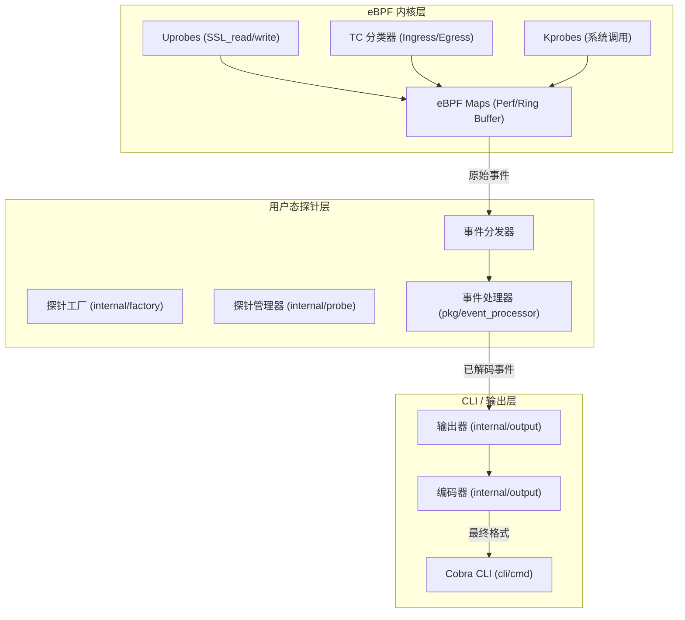
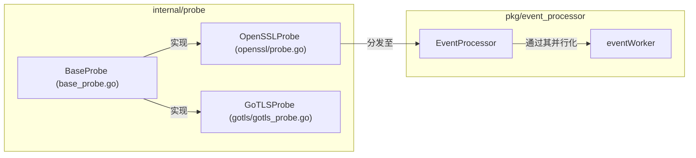

# 三层架构设计

相关源文件

以下文件被用作生成此维基页面的上下文：

- [CHANGELOG.md](https://github.com/gojue/ecapture/blob/943a19fe/CHANGELOG.md)
- [README.md](https://github.com/gojue/ecapture/blob/943a19fe/README.md)
- [builder/Dockerfile](https://github.com/gojue/ecapture/blob/943a19fe/builder/Dockerfile)
- [builder/init_env.sh](https://github.com/gojue/ecapture/blob/943a19fe/builder/init_env.sh)
- [functions.mk](https://github.com/gojue/ecapture/blob/943a19fe/functions.mk)
- [internal/config/base_config.go](https://github.com/gojue/ecapture/blob/943a19fe/internal/config/base_config.go)
- [internal/domain/configuration.go](https://github.com/gojue/ecapture/blob/943a19fe/internal/domain/configuration.go)
- [internal/probe/base/base_probe.go](https://github.com/gojue/ecapture/blob/943a19fe/internal/probe/base/base_probe.go)
- [internal/probe/gotls/gotls_probe.go](https://github.com/gojue/ecapture/blob/943a19fe/internal/probe/gotls/gotls_probe.go)
- [internal/probe/openssl/config.go](https://github.com/gojue/ecapture/blob/943a19fe/internal/probe/openssl/config.go)
- [internal/probe/openssl/config_test.go](https://github.com/gojue/ecapture/blob/943a19fe/internal/probe/openssl/config_test.go)
- [kern/boringssl_masterkey.h](https://github.com/gojue/ecapture/blob/943a19fe/kern/boringssl_masterkey.h)
- [kern/bpf/arm64/vmlinux.h](https://github.com/gojue/ecapture/blob/943a19fe/kern/bpf/arm64/vmlinux.h)
- [kern/bpf/arm64/vmlinux_614.h](https://github.com/gojue/ecapture/blob/943a19fe/kern/bpf/arm64/vmlinux_614.h)
- [kern/bpf/bpf_core_read.h](https://github.com/gojue/ecapture/blob/943a19fe/kern/bpf/bpf_core_read.h)
- [kern/bpf/bpf_helper_defs.h](https://github.com/gojue/ecapture/blob/943a19fe/kern/bpf/bpf_helper_defs.h)
- [kern/bpf/bpf_helpers.h](https://github.com/gojue/ecapture/blob/943a19fe/kern/bpf/bpf_helpers.h)
- [kern/bpf/bpf_tracing.h](https://github.com/gojue/ecapture/blob/943a19fe/kern/bpf/bpf_tracing.h)
- [kern/bpf/x86/vmlinux.h](https://github.com/gojue/ecapture/blob/943a19fe/kern/bpf/x86/vmlinux.h)
- [kern/bpf/x86/vmlinux_614.h](https://github.com/gojue/ecapture/blob/943a19fe/kern/bpf/x86/vmlinux_614.h)
- [kern/common.h](https://github.com/gojue/ecapture/blob/943a19fe/kern/common.h)
- [kern/core_fixes.bpf.h](https://github.com/gojue/ecapture/blob/943a19fe/kern/core_fixes.bpf.h)
- [kern/ecapture.h](https://github.com/gojue/ecapture/blob/943a19fe/kern/ecapture.h)
- [kern/openssl.h](https://github.com/gojue/ecapture/blob/943a19fe/kern/openssl.h)
- [kern/openssl_masterkey.h](https://github.com/gojue/ecapture/blob/943a19fe/kern/openssl_masterkey.h)
- [kern/openssl_masterkey_3.0.h](https://github.com/gojue/ecapture/blob/943a19fe/kern/openssl_masterkey_3.0.h)
- [kern/tc.h](https://github.com/gojue/ecapture/blob/943a19fe/kern/tc.h)
- [main.go](https://github.com/gojue/ecapture/blob/943a19fe/main.go)
- [variables.mk](https://github.com/gojue/ecapture/blob/943a19fe/variables.mk)

eCapture 采用关注点分离的设计理念，组织为三层架构。这种结构确保了内核层的高性能、用户态控制平面的健壮性与可扩展性，以及配置和数据消费界面的灵活性。

## 架构概览

下图展示了三层架构之间的关系，以及从内核挂钩到最终输出的数据流。

### 系统架构与数据流

**Sources:**
* [main.go:6-11](https://github.com/gojue/ecapture/blob/943a19fe/main.go#L6-L11)
* [internal/probe/base/base_probe.go:1-50](https://github.com/gojue/ecapture/blob/943a19fe/internal/probe/base/base_probe.go#L1-L50)
* [kern/openssl.h:79-134](https://github.com/gojue/ecapture/blob/943a19fe/kern/openssl.h#L79-L134)

---

## 1. eBPF 内核层

内核层由编译成 eBPF 字节码的 C 程序组成。这些程序是 eCapture 的“眼睛”，运行在 Linux 内核上下文中，从源头拦截数据。

### 核心组件
*   **探针 (Probes)**：附加到特定内核或用户态符号的程序。
    *   **Uprobes**：通过挂钩 `SSL_read` 和 `SSL_write` 等函数，用于从 OpenSSL、GnuTLS 和 GoTLS 等库中捕获明文 [kern/openssl.h:163-190]。
    *   **TC (流量控制)**：用于 `pcap` 模式以捕获原始网络数据包 [kern/tc.h:136-150]。
    *   **Kprobes**：用于系统级审计，例如 Shell 命令执行。
*   **Maps**：用于与用户态通信并存储临时状态的共享内存结构。
    *   `perf_event_array`：用于向用户态高速传输事件流 [kern/openssl.h:79-92]。
    *   `hash_maps`：用于跟踪函数进入和退出之间的上下文（例如 `active_ssl_read_args_map`）[kern/openssl.h:97-102]。
    *   `percpu_array`：用作“堆”以绕过 512 字节的栈限制 [kern/openssl.h:113-118]。

### CO-RE 与 Non-CO-RE 加载
eCapture 支持两种加载机制，以确保跨不同内核版本的兼容性：

| 特性 | CO-RE (一次编译，到处运行) | Non-CO-RE (传统模式) |
| :--- | :--- | :--- |
| **要求** | 带有 BTF 的内核 (`/sys/kernel/btf/vmlinux`) | 特定版本的内核头文件 |
| **实现** | 使用 `vmlinux.h` 和 `bpf_core_read` [kern/ecapture.h:18-26] | 使用系统头文件和固定偏移量 [kern/ecapture.h:27-88] |
| **构建目标** | `make` (默认) | `make nocore` [variables.mk:241-250] |

**Sources:**
* [kern/ecapture.h:18-88](https://github.com/gojue/ecapture/blob/943a19fe/kern/ecapture.h#L18-L88)
* [kern/openssl.h:79-118](https://github.com/gojue/ecapture/blob/943a19fe/kern/openssl.h#L79-L118)
* [kern/tc.h:58-78](https://github.com/gojue/ecapture/blob/943a19fe/kern/tc.h#L58-L78)
* [variables.mk:189-214](https://github.com/gojue/ecapture/blob/943a19fe/variables.mk#L189-L214)

---

## 2. 用户态探针层

用户态探针层充当控制平面。它负责加载 eBPF 程序、管理其生命周期，并处理从内核接收的原始数据。

### 代码实体映射
下图将探针层的逻辑组件映射到 Go 代码库中的具体实现。

### 生命周期管理
`BaseProbe` 为所有模块提供模板方法模式。它处理：
1.  **配置校验**：确保路径和过滤器正确。
2.  **eBPF 加载**：根据内核的 BTF 支持情况选择正确的 `.o` 字节码。
3.  **附加 (Attachment)**：将 uprobes 链接到正确的库偏移量（例如，找到 `libssl.so` 并挂钩 `SSL_write`）。
4.  **事件分发**：从 `perf` 缓冲区读取并向 `EventProcessor` 发送原始字节。

**Sources:**
* [internal/probe/base/base_probe.go:1-50](https://github.com/gojue/ecapture/blob/943a19fe/internal/probe/base/base_probe.go#L1-L50)
* [internal/probe/gotls/gotls_probe.go:1-30](https://github.com/gojue/ecapture/blob/943a19fe/internal/probe/gotls/gotls_probe.go#L1-L30)
* [CHANGELOG.md:102-111](https://github.com/gojue/ecapture/blob/943a19fe/CHANGELOG.md#L102-L111)

---

## 3. CLI 与 输出层

最顶层负责管理用户交互和数据格式化。它将 CLI 参数转换为探针配置，并将拦截的数据格式化以供消费。

### 组件
*   **Cobra CLI**：位于 `cli/cmd/`，定义子命令（如 `tls`、`gotls`、`mysqld`）并将参数解析为 `Configuration` 对象 [main.go:6-11]。
*   **输出器 (Writers)**：位于 `internal/output/`，处理数据的去向，如 `StdoutWriter`、`FileWriter` 或 `eCaptureQ` WebSocket 推送器 [CHANGELOG.md:116-119]。
*   **编码器 (Encoders)**：将内部事件结构转换为特定格式：
    *   **Text**：人类可读的控制台输出。
    *   **JSON**：用于集成的结构化数据。
    *   **Pcapng**：与 Wireshark 兼容的数据包捕获 [CHANGELOG.md:117-118]。

### 数据路径追踪
1.  **挂钩**：目标进程中调用了 `SSL_write`。
2.  **内核**：eBPF uprobe [kern/openssl.h:163] 被触发，通过 `bpf_probe_read_user` 读取缓冲区，并将 `ssl_data_event_t` [kern/openssl.h:28-39] 推送到 `tls_events` map。
3.  **用户态**：`Probe` 模块的分发器从 perf 缓冲区读取事件。
4.  **处理器**：`EventProcessor` 识别协议（如 HTTP/2）并将其与连接 UUID 关联。
5.  **输出**：`Writer` 将格式化后的字符串（Text/JSON）发送到用户终端或文件。

**Sources:**
* [main.go:6-11](https://github.com/gojue/ecapture/blob/943a19fe/main.go#L6-L11)
* [kern/openssl.h:28-39, 163-190]()
* [CHANGELOG.md:116-119](https://github.com/gojue/ecapture/blob/943a19fe/CHANGELOG.md#L116-L119)
* [README.md:114-153](https://github.com/gojue/ecapture/blob/943a19fe/README.md#L114-L153)