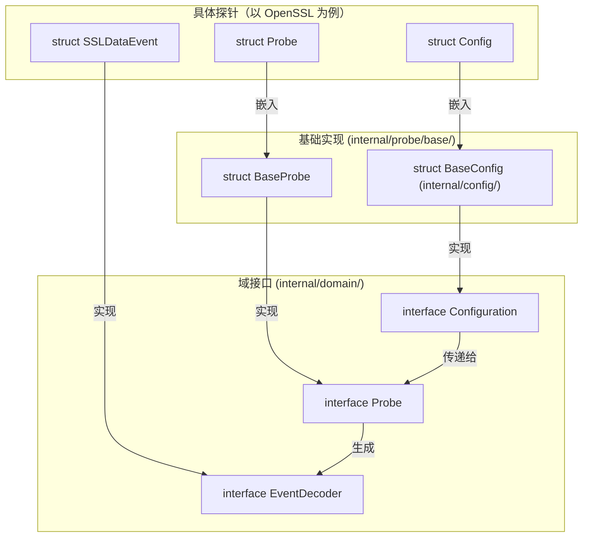
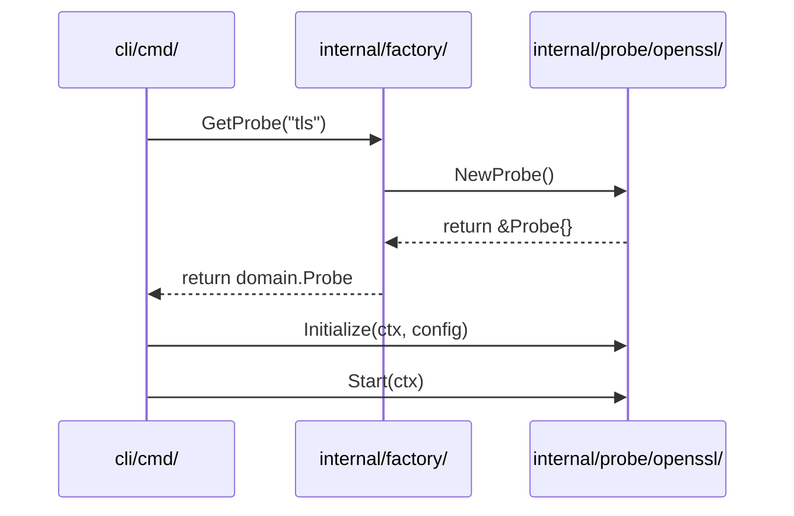

# 探针框架与扩展机制

相关源文件

以下文件被用作生成此维基页面的上下文：

- [.github/agents/pr-agent.md](https://github.com/gojue/ecapture/blob/943a19fe/.github/agents/pr-agent.md)
- [docs/refactoring-guide.md](https://github.com/gojue/ecapture/blob/943a19fe/docs/refactoring-guide.md)
- [internal/config/base_config.go](https://github.com/gojue/ecapture/blob/943a19fe/internal/config/base_config.go)
- [internal/domain/configuration.go](https://github.com/gojue/ecapture/blob/943a19fe/internal/domain/configuration.go)
- [internal/domain/perf_event.go](https://github.com/gojue/ecapture/blob/943a19fe/internal/domain/perf_event.go)
- [internal/probe/base/base_probe.go](https://github.com/gojue/ecapture/blob/943a19fe/internal/probe/base/base_probe.go)
- [internal/probe/base/perf_reorder.go](https://github.com/gojue/ecapture/blob/943a19fe/internal/probe/base/perf_reorder.go)
- [internal/probe/base/perf_reorder_test.go](https://github.com/gojue/ecapture/blob/943a19fe/internal/probe/base/perf_reorder_test.go)
- [internal/probe/bash/bash_probe.go](https://github.com/gojue/ecapture/blob/943a19fe/internal/probe/bash/bash_probe.go)
- [internal/probe/gotls/config_iface.go](https://github.com/gojue/ecapture/blob/943a19fe/internal/probe/gotls/config_iface.go)
- [internal/probe/gotls/config_iface_test.go](https://github.com/gojue/ecapture/blob/943a19fe/internal/probe/gotls/config_iface_test.go)
- [internal/probe/gotls/gotls_probe.go](https://github.com/gojue/ecapture/blob/943a19fe/internal/probe/gotls/gotls_probe.go)
- [internal/probe/mysql/mysql_probe.go](https://github.com/gojue/ecapture/blob/943a19fe/internal/probe/mysql/mysql_probe.go)
- [internal/probe/openssl/config.go](https://github.com/gojue/ecapture/blob/943a19fe/internal/probe/openssl/config.go)
- [internal/probe/openssl/config_ecandroid.go](https://github.com/gojue/ecapture/blob/943a19fe/internal/probe/openssl/config_ecandroid.go)
- [internal/probe/openssl/config_iface.go](https://github.com/gojue/ecapture/blob/943a19fe/internal/probe/openssl/config_iface.go)
- [internal/probe/openssl/config_iface_test.go](https://github.com/gojue/ecapture/blob/943a19fe/internal/probe/openssl/config_iface_test.go)
- [internal/probe/openssl/config_linux.go](https://github.com/gojue/ecapture/blob/943a19fe/internal/probe/openssl/config_linux.go)
- [internal/probe/openssl/config_test.go](https://github.com/gojue/ecapture/blob/943a19fe/internal/probe/openssl/config_test.go)
- [internal/probe/openssl/openssl_probe.go](https://github.com/gojue/ecapture/blob/943a19fe/internal/probe/openssl/openssl_probe.go)
- [internal/probe/postgres/postgres_probe.go](https://github.com/gojue/ecapture/blob/943a19fe/internal/probe/postgres/postgres_probe.go)
- [internal/probe/zsh/zsh_probe.go](https://github.com/gojue/ecapture/blob/943a19fe/internal/probe/zsh/zsh_probe.go)
- [test/e2e/android/android_tls_e2e_test.sh](https://github.com/gojue/ecapture/blob/943a19fe/test/e2e/android/android_tls_e2e_test.sh)

本页面记录了 eCapture 用于管理 eBPF 探针的内部框架。它定义了接口、基础模板以及注册模式，使 eCapture 能够跨不同平台（Linux、Android）和内核模式（CO-RE、非 CO-RE）支持多种捕获目标（TLS、数据库、Shell）。

## 核心接口与契约

框架基于 `internal/domain/` 中定义的一组域接口构建。这些接口建立了 CLI 控制平面与探针实现之间的契约。

### 配置契约
每个探针必须有一个实现 `Configuration` 接口的配置对象。这确保了 PID 过滤、UID 过滤和 BTF 模式等公共设置得到一致处理。

[internal/domain/configuration.go:20-77](https://github.com/gojue/ecapture/blob/943a19fe/internal/domain/configuration.go#L20-L77)

| 方法 | 用途 |
| :--- | :--- |
| `Validate()` | 确保探针特定设置（如库路径）正确无误。 |
| `GetBTF()` | 返回 BTF 模式（自动、CO-RE 或非 CO-RE）。 |
| `GetPid()` / `GetUid()` | 提供 eBPF 程序使用的目标过滤器。 |
| `GetPerfReorder()` | 返回基于时间戳的用户态事件重排序设置。 |

### 探针与事件契约
`Probe` 接口定义了基于 eBPF 的捕获模块的生命周期，而 `EventDecoder` 定义了如何将内核传来的原始字节转换为结构化的 Go 对象。

[internal/domain/probe.go:20-42](https://github.com/gojue/ecapture/blob/943a19fe/internal/domain/probe.go#L20-L42)
[internal/domain/event.go:20-43](https://github.com/gojue/ecapture/blob/943a19fe/internal/domain/event.go#L20-L43)

## 基类与继承

为减少样板代码，eCapture 为配置和探针提供了基础实现。

### BaseConfig
`internal/config/` 中的 `BaseConfig` 结构体为每个探针提供标准字段，例如 `Pid`、`Uid` 和 `BtfMode`。

[internal/config/base_config.go:45-66](https://github.com/gojue/ecapture/blob/943a19fe/internal/config/base_config.go#L45-L66)

### BaseProbe（模板方法模式）
`internal/probe/base/` 中的 `BaseProbe` 实现了探针的标准生命周期。它处理日志记录器初始化、分发器设置以及 perf/ring buffer 读取器的管理。

[internal/probe/base/base_probe.go:46-56](https://github.com/gojue/ecapture/blob/943a19fe/internal/probe/base/base_probe.go#L46-L56)

**生命周期时序：**
1.  **Initialize（初始化）**：设置 `EventDispatcher` 并注册输出写入器（如 Text、PCAP）。[internal/probe/base/base_probe.go:73-135](https://github.com/gojue/ecapture/blob/943a19fe/internal/probe/base/base_probe.go#L73-L135)
2.  **Start（启动）**：将探针转换为运行状态。[internal/probe/base/base_probe.go:139-147](https://github.com/gojue/ecapture/blob/943a19fe/internal/probe/base/base_probe.go#L139-L147)
3.  **Stop（停止）**：优雅地停止捕获。[internal/probe/base/base_probe.go:150-158](https://github.com/gojue/ecapture/blob/943a19fe/internal/probe/base/base_probe.go#L150-L158)
4.  **Close（关闭）**：释放所有资源，关闭 eBPF map，并等待读取器 goroutine 退出。[internal/probe/base/base_probe.go:173-215](https://github.com/gojue/ecapture/blob/943a19fe/internal/probe/base/base_probe.go#L173-L215)

### 来源：
- [internal/domain/configuration.go:20-77](https://github.com/gojue/ecapture/blob/943a19fe/internal/domain/configuration.go#L20-L77)
- [internal/config/base_config.go:45-66](https://github.com/gojue/ecapture/blob/943a19fe/internal/config/base_config.go#L45-L66)
- [internal/probe/base/base_probe.go:46-215](https://github.com/gojue/ecapture/blob/943a19fe/internal/probe/base/base_probe.go#L46-L215)

## 数据流架构

下图展示了探针生命周期中域接口与其具体实现之间的关系。

### 探针框架实体映射
**实体关系与数据流**

Sources: [internal/domain/configuration.go:20-77](https://github.com/gojue/ecapture/blob/943a19fe/internal/domain/configuration.go#L20-L77), [internal/probe/base/base_probe.go:46-56](https://github.com/gojue/ecapture/blob/943a19fe/internal/probe/base/base_probe.go#L46-L56), [internal/probe/openssl/openssl_probe.go:45-58](https://github.com/gojue/ecapture/blob/943a19fe/internal/probe/openssl/openssl_probe.go#L45-L58)

## 工厂注册模式

eCapture 在 `internal/factory/` 中使用工厂模式，将 CLI 与具体探针实现解耦。这使得 CLI 可以通过字符串标识符（如 "tls"、"gotls"）来实例化探针。

### 具体探针中的实现
每个探针通常提供一个返回已初始化实例的 `NewProbe()` 函数。

[internal/probe/openssl/openssl_probe.go:61-68](https://github.com/gojue/ecapture/blob/943a19fe/internal/probe/openssl/openssl_probe.go#L61-L68)
[internal/probe/gotls/gotls_probe.go:70-77](https://github.com/gojue/ecapture/blob/943a19fe/internal/probe/gotls/gotls_probe.go#L70-L77)

### 工厂逻辑
工厂维护一个可用探针类型的注册表。当用户运行 `ecapture tls` 等命令时，工厂检索对应的探针构造器。

**工厂注册与初始化**

Sources: [internal/factory/factory.go:1-50](https://github.com/gojue/ecapture/blob/943a19fe/internal/factory/factory.go#L1-L50), [internal/probe/openssl/openssl_probe.go:61-98](https://github.com/gojue/ecapture/blob/943a19fe/internal/probe/openssl/openssl_probe.go#L61-L98)

## 扩展机制：添加新探针

该框架专为易于扩展而设计。添加一个新探针（例如针对新数据库或协议）需要：

1.  **定义配置**：创建一个嵌入 `config.BaseConfig` 的结构体。
2.  **定义事件**：创建实现 `domain.EventDecoder` 的结构体以解析 eBPF 数据。
3.  **实现探针**：创建一个嵌入 `base.BaseProbe` 的结构体。
    *   实现 `setupManager()` 以使用 `ebpfmanager` 定义 eBPF 程序和 map。[internal/probe/gotls/gotls_probe.go:229-250](https://github.com/gojue/ecapture/blob/943a19fe/internal/probe/gotls/gotls_probe.go#L229-L250)
    *   实现 `Start()` 以加载字节码并启动 perf 读取器。[internal/probe/gotls/gotls_probe.go:106-153](https://github.com/gojue/ecapture/blob/943a19fe/internal/probe/gotls/gotls_probe.go#L106-L153)
4.  **向工厂注册**：将新探针类型添加到 `internal/factory/`。

### 字节码选择
`BaseProbe` 提供了一个辅助方法 `GetBPFName`，它会根据用户的配置和内核支持自动追加 `_core.o` 或 `_noncore.o`。

[internal/probe/base/base_probe.go:161-171](https://github.com/gojue/ecapture/blob/943a19fe/internal/probe/base/base_probe.go#L161-L171)

### 来源：
- [internal/probe/openssl/openssl_probe.go:45-159](https://github.com/gojue/ecapture/blob/943a19fe/internal/probe/openssl/openssl_probe.go#L45-L159)
- [internal/probe/gotls/gotls_probe.go:52-153](https://github.com/gojue/ecapture/blob/943a19fe/internal/probe/gotls/gotls_probe.go#L52-L153)
- [internal/probe/base/base_probe.go:161-171](https://github.com/gojue/ecapture/blob/943a19fe/internal/probe/base/base_probe.go#L161-L171)
- [.github/agents/pr-agent.md:100-125](https://github.com/gojue/ecapture/blob/943a19fe/.github/agents/pr-agent.md#L100-L125)