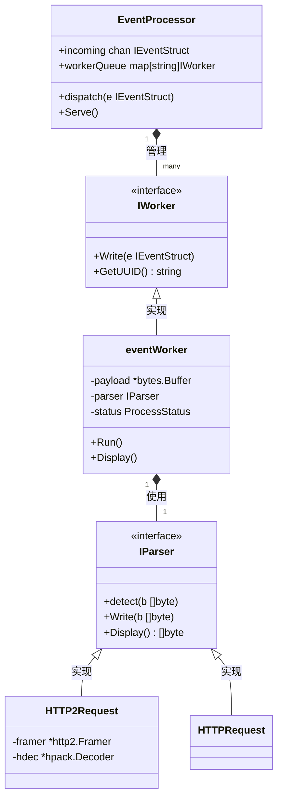

# 事件处理流水线

相关源文件

以下文件被用作生成此维基页面的上下文：

- [.gitignore](https://github.com/gojue/ecapture/blob/943a19fe/.gitignore)
- [cli/cmd/root.go](https://github.com/gojue/ecapture/blob/943a19fe/cli/cmd/root.go)
- [pkg/event_processor/base_event.go](https://github.com/gojue/ecapture/blob/943a19fe/pkg/event_processor/base_event.go)
- [pkg/event_processor/http2_request.go](https://github.com/gojue/ecapture/blob/943a19fe/pkg/event_processor/http2_request.go)
- [pkg/event_processor/http2_request_test.go](https://github.com/gojue/ecapture/blob/943a19fe/pkg/event_processor/http2_request_test.go)
- [pkg/event_processor/http2_response.go](https://github.com/gojue/ecapture/blob/943a19fe/pkg/event_processor/http2_response.go)
- [pkg/event_processor/http2_response_test.go](https://github.com/gojue/ecapture/blob/943a19fe/pkg/event_processor/http2_response_test.go)
- [pkg/event_processor/http_request.go](https://github.com/gojue/ecapture/blob/943a19fe/pkg/event_processor/http_request.go)
- [pkg/event_processor/http_response.go](https://github.com/gojue/ecapture/blob/943a19fe/pkg/event_processor/http_response.go)
- [pkg/event_processor/http_response_test.go](https://github.com/gojue/ecapture/blob/943a19fe/pkg/event_processor/http_response_test.go)
- [pkg/event_processor/iparser.go](https://github.com/gojue/ecapture/blob/943a19fe/pkg/event_processor/iparser.go)
- [pkg/event_processor/iworker.go](https://github.com/gojue/ecapture/blob/943a19fe/pkg/event_processor/iworker.go)
- [pkg/event_processor/processor.go](https://github.com/gojue/ecapture/blob/943a19fe/pkg/event_processor/processor.go)
- [pkg/event_processor/processor_test.go](https://github.com/gojue/ecapture/blob/943a19fe/pkg/event_processor/processor_test.go)
- [pkg/event_processor/testdata/all.json](https://github.com/gojue/ecapture/blob/943a19fe/pkg/event_processor/testdata/all.json)
- [pkg/util/ebpf/bpf.go](https://github.com/gojue/ecapture/blob/943a19fe/pkg/util/ebpf/bpf.go)
- [pkg/util/ebpf/bpf_linux.go](https://github.com/gojue/ecapture/blob/943a19fe/pkg/util/ebpf/bpf_linux.go)
- [pkg/util/ebpf/bpf_test.go](https://github.com/gojue/ecapture/blob/943a19fe/pkg/util/ebpf/bpf_test.go)

eCapture 中的事件处理流水线负责对从 eBPF 内核空间捕获的原始数据事件进行重组、协议识别和格式化。它将碎片化的字节转换为结构化的、人类可读或机器可解析的日志，同时保持每个连接的事件顺序。

## 流水线概览

该流水线作为一个多级调度系统运行。事件从 eBPF perf/ring buffer 中摄取，根据连接亲和性分发给专用工作线程（worker），使用特定协议的状态机进行解析，最后通过配置的输出写入器（writer）发送。

### 数据流图

下图展示了数据从内核经过用户态处理实体的转换过程。

"事件处理流程"

```mermaid
graph TD
    subgraph "内核空间"
        K["eBPF 程序 (uprobes/TC)"]
    end

    subgraph "用户态: EventProcessor"
        B["perf/ring buffer"] -->|IEventStruct| EP["EventProcessor.Serve()"]
        EP -->|分发| EW["eventWorker (UUID 亲和性)"]
        
        subgraph "eventWorker 生命周期"
            EW -->|写入| PAY["载荷缓冲区"]
            PAY -->|新建解析器| P["IParser (HTTP/1.1, HTTP/2 等)"]
            P -->|ProcessStatus| DS["Display()"]
        end
    end

    subgraph "输出层"
        DS -->|outComing 通道| OUT["输出写入器 (Stdout/文件/WS)"]
    end

    K -->|原始字节| B
```

Sources: [pkg/event_processor/processor.go:64-87](https://github.com/gojue/ecapture/blob/943a19fe/pkg/event_processor/processor.go#L64-L87), [pkg/event_processor/iworker.go:261-280](https://github.com/gojue/ecapture/blob/943a19fe/pkg/event_processor/iworker.go#L261-L280)

---

## EventProcessor 调度循环

`EventProcessor` 是事件管理的中心枢纽。它在 `Serve()` 方法中运行一个连续循环，以处理传入事件并管理 worker 的生命周期。

### 核心职责
1.  **摄取 (Ingestion)**：从 `incoming` 通道接收 `IEventStruct` 对象 [pkg/event_processor/processor.go:68](https://github.com/gojue/ecapture/blob/943a19fe/pkg/event_processor/processor.go#L68)。
2.  **分发 (Dispatching)**：使用 `dispatch()` 根据唯一的 UUID 将事件路由到正确的 `IWorker` [pkg/event_processor/processor.go:89-107](https://github.com/gojue/ecapture/blob/943a19fe/pkg/event_processor/processor.go#L89-L107)。
3.  **连接管理 (Connection Management)**：监控 `destroyConn` 以在套接字关闭时清理 worker [pkg/event_processor/processor.go:78-79](https://github.com/gojue/ecapture/blob/943a19fe/pkg/event_processor/processor.go#L78-L79)。
4.  **输出聚合 (Output Aggregation)**：从 `outComing` 收集处理后的字节切片，并将其写入最终的 `logger` [pkg/event_processor/processor.go:80-81](https://github.com/gojue/ecapture/blob/943a19fe/pkg/event_processor/processor.go#L80-L81)。

Sources: [pkg/event_processor/processor.go:28-61](https://github.com/gojue/ecapture/blob/943a19fe/pkg/event_processor/processor.go#L28-L61)

---

## eventWorker 与 UUID 亲和性

为了确保特定连接（例如单个 TLS 会话）流量的顺序处理，eCapture 使用了 **UUID 亲和性 (UUID Affinity)**。

### UUID 构建
UUID 根据事件元数据生成，用于唯一标识一个流：
`PID_TID_COMM_FD_DATATYPE`
[pkg/event_processor/base_event.go:122-124](https://github.com/gojue/ecapture/blob/943a19fe/pkg/event_processor/base_event.go#L122-L124)

### Worker 生命周期
每个 `eventWorker` 代表一个单一的事件流。
*   **亲和性**：`EventProcessor` 维护一个 `workerQueue` 映射，其中键为 UUID [pkg/event_processor/processor.go:60](https://github.com/gojue/ecapture/blob/943a19fe/pkg/event_processor/processor.go#L60)。
*   **顺序执行**：每个 worker 运行自己的 `Run()` 协程，确保同一连接的数据包按顺序处理 [pkg/event_processor/iworker.go:93-95](https://github.com/gojue/ecapture/blob/943a19fe/pkg/event_processor/iworker.go#L93-L95)。
*   **超时回收**：一个 `ticker`（默认 100ms）触发 worker 检查是否应刷新数据，或者是否因空闲而销毁 worker [pkg/event_processor/iworker.go:125](https://github.com/gojue/ecapture/blob/943a19fe/pkg/event_processor/iworker.go#L125)。

Sources: [pkg/event_processor/iworker.go:69-88](https://github.com/gojue/ecapture/blob/943a19fe/pkg/event_processor/iworker.go#L69-L88), [pkg/event_processor/processor.go:128-140](https://github.com/gojue/ecapture/blob/943a19fe/pkg/event_processor/processor.go#L128-L140)

---

## 协议识别 (IParser)

`IParser` 接口定义了如何识别和解析原始载荷。当 worker 收到流的首个数据时，它使用 `NewParser()` 来识别协议。

### 支持的解析器
| 解析器名称 | 协议 | 检测逻辑 |
| :--- | :--- | :--- |
| `HTTPRequest` | HTTP/1.1 请求 | 使用 `http.ReadRequest` [pkg/event_processor/http_request.go:83-92](https://github.com/gojue/ecapture/blob/943a19fe/pkg/event_processor/http_request.go#L83-L92) |
| `HTTPResponse` | HTTP/1.1 响应 | 使用 `http.ReadResponse` [pkg/event_processor/http_response.go:94-102](https://github.com/gojue/ecapture/blob/943a19fe/pkg/event_processor/http_response.go#L94-L102) |
| `HTTP2Request` | HTTP/2 请求 | 检查是否存在 `PRI * HTTP/2.0\r\n\r\nSM\r\n\r\n` [pkg/event_processor/http2_request.go:42-59](https://github.com/gojue/ecapture/blob/943a19fe/pkg/event_processor/http2_request.go#L42-L59) |
| `HTTP2Response` | HTTP/2 响应 | 验证 HTTP/2 帧头部 (9 字节) [pkg/event_processor/http2_response.go:56-88](https://github.com/gojue/ecapture/blob/943a19fe/pkg/event_processor/http2_response.go#L56-L88) |
| `DefaultParser` | 未知/明文 | 备用方案，执行十六进制转储或 C 字符串转换 [pkg/event_processor/iparser.go:117-161](https://github.com/gojue/ecapture/blob/943a19fe/pkg/event_processor/iparser.go#L117-L161) |

### ProcessStatus 状态机
解析状态通过 `ProcessStatus` 进行跟踪：
1.  `ProcessStateInit`：初始状态或重置后 [pkg/event_processor/iparser.go:28](https://github.com/gojue/ecapture/blob/943a19fe/pkg/event_processor/iparser.go#L28)。
2.  `ProcessStateProcessing`：正在向解析器缓冲区写入字节 [pkg/event_processor/iparser.go:29](https://github.com/gojue/ecapture/blob/943a19fe/pkg/event_processor/iparser.go#L29)。
3.  `ProcessStateDone`：协议识别和数据提取已完成 [pkg/event_processor/iparser.go:30](https://github.com/gojue/ecapture/blob/943a19fe/pkg/event_processor/iparser.go#L30)。

Sources: [pkg/event_processor/iparser.go:49-60](https://github.com/gojue/ecapture/blob/943a19fe/pkg/event_processor/iparser.go#L49-L60), [pkg/event_processor/iparser.go:85-115](https://github.com/gojue/ecapture/blob/943a19fe/pkg/event_processor/iparser.go#L85-L115)

---

## 代码实体关联

此图将逻辑处理步骤映射到 `pkg/event_processor` 包中具体的 Go 结构体和接口。

"流水线实体映射"

Sources: [pkg/event_processor/processor.go:28-48](https://github.com/gojue/ecapture/blob/943a19fe/pkg/event_processor/processor.go#L28-L48), [pkg/event_processor/iworker.go:34-48](https://github.com/gojue/ecapture/blob/943a19fe/pkg/event_processor/iworker.go#L34-L48), [pkg/event_processor/iparser.go:49-60](https://github.com/gojue/ecapture/blob/943a19fe/pkg/event_processor/iparser.go#L49-L60)

---

## 最终输出与截断

在数据发送到输出写入器之前，流水线会应用最终的转换：

1.  **截断 (Truncation)**：如果设置了 `--tsize`，当载荷缓冲区达到指定限制时，`eventWorker` 将对其进行截断 [pkg/event_processor/iworker.go:235-241](https://github.com/gojue/ecapture/blob/943a19fe/pkg/event_processor/iworker.go#L235-L241)。
2.  **格式化 (Formatting)**：根据配置，数据会被格式化为文本字符串（包含 PID、Comm 和 IP 元数据）或序列化为 Protobuf `LogEntry` [pkg/event_processor/iworker.go:197-226](https://github.com/gojue/ecapture/blob/943a19fe/pkg/event_processor/iworker.go#L197-L226)。
3.  **十六进制编码 (Hex Encoding)**：如果启用了 `--hex`，最终的字节切片在发送到 `outComing` 通道之前会被转换为十六进制转储 [pkg/event_processor/iworker.go:191-193](https://github.com/gojue/ecapture/blob/943a19fe/pkg/event_processor/iworker.go#L191-L193)。

Sources: [pkg/event_processor/iworker.go:174-227](https://github.com/gojue/ecapture/blob/943a19fe/pkg/event_processor/iworker.go#L174-L227), [cli/cmd/root.go:162-175](https://github.com/gojue/ecapture/blob/943a19fe/cli/cmd/root.go#L162-L175)