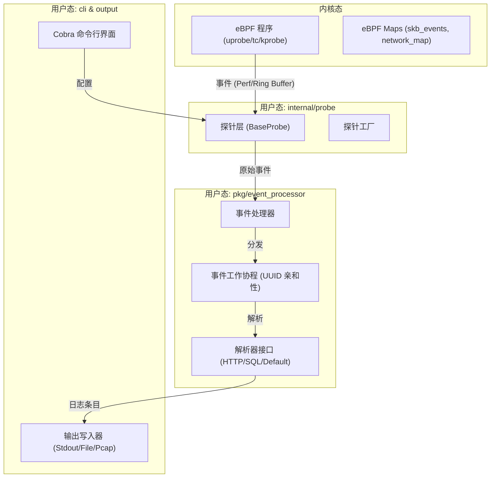
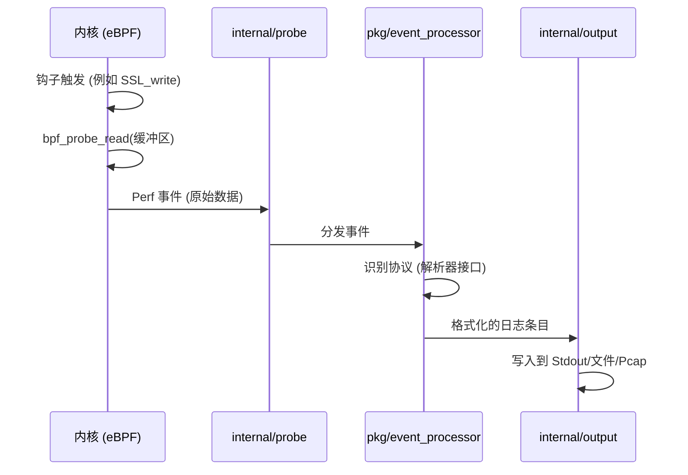

# 系统架构

相关源文件

以下文件被用作生成此维基页面的上下文：

- [CHANGELOG.md](https://github.com/gojue/ecapture/blob/943a19fe/CHANGELOG.md)
- [README.md](https://github.com/gojue/ecapture/blob/943a19fe/README.md)
- [kern/bpf/arm64/vmlinux.h](https://github.com/gojue/ecapture/blob/943a19fe/kern/bpf/arm64/vmlinux.h)
- [kern/bpf/arm64/vmlinux_614.h](https://github.com/gojue/ecapture/blob/943a19fe/kern/bpf/arm64/vmlinux_614.h)
- [kern/bpf/bpf_core_read.h](https://github.com/gojue/ecapture/blob/943a19fe/kern/bpf/bpf_core_read.h)
- [kern/bpf/bpf_helper_defs.h](https://github.com/gojue/ecapture/blob/943a19fe/kern/bpf/bpf_helper_defs.h)
- [kern/bpf/bpf_helpers.h](https://github.com/gojue/ecapture/blob/943a19fe/kern/bpf/bpf_helpers.h)
- [kern/bpf/bpf_tracing.h](https://github.com/gojue/ecapture/blob/943a19fe/kern/bpf/bpf_tracing.h)
- [kern/bpf/x86/vmlinux.h](https://github.com/gojue/ecapture/blob/943a19fe/kern/bpf/x86/vmlinux.h)
- [kern/bpf/x86/vmlinux_614.h](https://github.com/gojue/ecapture/blob/943a19fe/kern/bpf/x86/vmlinux_614.h)
- [kern/common.h](https://github.com/gojue/ecapture/blob/943a19fe/kern/common.h)
- [kern/core_fixes.bpf.h](https://github.com/gojue/ecapture/blob/943a19fe/kern/core_fixes.bpf.h)
- [kern/ecapture.h](https://github.com/gojue/ecapture/blob/943a19fe/kern/ecapture.h)
- [kern/tc.h](https://github.com/gojue/ecapture/blob/943a19fe/kern/tc.h)
- [main.go](https://github.com/gojue/ecapture/blob/943a19fe/main.go)

eCapture 采用模块化的三层架构构建，旨在将高性能的 eBPF 内核插桩与灵活的用户态处理流水线相结合。这种设计允许开发者在扩展新探针的同时，保持事件处理和输出的一致数据路径。

## 系统概览

下图展示了内核态 eBPF 程序与用户态 Go 组件之间的高层关系。

### 高层组件交互

**Sources:** [main.go:9-11](https://github.com/gojue/ecapture/blob/943a19fe/main.go#L9-L11), [kern/tc.h:58-78](https://github.com/gojue/ecapture/blob/943a19fe/kern/tc.h#L58-L78), [README.md:94-103](https://github.com/gojue/ecapture/blob/943a19fe/README.md#L94-L103)

---

## 架构分层

系统分为三个主要的功能层：

### 1. eBPF 内核层
该层由编译为 eBPF 字节码的 C 程序组成。它利用 `uprobes`（针对 OpenSSL 等用户态库）、`kprobes` 或 `TC`（流量控制）分类器在内核级别执行实际的数据拦截。
*   **字节码管理：** eBPF 资源存储在 `ebpfassets/` 中，可以通过 BTF 以 CO-RE（一次编译，到处运行）模式加载，或针对旧内核以非 CO-RE 模式加载。
*   **数据捕获：** 程序使用 `bpf_probe_read` [kern/bpf/bpf_helper_defs.h:110](https://github.com/gojue/ecapture/blob/943a19fe/kern/bpf/bpf_helper_defs.h#L110) 等辅助函数，在加密前或解密后从内存中提取明文。

详情请参阅 [三层架构设计](7.1-three-layer-architecture.md)。

### 2. 用户态探针层
位于 `internal/probe/`，该层负责管理 eBPF 程序的生命周期。它处理：
*   **发现：** 在宿主系统中查找目标共享库（例如 `libssl.so`）[README.md:108-112](https://github.com/gojue/ecapture/blob/943a19fe/README.md#L108-L112)。
*   **加载：** 使用 `BaseProbe` 模板加载字节码，并将钩子（hooks）附加到特定的函数符号（例如 `SSL_write`）。
*   **配置：** 通过 `BaseConfig` 结构体验证命令行参数。

详情请参阅 [探针框架与扩展机制](7.2-probe-framework-and-extension-mechanism.md)。

### 3. 事件处理与输出层
数据通过 Perf 或 Ring 缓冲区离开内核后，进入 `pkg/event_processor` 流水线。
*   **排序：** `eventWorker` 确保属于同一连接（通过 UUID 标识）的数据包按正确的顺序进行处理 [CHANGELOG.md:5](https://github.com/gojue/ecapture/blob/943a19fe/CHANGELOG.md#L5)。
*   **解析：** 特定协议的解析器（HTTP/1.1、HTTP/2、MySQL）重构高层应用数据。
*   **交付：** 最终数据被编码（JSON/Text/Protobuf）并发送到配置的写入器，如 `Stdout`、`PcapWriter` 或 `eCaptureQ` WebSocket 服务器。

详情请参阅 [事件处理流水线](7.3-event-processing-pipeline.md)。

---

## 核心数据结构

为了理解数据流，开发者应当熟悉内核和用户态头文件中定义的以下实体：

| 实体 | 位置 | 描述 |
| :--- | :--- | :--- |
| `skb_data_event_t` | [kern/tc.h:30-37](https://github.com/gojue/ecapture/blob/943a19fe/kern/tc.h#L30-L37) | 通过 TC 钩子捕获的网络数据包元数据。 |
| `net_id_t` | [kern/tc.h:39-47](https://github.com/gojue/ecapture/blob/943a19fe/kern/tc.h#L39-L47) | 用于会话跟踪的连接元组（IP/端口/协议）。 |
| `skb_events` | [kern/tc.h:58-63](https://github.com/gojue/ecapture/blob/943a19fe/kern/tc.h#L58-L63) | 用于将数据流式传输到用户态的 BPF Perf 事件数组 Map。 |
| `LogEntry` | `pkg/ecaptureq/` | 用于远程流传输的标准 Protobuf 消息格式。 |

### 事件流：从内核到命令行

**Sources:** [kern/tc.h:136-150](https://github.com/gojue/ecapture/blob/943a19fe/kern/tc.h#L136-L150), [CHANGELOG.md:103-111](https://github.com/gojue/ecapture/blob/943a19fe/CHANGELOG.md#L103-L111), [README.md:114-119](https://github.com/gojue/ecapture/blob/943a19fe/README.md#L114-L119)

---

## 章节索引

*   **[三层架构设计](7.1-three-layer-architecture.md)**：深入探讨内核层、探针层和命令行层。
*   **[探针框架与扩展机制](7.2-probe-framework-and-extension-mechanism.md)**：如何使用 `BaseProbe` 和工厂模式添加新功能。
*   **[事件处理流水线](7.3-event-processing-pipeline.md)**：详细了解工作线程池、UUID 亲和性和协议解析。

**Sources:** 系统架构