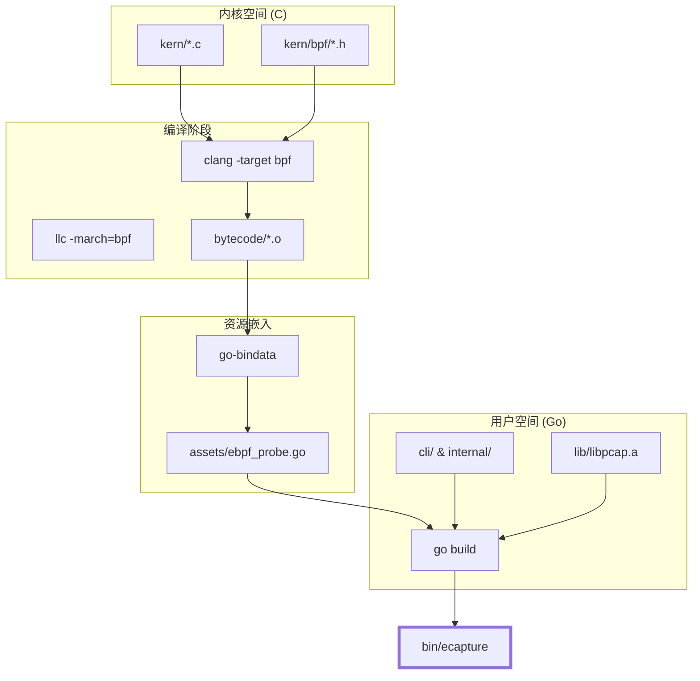
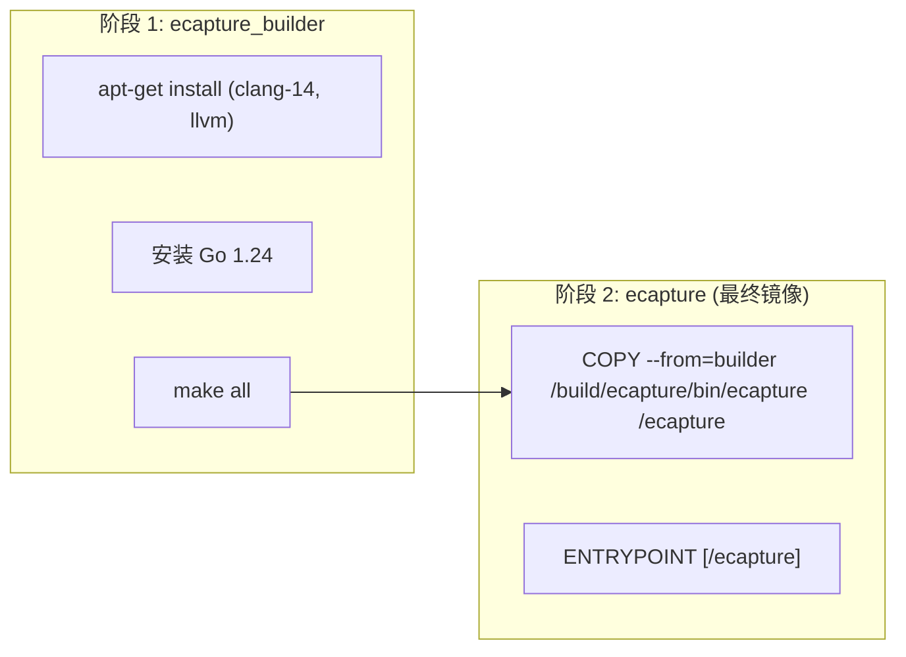

# 源码编译指南

<details>
<summary>相关源文件</summary>

以下文件被用作生成此维基页面的上下文：

- [.github/workflows/go-c-cpp.yml](https://github.com/gojue/ecapture/blob/943a19fe/.github/workflows/go-c-cpp.yml)
- [.github/workflows/release.yml](https://github.com/gojue/ecapture/blob/943a19fe/.github/workflows/release.yml)
- [Makefile](https://github.com/gojue/ecapture/blob/943a19fe/Makefile)
- [builder/Dockerfile](https://github.com/gojue/ecapture/blob/943a19fe/builder/Dockerfile)
- [builder/Makefile.release](https://github.com/gojue/ecapture/blob/943a19fe/builder/Makefile.release)
- [builder/init_env.sh](https://github.com/gojue/ecapture/blob/943a19fe/builder/init_env.sh)
- [functions.mk](https://github.com/gojue/ecapture/blob/943a19fe/functions.mk)
- [go.mod](https://github.com/gojue/ecapture/blob/943a19fe/go.mod)
- [go.sum](https://github.com/gojue/ecapture/blob/943a19fe/go.sum)
- [kern/bpf/arm64/vmlinux.h](https://github.com/gojue/ecapture/blob/943a19fe/kern/bpf/arm64/vmlinux.h)
- [kern/bpf/arm64/vmlinux_614.h](https://github.com/gojue/ecapture/blob/943a19fe/kern/bpf/arm64/vmlinux_614.h)
- [kern/bpf/bpf_core_read.h](https://github.com/gojue/ecapture/blob/943a19fe/kern/bpf/bpf_core_read.h)
- [kern/bpf/bpf_helper_defs.h](https://github.com/gojue/ecapture/blob/943a19fe/kern/bpf/bpf_helper_defs.h)
- [kern/bpf/bpf_helpers.h](https://github.com/gojue/ecapture/blob/943a19fe/kern/bpf/bpf_helpers.h)
- [kern/bpf/bpf_tracing.h](https://github.com/gojue/ecapture/blob/943a19fe/kern/bpf/bpf_tracing.h)
- [kern/bpf/x86/vmlinux.h](https://github.com/gojue/ecapture/blob/943a19fe/kern/bpf/x86/vmlinux.h)
- [kern/bpf/x86/vmlinux_614.h](https://github.com/gojue/ecapture/blob/943a19fe/kern/bpf/x86/vmlinux_614.h)
- [kern/core_fixes.bpf.h](https://github.com/gojue/ecapture/blob/943a19fe/kern/core_fixes.bpf.h)
- [variables.mk](https://github.com/gojue/ecapture/blob/943a19fe/variables.mk)

</details>

本页面提供了从源码编译 eCapture 的详细技术说明。eCapture 使用了一个复杂的构建系统，协调 Go（用于用户态控制平面）和 C（用于 eBPF 内核程序）。它支持 CO-RE（一次编译，到处运行）和非 CO-RE 构建，以确保在各种 Linux 内核版本和架构（包括 Android GKI）上的兼容性。

## 构建架构概述

构建过程由多层 Makefile 系统管理，负责处理依赖检查、eBPF 字节码生成、资源嵌入以及最终的二进制链接。

### 构建流程图

下图展示了从源代码到最终 `ecapture` 二进制文件的数据流。

"eCapture 构建流水线"

Sources: [Makefile:6-7](https://github.com/gojue/ecapture/blob/943a19fe/Makefile#L6-L7), [Makefile:162-165](https://github.com/gojue/ecapture/blob/943a19fe/Makefile#L162-L165), [Makefile:189-193](https://github.com/gojue/ecapture/blob/943a19fe/Makefile#L189-L193)

## 所需工具链

要在宿主机上编译 eCapture，必须安装以下工具：

| 工具 | 版本要求 | 用途 |
| :--- | :--- | :--- |
| **Golang** | `>= 1.24` | 编译用户态控制平面 [functions.mk:28-34](https://github.com/gojue/ecapture/blob/943a19fe/functions.mk#L28-L34)。 |
| **Clang** | `>= 14` (推荐) | 将 C 代码编译为 eBPF 字节码 [functions.mk:17-21](https://github.com/gojue/ecapture/blob/943a19fe/functions.mk#L17-L21)。 |
| **LLVM** | 与 Clang 版本匹配 | `llc` 和 `llvm-strip` 所需 [variables.mk:14](https://github.com/gojue/ecapture/blob/943a19fe/variables.mk#L14)。 |
| **libelf-dev** | 无 | eBPF 程序加载所需。 |
| **libpcap** | 子模块 | 用于 pcapng 输出支持的静态链接 [Makefile:177-187](https://github.com/gojue/ecapture/blob/943a19fe/Makefile#L177-L187)。 |
| **go-bindata** | 通过 Go 管理 | 将 `.o` 文件嵌入到 Go 源码中 [Makefile:164](https://github.com/gojue/ecapture/blob/943a19fe/Makefile#L164)。 |

### 环境初始化
项目提供了一个脚本用于在 Ubuntu 系统上自动完成设置：`builder/init_env.sh`。该脚本会安装必要的编译器，链接正确的工具版本（例如将 `clang-14` 链接为 `clang`），并准备 Linux 内核头文件 [builder/init_env.sh:72-88](https://github.com/gojue/ecapture/blob/943a19fe/builder/init_env.sh#L72-L88)。

## CO-RE 与非 CO-RE 构建

eCapture 支持两种主要的 eBPF 编译策略。

### 1. CO-RE (一次编译 – 到处运行)
*   **机制**：使用 BPF 类型格式 (BTF) 在运行时动态处理内核结构体偏移。
*   **要求**：目标内核必须开启 `CONFIG_DEBUG_INFO_BTF=y` 进行编译。
*   **构建命令**：`make` 或 `make ebpf` [Makefile:6](https://github.com/gojue/ecapture/blob/943a19fe/Makefile#L6)。
*   **实现**：依赖于从宿主机生成或在 `kern/bpf/$(ARCH)/vmlinux.h` 中提供的 `vmlinux.h` [variables.mk:163](https://github.com/gojue/ecapture/blob/943a19fe/variables.mk#L163)。

### 2. 非 CO-RE (Non-CO-RE)
*   **机制**：针对目标环境的特定内核头文件编译 eBPF 程序。
*   **要求**：需要 eCapture 运行环境所对应的特定内核版本的头文件。
*   **构建命令**：`make nocore` [Makefile:10](https://github.com/gojue/ecapture/blob/943a19fe/Makefile#L10)。
*   **使用场景**：旧版本内核（如 < 5.4）或不支持 BTF 的环境。

Sources: [Makefile:133-160](https://github.com/gojue/ecapture/blob/943a19fe/Makefile#L133-L160), [variables.mk:184](https://github.com/gojue/ecapture/blob/943a19fe/variables.mk#L184)

## 常用 Makefile 目标

`Makefile` 定义了针对不同部署场景的几个关键目标：

*   **`make env`**：显示当前构建环境变量，包括检测到的工具版本和路径 [Makefile:20-63](https://github.com/gojue/ecapture/blob/943a19fe/Makefile#L20-L63)。
*   **`make all`**：默认目标。同时构建 CO-RE 和非 CO-RE 字节码，并将其链接到单个二进制文件中 [Makefile:6](https://github.com/gojue/ecapture/blob/943a19fe/Makefile#L6)。
*   **`make nocore`**：仅构建非 CO-RE 版本 [Makefile:10](https://github.com/gojue/ecapture/blob/943a19fe/Makefile#L10)。
*   **`make clean`**：移除所有生成的产物，包括字节码、资源文件和最终的二进制文件 [Makefile:109-115](https://github.com/gojue/ecapture/blob/943a19fe/Makefile#L109-L115)。
*   **`make android`**：通过 `ANDROID=1` 构建 Android 平台的快捷方式，通常意味着非 CO-RE 构建和特定的 BoringSSL 挂钩 [Makefile:95](https://github.com/gojue/ecapture/blob/943a19fe/Makefile#L95), [variables.mk:65-68](https://github.com/gojue/ecapture/blob/943a19fe/variables.mk#L65-L68)。

## 交叉编译

eCapture 支持在 `x86_64` (amd64) 和 `aarch64` (arm64) 之间进行交叉编译。

### Arm64 (Linux)
在 x86_64 宿主机上为 arm64 构建：
```bash
CROSS_ARCH=arm64 make
```
构建系统使用 `aarch64-linux-gnu-` 作为编译器前缀，并设置 `GOARCH=arm64` [variables.mk:123-127](https://github.com/gojue/ecapture/blob/943a19fe/variables.mk#L123-L127)。

### Android
Android 构建需要 `ANDROID=1` 标志。这会调整目标操作系统并包含特定的 Android BoringSSL 探针 [variables.mk:65-68](https://github.com/gojue/ecapture/blob/943a19fe/variables.mk#L65-L68)。
```bash
ANDROID=1 CROSS_ARCH=arm64 make nocore
```
Sources: [Makefile:92-95](https://github.com/gojue/ecapture/blob/943a19fe/Makefile#L92-L95), [variables.mk:111-131](https://github.com/gojue/ecapture/blob/943a19fe/variables.mk#L111-L131)

## Docker 构建环境

为了提供可复现的构建环境，在 `builder/Dockerfile` 中提供了一个 `Dockerfile`。它使用了多阶段构建：

1.  **`ecapture_builder`**：一个 Ubuntu 22.04 镜像，安装了完整的工具链（Clang 14, Go 1.24, 内核源码）并编译项目 [builder/Dockerfile:1-32](https://github.com/gojue/ecapture/blob/943a19fe/builder/Dockerfile#L1-L32)。
2.  **`ecapture`**：一个基于 Alpine 的最小化最终镜像，仅包含编译好的二进制文件 [builder/Dockerfile:35-38](https://github.com/gojue/ecapture/blob/943a19fe/builder/Dockerfile#L35-L38)。

"Docker 构建阶段映射"

Sources: [builder/Dockerfile:1-38](https://github.com/gojue/ecapture/blob/943a19fe/builder/Dockerfile#L1-L38)

## 实现细节：资源嵌入

eCapture 使用 `go-bindata` 将 eBPF 字节码直接嵌入到 Go 二进制文件中。这确保了该工具是一个单一的、便携的可执行文件。

1.  `kern/` 中的 eBPF C 代码被编译为 `bytecode/` 中的 `.o` 文件 [Makefile:118-127](https://github.com/gojue/ecapture/blob/943a19fe/Makefile#L118-L127)。
2.  `assets` 目标对 `bytecode/*.o` 运行 `go-bindata` [Makefile:164](https://github.com/gojue/ecapture/blob/943a19fe/Makefile#L164)。
3.  生成的 `assets/ebpf_probe.go` 文件包含十六进制编码的字节码，随后被编译进最终的二进制文件中 [Makefile:165](https://github.com/gojue/ecapture/blob/943a19fe/Makefile#L165)。

Sources: [Makefile:162-174](https://github.com/gojue/ecapture/blob/943a19fe/Makefile#L162-L174)