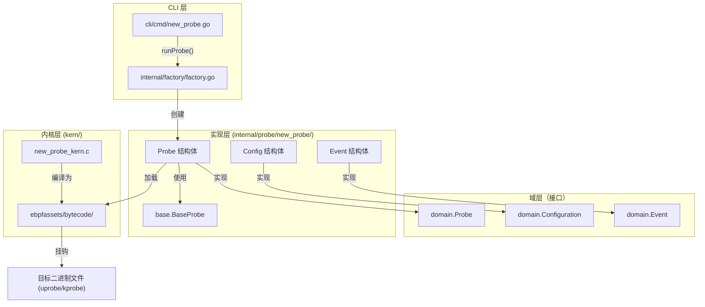
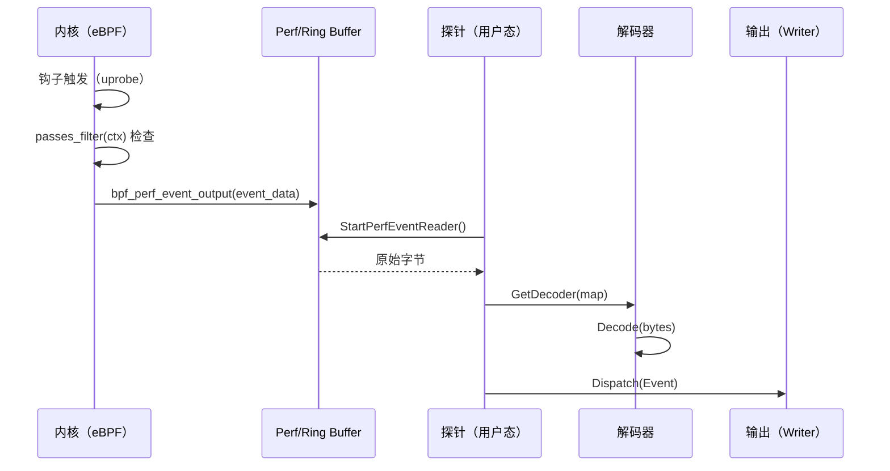

# 如何添加新探针

相关源文件

以下文件被用作生成此维基页面的上下文：

- [CHANGELOG.md](https://github.com/gojue/ecapture/blob/943a19fe/CHANGELOG.md)
- [README.md](https://github.com/gojue/ecapture/blob/943a19fe/README.md)
- [cli/cmd/bash.go](https://github.com/gojue/ecapture/blob/943a19fe/cli/cmd/bash.go)
- [cli/cmd/mysqld.go](https://github.com/gojue/ecapture/blob/943a19fe/cli/cmd/mysqld.go)
- [cli/cmd/postgres.go](https://github.com/gojue/ecapture/blob/943a19fe/cli/cmd/postgres.go)
- [internal/config/base_config.go](https://github.com/gojue/ecapture/blob/943a19fe/internal/config/base_config.go)
- [internal/domain/configuration.go](https://github.com/gojue/ecapture/blob/943a19fe/internal/domain/configuration.go)
- [internal/probe/base/base_probe.go](https://github.com/gojue/ecapture/blob/943a19fe/internal/probe/base/base_probe.go)
- [internal/probe/bash/bash_probe.go](https://github.com/gojue/ecapture/blob/943a19fe/internal/probe/bash/bash_probe.go)
- [internal/probe/gotls/gotls_probe.go](https://github.com/gojue/ecapture/blob/943a19fe/internal/probe/gotls/gotls_probe.go)
- [internal/probe/mysql/mysql_probe.go](https://github.com/gojue/ecapture/blob/943a19fe/internal/probe/mysql/mysql_probe.go)
- [internal/probe/openssl/config.go](https://github.com/gojue/ecapture/blob/943a19fe/internal/probe/openssl/config.go)
- [internal/probe/openssl/config_test.go](https://github.com/gojue/ecapture/blob/943a19fe/internal/probe/openssl/config_test.go)
- [internal/probe/openssl/openssl_probe.go](https://github.com/gojue/ecapture/blob/943a19fe/internal/probe/openssl/openssl_probe.go)
- [internal/probe/postgres/postgres_probe.go](https://github.com/gojue/ecapture/blob/943a19fe/internal/probe/postgres/postgres_probe.go)
- [internal/probe/zsh/zsh_probe.go](https://github.com/gojue/ecapture/blob/943a19fe/internal/probe/zsh/zsh_probe.go)
- [kern/bash_kern.c](https://github.com/gojue/ecapture/blob/943a19fe/kern/bash_kern.c)
- [kern/mysqld_kern.c](https://github.com/gojue/ecapture/blob/943a19fe/kern/mysqld_kern.c)
- [kern/nspr_kern.c](https://github.com/gojue/ecapture/blob/943a19fe/kern/nspr_kern.c)
- [main.go](https://github.com/gojue/ecapture/blob/943a19fe/main.go)

本指南为希望通过添加新探针来扩展 eCapture 的开发者提供分步技术演练。eCapture 采用标准化的"探针框架"，将 eBPF 内核逻辑与用户态控制平面解耦，从而实现一致的生命周期管理和事件处理。

## 1. 探针架构概述

添加新探针需要实现若干接口，并向中心工厂注册新模块。数据流从内核中的 eBPF 程序开始，经过 perf/ring buffer，在用户态解码，最终分发至输出流水线。

### 探针组件关系

下图展示了不同代码实体在探针生命周期中的交互方式。

**实体交互图**

Sources: [internal/domain/configuration.go:1-50](https://github.com/gojue/ecapture/blob/943a19fe/internal/domain/configuration.go#L1-L50), [internal/factory/factory.go:1-100](https://github.com/gojue/ecapture/blob/943a19fe/internal/factory/factory.go#L1-L100), [internal/probe/base/base_probe.go:1-50](https://github.com/gojue/ecapture/blob/943a19fe/internal/probe/base/base_probe.go#L1-L50)

---

## 2. 分步实现

### 第 1 步：定义配置
创建新目录 `internal/probe/<name>/` 并实现 `Configuration` 接口。大多数探针应嵌入 `config.BaseConfig` 以继承 PID 和 UID 过滤等公共标志。

- **文件**：`internal/probe/<name>/config.go`
- **操作**：实现 `Check()`、`GetBPFFileName()` 和 `SetPayloadTruncSize()`。

示例（基于 Bash）：[cli/cmd/bash.go:24-38](https://github.com/gojue/ecapture/blob/943a19fe/cli/cmd/bash.go#L24-L38)

### 第 2 步：实现探针逻辑
Probe 结构体必须实现 `domain.Probe` 接口。强烈建议嵌入 `*base.BaseProbe` 以处理事件读取和生命周期管理的样板代码。

- **文件**：`internal/probe/<name>/<name>_probe.go`
- **关键方法**：
    - `Initialize()`：设置配置和日志记录器。[internal/probe/openssl/openssl_probe.go:71-98](https://github.com/gojue/ecapture/blob/943a19fe/internal/probe/openssl/openssl_probe.go#L71-L98)
    - `Start()`：加载字节码，初始化 `ebpfmanager.Manager`，并启动 perf 读取器。[internal/probe/gotls/gotls_probe.go:106-153](https://github.com/gojue/ecapture/blob/943a19fe/internal/probe/gotls/gotls_probe.go#L106-L153)
    - `GetDecoder()`：将 eBPF map 映射到特定的 `domain.Event` 解码器。[internal/probe/gotls/gotls_probe.go:214-226](https://github.com/gojue/ecapture/blob/943a19fe/internal/probe/gotls/gotls_probe.go#L214-L226)

### 第 3 步：编写 eBPF 内核程序
C 程序位于 `kern/` 目录中。它定义了 map 和探针（uprobes、kprobes 等）。

- **文件**：`kern/<name>_kern.c`
- **操作**：
    - 为事件定义 `SEC(".maps")`。[kern/bash_kern.c:26-31](https://github.com/gojue/ecapture/blob/943a19fe/kern/bash_kern.c#L26-L31)
    - 实现挂钩逻辑。使用 `passes_filter(ctx)` 来遵循用户态 PID/UID 过滤器。[kern/bash_kern.c:49-51](https://github.com/gojue/ecapture/blob/943a19fe/kern/bash_kern.c#L49-L51)
    - 使用 `bpf_perf_event_output` 输出数据。[kern/bash_kern.c:61-61](https://github.com/gojue/ecapture/blob/943a19fe/kern/bash_kern.c#L61-L61)

### 第 4 步：定义事件解码器
用户态需要知道如何解析内核传来的原始字节。

- **文件**：`internal/probe/<name>/event.go`
- **操作**：创建一个与 C `struct event` 完全匹配的结构体。实现 `Decode()` 和 `String()` 方法。[kern/bash_kern.c:17-24](https://github.com/gojue/ecapture/blob/943a19fe/kern/bash_kern.c#L17-L24)（C 侧）与用户态解码对应。

### 第 5 步：字节码嵌入
eCapture 使用 `go-bindata` 将字节码直接嵌入到 Go 二进制文件中。
1. 将 C 文件添加到 `Makefile` 构建目标。
2. 运行 `make`，将 C 代码编译为 `ebpfassets/bytecode/` 中的 `.o` 文件。
3. `assets` 包将自动包含新文件。[internal/probe/gotls/gotls_probe.go:116-119](https://github.com/gojue/ecapture/blob/943a19fe/internal/probe/gotls/gotls_probe.go#L116-L119)

### 第 6 步：注册与 CLI
1. **在工厂中注册**：将探针类型添加到 `internal/factory/factory.go`。
2. **添加 CLI 命令**：创建 `cli/cmd/<name>.go`。定义一个初始化配置并调用 `runProbe()` 的 Cobra 命令。[cli/cmd/bash.go:27-55](https://github.com/gojue/ecapture/blob/943a19fe/cli/cmd/bash.go#L27-L55)

---

## 3. 对比：Bash 探针与 MySQL 探针

不同的探针使用不同的挂钩策略。了解这些差异有助于为新探针选择合适的实现方案。

| 特性 | Bash 探针 | MySQL 探针 |
| :--- | :--- | :--- |
| **挂钩类型** | `uretprobe`（挂钩 `readline`） | `uprobe` 和 `uretprobe`（挂钩 `dispatch_command`） |
| **数据来源** | 返回值（字符串指针） | 函数参数（命令 + 数据包） |
| **状态跟踪** | 简单事件输出 | 使用 `BPF_MAP_TYPE_HASH` 关联入口/出口 |
| **C 代码** | [kern/bash_kern.c:42-64](https://github.com/gojue/ecapture/blob/943a19fe/kern/bash_kern.c#L42-L64) | [kern/mysqld_kern.c:43-91](https://github.com/gojue/ecapture/blob/943a19fe/kern/mysqld_kern.c#L43-L91) |
| **Go 配置** | [cli/cmd/bash.go:35-40](https://github.com/gojue/ecapture/blob/943a19fe/cli/cmd/bash.go#L35-L40) | [cli/cmd/mysqld.go:39-46](https://github.com/gojue/ecapture/blob/943a19fe/cli/cmd/mysqld.go#L39-L46) |

---

## 4. 开发者检查清单

在提交新探针的 Pull Request 之前，请确保以下内容均已完成：

- [ ] **内核代码**：`kern/` 中的 C 程序使用 `ecapture.h` 并实现过滤逻辑。
- [ ] **用户态探针**：实现 `Initialize`、`Start`、`Stop` 和 `Close`。
- [ ] **事件解码**：结构体对齐与 C 结构体匹配（注意内存填充）。
- [ ] **工厂注册**：探针已在 `internal/factory/` 中注册。
- [ ] **CLI**：已在 `cli/cmd/` 中添加带有适当标志的新子命令。
- [ ] **文档**：已添加到 `README.md` 和 `docs/` 文件夹。
- [ ] **测试**：配置和解码逻辑的单元测试。

**数据路径可视化**

Sources: [internal/probe/base/base_probe.go:100-150](https://github.com/gojue/ecapture/blob/943a19fe/internal/probe/base/base_probe.go#L100-L150), [internal/probe/gotls/gotls_probe.go:142-150](https://github.com/gojue/ecapture/blob/943a19fe/internal/probe/gotls/gotls_probe.go#L142-L150), [kern/bash_kern.c:49-61](https://github.com/gojue/ecapture/blob/943a19fe/kern/bash_kern.c#L49-L61)