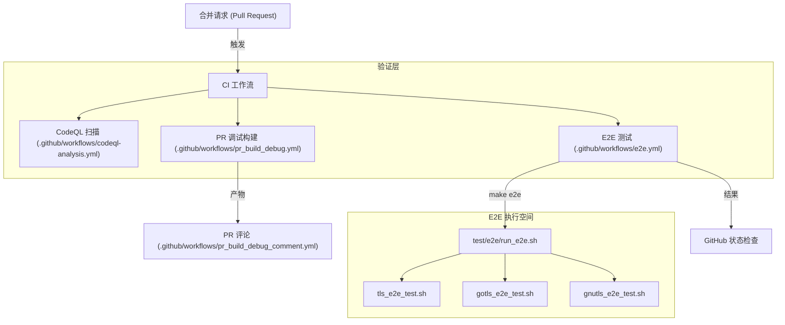
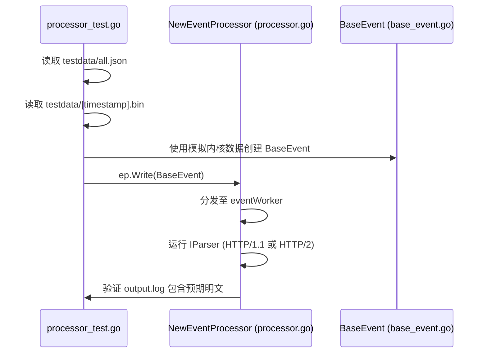

# 测试策略与 CI/CD

相关源文件

以下文件被用作生成此维基页面的上下文：

- [.github/workflows/android_e2e.yml](https://github.com/gojue/ecapture/blob/943a19fe/.github/workflows/android_e2e.yml)
- [.github/workflows/codeql-analysis.yml](https://github.com/gojue/ecapture/blob/943a19fe/.github/workflows/codeql-analysis.yml)
- [.github/workflows/e2e.yml](https://github.com/gojue/ecapture/blob/943a19fe/.github/workflows/e2e.yml)
- [.github/workflows/pr_build_debug.yml](https://github.com/gojue/ecapture/blob/943a19fe/.github/workflows/pr_build_debug.yml)
- [.github/workflows/pr_build_debug_comment.yml](https://github.com/gojue/ecapture/blob/943a19fe/.github/workflows/pr_build_debug_comment.yml)
- [docs/e2e-tests.md](https://github.com/gojue/ecapture/blob/943a19fe/docs/e2e-tests.md)
- [pkg/event_processor/base_event.go](https://github.com/gojue/ecapture/blob/943a19fe/pkg/event_processor/base_event.go)
- [pkg/event_processor/processor_test.go](https://github.com/gojue/ecapture/blob/943a19fe/pkg/event_processor/processor_test.go)
- [pkg/event_processor/testdata/all.json](https://github.com/gojue/ecapture/blob/943a19fe/pkg/event_processor/testdata/all.json)
- [test/e2e/android/android_gotls_e2e_test.sh](https://github.com/gojue/ecapture/blob/943a19fe/test/e2e/android/android_gotls_e2e_test.sh)
- [test/e2e/android/common_android.sh](https://github.com/gojue/ecapture/blob/943a19fe/test/e2e/android/common_android.sh)
- [test/e2e/android/setup_android_env.sh](https://github.com/gojue/ecapture/blob/943a19fe/test/e2e/android/setup_android_env.sh)
- [test/e2e/bash_advanced_test.sh](https://github.com/gojue/ecapture/blob/943a19fe/test/e2e/bash_advanced_test.sh)
- [test/e2e/common.sh](https://github.com/gojue/ecapture/blob/943a19fe/test/e2e/common.sh)
- [test/e2e/ecaptureq_e2e_test.sh](https://github.com/gojue/ecapture/blob/943a19fe/test/e2e/ecaptureq_e2e_test.sh)
- [test/e2e/edge_cases_test.sh](https://github.com/gojue/ecapture/blob/943a19fe/test/e2e/edge_cases_test.sh)
- [test/e2e/gnutls_e2e_test.sh](https://github.com/gojue/ecapture/blob/943a19fe/test/e2e/gnutls_e2e_test.sh)
- [test/e2e/go_https_client.go](https://github.com/gojue/ecapture/blob/943a19fe/test/e2e/go_https_client.go)
- [test/e2e/gotls_advanced_test.sh](https://github.com/gojue/ecapture/blob/943a19fe/test/e2e/gotls_advanced_test.sh)
- [test/e2e/gotls_e2e_test.sh](https://github.com/gojue/ecapture/blob/943a19fe/test/e2e/gotls_e2e_test.sh)
- [test/e2e/run_e2e.sh](https://github.com/gojue/ecapture/blob/943a19fe/test/e2e/run_e2e.sh)
- [test/e2e/tls_e2e_test.sh](https://github.com/gojue/ecapture/blob/943a19fe/test/e2e/tls_e2e_test.sh)
- [test/e2e/tls_keylog_advanced_test.sh](https://github.com/gojue/ecapture/blob/943a19fe/test/e2e/tls_keylog_advanced_test.sh)
- [test/e2e/tls_pcap_advanced_test.sh](https://github.com/gojue/ecapture/blob/943a19fe/test/e2e/tls_pcap_advanced_test.sh)
- [test/e2e/tls_text_advanced_test.sh](https://github.com/gojue/ecapture/blob/943a19fe/test/e2e/tls_text_advanced_test.sh)

eCapture 项目采用多层测试策略，以确保基于 eBPF 的捕获功能在不同 Linux 内核和架构上的可靠性。该策略涵盖了从针对用户态逻辑的本地 Go 单元测试，到在真实硬件/虚拟化内核上运行并集成到健壮的 GitHub Actions CI/CD 流水线中的端到端（E2E）测试。

## 1. 测试层级

### 1.1 Go 单元测试
单元测试侧重于用户态控制平面和事件处理逻辑。这些测试不需要 root 权限或 eBPF 能力，因为它们使用模拟数据或记录的事件流。

*   **事件处理器 (Event Processor)**：验证调度循环、基于 UUID 的亲和性以及事件重组。`TestEventProcessor_Serve` 函数使用 JSON 序列化的事件和二进制负载来模拟内核到用户态的数据流 [pkg/event_processor/processor_test.go:31-114](https://github.com/gojue/ecapture/blob/943a19fe/pkg/event_processor/processor_test.go#L31-L114)。
*   **协议解析器 (Protocol Parsers)**：针对已知字节流测试 `IParser` 实现（HTTP/1.1、HTTP/2），以确保正确提取明文 [pkg/event_processor/processor_test.go:97-101](https://github.com/gojue/ecapture/blob/943a19fe/pkg/event_processor/processor_test.go#L97-L101)。
*   **截断逻辑 (Truncation Logic)**：确保根据配置限制正确处理大型负载 [pkg/event_processor/processor_test.go:116-196](https://github.com/gojue/ecapture/blob/943a19fe/pkg/event_processor/processor_test.go#L116-L196)。

### 1.2 端到端 (E2E) 测试
E2E 测试是 eCapture 验证的核心。它们在真实的 Linux 环境中运行，并针对目标应用程序执行实际捕获。

*   **TLS/OpenSSL**：使用 `curl` 产生流量，并验证 eCapture 是否提取了预期的明文（例如来自 API 响应的 "GitHub"）[test/e2e/tls_e2e_test.sh:59-145](https://github.com/gojue/ecapture/blob/943a19fe/test/e2e/tls_e2e_test.sh#L59-L145)。
*   **GnuTLS**：通过使用兼容版本的 `wget` 或 `curl` 验证对 `libgnutls` 的挂钩 [test/e2e/gnutls_e2e_test.sh:125-220](https://github.com/gojue/ecapture/blob/943a19fe/test/e2e/gnutls_e2e_test.sh#L125-L220)。
*   **GoTLS**：采用自定义的 Go HTTPS 客户端来测试 `gotls` 探针，验证对 Go 内部 ABI 的支持 [test/e2e/gotls_e2e_test.sh:118-213](https://github.com/gojue/ecapture/blob/943a19fe/test/e2e/gotls_e2e_test.sh#L118-L213)。
*   **eCaptureQ**：通过在运行主探针的同时运行 `ecaptureq_client` 来测试 WebSocket 流式传输机制 [.github/workflows/e2e.yml:95-101](https://github.com/gojue/ecapture/blob/943a19fe/.github/workflows/e2e.yml#L95-L101)。

### 1.3 安全与质量扫描
*   **CodeQL**：针对 Go 和 C (eBPF) 代码的自动化静态分析，以检测安全漏洞和逻辑错误 [.github/workflows/codeql-analysis.yml:24-35](https://github.com/gojue/ecapture/blob/943a19fe/.github/workflows/codeql-analysis.yml#L24-L35)。
*   **Codecov**：追踪测试覆盖率，以识别用户态逻辑中未测试的路径 [.github/workflows/codeql-analysis.yml:90-93](https://github.com/gojue/ecapture/blob/943a19fe/.github/workflows/codeql-analysis.yml#L90-L93)。

## 2. CI/CD 架构

CI/CD 系统构建在 GitHub Actions 之上，实现了针对多种架构（x86_64 和 arm64）的构建、测试和发布循环的自动化。

### 构建与测试流水线数据流
此图展示了从 Pull Request 到经过验证的构建产物的流程。

**图表：PR 验证与 E2E 流水线**

Sources: [.github/workflows/e2e.yml:1-22](https://github.com/gojue/ecapture/blob/943a19fe/.github/workflows/e2e.yml#L1-L22), [.github/workflows/pr_build_debug.yml:1-22](https://github.com/gojue/ecapture/blob/943a19fe/.github/workflows/pr_build_debug.yml#L1-L22), [.github/workflows/codeql-analysis.yml:12-35](https://github.com/gojue/ecapture/blob/943a19fe/.github/workflows/codeql-analysis.yml#L12-L35)

### 多架构构建策略
eCapture 使用矩阵策略为不同 CPU 架构的 Linux 和 Android 进行构建。

| 目标操作系统 | 架构 | 工具链 | 产物类型 |
| :--- | :--- | :--- | :--- |
| Linux | amd64 | Clang-14 / GCC | 二进制 / RPM / DEB |
| Linux | arm64 | aarch64-linux-gnu-gcc | 二进制 / RPM / DEB |
| Android | arm64 | Android NDK | 二进制 |

Sources: [.github/workflows/pr_build_debug.yml:19-22](https://github.com/gojue/ecapture/blob/943a19fe/.github/workflows/pr_build_debug.yml#L19-L22), [.github/workflows/pr_build_debug.yml:33-60](https://github.com/gojue/ecapture/blob/943a19fe/.github/workflows/pr_build_debug.yml#L33-L60)

## 3. 实现细节

### 3.1 E2E 测试框架
E2E 测试通过 Bash 脚本进行编排，这些脚本管理 eCapture 进程和目标客户端的生命周期。

*   **设置 (Setup)**：检查 root 权限和内核版本兼容性 [test/e2e/common.sh:32-59](https://github.com/gojue/ecapture/blob/943a19fe/test/e2e/common.sh#L32-L59)。
*   **执行 (Execution)**：在后台启动 eCapture，等待初始化完成，然后触发网络事件 [test/e2e/tls_e2e_test.sh:66-83](https://github.com/gojue/ecapture/blob/943a19fe/test/e2e/tls_e2e_test.sh#L66-L83)。
*   **验证 (Verification)**：使用 `grep` 验证明文模式，并检查 "Failed to decode event" 错误以捕获结构体对齐退化问题 [test/e2e/tls_e2e_test.sh:101-110](https://github.com/gojue/ecapture/blob/943a19fe/test/e2e/tls_e2e_test.sh#L101-L110)。
*   **清理 (Cleanup)**：基于 trap 的 `cleanup_handler` 确保 eCapture 进程被终止并处理临时日志 [test/e2e/tls_e2e_test.sh:29-48](https://github.com/gojue/ecapture/blob/943a19fe/test/e2e/tls_e2e_test.sh#L29-L48)。

### 3.2 自动化发布流水线
当推送标签（tag）时，会调用 `builder/Makefile.release` 来创建生产就绪的二进制文件。
1.  **环境准备**：安装 `llvm`、`clang` 和 `linux-source` [.github/workflows/pr_build_debug.yml:33-47](https://github.com/gojue/ecapture/blob/943a19fe/.github/workflows/pr_build_debug.yml#L33-L47)。
2.  **编译**：运行 `make release`，同时编译 CO-RE 和 non-CO-RE 版本 [.github/workflows/pr_build_debug.yml:67-75](https://github.com/gojue/ecapture/blob/943a19fe/.github/workflows/pr_build_debug.yml#L67-L75)。
3.  **打包**：将二进制文件打包成 `.tar.gz` 并生成校验和。

**图表：事件处理器单元测试数据流**

Sources: [pkg/event_processor/processor_test.go:44-77](https://github.com/gojue/ecapture/blob/943a19fe/pkg/event_processor/processor_test.go#L44-L77), [pkg/event_processor/base_event.go:76-87](https://github.com/gojue/ecapture/blob/943a19fe/pkg/event_processor/base_event.go#L76-L87)

## 4. 关键测试文件

| 文件路径 | 用途 |
| :--- | :--- |
| `.github/workflows/e2e.yml` | 用于 E2E 测试的主要 GitHub Actions 工作流。 |
| `test/e2e/common.sh` | 用于基于 shell 的 E2E 测试的实用函数。 |
| `pkg/event_processor/processor_test.go` | 用户态事件流水线的单元测试。 |
| `.github/workflows/pr_build_debug.yml` | 用于 PR 的跨平台构建验证。 |
| `test/e2e/tls_text_advanced_test.sh` | 高级场景测试（HTTP/2, PID/UID 过滤）。 |

Sources: [.github/workflows/e2e.yml:1-22](https://github.com/gojue/ecapture/blob/943a19fe/.github/workflows/e2e.yml#L1-L22), [test/e2e/common.sh:1-12](https://github.com/gojue/ecapture/blob/943a19fe/test/e2e/common.sh#L1-L12), [pkg/event_processor/processor_test.go:1-30](https://github.com/gojue/ecapture/blob/943a19fe/pkg/event_processor/processor_test.go#L1-L30), [test/e2e/tls_text_advanced_test.sh:1-15](https://github.com/gojue/ecapture/blob/943a19fe/test/e2e/tls_text_advanced_test.sh#L1-L15)