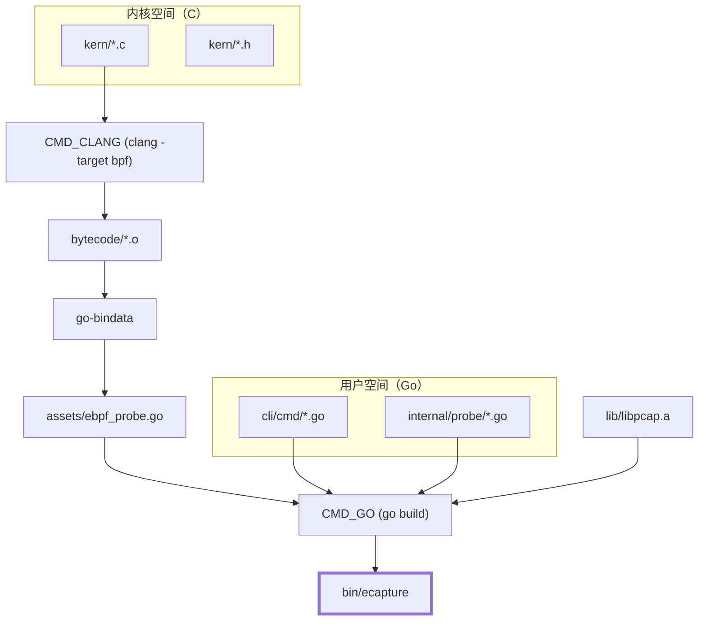
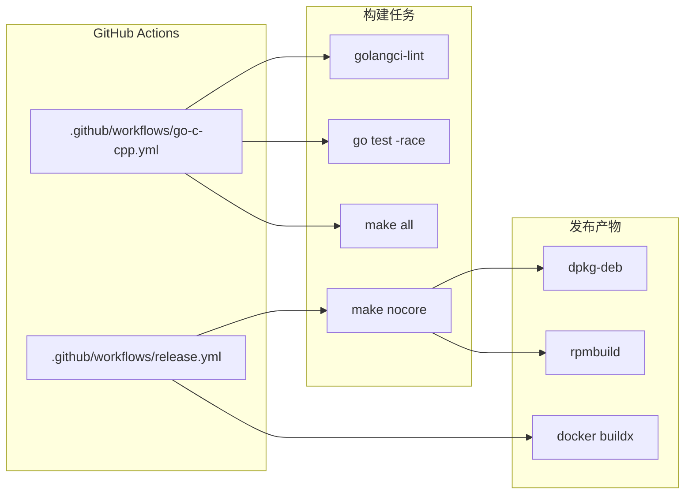

# 开发者指南

相关源文件

以下文件被用作生成此维基页面的上下文：

- [.github/workflows/go-c-cpp.yml](https://github.com/gojue/ecapture/blob/943a19fe/.github/workflows/go-c-cpp.yml)
- [.github/workflows/release.yml](https://github.com/gojue/ecapture/blob/943a19fe/.github/workflows/release.yml)
- [Makefile](https://github.com/gojue/ecapture/blob/943a19fe/Makefile)
- [builder/Dockerfile](https://github.com/gojue/ecapture/blob/943a19fe/builder/Dockerfile)
- [builder/Makefile.release](https://github.com/gojue/ecapture/blob/943a19fe/builder/Makefile.release)
- [builder/init_env.sh](https://github.com/gojue/ecapture/blob/943a19fe/builder/init_env.sh)
- [functions.mk](https://github.com/gojue/ecapture/blob/943a19fe/functions.mk)
- [variables.mk](https://github.com/gojue/ecapture/blob/943a19fe/variables.mk)

开发者指南为希望为 eCapture 项目做出贡献、添加对新软件版本的支持或实现全新探针的工程师提供了必要的技术背景。eCapture 采用多语言技术栈，将 **C** 用于 eBPF 内核态程序，将 **Go** 用于用户态控制平面。

## 构建与编译概述

构建 eCapture 需要一套能够同时编译 Go 代码和 eBPF C 代码的特定工具链。项目支持两种主要的构建模式：**CO-RE**（一次编译，到处运行），依赖 BTF（BPF 类型格式）实现可移植性；以及**非 CO-RE**，针对特定内核头文件编译，用于旧版系统。

构建过程通过 `Makefile` 管理，负责处理：
*   使用 `clang` 和 `llc` 编译 eBPF C 程序。
*   使用 `go-bindata` 将 eBPF 字节码嵌入到 Go 文件中。
*   编译用于数据包捕获支持的静态 `libpcap` 库。
*   启用 `cgo` 构建最终的 Go 二进制文件。

有关详细的安装说明、工具链要求（Clang 14+、Go 1.24+）以及 Android 或 ARM64 的交叉编译，请参见 [源码编译指南](8.1-compilation-and-build.md)。

### 构建系统流程
下图展示了构建系统如何将源代码转换为统一的二进制文件。

**图 1：eCapture 构建流水线**

**Sources:**
*   [Makefile:4-15](https://github.com/gojue/ecapture/blob/943a19fe/Makefile#L4-L15) - 主要构建目标（`all`、`nocore`）。
*   [Makefile:161-166](https://github.com/gojue/ecapture/blob/943a19fe/Makefile#L161-L166) - 通过 `go-bindata` 生成资源。
*   [functions.mk:47-54](https://github.com/gojue/ecapture/blob/943a19fe/functions.mk#L47-L54) - 带 `CGO` 和 `ldflags` 的 `gobuild` 定义。
*   [variables.mk:189-214](https://github.com/gojue/ecapture/blob/943a19fe/variables.mk#L189-L214) - eBPF 源目标列表。

## 扩展 eCapture：添加新探针

eCapture 设计为可扩展的。添加一个新探针通常涉及三层实现：
1.  **内核层**：在 `kern/` 中编写 C 程序，用于挂钩特定函数（例如，对新 SSL 库版本使用 `uprobes`）。
2.  **域层**：在 `internal/domain/` 中实现 `Probe` 和 `EventDecoder` 接口。
3.  **CLI 层**：在 `cli/cmd/` 中添加新的 Cobra 子命令，向用户暴露探针。

有关此过程的分步演练（包括如何在工厂中注册新探针），请参见 [如何添加新探针](8.2-how-to-add-a-new-probe.md)。

**Sources:**
*   [variables.mk:189-214](https://github.com/gojue/ecapture/blob/943a19fe/variables.mk#L189-L214) - 注册新内核目标的位置。
*   [Makefile:139-159](https://github.com/gojue/ecapture/blob/943a19fe/Makefile#L139-L159) - 非 CO-RE 对象的编译逻辑。

## 测试策略与 CI/CD

eCapture 的质量保证通过本地单元测试和自动化 GitHub Actions 工作流的组合来实现。

*   **单元测试**：专注于用户态逻辑，例如事件处理和协议解析（如 HTTP/2）。
*   **CI 工作流**：项目使用 GitHub Actions，针对多种内核配置，自动化 `x86_64`、`arm64` 和 `Android` 的构建。
*   **发布流水线**：自动打包为 `.rpm` 和 `.deb` 格式，以及 Docker 镜像发布。

有关在本地运行测试以及自动化发布流水线的概述，请参见 [测试策略与 CI/CD](8.3-testing-strategy-and-cicd.md)。

### CI/CD 流水线架构
此图将 CI/CD 阶段映射到所使用的具体工作流文件和工具。

**图 2：CI/CD 与发布工作流**

**Sources:**
*   [.github/workflows/go-c-cpp.yml:8-70](https://github.com/gojue/ecapture/blob/943a19fe/.github/workflows/go-c-cpp.yml#L8-L70) - Ubuntu 22.04 CI 构建步骤。
*   [.github/workflows/release.yml:100-114](https://github.com/gojue/ecapture/blob/943a19fe/.github/workflows/release.yml#L100-L114) - 发布快照与发布逻辑。
*   [builder/Makefile.release:141-157](https://github.com/gojue/ecapture/blob/943a19fe/builder/Makefile.release#L141-L157) - DEB 包构建逻辑。
*   [builder/Dockerfile:1-38](https://github.com/gojue/ecapture/blob/943a19fe/builder/Dockerfile#L1-L38) - 多阶段 Docker 构建流程。