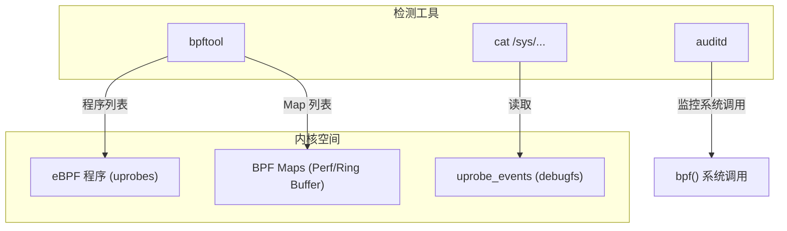
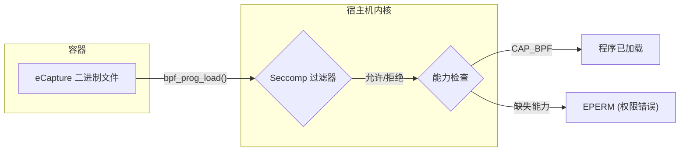
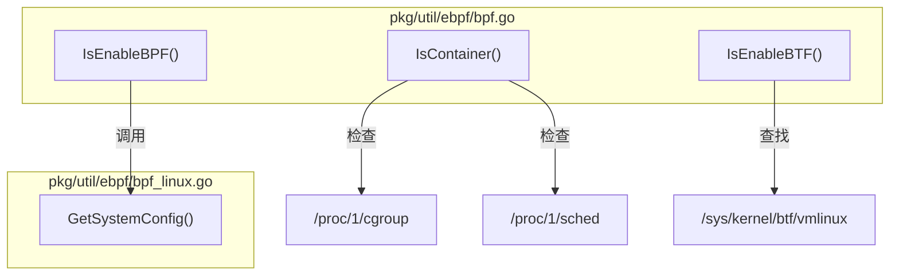

# 检测与防御

<details>
<summary>相关源文件</summary>

以下文件被用作生成此维基页面的上下文：

- [README-zh_Hans.md](https://github.com/gojue/ecapture/blob/943a19fe/README-zh_Hans.md)
- [SECURITY.md](https://github.com/gojue/ecapture/blob/943a19fe/SECURITY.md)
- [docs/README.md](https://github.com/gojue/ecapture/blob/943a19fe/docs/README.md)
- [docs/defense-detection.md](https://github.com/gojue/ecapture/blob/943a19fe/docs/defense-detection.md)
- [docs/example-outputs.md](https://github.com/gojue/ecapture/blob/943a19fe/docs/example-outputs.md)
- [docs/minimum-privileges.md](https://github.com/gojue/ecapture/blob/943a19fe/docs/minimum-privileges.md)
- [docs/performance-benchmarks.md](https://github.com/gojue/ecapture/blob/943a19fe/docs/performance-benchmarks.md)
- [docs/release-verification.md](https://github.com/gojue/ecapture/blob/943a19fe/docs/release-verification.md)
- [pkg/util/ebpf/bpf.go](https://github.com/gojue/ecapture/blob/943a19fe/pkg/util/ebpf/bpf.go)
- [pkg/util/ebpf/bpf_linux.go](https://github.com/gojue/ecapture/blob/943a19fe/pkg/util/ebpf/bpf_linux.go)
- [pkg/util/ebpf/bpf_test.go](https://github.com/gojue/ecapture/blob/943a19fe/pkg/util/ebpf/bpf_test.go)

</details>

eCapture 是一款强大的安全审计工具，它利用 eBPF 拦截明文流量和系统活动。由于它的工作原理是挂载到敏感的库函数（如 `SSL_read` 和 `SSL_write`）以及系统调用上，因此它可能会被未经授权的人员误用来窃取数据。本页面为安全团队提供了检测 eCapture（或类似 eBPF 工具）存在的技术细节，并介绍了限制未经授权的 eBPF 活动的防御层。

## 检测基于 eBPF 的捕获工具

检测重点集中在三个层面：内核的 eBPF 子系统、追踪基础设施（uprobes）以及进程级活动。

### 1. eBPF 程序检查
查找 eCapture 最直接的方法是列出已加载的 eBPF 程序。eCapture 通常加载 `uprobe` 类型的程序来拦截 SSL/TLS 库。

```bash
# 列出所有已加载的 eBPF 程序
sudo bpftool prog list

# 过滤针对 SSL/TLS 函数的 uprobe 类型程序
sudo bpftool prog list | grep -i uprobe
```

### 2. Uprobe 事件监控
eCapture 在内核的追踪子系统中注册 uprobes。这些在 `debugfs` 中是可见的。安全团队应监控针对安全敏感库（如 `libssl.so`、`libgnutls.so` 或 `libnspr4.so`）的异常条目。

```bash
# 检查已注册的 uprobe 事件
sudo cat /sys/kernel/debug/tracing/uprobe_events

# 针对 eCapture 常见目标的特定 grep
sudo cat /sys/kernel/debug/tracing/uprobe_events | grep -E "ssl|SSL|gnutls|nspr"
```

### 3. Perf 事件与 Map 监控
eCapture 使用 eBPF maps（特别是 `BPF_MAP_TYPE_PERF_EVENT_ARRAY` 或 `BPF_MAP_TYPE_RINGBUF`）将捕获的明文流回用户空间。

```bash
# 列出 eBPF 使用的 perf event arrays
sudo bpftool map list | grep -i perf
```

### 4. 进程与系统调用审计
标准的进程监控和 Linux 审计（`auditd`）可以捕获 eCapture 二进制文件的执行或 `bpf()` 系统调用的调用。

```bash
# 通过 auditd 监控 bpf() 系统调用
sudo auditctl -a always,exit -F arch=b64 -S bpf -k bpf_activity

# 监控对追踪文件系统的访问
sudo auditctl -w /sys/kernel/debug/tracing/ -p rwa -k tracing_access
```

### 检测数据流
下图说明了安全工具如何与内核交互以检测 eCapture 的组件。

**检测机制映射**

**Sources:** [docs/defense-detection.md:7-48](https://github.com/gojue/ecapture/blob/943a19fe/docs/defense-detection.md#L7-L48), [pkg/util/ebpf/bpf.go:25-28](https://github.com/gojue/ecapture/blob/943a19fe/pkg/util/ebpf/bpf.go#L25-L28)

---

## 防御策略

防御应遵循最小权限原则，限制谁可以加载 eBPF 程序以及它们拥有的能力。

### 1. 限制 eBPF 访问
最有效的防御措施是禁用非特权 eBPF，并将 `bpf()` 系统调用仅限制给授权用户。

| 操作 | 命令 / 配置 |
| :--- | :--- |
| **禁用非特权 BPF** | `sysctl -w kernel.unprivileged_bpf_disabled=1` |
| **持久化** | 添加至 `/etc/sysctl.d/99-disable-bpf.conf` |

### 2. Linux 安全模块 (LSM)
使用 AppArmor 或 SELinux 可以对 `bpf`、`perfmon` 和 `sys_ptrace` 能力进行细粒度控制。

*   **AppArmor**: 创建一个显式拒绝 `capability bpf` 和 `capability perfmon` 的配置文件。
*   **SELinux**: 监控并阻止与 BPF 相关的 AVC（访问向量缓存）拒绝记录。

### 3. 容器加固
eCapture 经常在容器中运行以实现便携性。安全团队必须避免使用 `--privileged` 标志，因为它会绕过几乎所有的内核安全检查。

**容器深度防御**

**Sources:** [docs/defense-detection.md:58-94](https://github.com/gojue/ecapture/blob/943a19fe/docs/defense-detection.md#L58-L94), [docs/minimum-privileges.md:75-104](https://github.com/gojue/ecapture/blob/943a19fe/docs/minimum-privileges.md#L75-L104)

---

## eCapture 的合法边界

eCapture 专为授权的安全审计而设计。它会执行自身的环境检查，以确保在拥有必要（但最小）权限的情况下运行。

### 能力 (Capability) 要求
eCapture 在启动时会检查特定的能力以确保功能正常。

| 能力 | 在 eCapture 中的角色 | 模式要求 |
| :--- | :--- | :--- |
| `CAP_BPF` | 加载 eBPF 字节码 | 全部 (内核 >= 5.8) |
| `CAP_PERFMON` | 从 perf buffers 读取数据 | 全部 (内核 >= 5.8) |
| `CAP_SYS_PTRACE` | 读取 `/proc/<pid>/maps` 获取符号偏移量 | 全部 |
| `CAP_NET_ADMIN` | 挂载 TC 过滤器用于数据包捕获 | `pcapng` 模式 |
| `CAP_SYS_ADMIN` | 传统的 BPF 通用权限 | 全部 (内核 < 5.8) |

### 环境检测逻辑
eCapture 包含内部逻辑来检测它是否在容器中运行，或者系统是否启用了 BTF (BPF Type Format)，这决定了它如何加载 eBPF 程序（CO-RE 与 Non-CO-RE）。

**代码实体映射：环境检查**

**Sources:** [pkg/util/ebpf/bpf.go:118-191](https://github.com/gojue/ecapture/blob/943a19fe/pkg/util/ebpf/bpf.go#L118-L191), [pkg/util/ebpf/bpf_linux.go:48-80](https://github.com/gojue/ecapture/blob/943a19fe/pkg/util/ebpf/bpf_linux.go#L48-L80), [检测与防御](../2-getting-started/2.2-minimum-privileges.md)

### 负责任使用清单
对于合法部署，安全团队应当：
1.  **授权**：使用 `setcap` 为二进制文件授予特定能力，而不是以 root 身份运行 [检测与防御](../2-getting-started/2.2-minimum-privileges.md)。
2.  **范围控制**：使用 `--pid` 标志将捕获限制在特定的目标进程 [检测与防御](../4-integration-and-deployment/4.4-performance-overhead-and-benchmarks.md)。
3.  **监控**：使用 `ss -tlnp | grep 28256` 确保远程配置 API 仅在预期的接口上监听 [检测与防御](#6)。
4.  **验证**：在部署前始终验证 eCapture 二进制文件的 SHA256 校验和 [安装指南与先决条件](../2-getting-started/2.1-installation-and-prerequisites.md)。

**Sources:** [SECURITY.md:70-74](https://github.com/gojue/ecapture/blob/943a19fe/SECURITY.md#L70-L74), [docs/defense-detection.md:151-167](https://github.com/gojue/ecapture/blob/943a19fe/docs/defense-detection.md#L151-L167)